AIRLab Software Analysis
============================
.. toctree:: 
    :maxdepth: 5

The initial interface of the AIRLab software is shown in Figure 3-1 and is divided into five main sections. In the middle of the interface is the main display box (divided into scene display and camera display), on the top is the menu bar, on the leftmost side is the project tree, on the rightmost side is the operation area, and at the bottom of the interface is the command feedback area. This section provides a detailed description of the functions and usage of the above areas, the pop-up windows and other pages that appear in the AIRLab software, and the sub-page functions.

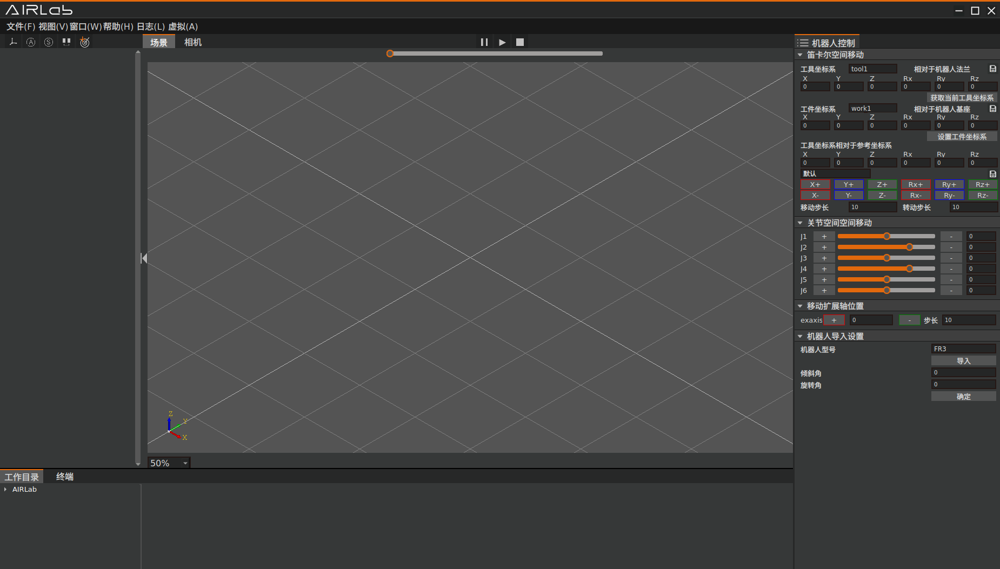

.. centered:: Figure 3-1  AIRLab Software Initial Interface

Menu Bar
--------------------------
The menu bar contains all the contents shown in Figure 3-2, mainly buttons: "File", "View", "Window", "Help ", "Log", "Virtual", and the icon buttons (in order from left to right): 3D Sphere, Mode Switching, Running Status, Ros2 Communication, Points Added, Pause Running, Start Running, Stop Running.

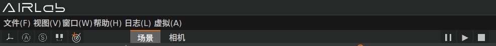

.. centered:: Figure 3-2  AIRLab Menu Bar

File
~~~~~~~~~~~~~~~~~~~
Click the "File" button, the "File Settings" pop-up window will appear, as shown in Figure 3-3. This pop-up window contains three functions: create, open or export a welding JSON file, the use of the following methods (for details, refer to the section on pop-up window analysis): 

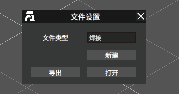

.. centered:: Figure 3-3  AIRLab Menu Bar-File Settings Popup Window

- New Project: If the user needs to create a new welding project, select the file type as "Welding", and then click "New" to create and open a new welding program, as shown in Figure 3-4;

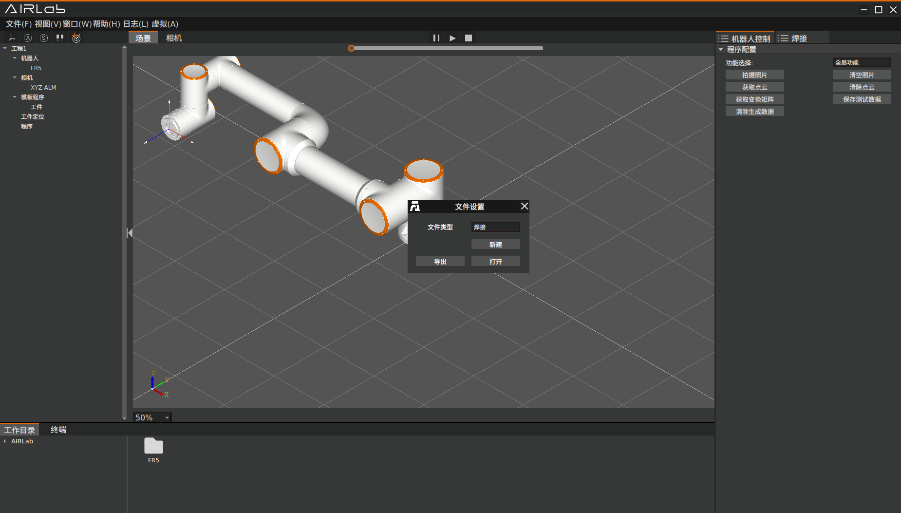

.. centered:: Figure 3-4  AIRLab Menu Bar-File Settings-New 

- Import project: If the user needs to open the existing welding file, click "Open", and then enter the work path to find the file to be imported, click "Open" to select a file to import, as shown in Figure 3-5;

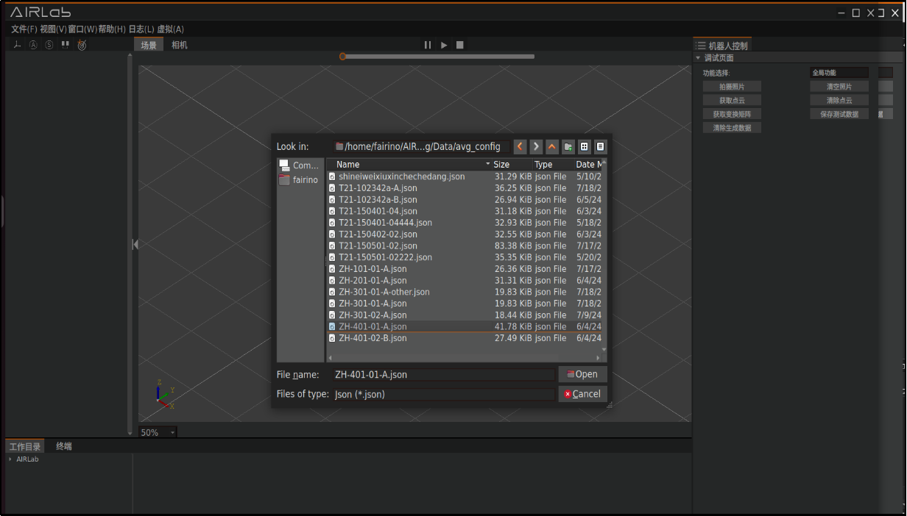

.. centered:: Figure 3-5  AIRLab Menu Bar - File Settings - Open

- Export project: If users need to save the welding file currently being used, click "Export", select the export path, set the export file name, click "Save", the current welding project will be saved, as shown in Figure 3-6.

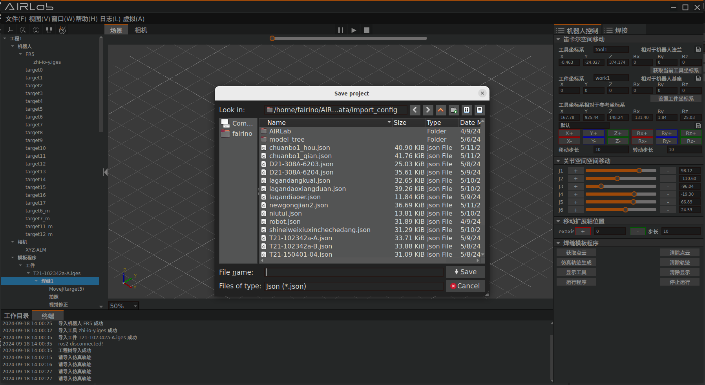

.. centered:: Figure 3-6  AIRLab Menu Bar-File Settings-Export

View
~~~~~~~~~~~~~~~~~~~
View contains 12 functions, as shown in Figure 3-7, the main function is to adjust the viewing angle of the robot in the main display frame. They are: Zoom, Pan, Rotate, Reset, Fit all, Front view, Back view, Top view, Bottom view, Left view, Right view, and Full view.

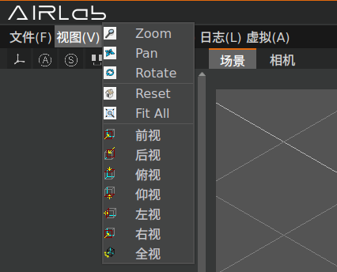

.. centered:: Figure 3-7  AIRLab Menu Bar - View

See Table 3-1 for a description of the specific functions of the view.

.. centered:: Table 3-1  View Function Description Table

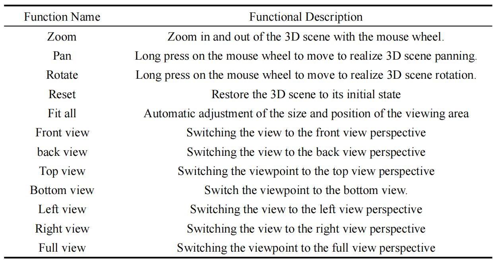

Window
~~~~~~~~~~~~~~~~~~~
The "Window" contains five secondary options, namely "Robot Control", "Other Controls", "Simulation Simulation", "Debug Page" and "Program Configuration". When you click on different options, the corresponding function pages will be displayed in the operation area on the right side of the AIRLab software, as shown in Figure 3-8, of which the "Robot Control" page is shown in Figure 3-9, the "Other Control" page is shown in Figure 3-10, and the "Simulation" page is shown in Figure 3-10. The "Simulation" page is shown in Figure 3-11, the "Debugging" page is shown in Figure 3-12, and the "Program Configuration" page is shown in Figure 3-13.

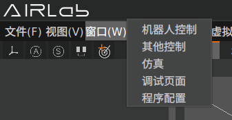

.. centered:: Figure 3-8   AIRLab Menu Bar-Window

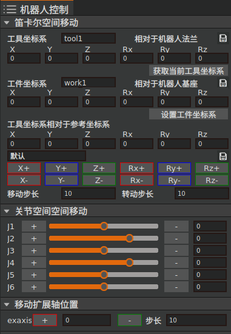

.. centered:: Figure 3-9  AIRLab Menu Bar-Window-Robot Controls    

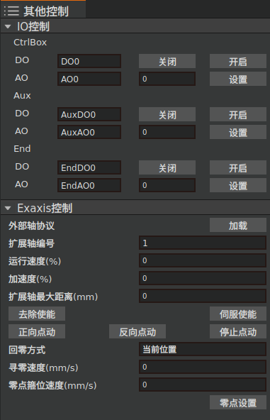

.. centered:: Figure 3-10  AIRLab Menu Bar-Window-Other Controls

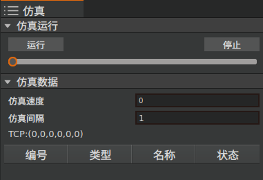

.. centered:: Figure 3-11  AIRLab Menu Bar-Window-Simulation

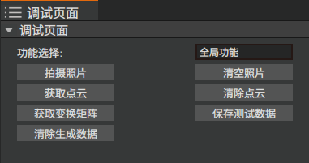

.. centered:: Figure 3-12  AIRLab Menu Bar-Window-Debug Page

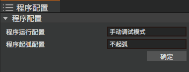

.. centered:: Figure 3-13  AIRLab Menu Bar-Window-Program Configuration

Help
~~~~~~~~~~~~~~~~~~~
Not open at this time.

Log
~~~~~~~~~~~~~~~~~~~
Logs are used to record information about the system's operation and exceptions, and can be used to quickly locate problems. Clicking this button will bring up a "Log Level" pop-up window. Logging is divided into four levels, namely INFO, WARNING, ERROR, DEBUG, select the log level and set the current log level (default INFO). As shown in Figure 3-14, see Table 3-2 for the specific meaning.

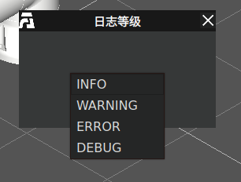

.. centered:: Figure 3-14  AIRLab Menu Bar-Logs

.. centered:: Table 3-2 View Function Description Table

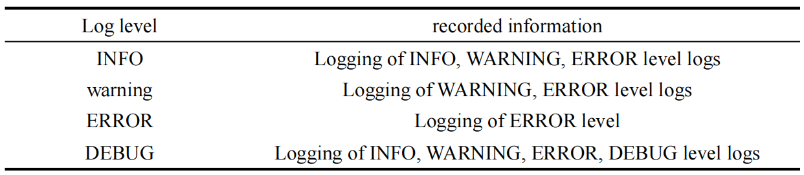

Virtual
~~~~~~~~~~~~~~~~~~~
This button is used to switch between the virtual robot and the physical robot, before using it, you need to successfully import or create a JSON file (otherwise, the error message in Figure 3-15 will appear), and with the physical robot to successfully establish Ros2 communication connection. After completing the above prerequisites click on the button to achieve the virtual robot and the entity robot switch between the two, after switching between the real machine as shown in Figure 3-16. virtual scene: used for simulation will not be synchronized in real time to update the robot position in the three-dimensional scene; entity scene: update the current tool coordinate system, the DH compensation parameters consistent with the actual robot, the robot position in the three-dimensional scene is the same as the entity robot.

.. figure:: analysis/3.0/4-15.png
	:align: center
	:width: 3in

.. centered:: Figure 3-15  JSON file not imported during virtual switchover

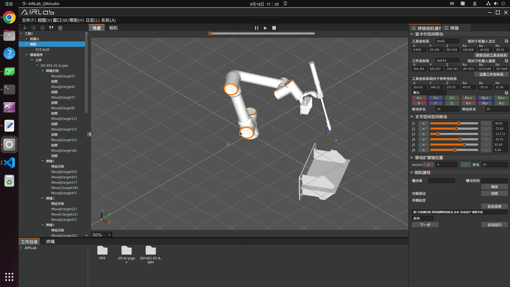

.. centered:: Figure 3-16  AIRLab display after live switching

3D Sphere
~~~~~~~~~~~~~~~~~~~
Not open at this time.

Mode switching
~~~~~~~~~~~~~~~~~~~
After the AIRLab software establishes Ros2 communication with the physical robot, the user can switch the mode status of the physical robot by clicking on this button. a means that the current robot is in automatic mode, and M means that the current robot is in manual mode. In addition, clicking this icon in automatic mode will switch the robot mode to manual, and clicking this icon in manual mode will switch the robot mode to automatic.

Running status
~~~~~~~~~~~~~~~~~~~
The icon button is used to display in real time the current operational status of the physical robot, where S indicates that the robot has stopped running, R indicates that the robot is in the middle of a running program, and P indicates that the robot is in a suspended operational state.

ROS2 communication
~~~~~~~~~~~~~~~~~~~
The icon button is used to monitor the connection status of the camera and ROS2 in real time, when the communication between the camera and ROS2 are connected successfully or ROS2 is connected successfully and the camera is not connected, the icon will show the connection success, as in Figure 3-17a; otherwise the icon shows the connection failure, as in Figure 3-17b.

.. centered:: Figure 3-17a  ROS2 Communication Connected Successfully

.. figure:: analysis/3.0/4-17b.png
	:align: center
	:width: 1in

.. centered:: Figure 3-17b  ROS2 Communication Not Connected
.. centered:: Figure 3-17  ROS2 Communication Connection Status

Points added
~~~~~~~~~~~~~~~~~~~
This function is used to quickly record the current point position of the robot. After clicking the button, a new point position targetX will be added under the "Robot" node in the project tree, and the function of X is to prevent the new point position from being renamed, as shown in Figure 3-18. The j1, j2, j3, j4, j5, j6, x, y, z, rx, ry, rz information of this point is the current joint coordinates and Cartesian coordinates of the robot.

.. figure:: analysis/3.0/4-18.png
	:align: center
	:width: 2.5in

.. centered:: Figure 3-18  AIRLab Menu Bar - Point Additions

Pause running
~~~~~~~~~~~~~~~~~~~
Pause/Resume button. Clicking this button will immediately pause the currently running robot program, and pressing it again will resume the robot, continuing the program from where it was paused.

Start running
~~~~~~~~~~~~~~~~~~~
Click the button, the solid robot will first run all the commands under the "Workpiece Positioning" node in the engineering tree, after the successful positioning of the workpiece, the robot starts to run all the weld programs under the "Template Program" node, as in Fig. 3-19, after the successful identification of the weld, the robot executes all the weld commands under the "Program" node. After successful identification of the weld, the robot executes all the welding instructions under the "Program" node.

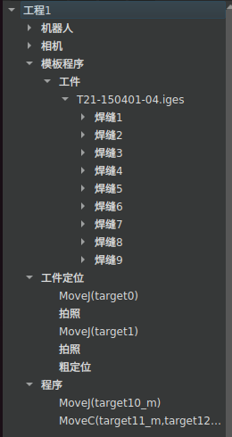

.. centered:: Figure 3-19  Start Run Button Function

Stop running
~~~~~~~~~~~~~~~~~~~
Clicking on the button immediately stops the robot that is running the program. The difference between this button and the pause/resume button is that the robot cannot be resumed by pressing this button again, but can only be restarted with the start running button.

Main Frame
--------------------------
The main display box is divided into scene display and camera display, where the scene mainly displays the robot, tool, workpiece, extended axis model, etc., as in Figure 3-20. the camera mainly displays the obtained point cloud map, as in Figure 3-21.

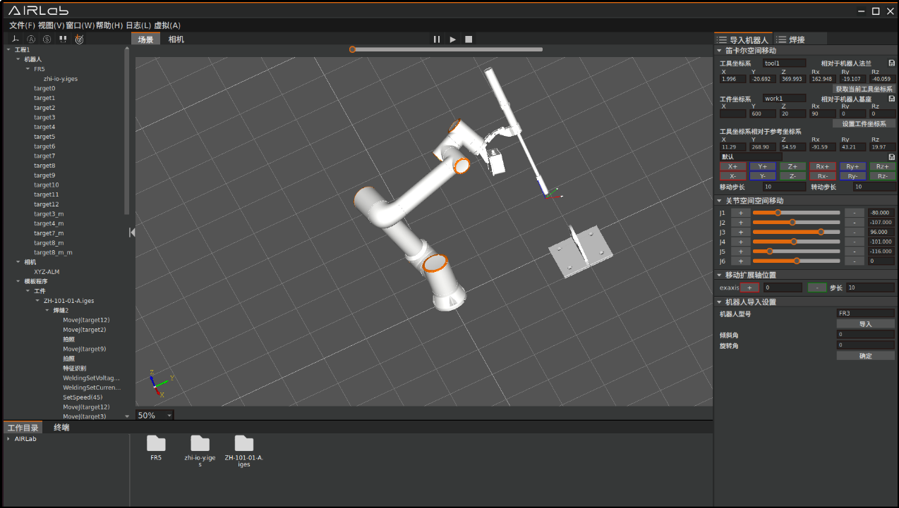

.. centered:: Figure 3-20  AIRLab Main Display Box - Scene Display

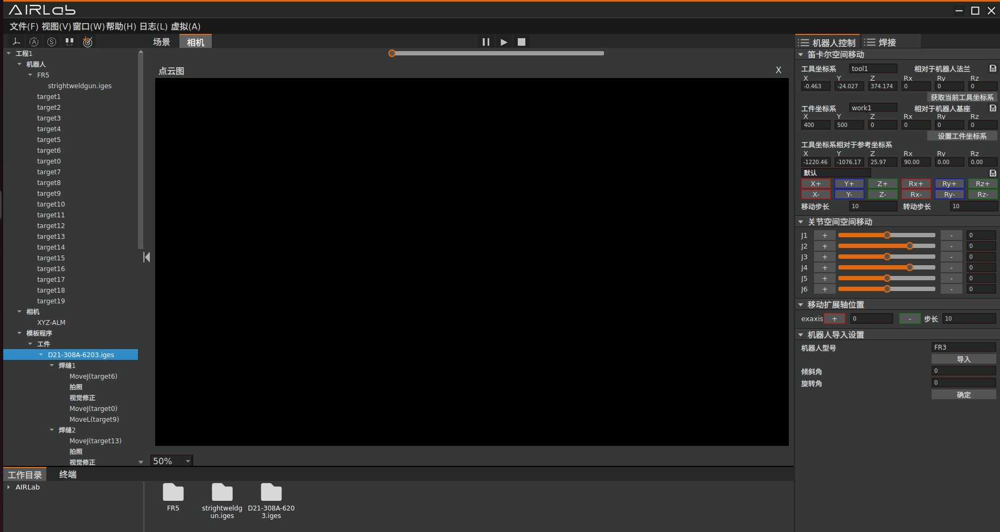

.. centered:: Figure 3-21  AIRLab Main Display Frame-Camera Display

Command Feedback Area
--------------------------
Instruction Feedback Area. It is divided into two options, the working directory and the terminal, where the working directory displays the current robot model, tools, and workpiece model, as in Figure 3-22, and the terminal displays the results of the execution of program commands and the returned robot error messages, as in Figure 3-23.

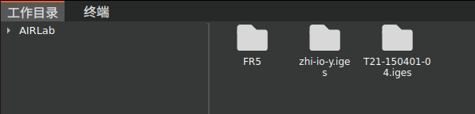

.. centered:: Figure 3-22  AIRLab Command Feedback Area-Working Directory

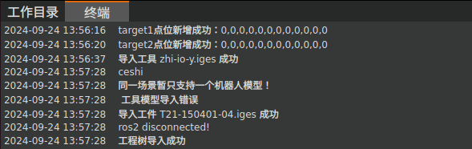

.. centered:: Figure 3-23  AIRLab Command Feedback Area-Terminal

Operating Area
--------------------------

Cartesian space movement
~~~~~~~~~~~~~~~~~~~~~~~~~~~
This area includes four parts: tool coordinate system, workpiece coordinate system, tool coordinate system relative to the reference coordinate system, and long press tap trigger, move step and rotate step settings, as shown in Figure 3-24.

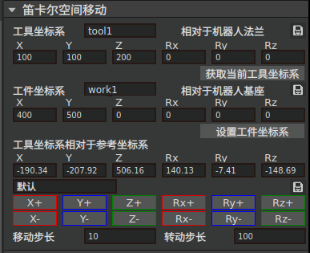

.. centered:: Figure 3-24  AIRLab Operation Area-Cartesian Space Movements

- Tool Coordinate System section. There are 15 numbers tool0-tool14 in the drop-down list of tool coordinate system, after selecting the corresponding coordinate system (the name of the coordinate system can be customized), the corresponding coordinate values will be displayed in the text boxes of X, Y, Z, Rx, Ry, Rz below, and the tool coordinate system of the virtual robot will be changed accordingly in the scene display box by changing the values of the above six text boxes. Click the "Get current tool coordinate system" button to get the current tool coordinate system of the robot.

- In the Workpiece Coordinate System section, the drop-down list for the workpiece coordinate system also has 15 numbers work0-work14, and setting the values in the textboxes X, Y, Z, Rx, Ry, and Rz changes the position of the workpiece in the AIRLab software scene display box. By clicking on the "Set Work Coordinate System" button, the robot will send the tool coordinate system from the 3D scene to the actual robot and apply it.

.. important::
    When setting the tool/workpiece coordinate system number, it should be the same as the current tool coordinate system number and workpiece coordinate system number of the robot on the Web side.

- The Tool Coordinate System Relative to Reference Coordinate System section, which shows the value of the tool coordinate system relative to the reference coordinate system.

- Long press tap trigger, move step and rotate step setting section. As shown in Figure 3-25, if the currently imported robot model is a solid robot, long press the X+ button, the solid robot will execute the X+ tap command; if the currently imported robot model is not a solid robot, long press the X+ button, the simulation robot will execute the X+ tap command.

.. important::
    To control the robot's JOG pointing by long-pressing the buttons, if the buttons are released while the robot is running, the robot will stop moving immediately; if the buttons are held down all the way and not released, the robot will run the value of the set rotation step and then stop moving. the X-, Y+, Y-, Z+, Z- buttons operate in the same way. If the Rx+, Rx-, Ry+, Ry-, Rz+, Rz- buttons are pressed and held down, the robot will otherwise remain unchanged, except that it will move according to the set value of the rotation step.

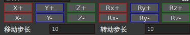

.. centered:: Figure 3-25  AIRLab Operation Area-Long Press Tap

Joint space space movement
~~~~~~~~~~~~~~~~~~~~~~~~~~~~~
This area includes 12 joint coordinate long press trigger buttons for joints J3-J6, 6 joint coordinate change text boxes and 6 joint sliders in three parts, as shown in Figure 3-26.

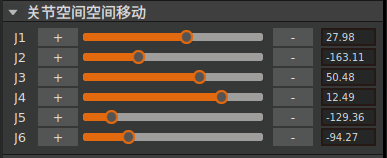

.. centered:: Figure 3-26  AIRLab Operation Area-Joint Space Spatial Movement

- You can control the movement of the solid robot J1 joints in manual mode and joint coordinate system by long-pressing the "+" or "-" button of J1. " button to control the movement of the J1 joints of the solid robot in manual mode and in the joint coordinate system. The "+" or "-" buttons of the other joints operate in the same way.

.. important::
    The robot operation is controlled by long-pressing the button. If the button is released while the robot is running, the robot will stop moving immediately; if the button is held down all the time, the robot will run the set value of Move Step/Rotate Step and then stop moving.

- The 6 text boxes are updated in real time to show the angle values of the 6 joints of the robot. In addition, editing the values in the 6 textboxes can also be used to control the movement of the robot's joints (care should be taken not to exceed the soft limits of the robot's joint angles when editing).

- The function of the joint slots is that the user can slide the joint slots to realize the movement of each joint of the robot, and the joint angles represented by the slots are displayed by the values in the text box.

Moving extended axis settings
~~~~~~~~~~~~~~~~~~~~~~~~~~~~~~~
This section includes "exaxis+", "exaxis-" and the step setting box, as shown in Figure 3-27. "exaxis+", "exaxis-" functions are similar to the pointing X+ and X- under the tool coordinate system, and the motion of the extended axis can be controlled by the above two buttons. Long press the button to control the extended axis running, if you release the button during the extended axis running, the extended axis will stop moving immediately; if you keep pressing the button and do not release it, the extended axis will run the value set in the Step Setting box and then stop moving.

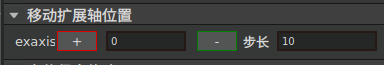

.. centered:: Figure 3-27  AIRLab Operation Area-Moving the Extended Axis Position

Engineering Tree
--------------------------
The project tree generally consists of 5 objects, namely: robot, camera, template program, workpiece positioning, and program. The following describes the functions and usage of the project tree from the perspective of creating a new weld file.

New JSON file
~~~~~~~~~~~~~~~~~~~
Click on "File" in the menu bar, select New in the "File Settings" pop-up window, and a template project will appear in the project tree. Including robot, camera, template program, workpiece positioning, program 5 node objects, which node "robot" under the robot FR5, node "camera" under the camera "XYZ-ALM ", as shown in Figure 3-28.

.. figure:: analysis/3.0/4-28.png
    :align: center
    :width: 7.5in

.. centered:: Figure 3-28  AIRLab Project Tree - New

Importing robot models
~~~~~~~~~~~~~~~~~~~~~~~~~
Double-click on the "Robot" node in the project tree, and the "Robot Import Settings" sub-page will be switched to the right side of the AIRLab software. Select the desired robot model (e.g. FR3) in the Robot Model ComboBox and click the "Import" button, as shown in Figure 3-29. The imported FR3 node will appear under the "Robot" node in the project tree, the command feedback area will return the result of "Imported robot FR3 successfully", and the FR3 robot model will appear in the scene display box.

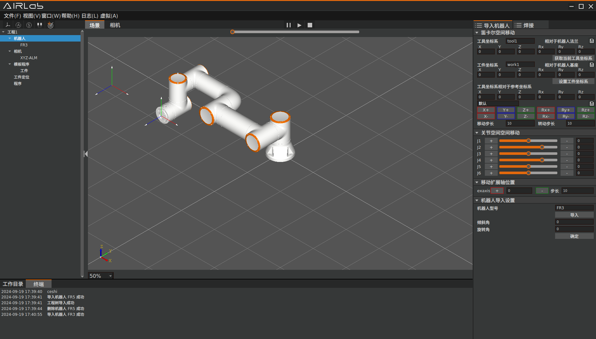

.. centered:: Figure 3-29  AIRLab Project Tree - Importing Robots

.. important::
    If you need to replace the robot model, first of all, you need to delete the imported robot model FR5 in the project tree, the specific operation is as follows: select the FR5 node with the mouse and then right-click on it, the option "Remove Item" appears, click on the option, the FR5 will be deleted successfully, and the feedback area at the bottom of the command will return to The bottom command feedback area returns "Delete robot FR5 successfully", as in Figure 3-30.   

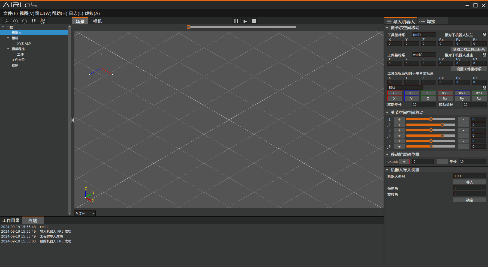

.. centered:: Figure 3-30  AIRLab Engineering Tree - Replacing Imported Robot Models

Import tool
~~~~~~~~~~~~~~~~~~~
Mouse select "FR3" node in the project tree, AIRLab software will switch to the right side of the "tool import settings" sub-page, click the "Open" button, in the emergence of the "Select tool" pop-up window, select the required tool can be, as shown in Figure 3-31. "Select tool" pop-up window, select the tool you need, as shown in Figure 3-31. After the tool is successfully imported, the command feedback area returns "import tool zhi-io-y.iges successfully" results, as shown in Figure 3-32.

.. figure:: analysis/3.0/4-31.png
    :align: center
    :width: 7.5in

.. centered:: Figure 3-31  AIRLab Project Tree-Import Tool

.. figure:: analysis/3.0/4-32.png
    :align: center
    :width: 7.5in

.. centered:: Figure 3-32  AIRLab Project Tree-Tools Imported Successfully

If you need to replace the imported tool, you must first delete the imported tool, and then re-import the new tool, otherwise it will prompt the error "The same scene only supports one tool model! As shown in Figure 3-33. Delete the tool is also the operation of the mouse to select the imported tool node in the project tree, and then right-click to select the option "Remove Item", click to complete the deletion of the tool, the command feedback area will also return to the results of the tool deletion, deletion of the tool can only be restarted after the success of the user can start importing tools.

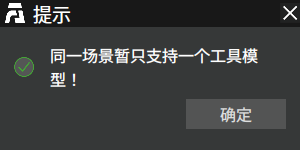

.. centered:: Figure 3-33  AIRLab Project Tree-Repeat Import Tool Model

Import camera
~~~~~~~~~~~~~~~~~~~
The initial camera model in the project tree is "XYZ-ALM", if you need to replace the camera with another model, select the XYZ-ALM node in the project tree with the mouse, right-click and select the option "Remove Item", and then click on it to complete the deletion of the XYZ-ALM model. Remove the XYZ-ALM model. Re-import other models of cameras as follows: Click the mouse to select the "Camera" node in the project tree, the right side of the AIRLab software will switch to the "Camera Selection" sub-page, as shown in Figure 3-34, select the model of the ComboBox, click on the camera model, and then click "OK". model, and then click the "OK" button to complete the import of new models of cameras.

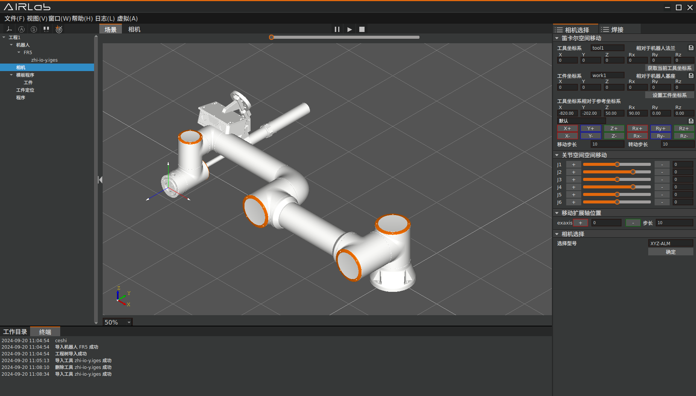

.. centered:: Figure 3-34  AIRLab Project Tree-Import Camera

Importing workpieces
~~~~~~~~~~~~~~~~~~~~~~~
Click on the node "Workpiece" under "Template Program" in the project tree, the right side of AIRLab software will switch to "Workpiece Import Settings" sub-page, click on the "Open" button, select the required workpiece in the "Select wobj" pop-up window that appears. "Open" button, in the "Select wobj" pop-up window that appears, select the desired workpiece, such as Figure 3-35. After the import is successful, the "Workpiece" node of the project tree will increase the number of imported workpieces under the node. node of the project tree will be added under the node "Artifacts", and the bottom command feedback area will return the result of "Imported artifact T23-150403-04.iges successfully", as shown in Figure 3-36.

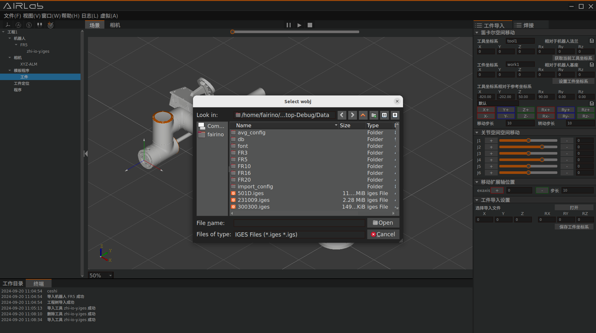

.. centered:: Figure 3-35  AIRLab Project Tree - Importing Artifacts

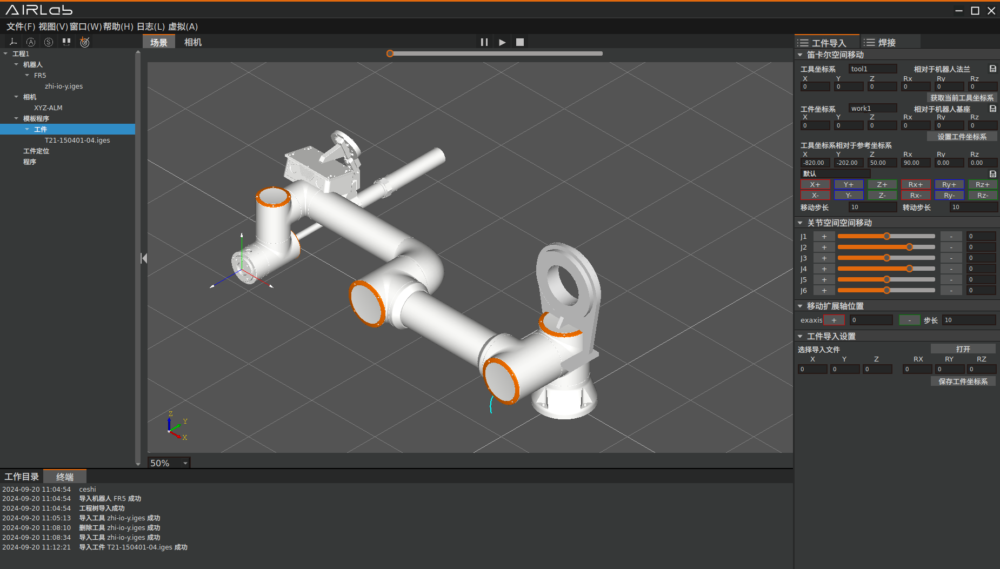

.. centered:: Figure 3-36  AIRLab Project Tree-Artifacts Imported Successfully    

These are all the import requirements involved in the project tree, and the following describes the function and usage of workpiece positioning.

Workpiece positioning
~~~~~~~~~~~~~~~~~~~~~~~
The robot needs to complete the import and workpiece positioning before running the welding program. This section will introduce the content of workpiece positioning based on the completion of the import, which is mainly divided into two parts: one is how to create your own workpiece positioning program; the other is how the user should run the successful creation of the workpiece positioning program.

Part I: How to create a workpiece positioning program

Select the "Workpiece Positioning" node in the project tree with the mouse, and the following options will appear when you right-click on it, as shown in Figure 3-37. The main commands used in workpiece localization are "MoveJ", "Take photo" and "Rough positioning", in workpiece localization, the robot needs to run to a suitable position to take a photo of the workpiece through the MoveJ command, and then use the photo to take a photo of the workpiece through the "Rough positioning" command. In workpiece positioning, the robot needs to run to a suitable position by the MoveJ instruction to take a photo of the workpiece, and then use the photo to obtain the actual relative position of the workpiece and the robot by the "coarse positioning" function. Therefore, the first step in creating a workpiece positioning program should be to determine where the robot will take pictures and record these points.

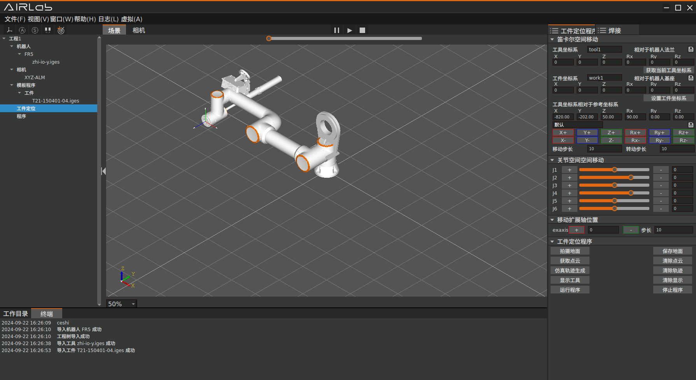

.. centered:: Figure 3-37  AIRLab Project Tree - Workpiece Positioning

- Step1: Record the camera's photo points

  Operation method: You can move the robot to a suitable photo position by manual mode, and then click on the Add Points icon button in the menu bar of the AIRLab software, you can add the point target0 under the node "Robot" in the project tree, and the command feedback area will return the result of adding points, as shown in Figure 3-38. The first 6 digits of the point information represent the joint coordinates of the robot at the position, and the last 6 digits represent the Cartesian coordinates of the robot. Other points are added in the same way as target0. Double-click the project tree node to customize the node name (please use target as the prefix for the customized name), and click the point node in the project tree to jump to the point modification sub-interface, where you can realize the modification of the current saved point position.

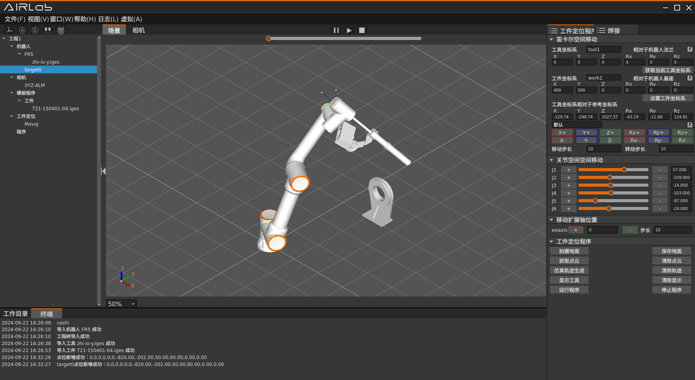

.. centered:: Figure 3-38  AIRLab Project Tree-Added Points

.. important::
    If you need to modify the information of the added points, such as target0, the operation is as follows: click the mouse to select the child node "target0" in the project tree, and then the right side of the AIRLab software will switch to the "Modify point information" sub-page, where you can modify the name, joint coordinates, Cartesian coordinates and other information of target0, and then click the button "Teach current position". The right side of AIRLab software will switch to the "Modify Point Information" sub-page, where you can modify the name, joint coordinates, Cartesian coordinates and other information of target0, and then click the button "Teach Current Position" after the modification is completed. At this time, the information of target0 node in the project tree will be updated and the result of modifying the position will be returned in the command feedback area. For more details, please refer to the subpage Explanation - Point Modification.

- Step2: After adding new points successfully, create a work positioning program

  Select the "Workpiece Positioning" node with the mouse, right-click and select "MoveJ", then the "MoveJ" sub-node will be added under the "Workpiece Positioning" node in the project tree. Select the node with the mouse, right-click and two options will appear: "Associated Target Point" and "Remove Item", select "Associated Target Point", the name of the existing point will appear in the project tree. Select "Associated Target Point", and the point names in the project tree will appear. Select the associated point according to the actual situation, of which MoveJ and MoveL commands only need a target point, MoveC and Circle commands need to be associated with two points. As shown in Figure 3-39, the meaning of this program is that the robot will move from the current position to the target0 point position by MoveJ motion.

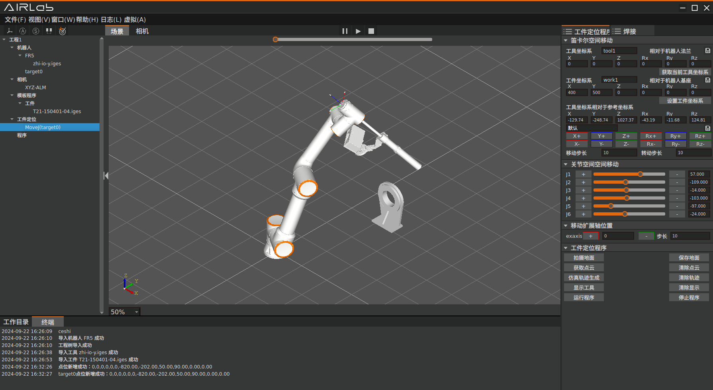

.. centered:: Figure 3-39  AIRLab Project Tree-New MoveJ Command

If you want to delete the program instruction, select the instruction and right-click on it to select "Remove Item".

- Step3: The robot reaches the point target0 and starts taking pictures of the workpiece

  Operation method: Select the "Workpiece Positioning" node in the project tree, right-click and select "Take Picture", click to add the instruction in the Workpiece Positioning node, as shown in Figure 3-40, see the sub-page analysis chapter for detailed parameter settings. The method of adding other photo points remains unchanged, and users can add any number of MoveJ and photo commands according to actual needs.

.. centered:: Figure 3-40  AIRLab Project Tree-Add Photo Instruction

- Step4: The last step is to add the "Coarse Positioning" command

  The method of adding commands remains unchanged. After the coarse positioning command is added successfully, set the related parameters through the subpage "Coarse Positioning Setting", as shown in Figure 3-41, and the details are shown in the chapter of subpage analysis.

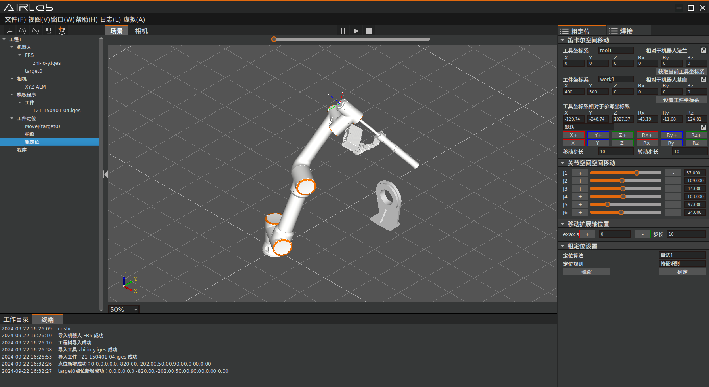

.. centered:: Figure 3-41  AIRLab Project Tree-New Coarse Positioning Instruction

Part II: How to Run the Workpiece Positioning Program to Create Successful Workpieces

Operation method: Select the "Workpiece Positioning" node in the project tree, and the "Workpiece Positioning Program" sub-page will be switched on the right side of the AIRLab software. First, click the "Simulation Trajectory Generation" button to view the simulation trajectory curve of the workpiece positioning program, and then confirm whether the workpiece positioning program is reasonable. After that, click the "Clear Trajectory" button to clear the trajectory. If the simulation trajectory is reasonable, click the "Run Program" button, and the robot will start to run all the commands under the "Workpiece Positioning" node in the project tree. You can click the "Stop Program" button at any time during the robot's operation, and the robot will stop running the workpiece positioning program immediately. Detailed instructions can be found in the subpage Explanation section.

Template program
~~~~~~~~~~~~~~~~~~~
After the workpiece positioning program is successfully run, the robot controller will obtain the actual workpiece coordinate system. Afterwards, you can start to run the weld template program in the project tree for precise weld positioning and welding parameter setting. This section describes how to create and run the program commands under the "Template Programs" node in the project tree, as well as how to use the robot's button box to interact with the template programs.

Part I: Creating template program content

- Step1: Create "Weld 1" node

  Mouse click on the imported artifact child node, in this case, "T23-150403-04.iges" node, as shown in the figure. Right-click and select "Custom", that is, in the "T23-150403-04.iges" node under the new a child node "T23-150403-04.iges Child1 ", double-click the node can modify the node name, in this case it will be modified to "Weld 1", shown in Figure 3-42.

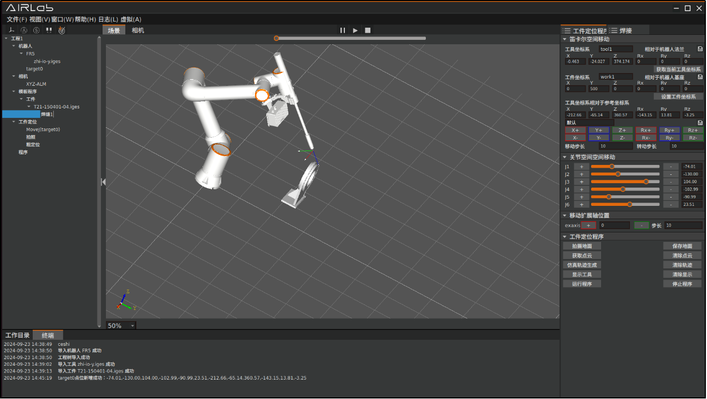

.. centered:: Figure 3-42  AIRLab Project Tree - Add "Weld 1" node

.. important::
    Robots performing welding tasks usually need to perform welding operations on different parts of the workpiece, which are different (e.g., straight line welds, arc welds, etc.), so different weld programs are defined, i.e., Weld 1, Weld 2, Weld 3, etc.

- Step2: According to the actual welding situation, create a specific program under the "Weld 1" node

  Here to weld 1 program as an example for a brief introduction, assuming that the weld 1 is a straight line weld, the robot first needs to move to a suitable point to take a picture of the weld on the workpiece, to obtain the complete information of the straight line weld, so that the subsequent feature recognition can identify the beginning and end of the weld. Therefore, we need to add the command nodes "MoveJ" and "take photo", both as a group. The parameter setting of "take photo" is shown in the subpage analysis section, and the user can set the number of instruction groups according to the actual weld length and shape.

  Next, you need to add the "Feature Recognition" command to the project tree, see the chapter on Feature Recognition sub-page analysis for specific parameter settings. The purpose of feature recognition is to correct the welding start point, middle point (arc weld) and end point of the weld according to the actual photo of the weld obtained from the workpiece, so in this example, the "feature recognition" node needs to be added after the instruction is MoveJ (targetS), S is the start point of the weld and MoveL ( targetE), E is the end point of the straight line weld. targetE), where E is the end point of the linear weld. If weld 1 is a fillet weld, add MoveJ(targetS) and MoveC(targetM ,targetE) after the feature recognition node, M is the middle point of the fillet weld and E is the end point of the fillet weld.

Two results are obtained after the feature recognition is completed: one is that new correction points, targetS_m and targetE_m, will be added under the robot node in the project tree; the other is that new welding instructions will be added under the program node in the project tree, including MoveJ(targetS_m) and MoveL(targetE_m) and some instructions required when setting up the MoveL(targetE) welding process with some of the instructions needed to set up the MoveL(targetE) welding process. Note: These two results are automatically cleared when the next feature recognition instruction is executed.

The use of some of the new nodes is explained below. As shown in Table 3-3.

.. centered:: Table 3-3 Description of Node Usage

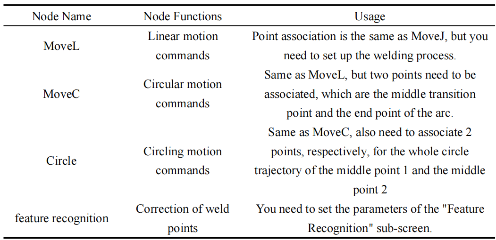

Part II: Running the template program

There are three ways to run a template program.

- After completing the program configuration as shown in Figure 3-43, click the Start Run button in the menu bar, the robot will automatically run the workpiece positioning program first, and after successful operation, it will start running the weld program according to the set configuration mode;

- In the case of manual commissioning, on the premise of successful operation of the workpiece positioning program, select the specific weld program node under the "Template Program" node in the project tree, and click on the "Weld Template Program" sub-page switched on the right side of AIRLab. Run Program" button on the "Weld Template Program" subpage switched on the right side of AIRLab;

- The start of robot operation is controlled by the start-stop operation button of the pushbutton box.

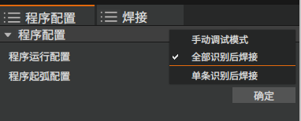

.. centered:: Figure 3-43  AIRLab Project Tree-Pre-Run Program Configuration Settings

Part III: Interaction between the template program and the pushbutton box start-stop-run buttons

After completing the necessary tasks such as the import work described in the previous section, the creation of the workpiece positioning program, and the vision and Ros2 communication connection, the robot can be directly controlled to realize the running and stopping of the template program in the project tree by using the start-stop running button on the pushbutton box.

- Start running: After pressing the start button for the first time, the robot will start to run the workpiece positioning program. After the positioning program is successfully run, the robot will automatically start to run the weld program under the "Template Program" node according to the program configuration mode set up. After the seam identification, the robot will start to run the commands under the "Program" node to carry out the welding work.

- Stop running: Press the Start Run button again and the robot will stop running immediately.    

Programs
~~~~~~~~~~~~~~~~~~~
After the execution of the template program in the weld 1, the program node will be generated under the node to be executed Lua program node, the user through the mouse to select the "program" node in the project tree, the right side of the AIRLab software to switch to the sub-page, the work program, "click on the button "Run the program" can be achieved by the robot on the workpiece specified weld welding, as shown in Figure 3-44.

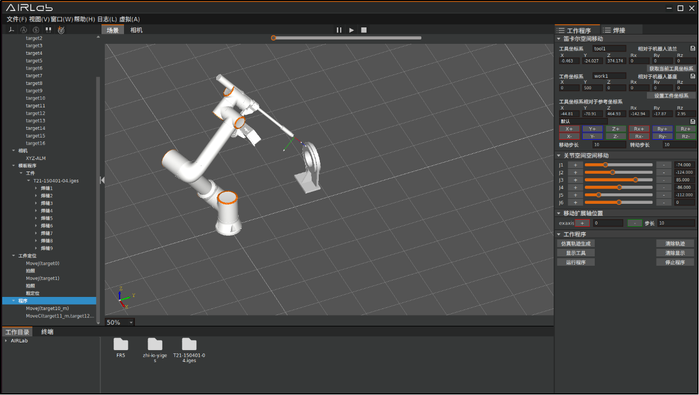

.. centered:: Figure 3-44  AIRLab Project Tree-Running the Program

Pop-Ups and Other Pages
--------------------------
This section describes the pop-up windows and five other pages that appear in the AIRLab software: Robot Control, Other Controls, Simulation, Debug Page, and Program Configuration.

Pop-Up window
~~~~~~~~~~~~~~~~~~~
The popups are file setup popups, log level popups, and welding popups.

(1) File Settings pop-up window

As in Figure 3-45, click on "File", the "File Settings" pop-up window will appear. Select the file type as "Welding" and click "New" button to import the robot.

.. figure:: analysis/3.6/1.png
    :align: center
    :width: 7.5in

.. centered:: Figure 3-45  "File Settings" pop-up window

Click the "Open" button, the file selection pop-up window shown in Figure 3-46 appears, users can choose to import their desired robot, tool or artifact configuration file, click "open" to import, click "cancel" to cancel the import. Click "cancel" to cancel the import.   

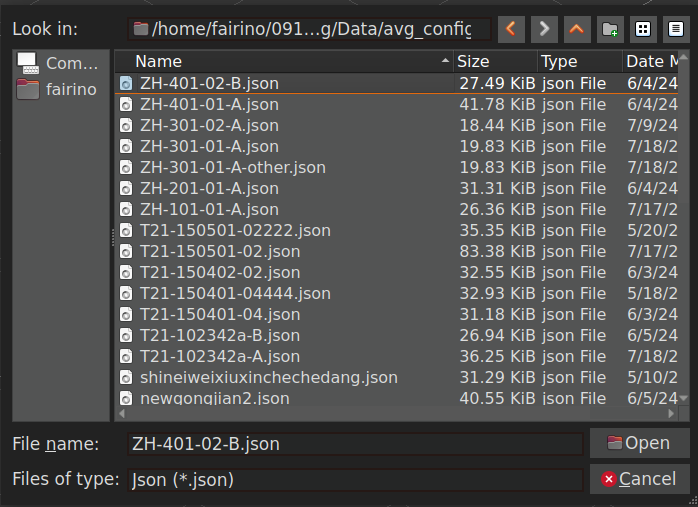

.. centered:: Figure 3-46  File Selection pop-up window

(2) Log level pop-up window

Figure 3-47 shows the Log Level Management module. Log levels are categorized as ERROR, WARNING, INFO, and DEBUG.

- ERROR: Record logs at the ERROR level.
- WARING: Record ERROR and WARING level logs.
- INFO: Record logs at the ERROR, WARNING, and INFO levels.
- DEBUG: Log all logs.

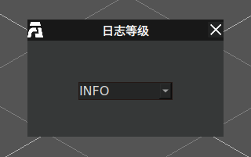

.. centered:: Figure 3-47  "Log Level" pop-up window

You can modify the current logging situation by modifying the log level.

(3) Welding pop-ups

The welding module is divided into a weld editing module and a feature recognition module, as shown in Figure 3-48 and Figure 3-49.

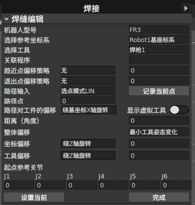

.. centered:: Figure 3-48  Welding-Weld Edit Module

Weld editing module selects the robot model, selects the reference coordinate system and selects the tool, etc., adjusts the robot attitude, clicks on "Record Weld Point" to record the current weld point, and at the same time selects the weld path, adjusts the attitude of the workpiece and the tool, etc., and clicks on the "Finish" button. Click "Finish" button, the robot will weld according to the parameters of the weld edited by the user.

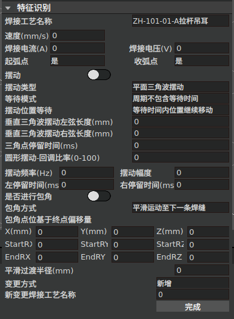

.. centered:: Figure 3-49  Welding-Feature Recognition Module

The feature recognition module allows you to add, modify or delete existing welding processes. According to the needs of setting welding speed (mm / s), welding current (A), welding voltage (V) and other parameters, select the change mode (new, modified or deleted), click "Finish" to complete the corresponding additions, deletions and changes in the operation, the terminal will display the "New Welding Process Success! "As shown in Figure 3-50. At the same time, the welding process node will be automatically added to the project tree.

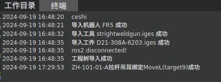

.. centered:: Figure 3-50  Welding-Additional Welding Processes

Other pages
~~~~~~~~~~~~~~~~~~~
The Other page includes the Other Controls, Simulation, and Program Configuration pages.

Part I: Other controls

Click the "Other Controls" button in the operation area to enter the IO setting interface, which mainly includes two modules of IO control and external axis setting.

(1) IO control module

As shown in Figure 3-51, the IO control module enables manual control of the digital outputs, analog outputs (0-10v) in the robot control box and the end tool digital outputs, analog outputs (0-10v) extended IO digital outputs, analog outputs (0-10v):

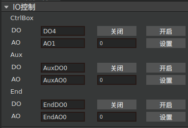

.. centered:: Figure 3-51  IO Control Module

- DO Setting: Select the port number, click the "On" button to set the corresponding DO high, and click the "Off" button to set the corresponding DO low.
- AO Setting: Select the port number and enter the value (0-100) in the input box on the right, the value is a percentage, setting 100 means setting this AO port to 10v.

(2) Exaxis control

As shown in Figure 3-52, the External Axis Setup module enables control of the robot's external axis.

Select the extended axis number and click the "Load" button to load the external axis protocol according to the selected extended axis number. Set the running speed (%), acceleration (%) and the maximum distance of the extended axis (mm).

- Remove Enable: Click on the "Remove Enable" button to remove enable from the external axis.
- Servo Enable: Click the "Servo Enable" button to enable the external axis.
- Forward Tap: Click the "Forward Tap" button to perform a forward tap of the external axis according to the set running speed, acceleration, and maximum distance of the extended axis.
- Reverse Pivot: Click the "Reverse Pivot" button to reverse pivot the external axes according to the set running speed, acceleration, and maximum distance of the extended axes.
- Stop Pivoting: Click the "Stop Pivoting" button to stop the external axis from pivoting.
- Zero Setting: Click the "Zero Setting" button to zero the external axis according to the zero return method, zero seeking speed and hoop speed.

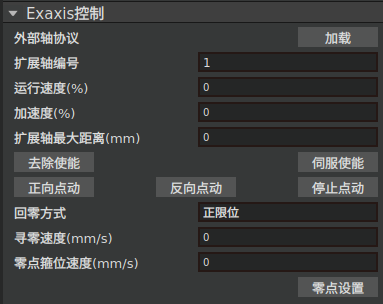

.. centered:: Figure 3-52  Exaxis Control

Part II: Simulation

As shown in Figure 3-53, after generating the simulation trajectory of the program, open the operation area - simulation, set the simulation speed and simulation interval, click on the "Run" button to start the simulation of the template program, click on the "Stop" button to stop the template program simulation. Click "Stop" button to stop the template program simulation. At the same time, it will generate the simulation trajectory point table to record the simulation trajectory points. In the table, the type of simulation track endpoints is LINEND, and when you click a line in the table, the virtual simulation robot will move to the clicked simulation track point, and at the same time, it will synchronously display the TCP coordinates of the simulation track point.

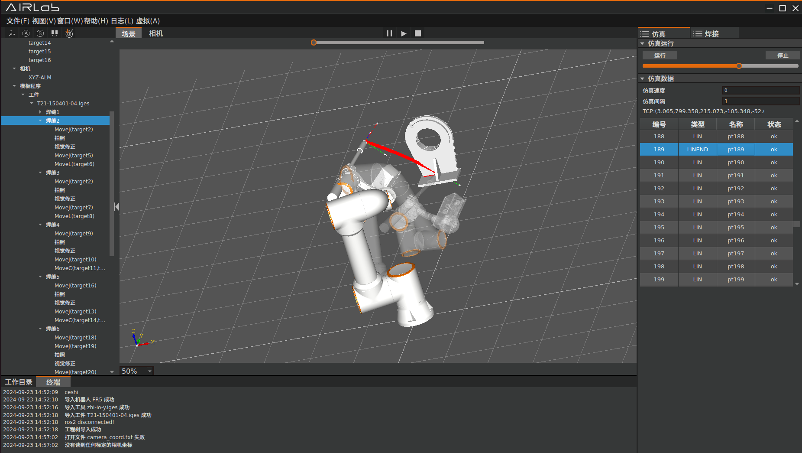

.. centered:: Figure 3-53  Simulation Page

Part III: Program configuration

Perform the program run configuration and program arc start configuration as shown in Figure 3-54.   

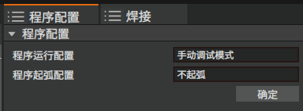

.. centered:: Figure 3-54  Program Configuration Page

The program running configuration can be selected from manual debugging mode, weld after all recognition and weld after single strip recognition, as detailed below.

- Manual debugging mode: for single-step debugging.

- Weld after all are recognized: Click Auto Run to recognize all the welds before welding.

- Weld after single strip recognition: Clicking Auto Run, the robot will first recognize the first weld seam under the template program node. Upon successful recognition, it will proceed to weld the first seam. After completing the welding, it will continue to recognize the second seam, and this process will repeat until all the seams have been welded. The operation will end once all welds are completed.

The arc start configuration in the program can be set to either start the arc or not start the arc.After all the configuration, click the "OK" button to complete the program configuration.

Subpage Parsing
--------------------------
This section describes all the sub-page functions in the AIRLab software.

Robot import settings
~~~~~~~~~~~~~~~~~~~~~~~~~
As shown in Figure 3-55, select the robot model, the existing FR3, FR5, FR10, FR16 and FR20, click the "Import" button, the corresponding model of the robot will be displayed in the scene, as shown in Figure 3-56, and at the same time, the corresponding node will be added to the project tree.

After importing the robot model, set the tilt angle and rotation angle of the robot, and click "OK" button, the robot will be transformed according to the set tilt angle and rotation angle.

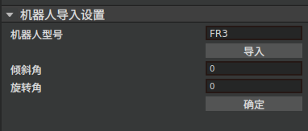

.. centered:: Figure 3-55  Importing Robot Settings

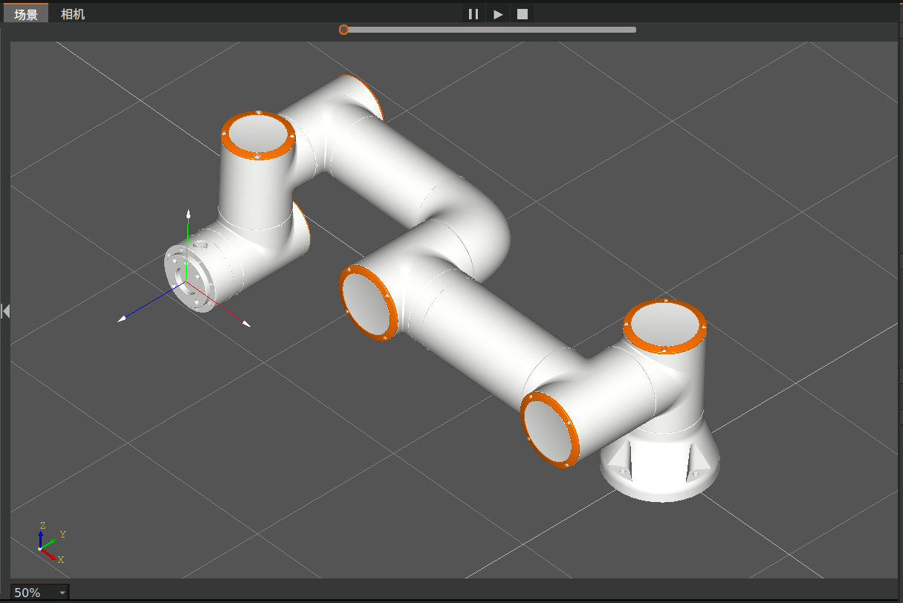

.. centered:: Figure 3-56  Importing Robot Success

Workpiece import settings
~~~~~~~~~~~~~~~~~~~~~~~~~~~~
As shown in Figure 3-57, click "Open" button in the "Workpiece Import Settings" sub-screen. The "Select wobj" pop-up window appears, select the workpiece model to be imported, click "open" to import the workpiece model, and click "cancel" to cancel the import.

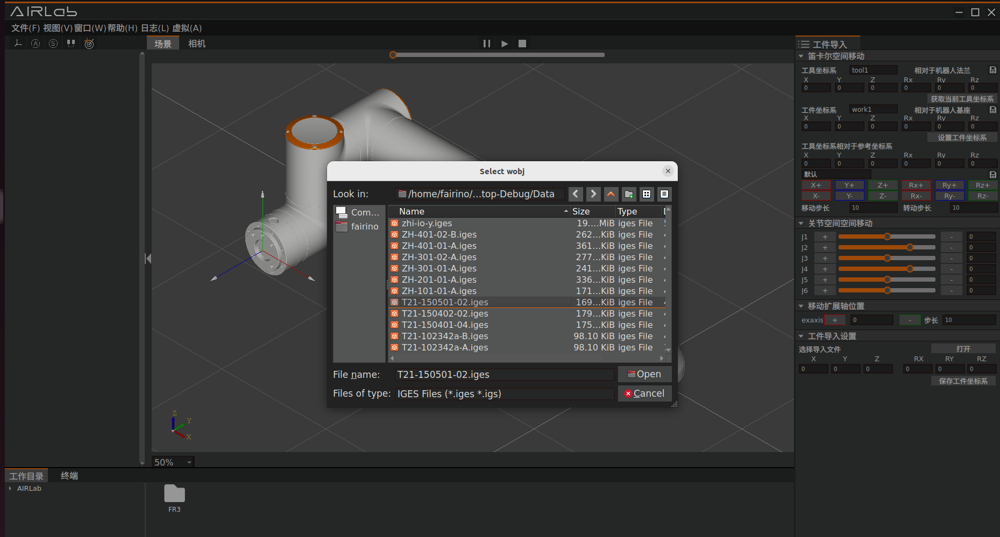

.. centered:: Figure 3-57  Importing a Workpiece

After importing the workpiece model, you can set the coordinate system of the workpiece, click "Save Workpiece Coordinate System" button, the workpiece will be transformed according to the set coordinates.

Tool import settings
~~~~~~~~~~~~~~~~~~~~~~~~~
As shown in Figure 3-58, click the "Open" button in the "Tool Import Settings" sub-screen. The "Select tool" pop-up window appears, select the tool model to be imported, click "open" to import the tool model, and click "cancel" to cancel the import.

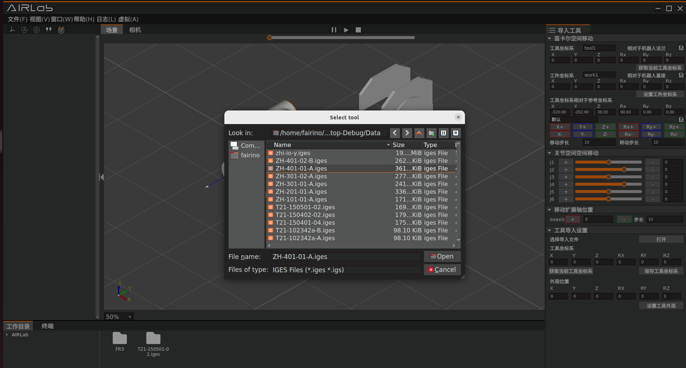

.. centered:: Figure 3-58  Import Tool

After importing the tool model, set the tool coordinate system, click "Save Tool Coordinate System" to save the current tool coordinate system; set the tool appearance position, click "Set Tool Appearance", the appearance of the tool model in the scene will be transformed in accordance with the set tool appearance Click "Set Tool Appearance", the appearance of the tool model in the scene will be transformed according to the set tool appearance.

Point information
~~~~~~~~~~~~~~~~~~~~~~~
As shown in Figure 3-59, select the welding program statement on the left side of the engineering tree, and the "Point Information" sub-interface will appear. Bind the welding process to the selected program statement.

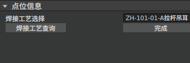

.. centered:: Figure 3-59  Welding Process Settings

Click the ComboBox and select the desired welding process name, as in Figure 3-60.

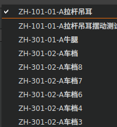

.. centered:: Figure 3-60  Welding Process Selection

Click "Finish" button, the terminal displays the message of successful binding, as in Figure 3-61.

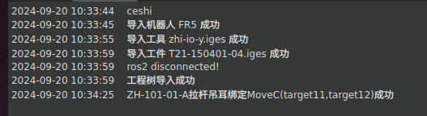

.. centered:: Figure 3-61  Successful Welding Process Setting

Click on the "Welding Process Query" button, the left side of the "welding" interface, shown in Figure 3-62, in the "feature recognition" module can view and modify the welding process parameters.

.. figure:: analysis/3.7/9.png
    :align: center
    :width: 5in

.. centered:: Figure 3-62  Welding process parameter query

Point modification
~~~~~~~~~~~~~~~~~~~~~~~
Click on the left side of the project tree points, such as Figure 3-63, jump to the "point information modification" sub-interface, such as Figure 3-64, you can modify the currently selected point information in the sub-page.

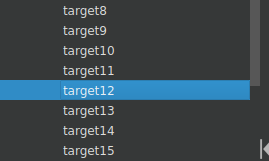

.. centered:: Figure 3-63  Modifying Points in the Project Tree

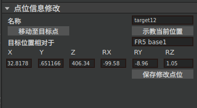

.. centered:: Figure 3-64  "Point Modification" sub-screen

- Move to Target Point: Click this button to give a command to move the physical robot to the location where the record point is stored.

- Teach Current Position: Click this button to get the current position information of the robot in the AIRLab scene and store it.

- Save Modified Points: Click this button to get the positions of X, Y, Z, RX, RY, RZ in the point information modification sub-interface and store them (this operation is used for storing the points after they are selected, and clicking on the positions on the artifacts in the 3D scene will cause a small circle to appear, and at the same time, it will update the Cartesian information of the selected positions to the X, Y, Z, RX, RY, RZ areas in the point information modification sub-interface).

As shown in Figure 3-65, in the scene display box on the workpiece model, click the left mouse button to mark the new point or modify the "point information modification" sub-interface on the point coordinates, click on the "Save Modified Points" button, you can modify the coordinates of the original point. Target12 is modified from the point shown in Figure 3-65a to the point shown in Figure 3-65b.

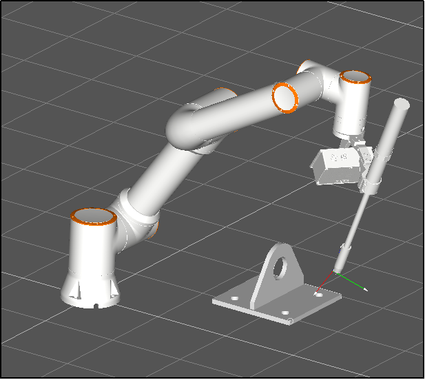

.. centered:: Figure 3-65a Points before modification        

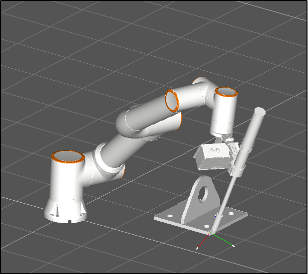

.. centered:: Figure 3-65b Points after modification
.. centered:: Figure 3-65  Point target12 modification process

Working procedure
~~~~~~~~~~~~~~~~~~~
Click on the left side of the project tree "program" node, as shown in the figure, the sub-interface jumped to the "work program", as shown in Figure 3-66.

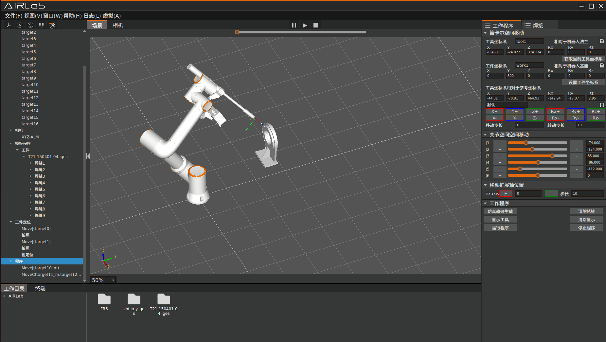

.. centered:: Figure 3-66  Work Program sub-screen

As shown in Figure 3-67, the specific functions of the Work Program sub-interface are Simulation Trajectory Generation, Clear Trajectory, Display Tool, Clear Display, Run Program and Stop Program.

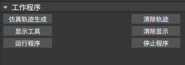

.. centered:: Figure 3-67  Functions of "Work Program" sub-screen

- Simulation Trajectory Generation: Click the "Simulation Trajectory Generation" button, the scene generates the engineering tree in the "program" run in the process of simulation trajectory, as shown in Figure 3-68.

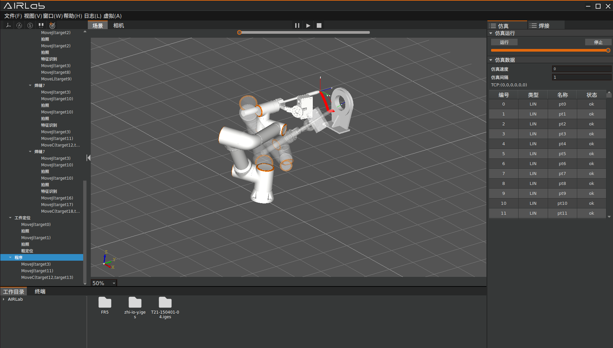

.. centered:: Figure 3-68  Program Simulation Trajectory Generation

- Clear Trajectory: Click the "Clear Trajectory" button to clear the simulation trajectory generated in the scene.

- Show Tools: Click on the "Show Tools" button, the scene displays the attitude of the tool at the key points when the program is running, such as Figure 3-69 shows the attitude of the tool at the key points when the work program is running.

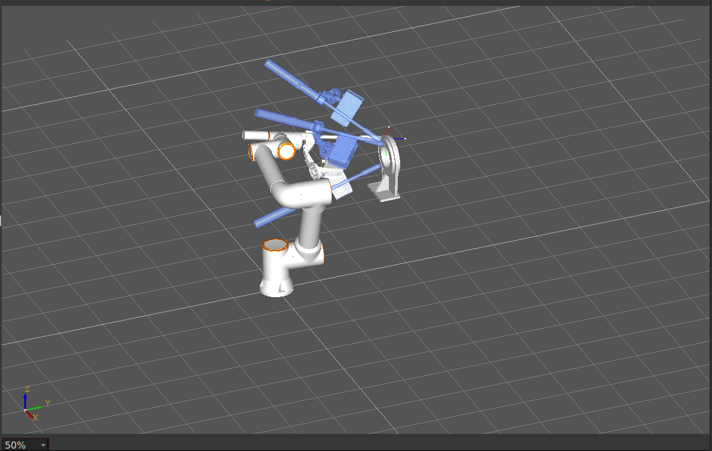

.. centered:: Figure 3-69  Work Program Display Tool

- Clear Display: Click the "Clear Display" button to clear the virtual tools generated in the scene.

- Run program: Click "Run program", the solid robot moves according to the trajectory generated by the program.

- Stop Program: Click "Stop Program" to stop the robot movement.

Workpiece positioning program
~~~~~~~~~~~~~~~~~~~~~~~~~~~~~~~
Click the "Workpiece Positioning" node on the left side of the project tree, as shown in Figure 3-70, the sub-interface jumps to the "Workpiece Positioning Program".

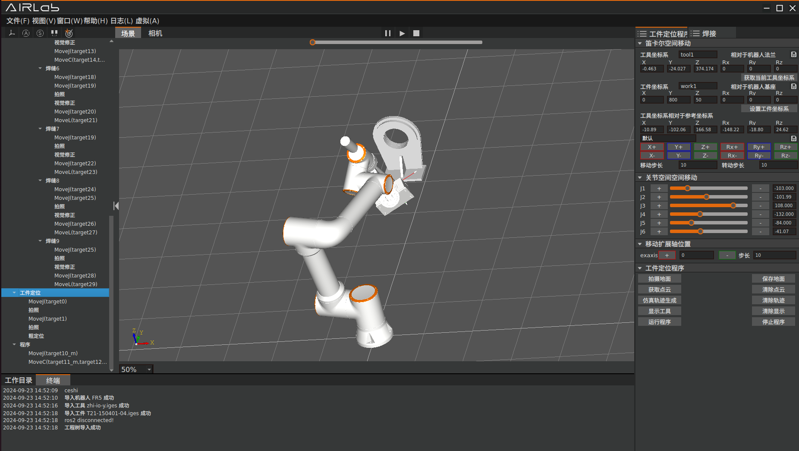

.. centered:: Figure 3-70  "Workpiece Positioning Program" Sub-Interface

As shown in Figure 3-71, the specific functions of the "Workpiece Positioning Program" sub-interface are to take a picture of the ground, to save the ground, to get a point cloud, to clear the point cloud, to generate a simulated trajectory, to clear the trajectory, to display the tool, to clear the display, to run the program, and to stop the program.

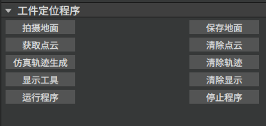

.. centered:: Figure 3-71  Functions of "Workpiece Positioning Program" sub-screen

- Photographing the ground: Move the robot arm to a position parallel to the worktable where the workpiece can be completely photographed, and click the "Take Photo" button to take a photo of the ground. The terminal displays "Successful shooting".

- Save Ground: Saves the ground photos taken.

- Get Point Cloud: Click the "Get Point Cloud" button to generate the point cloud data model of the workpiece in the actual scene and align it with the workpiece model in the virtual scene.

- Clear Point Cloud: Click the "Clear Point Cloud" button to clear the point cloud data of the workpiece in the scene.

- Simulation Trajectory Generation: Click the "Simulation Trajectory Generation" button, the scene generates the engineering tree in the "program" run in the process of simulation trajectory, as shown in Figure 3-72.

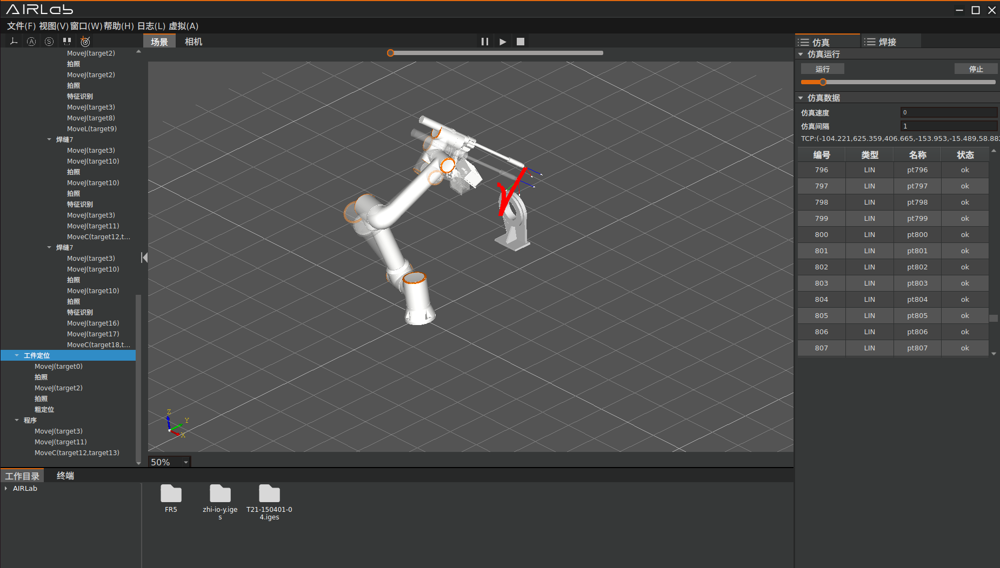

.. centered:: Figure 3-72  Simulation Trajectory Generation for Workpiece Positioning

- Clear Trajectory: Click the "Clear Trajectory" button to clear the simulation trajectory generated in the scene.

- Show Tools: Click on the "Show Tools" button, the scene shows the attitude of the tool at the key points when the program is running, as shown in Figure 3-73 shows the attitude of the tool when the workpiece is positioned, the user can intuitively see the attitude of the tool at the key points.

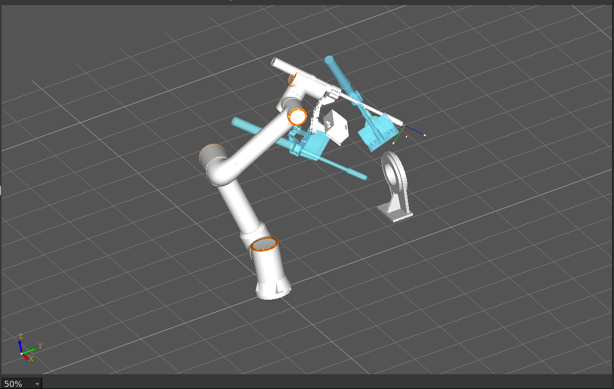

.. centered:: Figure 3-73  Workpiece Positioning Program Display Tool

- Clear Display: Click the "Clear Display" button to clear the virtual tools generated in the scene.

- Run program: Click "Run program", the solid robot moves according to the trajectory generated by the program.

- Stop Program: Click "Stop Program" to stop the robot movement.

Weld template program
~~~~~~~~~~~~~~~~~~~~~~~~~
As shown in Figure 3-74, click the weld template program under "Template Program" in the left engineering tree, and the sub-interface will jump to "Weld Template Program".

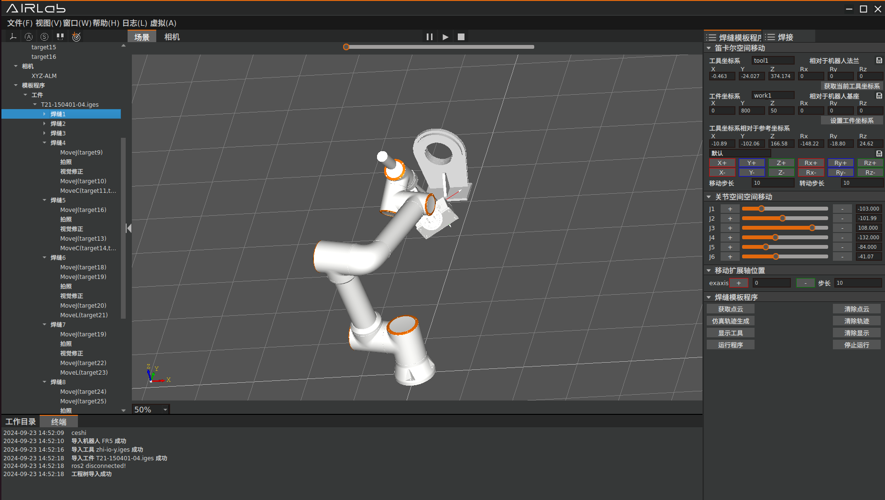

.. centered:: Figure 3-74  "Weld template program" sub-screen

As shown in Figure 3-75, the specific functions of the "Weld Template Program" sub-interface include acquiring a point cloud, clearing a point cloud, generating a simulation trajectory, clearing a trajectory, displaying a tool, clearing the display, running the program, and stopping the program.

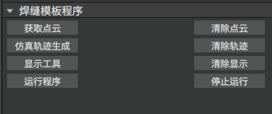

.. centered:: Figure 3-75  "Weld Template Program" sub-screen functions

- Get Point Cloud: Click the "Get Point Cloud" button to generate the point cloud data model of the workpiece in the actual scene and align it with the workpiece model in the virtual scene.

- Clear Point Cloud: Click the "Clear Point Cloud" button to clear the point cloud data of the workpiece in the scene.

- Simulation trajectory generation: Click the "Simulation Trajectory Generation" button, the scene generates the engineering tree in the "program" running the process of simulation trajectory, as shown in Figure 3-76.

.. centered:: Figure 3-76  Weld template program simulation trajectory

- Clear Trajectory: Click the "Clear Trajectory" button to clear the simulation trajectory generated in the scene.

- Show Tool: Click the "Show Tool" button, the scene shows the posture of the tool at the key points when running the weld template program, as shown in Figure 3-77, users can visualize the posture of the tool at the key points during the running of the weld template program.

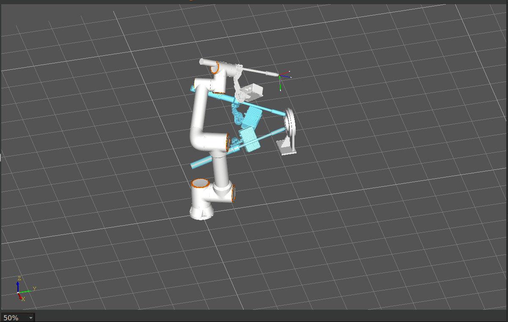

.. centered:: Figure 3-77  Weld Template Program Display Tool

- Clear Display: Click the "Clear Display" button to clear the virtual tools generated in the scene.

- Run program: Click "Run program", the solid robot moves according to the trajectory generated by the program.

- Stop Program: Click "Stop Program" to stop the robot movement.

Photo settings
~~~~~~~~~~~~~~~~~~~
As shown in Figure 3-78, click the "Photo" sub-node of the left engineering tree, and the sub-interface jumps to "Photo Settings".

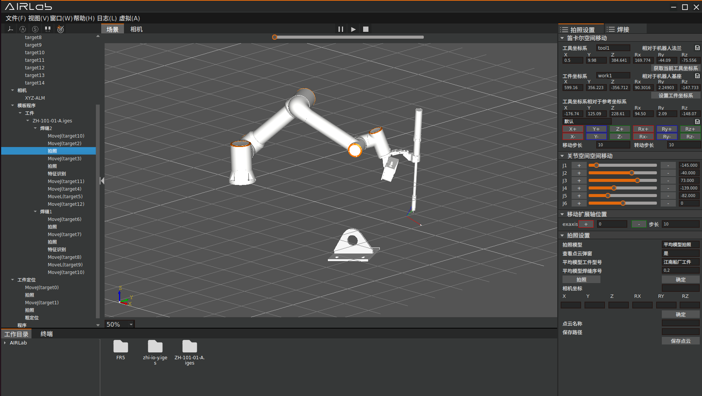

.. centered:: Figure 3-78  "Photo Settings" sub-screen

The main function of the photo setting is to verify that the camera's photo function is available.

Determine (photo setting): Set the photo parameters, including the following parameters:

- Photo model: 0-global photo, 1-local photo (not yet open), 2-Average model photo.
- View point cloud popups: 0-view, 1-don't view.
- Average model artifact type: not open yet.
- Average model weld number: one or more (Example: 1-1, 1-2, 2-1, 3-2, indicating that it is possible to shoot to the beginning of weld 1, the end of weld 1, the beginning of weld 2, and the end of weld 3).

Determine (camera coordinates): not yet open

Save point cloud: Input the point cloud name and save path to save the point cloud data.

Welding camera properties
~~~~~~~~~~~~~~~~~~~~~~~~~~~
As shown in Figure 3-79, click the camera model under the "Camera" node of the project tree, and the sub-interface will jump to "Welding Camera Properties". In the "Welding Camera Properties" sub-interface for camera calibration, manual calibration and automatic calibration. First, adjust the camera to a suitable position as the initial position of the camera calibration, and then carry out manual or automatic calibration.

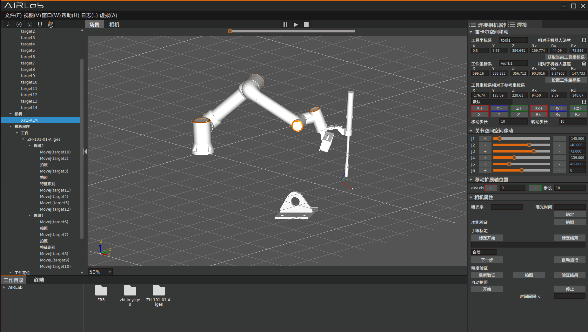

.. centered:: Figure 3-79  Weld Camera Properties sub-screen

- Manual calibration: Select "Manual", the input box displays "Entering manual mode, please click Next"; click the "Next" button, the camera changes the corresponding position and takes pictures. Click the "Next" button, the camera will change its position and take photos accordingly.

- Auto Calibration: Select "Auto", enter "Display entering auto mode, the robot is about to move automatically, please do not operate" in the input box; click the "Auto Run" button, the camera will take eight photos in a row to automatically calibrate the camera. Click the "Auto Run" button, the camera will take eight photos in a row to calibrate the camera automatically.

Welding camera attribute accuracy verification (need to have been calibrated 3-5 times)

- "Re-verify" button: Clear the photo information for accuracy verification.

- "Take a picture" button: Take a picture for accuracy verification.

- "Verify Results" button: After the mobile robot has photographed the calibration plate three times, clicking on Verify Results displays the results of the hand-eye calibration accuracy verification and applies the best one calibration result.

- "Start" button: not yet available.

- "Stop" button: not yet available.

Importing extension axis
~~~~~~~~~~~~~~~~~~~~~~~~~~~~~
The function of this page is to import the extension axis and set the position of the extension axis.

- Select Extended Axis ComboBox: determines the type of extended axis to be imported.

- "Import" button: After clicking on it, the extended axes just selected will appear in the scene of the AIRLab software, as shown in the figure.

- Exaxispos text edit box: Set the value in the text box to change the position of the robot on the extended axis, as shown in Figure 3-80.

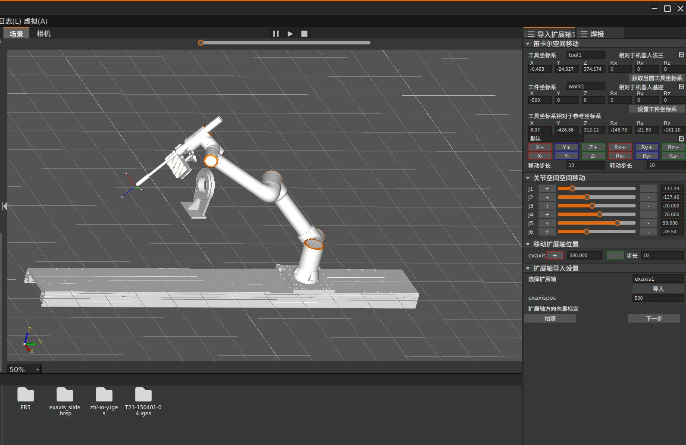

.. centered:: Figure 3-80  Extended Axis Import Settings

Camera selection
~~~~~~~~~~~~~~~~~~~
Click the "Camera" node on the left side of the project tree, and the sub-interface jumps to "Camera Selection", as shown in Figure 3-81. This function is used to determine the camera model to be used in welding work. After the user selects the camera model, click OK (currently only XYZ-ALM is available).

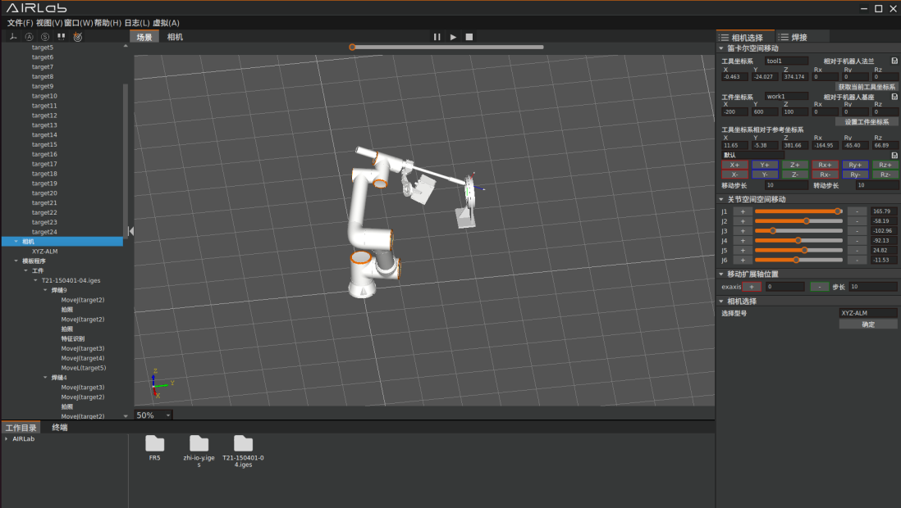

.. centered:: Figure 3-81  "Camera Selection" sub-screen