AIRLab Software Analysis
============================
.. toctree:: 
	:maxdepth: 5

The initial interface of the AIRLab software is shown in Figure below and is divided into five main sections. In the middle of the interface is the main display box (divided into scene display and camera display), on the top is the menu bar, on the leftmost side is the engineering module area, on the rightmost side is the operation area, and at the bottom of the interface is the command feedback area. This section will provide a detailed description of the functions and usage of the above areas, the pop-up windows and other pages that appear in the AIRLab software, and the sub-page functions.

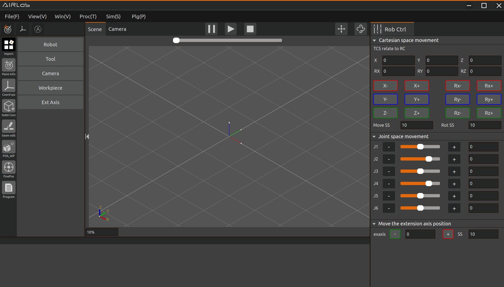

	AIRLab Software Initial Interface

Menu Bar
--------------------------
The content included in the menu bar is shown in Figure below, mainly consisting of the buttons: "File," "View," "Window," "Simulation," "Plugins," "Welding," "Process," as well as icon buttons (in order from left to right): Add Point, Add Coordinate System, Mode Switch, Pause Run, Start Run, Stop Run.

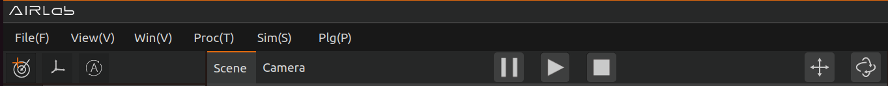

	AIRLab Menu Bar

File
~~~~~~~~~~~~~~~~~~~
Click the“File”button, the menu shown below will appear:“New”,“Open”, “Export”. How to use it is described below:

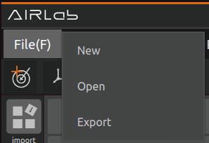

	AIRLab Menu Bar - File

Select “New” click, “New Project” pop-up window will show, select the type of weld project in the pop-up window, then click “Confirm” button to complete the project new.

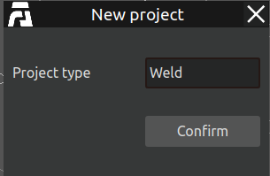

	AIRLab Menu Bar - File - New 

Select “Open” click, the “Select Project” pop-up window appears, find the path of your project, select the double-click or click on the pop-up window after clicking the “Open” button, that is, import the project successfully.

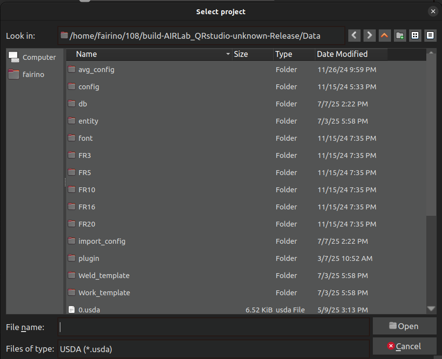

	AIRLab Menu Bar - File - Open

Select “Export” click, “Save Project” pop-up window appears, this function will save AIRLab's current project under user-defined path. After naming the project in the “File name” column of the popup window, click “Save” to complete the export of the current project.

	AIRLab Menu Bar - File - Export

View
~~~~~~~~~~~~~~~~~~~
View contains 12 functions, as shown in Figure below, the main function is to adjust the viewing angle of the robot in the main display frame. They are: Zoom, Pan, Rotate, Reset, Fit all, Front view, Back view, Top view, Bottom view, Left view, Right view, and Full view.

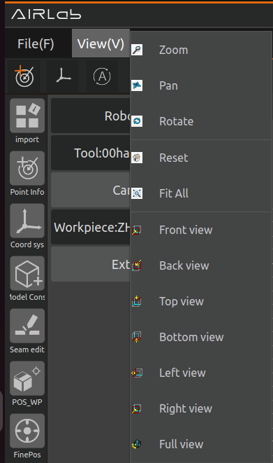

	AIRLab Menu Bar - View

See Table 3-1 for a description of the specific functions of the view.

.. table:: View Function Description
   :align: center

   +---------------+--------------------------------------------------------------+
   | Function Name | Functional Description                                       |
   +===============+==============================================================+
   | Zoom          | Zoom in or out of the 3D scene with the mouse wheel          |
   +---------------+--------------------------------------------------------------+
   | Pan           | Press and hold the mouse wheel while moving it to pan the    |
   |               | 3D scene                                                     |
   +---------------+--------------------------------------------------------------+
   | Rotate        | Press and hold the mouse wheel while moving it to rotate the |
   |               | 3D scene                                                     |
   +---------------+--------------------------------------------------------------+
   | Reset         | Restore the 3D scene to its initial state                    |
   +---------------+--------------------------------------------------------------+
   | Fit all       | Automatically adjust the size and position of the viewing    |
   |               | area                                                         |
   +---------------+--------------------------------------------------------------+
   | Front view    | Switch to the front view                                     |
   +---------------+--------------------------------------------------------------+
   | Back view     | Switch to the back view                                      |
   +---------------+--------------------------------------------------------------+
   | Top view      | Switch to the top view                                       |
   +---------------+--------------------------------------------------------------+
   | Bottom view   | Switch to the bottom view                                    |
   +---------------+--------------------------------------------------------------+
   | Left view     | Switch to the left view                                      |
   +---------------+--------------------------------------------------------------+
   | Right view    | Switch to the right view                                     |
   +---------------+--------------------------------------------------------------+
   | Full view     | Switch to the full view                                      |
   +---------------+--------------------------------------------------------------+

Window
~~~~~~~~~~~~~~~~~~~
The "Window" menu contains "Software/Firmware Upgrade", "About", "Version Verification", "Log", "Virtual Camera", "TCF and Camera Hand-Eye Calibration", "Data Source Export", and "Custom Icon". Clicking an option opens the corresponding AIRLab function dialog box. For detailed functions and instructions, see the dialog box descriptions in Section 3.7.

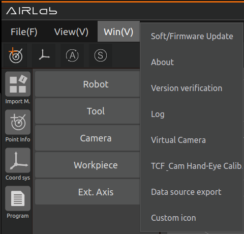

	AIRLab Menu Bar-Window

Simulation
~~~~~~~~~~~~~~~~~~~
This button is used to switch between the simulation robot and the real robot. Before using this button, you need to successfully import or create a project and successfully establish Ros2 communication connection with the real robot. Clicking this button after completing the above prerequisites will enable switching between the virtual robot and the physical robot both. After switching the real robot, the robot pose displayed in the AIRLab scene will be synchronized with the actual robot, as shown in Figure below.

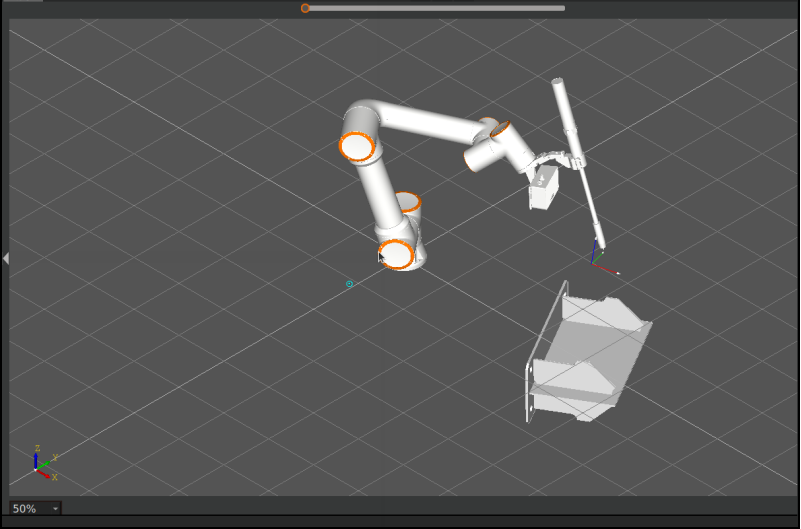

	AIRLab display after live switching

Simulation Scene: used for simulation will not synchronize and update the robot position in the 3D scene in real time; 

Real Scene: update the current tool coordinate system, DH compensation parameters are consistent with the actual robot, and the robot position in the 3D scene is consistent with the physical robot.

Plugin
~~~~~~~~~~~~~~~~~~~
To enhance the scalability and user experience of the AIRLab software, AIRLab provides a plug-in module that allows users to develop customized plug-ins according to their requirements. These plug-ins can be loaded into AIRLab via dynamic library files (.so) to extend and enhance the software functions.

The existing plugins include the Welding plugin, Bin-picking plugin, Smart Assistant plugin, and Palletizing plugin. You can choose to enable or disable plugins. Additionally, you can view the authorization status of each plugin and perform authorization via "Plugin Authorization". For detailed introductions and specific operations of each plugin, please refer to Chapter 4, Plugin Section.

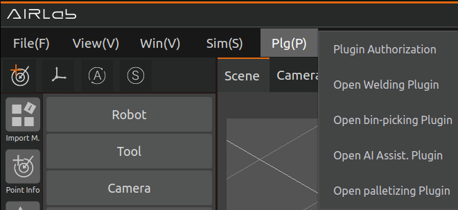

	AIRLab-Plugin

Weld
~~~~~~~~~~~~~~~~~~~
Under the main "Welding" function, there are secondary options for implementing different functions. After selecting and clicking an option, AIRLab will pop up the corresponding welding function settings window. For detailed descriptions and operation methods of each function, please refer to the pop-up window introductions in Section 3.6.

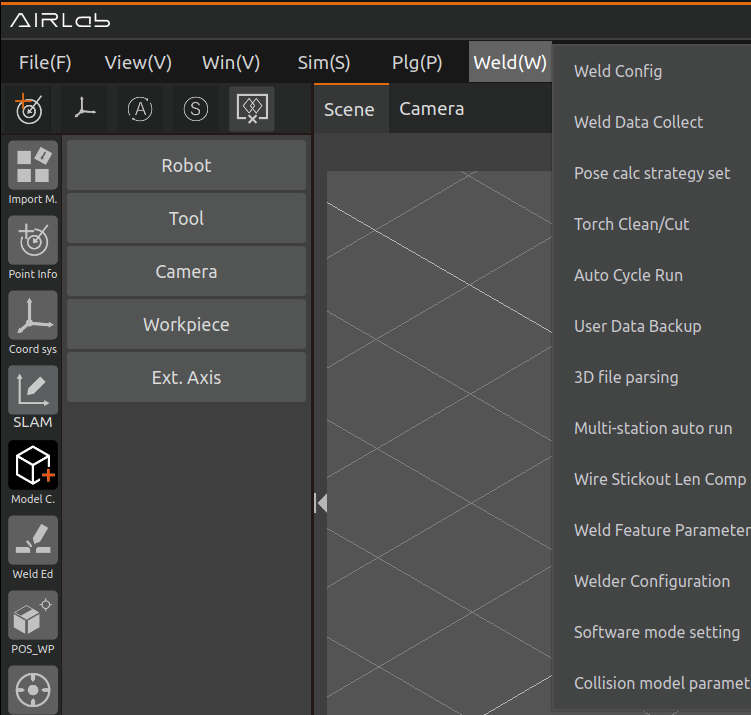

	AILRab-Weld

Process
~~~~~~~~~~~~~~~~~~~
The “Process” includes “Welding Process” and “Cylindrical Filling”, according to the process need to select different processes, click the option to appear corresponding function pop-up window.For a detailed introduction,please refer to section 4.6 on the analysis of engineering modules.

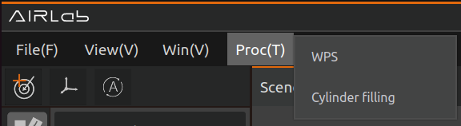

	AIRLab Menu Bar - Process

Mode switching
~~~~~~~~~~~~~~~~~~~
After the AIRLab software establishes Ros2 communication with the physical robot, the user can switch the mode status of the physical robot by clicking on this button. “A” means that the current robot is in automatic mode, and “M” means that the current robot is in manual mode. In addition, clicking this icon in automatic mode will switch the robot mode to manual, and clicking this icon in manual mode will switch the robot mode to automatic.

Points added
~~~~~~~~~~~~~~~~~~~~~~~~~
This function is used to quickly record the current position of the robot. After clicking this button, a new position targetX will be added under the position information section of the engineering module on the left side of AIRLab. The function of X is to prevent duplicate names of newly added positions, as shown in Figure below. The j1, j2, j3, j4, j5, j6, x, y, z, rx, ry, and rz information of this point are the current joint coordinates and Cartesian coordinates of the robot.

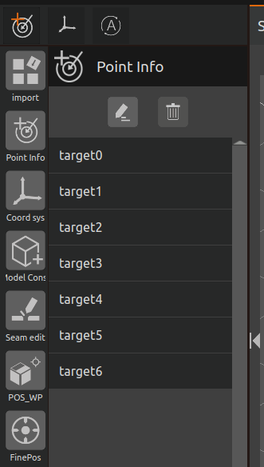

	AIRLab Menu Bar - Point Additions

.. figure:: analysis/airlab_terminal_point_add_success.png
	:align: center
	:width: 4.5in

	AIRLab Terminal - Printing of Point Addition Successful Information

Coordinate system creation
~~~~~~~~~~~~~~~~~~~~~~~~~~~~~~~~~~
Click this button, and AIRLab will create a new reference coordinate system. The newly created reference coordinate system will be displayed on the left side of the AIRLab interface under the module - coordinate system, which is used for weld offset and welding process, assisting users in quickly and accurately setting weld/bead offset.

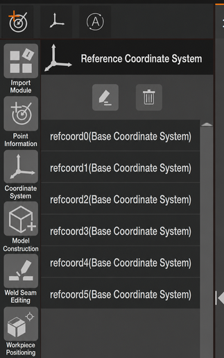

	AIRLab Reference Coordinate System Menu

Click the reference coordinate system icon on the far left to enter the reference coordinate system module. Select a reference coordinate system and click the "Edit" button above to configure it. You can then set parameters such as selecting the reference base (workpiece coordinate system, base coordinate system, or world coordinate system), adjusting the coordinate system's position, and choosing whether to display the reference coordinate system.

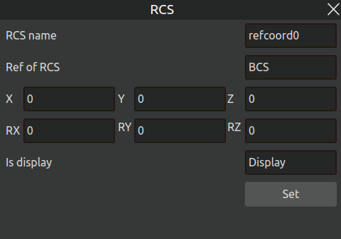

	AIRLab - Reference Coordinate System

The reference coordinate system can be selected from the workpiece coordinate system, base coordinate system, or world coordinate system. Set the position of the coordinate system, and choose whether to display the reference coordinate system. Figure below shows the coordinate system displayed and it not displayed.

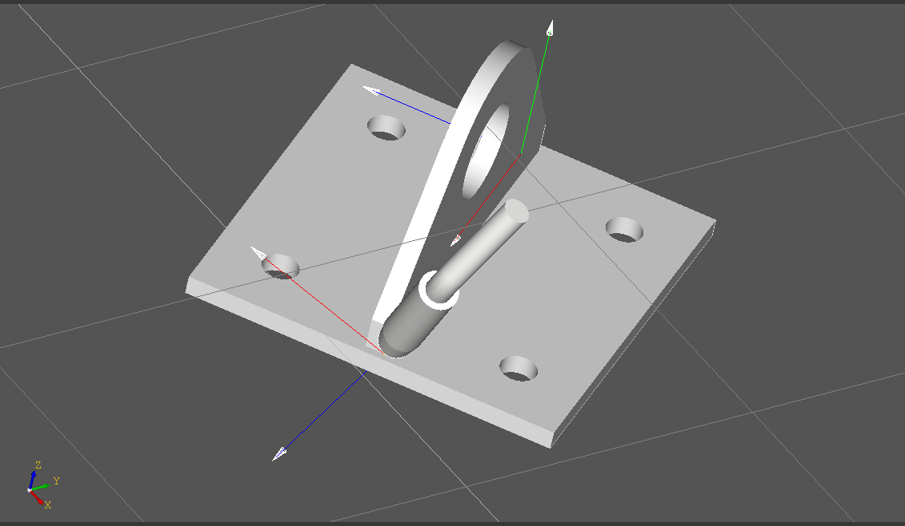

	AIRLab Menu Bar-RCS-Display CS

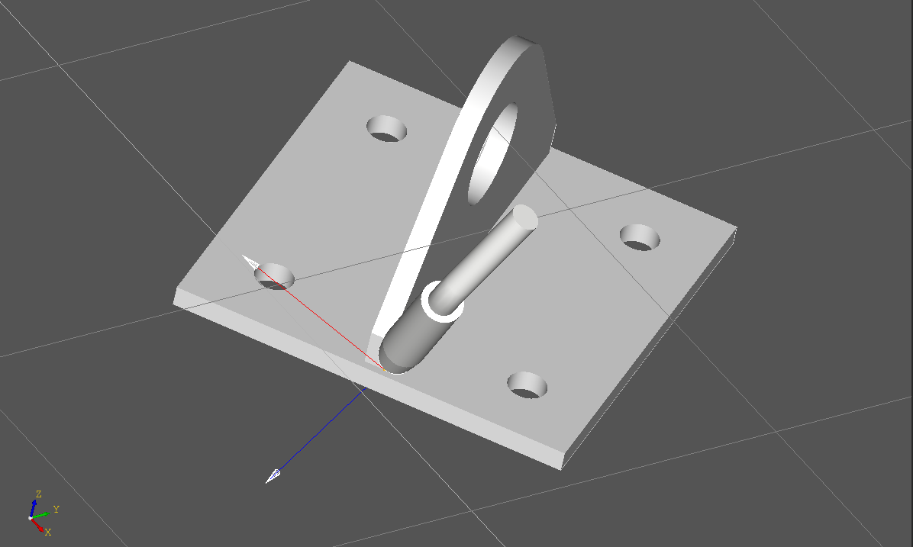

	AIRLab menu bar-RCS-Not show CS

Offline Simulation
~~~~~~~~~~~~~~~~~~~~~~~~~
The offline simulation function is primarily used in the weld editing module. After weld editing is completed, it simulates the edited weld trajectory. Its main purpose is to simulate and verify the correctness of the welding trajectory before generating the final welding program.

Click the offline simulation icon to enable the offline simulation function. The enabled state is shown in the figure below.

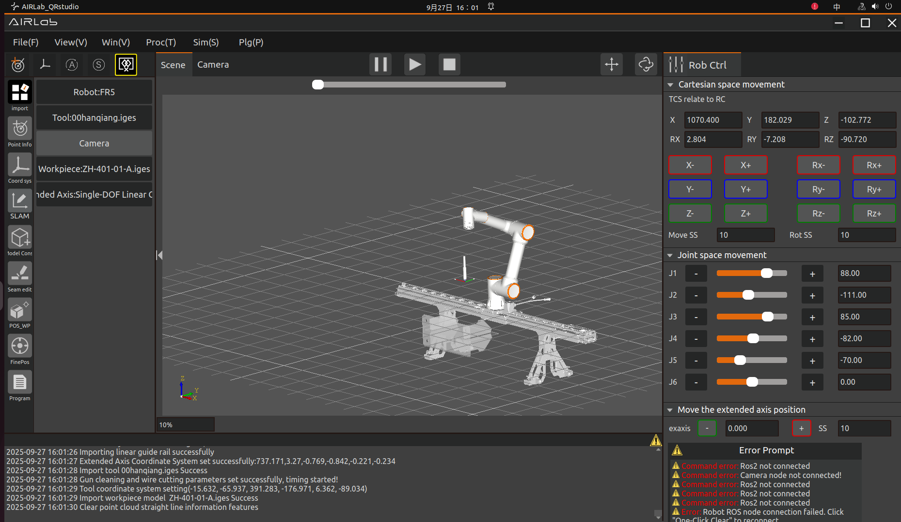

	Open "Offline Simulation" state

Click the offline simulation icon again to disable the function, as shown in the figure below.

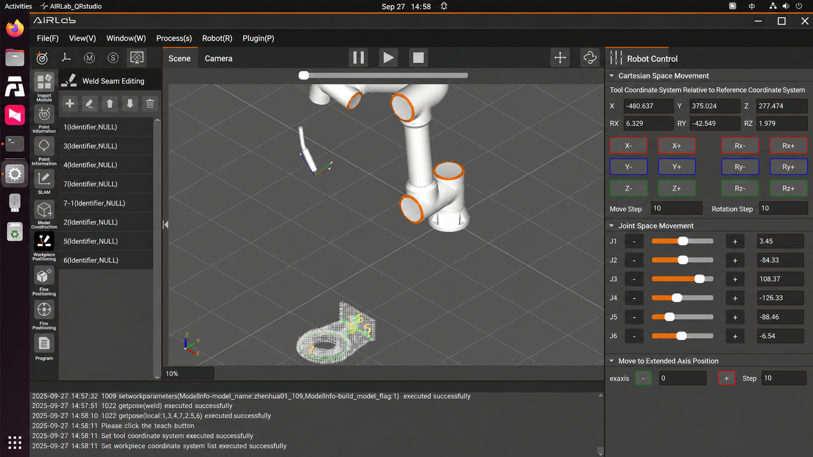

	Close "Offline Simulation" state

With the offline simulation function enabled, edit the weld seams. After editing a single weld seam, click the "Offline Simulation" button in the weld editing pop-up window. The edited welding trajectory of that seam will be displayed in the 3D scene.

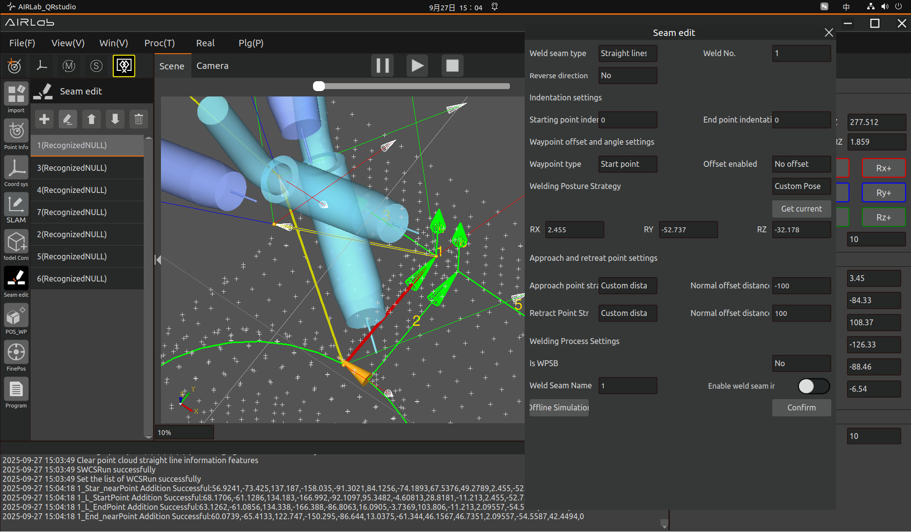

	Offline Simulate one weld seam

After all weld seams have been edited, click the "Weld Editing" module and select "Offline Simulation for Edited Weld Seams".

The 3D scene will generate the simulated trajectories for all edited weld seams. Click "Clear Trajectory" to remove the simulated trajectories from the 3D scene.

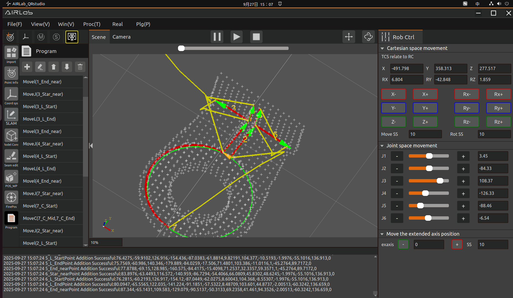

	Offline Simulation of Edited Weld Seams

Pause running
~~~~~~~~~~~~~~~~~~~

Pause/Resume button. Clicking this button will immediately pause the robot that is running a program, and pressing the button again will resume the robot to continue running the program it was running before the pause.

Start running
~~~~~~~~~~~~~~~~~~~
By clicking this button, the robot will first run all the commands under the “Workpiece Positioning” module on the left side of AIRLab, and after successful positioning of the workpiece, the robot will start to run the weld recognition; after successful recognition of the weld seam, the robot will run or not run the program automatically according to the parameters set by the user in the program configuration.

Stop running
~~~~~~~~~~~~~~~~~~~
Clicking the button immediately stops the robot that is running the program. The difference between this button and the pause/resume button is that by pressing the button again, the robot cannot resume running and can only be restarted with the start running button.

Main Frame
--------------------------
The main display box is divided into scene display and camera display, where the scene mainly displays the robot, tool, workpiece, extended axis model, etc., as in Figure below. the camera mainly displays the obtained point cloud map, as in Figure below.

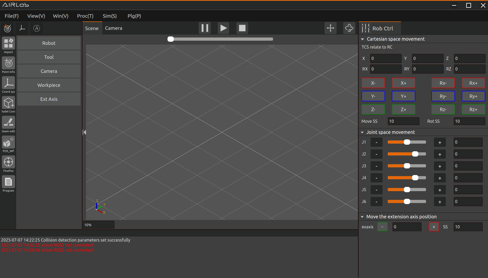

	AIRLab Main Display Box - Scene Display

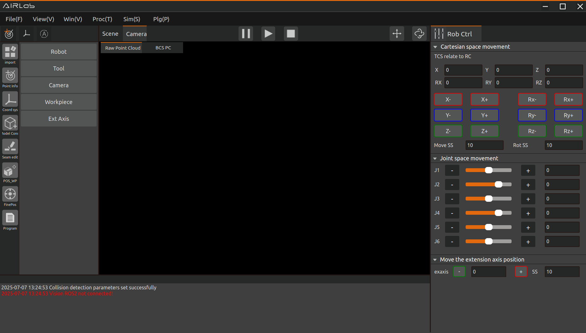

	AIRLab Main Display Frame - Camera Display

Command Feedback Area
--------------------------
The instruction feedback area displays the execution results of program instructions, as shown in Figure below.

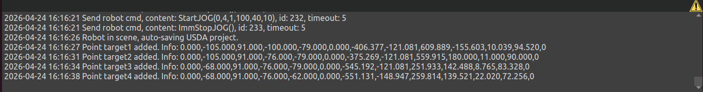

	AIRLab Command Feedback Area-Terminal

Operating Area
--------------------------

Cartesian space movement
~~~~~~~~~~~~~~~~~~~~~~~~~~~
This area includes two parts: tool coordinate system relative to the reference coordinate system, and long press tap trigger, move step and rotate step settings, as shown in Figure below.

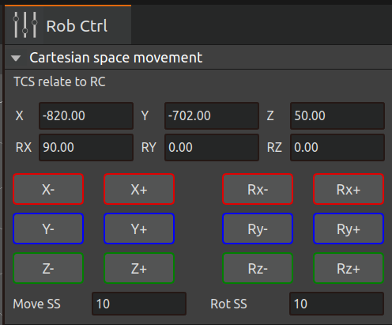

	AIRLab Operation Area - Cartesian Space Movements

- The Tool Coordinate System Relative to Reference Coordinate System section, which shows the value of the tool coordinate system relative to the reference coordinate system.

- Long press tap trigger, move step and rotate step setting section. As shown in Figure below, if the currently imported robot model is a solid robot, long press the X+ button, the solid robot will execute the X+ tap command; if the currently imported robot model is not a solid robot, long press the X+ button, the simulation robot will execute the X+ tap command.

.. important::
	To control the robot's JOG pointing by long-pressing the buttons, if the buttons are released while the robot is running, the robot will stop moving immediately; if the buttons are held down all the way and not released, the robot will run the value of the set rotation step and then stop moving. the X-, Y+, Y-, Z+, Z- buttons operate in the same way. If the Rx+, Rx-, Ry+, Ry-, Rz+, Rz- buttons are pressed and held down, the robot will otherwise remain unchanged, except that it will move according to the set value of the rotation step.

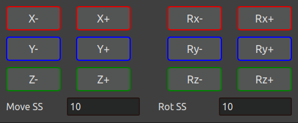

	AIRLab Operation Area-Long Press Tap

Joint space space movement
~~~~~~~~~~~~~~~~~~~~~~~~~~~~~
This area includes 12 joint coordinate long press trigger buttons for joints J1-J6, 6 joint coordinate change text boxes and 6 joint sliders in three parts, as shown in Figure below.

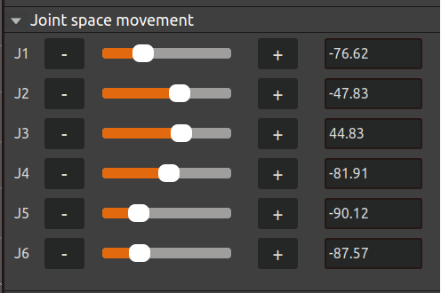

	AIRLab Operating Area - Joint Space Space Mobility

- You can control the movement of the solid robot J1 joints in manual mode and joint coordinate system by long-pressing the "+" or "-" button of J1. " button to control the movement of the J1 joints of the solid robot in manual mode and in the joint coordinate system. The "+" or "-" buttons of the other joints operate in the same way.

.. important::
	The robot operation is controlled by long-pressing the button. If the button is released while the robot is running, the robot will stop moving immediately; if the button is held down all the time, the robot will run the set value of Move Step/Rotate Step and then stop moving.

- The 6 text boxes are updated in real time to show the angle values of the 6 joints of the robot. In addition, editing the values in the 6 textboxes can also be used to control the movement of the robot's joints (care should be taken not to exceed the soft limits of the robot's joint angles when editing).

- The function of the joint slots is that the user can slide the joint slots to realize the movement of each joint of the robot, and the joint angles represented by the slots are displayed by the values in the text box.

Moving extended axis settings
~~~~~~~~~~~~~~~~~~~~~~~~~~~~~~~
This section includes "exaxis+", "exaxis-" and the step setting box, as shown in Figure below. "exaxis+", "exaxis-" functions are similar to the pointing X+ and X- under the tool coordinate system, and the motion of the extended axis can be controlled by the above two buttons. Long press the button to control the extended axis running, if you release the button during the extended axis running, the extended axis will stop moving immediately; if you keep pressing the button and do not release it, the extended axis will run the value set in the Step Setting box and then stop moving.

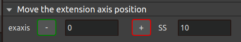

	AIRLab Operation Area - Moving the Extended Axis Position

Engineering Module Analysis
-----------------------------------
Click New Welding Project or Import Existing Welding Project. The AIRLab interface will prompt whether to use the configured welding features.

- For a new project, the configured welding features displayed are those currently in use by AIRLab.

- For an imported existing project, the configured welding features displayed are those recorded in the project.

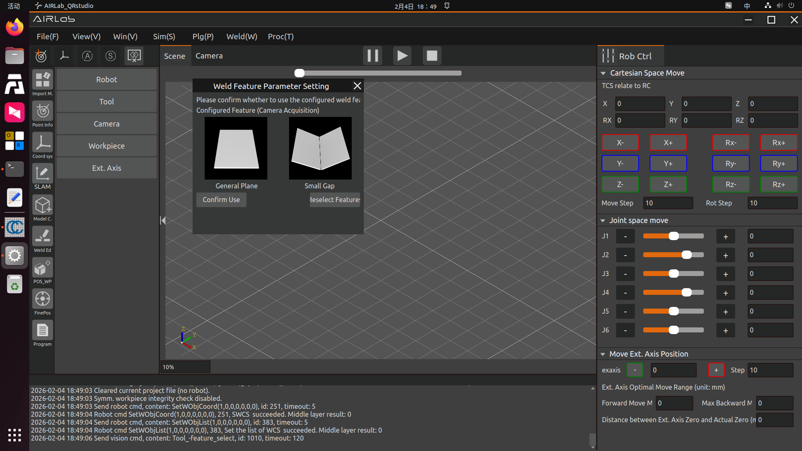

	New Welding Project - Configured Features

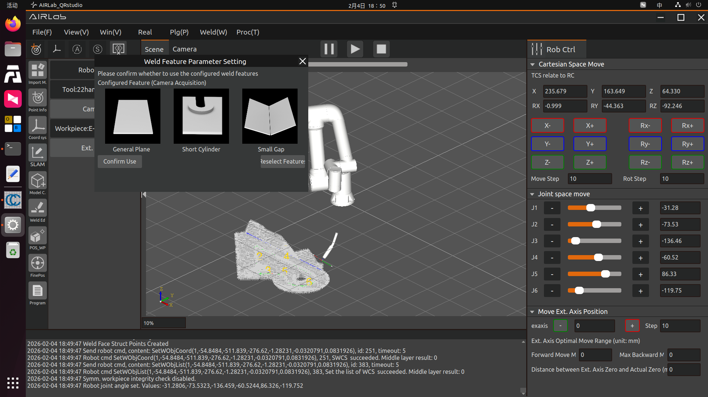

	import Existing Welding Project - Configured Features

The user needs to click the Confirm Use or Reselect Features button according to the actual workpiece characteristics. For detailed instructions on reselecting features, refer to Section 3.6.25.

To weld a workpiece, you must first perform an import: import models such as the robot, tool, and workpiece. If no workpiece model is currently available, model-free construction must be carried out first.

Next, perform workpiece positioning and weld seam editing. Once both are completed, set the automatic photographing pose, run the program for weld seam recognition, and generate the welding program.

This chapter provides a detailed description of each module in the project module.

Import module
~~~~~~~~~~~~~~~~~~~
Click the Import icon on the far left to enter the import module, where users can import robots, tools, workpieces, extension axes, or connect cameras.

.. figure:: analysis/27.png
	:align: center
	:width: 6in

	Module Setup Page

- Import Robot: Select the robot, and the interface will display the robot settings page. Switching the robot model will show a schematic diagram and basic information of the selected robot on the page, as illustrated in the figure.

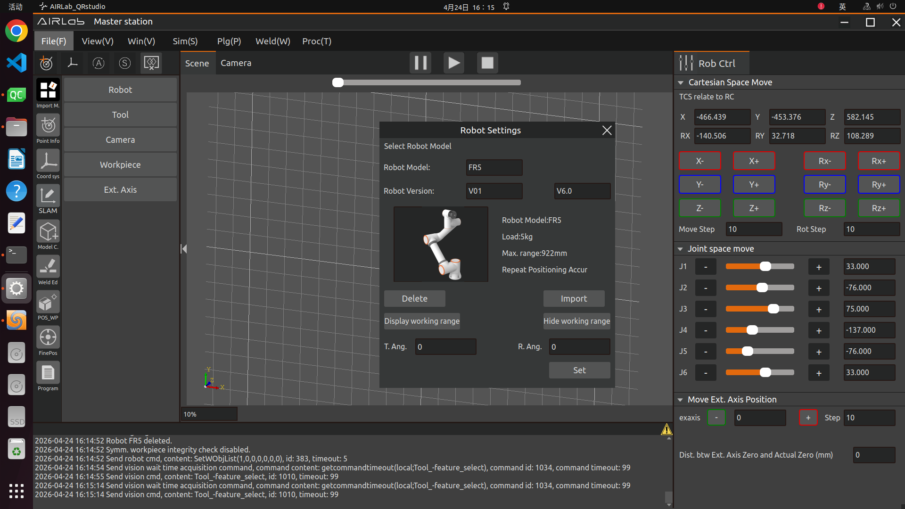

	Robot Settings Page

If the selected robot is not currently compatible with AIRLab software, a prompt interface will pop up, as shown in the figure.

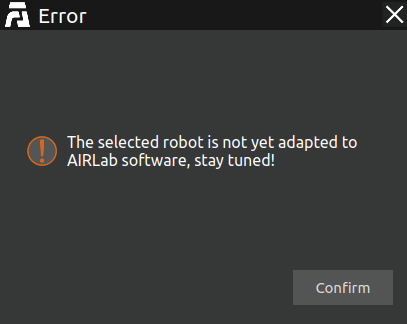

	Robot Incompatibility Warning Pop-up

Taking the FR5 as an example, select the FR5 model robot and its version number (currently only V6.0 is supported), then click "Import". The FR5 robot model will be imported into the 3D scene, and a "Robot imported successfully" message displayed in the terminal confirms the successful import of the robot model.

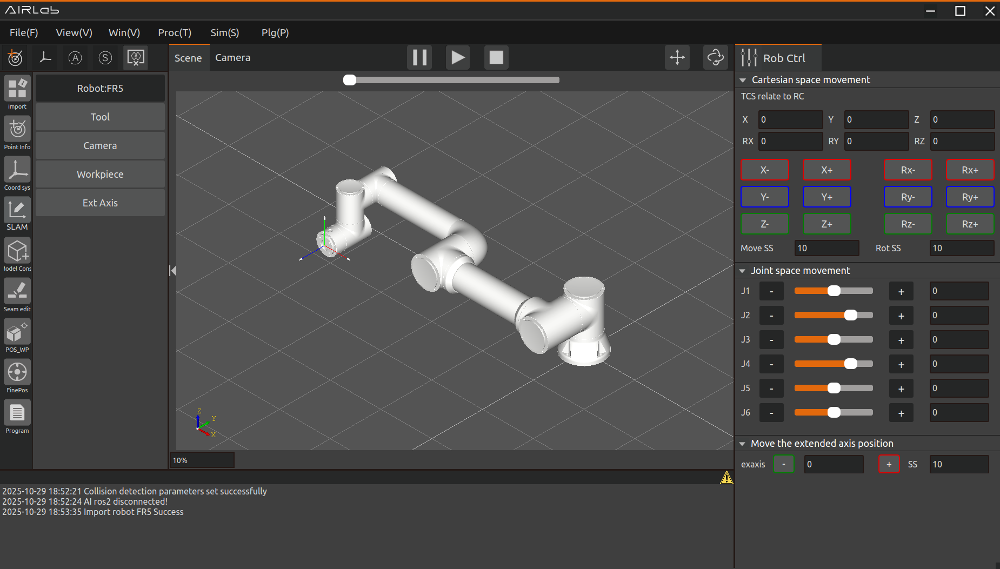

	Successful introduction of the robot

Considering more flexible and rich robot deployment scenarios, we provide a free installation function. The user setting module sets the tilt angle and rotation angle in the page, and the robot model in the 3D scene or shows the corresponding installation effect. After modification, click Set to complete the robot installation method settings.

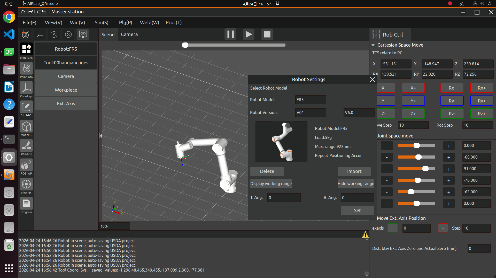

	Setting the robot tilt and rotation angles

.. important::
	After the robot is installed, the robot must be set up correctly, otherwise it will affect the use of the robot's drag function as well as the collision detection function.

You can delete the currently imported robot model by clicking the “Delete” button on the Robot Settings page.

- Import tool: Select the tool button, AIRLab interface will display the tool setting page.

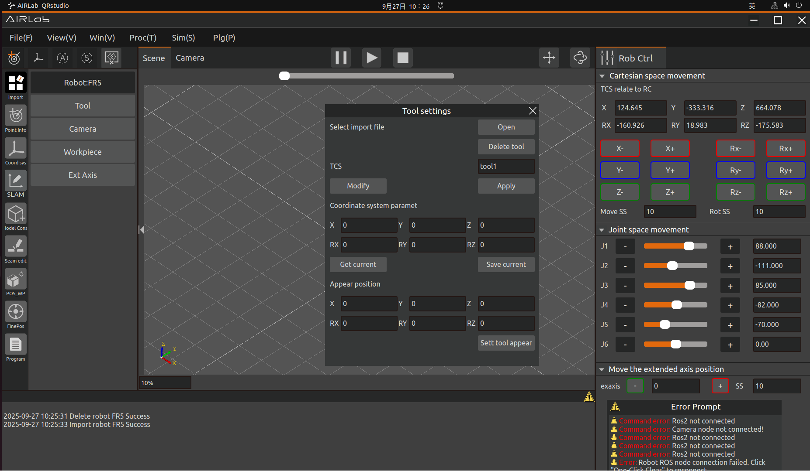

	Tool Setup Page

Click Open, select the tool model you want to import under the corresponding path, and click “Open”.

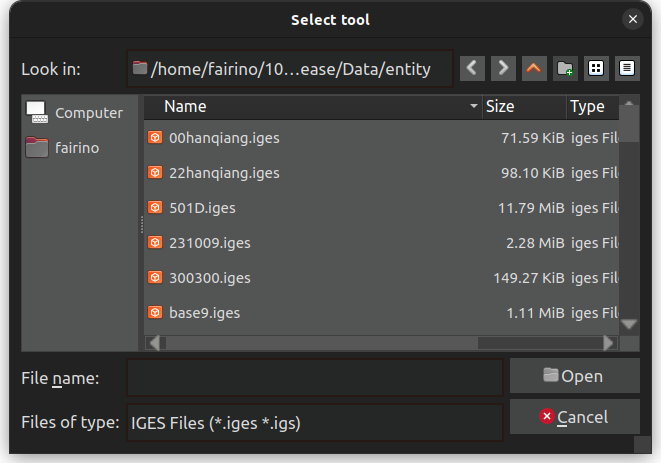

	Selection Tool Model

The imported tool model is displayed in the 3D scene, and the terminal displays “Successful tool import”, which means that the tool model has been successfully imported.

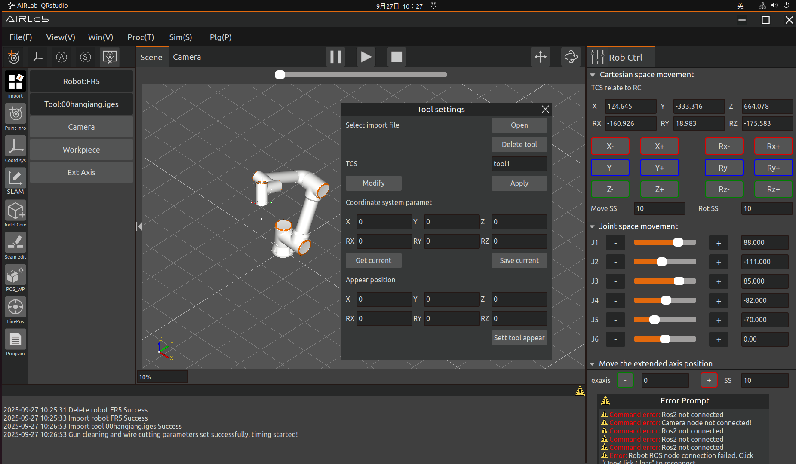

	Import Tool Success

After importing a tool, you can set the current coordinate system of the tool and the appearance position of the tool;

Click the “Get Current” button under the tool coordinate system on the tool setting page to get the current coordinate system of the tool, and then click “Save” to modify the tool coordinate system.

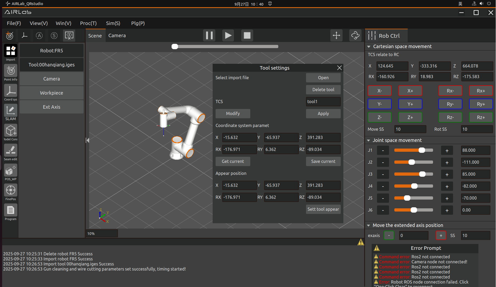

	Get the current tool coordinate system

If you need to modify the appearance position of the tool, modify the coordinates under Appearance Position on the Tool Settings page, and then click the “Set Tool Appearance” button to finish setting the appearance position of the tool.

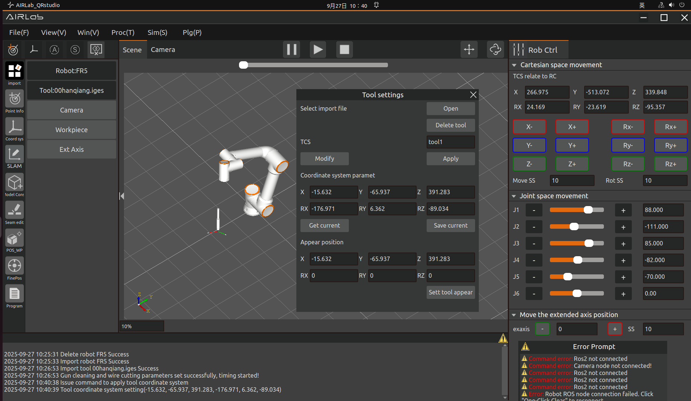

	Setting the Tool Appearance Position

You can delete the currently imported tool model by clicking the “Delete” button on the tool settings page.

- Import artifacts: Select the artifact,AIRLab interface will display the artifact setup page.

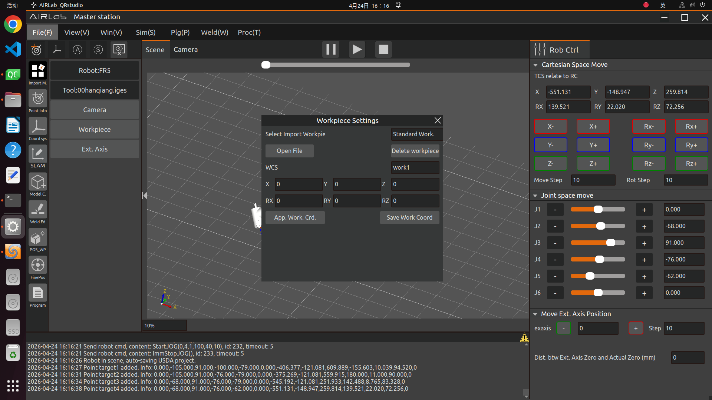

	Workpiece Setting Page

Click “Open” button, select the workpiece model to be imported under the corresponding path, click “Open”, the imported workpiece model will be displayed in the 3D scene, and the workpiece will be imported successfully.

Set workpiece coordinate system: After setting workpiece coordinate system in the workpiece setting page, click “Save Workpiece Coordinate System” to set workpiece coordinate system.

Delete workpiece: Click “Delete Workpiece” button in the workpiece setting page to delete the imported workpiece in the current 3D scene.

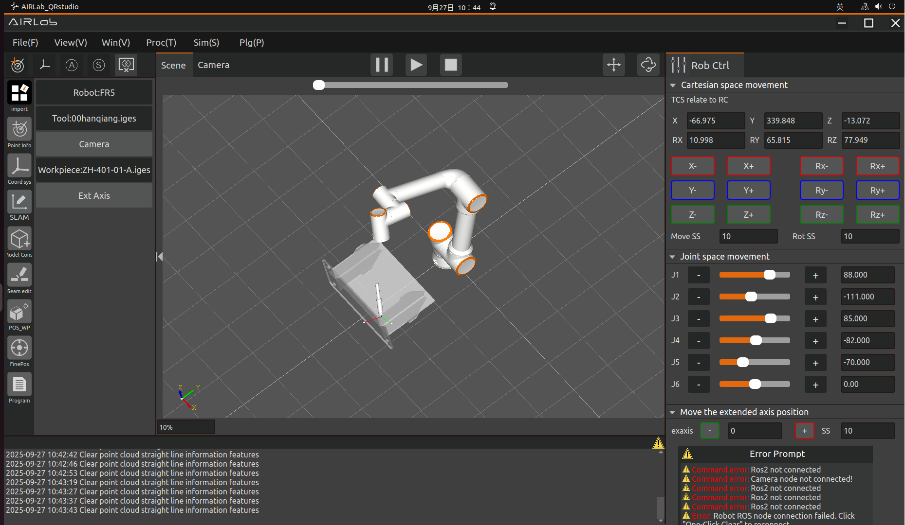

	Imported artifacts successfully

- Import Extended Axis: Select the Extended Axis.The AIRLab interface displays the Extended Axis Settings page, select the Extended Axis and click Import.

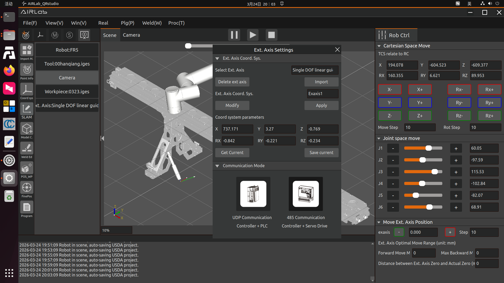

	Extended Axis Setup Page

The imported extended axis model is displayed in the 3D scene of AIRLab software, and the extended axis is imported successfully.

.. important::
	If the robot system version in use is **3.8.2.11 or higher**, enable the acceleration smoothing mode on the web platform first, as shown in the figure. Otherwise, synchronization failure of the extended axis motion will occur subsequently.

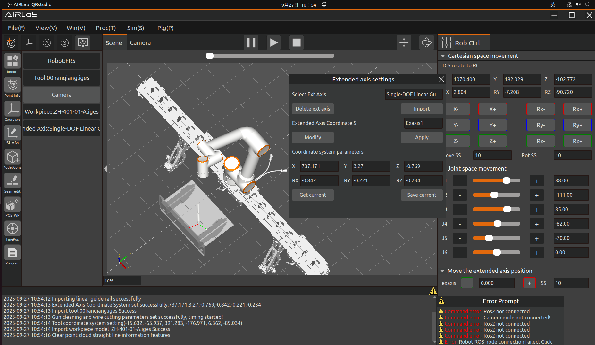

	Extended axis imported successfully

After the extended axis is imported successfully, communication configuration for the extended axis peripherals is required. Two communication methods are currently supported: Controller + PLC (UDP Communication) and Controller + Servo Drive (485 Communication).

The usage methods and detailed descriptions of the configuration for both methods are provided in Section 3.6.28.

Delete Extended Axis: Click “Delete Extended Axis” in the Extended Axis Settings page to delete the extended axis imported in the current 3D scene.

- Import Camera: Select the camera, and the AIRLab interface will display the camera settings page. The camera settings page is divided into three sections: Device Information, Parameter Configuration, and Device Debugging.

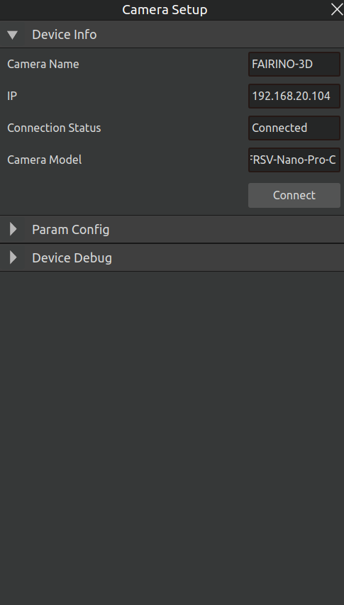

	Camera Device Information Page
	
- Device Information: Go to Camera Settings -&gt; Device Information. The page displays the camera name, IP address, connection status, and camera model of the connected camera. Under normal usage, the connection status shows "Connected". If the connection status shows "Disconnected", please click the "Connect" button to reconnect.

After the camera is successfully connected, if you need to view the camera's current parameter configuration, click "Parameter Configuration" to open the parameter configuration page. By default, only two general parameters, Shooting Mode and Exposure Time, are displayed. The parameter values shown on the page are the parameters currently used by the camera.

- Shooting Mode: Divided into two modes: Structured Light and Line Scan. If the workpiece is highly reflective, Line Scan mode is recommended.
- Exposure Time: When the image is too dark, increase the exposure time; when the image is too bright, decrease the exposure time.

For special scenarios, such as highly reflective workpieces, the parameter configuration page provides advanced parameter settings for adjustment. Click the "Open Advanced Parameters" button to expand the list of advanced parameters, as shown in the figure. The adjustable range for each parameter is displayed after the parameter name; please follow the prompts to set them.

After setting the parameters, click the "Set Parameters" button below to complete the advanced parameter settings. If you need to restore the default parameters, click the "Restore Default Parameters" button. The meanings of each parameter are as follows:

- High Reflection Suppression – Exposure Gain: The stronger the workpiece reflection, the lower the gain value should be set.
- High Reflection Suppression – Brightness Threshold: Controls the effective image area used for calculation. The larger the value, the fewer effective points and the faster the calculation; the smaller the value, the more effective points and the richer the details. (Used only in Line Scan mode)
- Noise Filtering – Speckle Filter Threshold: Used to filter out isolated noise point areas with minimal area. The larger the value, the stronger the noise removal and the cleaner the data; the smaller the value, the richer the details, but noise increases accordingly. (Used only in Line Scan mode)
- Noise Filtering – Filter Parameter: Controls the number of times edge noise filtering is performed. The larger the value, the less noise, but the sparser the data; the smaller the value, the more details are retained. (Used only in Line Scan mode)
- Surface Quality – Smoothing Coefficient: Removes false data at edges. The larger the coefficient, the more false data is removed, but edge loss becomes more severe. It is recommended to use the default value; modify with caution. (Used only in Line Scan mode)
- Surface Quality – Connectivity Threshold: Used to determine whether adjacent points belong to the same continuous region. The larger the value, the easier it is to form continuous regions; the smaller the value, the stricter the connectivity judgment and the more prone to discontinuities. (Used only in Line Scan mode)
- Edge Quality – Edge Filter Threshold: Used to filter depth image regions (edges or outliers). The larger the value, the stronger the edge removal and the fewer details retained; the smaller the value, the weaker the edge removal and the more details retained. (Used only in Line Scan mode)

Parameter Tuning Suggestions:

- Excessive point cloud noise: Increase the Speckle Filter Threshold, increase the Edge Parameter, decrease the Connectivity Threshold, decrease the Edge Filter Threshold.
- Sparse data: Increase the Connectivity Threshold, decrease the Speckle Filter Threshold, decrease the Brightness Threshold.
- Missing or broken edges: Increase the Edge Filter Threshold, decrease the Filter Parameter.

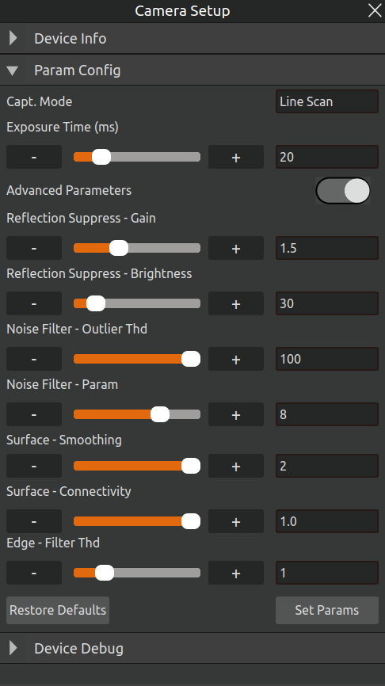

	Camera Parameter Configuration Page

If you need to use the "Camera Calibration" and "Ground Segmentation" functions, click "Device Debugging" to enter the device debugging page. The functions of each button are described as follows:

- Hand-Eye Calibration: Perform eye-in-hand or eye-to-hand calibration for the camera, and calculate the hand-eye calibration matrix. For detailed operations, see Section 2.5, "Point Cloud Camera Hand-Eye Calibration."
- Capture Ground: Control the camera to aim at the plane where the workpiece is located, then click the button to complete ground capture.
- Ground Effect Verification: Perform visual verification of the captured and calculated ground plane. For detailed operations, see Section 2.6, "Ground Plane Acquisition and Verification."

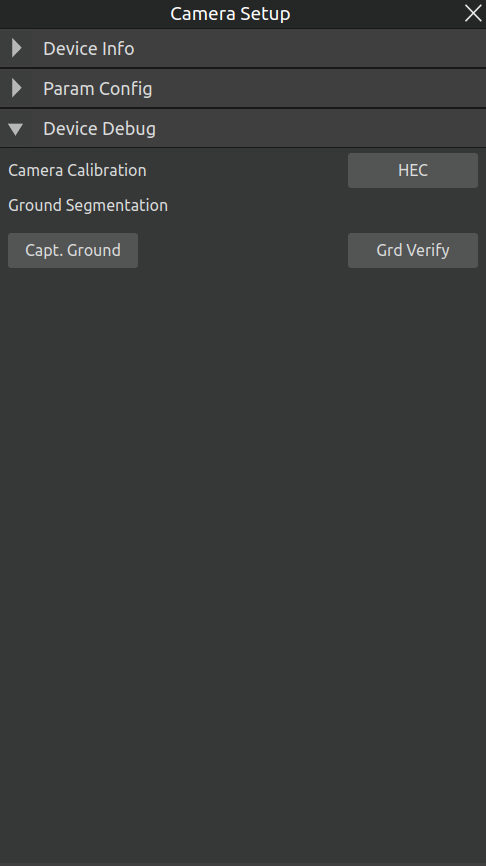

	Camera Device Debugging

SLAM mapping
~~~~~~~~~~~~~~~~~~~~~~~~~~~~~~
First, click the SLAM Mapping Module in the Project Module to configure the method and image capture settings for the entire process. Click the + icon, and the SLAM Mapping Image Capture Settings pop-up window will appear. The main steps of the entire SLAM mapping process are described in detail below.

Step 1: After entering the pop-up window, click the SLAM Mapping Scanning tab. Two sensor options are currently available: Camera and Lidar. The Lidar mode is not yet implemented; please select Camera for now. Two scanning methods are provided: Oscillating Scan and Fixed Scan. Please select Oscillating Scan. Finally, enter a name for the SLAM mapping workpiece model. Do not include Chinese characters in the name, as shown in the figure below.

Oscillating Scan: The camera projects a laser and rotates 120° around the far-point position.

Fixed Scan: The camera moves to the central position and remains stationary; real-time data can be acquired by moving the camera.

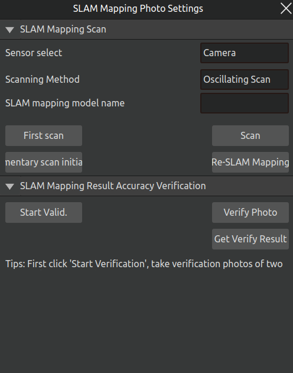

	SLAM Mapping Scanning

Step 2: Start SLAM mapping. Click the SLAM Mapping Scan header, directly drag the robot to the first point, and then click the First Scan button.

After the first capture, continue moving the robot to the next position and click the Scan button. The button will be hidden until the scan is completed and reappear automatically after the scan ends. Repeat the robot movement + scan operation until the SLAM mapping scan of the workpiece is finished. After all scans are completed, click the Rebuild SLAM Map button—the generated model will be displayed in the 3D scene on the main AIRLab interface.

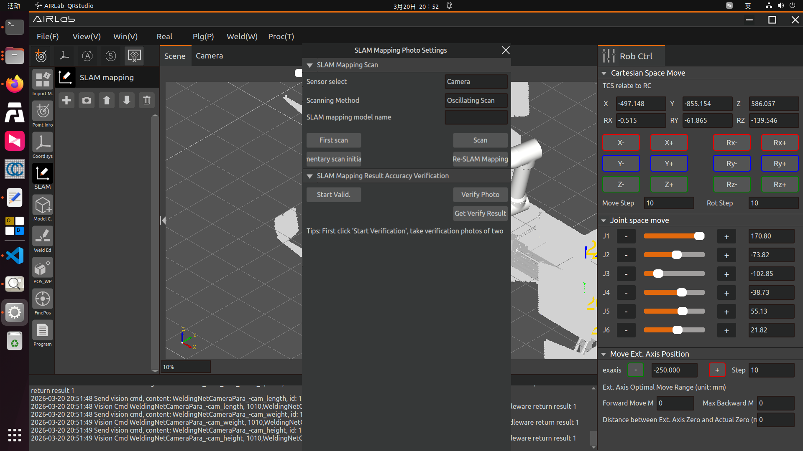

	SLAM Mapping Supplementary Image Capture

Step 3: Perform supplementary scanning. If the obtained SLAM map is incomplete, supplementary scanning and reconstruction are required. Click the Supplementary Scan Initialization button under the SLAM Mapping Supplementary Image Capture tab. There is no need to click the First Capture button again. Move the robot to the incomplete area of the model and click the Scan button. After all supplementary scans are completed, click Rebuild SLAM Map to obtain the reconstructed model.

Step 4: Perform SLAM parametric modeling to complete the model. Click Welding (W) — Collision Model Parametric Completion. For detailed steps, follow the instructions in Section 3.7.30 of this manual.

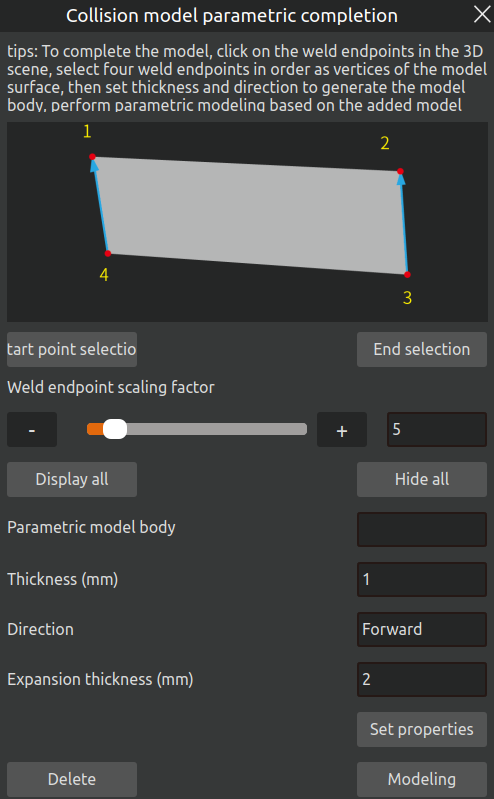

	Parametric Completion

Step 5: Verify whether the accuracy of the SLAM mapping result meets the requirements, as shown in the figure. After the SLAM map is successfully obtained, click Start Verification. Move the robot to a diagonal position of the workpiece and click Verification Capture to take a photo of a three-surface structure on the workpiece. After the photo is taken successfully, move the robot to the opposite diagonal position and click Verification Capture again to take a photo of the three-surface structure at the opposite diagonal of the workpiece.

After both photos are taken successfully, click Obtain Verification Result. The result will be displayed in a pop-up window. If the verification passes, proceed to subsequent operations. If the verification fails, troubleshoot the cause of the accuracy failure and rebuild the SLAM map.

	SLAM Mapping Result Accuracy Verification

Step 6: Configure the calculation rule parameters. Open the Welding (W) — Pose Calculation Strategy Settings pop-up window. Set the parameters in Collision Detection and Obstacle Avoidance Planning Rule Configuration, the parameters in Welding Torch Pose Calculation Rule Configuration, and the camera parameters in Camera Pose Calculation Rule Configuration, as shown in the figure below. For details, refer to the Pose Calculation Strategy Settings section of this manual.

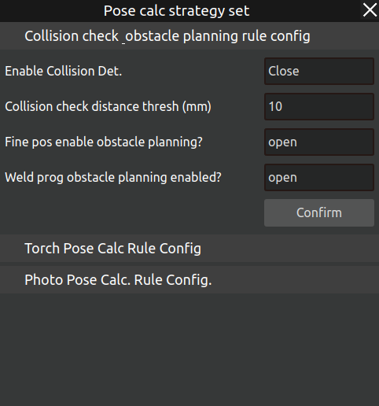

	Pose Calculation Strategy Settings

If an extended axis is imported, also set Distance between Extended Axis Zero Point and Actual Zero Point on the right side of the AIRLab interface. Move the robot to the configured extended-axis zero position, and then move the robot as far as possible toward the outermost position of the extended axis. Set the absolute value of the traveled distance as Distance between Extended Axis Zero Point and Actual Zero Point.

Step 7: Select weld seams. Enter the Weld Editing module, click the + icon to open the Weld Seam Selection pop-up window, and add weld seams according to the Weld Seam Addition instructions in Section 3.7.11.

.. important::
	If a Weld Seam Addition Failed prompt appears after clicking Confirm, it indicates that the algorithm has no qualified recommended pose for the weld seam. You need to select the weld seam in the weld seam list, open the Weld Seam Editing pop-up window, and manually teach the welding poses of the start point, end point and safety point of the weld seam. For the introduction of the Weld Seam Editing pop-up window, refer to Section 3.6.11 in this manual.

Step 8: After completing the addition of weld seams, enter the Fine Positioning module and click the Fine Positioning header. In the menu shown below, select Set Automatic Camera Pose Screening Strategy. The Shooting Pose Screening Settings pop-up window appears. After setting the parameters, click Confirm.

Enable Filtering: When enabled, AIRLab will further filter the algorithm-recommended fine positioning image capture poses. It is recommended to enable this function.

Enable Joint Pose Filtering: Serves the same purpose as the item in the Weld Seam Selection pop-up window—prevents collisions or inaccessibility caused by large changes in the robot s pose during fine positioning image capture. Setting Method: Move the robot to a position near the first weld seam, adjust the robot joints to the image capture pose, check the current J3 and J5 joint values of the robot on the right interface of AIRLab, and determine the selection of J3 Joint Angle and J5 Joint Angle in the figure based on these values.

Enable Collision Detection Filtering: Prevents collisions between the recommended image capture pose and the workpiece or the robot itself. It is recommended to enable this function.

Enable Path Planning Filtering: When enabled, AIRLab will reference the previous image capture position to filter the current one, ensuring a collision-free path between the two positions. It is recommended to enable this function.

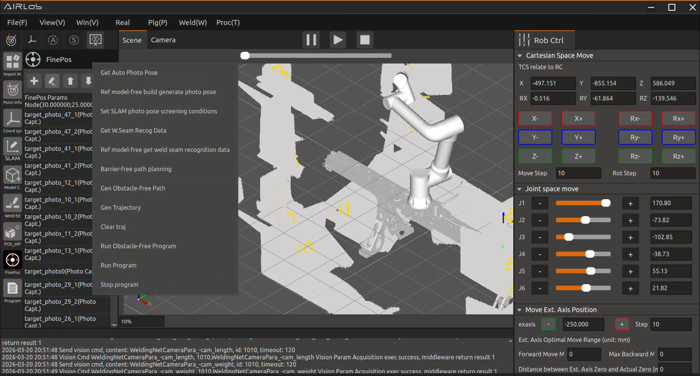

	Fine Positioning Menu


	SLAM Image Capture Pose Filter Condition Settings

Step 9: Obtain automatic image capture poses. Click the Fine Positioning header and select Obtain Automatic Image Capture Poses from the menu. AIRLab calculates and provides the fine positioning image capture positions that meet the filter conditions. Positions that pass the filter are automatically added to the fine positioning list. For positions that fail the filter, the interface displays the failure reason and corresponding weld seam number. The solution is described in Step 10.


	Obtain Automatic Image Capture Poses

Step 10: After automatic image capture pose acquisition is complete, click the + icon to open the Fine Positioning pop-up window, as shown below. To configure a fine positioning parameter node, enter the parameters and click Confirm. To perform collision detection on the added capture positions, set Enable Collision Detection to Yes. Enabling this option is recommended.

For positions that failed the filter in the previous step, perform manual teaching here. Click Add New Capture Point. AIRLab records the robot's current position and adds it to the end of the fine positioning list. According to the weld seam number of the failed position, select the newly added position and click the ↑ icon to move it to the correct location.

.. important::
	Manually add several transition points at the end of the fine positioning position list to ensure the robot can safely return from the capture end point of the last weld seam to the capture start point of the first weld seam.


	Fine Positioning Pop-up Window

Step 11: Perform obstacle-free trajectory planning for the fine positioning points. Click the Fine Positioning header and select Obstacle Avoidance Planning from the menu. Wait for the AIRLab planning result. If planning succeeds, open the menu and click Generate Trajectory to display the planned trajectory. If planning fails, AIRLab displays the name of the failed point. You can modify the point or add a transition point.

To modify a point, enter the Position Information module, find and select the failed point, open the Position Information Modification pop-up window, modify the point, and save it.

To add a transition point, select the failed point and click Add Transition Point Before Current Point in the pop-up menu. The Add Path Point pop-up window appears, as shown below.


	Failed Point in Obstacle-Free Trajectory Planning

Step 12: Run the fine positioning program. Click the Fine Positioning header and select Run Program from the menu.

Step 13: After the fine positioning program runs successfully, enter the Program module and click the Program header, as shown below. If obstacle-free trajectory planning is required, first click Obstacle Avoidance Planning in the menu. After planning succeeds, click Generate Trajectory to check whether the trajectory is correct. After confirming the trajectory, click Run Program to start welding.

.. important::
	After the program is generated, do not modify the program nodes; do not modify the list information of weld seam editing unless necessary. If the weld seam order in the weld seam list is modified or weld seams are added/deleted, return to Step 8 and reconfigure the relevant settings.

	Run Program

Model Construction
~~~~~~~~~~~~~~~~~~~~~~~~~~~~~~
If the workpiece to be welded does not have a model file, perform model-free construction first. Otherwise, directly import the workpiece model and proceed to the weld editing operations described in Section 3.5.4.

1. First, create a model-free construction program.

Click Project Module - Model Construction.


	Project Module - Model Construction

Click the plus sign. The Model-Free Construction pop-up appears as shown below. If a non-spline feature is selected in Welding Feature Parameter Configuration, the pop-up is as shown in the first figure below. If a spline feature is selected, the pop-up is as shown in the second figure.


	Model-Free Construction Pop-up - Workpiece with Non-Spline Features


	Model-Free Construction Pop-up - Workpiece with Spline Features

You can add a Model-Free Construction Parameter node, Capture node, Move node, or Model Construction node. Spline and non-spline features use the same node types and node definitions. The following uses a non-spline feature as an example to explain the purpose of each node type and how to add it.

Add Move Node: There are two types, Real-Time Pose and Point Library. Real-Time Pose uses the robot's current pose, while Point Library allows you to select an existing point. As shown below, if image capture is not required at the current node, clear the "Capture at Current Point" check box.

.. figure-row:: analysis/model_move_node_point_library.png analysis/model_move_node_realtime_pose.png
	:alt-1: Add Move Node - Point Library
	:alt-2: Add Move Node - Real-Time Pose

	Model-Free Construction Pop-up - Add Move Node


	Model-Free Construction Pop-up - Successfully Added Move Node

When teaching capture points for model-free construction, ensure that the camera can clearly and completely capture all areas of the model-free workpiece, especially the weld seam locations.


	Workpiece Capture Points from Different Angles

Add Model Construction Node: After adding multiple groups of Move nodes, add a Model Construction node. The available model construction methods are Line + Arc and Spline. If Spline is selected, set the sampling interval. After selecting the construction method, enter a name for the model-free workpiece. Click "OK". A "Model Construction" node appears under the Model-Free Construction module, indicating that the node has been added successfully.


	Add Model Construction Node

.. important::
	If the workpiece is symmetrical, enable the completeness check when adding the Model Construction node, as shown below. The entire workpiece must also be captured completely during model construction.


	Enable Completeness Check

After adding the nodes, you can edit, move up or down, and delete them as needed.

To edit a node, select it and click the pencil-shaped "Edit" icon. The corresponding node editing page appears. Make the required changes, as shown below.


	Edit Model Construction Node - Move/Capture Node


	Edit Model Construction Node - Model Construction Node

If model-free construction parameters need to be configured before running the program, click the first icon button to open the Model-Free Construction Settings pop-up. Modify the parameters under "Advanced Parameters", and then click "Set Parameters" to issue the new parameters.

If improper model construction parameters cause weld seam acquisition to fail, set the parameters and then click "Rebuild Model" to reacquire the model data using the updated parameters.


	Add Model Construction Parameter Node

To construct the model from an existing file instead of scanning in real time, select "3D File Parsing" under "Model Source", as shown below.


	Model Source - 3D File Parsing

Three file types are available: "Model File", "Process File", and "Model Process Compressed Package". If "Model File" or "Model Process Compressed Package" is selected, enter the parameters required to parse the model data: "Minimum Retained Length of Flat Cylindrical Arc Weld Seam" and "Minimum Retained Length of Flat Cylindrical Straight Weld Seam". For details about 3D parsing, see Section 3.7.17.

2. Run the model-free construction program.

After creating the model-free construction program, click the "Model Construction" module and then click "Generate Trajectory" to view the simulated trajectory. After confirming that the trajectory is correct, click "Run Program" to run the model-free construction program.


	Click the Model-Free Construction Module

For a symmetrical workpiece with the completeness check enabled, the software checks the completeness of the constructed model after the model-free construction program finishes. If the model is incomplete, the software displays a completeness check failure, as shown below. Capture the missing areas until the model is complete.


	Completeness Check Failed

The current completeness-check point cloud is also displayed, as shown below. Blue and yellow indicate the two symmetrical parts of the point cloud. Red indicates an asymmetrical part for which no corresponding point was found. Capture points at the positions symmetrical to the red areas, or use the stitched point cloud in the small window to determine the areas that require additional capture.


	Completeness-Check Point Cloud

After the symmetrical workpiece model is complete, the software displays a completeness check success message, as shown below. You can then proceed to the next operation.


	Completeness Check Successful

After the model-free construction program finishes, the generated workpiece model, weld seams, and surface-structure information are displayed in the AIRLab 3D scene. Red spheres indicate three-surface structures, and blue spheres indicate two-surface structures. Check whether the model, weld seams, and surface-structure information are correct. If they are correct, model-free construction is successful. A successfully constructed model can be imported directly for later use without reconstructing the model-free workpiece.


	Model-Free Workpiece Constructed Successfully

If the model is incomplete, capture the missing areas and then click "Get Model Data" to reacquire the supplemented model. Repeat until the model-free workpiece model is created correctly.

3. Model construction function options.

Click the Model-Free Construction module to access options such as Get Model Data. The function of each option is described below.

- Supplementary Capture: If the workpiece model generated by the model-free construction program has incomplete areas, move the robot to each area that requires additional capture and click "Supplementary Capture". After all additional captures are complete, click "Get Model Data" to import the supplemented workpiece model again.

- Get Model Data: Click "Get Model Data". After clearing the model data, click this option to reacquire the model-free workpiece model.

- Clear Model Data: Click "Clear Model Data" to remove the model-free workpiece model from the 3D scene.

- Run Program: Click "Run Program" to run the program in the current Model-Free Construction module.

- Stop Program: Click "Stop Program" to stop the robot immediately.

- Generate Trajectory: Click "Generate Trajectory" to generate the simulated program trajectory in the AIRLab 3D scene.

- Show Tool: Click "Show Tool" to display the virtual tool model in the AIRLab 3D scene.

- Clear Tool: Click "Clear Tool" to remove the virtual tool model from the AIRLab 3D scene.

Weld editing
~~~~~~~~~~~~~~~~~~~~~~~
After importing the workpiece or successfully constructing the workpiece without a model, the workpiece model and weld seam data will be displayed in the 3D scene.


	Weld Seam Editing Scene

Click the plus sign under Weld Editing, then click "Batch Add Weld Seams" to open the Weld Seam Selection dialog box. This dialog box categorizes all currently identified weld seams into "Flat Welding" and "Vertical Welding", as shown below.


	Weld Seam Selection Pop-up for Non-Spline Workpieces

According to actual requirements, check the weld seams to be added. A "Select All" button is also provided; clicking it will automatically select all weld seams in that category for convenient addition, as shown below.


	Weld Seam Selection Pop-up – Select All

On the right side of each weld seam number, there is a properties button. Clicking it allows you to set the properties for that weld seam when added. The main adjustable parameters are as follows:

- Reverse: Whether to reverse the direction of the weld seam when adding it.

- Segment Type: For arc weld seams, you can choose whether to add the seam in segments.


	Weld Seam Add Properties – Linear Weld Seam


	Weld Seam Add Properties – Arc Properties

AIRLab also provides a continuous weld seam option, which treats multiple connected weld seams as one complete continuous weld seam for subsequent operations. To add a continuous weld seam, click the plus sign under Weld Editing, then click "Add Continuous Weld Seam". The Add Continuous Weld Seam dialog box opens, as shown below.


	Add Continuous Weld Seam Dialog Box

Select the desired continuous weld seam numbers by selecting their check boxes. AIRLab disables weld seams that are not connected to the selected weld seam and leaves only the connected weld seams available for selection.


	Continuous Weld Seam Selection

After selecting the desired continuous weld seams, click "Complete Selection". If a weld seam was selected by mistake, click "Reset Selection" to select the weld seams again. The selected weld seams are added to the "Selected Weld Seams" list below.

	Continuous Weld Seam Selection Completed

You can bind welding processes to the weld seams in the selection list and set the reverse parameter for individual weld seams, as shown below.


	Continuous Weld Seam Addition - Parameter Editing

After editing the continuous weld seam parameters, click "Confirm Add". The continuous weld seam is added to the weld seam list, as shown below.


	Continuous Weld Seam Added

After a continuous weld seam has been added, if you open the batch-add dialog box again, the check boxes of the already-added weld seams display the corresponding status and cannot be selected for duplicate addition.


	Duplicate Addition Status

After all weld seams have been added, you can click the "Filter" icon on the "Weld Editing" header to filter the weld seams and uniformly set parameters for the added seams, as shown below.


	Weld Seam Filtering

First, set the filtering conditions. Based on the welding position, you can choose to filter "Flat Welding", "Vertical Welding", or "All Weld Seams". There are two filtering criteria available for selection: "Weld Seam Length" and "Welding Process". After setting and checking the corresponding criteria, click the "Filter" button to filter out the weld seams that meet the conditions, and they will be listed in the "Filtered Weld Seam List" below.

After checking the corresponding filtered weld seams, you can perform batch modifications based on the entered welding parameters. Two welding parameters are available for filling: "Weld Indentation" and "Welding Process". After setting and checking the corresponding options, click the "Batch Modify" button to apply the set parameters to the selected weld seams.


	Weld Seam Filtering – Batch Modify

For the welding of workpieces with spline features, Spline Feature must be selected first in the Welding Feature Parameter Configuration module. When adding weld seams, the Weld Seam Selection pop-up window is displayed as shown in the figure below. The Number of Selected Weld Seam Points on the page is non-editable, as it is a result of model construction.


	Weld Seam Selection Pop-up--Workpiece with Spline Features

If segmentation is required, set Enable Segmentation to Yes in the figure, and the page will be displayed as shown below.


	Spline Curve Weld Seam--Segmentation

First, set the Start Point and End Point, ensuring they fall within the range of the total number of points of the entire weld seam. For example, if the selected weld seam in the figure has a total of 36 points, the range of the number of points for the start and end points is [1,36]. After completing the settings, click the + icon on the page to add the segmented weld seam, as shown in the figure below.


	Add Segmented Weld Seam

If additional segments need to be added to the current weld seam, reset the Start Point and End Point and follow the same steps as above, as shown in the figure below. 

.. important::
	Segmentation must be complete, and the end point of one segment must coincide with the start point of the next segment.


	Continue Adding Segmented Weld Seams

After completing the weld seam segmentation, click the Confirm button in the figure, and the added segmented weld seams will be displayed in the weld seam list.


	Segmented Weld Seam Added

If the weld needs to be re-edited, select the weld, click the edit icon at the top of the module, and complete the parameter settings in the 'Seam edit' popup.


	Weld Seam Editing--Non-spline Weld Seam


	Weld Seam Editing--Spline Weld Seam

The meaning of each editing item in Weld Seam Editing is detailed in Section 3.6.9. Perform workpiece positioning or fine positioning operations only after all weld seams have been edited.

.. important::
	For the editing of plug workpieces, it is only necessary to bind the plug workpiece process.

After completing the weld seam editing for plug workpieces, click the "Weld Seam Editing" module and then click the "Generate Welding Program" button. A plug welding program will be generated under the "Program" node. Subsequent operations such as generating trajectories for the created welding nodes or running the program can be performed; details are provided in Section 3.4.6.

Workpiece positioning
~~~~~~~~~~~~~~~~~~~~~~~~
Workpiece positioning: After editing all the welds to be welded, workpiece positioning is required. Firstly, it is necessary to create a workpiece positioning program; Click on the workpiece positioning module, click on the plus sign under workpiece positioning, and the AIRLab interface will display the workpiece positioning page as shown in the figure.


	Workpiece Positioning Add Node Dialog

The workpiece positioning program contains four node types: Workpiece Positioning Parameter Node, Capture Node, Move Node, and Coarse Positioning Node. The parameter, capture, and move nodes are added in the same way as the corresponding nodes in the Model Construction module. See the Model Construction section for details.

.. important::
	For symmetrical workpieces, it is only necessary to capture the point cloud of the workpiece section indicated by the red cutting line in the interface, as shown below.


	Point Cloud Display and Symmetrical Workpiece Prompt

Add a rough positioning node: After adding multiple sets of "movement + photo" nodes, add a rough positioning node and select a workpiece positioning algorithm. The rough positioning algorithms include Model-based, Cylinder Positioning, Depth Model, Depth Model 2, and Plug Recognition. The applicable scenarios for each algorithm are as follows:

- Model-based: Used for rough positioning of workpieces after model-free construction or workpiece import.
  
- Cylinder Positioning: Not yet available.
  
- Depth Model: Used for workpiece recognition in the automatic cycle operation of template programs.
  
- Depth Model 2: Applicable to the same scenarios as "Model-based", used for rough positioning of workpieces after model-free construction or workpiece import.
  
- Plug Recognition: Used for recognition and positioning of plug workpieces.
  
After selecting the workpiece positioning algorithm, click "Confirm", and a "Rough Positioning" node will be generated under the workpiece positioning program.


	Add Coarse Positioning Node

After adding these nodes, you can adjust the added nodes as needed. Once completed, the workpiece positioning program will be successfully created.The entire program functions as follows:The robot will move to multiple capture positions and take photos until the workpiece is fully captured. Then, the program will perform coarse positioning of the workpiece.The created workpiece positioning program is shown in the figure below.


	Workpiece Positioning Program

.. important::
	As with Model Construction, add a Workpiece Positioning Parameter Node if the positioning parameters need to be modified. This node is inserted before the first node by default, so its parameter configuration command is issued before the rest of the program.

If you need to modify a workpiece positioning node, select the target node in the program tree, click the "Edit" (pencil-shaped) button above, make the modifications as needed, and save, as shown in the figures below.


	Workpiece Positioning Node Modification – Parameter Node


	Workpiece Positioning Node Modification – Move Node


	Workpiece Positioning Node Modification – Positioning Node

After creating the workpiece positioning program, click the "Workpiece Positioning" module. Options such as "Run Program" have the same functions as those in the Model Construction module.

If no error occurs during the execution of the workpiece positioning program, a colored point cloud of the workpiece will be displayed on the interface upon completion.The meaning of the point cloud colors is as follows:1.Green: Workpiece positioning angle error < 5°;2.Yellow: 5° ≤ Workpiece positioning angle error ≤ 10°;3.Red: Workpiece positioning angle error > 10°.

.. important::
	The colors only represent the visualization of the angle error result and do not affect the actual registration result. The registration result depends only on the actually calculated registration accuracy and overlap rate.


	Successful Workpiece Positioning – Green Workpiece Point Cloud


	Successful Workpiece Positioning – Colored Workpiece Point Cloud

If workpiece positioning fails, the interface will display a visualization result of the registration error, where blue represents the workpiece positioning point cloud and white represents the workpiece model point cloud, with a corresponding prompt popup window appearing at the same time.The specific workpiece positioning error types are divided into the following three categories:

1. Low point cloud registration coverage but qualified accuracy, with misalignment.Message: Point cloud registration failed. Local registration accuracy is qualified, but the overall overlapping area is insufficient, and there is a risk of point cloud misalignment. Please compare with the model point cloud, adjust the shooting angle, and perform workpiece positioning again.As shown in the figure below.

2. High point cloud registration coverage but low accuracy, with local roughness.Message: Point cloud registration failed. The overall overlapping area is qualified, but local registration accuracy is insufficient. Please compare with the model point cloud, check whether feature areas were over captured or under captured, and perform workpiece positioning again.As shown in the figure below.

3. Both point cloud registration coverage and accuracy are low.Message: Point cloud registration failed. Both registration accuracy and overlapping area are unqualified. Please compare with the model point cloud, adjust the shooting angle, and perform workpiece positioning again.As shown in the figure below.


	Workpiece Positioning Error – Type 1


	Workpiece Positioning Error – Type 2


	Workpiece Positioning Error – Type 3

If workpiece positioning fails and the above problems occur, please re-position according to the error message instructions.If the above problems persist and cannot be resolved, or if other issues arise, please contact after-sales personnel and retain the current data.


	Click the Workpiece Positioning Module

- Reposition: After issuing the workpiece positioning parameters, click "Reposition" to acquire positioning data using the modified parameters.

- Generate Workpiece Positioning Program: Automatically generate a workpiece positioning program from the capture points created during model construction.

- Clear Cutting Point Cloud: Remove the cutting point cloud of a symmetrical workpiece from the 3D scene.


	Clear Cutting Point Cloud

- Display Cutting Point Cloud: Show the cutting point cloud of a symmetrical workpiece in the 3D scene.


	Display Cutting Point Cloud

Click "Generate Trajectory" to view the simulated trajectory of the workpiece positioning program. After confirming that the trajectory is correct, click "Run Program" to perform coarse workpiece positioning. When the program finishes successfully, the workpiece is moved to its actual position relative to the robot, as shown below.


	Workpiece Positioning Program Completed

Welding Instructions for Plunger Workpieces

Step 1: Add the plunger process, and set up the filling process, reinforcement process, arc starting process, and arc ending process.


	Adding the plunger process

Step 2: Edit the workpiece positioning program and run it.

Open the AIRLab welding software system and import the project. Edit the workpiece positioning program by adding nodes for movement, photographing, and plunger recognition. 


	Plunger Workpiece Positioning Program

Run the workpiece positioning program to position the plunger workpiece and identify the plunger weld seams. The 3D scene displays the workpiece model and weld seam information of the plunger, as shown in the figure.


	Workpiece positioning result for the plunger workpiece

Step 3: Add the plunger weld seams to be welded, and bind the plunger process to the selected plunger weld seams.

Step 4: After adding all plunger weld seams to be welded, click "Weld Seam Editing → Run Program". A plunger welding program will be generated under the program node.

Step 5: Click "Program → Generate Trajectory". The welding trajectory will be generated in the 3D scene.


	Welding simulation trajectory for the plunger workpiece

Step 6: After confirming that the trajectory is correct, proceed with simulation and then perform a simulated welding test.

Fine pose
~~~~~~~~~~~~~~~~~~~~~~~~~~~~~~~
After weld editing or workpiece positioning is completed, it is necessary to perform fine positioning on the workpiece welds to obtain weld data. Enter the "Fine Positioning" module and open the fine positioning function menu, as shown in the figure below.


	Fine Positioning Menu

Step 1: First, click "Set Automatic Photo Pose Filtering Strategy" to enter the "Photo Pose Filtering Settings" page, as shown in the figure below. The meanings of the parameters are introduced as follows:


	Photo Pose Filtering Settings

Whether to enable filtering: After filtering is enabled, AIRLab will perform further rational screening on the algorithmrecommended finepositioning photo poses. It is recommended to keep this enabled.

Whether to enable joint-angle filtering: This serves the same purpose as the "Enable joint-angle filtering" option in the weld selection popup – it prevents the robot from experiencing large pose changes during the fine
positioning photo capture process, which could lead to collisions or unreachable states. Method: Move the robot to a position near the first weld, adjust the robot joints to the photo
capture pose, and check the current joint values of J3 and J5 displayed on the right-side interface of AIRLab. Based on these values, determine the selections for "J3 Joint Angle" and "J5 Joint Angle" in the figure.

Whether to enable collisiondetection filtering: To avoid the recommended photo poses from actually colliding with the workpiece or the robot itself, it is recommended to enable this filtering.

Whether to enable pathplanning filtering: When this filtering is enabled, AIRLab will reference the previous photo point to filter the current photo point, ensuring that a collisionfree path exists between the two points. It is recommended to enable this.

Step 2: After the filtering parameters are configured, click the "Get Automatic Photo Poses" button. AIRLab will compute and provide the fine-positioning photo points that meet the filtering criteria. The successfully filtered photo points will be automatically added to the fine
positioning list. For the points that fail the filtering, the interface will display the failure reason along with the corresponding weld number (solutions are explained in Step 3), as shown in the figure below.


	Auto‑Acquired Photo Poses

Step 3: After the automatic photo pose acquisition is completed, click the "+" icon button to bring up the fine positioning popup window, as shown in the figure below. If you need to configure fine positioning parameter nodes, enter the parameters and click the "OK" button.


	Add Fine Positioning Parameter Node

For the photo points that failed filtering in the previous step, please manually teach them here. The teaching method is as follows:

Turn on the "Enable Intelligent Point Insertion" button. The "Weld Endpoint Type for Capture" dropdown box will display the points that failed recommendation in the automatic photo pose acquisition results, such as "Start point of Weld 1" shown in the figure below. After selecting the endpoint type, click the "Add Photo Point" button. The new point will be automatically inserted into the current fine positioning list based on the principle of minimizing the sum of robot joint changes.


	Adding Missing Recommended Auto Photo Points

If there are no failed recommendation points in the automatic photo pose acquisition results, and the user wishes to add custom points with intelligent point insertion, as shown in the figure below, first select the "Custom Point" option from the "Weld Endpoint Type for Capture" dropdown box. Then select the "Point Name Selection" option. For custom point naming, the page provides two naming methods: "Default Name" and "Custom Name" in the "Point Name Selection" dropdown box. After confirming the point name, click the "Add Photo Point" button.


	Custom Point — Using Default Name


	Custom Point - Using Custom Name

If you are teaching a transition point that only needs to be added at the end of the fine positioning list without using intelligent insertion, turn off "Enable Intelligent Point Insertion" and click "Add Photo Point." The robot's current point will be added to the end of the fine positioning list, as shown below.


	Directly Add a Demonstration Transition Point

.. important::
	Please manually add several transition points at the end of the fine positioning point list to ensure that the robot can safely return from the capture endpoint of the last weld to the capture start point of the first weld.

If you need to modify a node in the fine positioning list, select the node in the list and click the "Edit" icon button. After editing the corresponding parameters, save the changes, as shown in the figures below.


	Fine Positioning Node Modification – Vision Parameter Node


	Fine Positioning Node Modification – Camera Pose Node

Step 4: Perform obstacle-free trajectory planning for the fine positioning points. If fine positioning obstacl-avoidance planning was enabled in the "Pose Calculation Strategy Settings" popup, click the title "Fine Positioning," select and click "Obstacle-Avoidance Planning" from the menu that appears, and wait for the AIRLab obstacl-free trajectory planning result. If planning succeeds, open the menu and click "Generate Trajectory" to display the successfully planned trajectory. If planning fails, AIRLab will display the name of the failed point, and you can either modify that point or add transition points.

Method for modifying a point: Go to the Point Information module, locate and select the point that failed planning, open the point information modification popup, modify it, and save.

Step 5: Run the fine positioning program. Click the title "Fine Positioning," and in the menu that appears, select and click "Run Program."

After completing the fine positioning program, if fine positioning obstacl-avoidance planning was enabled in the "Pose Calculation Strategy Settings" popup, please first click "Obstacle-Avoidance Planning" in the fine positioning function menu. If the obstacle-avoidance planning succeeds, click "Run Program" in the menu bar (which has already been enabled).

.. figure:: analysis/fine_locate_operate_ui.png
	:align: center
	:width: 3.5in

	Clicking the Auto Photo Pose Module

The following is an introduction to the functions of each option:

- Get Automatic Photo Poses: Click to obtain the recommended finepositioning photo points for all welds that have been added to the weld list.

- Generate Photo Poses from ModelFree Construction Reference: Automatically retrieves the photo points taught during modelfree construction and uses them as the finepositioning photo points.

- Set Automatic Photo Pose Filtering Strategy: Click to open the "Photo Pose Filtering Settings" page, where you can configure the filtering criteria for photo poses.

- Get Weld Recognition Data: Generates the welding program based on the finepositioning recognition results and the edited welds and their attributes.

- ObstacleAvoidance Planning: Click "ObstacleFree Trajectory Planning" to plan the welding program after collision detection.

- Generate ObstacleFree Trajectory: Click "Generate ObstacleFree Trajectory" to generate the robot motion trajectory after collision detection in the 3D scene.

- Run ObstacleFree Program: Click "Run ObstacleFree Program" to make the robot move according to the collisiondetected motion trajectory.

- Run Program: Click "Run Program" to make the robot execute the finepositioning program to perform fine positioning on the welds. After the program runs successfully, the final welding program will be generated in the "Program" module.

- Stop Running: Click "Stop Running" to immediately halt the execution of the finepositioning program.

After the user confirms the trajectory, they can choose to run the program or run the obstaclefree program to perform weld recognition. Once the automatic photo pose program has finished running, the final welding nodes will be generated under the Program module.
 
Program
~~~~~~~~~~~~~~~~~~~~~~~~~~~~~~~
After the fine positioning program has finished running, the final welding program will be automatically generated under the Program module.


	Generated Welding Program

Click the "Program" module, and the user can select options such as "Run Program," "Stop Program," and "Generate Trajectory." The functions of these options are the same as those described above for the model-free construction "Run Program" and related options.

If collision detection for the welding program is enabled in the "Pose Calculation Strategy Settings," the first step is to click "Obstacle-Avoidance Planning" to complete the obstacle-avoidance planning for the Lua program, as shown in the figure below.


	Click the Program Module

After the obstacle-avoidance planning is completed, if no obstacle-avoidance-related errors are reported on the interface and no nodes in the Lua program list turn red, it indicates that the obstacle-avoidance path planning was successful. You can click "Generate Trajectory" to view it, and after confirming the trajectory is correct, click "Run Program."

If during the obstacle-avoidance planning process, the interface displays error messages indicating collision detection or path planning failures, note that there may be slight threshold deviations between collision detection and the actual environment. Please analyze based on the prompt information whether the problematic points need to be re-taught.

If you need to edit a program tree node, click the "Modify" pen-shaped icon button above. Depending on the instruction type, the corresponding editing pop-up window will appear. Modify the settings according to the actual situation, as shown in the figures below.


	Program Node Modification – Move Instruction


	Program Node Modification – Welding Parameter Instruction


	Program Node Modification – Custom Instruction

If after inspection, the reported point or path does not actually collide, click on that node in the Lua program, and the option "Set This Trajectory to Skip Collision Detection" will appear. After clicking it, the node color will change to yellow. You can then generate the trajectory and run the program.


	Obstacle-Avoidance Planning Failure Point

Clicking on “Generate Trajectory” generates a weld trajectory in the AIRLab 3D scene, and the user can choose to run a simulation on the trajectory.


	simulation trajectory

Click “Generate Tool”, the tool position of the key node will be displayed in the 3D scene, as shown in the following figure.


	Generation Tools

After the simulation and tool position are correct, click “Run Program” to start the actual welding.

The generated program can be adjusted, click on the generated node, you can delete it, add nodes above, add nodes below, edit nodes, move up or down operations. Click on the plus sign to the right of the program module, AIRLab software interface will appear in the program page, you can customize the content of the node, click “confirm”, the program node under the generation of the content of the node.

Point information
~~~~~~~~~~~~~~~~~~~~~~~~~~~~~
Point Information Module: Click the point in the point list, you can delete or edit the point. Click “Edit Points”, the interface of AIRLab software will show the page of point information modification, users can choose to move the direct target point, synchronize the current position or save the modified points.


	Modification of point information

1. Move to target point: user clicks “Move to target point” button, the robot end will move to the current edited point.
   
2. Synchronize the current point position: When the user clicks the "Synchronize Current Position" button, the pose of the currently selected point target0 will be modified to the pose of the robot that is actually taught.

3. Modify and save point position: The user modifies the point information, and then clicks the "Save Modify Point" button to modify the current point coordinates.

Reference coordinate system
~~~~~~~~~~~~~~~~~~~~~~~~~~~~~
Reference coordinate system: click the reference coordinate system icon in the menu bar, a new reference coordinate system will be create, the user can select the reference frame of reference coordinate system for the workpiece coordinate system or base coordinate system;Also can delete the current reference coordinate system, or edit the coordinate system.


	Reference Coordinate System Settings

Select which coordinate system is the reference coordinate system, then set the coordinates of the reference coordinate system, select “Show” and click the “Set” button, the reference coordinate system will be displayed in the AIRLab 3D scene. Select “Do not show” and click “Set”, the displayed coordinate system will be hidden.


	Reference coordinate system page

AIRlab Gantry Welding System
----------------------------------
For welding scenarios involving a mix of small workpieces of various types as well as large workpieces, the AIRLab Gantry Welding System is added. Through arbitrary combinations of multiple cameras or laser sensors, it enables rapid mapping of large workpieces or large working spaces, as well as collaborative welding by multiple robots.

The AIRLab Gantry Welding System mainly consists of two parts: 1. The master station performs global map construction; 2. The slave stations carry out welding operations. Before constructing the map, the master station must first complete the calibration of the laser radar and the calibration of the gantry frame.

.. important::
	When deploying the gantry system for the first time, please open AIRLab_exe/Data/import_config/Domain_id.config and set the Domain_id (domain ID). Set the master station to 10, and for slave stations, set them according to their slave station numbers (range: 1–9, and they must not be identical).

Calibration of LiDAR and Gantry Frame
~~~~~~~~~~~~~~~~~~~~~~~~~~~~~~~~~~~~~~~~~~~~~~~
Start AIRLab and create a new welding project. Then, open the pop-up window by selecting "Welding" — "Software Mode Settings" from the menu bar, choose "Master Station", and click the "OK" button, as shown in the figure below.


	Software Mode Settings

First, calibrate the LiDAR. The calibration steps are as follows:

Step 1: Click the "Camera" tab on the left side of the software interface. In the "Camera Settings" popup that appears, select the LiDAR section and click "Search Devices" to ensure that the LiDAR is successfully connected, as shown in the figure below.


	LiDAR connected successfully

Step 2: Click the "Multi-Sensor Calibration" button in "Device Debugging" to enter the "LiDAR Calibration" popup, as shown in the figure below. Follow the prompts in the popup to place the checkerboard in the correct position, then click the "Calibrate" button to complete the LiDAR calibration.


	LiDAR calibration


	LiDAR calibration

After successful LiDAR calibration, proceed with the calibration of the gantry frame. The calibration steps are as follows:

Step 1: Click the "Extended Axis" section on the left side of the software interface. For extended axis import, select "Gantry", and then click the "Import" button, as shown in the figure.


	Gantry Extended Axis Calibration 

Step 2: After successfully importing the gantry extended axis, first enable it. Click the "Servo Enable" button in the "Gantry Control" section on the right side of AIRLab, and observe whether the "Enable Status" in the gantry status changes to "Enabled". When the status switches to "Enabled", the gantry can be controlled. Click "Disable" to disable the gantry.

Motion Speed: Set the speed at which the gantry moves.

Target Position: The target position to which the gantry will move. You can refer to the current position in the "Gantry Status" for setting.

Start Motion: Click to start the gantry movement.

Stop Motion: Click to stop the gantry movement.

Return to Zero: Click to set the current position as the zero point of the gantry.

Clear Fault: If a fault occurs in the gantry, the fault monitoring in the "Gantry Status" will switch to "Abnormal". In this case, click this button. After the fault is cleared, normal use can resume.

Step 3: After successful import, click the "Calibrate" button to enter the "Gantry Extended Axis Calibration" pop-up window. Place the checkerboard according to the instructions in the pop-up window, and take calibration photos as guided by the prompts at the bottom. After all calibration photos have been taken, click the "Calculate" button to complete the gantry calibration, as shown in the figure below.


	Gantry Extended Axis Calibration

Master Station Builds Global Map
~~~~~~~~~~~~~~~~~~~~~~~~~~~~~~~~~~~~
After successful calibration of the LiDAR and gantry frame, open "Welding" → "Welding Feature Parameter Configuration" from the menu bar, and select "SLAM Mapping". For detailed operation steps, please refer to section 3.7.26 of this manual.

After the welding features are successfully delivered, start creating the model construction program. First, open the model
free construction settings page, as shown in the figure below, and select the acquisition device type according to the actual sensor type.


	Model‑Free Construction Settings Page

Next, open the modelfree construction node page, as shown in the figure below. The page is divided into three sections: &quot;Gantry Movement Node,&quot; &quot;Extension Axis Movement Node,&quot; and &quot;Modeling Node.&quot; The method for adding nodes is introduced as follows:


	Model‑Free Construction Node Page

Gantry Movement Node: If the model construction process requires the gantry to move, enter the target position of the gantry and click the &quot;Add&quot; button. A gantry movement node will then be added to the model construction program, as shown in the figure below.


	Add Gantry Movement Node

Extension Axis Movement Node: This node is used to set the robot's scanning angle and path. The interface provides five fixed scanning poses as well as a custom scanning pose option, as shown in the figure below. Note: The five fixed scanning poses are essentially custom poses as well; they can be understood as five commonly used scanning poses that have been preset for convenience.


	Extension Axis Scanning Strategy

If you choose the custom scanning pose, turn on the &quot;Custom Scanning Pose&quot; button and teach the robot the desired scanning pose.

Finally, set the start and end positions of the extension axis and click the &quot;Add&quot; button, as shown in the figure below.


	Extension Axis Scanning Strategy — Custom Scanning Pose

Modeling Node: Enter the model name for the modeling node and click the &quot;Add&quot; button, as shown in the figure below.


	Add Model Construction Node

After the program is successfully created, click &quot;Run Program&quot; in the model construction menu bar. Once the program runs successfully, the global construction map and weld data will be acquired, as shown in the figure below.


	Model‑Free Construction — Add Node

.. important::
	The master station cannot perform weld editing; it can only view the weld editing status. All welds can only be edited at the slave station.


	Global map and weld seam data

Slave Station Performs Welding
~~~~~~~~~~~~~~~~~~~~~~~~~~~~~~~~~~~~~~
Start AIRLab on the slave station and create a new welding project. Open the "Software Mode Settings" pop-up window, set it to "Slave Station", and then import the robot, tool, and extended axis (if any).

.. important::
	When creating a new welding project on the slave station, no welding feature parameters need to be selected or used.

Enter the "Model Building" module and click "Get Global Map" in the menu bar options to retrieve the global map and weld seam data constructed by the master station, as shown in the figure below.


	Slave station acquires global map

Enter the "Weld Seam Editing" module and click "Get Global Weld Seams" in the menu bar to retrieve the weld seam data constructed by the master station's model. Click "Local Station" below the weld seam list to return to the weld seam editing list, or click "Global" to view the editing status of all weld seams, as shown in the figure below.


	Get global weld seams


	Global weld seams acquired by the slave station

.. important:: 
	Weld seams edited by the local station will be marked with a green circle, unedited weld seams will be marked with a blue circle, and weld seams edited by other slave stations will be marked with a purple circle.

When a slave station performs weld seam editing, the method is the same as in stand-alone mode: first add the weld seam, then edit the weld seam parameters. After completing weld seam editing on the slave station, click "Upload Local Station Weld Seams" to push the latest weld seam editing status to the master station. Afterwards, follow the same process as in stand-alone mode to perform workpiece positioning, fine positioning, and program execution.

Pop-Ups and Other Pages
--------------------------
This section introduces the pop-up windows and other pages that appear in the AIRLab software, mainly covering the functional descriptions and usage methods of the pop-up windows.

About
~~~~~~~~~~~~~~~~~~~~~~~~~~~~~
When "About" is selected, clicking the button will display the current version and release date of the AIRLab software, middleware, and vision module, as shown in the follow picture.


	AIRLab version information and release date display

Log Management
~~~~~~~~~~~~~~~~~~~~~~~~~
Logs are used to record the system running process and exception information, enabling quick problem location. Clicking this button opens a Log Management pop-up window.

Logs are divided into four levels: INFO, WARNING, ERROR, and DEBUG. After selecting a log level, set it as the current log level (default: INFO).

As shown in the follow picture,, the specific meanings are listed in Table 3-2.


	AIRLab Menu Bar-Logs

File Size: Refers to the size of a single log file. When a log file exceeds this size, the software will automatically generate a new log file.

Daily Retention Count: Refers to the maximum number of logs saved per day. When this limit is exceeded, the software will automatically delete the oldest log file generated on the same day.

Retention Period: Refers to the number of days logs can be stored. When this period expires, the software will automatically delete all logs that have reached the expiration date.

.. table:: Log Level Information
   :align: center

   +-----------+--------------------------------------------------------------+
   | Log Level | Recorded Information                                         |
   +===========+==============================================================+
   | INFO      | Records INFO-, WARNING-, and ERROR-level logs                |
   +-----------+--------------------------------------------------------------+
   | WARNING   | Records WARNING- and ERROR-level logs                        |
   +-----------+--------------------------------------------------------------+
   | ERROR     | Records ERROR-level logs                                     |
   +-----------+--------------------------------------------------------------+
   | DEBUG     | Records INFO-, WARNING-, ERROR-, and DEBUG-level logs        |
   +-----------+--------------------------------------------------------------+

Software/Firmware Upgrade
~~~~~~~~~~~~~~~~~~~~~~~~~
Click Window - Software/Firmware Upgrade to open the "Software/Firmware Upgrade" interface.


	Software/Firmware Upgrade Interface

- AIRLab Software Upgrade

Click "File Selection" to open the file selection window. Select the AIRLab.tar.gz upgrade file and click "Open". Please ensure the filename and format are correct.


	Selecting the AIRLab Software Upgrade Package

After selecting the file, click "Open". Confirm that the upgrade package path is correct, then click the "Upgrade" button to begin the software upgrade.
	


	Click on the "Upgrade" button

Click "Upgrade" and wait for the upgrade package to decompress. The upgrade progress will be displayed in the progress bar. Please wait patiently.


	AIRLab software upgrade in progress

After the upgrade progress reaches 100%, click Confirm and restart the software, the upgrade is complete.


	AIRLab software upgrade completed

If the upgrade package is corrupted or incomplete, the interface will display an upgrade failure message, and the AIRLab version will be rolled back to its state prior to the upgrade. After the rollback is completed, click Confirm to restart the software, recheck the upgrade package, and perform the update again.

.. figure-row:: analysis/software_upgrade_failure.png analysis/software_upgrade_rollback_completed.png
	:alt-1: AIRLab software upgrade failure feedback
	:alt-2: AIRLab software upgrade rollback completed

	AIRLab Software Upgrade Failure Interface Feedback

- Camera Firmware Upgrade

Click the "Camera Firmware Upgrade" header to open the corresponding window, as shown below.


	Camera Firmware Upgrade

Click "File Selection" to open the file selection window. Select the upgrade file named FRSV_XXX_PRO.tar.gz and click "Open". Please ensure the filename and format are correct.


	Selecting the Camera Firmware Upgrade Package

After selecting the file, click "Open". Confirm that the upgrade package path is correct, then click the "Upgrade" button to begin the camera firmware upgrade.


	Clicking the "Upgrade" Button

Click "Upgrade" and wait for the upgrade package to decompress. The upgrade progress will be displayed in the progress bar. Please wait patiently.


	Camera Firmware Upgrading

Once the upgrade progress reaches 100%, click "Confirm" and restart the camera to complete the upgrade. Afterwards, you can follow the operations described in the "Import Module" section, open the "Device Information" interface, and view the current camera firmware version.


	Camera Firmware Upgrade Completed

If the upgrade package is corrupted or incomplete, the interface will display upgrade failure feedback and will roll back the camera firmware version to its state before the upgrade. Re-check the upgrade package and try the update again.


	Camera Firmware Upgrade Failed

Version Verification
~~~~~~~~~~~~~~~~~~~~~~~
Click “Window” - “Version Verification” to open the version verification dialog. If all versions are displayed with a green check mark, it indicates that the verification is successful and the AIRLab software can run normally, as shown below.


	“Version Verification” dialog

If the library shows a red cross status in the version verification pop-up window, it indicates that the version of the library or function package does not match, as shown in the figure below. You can report this issue to the after-sales staff and obtain the latest upgrade package.


	“Version Verification” error

TCF and Camera Hand-Eye Calibration
~~~~~~~~~~~~~~~~~~~~~~~~~~~~~~~~~~~~~~~~~
Click "Window" - "TCF and Camera Hand-Eye Calibration". The corresponding pop-up window will be displayed on the page, as shown below.


	TCF and Camera Hand-Eye Calibration Pop-up

First, configure the hand-eye calibration parameters. After setting the parameters, click "Confirm". The effects of each parameter are as follows:

- End Joint Reachable Angle Range: The safe angular interval within its motion range where the robot's end joint can rotate without colliding with itself or the environment.

- Number of Photo Points: During single-sided visual calibration, the number of poses to which the robot automatically moves and photographs the calibration board. The final number of calculated calibration poses is twice this value.

- Photo Distance: During automatic calibration, the preset working distance between the robot end-effector (camera) and the calibration board.

- Reverse Joint Configuration: An alternative joint state that allows the robot to reach the same point in space. Typically, this is called a reverse configuration when the robot's primary joints (e.g., arm, elbow) are oriented differently from the regular solution (e.g., elbow up or down). Check this option according to the actual robot posture to ensure correct motion planning.

Next, proceed with the camera hand-eye calibration. Manually drag the robot to position the camera directly above the calibration board, at a distance of 400-600mm from the board. Then, click the "Start Calibration" button. After clicking, the following confirmation pop-up will appear. Confirm that the robot is at the start position, then click "OK" to begin calibration.


	Camera Hand-Eye Calibration Confirmation Pop-up

After calibration is complete, the results need to be verified. Click the "Start Verification" button. After the program finishes running, the verification accuracy results will be updated in the corresponding fields, as shown below.


	Camera Hand-Eye Calibration Verification Results

.. important::
	A camera error ≤ 0.5mm is a normal result; otherwise, camera calibration needs to be repeated. A combined error ≤ 1mm is a normal result; otherwise, accuracy verification needs to be repeated.

After completing the hand-eye calibration, proceed to TCF calibration. Click the "TCF Calibration" header to switch to the corresponding interface, as shown below.


	TCF Calibration

First, configure the TCF photoelectric calibration parameters. Among these, the X, Y, and Z direction offsets refer specifically to the tool's offset in the X, Y, and Z directions respectively. After completing the settings, click the "Confirm" button.

Then, click the "Move to Start Point" button to move the robot arm to the TCP calibration start point obtained from the hand-eye calibration. Then, click the "Start Calibration" button to perform TCF calibration.

Upon completion, the interface will display the corresponding calibration results, as shown below. After confirming they are correct, click the "Apply" button to apply the calibrated TCF results, completing this TCF calibration.


	TCF Calibration Results

Virtual Camera
~~~~~~~~~~~~~~~~~~~~~~~~~~~~~~~~~~~~~~~~~
Through the display of the virtual camera field of view, it is possible to observe whether the current camera shooting position is appropriate. At the same time, users can adjust the shooting position based on the display of the virtual camera field of view, and then adjust the camera to the optimal shooting position.

Click on the menu bar - Virtual Camera, and a virtual camera pop-up window will appear in the 3D scene, displaying the camera's field of view at the current position, as shown in the figure below.


	Virtual Camera Display Field of View

Adjust the camera position in the 3D scene, and the corresponding virtual camera field of view will also be synchronously transformed.


	Camera field of view transformation

Data Source Export
~~~~~~~~~~~~~~~~~~~~
To achieve complete retention of key data and operation records, and provide reliable data support for subsequent problem location, analysis and closed-loop resolution, AIRLab offers a Data Source Exportfunction. When an error occurs during user operation, click Window (W) → Data Source Export, export all the day’s data using this function and send it to technical staff for problem troubleshooting and resolution. The detailed operation method is described as follows:

Open the Data Source Export pop-up window and click the Select Export Path button to bring up the path selection pop-up window; after confirming the export path, click the Export button to start exporting the data source.


	Select Export Path


	Click Export after Confirming the Export Path

Once the export starts, a progress prompt pop-up window will appear, displaying the current export progress as shown in the figure. A prompt pop-up window indicating the completion of export will also appear when the export is finished, as shown in the figure.


	Export in Progress...


	Data Source Export Completed

If the Data Source Export function is used when the available disk space is less than 5GB, AIRLab will prompt the user to free up disk space before exporting.

Pose Calculation Strategy Settings
~~~~~~~~~~~~~~~~~~~~~~~~~~~~~~~~~~~~~~~~~~~
AIRLab provides configuration for robot collision detection and obstacle avoidance planning rules, welding torch pose calculation rules, and camera pose calculation rules under the "Welding (W)" -> "Pose Calculation Strategy Settings" menu item. These three settings are described below.

1. Collision Detection and Obstacle Avoidance Planning Rule Configuration

The collision detection and obstacle avoidance planning rule configuration interface includes four parameter settings, aimed at reducing the possibility of collisions during the robot's welding movement. After setting the parameters on the page, click the "OK" button to complete the configuration.

.. figure:: analysis/global_set_collision.png
	:align: center
	:width: 3.5in

	Collision Detection and Obstacle Avoidance Planning Configuration

- Enable Collision Detection: This function needs to be enabled if obstacle avoidance planning for the running trajectory or collision detection for newly added points is required.
- Collision Detection Distance Threshold: Refers to the safe distance between the robot's tool end and other objects in the environment. When this threshold is exceeded, a collision is considered to occur during collision detection. If the environment is open, a recommended value is 20mm; if the environment is relatively narrow, a recommended value is 5-10mm.
- Enable Obstacle Avoidance Planning for Fine Positioning: After enabling this function, clicking "Obstacle Avoidance Planning" in the fine positioning function menu will plan a collision-free trajectory for all camera points in the fine positioning program. After successful obstacle avoidance planning, clicking "Run Program" will execute the planned obstacle-free path.
- Enable Obstacle Avoidance Planning for Welding Program: After enabling this function, in the Program module, clicking "Obstacle Avoidance Planning" will perform obstacle-free trajectory planning for all nodes in the program. After successful planning, clicking "Run Program" will execute the planned Lua program's obstacle-free path.

2. Welding Torch Pose Calculation Rule Configuration

The welding torch pose calculation rule configuration interface is shown below.


	Welding Torch Pose Calculation Rule Configuration

If the recommended welding torch pose for a weld seam does not meet actual welding requirements, you can enter this page to configure the calculation rules. If this rule is not set, the parameters from the last setup or the system default parameters will be used.

These parameters primarily affect the recommended welding torch pose for weld seams. Among them, the recommended angle (default angle) between the torch and a linear weld seam is 60°, with the current allowable min-max angle setting range between 40° and 80°. The recommended angle (default angle) between the torch and an arc weld seam is 30°, with the allowable angle setting range between 0° and 90°. The torch tip length, torch body length, angle between the tip and body, and body radius need to be set according to the measured data of the actual torch used. After setting the parameters, click "Get Recommended Weld Pose" to complete the parameter update.

After parameter settings are completed, click the "Add Weld" button in "Weld Editing". After selecting a weld seam, the AIRLab 3D scene will display the recommended welding torch pose. If changes to the aforementioned pose are needed, please refer to the operations in the "Weld Editing" page.

3. Camera Pose Calculation Rule Configuration

The camera pose calculation rule configuration interface is shown below.


	Camera Pose Calculation Rule Configuration

These parameters mainly affect the camera poses automatically obtained in the "Fine Positioning" module. Currently, the camera pose calculation rules expose parameters for the camera's length, width, height, maximum shooting distance, minimum shooting distance, and the robot's 6th axis maximum and minimum joint angles. Among them, the camera's length, width, and height parameters affect collision detection and should be set according to the actual camera dimensions. The shooting distance refers to the linear distance between the camera and the weld seam; the default camera shooting range is between 300mm and 600mm. The maximum and minimum joint angle parameters for the robot's 6th axis are used to set soft limits for the robot's 6th joint, considering that the welding torch protrudes significantly and is prone to collision with other parts of the robot body; thus, they can be set according to the actual end-effector situation.

Welding process query pop-up window
~~~~~~~~~~~~~~~~~~~~~~~~~~~~~~~~~~~~~~~~~
Click Process -> Welding Process in the menu bar. The AIRLab software interface will display the process query pop-up.


	Process Query Pop-up

On the left side of the pop-up are the welding process categories, including 9 categories such as Flat Welding, Flat Fillet Welding, Vertical Up Welding, etc. Click a welding process under a category, and the specific information of that process will be displayed on the right..

Add Welding Process: Select the category under which you want to add a welding process, click the plus sign next to "Process Category", and an editable welding process will be added under that category.;


	Newly added welding process

Click the newly added welding process, then edit the welding process name, the operation logic between weld passes (only used for multi-layer multi-pass welding), and add weld pass information on the right. Click the plus sign next to the weld pass list to add a new weld pass. If the process is multi-layer multi-pass welding, add multiple passes as needed; otherwise, add only one pass.


	Process Query Pop-up

Click a weld pass in the weld pass list; the weld pass editing section will display the information of the currently clicked pass. Modify the pass information, select the reference coordinate system, safe point, offset, and bind the welding process, then click "Finish". The information of that pass in the weld pass list will be updated


	Multi-Layer Multi-Pass Welding Editing

Operation Logic Between Weld Passes: Used for multi-layer multi-pass welding, with two types: Pause and Continue. "Pause" means the process stops after the current pass and does not proceed to the next pass; "Continue" means after the current pass ends, the operation continues to the next pass.

Reference Coordinate System: A local coordinate system. Refer to the schematic diagram for the specific meaning of the coordinates. It provides settings for Y, Z, and relative pitch angle.

Safe Point: For multi-layer multi-pass welding, a safe point needs to be set between passes. That is, after the first pass ends, the robot returns to the safe point before starting the second pass. Multiple safe points can be defined.

Offset (Relative to Local Coordinate System): When adding multi-layer multi-pass welding, this is the offset position relative to the previous weld pass.

Bind Welding Process: For the selected weld pass, choose to bind or not bind a welding process. Click the "Welding Process Query" button to enter the specific parameter query and settings for the process.

After completing the weld pass editing, you can preview the effect of the current pass by selecting the weld type you want to view. Specific effects are shown below.


	Weld Pass Information Effect Preview – Linear


	Weld Pass Information Effect Preview – Arc


	Weld Pass Information Effect Preview – Spline
	
After modifying all weld pass information, click the "Finish" button under the weld pass list. If the terminal displays "Multi-layer multi-pass welding process added successfully", then the new welding process has been successfully added.


	Welding Process Added Successfully

Modify Welding Process: Click the welding process to be modified, modify the welding process data as needed. You can add, modify, or delete weld passes in the pass list.

1. Add Weld Pass: Click the plus sign next to the weld pass list to add a new pass.

2. Modify Weld Pass: Click the weld pass to be modified in the list; the pass editing section will display its information. Modify the information and click "Finish"; the pass information in the list will be updated.

3. Delete Weld Pass: Select the pass to be deleted, click the delete icon next to the weld pass list, and the pass will be removed.

After all modifications are complete, click the "Finish" button under the weld pass list. The software page will prompt "This process already exists. Overwrite?". Click "OK". The terminal will display "Multi-layer multi-pass welding process modified successfully", indicating that the welding process has been successfully modified.


	Modifying Welding Process Tips

Delete Welding Process: Select the welding process to be deleted, click the delete icon next to the process type, and the welding process will be removed.

Cylinder Filling Process Query Pop up Window
~~~~~~~~~~~~~~~~~~~~~~~~~~~~~~~~~~~~~~~~~~~~~~~~~~
The pop-up window for querying the cylindrical filling process is shown in the figure below. The cylindrical filling process includes two parts: filling the bottom surface of the cylinder and secondary reinforcement.

	Cylinder Filling Process Query Pop up Window

1. Fill the bottom surface of the cylinder

Before performing cylindrical filling welding, users need to set parameters such as welding current, welding voltage, welding speed, spacing, offset, safety point selection, and swing process selection.

2. Secondary reinforcement
   
After the cylindrical filling welding is completed, secondary reinforcement welding is carried out, and the same user needs to set parameters first.

The filling interval refers to the vertical distance between two adjacent filling layers;

Inward filling offset refers to the horizontal distance between the starting point of filling and the edge of the cylinder;

The safety point name is the transition point of the robot during the filling and reinforcement process. After completing one filling or reinforcement, the robot needs to return to that point for the next welding.

Reinforcement interval refers to the vertical distance between adjacent reinforcement layers;

The upward offset of secondary reinforcement refers to the vertical interval between the starting point of the second reinforcement and the starting point of the first reinforcement;

Users can add, modify, or delete cylindrical filling processes,

New: Select "Add" as the change method, then set the process parameters and the name of the new filling process, and click the "Finish" button to add a new filling process;

Modification: Select "Modify", choose a cylindrical filling process name, then reset the process parameters, and click the "Finish" button to modify the parameters of the process;

Delete: Select "Delete", choose a cylindrical filling process name, and then click the "Finish" button to delete the process.

Welding seam edit pop-up window
~~~~~~~~~~~~~~~~~~~~~~~~~~~~~~~~~~~~~~~~~~~~~~~~~~
- Non-continuous Weld Seam Editing

Click the "weld seam" module. After adding a weld seam, click the edit icon—this will bring up the Weld Seam Editing pop-up window in the 3D scene, as shown in the figure. Below is an introduction to all editing items:


	Weld Seam Selection Pop-up--Workpiece with Non-spline Features


	Weld Seam Selection Pop-up--Workpiece with Spline Features

Descriptions of Each Editable Item:

- Weld Seam Type: Automatically generated based on the selected weld seam. 

- Weld Seam Number: Automatically generated based on the selected weld seam. 

- Reverse Direction: Displays the welding direction of the weld seam in the 3D scene. Select whether to reverse the direction according to actual welding needs. If "Yes" is selected, the direction of the weld seam in the 3D scene will be reversed.

Indent Settings (Applicable Only to Non-spline Weld Seams)

- Start Point Indent: Set the indent for the start point; welding of the weld seam will commence from the start point after the indent.

- End Point Indent: Set the indent for the end point; welding of the weld seam will stop at the end point after the indent.

Point Offset and Angle Settings 

Calibration can be performed via point offset and angle settings if the position of the start point, end point or intermediate point of the current weld seam is inaccurate.

Point Type (Non-spline Weld Seams): Select the point to be offset, set Offset for Whether to Offset, and then configure the position offset of the selected point. Offset can be set in either the base coordinate system or the workpiece coordinate system.

Setting Method (Spline Weld Seams): Regarding offsets, the offset settings for the spline segment will apply to the entire spline. For welding posture, if you want to apply a unified setting to the entire spline segment, select "Overall Setting"; if you want to achieve a smooth transition of postures between segments, select "Start-End Posture Interpolation", and then set the postures for the start and end points accordingly.

Welding Posture Strategy

Configure the tool posture for welding; you can either set the welding posture angle directly or use a custom posture: 

- Welding Posture Angle: Adjust the tool posture by modifying the tool's pitch angle, push-pull angle, and rotation angle. 

- Custom Posture: Adjust the tool posture by directly setting the posture of the tool tip. You can teach a suitable posture first, then click the "Acquire Current" button to capture the current posture. 

Approach Point and Retract Point Settings

Configure the approach point and retract point for the weld seam. During welding, the robot will first pass through the approach point before reaching the weld seam’s start point; after welding is completed, it will retract from the weld seam’s end point to the retract point: 

- Approach Point Strategy: Includes custom distance or custom point:

(1)Custom Distance: Refers to the distance along the normal direction of the start point. 

(2)Custom Point: Refers to the approach point position taught manually.

- Retract Point Strategy: Settings for the retract point are similar to those for the approach point: Custom Distance here refers to the distance along the normal direction of the end point. 

Welding Process Settings

For weld seams that require binding to a welding process: 

(1)Set "Bind Welding Process?" to "Yes". 

(2)Select the type of welding process to bind and the specific welding process (parameters, procedures, etc.).

- Continuous Weld Seam Editing

As with a non-continuous weld seam, select the target weld seam and click the edit icon to open the corresponding Weld Seam Editing dialog box, as shown below.


	Weld Seam Editing Dialog Box - Continuous Weld Seam

The parameters have the same meanings as those for a non-continuous weld seam. When editing an entire continuous weld seam, however, only the approach and retract points of the complete weld seam can be edited. To edit an individual weld seam segment, select "Yes" for "Enable Single-Segment Editing". The interface changes as shown below.


	Continuous Weld Seam - Single-Segment Editing

The editing parameters are then the same as those for a non-continuous weld seam, and the editing result for the individual segment is updated accordingly in the 3D scene.

Weld Seam Inference Function

Usage Scenario: The weld inference function serves as a supplementary method to camera-based recognition. Camera-based recognition should be prioritized and used only in scenarios where it is restricted and the system error is relatively small. It is applicable in the following cases:

1. The camera interferes with the workpiece, fixture, or surrounding environment, making it impossible to fully acquire the point cloud data of the weld seam area.
2. The weld seam features are not distinct or partial feature loss exists on the workpiece, resulting in some weld seams not being effectively recognized via camera.

Usage Method: When editing the weld seam, turn on this function button. During fine positioning, there is no need to take photos of the weld seam again.

.. admonition:: Precautions
   :class: attention

   1. It must be ensured that there are more than two non-collinear straight weld seams in the weld seam editing list that have been recognized;
   2. If the number of inferred weld seams exceeds half of the total number of edited weld seams (i.e., the inference ratio is too large), welding accuracy may be affected;
   3. The Lua trajectory of an inferred weld seam is purple, while that of a recognized weld seam is red. In addition, in the generated Lua program nodes and points, all inferred weld seams will contain the ``_Inference`` identifier, as shown in the figure below.


	Enable Weld Seam Inference Function


	Recognized weld seam (red) and inferred weld seam (purple) Lua program and trajectory

	spline curve weld seams edit

For editing spline curve weld seams, the setting mode for points and angles can be selected as either Overall Setting or Interpolation of the Entire Segment Posture:

- If Overall Setting is selected, the welding posture set will be applied to all points of the weld seam.

- If Start-End Posture Interpolation is selected, the posture of the entire spline segment will be smoothly interpolated according to the postures of the start and end points.
 
Other editing items are the same as those for straight + arc weld seams.

Program configuration
~~~~~~~~~~~~~~~~~~~~~~~~~~~
The program configuration page is used to configure the program before running it, including the program configuration section and the welding interrupt recovery configuration section, as shown below.

The program configuration section includes program running configuration, program recognition configuration, program arc initiation configuration, model-free construction settings, and welding machine number selection.


	Program Configuration

For program operation configuration, select either "Do Not Run Program After Recognition" or "Run Program After Recognition":

- Do Not Run Program After Recognition: The welding program will not run automatically after the fine positioning program is executed.

- Run Program After Recognition: The welding program will run automatically after the fine positioning program is executed.

For program recognition configuration, select either rough positioning followed by fine positioning, or fine positioning only:

- Rough Positioning Followed by Fine Positioning: AIRLab executes the workpiece positioning program first, followed by the fine positioning program.

- Run Only Fine Positioning: AIRLab skips workpiece positioning and directly executes the fine positioning program.

For arc ignition configuration, select "Arc Ignition" or "No Arc Ignition":

- Arc Ignition: If the program contains an arc ignition command, AIRLab performs arc ignition and welding during program operation.

- No Arc Ignition: AIRLab does not ignite the arc and the robot only follows the welding trajectory for simulated welding.

The simulated welding speed multiplier can be configured to increase the simulated welding speed.

Model-free construction settings include rebuilding and not rebuilding:

- Rebuild: Reconstruct the model-free workpiece model. Use this for workpieces that have not been built or whose previous construction result is unsatisfactory.

- Do Not Rebuild: Import the previously constructed model-free workpiece model without rebuilding it.

.. important::
	It is recommended to construct a model-free workpiece separately first. After successful construction, use "Do Not Rebuild" in normal operation because the weld seam numbers acquired during model-free construction may change each time.

After configuring all items, click "Confirm" to complete the program configuration.

Welding data calculation and collection pop-up window
~~~~~~~~~~~~~~~~~~~~~~~~~~~~~~~~~~~~~~~~~~~~~~~~~~~~~~~~~
Click on Welding → Welding Data Collection, and the current welding information pop-up window will appear. The window displays real-time welding status information, including welding current, welding voltage, and welding speed. The arc time and arc length are statistical data, showing the total welding duration and total welding length performed using the AIRLab software since the last reset. Click &quot;Reset&quot; to clear the welding duration and arc length. To modify the welding current and voltage in real time, enter the desired values and click &quot;Set.&quot;


	Welding data collection pop-up window

Torch Cleaning and Wire Cutting
~~~~~~~~~~~~~~~~~~~~~~~~~~~~~~~~~~~~~~
Click “Window”–“Torch Cleaning and Wire Cutting” to open the “Torch Cleaning and Wire Cutting Settings” popup, as shown below. The parameters to be configured on this page include: Enable Automatic Torch Cleaning and Wire Cutting, Cleaning Method, Cleaning Cycle, Enable Oil Spray Point, Torch Cleaning Safety Point, Torch Cleaning Point, Wire Cutting Safety Point, and Wire Cutting Point.


	Parameter setting for gun clearing and wire cutting

This function supports both manual and automatic operation modes.The manual mode is intended for scenarios where the robot needs to perform torch cleaning or wire cutting immediately.The automatic mode is suitable for scenarios where the robot triggers torch cleaning and wire cutting operations automatically at fixed time intervals during its operation.

The manual mode is divided into Manual Torch Cleaning and Manual Wire Cutting.For manual torch cleaning, the parameters that need to be configured are: Enable Oil Spray Point, Torch Cleaning Safety Point, and Torch Cleaning Point. Once configured, click the Manual Torch Cleaning button to start the cleaning process.For manual wire cutting, only the Wire Cutting Safety Point and Wire Cutting Point need to be set. After configuration, click the Manual Wire Cutting button to initiate the wire cutting operation.

For automatic torch cleaning and wire cutting, all the parameters on the page need to be configured, then click the confirm button. When the cumulative welding time of the robot’s current welding session reaches the set cleaning and cutting cycle, a prompt dialog, as shown below, will appear after the robot stops welding, asking the user whether to proceed with torch cleaning and wire cutting.If Yes is selected, the robot will automatically perform torch cleaning and wire cutting.If No is selected, the robot will skip the cleaning and cutting operations, including the Torch Cleaning Safety Point, Torch Cleaning Point, Wire Cutting Safety Point, and Wire Cutting Point.


	Reach the clear gun shear cycle

.. important::
	If automatic torch cleaning and wire cutting is enabled, the cleaning and cutting cycle cannot be set to 0!


	Popup for unset cycles in auto mode

When using the torch cleaning and wire cutting function for the first time, the user needs to manually teach the Torch Cleaning Safety Point, Torch Cleaning Point, Wire Cutting Safety Point, and Wire Cutting Point.Teaching method: First, open the “Torch Cleaning and Wire Cutting” dialog. According to the point addition method and the torch cleaning and wire cutting station diagram in the dialog, add the four points mentioned above. After successfully adding the points, select the corresponding point names from the dialog, configure the other parameters, and click the confirm button. The parameters on the page, along with the joint values of the four points, will be saved into the configuration file for torch cleaning and wire cutting.

After importing other projects, AIRLab will automatically read the parameters from the configuration file and add the Torch Cleaning Safety Point, Torch Cleaning Point, Wire Cutting Safety Point, and Wire Cutting Point to the point list.

.. important::
	If the position of the torch cleaning and wire cutting station has not changed, the user does not need to teach these four points again.

Automatic loop operation
~~~~~~~~~~~~~~~~~~~~~~~~~~~
AIRLab offers the function of automatically cycling through welding projects, allowing users to repeatedly execute welding processes on workpieces. The detailed steps are as follows:

Step 1: Launch AIRLab, import the workpiece registration template project, and open the menu bar—select the automatic cycle operation pop-up window, as shown in the figure below.

.. important::
	AIRLab has specific requirements for the path of the workpiece registration template project. It must be placed in /Data/Work_template under the AIRLab directory. No other USD files are allowed in this folder besides the workpiece registration template project. The project name can be arbitrary.


	AIRLab menu bar - Window - Auto Loop Run

Set loop parameters according to actual needs, and the introduction of each parameter is as follows:   


	Automatic loop operation parameter settings

Enable Automatic Cycle Operation: If automatic cycle operation is required, click this button to activate the function.

Cycle Interval: The waiting time between cycles. For example, after the robot completes the welding process for the current workpiece, it will wait for this interval before importing the template program again to proceed with the next cycle.

Cycle Mode: There are two types,Continuous Cycle: Runs indefinitely. Fixed Cycle: The robot automatically stops after completing the set number of cycles.

Cycle Count: This parameter only needs to be set when the cycle mode is Fixed Cycle. (Note: The cycle count cannot be set to 0.)

.. important::
	Once the automatic cycle operation parameters are configured, they are automatically saved and loaded. If no changes are needed, simply import the workpiece registration template—the system will use the last saved settings without requiring repeated configuration.

Step 2: Click the "One-Click Run" icon button in the AIRLab menu bar to start executing the Workpiece Registration Template Project, initiating workpiece recognition. The recognition process is shown in the figure below.

The progress of workpiece recognition is displayed as shown in the figure below.Upon successful recognition, the matching score of the workpiece is shown Figure below.AIRLab then automatically searches for the corresponding welding project of the recognized workpiece. If the project exists in the specified path, it will be imported automatically,and terminal will show the path,as shown in the figure below.If recognition fails, AIRLab will display an error message and suggest corrective actions.

.. important::
	Welding projects must be placed in the /Data/Weld_template folder under the AIRLab directory.The welding project name must exactly match the workpiece name. For example, if the workpiece is named ZH-0-01-A, its corresponding welding project must be ZH-0-01-A.usd. If the welding project is not found in the specified path, AIRLab will fail to retrieve it and display a pop-up warning.


	The workpiece is being identified


	The workpiece recognition is successful
	


	Automatically retrieve welding projects and import new projects


	Workpiece Recognition Failed

Step 3: After the welding project is automatically imported, AIRLab controls the robot to execute the project. Once the program completes, AIRLab and the robot enter the cycle interval wait state.


	Automatic Cycle Interval Waiting

.. important::
	If different workpieces need to be replaced, users should estimate the replacement time in advance and set the "Cycle Interval" parameter accordingly. If no workpiece replacement is needed, the cycle interval can be set to 0 or 1 (minimal delay).

Step 4: After the waiting period ends, the next cycle begins. AIRLab automatically clears the current project and re-imports the Workpiece Registration Template Project.Upon successful import, AIRLab controls the robot to restart workpiece recognition.f recognition succeeds, AIRLab searches for the corresponding welding project. If the project exists, Step 3 is repeated.

Step 5:AIRLab automatically controls the robot to repeat Step 4 based on the configured Cycle Mode and Cycle Count until all automatic welding cycles are completed，as shown in the figure below.


	Reaching the set number of cycles, ending the automatic loop operation

.. important::
	If a robot controller error or AIRLab error occurs during the cycle, the automatic operation stops immediately, requiring manual troubleshooting before resuming.

User data backup
~~~~~~~~~~~~~~~~~~~~~~~~~~~~~~~~~~~~~~~
If a user needs to transfer a pre-configured welding process, template programs, and built workpiece data from one device to another to replicate the environment, AIRLab provides a user data backup feature.  

Click "Weld" → "User Data Backup" on the AIRLab menu bar. A "User Data Backup" dialog will appear, as shown below. The import and export functions are described in detail in this section.


	Pop up window for user data backup function

First, select the "Data Backup and Restoration Type": either "Single Template Data" or "All Data". Once confirmed, you can proceed with the import or export operation.

Export Function: If the data backup and restoration type is "All Data,click the "Export" button, and AIRLab will first write the version of the current software data package into the version.txt file for version matching verification during import. Then, AIRLab will proceed to copy the following data: Located in the Data folder under the executable file directory:The Work_template folder (storing workpiece registration templates);The Weld_template folder (storing welding template programs);The entity folder (storing workpiece and tool models);The database file Airlab_weld_process.db(storing user-created welding process data);Located in the data folder under the main directory:The output folder (for models).If the data backup and restoration type is "Single Template Data", you need to first open the template project in AIRLab, then click the "Export" button. AIRLab will package and compress the template and its dependent files, and place the output compressed file in the /Downloads directory of the main folder. The file name is the workpiece name with the .tar.gz extension, such as ZH-401-01-A.tar.gz. Similarly, AIRLab will write the version of the current single template data package into the single_version.txt document within the package for version matching verification.

During the export process, AIRLab will display a pop-up window indicating that the data package is being exported, as shown in the figure below. If cancellation is needed, click the "Cancel Export" button in the pop-up.Once completed, AIRLab will show another pop-up confirming the export and displaying the export path of the data package, as shown in the figure below.


	User Single Template Data is currently being packaged and exported


	User Single Template Data export completed

.. important::
	If a user initiates the export function but any of the folders listed above do not exist, AIRLab will display a pop-up notification indicating the names and paths of the missing folders. The user must create these missing files or folders before proceeding with the export.Additionally, if the permissions for any of the specified folders or files are modified to restrict access or copying, AIRLab will fail to export and provide the file path where the error occurrecd. Please check the file permissions based on the error message, correct them, and retry. (In some cases, restarting the edge PC may be required for permission changes to take effect.)

The directory structure of the exported compressed package is shown in the figure below: 


	the directory structure of single template data


	The directory structure of the complete data package

Import Function:Click the "Select File" button to choose the data package to be imported (ensure the directory structure of the data package matches the one shown in the figure below). Then, click the "Import" button.AIRLab will first verify the version number in the version.txt file within the imported data package. If the version numbers match, the system will proceed with importing the data package contents.If the version numbers do not match, a pop-up message will appear, notifying the user of the version inconsistency and indicating that the data is incompatible and cannot be imported, as shown in the figure below.


	Select the data package to be imported in the image


	The data package is currently being imported


	Data package import completed


	The imported data package version is inconsistent with the current AIRLab data package version and cannot be imported

.. important::
	The data package import function will first delete the original files and folders. If you still need to keep the files, please make sure to back them up before importing!

3D File Parsing
~~~~~~~~~~~~~~~~~~~~~~~~~~~~~~~~~~~~~~~
If the user needs to perform welding on a model that has already been built in AIRLab, the software provides the “3D File Parsing” function, which replaces the previous “Model Construction” step and simplifies the workflow. The usage is as follows:

Step 1: Following the model source options described in Section 3.5.3, select the file type and fill in the corresponding parameters according to the actual model conditions.

Step 2: Click the "Select" button in the pop-up window. A selection interface will appear. Choose the file to be parsed, then click "Open" again to complete the file selection. The process is shown in the figure below.


	3D File selection

Step 3: A parsing progress bar will appear. Please wait patiently until the parsing is completed. The process is shown below.


	“3D File Parsing” progress dialog

Step 4: After the progress is completed, the corresponding 3D model of the workpiece will be constructed in the scene, along with its associated weld seams, as shown below.


	“3D File Parsing” result display

Step 5: For subsequent operations, please refer to Section 3.5.3 Weld Seam Editing, Section 3.5.4 Workpiece Positioning, and Section 3.5.5 Automatic Photo Pose, to complete the following welding process.

Multi-Station Automatic Operation
~~~~~~~~~~~~~~~~~~~~~~~~~~~~~~~~~~~~~~~
AIRLab provides a Multi-Station Automatic Operation feature for multi-workpiece welding scenarios. If you have already recorded an AIRLab project file for a single workpiece, you can run multiple projects (i.e., multiple workpiece welding jobs) efficiently and automatically by specifying the required external-axis positions for each workpiece.

The following first describes the case where Enable Auto Recognition is set to No:

Step 1: Click AIRLab Menu → “Window” → “Multi-Station Automatic Operation.” The Multi-Station Automatic Operation dialog appears, as shown below.


	“Multi-Station Automatic Operation” dialog

Step 2: Move the external axis to the position required to complete welding for a given workpiece. Click “Get Position” to record the current external-axis position, as shown below.


	External-axis position setting

Step 3: Select the project file corresponding to the welding task you wish to run at this external-axis position. Click “Select” to open the file chooser, then click “Open” to confirm, as shown below.

.. figure-row:: analysis/multiple_station_project_file_selection.png analysis/multiple_station_project_path_result.png
	:alt-1: Multi-station automatic operation - project file selection dialog
	:alt-2: Multi-station automatic operation - selected project path result

	Project path selection and result

Step 4: Choose the desired modification mode: Add, Modify, or Delete. After confirming your choice, click “OK” to apply. To modify, select the target entry and click “OK.” Deletion is similar. See below.

.. figure-row:: analysis/multiple_station_add_result.png analysis/multiple_station_modify_result.png
	:alt-1: Multi-station automatic operation - added setting result
	:alt-2: Multi-station automatic operation - modified setting result

	Add and Modify

Step 5: After completing all settings, click “Start Auto Run.” The welding job will begin.

Next is the case where Enable Auto Recognition is set to Yes:

Step 1: Similarly, after obtaining the external-axis position, enabling Auto Recognition will change the dialog as shown below. For details on Auto Recognition, refer to Section 3.6.11 Automatic Loop Operation.


	Auto Recognition options

Step 2: After choosing the modification mode, click “Confirm.” An Inquiry dialog will appear—please read carefully before proceeding. Click “Confirm” to complete the setup.


	Inquiry dialog

Wire Stick-out Length Compensation
~~~~~~~~~~~~~~~~~~~~~~~~~~~~~~~~~~~~~~
If the wire stick-out length was not accurately set during welding torch calibration, use "Wire Stick-out Length Compensation". When enabled, subsequent welding uses the compensated stick-out length.

Click "Window" → "Wire Stick-out Length Compensation". The correction dialog shown below will appear.


	Wire Stick-out Length Correction Dialog

After clicking "Enable/Disable", the compensation parameter becomes available. Set the parameter and click "Confirm".


	Wire Stick-out Length Parameter Settings

If an invalid compensation value is entered, AIRLab displays a warning and limits the parameter to the allowed value.


	Compensation Parameter Exceeds the Limit

After the parameter is configured, both the simulated and actual welding trajectories are calculated using the compensated stick-out length.


	Welding Trajectory Before Compensation


	Welding Trajectory After Compensation

Extended axis synchronous motion
~~~~~~~~~~~~~~~~~~~~~~~~~~~~~~~~~~~~~~~
If an external axis is required during robotic welding, AIRLab provides external axis synchronization functionality.

After selecting the external axis in the import module, click confirm to open the external axis setting pop-up window, as shown in the figure below. After selecting the external axis, click confirm to import it. Click "Get" to obtain the current external axis coordinate system, and click "Save" to set the external axis coordinate system.

.. important::
	If the robot system version in use is 3.8.2.11 or higher, enable the Acceleration Smoothing Mode on the web terminal first as shown in the figure. Otherwise, the extended axis synchronous motion failure issue will occur in subsequent operations.


	Extension axis setting pop-up window

	Extension axis setting pop-up window

Other controls
~~~~~~~~~~~~~~~~~~~
Click the "Other Controls" button in the operation area to enter the IO setting interface, which mainly includes two modules of IO control and external axis setting.

(1) IO control module

As shown in Figure below, the IO Control Module enables manual control of the digital output and analog output (0-10V) of the robot control box (CtrlBox), the digital output and analog output (0-10V) of the end tool, as well as the digital output and analog output (0-10V) of the extended IO (Aux).

The circle next to each port represents the indicator light for that port. First, switch to the corresponding port (e.g., DO5): the indicator light will turn green if the port DO5 is at a high level at this time, and remain white if the port DO5 is at a low level.


	IO Control Module

- DO Setting: Select the port number, click the "On" button to set the corresponding DO high, and click the "Off" button to set the corresponding DO low.
- AO Setting: Select the port number and enter the value (0-100) in the input box on the right, the value is a percentage, setting 100 means setting this AO port to 10v.

(2) Exaxis control

As shown in Figure below, the External Axis Setup module enables control of the robot's external axis.


	exaxis Control
	
- Current external axis enable status: Indicates the current servo enable status of the external axis. If enabled successfully, the indicator light is green; if not servo enabled, the indicator light is white.
- Current external axis position: Refers to the current position of the external axis relative to the set zero point.
- Current external axis enable status: Indicates the current servo enable status of the external axis. If enabled successfully, the indicator light is green; if not servo enabled, the indicator light is white.
- Select the extended axis numbe: click the "Load" button to load the external axis protocol according to the selected extended axis number. Set the running speed (%), acceleration (%) and the maximum distance of the extended axis (mm).
- Remove Enable: Click on the "Remove Enable" button to remove enable from the external axis.
- Servo Enable: Click the "Servo Enable" button to enable the external axis.
- Forward jog: Click the "Forward jog" button to perform a forward tap of the external axis according to the set running speed, acceleration, and maximum distance of the extended axis.
- Reverse jog: Click the "Reverse jog" button to reverse pivot the external axes according to the set running speed, acceleration, and maximum distance of the extended axes.
- Stop jog: Click the "Stop jog" button to stop the external axis from pivoting.
- Zero Set: Click the "Zero Set" button to zero the external axis according to the zero return method, zero seeking speed and hoop speed.

Simulation
~~~~~~~~~~~~~~
As shown in Figure below, after generating the simulation trajectory of the program, open the operation area - simulation, set the simulation speed and simulation interval, click on the "Run" button to start the simulation of the template program, click on the "Stop" button to stop the template program simulation. Click "Stop" button to stop the template program simulation. At the same time, it will generate the simulation trajectory point table to record the simulation trajectory points. In the table, the type of simulation track endpoints is LINEND, and when you click a line in the table, the virtual simulation robot will move to the clicked simulation track point, and at the same time, it will synchronously display the TCP coordinates of the simulation track point.


	Simulation Page

Multilingual settings
~~~~~~~~~~~~~~~~~~~~~~~~~
AIRLab software currently provides seven language options: Chinese (Simplified), Chinese (Traditional), English, Japanese, Korean, Russian, and French. The detailed multilingual settings page is shown in the figure below. This page provides three operations: switching languages; Export existing languages in AIRLab software; Import a new language. In order to meet the needs of users to switch between multiple languages, set new languages for AIRLab software, and modify existing language content in AIRLab software.


	"Multilingual Settings" Sub interface

The detailed operation introduction of the above functions is as follows:

(1)Switch the language of AIRLab

Click on the dropdown menu of "Multilingual" in Figure below, select the desired language type, and click the "Confirm" button to immediately switch the AIRLab software language.

(2)User sets new language for AIRLab

Firstly, click the "Export" button to export the language file currently used by AIRLab in CSV format. The exported file path is located in the local Downloads folder, as shown in the figure below. 


	AIRLab Language File Export Path

The content format of the CSV file is shown in the figure below(if opened with a text editor), including four columns: language_id, location, source_text, translation_text. “language_id” represents the language type, “location” represents the position of the text in the source code, 'source_text' represents the text (Chinese) in the source code, and 'translation_text' represents the translation value corresponding to the source text.


	Content and format of AIRLab language CSV file

If you use LibreOfffice software to open it, as shown in Figure below, please note that the opening format is shown in Figure below.

	LibreOffice software


	Opening format of AIRLab multilingual files

Next is to write a CSV file for the user. When setting a new language, the user only needs to modify the contents of the first column language_id and the fourth column translation_text. Assuming the user has added French, replace all "English" in the first column of Figure below with "Français"; The content of the fourth column translation_text needs to be translated by the user based on the Chinese text of "source_text" to obtain the corresponding target language (for the same string appearing in the source text, please translate it into the same word).

.. important::
	Please do not modify any characters under the "source_text" column!

After completing the translation work, the user needs to rename the CSV file to a file name that is the table name of the language data table in the AIRLab language database. For example, the file name "en_translations table" in Figure below is the table name of the language type "English" in the database.

.. important::
	It is recommended to preserve the language characteristics of the user CSV file naming to avoid duplication with the names of existing language data tables in the database, which may result in errors where the contents of other language data tables are replaced.

Finally, import the CSV file into the AIRLab software, copy the file to the execution directory of the AIRLab software, click the "Import" button, and select the file to import, as shown in Figure below. The AIRLab terminal displays “CSV file import successful”, indicating that the user's language file has been successfully imported, as shown in Figure below. After restarting AIRLab, select the user's newly added language switch from the drop-down menu in "Language Selection".


	Pop up window of the "Import" button


	Terminal display information when language file import is successful

If the terminal displays "CSV file import failed", you can check the error message in the log record, and carefully check whether the imported CSV file is inconsistent with the originally exported CSV file in terms of the number of rows, columns, and the Chinese delimiter "；" between columns.


	Language File Import Failure Log

.. important::
	When modifying the content of "translation_text", it is necessary to refer to the field length of the Chinese text of "source_text". If the translation value is too long, please use abbreviations appropriately, otherwise the corresponding control text in the AIRLab interface may not be displayed completely.

(3) User modifies existing language in AIRLab

If the user needs to modify an existing language in AIRLab, they first need to click the "Export" button to export the CSV file of that language; After the modification is completed, copy the file to the execution directory of AIRLab software, click the "Import" button, select the modified file to import, and the terminal displays "CSV import successful". After restarting the software, the language modification is completed.

Error prompt pop-up window
~~~~~~~~~~~~~~~~~~~~~~~~~~~~~~~~
During the operation of AIRLab software, some errors may occur, and an error prompt pop-up window will appear on the interface as shown in the figure.


	Error prompt

After fixing the error based on its type, click the "one-click clear" button, the pop-up window will disappear, and then continue running. 

Extended Axis Coordinate System Calibration
~~~~~~~~~~~~~~~~~~~~~~~~~~~~~~~~~~~~~~~~~~~~~~~
AIRLab provides a calibration function for the Extended Axis Coordinate System. After normally importing the robot, tools, and external axes, click "Import Module" - "External Axes" on the main interface,open the extended axis settings interface (see Section 3.5.1). Then, select the extended axis coordinate system to calibrate and click “Modify” to enter the Extended Axis Coordinate System Calibration interface, as shown below.


	Extended Axis Coordinate System Calibration interface

.. important::
	Exaxis0 cannot be calibrated. If you select Exaxis0, an error dialog will appear as shown below.


	Exaxis0 calibration error dialog

A AIRLab provides a calibration method specifically for extended axes of the type “Single Degree-of-Freedom Linear Rail.” The detailed procedure is as follows:

Step 1: First, open the "Extended Axis Coordinate System Calibration" interface mentioned earlier. Click the "Clear Coordinate System" button, and confirm the "Whether the currently applied tool coordinate system has been calibrated" option. The prerequisite for calibrating the external axis is that the tool coordinate system used in the current application has been correctly calibrated. After confirmation, an "Inquiry" pop-up window will appear. Once confirmed, the calibration setup will officially begin.

.. figure-row:: analysis/exaxis_calibration_setup.png analysis/exaxis_calibration_confirmation.png
	:alt-1: Extended axis coordinate system calibration - calibration setup interface
	:alt-2: Extended axis coordinate system calibration - start-calibration confirmation dialog

	Calibration interface (left) and Inquiry dialog (right)

Step 2: Click the "Servo Enable" button to activate the extended axis. If successful, the button will turn green; otherwise, it will turn red and an error pop-up will be displayed. If the enable operation is successful, move to an appropriate position and click the "Zero Point Setting" button to complete the initial setup. The process is illustrated in the figure below.

.. figure-row:: analysis/exaxis_servo_enabled.png analysis/exaxis_zero_set.png
	:alt-1: Extended axis coordinate system calibration - servo enabled
	:alt-2: Extended axis coordinate system calibration - zero point set

	Servo enable and zero point setting

Step 3: Keep the extended axis stationary and adjust the posture of the robotic arm's end effector so that the end tool is aligned with a fixed point on the extended axis. Click "Set Point 1." Once the button changes to "Modify Point 1," the setting is complete. If you need to modify this point, repeat the above steps. Similarly, after adjusting the tool posture (with an angle of approximately 30°), complete the "Set Point 2" process. The entire procedure is illustrated in the figure below.

.. figure-row:: analysis/exaxis_point1_set.png analysis/exaxis_point2_set.png
	:alt-1: Extended axis coordinate system calibration - Point 1 set
	:alt-2: Extended axis coordinate system calibration - Point 2 set

	Setting Point 1 and Point 2

Step 4: Click "Forward Jog" to move the extended axis by a distance of 200 mm. Once again, align the end tool with the previous fixed reference point, then click "Set Point 3." After the button changes to "Modify Point 3," the setting is complete. If modification of this point is needed, repeat the above steps. The process is illustrated in the figure below.


	Setting Point 3

Step 5: Click "Reverse Jog" to move the extended axis backward by 205 mm, then move it forward by 5 mm. Once again, align the end tool with the previous fixed reference point. Next, jog along the base coordinate system to move the end upward by 100 mm, then click "Set Point 4." After the button changes to "Modify Point 4," the setting is complete. If modification of this point is needed, repeat the above steps. The process is illustrated in the figure below.


	Setting Point 4

Step 6: After completing the above steps, click “Calculate” to compute the tool pose. The results will be displayed as shown below.


	Extended Axis Coordinate System Calculation Result

Step 7: Once the calculation results are verified, click “Save.” The results will be stored in the local path:
~/AIRLabExe/Data/import_config/Cleargun_cutwire_settings.config
under [Exaxis_coord_value_list]. In this example, Exaxis1 was calibrated, so the result is saved as <1 = “calibration result”>. At the same time, the Extended Axis Settings will display Exaxis1 as successfully calibrated.

If the calibrated external axis coordinate system is correct (with RX, RY, and RZ values close to 0), click the "Apply" button to send the calibrated external axis coordinate system to the robot controller for application.

.. figure-row:: analysis/exaxis_saved_config.png analysis/exaxis_settings_result.png
	:alt-1: Extended axis coordinate system calibration result - local configuration file
	:alt-2: Extended axis coordinate system calibration result - Extended Axis Settings interface

	Saving Extended Axis Coordinate System Calibration Result

If the selected extended axis coordinate system already exists (i.e., calibration data is already stored in the above path), an Inquiry dialog will appear asking whether to overwrite the previous result. Clicking “Confirm” will overwrite the existing calibration.


	Extended Axis Coordinate System Inquiry Dialog

Welding Feature Parameter Settings
~~~~~~~~~~~~~~~~~~~~~~~~~~~~~~~~~~~~~~~~~~~~~~~
When creating a new welding project or importing an existing welding project, AIRLab will pop up the Welding Feature Parameter Settings dialog box. The user shall make selections according to the characteristics of the workpiece used and following the interactive guidance steps on the page. After completing the selection, proceed with the subsequent welding steps in the normal procedure.

The operation method for welding feature configuration is described in detail below:

When creating or importing a welding project, the software interface automatically pops up the Welding Feature Parameter Settings window, which displays the current feature configuration in use by the software or the feature configuration recorded in the project file.

To modify or view the welding feature parameters during project operation, click the menu bar at the top of the page: Welding (W) → Welding Feature Parameter Configuration to reopen the dialog box for operation.

As shown in the figure below:

	Import Existing Welding Project – Welding Feature Parameter Settings Pop-up

	New Welding Project – Welding Feature Parameter Settings Pop-up

If you confirm to use the current feature configuration, click the Confirm Use button in above Figures.If you need to reselect features, click the Reselect Features button in the figure to enter the page shown in the following Figure.

There are three workpiece model construction methods available: Camera Acquisition, 3D File Integration, and SLAM Mapping.Click the corresponding icon; a welding feature description pop-up window (shown in the follow picture) will appear, displaying a detailed description of the currently selected method/feature.Please make a matching selection based on this description and the actual workpiece.


	Reselect Features – Model Construction Method Selection


	Model Construction Method – Camera Acquisition Description Pop-up Display

.. important::
	If SLAM Mapping is selected as the model construction method, the Next button on the page will switch to Finish. Click this button directly to complete the welding feature parameter configuration.

If 3D File Inheritance is selected as the model construction method, click Next to proceed to the Planar Feature Selection page, as shown in the figure below.


	3D File Integration – 3D Box Girder Planar Feature

If Camera Acquisition is selected as the model construction method, click Next to proceed to the Vision Feature Selection page, as shown in the figure below. Determine whether the current workpiece is a Non-spline Feature or Spline Feature according to the welding feature description, then click Next to enter the subsequent feature selection page.


	Vision Feature Selection Page--Non-spline Feature


	Vision Feature Selection Page--Spline Feature

For workpieces with spline features, it is necessary to determine whether the current workpiece uses a General Spline or an Intersecting Line Spline. Select the correct feature according to the welding feature description, as shown in the figures below.

If "Ordinary Spline" is selected, after clicking Next, you will be further prompted to choose either "Large Radius" or "Small Radius" based on the actual situation. Similarly, if "Intersecting Line Spline" is selected, you will be additionally required to choose either "Large Gap" or "Small Gap".

After selecting the spline feature, click the Finish button directly to complete the welding feature parameter configuration. You can then close the pop-up window and start processes such as model construction.


	General Spline


	General Spline-Small Radius


	General Spline-Large Radius


	Intersecting Line Spline


	Intersecting Line Spline-Small Gap


	Intersecting Line Spline-Large Gap

For non-spline feature workpieces, further selection of plane features is required. When selecting a lap joint plane, the software will pop up a lap joint plane selection window, in which three types of lap joint planes are available: staggered-layer lap joint, flat-plate lap joint, and vertical-plate lap joint. You can make your selection based on the plane feature descriptions.


	Non-spline Feature--Lap Joint Planar Feature

Considering that the four plane features currently have a priority order, when selecting other plane features, the interface will sequentially prompt whether the workpiece contains a higher-priority feature. Based on the actual features of the workpiece, you can select "Yes" or "No," as shown in the figure below. The selected features will appear in the list under "Selected Features" on the page.

	Non-spline Feature--Lap Joint Planar Feature

	Non-spline Feature--Narrow Planar Feature


	Non-spline Feature--Box Girder Planar Feature


	Non-spline Feature-- General Planar Feature

.. important::
	The interaction mode of the icon buttons on this page is different from that of other features. Clicking an icon button only opens the welding feature description pop-up window and does not perform a selection operation. Feature selection only takes effect when you click the Next button!

After completing planar feature selection, click the Next button in above Figures to enter the Cylinder and Cone Feature Selection page, as shown in the figure below.

If the current workpiece does not involve cylinder or cone features, click Deselect and then click Next.If no cylinder or cone features have been selected, you may click Next directly.


	Cylinder & Cone Features – Select tall Cylinder Feature


	Cylinder & Cone Features – Deselect Feature

Following the cylinder and cone features is the planar relationship feature selection, as shown in the figure below.

There are only two types of planar relationship features: small gap and large gap. After selecting according to the actual features of the workpiece, check whether the features listed under Selected Features on the page are correct. If correct, click Confirm Selection to complete the welding feature parameter configuration. The pop-up window will close automatically upon successful setup.


	Planar Relationship Features – Small Gap


	Planar Relationship Features – Large Gap

Welder Configuration
~~~~~~~~~~~~~~~~~~~~~~~~~~~~~~
Collaborative robots carrying welding torches for welding operations can significantly improve welding efficiency and welding quality. FAU collaborative robots can implement welding control through three methods: Controller IO, Digital Communication Protocol (UDP), and Digital Communication Protocol (Modbus TCP).


	Three Control Types for Welder Configuration

- Controller IO: The robot controls the welding current and voltage by setting the analog output (0-10V) of the control box, controls welding arc striking, wire feeding, and gas feeding through the digital output of the control box, and collects signal inputs such as welder ready and arc striking success through the digital input of the control box.

- Digital Communication Protocol (UDP): The robot communicates with the PLC via UDP, and the PLC further communicates with the welder through the CANOpen bus or other protocols to control welding voltage, current, and welder operations such as arc striking, wire feeding, and gas feeding. (Please contact FAU after-sales personnel to obtain the robot UDP communication protocol content.)

- Digital Communication Protocol (Modbus TCP): Also known as the controller peripheral open protocol, it is usually a runnable LUA program that includes communication creation instructions, and instructions for cyclically writing control data to slave devices and reading real-time status data. When the LUA program is executed, the robot establishes communication with the device and performs data interaction. Communication parameters such as IP address, port number, and cycle can be customized in the controller peripheral open protocol LUA program, and users need to modify the protocol content according to actual device conditions. Devices supported by the controller peripheral open protocol include grinding heads, laser sensors, CNC machines, welders, etc. The file name of the controller peripheral open protocol must start with `CtrlDev_`, such as "CtrlDev_Welding.lua", and a maximum of 4 open protocols can run simultaneously.

Welding control via Controller IO or Digital Communication Protocol (UDP) mainly includes the following steps:

1. Welding torch installation and signal wiring, see the introduction in Section 2.2 Equipment Installation of this manual. Please contact FAU marketing and technical personnel for signal wiring;

2. Welder parameter configuration;

3. Generate welding control program.

Collaborative robots can control the welding process through Controller IO signals or Digital Communication Protocol. The configuration operations of the two methods mainly have the following two differences:

1. When using Controller IO, it is necessary to set the corresponding relationship between the actual control welding current and voltage and the analog output value of the control box;

2. When using the Digital Communication Protocol, it is necessary to configure communication parameters.

I. Controller I/O

- Step 1:As shown in the figure below, select the welder status signal DI input port and the welder control signal DO output port, and click the Configure button. The meaning of each signal is as follows:


	Welding Function I/O Configuration

Welder Ready: When the welder is ready for welding operations, the welder outputs this signal to the robot. If the welder is not ready due to faults or other reasons, the welder does not input this signal to the robot, and the AIRLab main page prompts "Welder Not Ready". If your welder does not have a welder ready signal, you can set the port of this item to None.

Arc Striking Success: The welder has successfully struck the arc. After the robot outputs the arc striking signal to the welder, it waits for the welder to feed back the arc striking success signal. If the robot does not detect the welder's arc striking success signal within the set timeout period, the robot reports an "Arc Striking Timeout" error. Welding can still be performed if the arc striking success signal is not configured when using the robot welding function, but the robot will report a "Arc Striking Success DI Not Configured" warning; if your welder has an arc striking success signal output, we recommend that you configure this signal for safer welding.

Welding Interruption Recovery: A welding interruption will be triggered when the arc is accidentally interrupted during the robot's welding process or the operator actively pauses the welding. When the external input of this signal to the robot changes from invalid to valid after the welding interruption, the robot automatically resumes welding from the original interruption position.

Welding Interruption Exit: A welding interruption will be triggered when the arc is accidentally interrupted during the robot's welding process or the operator actively pauses the welding. When the external input of this signal to the robot changes from invalid to valid after the welding interruption, the robot terminates the welding, and welding cannot be resumed again after termination.

Welder Arc Striking: The DO output port for the robot to control welder arc striking. When the robot program executes the arc striking command, the DO output port corresponding to welder arc striking automatically outputs valid.

Gas Detection: The DO output port for the robot to control welder gas feeding. When the robot executes the welding gas feeding command, the DO output port corresponding to gas feeding automatically outputs valid.

Forward Wire Feeding: The DO output port for the robot to control welder forward wire feeding. When the robot executes the forward wire feeding command, the DO output port corresponding to forward wire feeding automatically outputs valid.

Reverse Wire Feeding: The DO output port for the robot to control welder reverse wire feeding. When the robot executes the reverse wire feeding command, the DO output port corresponding to reverse wire feeding automatically outputs valid.

- Step 2: Setting of the relationship diagram between welding current/voltage and analog outputWhen the collaborative robot welding control type is selected as Controller IO, the welding current and voltage values are controlled by the analog output of the control box (the analog output voltage range of the control box is 0 ~ 10V). At this time, it is necessary to configure the linear corresponding relationship between the analog output value of the control box and the actual welding current and voltage values.

As shown in the figure, find the Analog Current-Voltage Relationship Diagram on the welder configuration page, where A-V represents the corresponding relationship between welding current and the analog output voltage of the control box, and V-V represents the corresponding relationship between welding voltage and the analog output voltage of the control box.


	A-V Current-Voltage Relationship Diagram

Select A-V, input the welding current range of 0-1000A, analog output voltage of 0-10V, set the output AO to Ctrl-AO0 (the analog output port for welding current control is AO0), and click the Configure button.

As shown in the figure, click V-V to set the corresponding relationship between welding voltage and the analog output voltage of the control box, input the welding voltage range of 0-100V, analog output voltage value of 0-10V, set the output AO to Ctrl-AO1 (the analog output port for welding voltage control is AO1), and click the Configure button.


	V-V Current-Voltage Relationship Diagram

- Step 3: Welder debugging.Find Welder Debugging on the welder configuration page, input the timeout time as 1000ms, click Gas Feeding, and the robot will control the welder to start delivering protective gas. Click the Stop Gas Feeding button, and the robot will control the welder to stop delivering protective gas. The operation methods of other buttons such as Arc Striking, Forward Wire Feeding, and Reverse Wire Feeding are the same and will not be repeated here.


	Welder Debugging

II. Digital Communication Protocol (UDP)

Essentially, the robot implements welding control through the Digital Communication Protocol by conducting UDP communication with the PLC. The robot transmits control data such as arc striking, wire feeding, gas feeding, current, and voltage to the PLC via UDP communication, and the PLC further controls the welder through the CANOpen bus (or other methods). At the same time, the PLC collects the actual welding current and voltage, and the arc striking success signal and feeds them back to the robot. (Please contact FAU after-sales personnel to obtain the robot UDP communication protocol content.)

- Step 1: UDP communication configuration.Since the robot communicates with the PLC via UDP, it is necessary to configure UDP communication parameters. The meaning of each parameter is as follows:


	UDP Communication Configuration

IP Address: The IP address of the PLC side for UDP communication;

Port Number: The UDP communication port number of the PLC side;

Communication Cycle: The cycle of UDP communication between the robot and the PLC, the default is 2ms;

Packet Loss Detection Cycle, Packet Loss Count: If the number of packet losses within the packet loss detection cycle exceeds the set value, the robot reports a "UDP Communication Packet Loss Abnormality" error, and the communication is automatically disconnected at the same time;

Communication Interruption Confirmation Duration: If the robot does not receive a complete PLC feedback data frame within this duration, it reports a "UDP Communication Interruption" error and cuts off the UDP communication at the same time;

Automatic Reconnection after Power-off Restart: Whether the robot automatically performs reconnection and recovery after detecting a power-off restart;

Automatic Reconnection after Communication Interruption: Whether the robot automatically performs reconnection and recovery after detecting a UDP communication interruption;

Reconnection Cycle, Reconnection Count: When the UDP communication interruption automatic reconnection is enabled and a UDP communication interruption is detected, the robot performs reconnection at the set cycle. If the reconnection is still unsuccessful when the reconnection count reaches the maximum set value, the robot reports a "UDP Communication Interruption" error and cuts off the UDP communication at the same time.

After configuring the above parameters, click the Configure button. After successful configuration, click the Load button.

- Step 2:Select the welder status signal DI input port and the welder control signal DO output port, and click the Configure button. The meaning of each signal is as follows:


	Welding Function I/O Configuration

Welder Ready: When the welder is ready for welding operations, the welder outputs this signal to the robot. If the welder is not ready due to faults or other reasons, the welder does not input this signal to the robot, and the robot WebApp prompts "Welder Not Ready" in the upper right corner. If your welder does not have a welder ready signal, you can set the port of this item to -1.

Arc Striking Success: The welder has successfully struck the arc. After the robot outputs the arc striking signal to the welder, it waits for the welder to feed back the arc striking success signal. If the robot does not detect the welder's arc striking success signal within the set timeout period, the robot reports an "Arc Striking Timeout" error. Welding can still be performed if the arc striking success signal is not configured when using the robot welding function, but the robot will report a "Arc Striking Success DI Not Configured" warning; if your welder has an arc striking success signal output, we recommend that you configure this signal for safer welding.

Welding Interruption Recovery: A welding interruption will be triggered when the arc is accidentally interrupted during the robot's welding process or the operator actively pauses the welding. When the external input of this signal to the robot changes from invalid to valid after the welding interruption, the robot automatically resumes welding from the original interruption position.

Welding Interruption Exit: A welding interruption will be triggered when the arc is accidentally interrupted during the robot's welding process or the operator actively pauses the welding. When the external input of this signal to the robot changes from invalid to valid after the welding interruption, the robot terminates the welding, and welding cannot be resumed again after termination.

Welder Arc Striking: The DO output port for the robot to control welder arc striking. When the robot program executes the arc striking command, the DO output port corresponding to welder arc striking automatically outputs valid.

Gas Detection: The DO output port for the robot to control welder gas feeding. When the robot executes the welding gas feeding command, the DO output port corresponding to gas feeding automatically outputs valid.

Forward Wire Feeding: The DO output port for the robot to control welder forward wire feeding. When the robot executes the forward wire feeding command, the DO output port corresponding to forward wire feeding automatically outputs valid.

Reverse Wire Feeding: The DO output port for the robot to control welder reverse wire feeding. When the robot executes the reverse wire feeding command, the DO output port corresponding to reverse wire feeding automatically outputs valid.

- Step 3: Welder debugging.Find Welder Debugging on the welder configuration page, input the timeout time as 1000ms, click Gas Feeding, and the robot will control the welder to start delivering protective gas. Click the Stop Gas Feeding button, and the robot will control the welder to stop delivering protective gas. The operation methods of other buttons such as Arc Striking, Forward Wire Feeding, and Reverse Wire Feeding are the same and will not be repeated here.

	Welder Debugging Page

- Step 4: Welding interruption recovery configuration

Welding interruption recovery configuration refers to the parameters that need to be configured for resuming welding after a program interruption occurs during the welding process; it includes the configuration of welding arc tracking accidental interruption detection parameters and weld seam interruption detection parameters.


	Welding Interruption Recovery Configuration

The configuration of welding arc tracking accidental interruption detection parameters is for the parameters that need to be configured for arc interruption during the welding process, including selecting whether to detect and configuring the arc interruption confirmation duration.

Whether to Detect: Indicates whether to detect the accidental interruption of welding arc tracking.

Arc Interruption Confirmation Duration: Defines how many milliseconds of arc interruption is considered an arc interruption that requires interruption recovery.

After the configuration is completed, click the OK button to finish the configuration of welding arc tracking accidental interruption detection parameters.

The configuration of weld seam interruption detection parameters is for the parameters that need to be configured for the robot to move to resume the interruption after a program interruption during the welding process, including selecting whether to resume the welding interruption, configuring the weld seam overlap distance, configuring the robot's speed to return to the arc striking point, and configuring the robot's movement mode to the arc striking point.

Whether to Resume Welding Interruption: Selecting to resume will pop up a welding interruption pop-up window after the welding interruption, and the interruption will be resumed after clearing the error; otherwise, the interruption will not be resumed.

Weld Seam Overlap Distance: To ensure the continuity of the weld seam after recovery with the weld seam before interruption during welding recovery, there needs to be a certain overlap distance between the arc striking point of recovery welding and the original weld seam.

Robot Speed to Return to Arc Striking Point: The speed at which the robot returns to the set arc striking point after resuming the interruption.

Speed: After a welding interruption, it is often necessary to move the robot to a safe position and process the weld seam. When welding recovery is performed after processing, the robot will move from the current position to the welding re-arc striking point. This Speed refers to the speed at which the robot moves to the re-arc striking point.

Robot Movement Mode to Arc Striking Point: After a welding interruption, it is often necessary to move the robot to a safe position and process the weld seam. When welding recovery is performed after processing, the robot will move from the current position to the welding re-arc striking point. This Movement Mode refers to the movement mode of the robot to the re-arc striking point, with two options available: LIN and PTP.

After the configuration is completed, click the OK button to finish the configuration of weld seam interruption detection parameters.

After the welding interruption recovery configuration is fully completed, run the program. The robot may experience an interruption during the welding process under the following circumstances:

1. The operator actively pauses the welding to observe the actual welding situation or clean the nozzle and other operations;

2. Accidental interruption of the welding arc;

3. The robot collides, causing the welding to pause.

After an interruption occurs during the robot's welding process, the operator can switch the robot to manual mode, drag the robot to a safe position, and handle the cause of the interruption. After checking the environment and troubleshooting the problem, click the Resume Welding button in the following pop-up window, and the program will resume the interruption according to the configured parameters.


	Welding Interruption Pop-up Window

III. Digital Communication Protocol (Modbus TCP)

- Step 1:In the open protocol configuration, click the Upload button to upload the compiled open protocol LUA program file to the controller. Select an open protocol ID and an open protocol name, and click the Configure button (the selected protocol ID must be consistent with the ID compiled in the open protocol file) to assign an ID to each open protocol. Upload the welder open protocol CtrlDev_WELDING.lua (the protocol file name must start with `CtrlDev_` and have a suffix of .lua).


	Open Protocol Settings

- Step 2:The configured welder open protocol is displayed in the list in Device Operation and Status. Select the configured protocol and click the Load button. A green icon for the connection status indicates successful loading; a red icon indicates loading failure.

	Successful Open Protocol Loading


	Unload Open Protocol

- Step 3:Before conducting welder debugging, ensure that the welder open protocol has been loaded normally and the relevant register address configuration is correct. Click buttons such as Arc Striking, Arc Extinguishing, Gas Feeding, and Stop Gas Feeding to observe whether the actual welder actions are consistent with the settings. If the welder does not perform the set actions, check whether the register configuration in the welder open protocol is incorrect and conduct further debugging.


	Welder Debugging

- Step 4:Unload the welder open protocol. Click the Unload button in Device Operation and Status, and the protocol running status will be disconnected at this time. Click the Delete button to remove the protocol from the protocol list.


	Delete Open Protocol

Extended Axis Communication Configuration
~~~~~~~~~~~~~~~~~~~~~~~~~~~~~~~~~~~~~~~~~~~~~~~~~~~
Click the icon button in Communication Mode in the Extended Axis Settings pop-up window to enter the corresponding communication configuration mode page.

	Extended Axis Communication Mode Selection

1. Controller + PLC (UDP Communication)

Before using the extended axis UDP communication mode, it is necessary to first establish the corresponding extended axis coordinate system, configure the corresponding extended axis scheme under the corresponding extended axis coordinate system, and apply the established tool coordinate system after the extended axis is imported. The extended axis function is mainly used in conjunction with the welder function and the laser tracking sensor function.


	UDP Communication

- Step 1: Configure extended axis UDP communication parameters

Set parameters such as IP address, port number, communication cycle, packet loss detection cycle, and packet loss count. The reconnection cycle and reconnection count can only be configured after the automatic reconnection switch after communication interruption is enabled.

IP Address: Custom IP address;

Port Number: Defined according to actual conditions;

Communication Cycle: Defined according to actual conditions, unit: ms;

Packet Loss Detection Communication Cycle: 10 ~ 1000 ms;

Packet Loss Count: 1 ~ 100;

Communication Interruption Confirmation Duration: 0 ~ 500 ms;

Automatic Reconnection after Power-off Restart: On/Off;

Automatic Reconnection after Communication Interruption: On/Off;

Reconnection Cycle: 1 ~ 1000 ms;

Reconnection Count: 1 ~ 100.

.. important::
	After setting the communication disconnection confirmation duration, the communication disconnection will only be confirmed and an error reported when the communication abnormality exceeds this duration; after the UDP communication is disconnected, a UDP disconnection error (resettable) will be triggered, and you can click the clear warning information button to re-establish the UDP communication.

- Step 2:After the communication parameters are configured successfully, click the Set button to establish UDP communication. If there is no error prompt on the page after clicking the button, the UDP communication connection is successful. You can also confirm whether the extended axis communication setting is successful by viewing the UDO communication configuration status and the extended axis servo in-position status on the web terminal.

.. important:: 
	If the UDP communication is not established, the UDP extended axis number information cannot be configured and viewed; be sure to configure and apply the extended axis coordinate system except for serial number 0 before loading the extended axis UDP communication.

- Step 3:Select the currently applied extended axis number (only numbers 1, 2, 3, 4 are available at present), and click the Edit button behind the extended axis number to enter the detailed configuration interface. Set the axis type, axis direction, running speed, acceleration, positive limit, negative limit, lead, encoder resolution, starting point offset, manufacturer, model, and mode, and click Configure to complete the configuration.

Axis Type: Linear guide, rotary axis, and infinite rotary axis;

Axis Direction: Positive/Negative;

Running Speed: 0~2000mm/s;

Acceleration: 0 ~ 2000 mm/s²;

Positive Limit: 0 ~ 50000;

Negative Limit: -50000 ~ 0;

Lead: 0~1000;

Encoder Resolution: 0 ~ 10000000;

Starting Point Offset: 0 ~ 10000mm;

Manufacturer: Hichuan, Inovance, and Panasonic;

Model: The model list is automatically matched according to the manufacturer;

Mode: Incremental system and absolute position system.


	Configured Extended Axis Settings Page


	Extended Axis Configuration Information Edit Page 1 (Slide the mouse up and down to view the complete information)


	Extended Axis Configuration Information Edit Page 2 (Slide the mouse up and down to view the complete information)

- Step 4:After the extended axis parameters are configured, click the Disable button to enable the corresponding extended axis number. After successful enabling, the zero return mode and extended axis test can be set. The zero return mode setting and extended axis test cannot be performed when the extended axis is not enabled.


	Successful Extended Axis Enabling

- Step 5:The zero return mode setting and extended axis test cannot be performed if the extended axis is not enabled successfully; after the extended axis is enabled successfully, click the Zero Return button to enter the zero return mode setting interface. Set the zero return mode, zero seeking speed, and zero point clamping speed, and click the Set button. The extended axis starts to return to zero. After successful zero return, the exaxis position in Extended Axis Settings on the right side of the AIRLab main interface is 0.

Zero Return Mode: Zero return from current position, zero return from negative limit, and zero return from positive limit;

Zero Seeking Speed: 0~2000mm/s;

Zero Point Clamping Speed: 0~2000mm/s.


	Zero Return Mode Setting

- Step 6:The function setting cannot be performed if the extended axis is not enabled successfully; after the extended axis is enabled successfully and the zero return mode is set, click the Test button to enter the extended axis test interface. Set the running speed, acceleration, and maximum distance, perform forward and reverse rotation tests on the extended axis, and click the Stop button during rotation to test whether the extended axis can stop normally.


	Extended Axis Test Interface

- Step 7 (Optional Setting):Set the positioning completion time, which is used to monitor the stop time of the extended axis movement. After the extended axis establishes UDP communication, enter the time and click the Configure button to complete the setting.


	Positioning Completion Time Setting Interface

II. Controller + Servo Drive (485 Communication)

Before using RS485 communication to control the servo extended axis, it is necessary to first connect the RS485 communication interface of the servo drive to the RS485 communication interface on the robot control box. The schematic diagram of the electrical interface of the FAU robot easy manufacturing control box is as follows:


	Schematic Diagram of the Electrical Interface of FAU Robot Mini Control Box

Taking the Danatek servo drive model FD100-750C as an example, referring to the schematic diagram of the drive panel terminals and the X3A-IN terminal definition of FD100-750C, when the robot is configured to communicate with the FD100-750C servo extended axis, it is necessary to connect the 485-A0 terminal and 485-B0 terminal on the control box to the 4th and 5th pins of the drive X3A-IN terminal respectively. (Note: You can see a wiring terminal marked with "485" on the servo drive panel, which is not open to users for the time being. Do not connect your RS485 communication cable to this terminal.) At the same time, if multiple servo drives are connected and the drive is the last one in the link, it is necessary to turn on the RS485 communication termination resistor DIP switch (No. 2 DIP switch) on the panel.


	FD100-750C Drive Panel


	X3A-IN Terminal Definition of FD100-750C

After ensuring that your RS485 communication cable is connected correctly and both the robot and the servo extended axis are powered on normally, open the AIRLab extended axis 485 communication configuration.

In the servo drive configuration, select the number as 1 (Note: When connecting multiple servos, this number is used to distinguish different servos, which we will mention many times later), the manufacturer as Danatek, select the corresponding servo drive model (the model here is FD00-750C), the software version as V1.0, fill in the corresponding resolution of the servo drive (131072 here), fill in the mechanical transmission ratio according to your mechanism model (15.45 here), and click the Configure button.

If there is no error returned on the main page after clicking the Configure button, the 485 communication configuration between the robot and the servo drive has been completed so far. Users can also view the real-time status information of the servo through the Servo Status Bar on the right side of the web terminal.

	Servo Drive Configuration Interface

After the servo is successful, it is necessary to enable the extended axis device and set the zero return mode in order. After completion, certain motion tests can be performed. Please follow the test operations in this manual under the premise of ensuring safety.

- Step 1:In Configured Servo Drives, select the control mode as Position Mode and select the corresponding servo number. The five icon buttons on the page are, from left to right:


	Configured Servo Drives

View Button: Click to view the servo drive configuration information.

Disable Button: The servo drive is in the disabled state, click the button to enable the servo drive (the button becomes the Enable button).

Zero Return Button: Set the zero return mode of the servo drive.

Test Button: Test the servo drive.

Servo Error Clear Button: Click to clear when the servo drive prompts an error.


	Servo Drive Configuration Information

- Step 2:Click the Disable button, the servo drive number will be set first at this time. After the setting is successful, the control mode is set. After the control mode is set successfully, the servo drive is enabled. After the servo is enabled successfully, you can observe that the Servo Enable status light is on in Servo in various robot status bars, indicating that the servo drive has been enabled. Click the Enable status button to disable the servo drive, and the Servo Enable status light goes out.


	Successful Servo Drive Enabling

.. important:: 
	After switching the control mode, it is necessary to first disable the servo drive and then enable the servo drive for the servo's control mode switch to take effect. The control mode switch will be disabled after the servo is enabled successfully.

- Step 3:After the servo drive is enabled successfully, click the Zero Return button, select the zero return mode as Zero Return from Current Position, set the zero return speed to 5mm/s and the zero point clamping speed to 1mm/s; click the Set button to complete the servo zero return operation from the current position. Users can observe that the current Servo Position is 0 in Servo in various robot status bars; (Please read this manual completely before selecting Zero Return from Negative Limit or Zero Return from Positive Limit for the zero return mode to perform the zero return test).


	Servo Drive Zero Return Setting Page

- Step 4: Servo motion

Before actually controlling the servo motor to move, please first understand the Position Mode and Speed Mode of the servo motor.

Position Mode: You can input certain motion speed and target position parameters, the servo will move to the target position at the set speed, and stop moving after reaching the target position.

Speed Mode: You can input a certain target speed, the servo will keep moving at the set target speed until you set the target speed to 0 or disable the servo motor.

	Position Mode Content


	Speed Mode Content

When switching the control mode, the Current Control Mode display will switch automatically (Note: After switching the control mode, it is necessary to first disable the servo and then enable the servo for the servo's control mode switch to take effect). If your servo is not in Position Mode at present, please switch your servo to Position Mode. Input the Target Position as 50mm and the running speed as 5mm/s, and click the Set button under the premise of confirming safety. At this time, the servo motor will move according to the parameters you set, and you can observe the real-time position and speed of the servo in Servo in various robot status bars on the web terminal.

Change the control mode of the servo to Speed Mode, click the Enable status button to disable the servo drive, and then click the Disable status button. At this time, the servo is switched to Speed Mode (Note: After the servo motor moves, it can only be stopped by setting the target speed to 0). Input the target speed as 5mm/s and click the Set button, the servo motor will keep moving at a speed of 5mm/s. Similarly, you can observe the real-time position and speed of the servo in Servo in various robot status bars on the web terminal.

- Step 5:In emergency situations such as robot collision and emergency stop being pressed, the extended axis can trigger an emergency stop and stop moving according to the set emergency stop deceleration. After the collision alarm is restored, instructions can be issued again to resume the operation of the extended axis. It is necessary to set the servo acceleration/deceleration and servo emergency stop acceleration/deceleration in the advanced settings, as shown in the figure below:


	Servo Stop and Emergency Stop Speed Setting

Software Mode Settings
~~~~~~~~~~~~~~~~~~~~~~~~
Currently, AIRLab provides three modes: Standalone, Master Station, and Slave Station. Standalone is the default mode, while Master Station and Slave Station are used for gantry welding. In the AIRLab menu bar, click "Welding (W)" → "Software Mode Settings", as shown in the figure below.


	Software Mode Settings

The system statuses monitored by AIRLab vary with the selected mode. In the default mode, AIRLab monitors the robot and camera at the local station. In Master Station mode, AIRLab monitors the external slave-station status, the gantry-device status at the master station, and the robot and camera status at the slave station. In Slave Station mode, AIRLab monitors the local robot and camera status and the workstation status at the master station, as shown below.


	System Status - Default Mode


	System Status - Master Station Mode


	System Status - Slave Station Mode

Collision Model Parametric Completion
~~~~~~~~~~~~~~~~~~~~~~~~~~~~~~~~~~~~~~~~~~~~~~~~
The Collision Model Parametric Completion function is primarily aimed at modeling collision models for relatively complex large workpieces. The operation steps are as follows:

Click the "Start Point Selection" button, then the points on the model become selectable. You can set the size of the points in "Weld Endpoint Zoom Factor". Please complete the selection of four points according to the instructions. Once the four points are determined, a thin surface will be formed. Based on the actual workpiece structure, set the Thickness, Direction, and Expansion Thickness.

After setting the parameters, click the "Set Properties" button, then click the "Model" button to complete the modeling of this model body. Repeat the above steps to model other model bodies. After all are completed, click the "End Point Selection" button to make the points on the model non-selectable again.

.. important::
	After a point is selected, it turns yellow. Before all four points have been selected, clicking a selected point again will cancel the selection. If you find an error in the generated model body after selecting the four points, click "Delete" to clear the selected model body and re-select.

.. figure:: analysis/collision_make_up.png
	:align: center
	:width: 3.5in

	Collision Model Parametric Completion Pop-up

- Show All Model Bodies: Displays all modeled model bodies in the 3D scene of the interface.
- Hide All Model Bodies: Hides all modeled model bodies so they are no longer displayed.
- Thickness: The thickness of the thin surface formed by the four points. After setting, the thin surface will be thickened along the Z-axis direction.
- Direction: Divided into Forward and Reverse. Determine the selection based on the actual workpiece structure and the direction of model thickening shown in the 3D scene.
- Expansion Thickness: If the thin surface formed by the four points is inconsistent with the actual workpiece structure at the edges, you can set the expansion thickness. The thin surface will expand outward based on its center point.

.. important::
	The modeling of model bodies will affect the effectiveness of the obstacle avoidance function in subsequent steps. Please ensure that the model bodies are as consistent as possible with the actual workpiece structure.

Custom Icon Settings
~~~~~~~~~~~~~~~~~~~~~~~~~~

Click "Window" > "Custom Icon" to open the Custom Icon dialog box. Enter the administrator password to access the settings page, as shown below.


	Custom Icon - Administrator Password

After entering the correct administrator password, the Custom Icon settings page opens, as shown below.


	Custom Icon - Settings Page

Click "Select Path" to open the dialog box for selecting a custom icon package (.zip), as shown below.


	Custom Icon - Package Selection

After selecting the package, the path to the selected custom icon package is displayed in the input field, as shown below.


	Custom Icon - Package Path

After selecting the package, click "Save Config" to apply the custom icons. The application title-bar icon and desktop shortcut icon change to the selected custom icons, as shown below.


	Custom Icon - Custom Icon Mode

To restore the default AIRLab icons, click "Reset Config" and complete the confirmation. The application title-bar icon and desktop icon return to the AIRLab defaults, as shown below.


	Custom Icon - Default Icon Mode
