AIRLab Software Analysis
============================
.. toctree:: 
    :maxdepth: 5

The initial interface of the AIRLab software is shown in Figure 3-1 and is divided into five main sections. In the middle of the interface is the main display box (divided into scene display and camera display), on the top is the menu bar, on the leftmost side is the engineering module area, on the rightmost side is the operation area, and at the bottom of the interface is the command feedback area. This section will provide a detailed description of the functions and usage of the above areas, the pop-up windows and other pages that appear in the AIRLab software, and the sub-page functions.

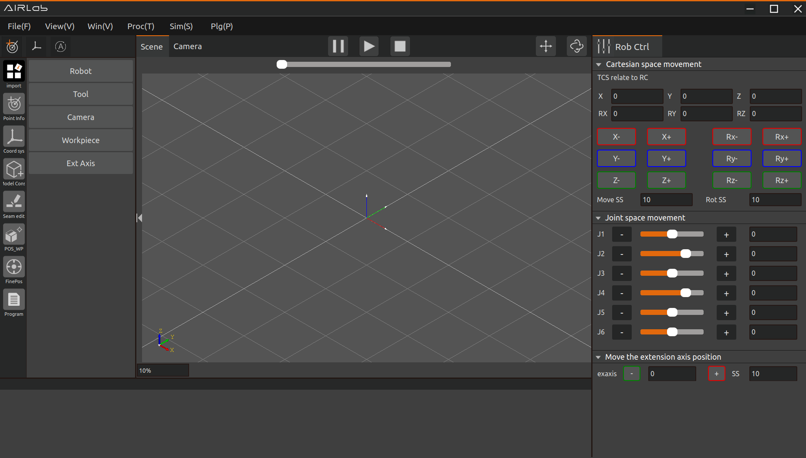

.. centered:: Figure 3-1  AIRLab Software Initial Interface

Menu Bar
--------------------------
The menu bar contains all the items shown in Figure 3-2, primarily including the following buttons: File, View, Window, Process, Simulation, Plug-in, and icon buttons (from left to right): Add Point, Add Coordinate System, Switch Mode, Pause Run, Start Run, Stop Run, Field of View Movement, Field of View Rotation.

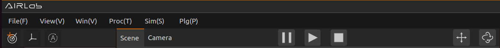

.. centered:: Figure 3-2  AIRLab Menu Bar

File
~~~~~~~~~~~~~~~~~~~
Click the“File”button, the menu shown below will appear:“New”,“Open”, “Export”. How to use it is described below:

.. figure:: analysis/4/3.png
	:align: center
	:width: 2in

.. centered:: Figure 3-3  AIRLab Menu Bar - File

Select “New” click, “New Project” pop-up window will show, select the type of weld project in the pop-up window, then click “Confirm” button to complete the project new.

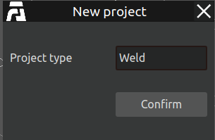

.. centered:: Figure 3-4  AIRLab Menu Bar - File - New 

Select “Open” click, the “Select Project” pop-up window appears, find the path of your project, select the double-click or click on the pop-up window after clicking the “Open” button, that is, import the project successfully.

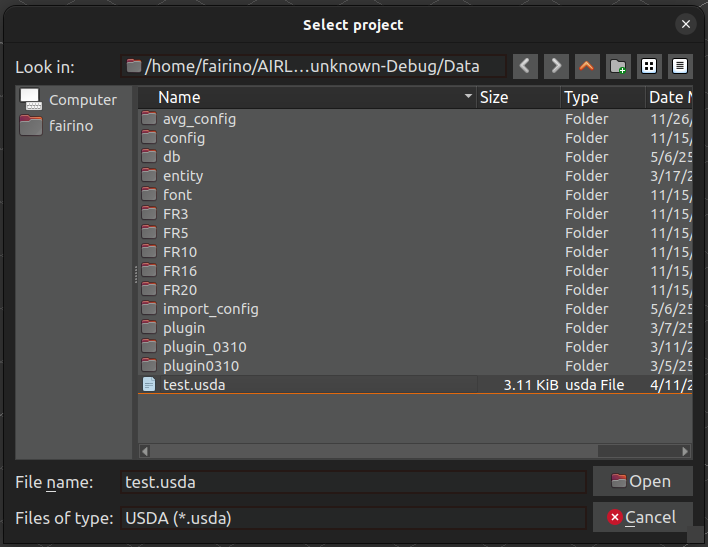

.. centered:: Figure 3-5  AIRLab Menu Bar - File - Open

Select “Export” click, “Save Project” pop-up window appears, this function will save AIRLab's current project under user-defined path. After naming the project in the “File name” column of the popup window, click “Save” to complete the export of the current project.

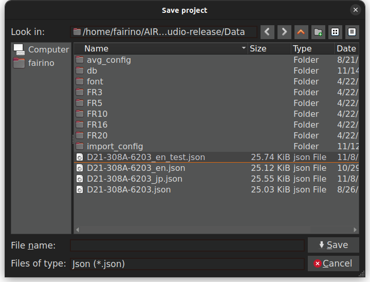

.. centered:: Figure 3-6  AIRLab Menu Bar - File - Export

If exported when there is currently no project present, AIRLab will provide a pop-up message prompt, as shown in the following figure.

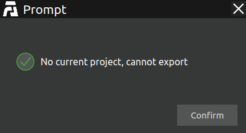

.. centered:: Figure 3-7  AIRLab export failed

View
~~~~~~~~~~~~~~~~~~~
View contains 12 functions, as shown in Figure 3-8, the main function is to adjust the viewing angle of the robot in the main display frame. They are: Zoom, Pan, Rotate, Reset, Fit all, Front view, Back view, Top view, Bottom view, Left view, Right view, and Full view.

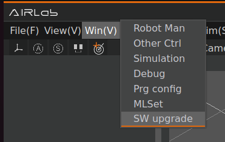

.. centered:: Figure 3-8  AIRLab Menu Bar - View

See Table 3-1 for a description of the specific functions of the view.

.. centered:: Table 3-1  View Function Description Table

.. image:: analysis/4/表3-1.png
	:align: center
	:width: 6in

Window
~~~~~~~~~~~~~~~~~~~
The “Window” menu contains eleven secondary options: “Software Upgrade”, “Welding Data Acquisition”, “Version Verification”, “Log”, “Virtual Camera”, “Global Settings”, “Torch Cleaning and Wire Cutting”, “Automatic Loop Operation”, “User Data Backup”, “3D File Parsing”, and “Multi-Station Automatic Operation”. Clicking different options will bring up different function dialogs in AIRLab. Detailed functions and usage instructions can be found in Section 3.6.

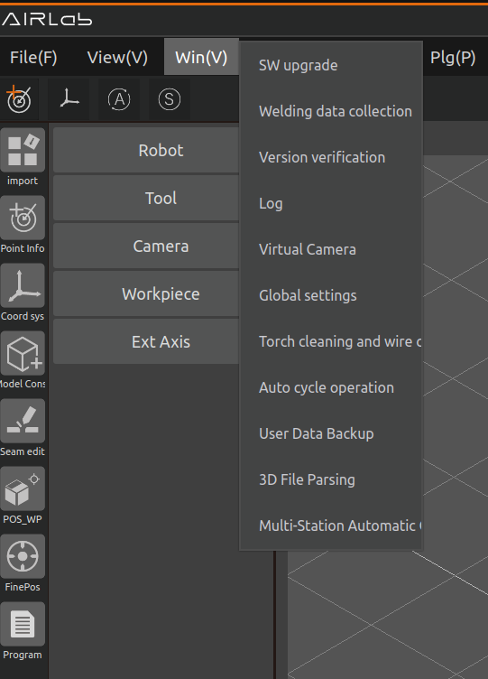

.. centered:: Figure 3-9   AIRLab Menu Bar-Window

Process
~~~~~~~~~~~~~~~~~~~
The “Process” includes “Welding Process” and “Cylindrical Filling”, according to the process need to select different processes, click the option to appear corresponding function pop-up window.For a detailed introduction,please refer to section 4.6 on the analysis of engineering modules.

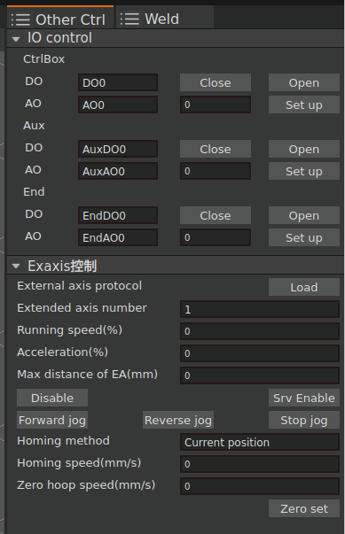

.. centered:: Figure 3-10  AIRLab Menu Bar - Process

Simulation
~~~~~~~~~~~~~~~~~~~
This button is used to switch between the simulation robot and the real robot. Before using this button, you need to successfully import or create a project and successfully establish Ros2 communication connection with the real robot. Clicking this button after completing the above prerequisites will enable switching between the virtual robot and the physical robot both. After switching the real robot, the robot pose displayed in the AIRLab scene will be synchronized with the actual robot, as shown in Figure 3-11.

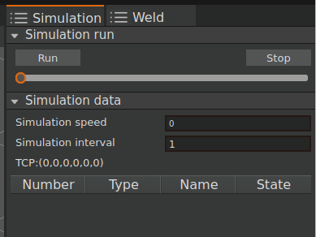

.. centered:: Figure 3-11  AIRLab display after live switching

Simulation Scene: used for simulation will not synchronize and update the robot position in the 3D scene in real time; 

Real Scene: update the current tool coordinate system, DH compensation parameters are consistent with the actual robot, and the robot position in the 3D scene is consistent with the physical robot.

Plugin
~~~~~~~~~~~~~~~~~~~
In order to enhance the scalability and user experience of AIRLab software, AIRLab provides plug-in modules, allowing users to develop plug-ins that meet their needs. These plug-ins can be loaded into AIRLab software through dynamic libraries (.so), thereby expanding and enhancing the software functions. The existing plug-ins include three functional modules: bin pickinging, spray, and conversational intelligent assistant. For the introduction and specific operations of each plug-in, please refer to the plug-in section in Chapter 4.

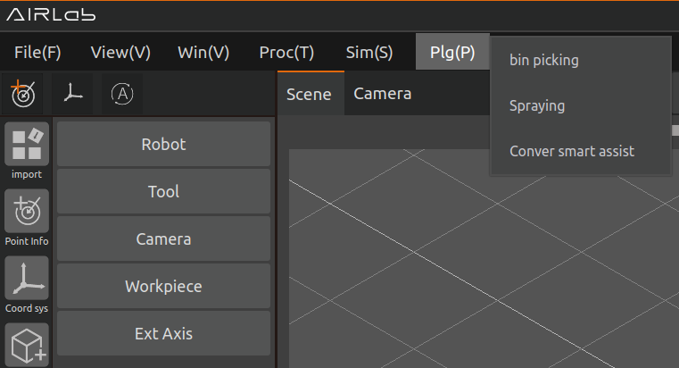

.. centered:: Figure 3-12  AIRLab-Plugin

Mode switching
~~~~~~~~~~~~~~~~~~~
After the AIRLab software establishes Ros2 communication with the physical robot, the user can switch the mode status of the physical robot by clicking on this button. “A” means that the current robot is in automatic mode, and “M” means that the current robot is in manual mode. In addition, clicking this icon in automatic mode will switch the robot mode to manual, and clicking this icon in manual mode will switch the robot mode to automatic.

Points added
~~~~~~~~~~~~~~~~~~~~~~~~~
This function is used to quickly record the current position of the robot. After clicking this button, a new position targetX will be added under the position information section of the engineering module on the left side of AIRLab. The function of X is to prevent duplicate names of newly added positions, as shown in Figure 3-13. The j1, j2, j3, j4, j5, j6, x, y, z, rx, ry, and rz information of this point are the current joint coordinates and Cartesian coordinates of the robot.

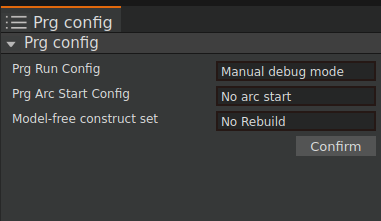

.. centered:: Figure 3-13  AIRLab Menu Bar - Point Additions

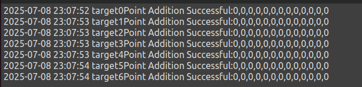

.. centered:: Figure 3-14  AIRLab Terminal - Printing of Point Addition Successful Information

Coordinate system creation
~~~~~~~~~~~~~~~~~~~~~~~~~~~~~~~~~~

Click this button, and AIRLab will create a new reference coordinate system. The newly created reference coordinate system will be displayed on the left side of the AIRLab interface under the module - coordinate system, which is used for weld offset and welding process, assisting users in quickly and accurately setting weld/bead offset.

Click the reference coordinate system icon on the far left to enter the reference coordinate system module. Select a reference coordinate system and click the "Edit" button above to configure it. You can then set parameters such as selecting the reference base (workpiece coordinate system, base coordinate system, or world coordinate system), adjusting the coordinate system's position, and choosing whether to display the reference coordinate system.

Click the Delete button above to remove the selected reference coordinate system.

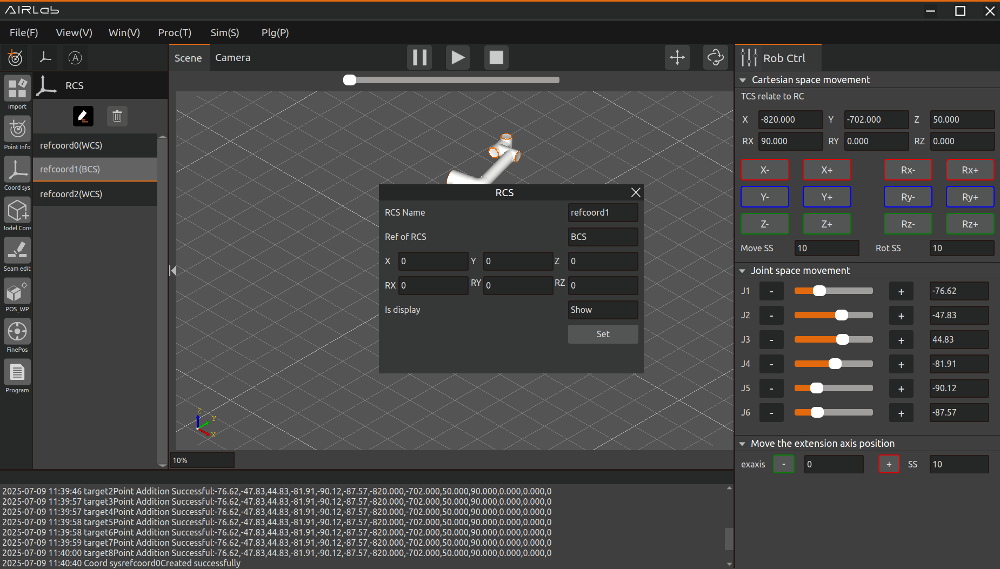

.. centered:: Figure 3-15  AIRLab - Reference Coordinate System

Figure 3-16 shows the coordinate system displayed, and Figure 3-17 shows the coordinate system not displayed.

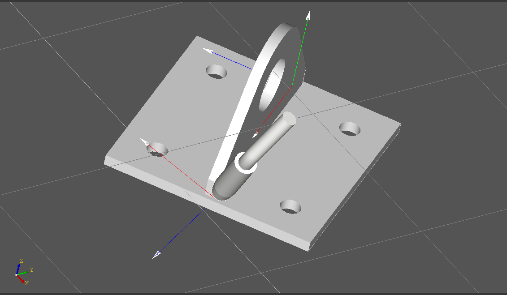

.. centered:: Figure 3-16  AIRLab Menu Bar-RCS-Display CS

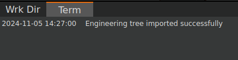

.. centered:: Figure 3-17  AIRLab menu bar-RCS-Not show CS

Offline Simulation
~~~~~~~~~~~~~~~~~~~~~~~~~

To enable intelligent recommendation of offline welding postures and improve simulation efficiency, AIRLab has added an "Offline Simulation" function. As shown in the figure, click the "Offline Simulation" icon button in the toolbar to enter the simulation state, and the icon color will turn yellow and highlighted.Click the icon again,exit the simulation state.

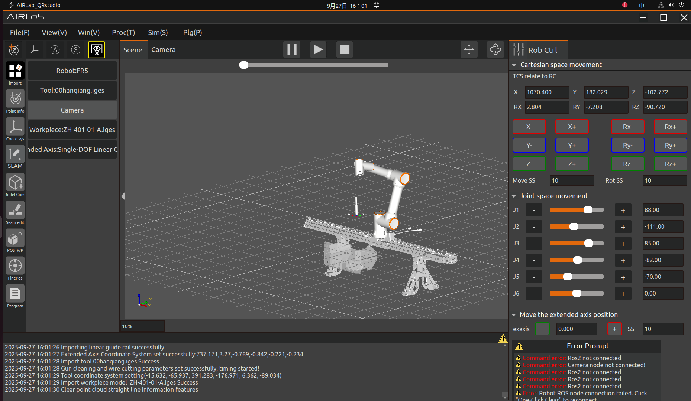

.. centered:: Figure 3-18  open "Offline Simulation" state 

After importing the robot, tool, and workpiece, click "Weld Seam Editing". Select a weld seam for editing, and after completion, click the "Offline Simulation" button in the pop-up window. AIRLab will dynamically simulate the path trajectory of the current weld seam from the approach point to the exit point in the 3D scene, showing whether the welding torch posture and robot position of the weld seam are reasonable, as shown in the figure.

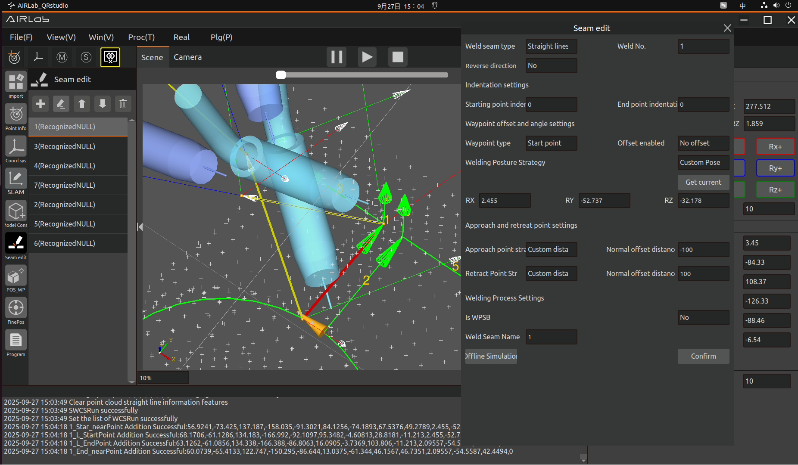

.. centered:: Figure 3-19  Offline Simulate one weld seam

After editing all the weld seams to be welded, click the "Weld Seam Editing" icon button, and click "Weld Seams Edited in Offline Simulation " in the triggered menu, as shown in the figure. 

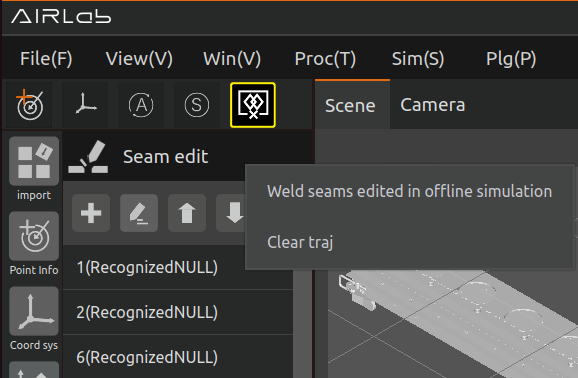

.. centered:: Figure 3-20 the menu content

AIRLab will automatically generate a Lua program under the program module, and display the offline simulated welding torch posture, weld seam position, welding process, trajectory planning and other contents in the 3D scene.

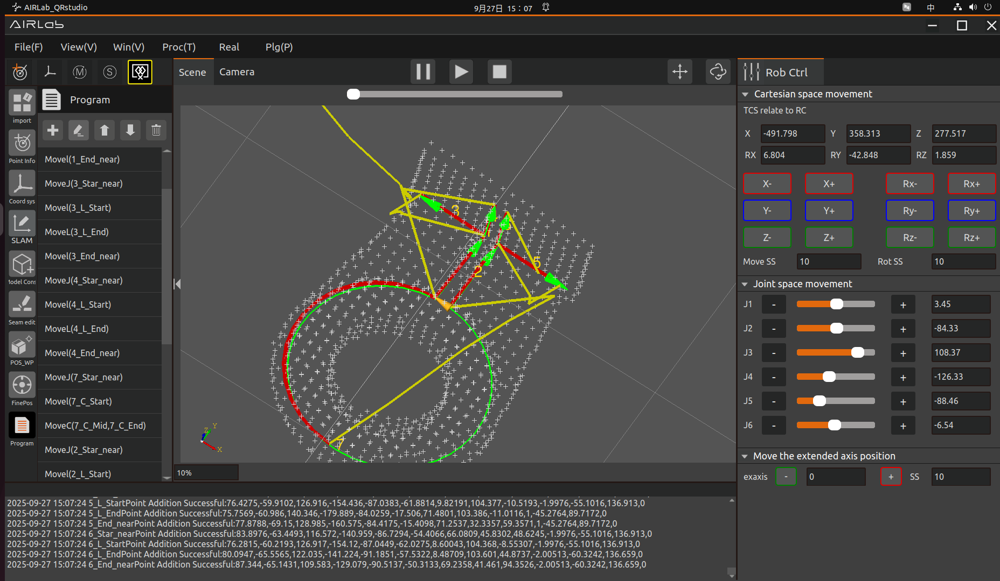

.. centered:: Figure 3-21  Offline Simulation of Edited Weld Seams

To prevent users from mistakenly running programs in the offline simulation state, AIRLab has added a running prompt when in the offline simulation state, as shown in the figure.

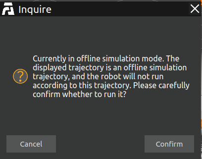

.. centered:: Figure 3-22  running prompt in offline simulation state

Pause running
~~~~~~~~~~~~~~~~~~~

Pause/Resume button. Clicking this button will immediately pause the robot that is running a program, and pressing the button again will resume the robot to continue running the program it was running before the pause.

Start running
~~~~~~~~~~~~~~~~~~~

By clicking this button, the robot will first run all the commands under the “Workpiece Positioning” module on the left side of AIRLab, and after successful positioning of the workpiece, the robot will start to run the weld recognition; after successful recognition of the weld seam, the robot will run or not run the program automatically according to the parameters set by the user in the program configuration.

Stop running
~~~~~~~~~~~~~~~~~~~

Clicking the button immediately stops the robot that is running the program. The difference between this button and the pause/resume button is that by pressing the button again, the robot cannot resume running and can only be restarted with the start running button.

View Pan
~~~~~~~~~~~~~~~~~~~
Click the "View Movement" button, and a view movement pop-up window will appear on the interface. Users can set a fixed movement step size to adjust the 3D scene view in the X+, X-, Y+, Y- directions, allowing for precise inspection of specific angles in the 3D scene.

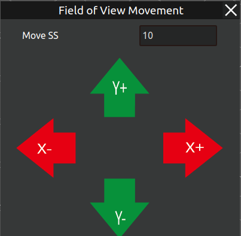

.. centered:: Figure 3-23  Field of view movement pop-up

View Rotate
~~~~~~~~~~~~~~~~~~~
Click the "View Rotation" button, and a view rotation pop-up window will appear on the interface. Users can set a fixed rotation step size to adjust the 3D scene view in the RX+, RX-, RY+, RY- directions, enabling precise inspection of specific angles in the 3D scene.

.. centered:: Figure 3-24  Vision rotation pop-up

Main Frame
--------------------------
The main display box is divided into scene display and camera display, where the scene mainly displays the robot, tool, workpiece, extended axis model, etc., as in Figure 3-20. the camera mainly displays the obtained point cloud map, as in Figure 3-21.

.. figure:: analysis/4/20.png
	:align: center
	:width: 5.5in

.. centered:: Figure 3-25  AIRLab Main Display Box - Scene Display

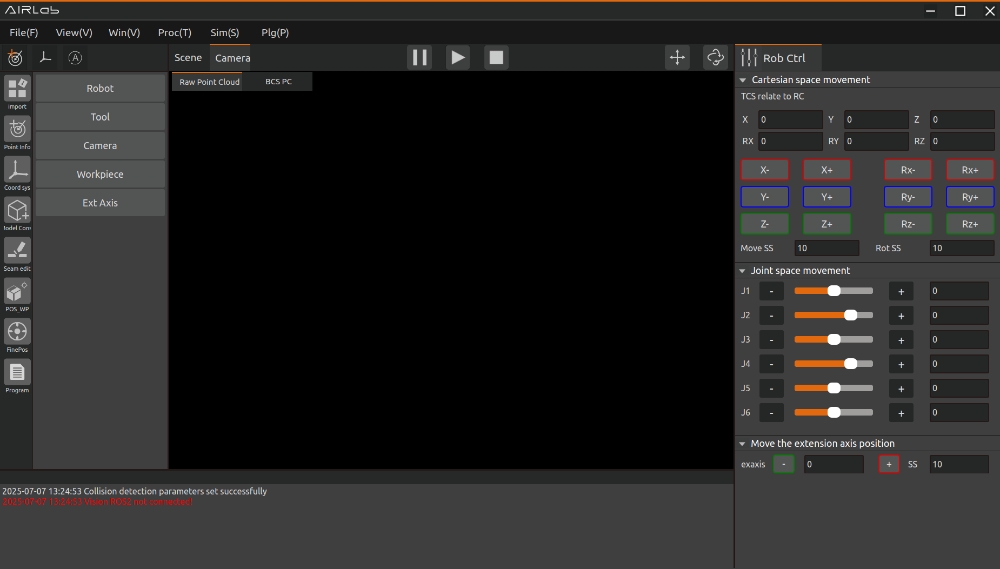

.. centered:: Figure 3-26  AIRLab Main Display Frame - Camera Display

Command Feedback Area
--------------------------
The instruction feedback area displays the execution results of program instructions, as shown in Figure 3-22.

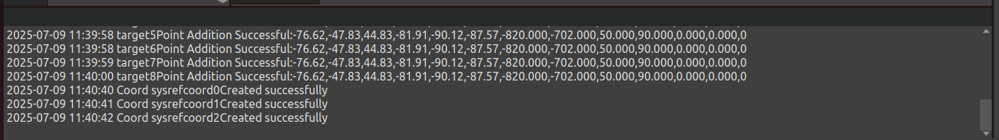

.. centered:: Figure 3-27  AIRLab Command Feedback Area-Terminal

Operating Area
--------------------------

Cartesian space movement
~~~~~~~~~~~~~~~~~~~~~~~~~~~
This area includes two parts: tool coordinate system relative to the reference coordinate system, and long press tap trigger, move step and rotate step settings, as shown in Figure 3-23.

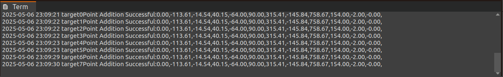

.. centered:: Figure 3-28  AIRLab Operation Area - Cartesian Space Movements

- The Tool Coordinate System Relative to Reference Coordinate System section, which shows the value of the tool coordinate system relative to the reference coordinate system.

- Long press tap trigger, move step and rotate step setting section. As shown in Figure 3-24, if the currently imported robot model is a solid robot, long press the X+ button, the solid robot will execute the X+ tap command; if the currently imported robot model is not a solid robot, long press the X+ button, the simulation robot will execute the X+ tap command.

.. important::
    To control the robot's JOG pointing by long-pressing the buttons, if the buttons are released while the robot is running, the robot will stop moving immediately; if the buttons are held down all the way and not released, the robot will run the value of the set rotation step and then stop moving. the X-, Y+, Y-, Z+, Z- buttons operate in the same way. If the Rx+, Rx-, Ry+, Ry-, Rz+, Rz- buttons are pressed and held down, the robot will otherwise remain unchanged, except that it will move according to the set value of the rotation step.

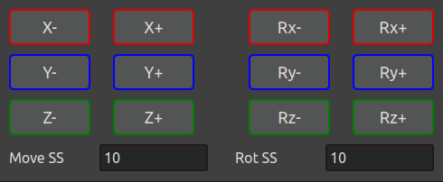

.. centered:: Figure 3-29  AIRLab Operation Area-Long Press Tap

Joint space space movement
~~~~~~~~~~~~~~~~~~~~~~~~~~~~~
This area includes 12 joint coordinate long press trigger buttons for joints J1-J6, 6 joint coordinate change text boxes and 6 joint sliders in three parts, as shown in Figure 3-25.

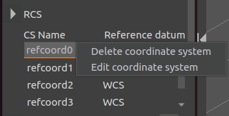

.. centered:: Figure 3-30  AIRLab Operating Area - Joint Space Space Mobility

- You can control the movement of the solid robot J1 joints in manual mode and joint coordinate system by long-pressing the "+" or "-" button of J1. " button to control the movement of the J1 joints of the solid robot in manual mode and in the joint coordinate system. The "+" or "-" buttons of the other joints operate in the same way.

.. important::
    The robot operation is controlled by long-pressing the button. If the button is released while the robot is running, the robot will stop moving immediately; if the button is held down all the time, the robot will run the set value of Move Step/Rotate Step and then stop moving.

- The 6 text boxes are updated in real time to show the angle values of the 6 joints of the robot. In addition, editing the values in the 6 textboxes can also be used to control the movement of the robot's joints (care should be taken not to exceed the soft limits of the robot's joint angles when editing).

- The function of the joint slots is that the user can slide the joint slots to realize the movement of each joint of the robot, and the joint angles represented by the slots are displayed by the values in the text box.

Moving extended axis settings
~~~~~~~~~~~~~~~~~~~~~~~~~~~~~~~
This section includes "exaxis+", "exaxis-" and the step setting box, as shown in Figure 3-26. "exaxis+", "exaxis-" functions are similar to the pointing X+ and X- under the tool coordinate system, and the motion of the extended axis can be controlled by the above two buttons. Long press the button to control the extended axis running, if you release the button during the extended axis running, the extended axis will stop moving immediately; if you keep pressing the button and do not release it, the extended axis will run the value set in the Step Setting box and then stop moving.

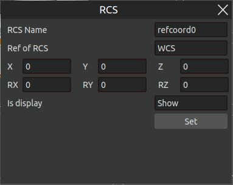

.. centered:: Figure 3-31  AIRLab Operation Area - Moving the Extended Axis Position

Engineering Module Analysis
-----------------------------------
To weld a workpiece, you need to import a model of the robot, tool, workpiece, etc.; if there is no current model of the workpiece, you need to model it. Afterwards, the workpiece is positioned and the weld seam is edited, both of which are completed by editing the fine position and running the program to identify the weld seam and generate the weld program. In this chapter, each module of the engineering module will be described in detail.

Import module
~~~~~~~~~~~~~~~~~~~
Click the Import icon on the far left to enter the import module, where users can import robots, tools, workpieces, extension axes, or connect cameras.

.. figure:: analysis/4/27.png
    :align: center
    :width: 6in

.. centered:: Figure 3-32  Module Setup Page

- Import Robot: Select the robot, and the interface will display the robot settings page. Switching the robot model will show a schematic diagram and basic information of the selected robot on the page, as illustrated in the figure.

.. figure:: analysis/4/28.png
    :align: center
    :width: 6in

.. centered:: Figure 3-33  Robot Settings Page

If the selected robot is not currently compatible with AIRLab software, a prompt interface will pop up, as shown in the figure.

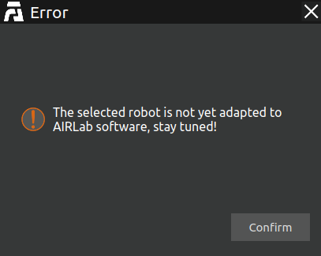

.. centered:: Figure 3-34  Robot Incompatibility Warning Pop-up

Taking the FR5 as an example, select the FR5 model robot and its version number (currently only V6.0 is supported), then click "Import". The FR5 robot model will be imported into the 3D scene, and a "Robot imported successfully" message displayed in the terminal confirms the successful import of the robot model.

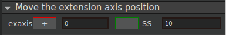

.. centered:: Figure 3-35  Successful introduction of the robot

Considering more flexible and rich robot deployment scenarios, we provide a free installation function. The user setting module sets the tilt angle and rotation angle in the page, and the robot model in the 3D scene or shows the corresponding installation effect. After modification, click Set to complete the robot installation method settings.

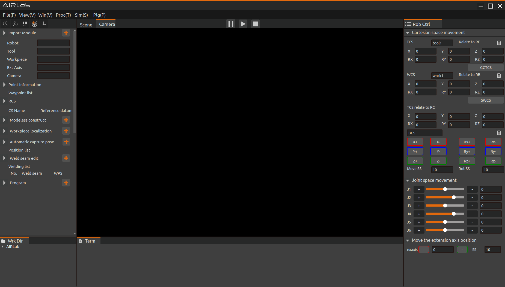

.. centered:: Figure 3-36  Setting the robot tilt and rotation angles

.. important::
    After the robot is installed, the robot must be set up correctly, otherwise it will affect the use of the robot's drag function as well as the collision detection function.

You can delete the currently imported robot model by clicking the “Delete” button on the Robot Settings page.

- Import tool: Select the tool button, AIRLab interface will display the tool setting page.

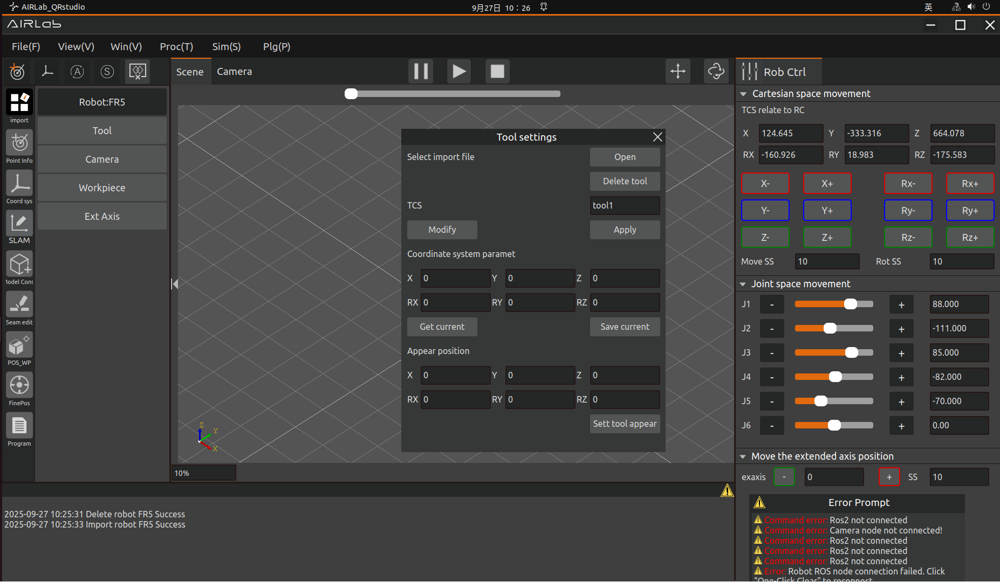

.. centered:: Figure 3-37  Tool Setup Page

Click Open, select the tool model you want to import under the corresponding path, and click “Open”.

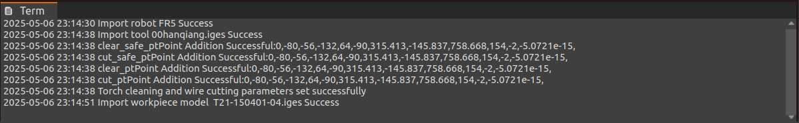

.. centered:: Figure 3-38  Selection Tool Model

The imported tool model is displayed in the 3D scene, and the terminal displays “Successful tool import”, which means that the tool model has been successfully imported.

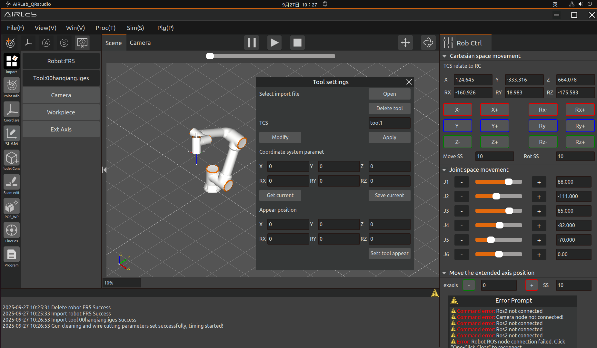

.. centered:: Figure 3-39  Import Tool Success

After importing a tool, you can set the current coordinate system of the tool and the appearance position of the tool;

Click the “Get Current” button under the tool coordinate system on the tool setting page to get the current coordinate system of the tool, and then click “Save” to modify the tool coordinate system.

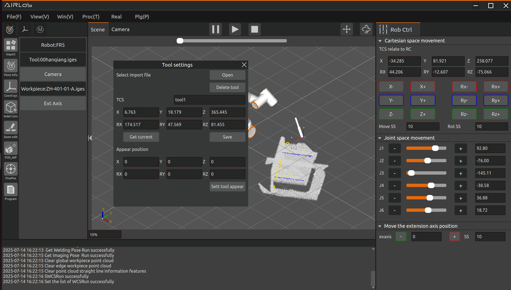

.. centered:: Figure 3-40  Get the current tool coordinate system

If you need to modify the appearance position of the tool, modify the coordinates under Appearance Position on the Tool Settings page, and then click the “Set Tool Appearance” button to finish setting the appearance position of the tool.

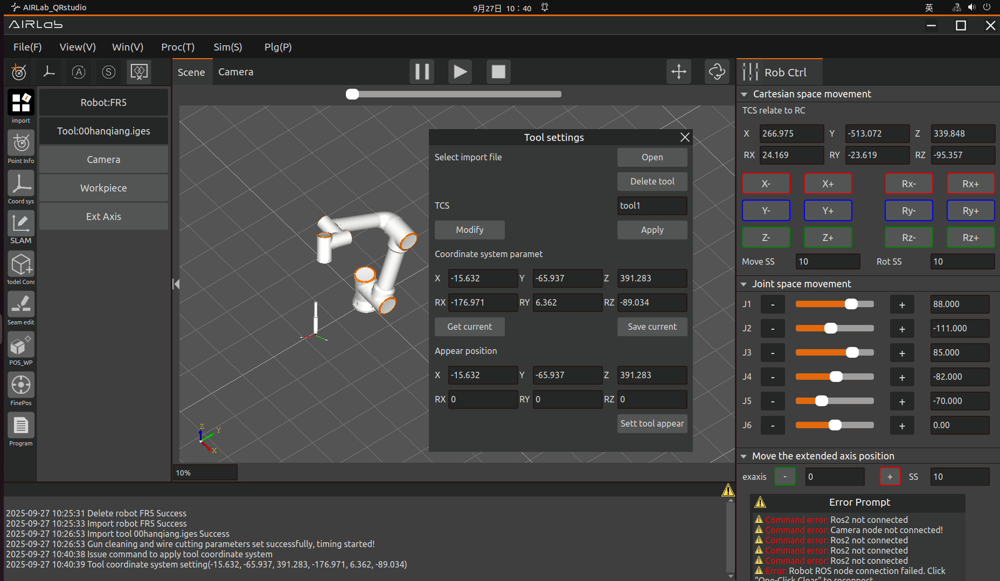

.. centered:: Figure 3-41  Setting the Tool Appearance Position

You can delete the currently imported tool model by clicking the “Delete” button on the tool settings page.

- Import artifacts: Select the artifact,AIRLab interface will display the artifact setup page.

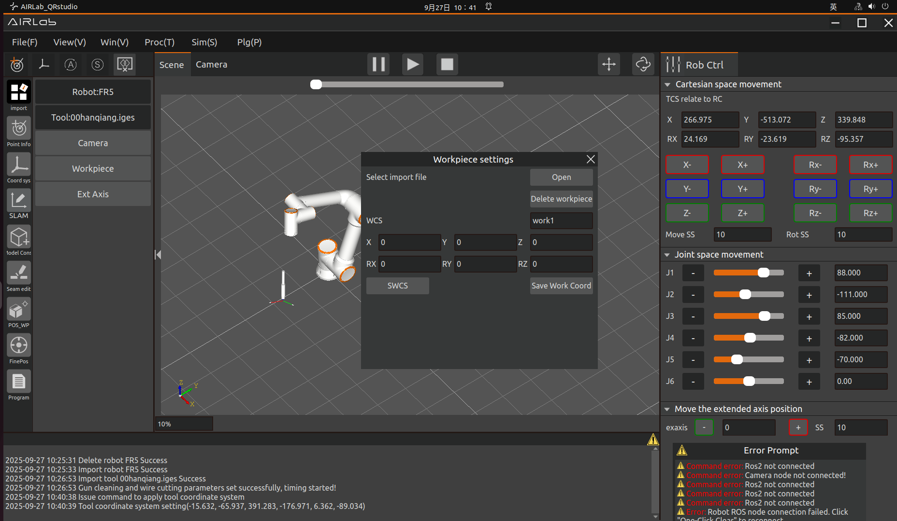

.. centered:: Figure 3-42  Workpiece Setting Page

Click “Open” button, select the workpiece model to be imported under the corresponding path, click “Open”, the imported workpiece model will be displayed in the 3D scene, and the workpiece will be imported successfully.

Set workpiece coordinate system: After setting workpiece coordinate system in the workpiece setting page, click “Save Workpiece Coordinate System” to set workpiece coordinate system.

Delete workpiece: Click “Delete Workpiece” button in the workpiece setting page to delete the imported workpiece in the current 3D scene.

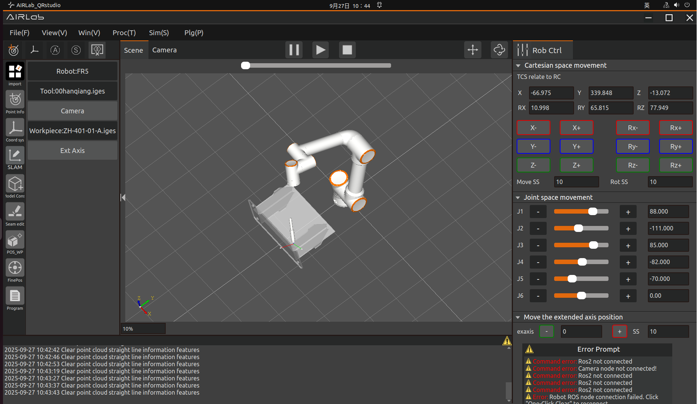

.. centered:: Figure 3-43  Imported artifacts successfully

- Import Extended Axis: Select the Extended Axis.The AIRLab interface displays the Extended Axis Settings page, select the Extended Axis and click Import.

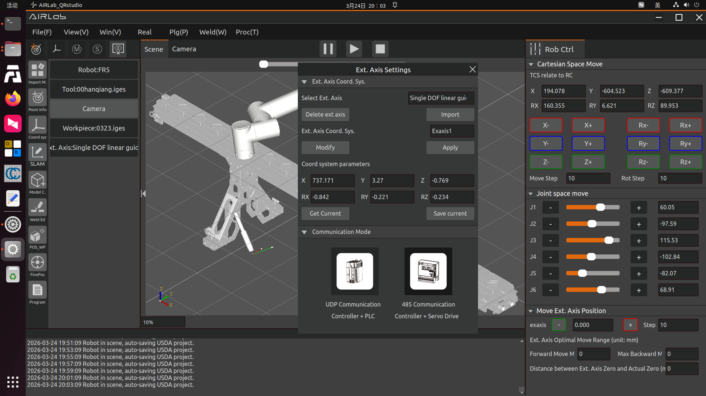

.. centered:: Figure 3-44  Extended Axis Setup Page

The imported extended axis model is displayed in the 3D scene of AIRLab software, and the extended axis is imported successfully.

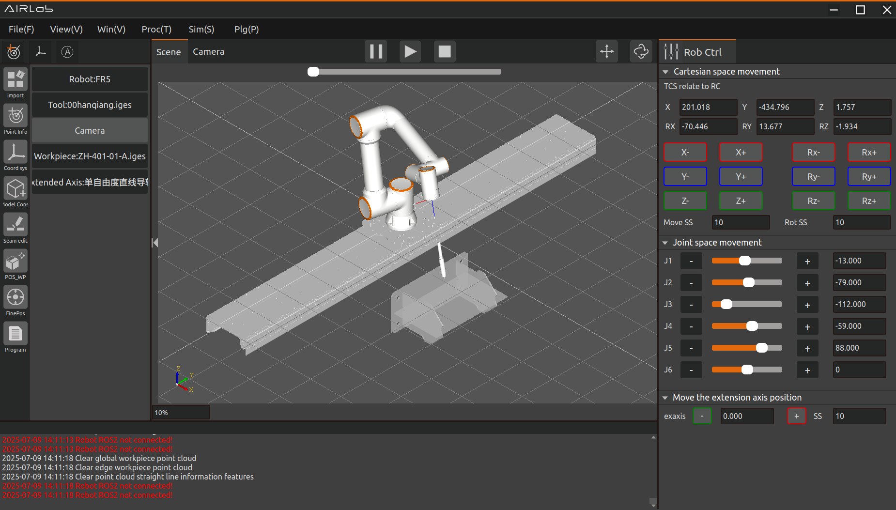

.. centered:: Figure 3-45  Extended axis imported successfully

Delete Extended Axis: Click “Delete Extended Axis” in the Extended Axis Settings page to delete the extended axis imported in the current 3D scene.

- Connect Camera: Click the Camera button, and a "Camera Settings" pop-up window will appear in the 3D scene. The camera settings pop-up is divided into three sections: Camera Configuration, Device Information, and Device Debugging.

Click the “Search Devices”, AIRLab will search for connected cameras and automatically connect them. If the connection is successful, the interface will be as shown in the figure Figure 3-40; If the connection fails, it will be displayed as not connected in the connection status column, and there will be no camera related parameters.

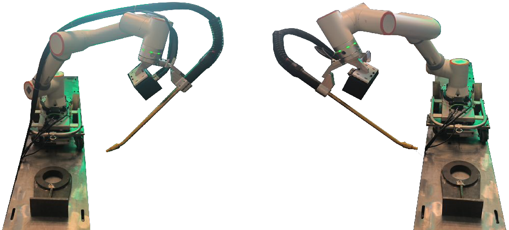

.. centered:: Figure 3-46  Camera settings page

After successful camera connection:Click "Get Parameters" to retrieve the current camera configuration settings. If need to modify the desired parameters, click "Set Parameters" will successfully update them.The follow descriptions are parameter descriptions:

Structured Light Exposure Time:Increase when images are too dark in structured light mode;Decrease when images are overexposed.

Line Scan Time:Increase when reflective workpieces cause hollow artifacts in imaging.

Line Scan Exposure Time:Increase when images are too dark in line scan mode; Decrease when images are overexposed.

Brightness Level:Increase when images are too dark to see details;Decrease when images appear washed out.

Protective Shield:Welding protection cover prevents spark/spatter during welding; Enabled by default during imaging.

Device Information:Click "Device Info" to view connected camera details (name, model, connection status, etc.) as shown in the follow figure.

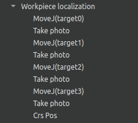

.. centered:: Figure 3-47  Camera Infomation

Device Debugging:Click "Device Debugging" to access camera calibration functions, including:Aging Debug,Single Capture,Save Point Cloud.

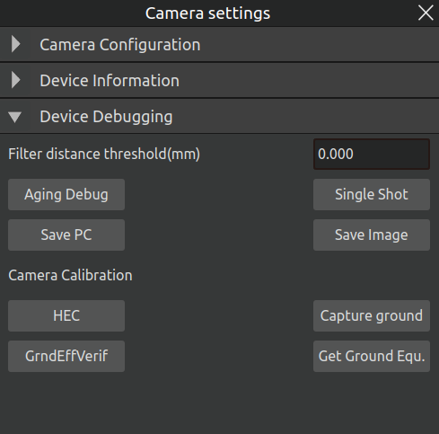

.. centered:: Figure 3-48   Camera Debugging

Filter distance threshold:When the image contains excessive noise, increase the threshold; when preserving fine edges is required, decrease the threshold.

Below are detailed function descriptions:

Aging Debug:Click the "Aging Debug" button to initiate continuous camera testing - the camera will automatically capture images at regular intervals. Click again to stop. Results display in the Main Display Panel - Camera View.

Single Capture:Takes one image at the current position. Results show in the Main Display Panel - Camera View with two display modes.And the raw Point Cloud is the direct camera output;Base Coordinate Point Cloud is the point cloud converted to robot base coordinates.Toggle between views as needed.

Save Point Cloud:After single capture,Click "Save Point Cloud",Select output path to save point cloud data.

Save Image:After single capture,Click "Save Image",Select output path to save 2D image.

Camera Calibration:Include Calibration and verification.Refer to Section 3.5 "Point Cloud Camera Hand-Eye Calibration" for detailed procedures.

SLAM mapping
~~~~~~~~~~~~~~~~~~~~~~~~~~~~~~
To reduce the model-free construction time for complex workpieces such as box girders and improve workpiece construction efficiency, AIRLab has added a SLAM mapping function before the model-free construction step. The usage instructions are as follows:

Click the newly added "SLAM Mapping" icon button in the left project area, then click the "New" button. A "SLAM Mapping" pop-up window (as shown in the figure) will appear.

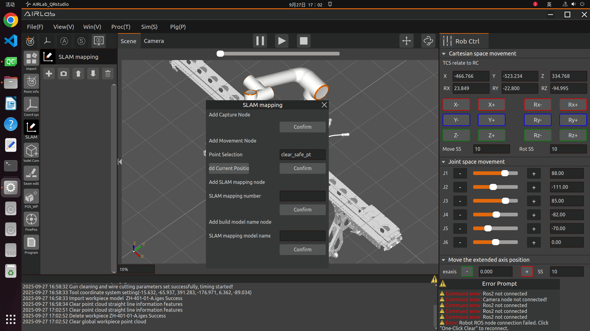

.. centered:: Figure 3-49 SLAM mapping pop-up window

At the current external axis position (Note: Please first set the zero position of the external axis; it is recommended to mark the zero position on the external axis at the same time), first add a movement node: you can click "Teach Current Position" to add a real-time point, or select an existing point to add a new one. Secondly, add a photo node. The newly added "Movement Node + Photo Node" must ensure that the robot, at the current external axis position, has a photo range that basically covers the structure of the box girder. Then add a SLAM mapping node; currently, the sub-map number must start from 0, as shown in the figure.

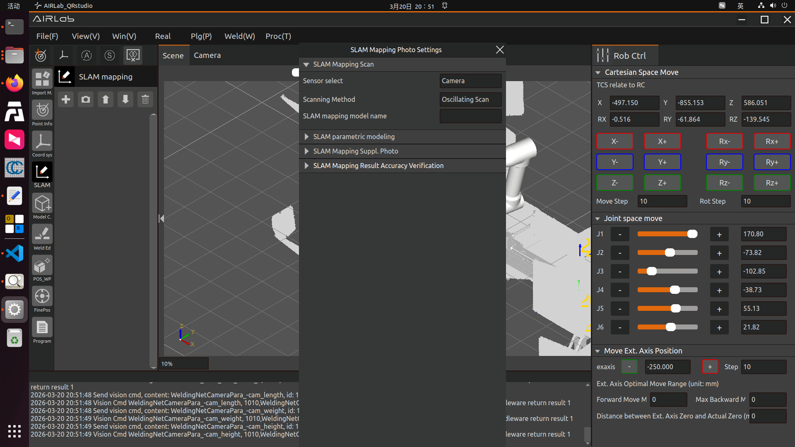

.. centered:: Figure 3-50 Add a new "SLAM Mapping: Sub-map 0" node

Move the external axis to a new position, then follow the procedure for creating the first sub-map to add programs for subsequent sub-maps. The number of sub-maps shall be determined by the user based on the actual workpiece requirements.

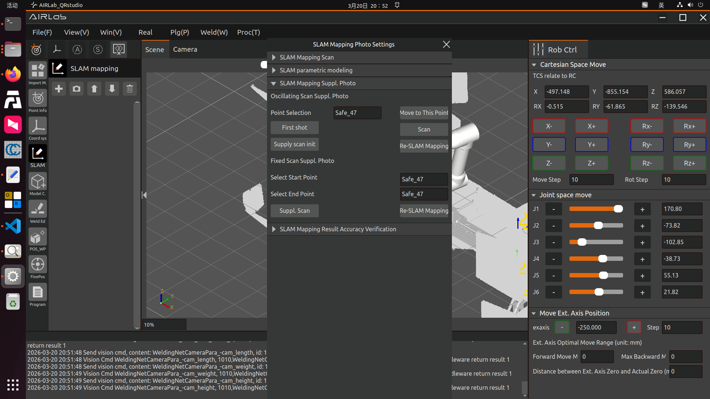

.. centered:: Figure 3-51 Add a new "SLAM Mapping: Sub-map 1" node

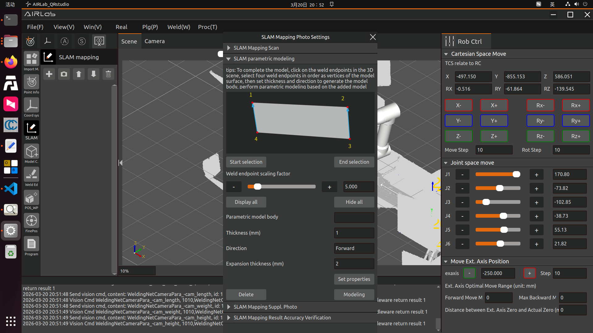

.. centered:: Figure 3-52 Add a new "SLAM Mapping: Sub-map 2" node

.. important::
    Sub-map numbers must not be duplicated!

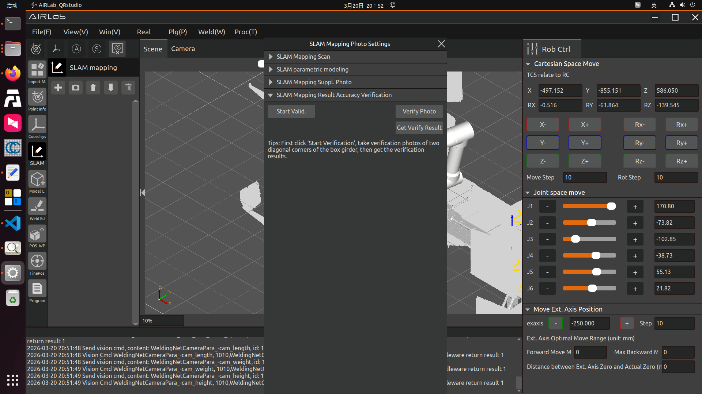

.. centered:: Figure 3-53  Sub-map numbers must not be duplicated in naming.

After completing the creation of sub-maps, you need to add the last node of the SLAM mapping program: set the SLAM mapping model name, as shown in the figure. 

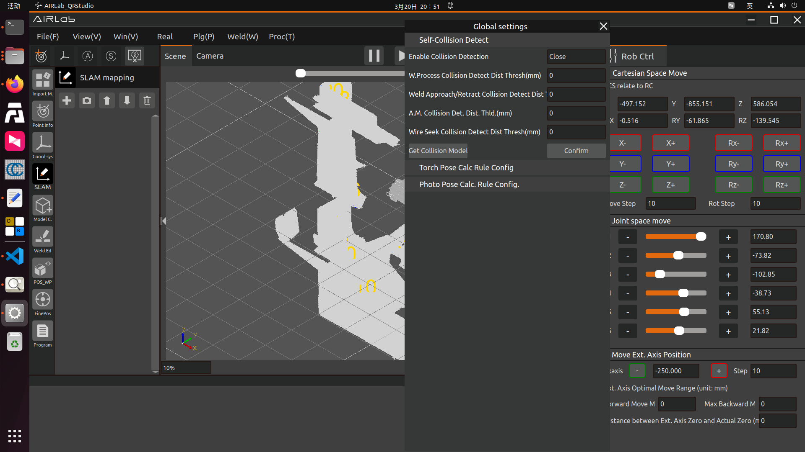

.. centered:: Figure 3-54 Set the SLAM Mapping Model Name

Once the program creation is complete, click the pop-up menu of the "SLAM Mapping" button and select "Run Program". The robot will then start executing the SLAM mapping program. After each photo is taken, the 3D interface of AIRLab will display the collected point cloud map, as shown in the figure.

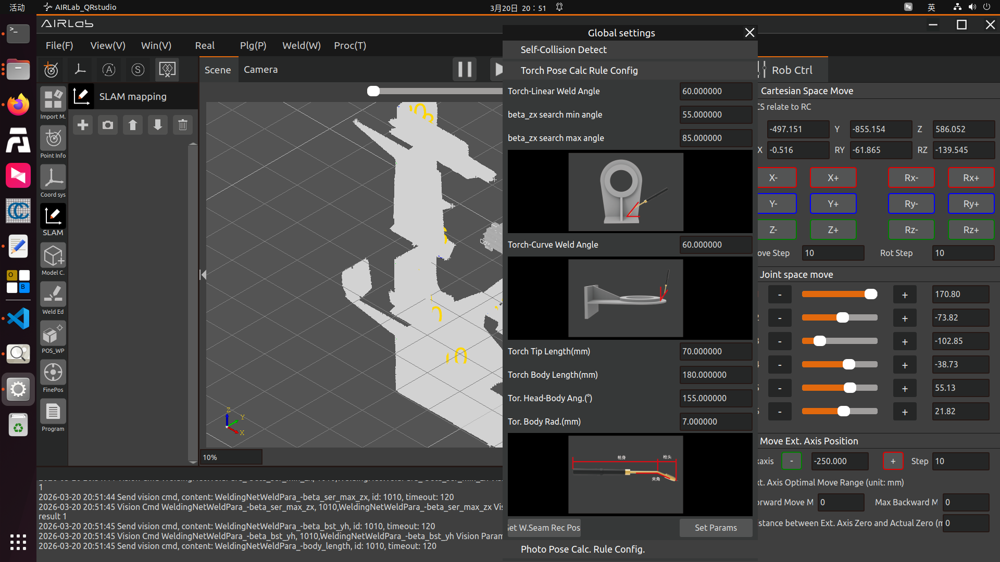

.. centered:: Figure 3-55 run SLAM mapping programs

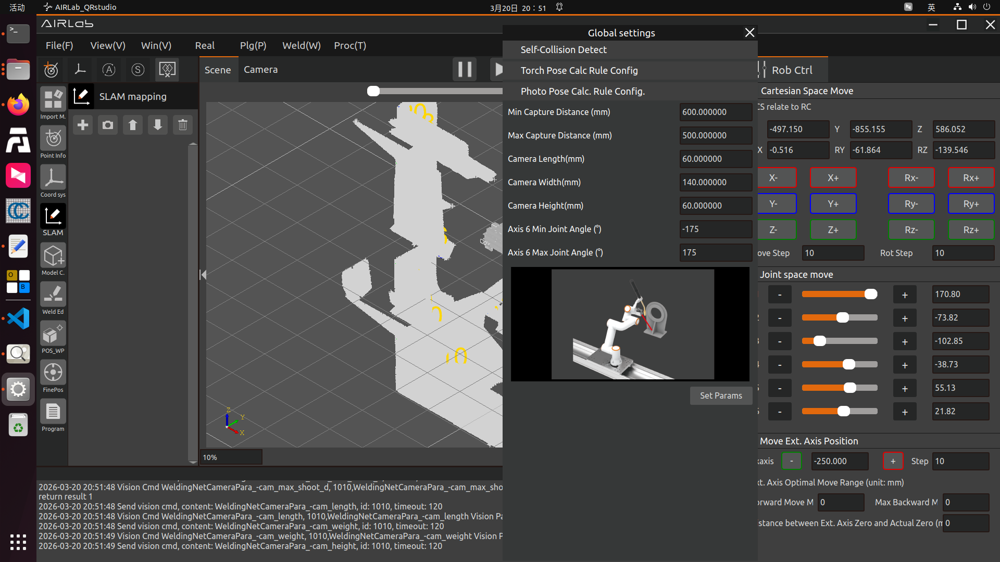

.. centered:: Figure 3-56  Collected Point Cloud

After the program finishes running, AIRLab will import the constructed workpiece model into the 3D scene, as shown in the figure.

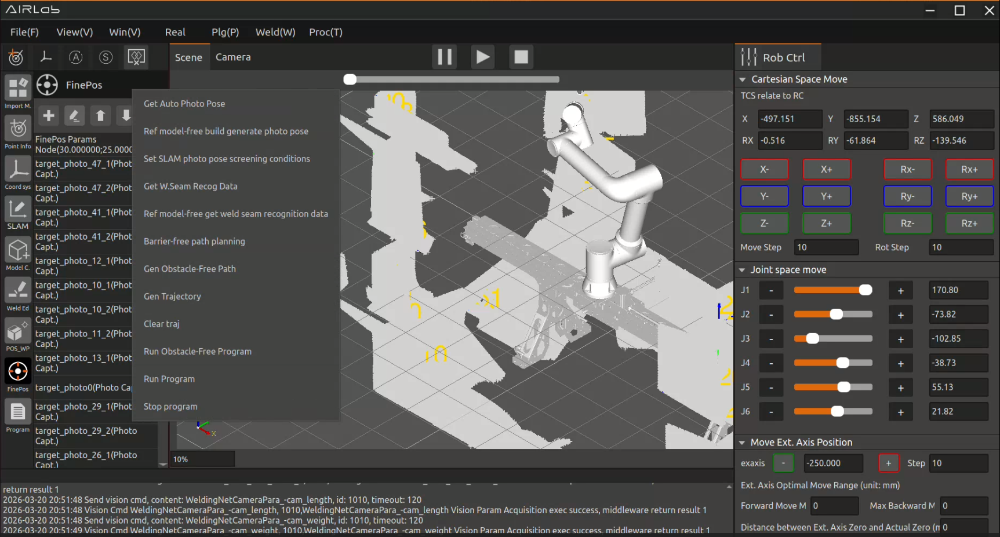

.. centered:: Figure 3-57  SLAM Mapping Model of the Box Girder

If the program is interrupted midway, you can resume operation from the nearest movement node, as shown in the figure. 

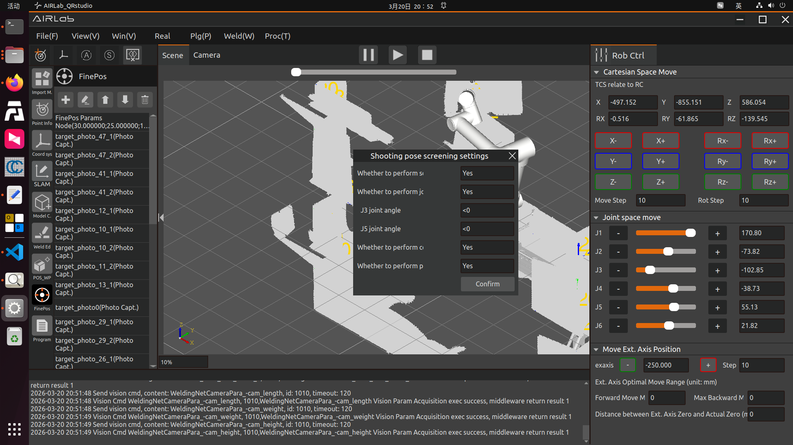

.. centered:: Figure 3-58  Resume Operation After Interruption

If the constructed model is not complete enough, AIRLab provides a supplementary shooting function: click the photo icon button, and a SLAM mapping supplementary shooting pop-up window will appear, as shown in the figure.

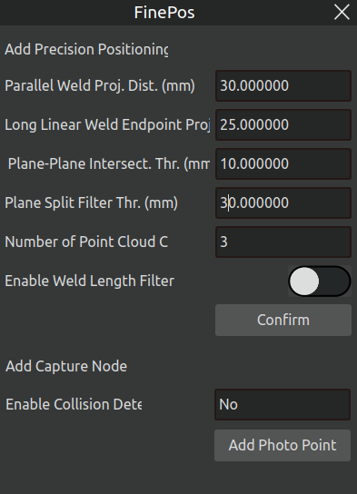

.. centered:: Figure 3-59  supplementary shooting pop-up window

Currently, AIRLab requires that supplementary shooting must be performed at the position of Sub-map No. 0. Follow the steps in the pop-up window to start the operation: select No.0, move the external axis to the target position, teach the supplementary shooting points, and take photos. After all supplementary shooting is completed, click the "Re-run SLAM Mapping" button. AIRLab will then generate a new SLAM mapping model of the workpiece.

Model Construction
~~~~~~~~~~~~~~~~~~~~~~~~~~~~~~
If the workpiece to be welded does not have a model file, you need to perform a model-less build of the workpiece first, otherwise, you can directly import the workpiece model to perform the 4.5.3 weld editing operation.

Click the Model Construction icon button on the far right to enter the module, then select the Add icon at the top. A "Modeless Construct" pop-up window will appear in the AIRLab interface.

Add moving node: select the photo target point to be moved, click the “Confirm” button, and “Move(target)” will appear under the Model Construction module, that is, it is added successfully.

Alternatively, click “Add Current Position” to create a new waypoint at the current location, which will automatically generate a Move(target) node under Model Construction.

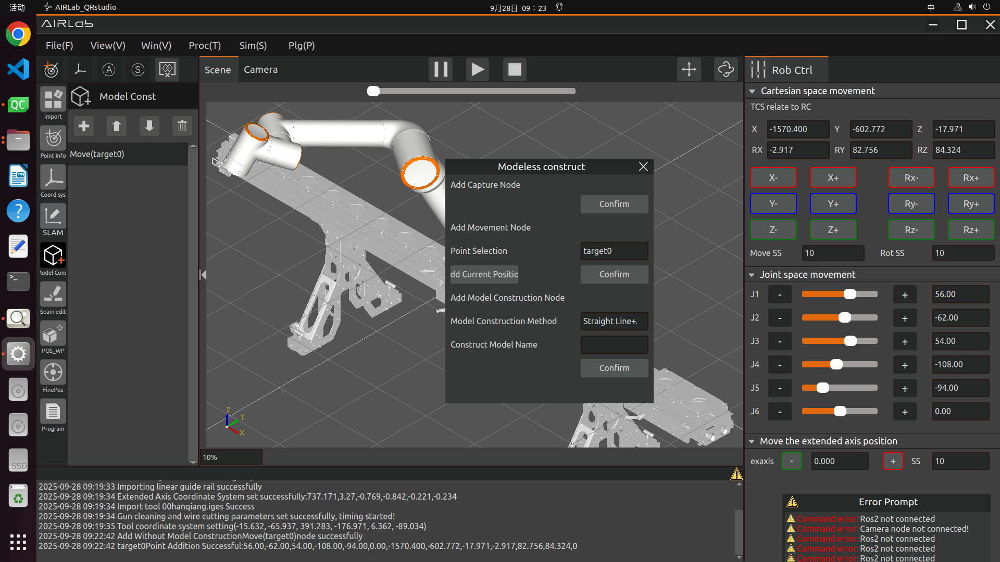

.. centered:: Figure 3-60  Adding Move nodes

The principle of the model-less photo point of demonstration is that the camera is able to clearly and completely capture all positions of the model-less workpiece, especially the position of the weld seam that needs to be welded.

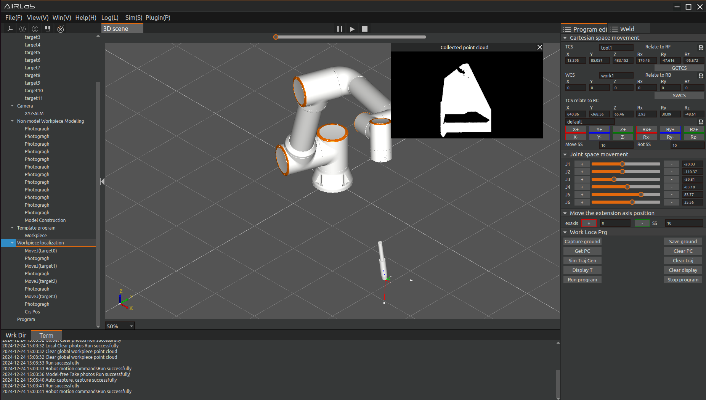

.. centered:: Figure 3-61  Photographic points of the workpiece at different angles    

Add photo node:Click the Confirm button under Add Capture Node to create a new image capture node in Model Construction.

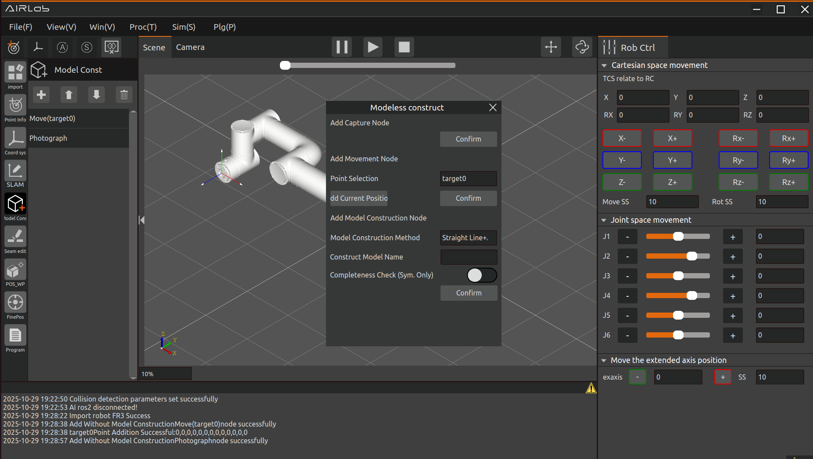

.. centered:: Figure 3-62  Add Photo Node

Add Modeless construction node: After adding several groups of “Move+Photo” nodes,enter the model construction name,and click “Confirm” button of model construction part.“Model Const” node appears under the Model Const module, that is to say, adding successful.

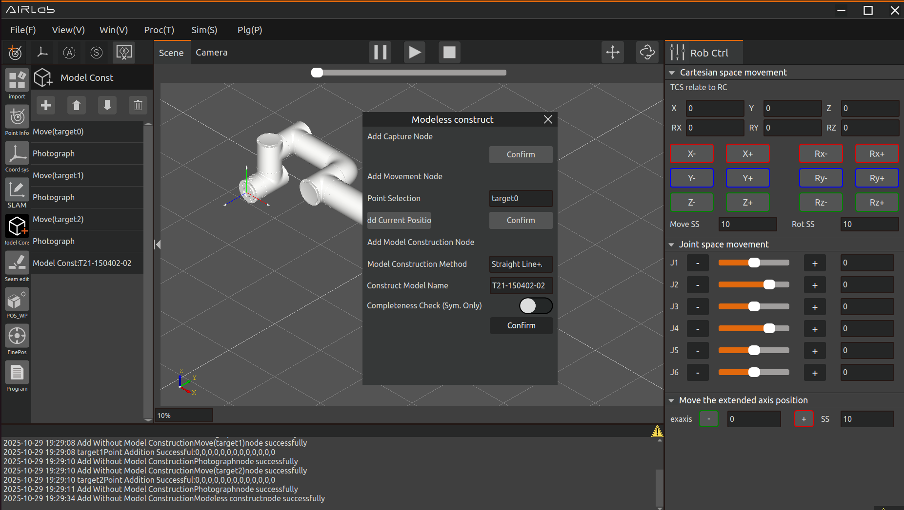

.. centered:: Figure 3-63  Adding Modeless cons nodes

.. important::
    Note: If the workpiece has symmetrical features, integrity judgment must be enabled when adding model construction nodes, as shown in the figure. Additionally, the entire workpiece must be completely captured during the model building process.

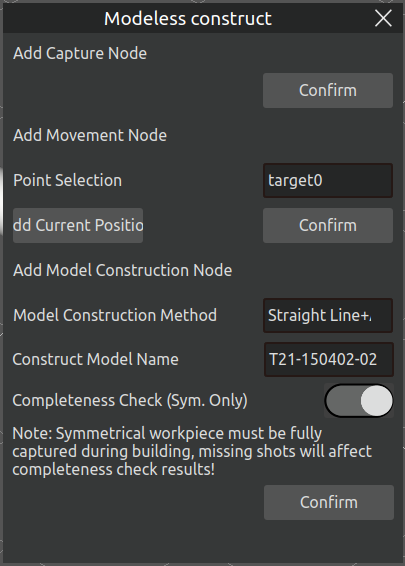

.. centered:: Figure 3-64  Enable Integrity Judgment

After adding nodes, you can perform the following adjustments,

Reorder Nodes: Move nodes up/down the workflow sequence;

Delete Nodes: Remove unnecessary nodes.

The model-free construction program will be completed.

After the model construction program is completed, click the “Model Const” module, click “Generate Trajectory” to view the simulation trajectory of the model construction program, and after confirming that the trajectory of the model construction program is correct, click Run program to start running the model construction program.

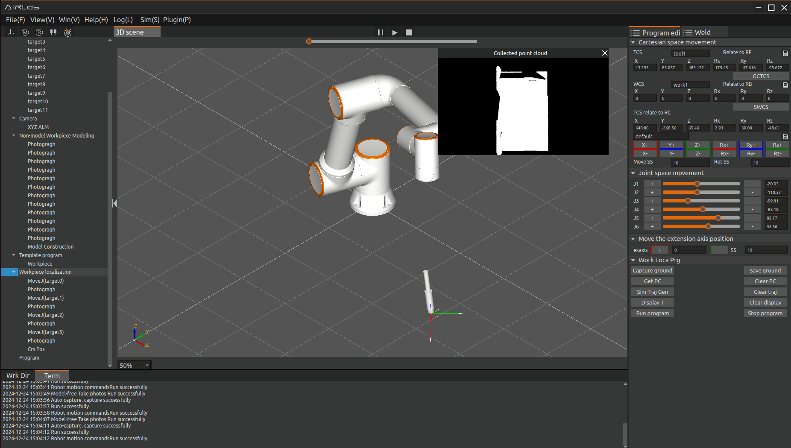

.. centered:: Figure 3-65  Click on the model const blocks

For symmetrical workpieces with integrity judgment enabled, the software will assess the completeness of the constructed model after the model-free construction process is completed. If the constructed model is determined to be incomplete, the software will prompt "Integrity judgment failed," as shown in the figure. The user will then need to perform additional captures of the workpiece until the model is fully constructed.

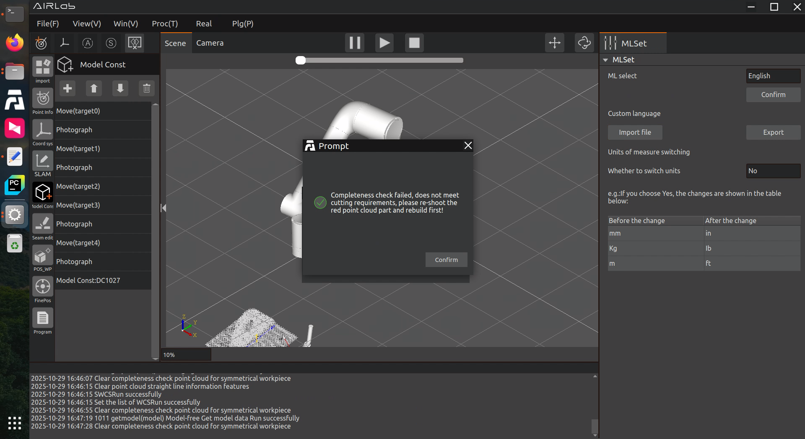

.. centered:: Figure 3-66  Integrity Judgment Failed

After the symmetrical workpiece model is fully constructed, the software will display a "Integrity judgment successful" prompt, as shown in the figure. The user can then proceed to the next operation.

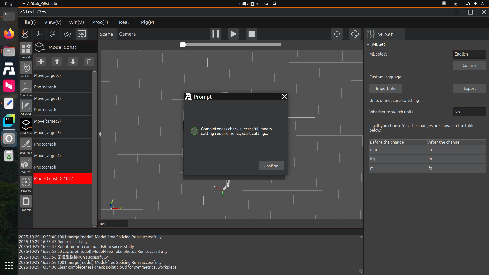

.. centered:: Figure 3-67  Integrity Judgment Successful

After the model construction program has finished running, the built model workpiece model will be displayed in the AIRLab 3D scene. Check whether the model is correct or not, the model is correct, the modelless construction is successfully constructed, and the model that has been successfully constructed can be directly imported in the next time, and there is no need to model the workpiece again for the modelless workpiece modeling.

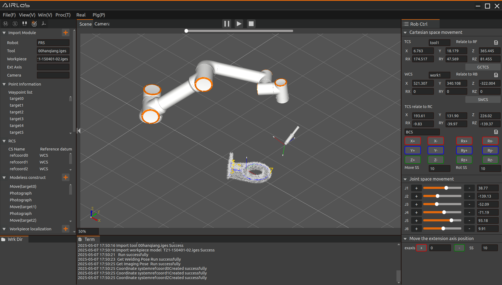

.. centered:: Figure 3-68  Model-free construct successfully

If the model is built incorrectly, you need to click the “Model Construction” module, click “Clear Model Data”, and then build the model again until the modelless artifact model is created correctly.

By clicking on the No Model Build module, the user can select options such as Get Modeling Data, and the functions of each option are described below.

- Supplementary shooting: After generating the workpiece model by running the model-free program, if there are incomplete parts in the workpiece model that need supplementary shooting, move the robot to the position where supplementary shooting is required and click "Supplementary Shooting". Then click "Acquire Modeling Data" to re-import the workpiece model after supplementary shooting.

- Get Modeling Data: Click “Get Modeling Data”, after clearing the modeling data, click Get Modeling Data to get the modeled artifact model again.

- Clear Modeling Data: Click “Clear Modeling Data” to clear the modelless workpiece model in the 3D scene.

- Run Program: Click “Run Program” to run the current program of the modelless building module.

- Stop Program: Click “Stop Program”, the robot will stop running immediately.

- Generate Trajectory: Click “Generate Trajectory” button to generate the simulation trajectory of the program in AIRLab 3D scene.

- Clear trajectory:Clicked this button will delete the generated tarjectory in AIRLab 3D scene.

- Show Tool: Click “Show Tool”, the virtual tool model will be shown in AIRLab 3D scene.

- Clear Tool: Click “Clear Tool”, the virtual tool model displayed in AIRLab 3D scene is cleared.

Weld editing
~~~~~~~~~~~~~~~~~~~~~~~
After importing the workpiece or successfully constructing the workpiece without a model, the workpiece model and weld seam data will be displayed in the 3D scene.

Click the plus sign under "Weld Seam Editing" to bring up the Weld Seam Selection pop-up window. Select a weld seam number; the weld seam type field will automatically display the type of the selected weld seam, including straight weld seams, arc weld seams, spline curve weld seams, and plug weld seams. Click the "Confirm" button to add the weld seam, and repeat this until all weld seams are added.

The successfully added welds here do not indent, reverse, shift, or bind to any welding process, and the progression and retreat point strategies are set to a custom distance of 100mm.

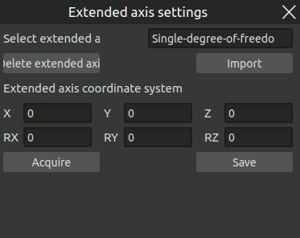

.. centered:: Figure 3-69  Choose weld seam to edit

If the weld needs to be re-edited, select the weld, click the edit icon at the top of the module, and complete the parameter settings in the 'Seam edit' popup.

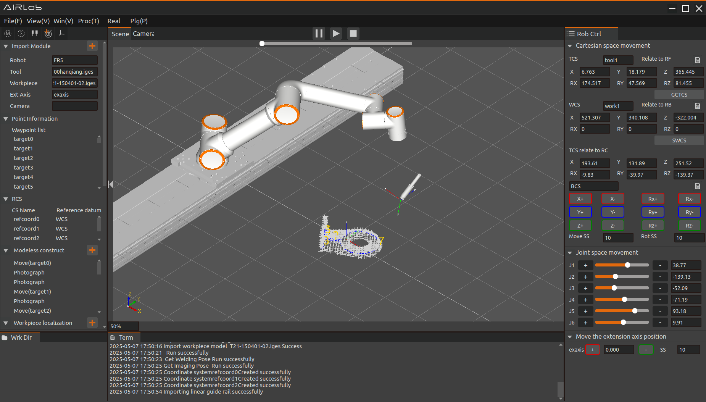

.. centered:: Figure 3-70  Adding Welds

After all the weld seam editing is completed, click on the precise positioning module to obtain the automatic photo pose

The meaning of each editing item in Weld Seam Editing is detailed in Section 3.6.9. Perform workpiece positioning or fine positioning operations only after all weld seams have been edited.

.. important::
    For the editing of plug workpieces, it is only necessary to bind the plug workpiece process.

After completing the weld seam editing for plug workpieces, click the "Weld Seam Editing" module and then click the "Generate Welding Program" button. A plug welding program will be generated under the "Program" node. Subsequent operations such as generating trajectories for the created welding nodes or running the program can be performed; details are provided in Section 3.4.6.

.. important::
    If AIRLab provides too many automatic photo poses (such as far more than the number of welds), some points should be deleted or manually taught again. The teaching points only need to capture the starting and ending points of the welds.

Workpiece positioning
~~~~~~~~~~~~~~~~~~~~~~~~
Workpiece positioning: After editing all the welds to be welded, workpiece positioning is required. Firstly, it is necessary to create a workpiece positioning program; Click on the workpiece positioning module, click on the plus sign under workpiece positioning, and the AIRLab interface will display the workpiece positioning page as shown in the figure.

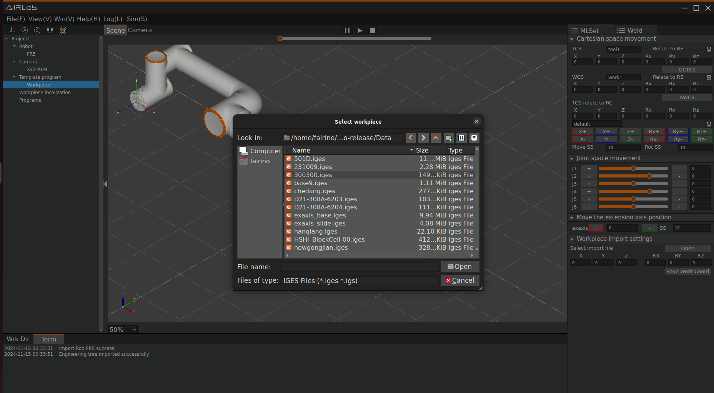

.. centered:: Figure 3-71  Adding a coarse positioning node

The workpiece positioning program consists of three node types:Capture Node,Move Node,Coarse Positioning Node.The Capture and Move nodes function identically to those in the Model-Free Construction module (see Section 4.5.2 for details).

Add a rough positioning node: After adding multiple sets of "movement + photo" nodes, add a rough positioning node and select a workpiece positioning algorithm. The rough positioning algorithms include Model-based, Cylinder Positioning, Depth Model, Depth Model 2, and Plug Recognition. The applicable scenarios for each algorithm are as follows:

- Model-based: Used for rough positioning of workpieces after model-free construction or workpiece import.
  
- Cylinder Positioning: Not yet available.
  
- Depth Model: Used for workpiece recognition in the automatic cycle operation of template programs.
  
- Depth Model 2: Applicable to the same scenarios as "Model-based", used for rough positioning of workpieces after model-free construction or workpiece import.
  
- Plug Recognition: Used for recognition and positioning of plug workpieces.
  
After selecting the workpiece positioning algorithm, click "Confirm", and a "Rough Positioning" node will be generated under the workpiece positioning program.

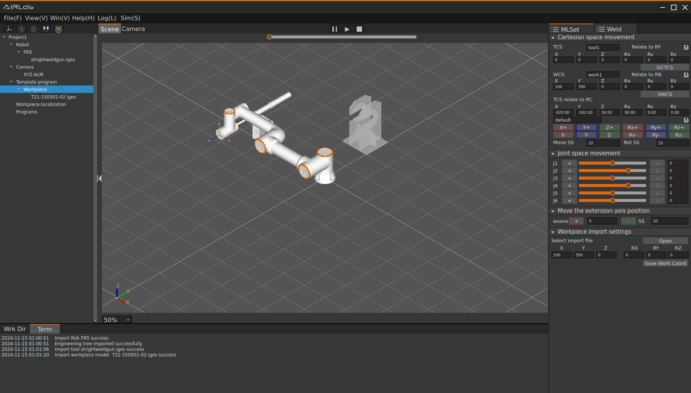

.. centered:: Figure 3-72  Workpiece positioning program

After adding these nodes, you can adjust the added nodes as needed. Once completed, the workpiece positioning program will be successfully created.The entire program functions as follows:The robot will move to multiple capture positions and take photos until the workpiece is fully captured. Then, the program will perform coarse positioning of the workpiece.The created workpiece positioning program is shown in the figure below.

After creating the workpiece positioning program,click the "POS_WP" module. The options that appear,as shown in the figure.

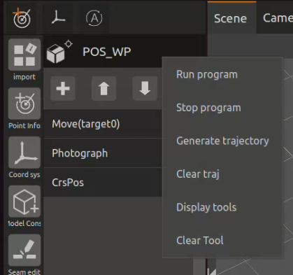

.. centered:: Figure 3-73  Click on the pos_wp blocks

- Generate the workpiece positioning program directly: Click this button, and AIRLab will automatically generate a workpiece positioning program with reference to the points created through model-free construction.

- Clear Cutting Point Cloud: Remove the cutting point cloud of symmetrical workpieces in the 3D scene.

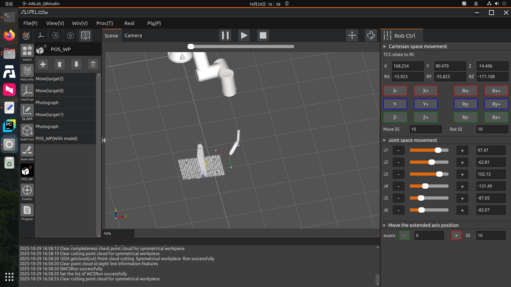

.. centered:: Figure 3-74  Clear Cutting Point Cloud

- Display Cutting Point Cloud: Show the cutting point cloud of symmetrical workpieces in the 3D scene.

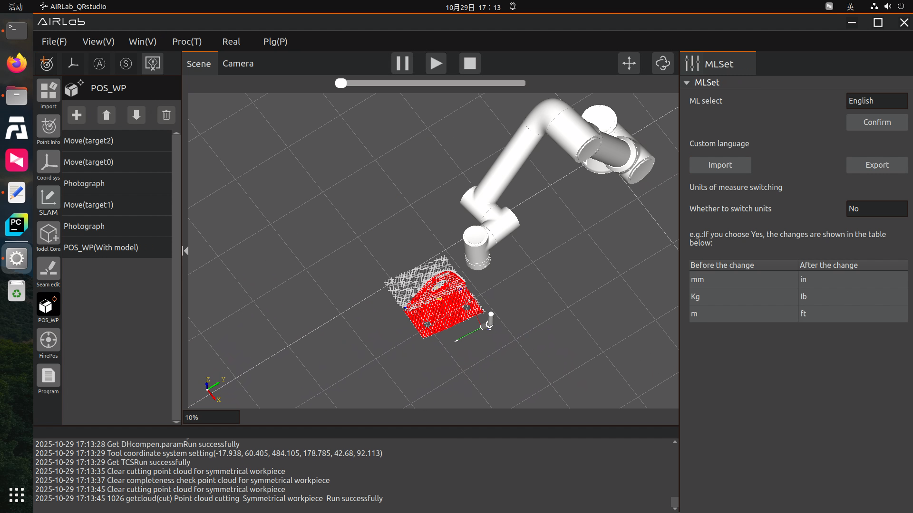

.. centered:: Figure 3-75  Display Cutting Point Cloud

Click "Generate trajectory" to view the simulated trajectory of the workpiece positioning program. After confirming the trajectory is correct, click "Run Program" to execute the workpiece positioning program for coarse workpiece positioning.

Upon successful completion of the workpiece positioning program, the workpiece will move to the actual relative position between the workpiece and the robot.

Fine pose
~~~~~~~~~~~~~~~~~~~~~~~~~~~~~~~
After the workpiece positioning is completed, it is necessary to fine position the weld seam of the workpiece to obtain the weld seam data.

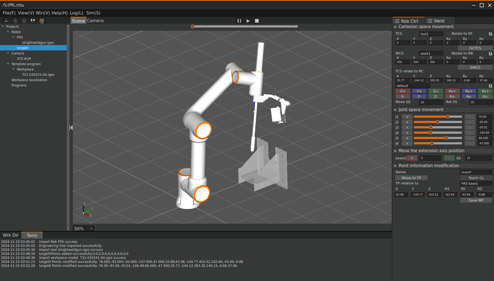

.. centered:: Figure 3-76  Auto Photo Position List

Click on the “FinePos” module, the function menu as shown in the figure.

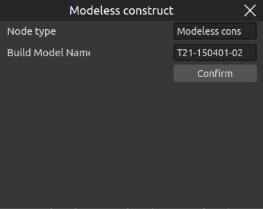

.. centered:: Figure 3-77  Click on the FinePos Module

Options such as “Run Program” and “Stop Program” function in the same way as the model-less build function, which can be described in the model-less build section. Other functions are described here:

- Get automatic photo position: After the positioning of the workpiece, the program will get the recommended photo position corresponding to each weld seam, click “Get automatic photo position” to get the recommended photo position.

- Refer to model-free construction for generating photo poses: The photo points taught during the model-free construction process will be automatically acquired as the photo points for fine positioning.  
  
- Obtain weld seam recognition data: Generate a welding program based on the results of fine positioning recognition, as well as the already edited weld seams and their attributes.

- Refer to model-free acquisition of weld seam recognition data: Generate a welding program based on the results of model-free construction, as well as the already edited weld seams and their attributes.

- Obstacle-free trajectory planning:Click "Obstacle-Free Trajectory Planning" to plan the welding program after collision detection.

- Generate barrier-free trajectory: Click “Generate barrier-free trajectory”, the robot trajectory after collision detection will be generated in the 3D scene.

- Run collision-free Program: Click “Run collision-free Program”, the robot will move according to the robot motion trajectory after collision detection.

The user chooses to run the program or run the accessibility program for weld identification after selecting the confirmation trajectory. After the fine position program is run, the final weld node is generated under the program module.

Program
~~~~~~~~~~~~~~~~~~~~~~~~~~~~~~~
After running the fine position, the final weld node is generated under the program module, and by clicking on the “Program” module, the user can choose to “run the program”, “stop the program”, “generate the trajectory” and other options, The user can select options such as “Run Program”, “Stop Program”, “Generate Trajectory”, etc. by clicking on the “Program” module. These options function in the same way as the “Run Program” option for model-less builds described above.

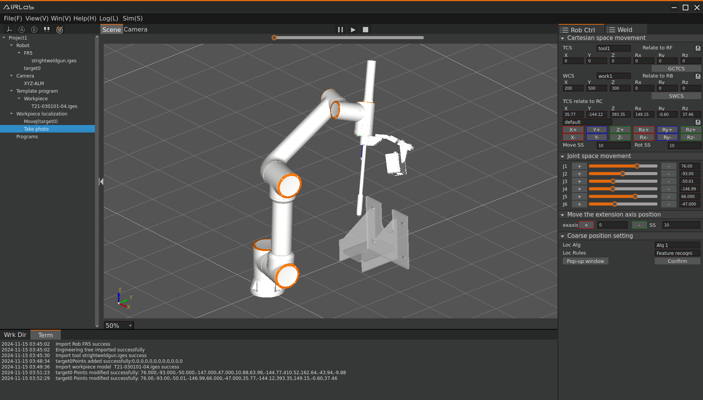

.. centered:: Figure 3-78  Click on the Program Module

Clicking on “Generate Trajectory” generates a weld trajectory in the AIRLab 3D scene, and the user can choose to run a simulation on the trajectory.

.. figure:: analysis/4/56.png
    :align: center
    :width: 3.5in

.. centered:: Figure 3-79  simulation trajectory

Click “Generate Tool”, the tool position of the key node will be displayed in the 3D scene, as shown in the following figure.

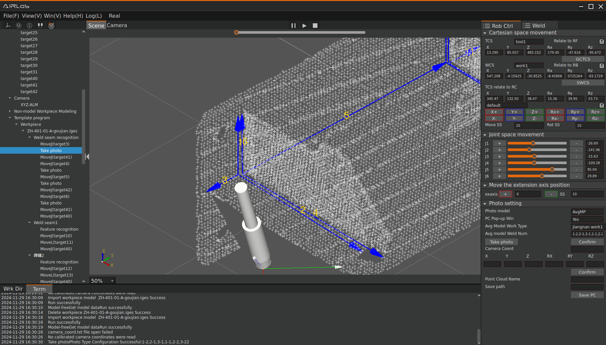

.. centered:: Figure 3-80  Generation Tools

After the simulation and tool position are correct, click “Run Program” to start the actual welding.

The generated program can be adjusted, click on the generated node, you can delete it, add nodes above, add nodes below, edit nodes, move up or down operations. Click on the plus sign to the right of the program module, AIRLab software interface will appear in the program page, you can customize the content of the node, click “confirm”, the program node under the generation of the content of the node.

Point information
~~~~~~~~~~~~~~~~~~~~~~~~~~~~~
Point Information Module: Click the point in the point list, you can delete or edit the point. Click “Edit Points”, the interface of AIRLab software will show the page of point information modification, users can choose to move the direct target point, synchronize the current position or save the modified points.

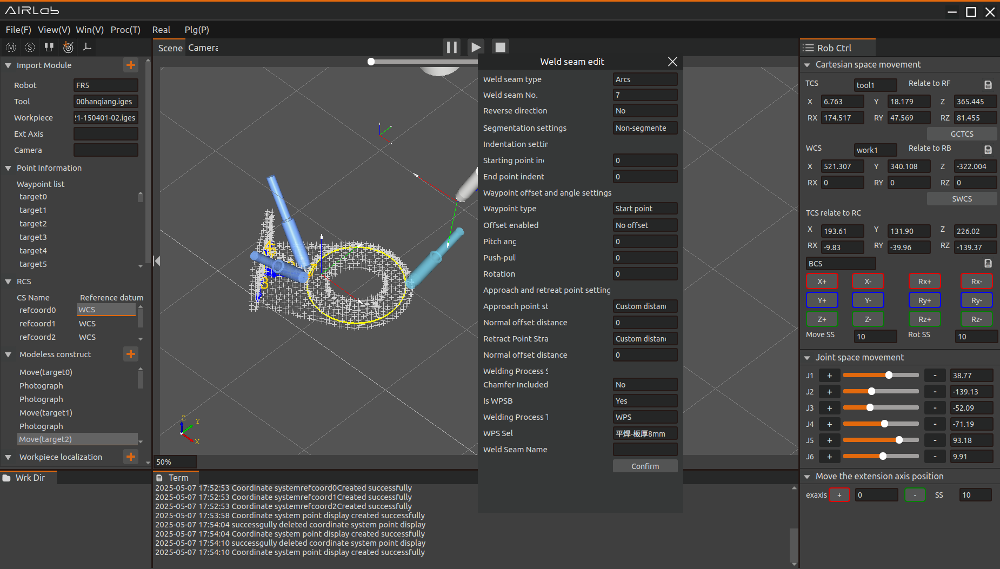

.. centered:: Figure 3-81  Modification of point information

Move to target point: user clicks “Move to target point” button, the robot end will move to the current edited point.
   
Synchronize the current point position: When the user clicks the "Synchronize Current Position" button, the pose of the currently selected point target0 will be modified to the pose of the robot that is actually taught.

Modify and save point position: The user modifies the point information, and then clicks the "Save Modify Point" button to modify the current point coordinates.

Reference coordinate system
~~~~~~~~~~~~~~~~~~~~~~~~~~~~~
Reference coordinate system: click the reference coordinate system icon in the menu bar, a new reference coordinate system will be create, the user can select the reference frame of reference coordinate system for the workpiece coordinate system or base coordinate system;Also can delete the current reference coordinate system, or edit the coordinate system.

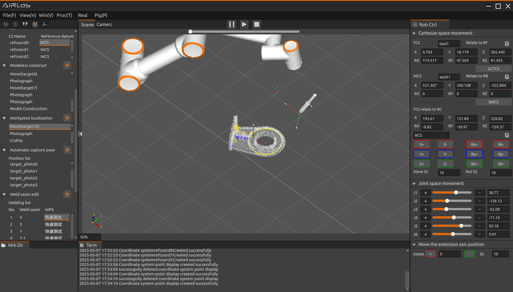

.. centered:: Figure 3-82  Reference coordinate system page

Select which coordinate system is the reference coordinate system, then set the coordinates of the reference coordinate system, select “Show” and click the “Set” button, the reference coordinate system will be displayed in the AIRLab 3D scene. Select “Do not show” and click “Set”, the displayed coordinate system will be hidden.

Pop-Ups and Other Pages
--------------------------
This section describes the AIRLab software pop-ups and other pages, pop-ups including about pop-ups, log pop-ups, software upgrade pop-ups, virtual camera pop-ups, global settings pop-ups, weld process query pop-ups, clearing the gun shear pop-ups, weld data calculation and collection of pop-ups and so on; Other pages including other control, simulation, debugging page, program configuration and multi-language settings.

About
~~~~~~~~~~~~~~~~~~~~~~~~~~~~~
When "About" is selected, clicking the button will display the current version and release date of the AIRLab software, middleware, and vision module, as shown in the follow picture.

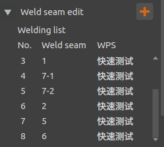

.. centered:: Figure 3-83  AIRLab version information and release date display

Log
~~~~~~~~~~~~~~~~~~~~~~~~~
Log is used to record the system's operation process and exception information, enabling quick issue identification. Clicking this button will bring up a "Log Level" popup window. There are four log levels: INFO, WARNING, ERROR, and DEBUG. After selecting a log level, the current log level will be set (default is INFO). As shown in the figure below, the specific meanings are described in Table 3-2.

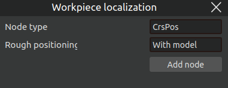

.. centered:: Figure 3-84  AIRLab Menu Bar-Logs

.. centered:: Table 3-2  Log level information

.. image:: analysis/4/表3-2.png
	:align: center
	:width: 6in

Software upgrade pop-ups
~~~~~~~~~~~~~~~~~~~~~~~~~
Click Window-Software Upgrade, and a software upgrade pop-up window will pop up.

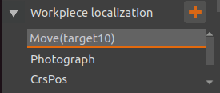

.. centered:: Figure 3-85   Software upgrade pop-ups

Click “Select File” to bring up the file selection window, select the AIRLab.tar.gz upgrade file, please make sure the file name and format are correct.

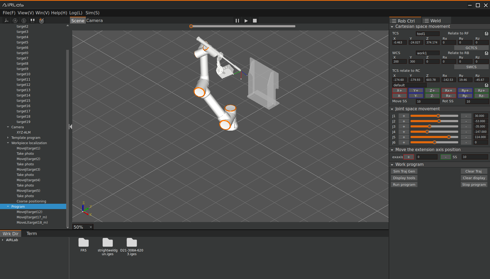

.. centered:: Figure 3-86   Selecting an upgrade package
    
.. figure:: analysis/4/64.png
    :align: center
    :width: 3in

.. centered:: Figure 3-87  Click on the "Upgrade" button

Click “Upgrade” and wait for the upgrade package to finish unpacking, the upgrade progress will be shown in the progress bar. Click Exit to exit the software upgrade.

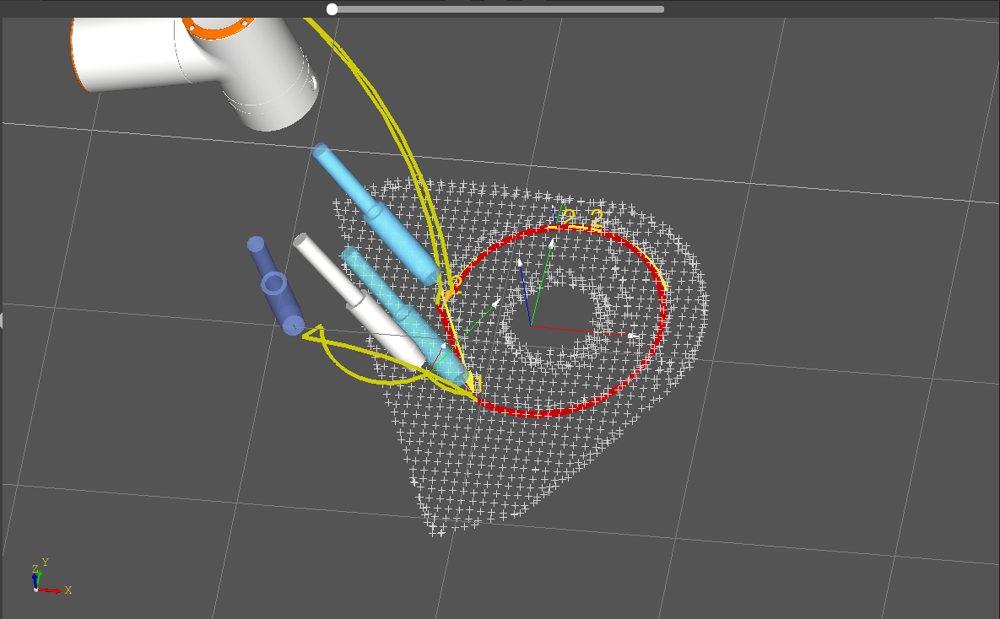

.. centered:: Figure 3-88  AIRLab software upgrade in progress

After the upgrade progress reaches 100%, click Confirm and restart the software, the upgrade is complete.

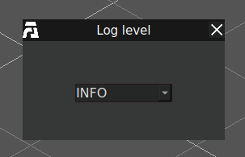

.. centered:: Figure 3-89   AIRLab software upgrade completed

If the upgrade package is corrupted or incomplete, the interface will display an upgrade failure message, and the AIRLab version will be rolled back to its state prior to the upgrade. After the rollback is completed, click Confirm to restart the software, recheck the upgrade package, and perform the update again.

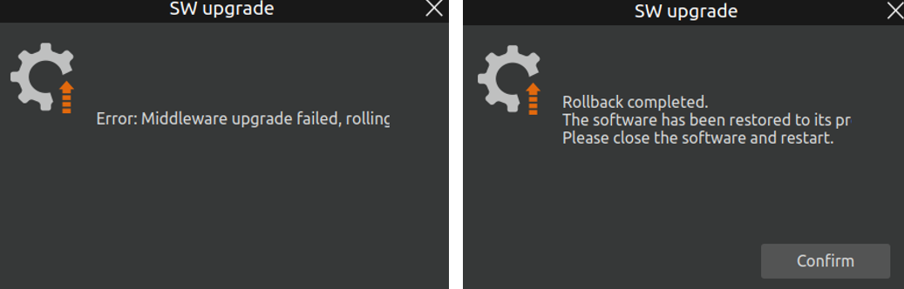

.. centered:: Figure 3-90   AIRLab Software Upgrade Failure Interface Feedback

Version Verification
~~~~~~~~~~~~~~~~~~~~~~~~~~~~~~~~~~~~~~~~~
Click “Window” – “Version Verification” to open the version verification dialog. If all versions are displayed with a green check mark, it indicates that the verification is successful and the AIRLab software can run normally, as shown below.

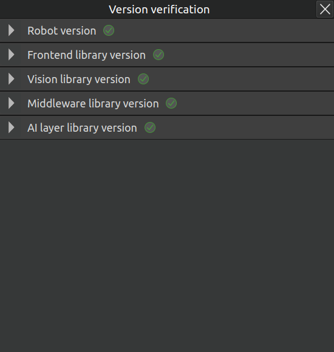

.. centered:: Figure 3-91   “Version Verification” dialog

If the library shows a red cross status in the version verification pop-up window, it indicates that the version of the library or function package does not match, as shown in the figure below. You can report this issue to the after-sales staff and obtain the latest upgrade package.

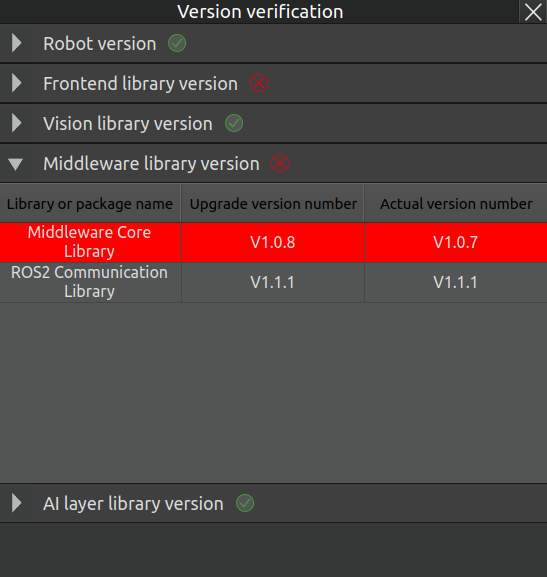

.. centered:: Figure 3-92   “Version Verification” error

Virtual Camera
~~~~~~~~~~~~~~~~~~~~~~~~~~~~~~~~~~~~~~~~~
Through the display of the virtual camera field of view, it is possible to observe whether the current camera shooting position is appropriate. At the same time, users can adjust the shooting position based on the display of the virtual camera field of view, and then adjust the camera to the optimal shooting position.

Click on the menu bar - Virtual Camera, and a virtual camera pop-up window will appear in the 3D scene, displaying the camera's field of view at the current position, as shown in the figure below.

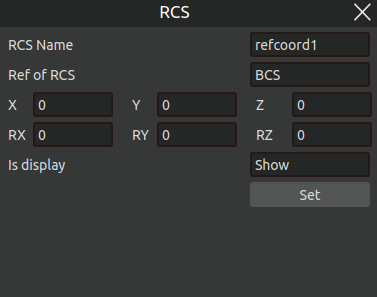

.. centered:: Figure 3-93   Virtual Camera Display Field of View

Adjust the camera position in the 3D scene, and the corresponding virtual camera field of view will also be synchronously transformed.

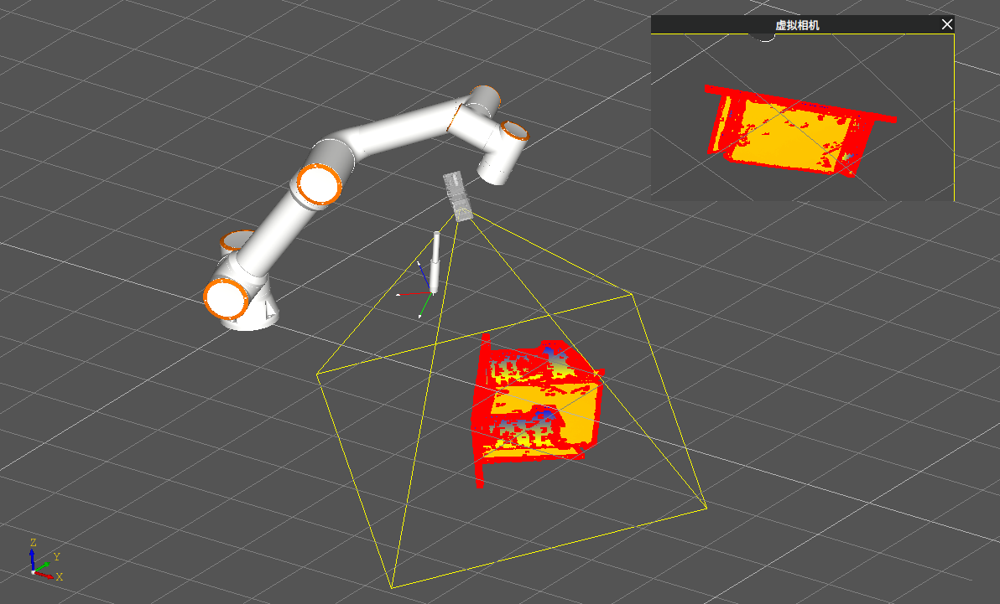

.. centered:: Figure 3-94   Camera field of view transformation

Global Settings
~~~~~~~~~~~~~~~~~~~~
In order to reduce the possibility of robot collision during welding movement, AIRLab has added a new “Global Settings” item in the menu bar “Window” to provide robot collision detection, as shown in the figure. The interface includes four types of collision thresholds, but currently only open the null process collision detection distance threshold, which refers to the robot from the withdrawal point of the previous weld to the next weld convergence point between the null path of the collision distance.

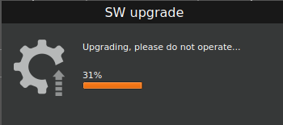

.. centered:: Figure 3-95  Setting popup content globally

Currently, the only collision detection available to the user is for the null shift process. When self-collision detection is enabled, even if the user does not set the “DryRun Collision distance threshold (mm)” (i.e., using the default value of 0mm), AIRLab will detect the collision of the robot's null shift path, and plan a collision-free and safe path. When this parameter is set by the user, AIRLab will plan the robot's null path farther away from the obstacle based on the input threshold parameter on a collision-free basis.

After setting the parameters of collision detection, click “confirm” button to complete the parameter setting and close the “Global Settings” pop-up window. 

.. important::
    After the collision detection is enabled, users need to teach the withdrawal and convergence points for each weld when creating the weld template program.

After completing the settings of the project tree and other related parameters, the user clicks on the “One Click Start” button in the toolbar of AIRLab, and when the program runs into the obstacle avoidance planning section, AIRLab will show a “Progress Alert” pop-up window to display the current progress of the planning. AIRLab will show the progress of the current planning as shown in the figure.    

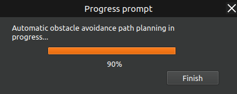

.. centered:: Figure 3-96  Obstacle avoidance planning in progress

If the obstacle avoidance planning fails, the pop-up window switches to the following figure, and the user needs to re-teach the exit point and convergence point, and click the “One Click Start” button again.

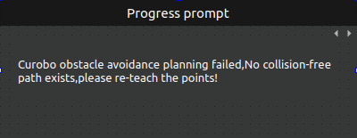

.. centered:: Figure 3-97  Failure of obstacle avoidance planning

If the planning is successful, the pop-up window will be switched to the following figure, users can click “View Trajectory” button to generate the simulation trajectory of the motion instruction under the ‘Program’ node; click “Clear Trajectory” button to clear the trajectory in the interface; click “Run Program” button to start running the lua program directly. Click “Clear Trajectory” button to clear the trajectory in the interface; click “Run Program” button to start running the lua program directly.

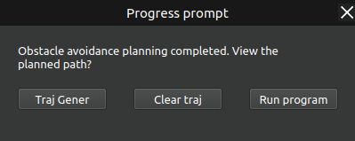

.. centered:: Figure 3-98  Progress bar alert popup

After successful obstacle avoidance planning, the relevant “MoveJ()” instruction in the ‘Program’ node of the project tree will be amended to “SplinePTP()”.

The following simulation trajectory diagram as an example to show the actual effect of AIRLab collision detection, Figure 3-76 for the opening of the collision detection function, AIRLab automatic obstacle avoidance planning trajectory; Figure 3-77 for the opening of the collision detection is not open, the trajectory obtained by AIRLab through the motion planning, it can be seen clearly that the robot will be empty moving process and the collision of the workpiece.

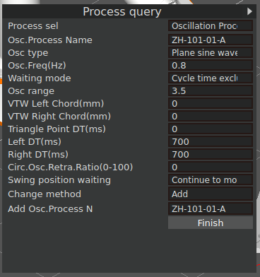

.. centered:: Figure 3-99  Turn on collision detection planning

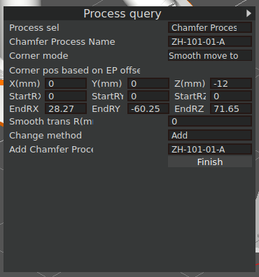

.. centered:: Figure 3-100  No collision detection planning

In the case that the obstacle environment does not change, the user can not repeat the obstacle avoidance planning after successfully completing one obstacle avoidance planning, if you need to repeat the instructions under “Program” in the project tree, click “Run Program” in “Work Program” on the sub-page. If you need to run the commands under “Program” in the project tree repeatedly, click “Run Program” in “Work Program” on the subpage. If the obstacle environment changes, you have to click the “Run” button again to plan a new obstacle avoidance path.

Welding process query pop-up window
~~~~~~~~~~~~~~~~~~~~~~~~~~~~~~~~~~~~~~~~~
Click on Process - Welding Process in the menu bar, and the AIRLab software interface displays the Process Inquiry pop-up window.

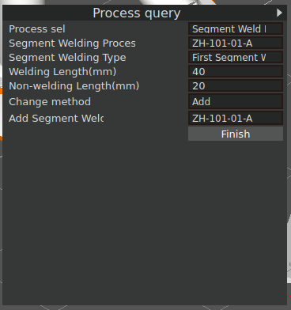

.. centered:: Figure 3-101  Process Inquiry Popup

The left side of the pop-up window is for welding process classification, including flat welding, flat angle welding, vertical upward welding and other 9 categories, click on the welding process under the welding process classification, the right side will display the specific information of the process.

Add welding process: Select the category of welding process to be added, click on the plus sign next to “P_type”, a welding process will be added under the category to be edited;

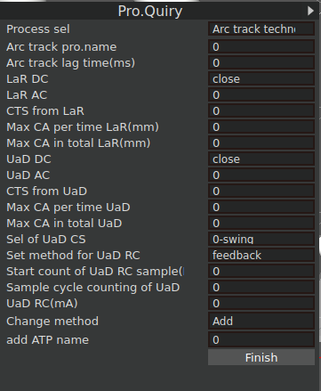

.. centered:: Figure 3-102  Newly added welding process

Click on the newly added weld process and edit the weld process name, weld time interval (only used for multi-layer multi-pass welding) on the right side to add weld pass information. Click on the plus sign next to the list of weld passes to add new pass information. If the process is multi-layer multi-pass welding, add as many weld passes as necessary, otherwise add only one weld pass.

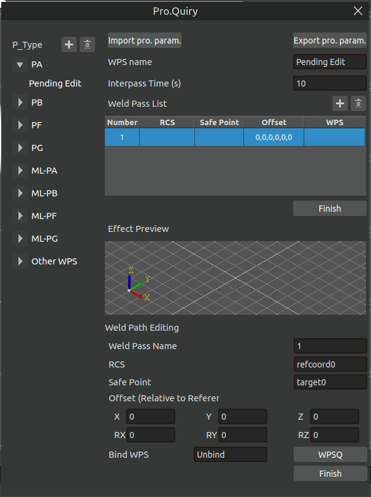

.. centered:: Figure 3-103  Modify weld channel information

Click the weld channel in the weld channel list, and the information of the currently clicked weld channel will be displayed in the weld channel editing section. Modify the weld channel information by selecting the reference coordinate system, safety point, offset, and binding the welding process and click Finish, and the information of the weld channel in the weld channel list will be modified.

.. figure:: analysis/4/79.png
    :align: center
    :width: 3.5in

.. centered:: Figure 3-104  Successful modification of weld channel information

After modifying all the welding channel information, click the “Finish” button under the welding channel list, and the terminal will show that the new multi-layer multi-channel welding process has been successful, and then a new welding process will be successfully added.

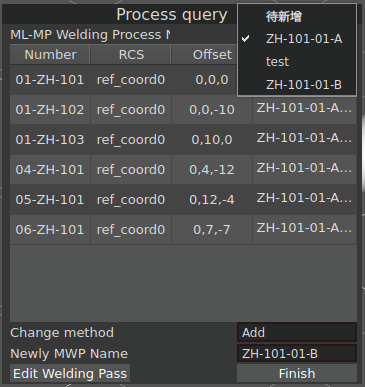

.. centered:: Figure 3-105  New Welding Processes Successful

Modify welding process: Click on the welding process to be modified, modify the welding process data as needed, and you can add, modify or delete the list of weld passes.

1)Add a new weld path: Click the plus sign next to the weld path list to add a weld path in the weld path list.

2)Modify weld pass: Click the weld pass that needs to be modified in the list of weld passes, the information of the weld pass will be displayed in the editing of the weld pass, after modifying the information of the weld pass, click the “Finish” button, and the information of the weld pass in the list of weld passes will be modified.

3)Delete Path: Select the weld path that needs to be deleted, click the delete icon next to the list of weld paths, and the weld path will be deleted.

After all the modifications are completed, click the “Finish” button under the list of welding channels, the software page will prompt “Does the process already exist? Click “confirm” button, the terminal displays “Modify Multi-layer Multi-pass Welding Process Successfully”, that is, successfully modify the welding process.

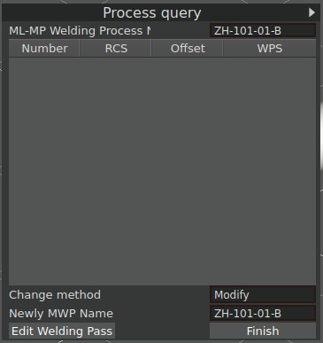

.. centered:: Figure 3-106  Modifying Welding Process Tips

Delete Welding Process: Select the welding process to be deleted and click on the delete icon next to the process type and the process will be deleted.

Cylinder Filling Process Query Pop up Window
~~~~~~~~~~~~~~~~~~~~~~~~~~~~~~~~~~~~~~~~~~~~~~~~~~
The pop-up window for querying the cylindrical filling process is shown in the figure below. The cylindrical filling process includes two parts: filling the bottom surface of the cylinder and secondary reinforcement.

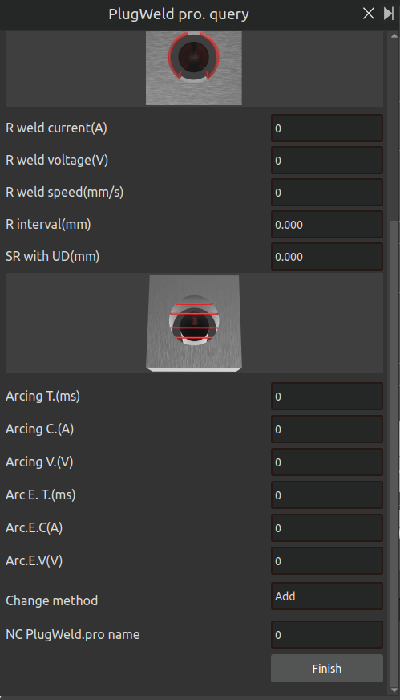

.. centered:: Figure 3-107  Cylinder Filling Process Query Pop up Window

1. Fill the bottom surface of the cylinder

Before performing cylindrical filling welding, users need to set parameters such as welding current, welding voltage, welding speed, spacing, offset, safety point selection, and swing process selection.

2. Secondary reinforcement
   
After the cylindrical filling welding is completed, secondary reinforcement welding is carried out, and the same user needs to set parameters first.

The filling interval refers to the vertical distance between two adjacent filling layers;

Inward filling offset refers to the horizontal distance between the starting point of filling and the edge of the cylinder;

The safety point name is the transition point of the robot during the filling and reinforcement process. After completing one filling or reinforcement, the robot needs to return to that point for the next welding.

Reinforcement interval refers to the vertical distance between adjacent reinforcement layers;

The upward offset of secondary reinforcement refers to the vertical interval between the starting point of the second reinforcement and the starting point of the first reinforcement;

Users can add, modify, or delete cylindrical filling processes,

New: Select "Add" as the change method, then set the process parameters and the name of the new filling process, and click the "Finish" button to add a new filling process;

Modification: Select "Modify", choose a cylindrical filling process name, then reset the process parameters, and click the "Finish" button to modify the parameters of the process;

Delete: Select "Delete", choose a cylindrical filling process name, and then click the "Finish" button to delete the process.

Welding seam edit pop-up window
~~~~~~~~~~~~~~~~~~~~~~~~~~~~~~~~~~~~~~~~~~~~~~~~~~
Click the ”weld sem” module. After adding a weld seam, click the edit icon—this will bring up the Weld Seam Editing pop-up window in the 3D scene, as shown in the figure. Below is an introduction to all editing items:

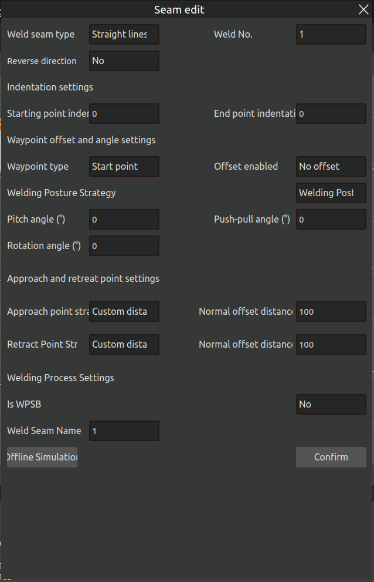

.. centered:: Figure 3-108 weld seam edit pop-up window

- Weld Seam Type: Automatically generated based on the selected weld seam. 

- Weld Seam Number: Automatically generated based on the selected weld seam. 

- Reverse Direction: Displays the welding direction of the weld seam in the 3D scene. Select whether to reverse the direction according to actual welding needs. If "Yes" is selected, the direction of the weld seam in the 3D scene will be reversed.

Indentation Settings

- Start Indentation: Set the indentation at the start of the weld seam. When welding this seam, the process will begin from the start point after the indentation. 

- End Indentation: Set the indentation at the end of the weld seam. When welding this seam, the process will stop at the end point after the indentation.

Point Offset and Angle Settings 

If the position of the start point, end point, or intermediate point of the current weld seam is inaccurate, correction can be made through point offset and angle settings:

- Select the point that needs to be offset, set "Offset" to "Yes", and then configure the position offset for the selected point. Offset can be performed in either the base coordinate system or the workpiece coordinate system. 

Welding Posture Strategy

Configure the tool posture for welding; you can either set the welding posture angle directly or use a custom posture: 

- Welding Posture Angle: Adjust the tool posture by modifying the tool's pitch angle, push-pull angle, and rotation angle. 

- Custom Posture: Adjust the tool posture by directly setting the posture of the tool tip. You can teach a suitable posture first, then click the "Acquire Current" button to capture the current posture. 

Approach Point and Retract Point Settings

Configure the approach point and retract point for the weld seam. During welding, the robot will first pass through the approach point before reaching the weld seam’s start point; after welding is completed, it will retract from the weld seam’s end point to the retract point: 

- Approach Point Strategy: Includes custom distance or custom point:

(1)Custom Distance: Refers to the distance along the normal direction of the start point. 

(2)Custom Point: Refers to the approach point position taught manually.

- Retract Point Strategy: Settings for the retract point are similar to those for the approach point: Custom Distance here refers to the distance along the normal direction of the end point. 

Welding Process Settings

For weld seams that require binding to a welding process: 

(1)Set "Bind Welding Process?" to "Yes". 

(2)Select the type of welding process to bind and the specific welding process (parameters, procedures, etc.).

For the editing of spline curve weld seams, when setting points and angles, you can choose the setting method as either overall setting or setting for a specific point:

- If you select "Overall Setting", the configured point offset and welding posture will apply to all points of the weld seam. 

- If you select "Setting for a Specific Point", the configured point offset and welding posture will only apply to the selected point.
 
Other editing items are the same as those for straight + arc weld seams.

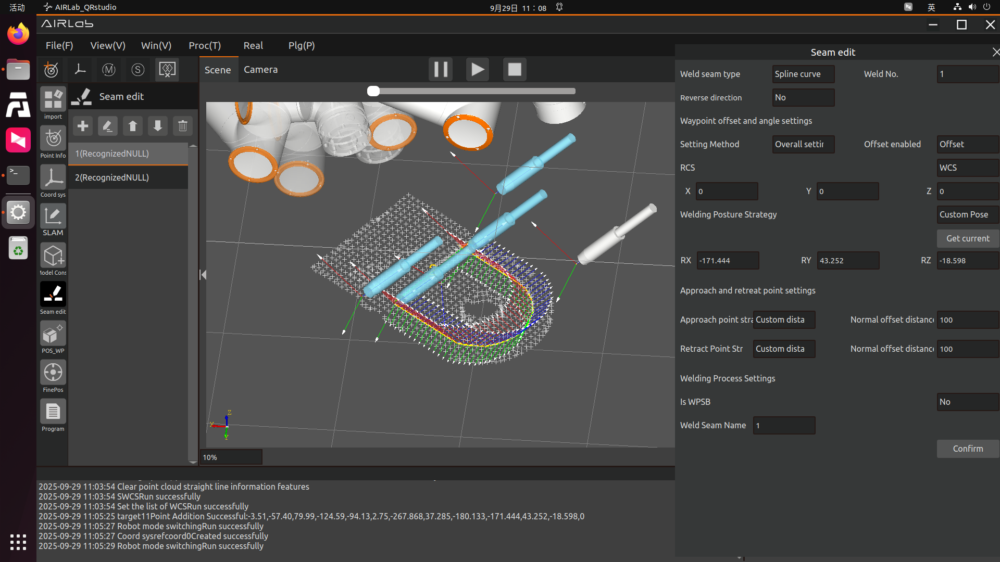

.. centered:: Figure 3-109 spline curve weld seams edit

Welding data calculation and collection pop-up window
~~~~~~~~~~~~~~~~~~~~~~~~~~~~~~~~~~~~~~~~~~~~~~~~~~~~~~~~~
Click on the window Welding Data Collection, and a pop-up window will appear displaying the current welding information; The pop-up window displays the welding current, welding voltage, and speed as the current welding status information; The arc duration and arc length are statistical information, which includes the total duration and length of welding performed using AIRLab software before the last reset. Click reset to reset the welding duration and arc length to zero.

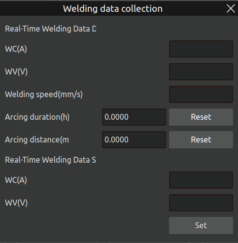

.. centered:: Figure 3-110   Welding data collection pop-up window

Torch Cleaning and Wire Cutting
~~~~~~~~~~~~~~~~~~~~~~~~~~~~~~~~~~~~~~
Click “Window”–“Torch Cleaning and Wire Cutting” to open the “Torch Cleaning and Wire Cutting Settings” popup, as shown below. The parameters to be configured on this page include: Enable Automatic Torch Cleaning and Wire Cutting, Cleaning Method, Cleaning Cycle, Enable Oil Spray Point, Torch Cleaning Safety Point, Torch Cleaning Point, Wire Cutting Safety Point, and Wire Cutting Point.

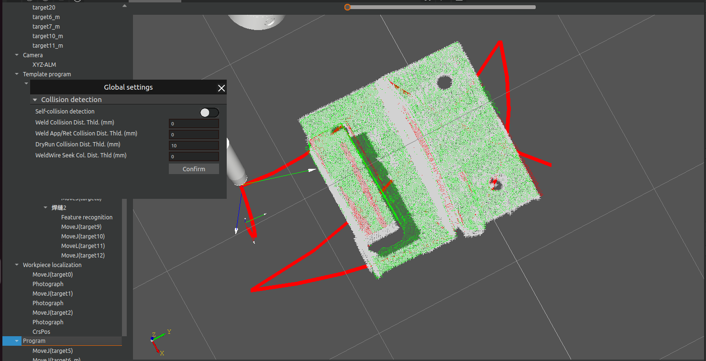

.. centered:: Figure 3-111  Parameter setting for gun clearing and wire cutting

This function supports both manual and automatic operation modes.The manual mode is intended for scenarios where the robot needs to perform torch cleaning or wire cutting immediately.The automatic mode is suitable for scenarios where the robot triggers torch cleaning and wire cutting operations automatically at fixed time intervals during its operation.

The manual mode is divided into Manual Torch Cleaning and Manual Wire Cutting.For manual torch cleaning, the parameters that need to be configured are: Enable Oil Spray Point, Torch Cleaning Safety Point, and Torch Cleaning Point. Once configured, click the Manual Torch Cleaning button to start the cleaning process.For manual wire cutting, only the Wire Cutting Safety Point and Wire Cutting Point need to be set. After configuration, click the Manual Wire Cutting button to initiate the wire cutting operation.

For automatic torch cleaning and wire cutting, all the parameters on the page need to be configured, then click the confirm button. When the cumulative welding time of the robot’s current welding session reaches the set cleaning and cutting cycle, a prompt dialog, as shown below, will appear after the robot stops welding, asking the user whether to proceed with torch cleaning and wire cutting.If Yes is selected, the robot will automatically perform torch cleaning and wire cutting.If No is selected, the robot will skip the cleaning and cutting operations, including the Torch Cleaning Safety Point, Torch Cleaning Point, Wire Cutting Safety Point, and Wire Cutting Point.

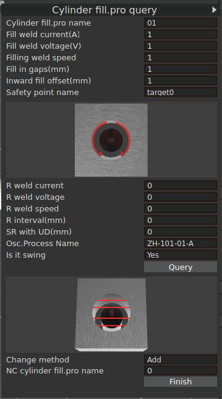

.. centered:: Figure 3-112  Reach the clear gun shear cycle

.. important::
    If automatic torch cleaning and wire cutting is enabled, the cleaning and cutting cycle cannot be set to 0!

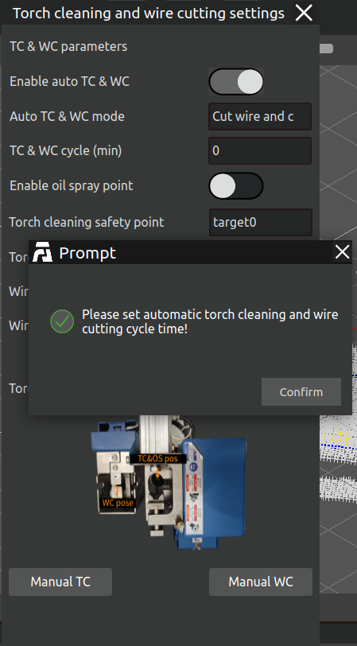

.. centered:: Figure 3-113  Popup for unset cycles in auto mode

When using the torch cleaning and wire cutting function for the first time, the user needs to manually teach the Torch Cleaning Safety Point, Torch Cleaning Point, Wire Cutting Safety Point, and Wire Cutting Point.Teaching method: First, open the “Torch Cleaning and Wire Cutting” dialog. According to the point addition method and the torch cleaning and wire cutting station diagram in the dialog, add the four points mentioned above. After successfully adding the points, select the corresponding point names from the dialog, configure the other parameters, and click the confirm button. The parameters on the page, along with the joint values of the four points, will be saved into the configuration file for torch cleaning and wire cutting.

After importing other projects, AIRLab will automatically read the parameters from the configuration file and add the Torch Cleaning Safety Point, Torch Cleaning Point, Wire Cutting Safety Point, and Wire Cutting Point to the point list.

.. important::
    If the position of the torch cleaning and wire cutting station has not changed, the user does not need to teach these four points again.

Automatic loop operation
~~~~~~~~~~~~~~~~~~~~~~~~~~~
AIRLab offers the function of automatically cycling through welding projects, allowing users to repeatedly execute welding processes on workpieces. The detailed steps are as follows:

Step 1: Launch AIRLab, import the workpiece registration template project, and open the menu bar—select the automatic cycle operation pop-up window, as shown in the figure below.

.. important::
    AIRLab has specific requirements for the path of the workpiece registration template project. It must be placed in /Data/Work_template under the AIRLab directory. No other USD files are allowed in this folder besides the workpiece registration template project. The project name can be arbitrary.

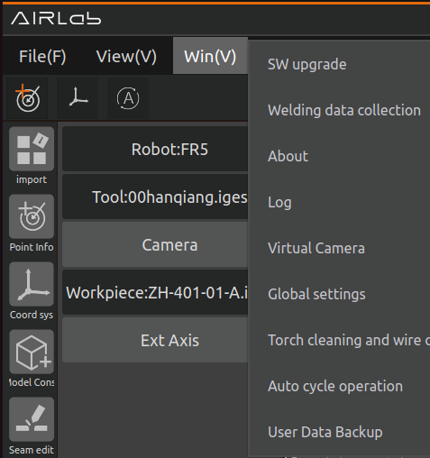

.. centered:: Figure 3-114   AIRLab menu bar - Window - Auto Loop Run

Set loop parameters according to actual needs, and the introduction of each parameter is as follows:   

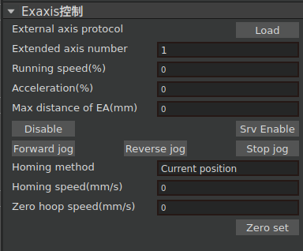

.. centered:: Figure 3-115   Automatic loop operation parameter settings

Enable Automatic Cycle Operation: If automatic cycle operation is required, click this button to activate the function.

Cycle Interval: The waiting time between cycles. For example, after the robot completes the welding process for the current workpiece, it will wait for this interval before importing the template program again to proceed with the next cycle.

Cycle Mode: There are two types,Continuous Cycle: Runs indefinitely. Fixed Cycle: The robot automatically stops after completing the set number of cycles.

Cycle Count: This parameter only needs to be set when the cycle mode is Fixed Cycle. (Note: The cycle count cannot be set to 0.)

.. important::
    Once the automatic cycle operation parameters are configured, they are automatically saved and loaded. If no changes are needed, simply import the workpiece registration template—the system will use the last saved settings without requiring repeated configuration.

Step 2: Click the "One-Click Run" icon button in the AIRLab menu bar to start executing the Workpiece Registration Template Project, initiating workpiece recognition. The recognition process is shown in the figure below.

The progress of workpiece recognition is displayed as shown in the figure below.Upon successful recognition, the matching score of the workpiece is shown Figure 3-93.

AIRLab then automatically searches for the corresponding welding project of the recognized workpiece. If the project exists in the specified path, it will be imported automatically,and terminal will show the path,as shown in the figure below.If recognition fails, AIRLab will display an error message and suggest corrective actions.

.. important::
    Welding projects must be placed in the /Data/Weld_template folder under the AIRLab directory.The welding project name must exactly match the workpiece name. For example, if the workpiece is named ZH-0-01-A, its corresponding welding project must be ZH-0-01-A.usd. If the welding project is not found in the specified path, AIRLab will fail to retrieve it and display a pop-up warning.

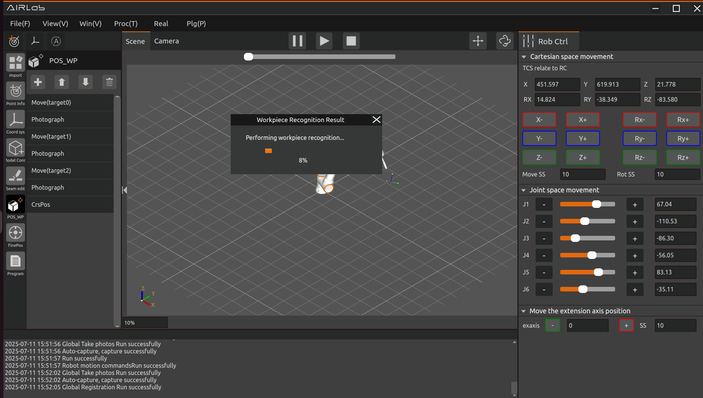

.. centered:: Figure 3-116   The workpiece is being identified

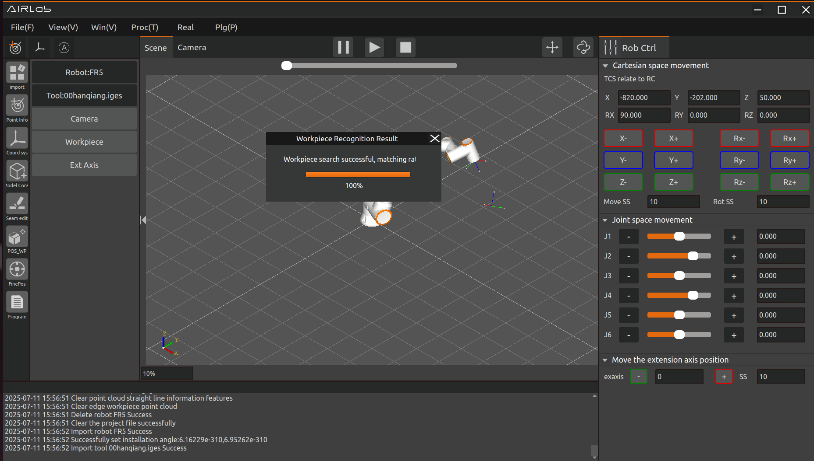

.. centered:: Figure 3-117   The workpiece recognition is successful
    
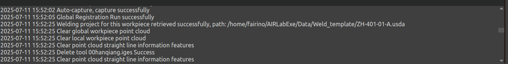

.. centered:: Figure 3-118  Automatically retrieve welding projects and import new projects

Step 3: After the welding project is automatically imported, AIRLab controls the robot to execute the project. Once the program completes, AIRLab and the robot enter the cycle interval wait state.

.. important::
    If different workpieces need to be replaced, users should estimate the replacement time in advance and set the "Cycle Interval" parameter accordingly. If no workpiece replacement is needed, the cycle interval can be set to 0 or 1 (minimal delay).

Step 4: After the waiting period ends, the next cycle begins. AIRLab automatically clears the current project and re-imports the Workpiece Registration Template Project.Upon successful import, AIRLab controls the robot to restart workpiece recognition.f recognition succeeds, AIRLab searches for the corresponding welding project. If the project exists, Step 3 is repeated.

Step 5:AIRLab automatically controls the robot to repeat Step 4 based on the configured Cycle Mode and Cycle Count until all automatic welding cycles are completed，as shown in the figure below.

.. important::
    If a robot controller error or AIRLab error occurs during the cycle, the automatic operation stops immediately, requiring manual troubleshooting before resuming.

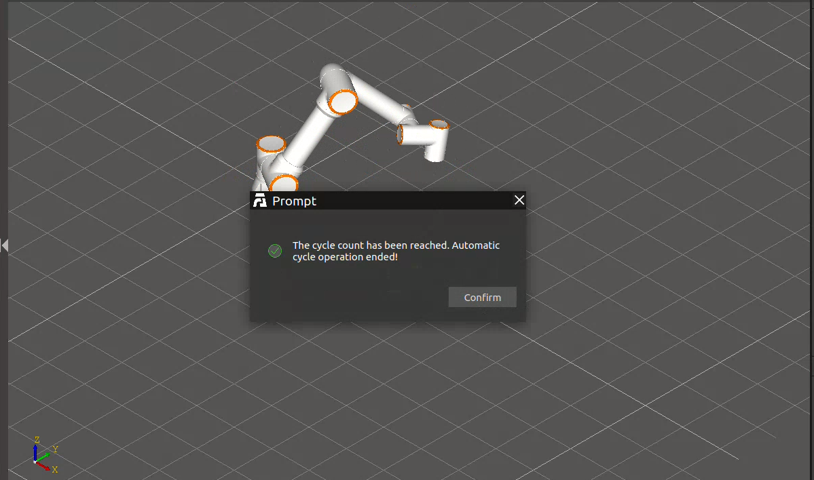

.. centered:: Figure 3-119  Reaching the set number of cycles, ending the automatic loop operation

The above outlines the usage method and steps for AIRLab's Automatic Cycle Operation function.

User data backup
~~~~~~~~~~~~~~~~~~~~~~~~~~~~~~~~~~~~~~~
If a user needs to transfer a pre-configured welding process, template programs, and built workpiece data from one device to another to replicate the environment, AIRLab provides a user data backup feature.  

Click on the AIRLab menu bar - Window - User Data Backup, and a pop-up window titled "User Data Backup" will appear, as shown in the figure below. Below is a detailed introduction to the usage of the user data package import and export functions. 

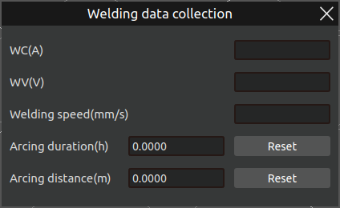

.. centered:: Figure 3-120   Pop up window for user data backup function

First, you need to select the "Data Backup and Restoration Type", choosing between "Single Template Data" and "All Data" as shown in the figure. Once confirmed, you can proceed with the import and export operations.

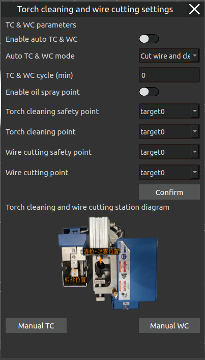

.. centered:: Figure 3-121  Data Backup and Restoration Type

Export Function: 

If the data backup and restoration type is "All Data,click the "Export" button, and AIRLab will first write the version of the current software data package into the version.txt file for version matching verification during import. Then, AIRLab will proceed to copy the following data:  

Located in the Data folder under the executable file directory:

- The Work_template folder (storing workpiece registration templates)  

- The Weld_template folder (storing welding template programs)  

- The entity folder (storing workpiece and tool models)  

- The database file Airlab_weld_process.db(storing user-created welding process data)  

Located in the data folder under the main directory:

- The output folder (for models)  

- The register_model folder (for auto-saved model files)  

- The weld_seam_database folder (for weld seam databases)  

If the data backup and restoration type is "Single Template Data", you need to first open the template project in AIRLab, then click the "Export" button. AIRLab will package and compress the template and its dependent files, and place the output compressed file in the /Downloads directory of the main folder. The file name is the workpiece name with the .tar.gz extension, such as ZH-401-01-A.tar.gz. Similarly, AIRLab will write the version of the current single template data package into the single_version.txt document within the package for version matching verification.

During the export process, AIRLab will display a pop-up window indicating that the data package is being exported, as shown in the figure below. If cancellation is needed, click the "Cancel Export" button in the pop-up.

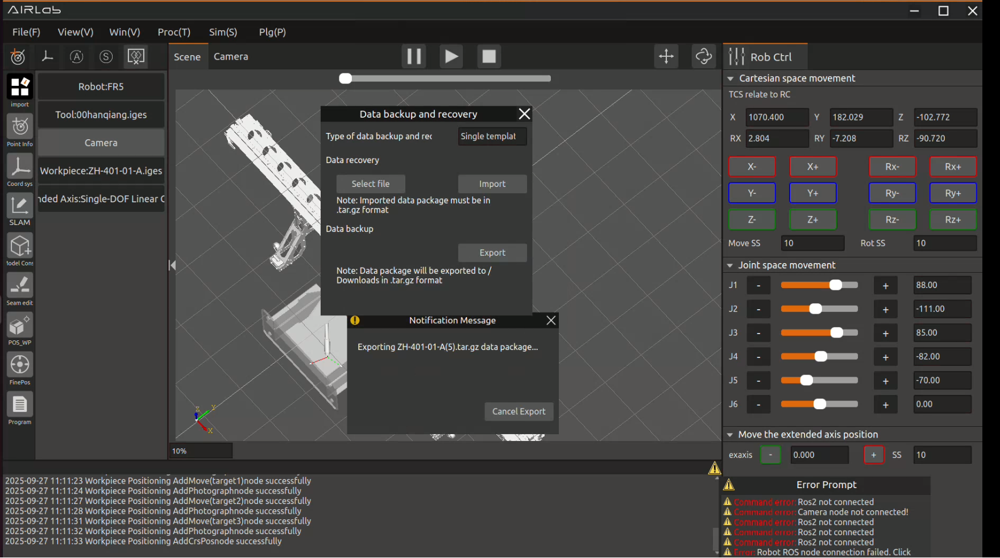

.. centered:: Figure 3-122  User Single Template Data is currently being packaged and exported

Once completed, AIRLab will show another pop-up confirming the export and displaying the export path of the data package, as shown in the figure below.

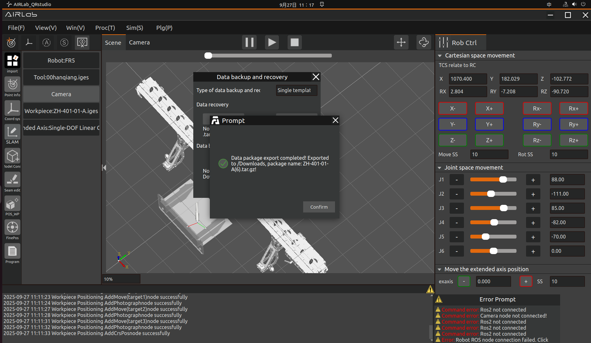

.. centered:: Figure 3-123   User Single Template Data export completed

.. important::
    If a user initiates the export function but any of the folders listed above do not exist, AIRLab will display a pop-up notification indicating the names and paths of the missing folders. The user must create these missing files or folders before proceeding with the export.

Additionally, if the permissions for any of the specified folders or files are modified to restrict access or copying, AIRLab will fail to export and provide the file path where the error occurred. Please check the file permissions based on the error message, correct them, and retry. (In some cases, restarting the edge PC may be required for permission changes to take effect.)  

The directory structure of the exported compressed package is shown in the figure below: 

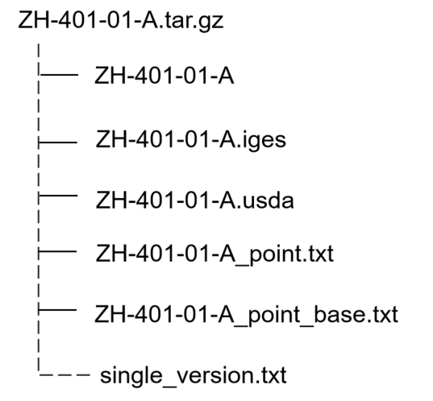

.. centered:: Figure 3-124  the directory structure of single template data

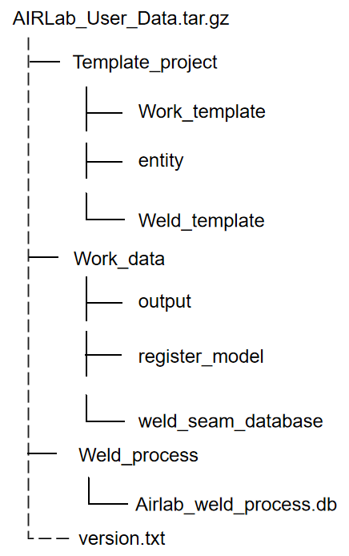

.. centered:: Figure 3-125   The directory structure of the complete data package

Import Function:Click the "Select File" button to choose the data package to be imported (ensure the directory structure of the data package matches the one shown in the figure below). Then, click the "Import" button.  

AIRLab will first verify the version number in the version.txt file within the imported data package. If the version numbers match, the system will proceed with importing the data package contents.  

If the version numbers do not match, a pop-up message will appear, notifying the user of the version inconsistency and indicating that the data is incompatible and cannot be imported, as shown in the figure below. 

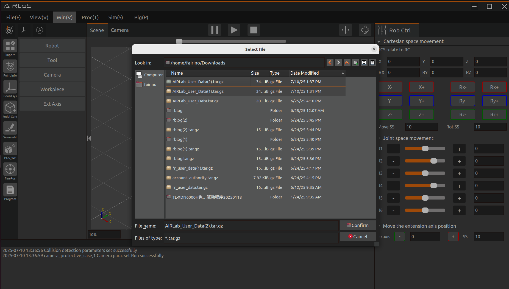

.. centered:: Figure 3-126  Select the data package to be imported in the image

.. figure:: analysis/4/99.png
    :align: center
    :width: 6in

.. centered:: Figure 3-127  The data package is currently being imported

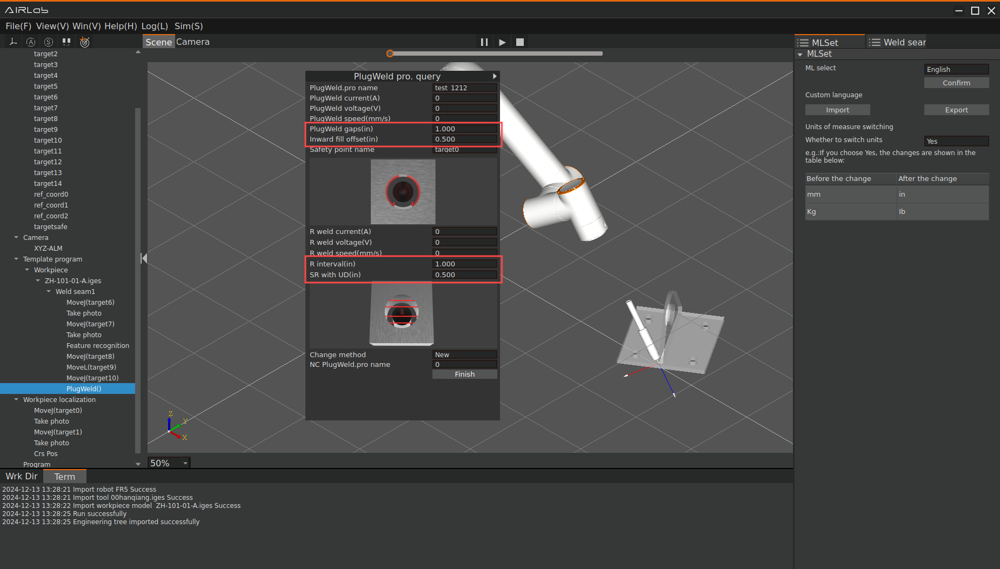

.. centered:: Figure 3-128  Data package import completed

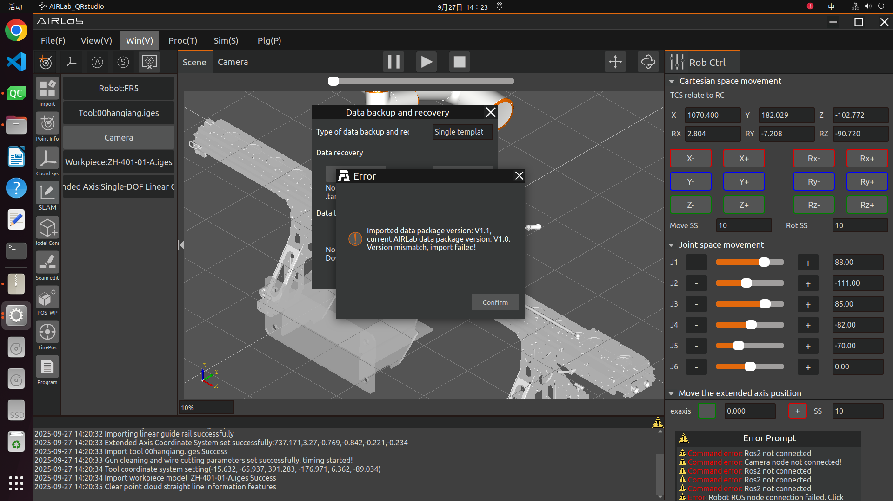

.. centered:: Figure 3-129  The imported data package version is inconsistent with the current AIRLab data package version and cannot be imported

.. important::
    The data package import function will first delete the original files and folders. If you still need to keep the files, please make sure to back them up before importing!

3D File Parsing
~~~~~~~~~~~~~~~~~~~~~~~~~~~~~~~~~~~~~~~
If the user needs to perform welding on a model that has already been built in AIRLab, the software provides the “3D File Parsing” function, which replaces the previous “Model Construction” step and simplifies the workflow. The usage is as follows:

Step 1: Click AIRLab Menu – “Window” – “3D File Parsing”. The 3D File Parsing dialog will appear, as shown below.

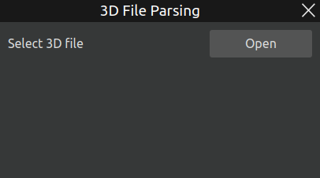

.. centered:: Figure 3-130  “3D File Parsing” dialog

Step 2: Click the “Open” button in the dialog. A file selection window will pop up. Choose the workpiece to be parsed, and then click “Open” again to confirm the selection, as shown below.

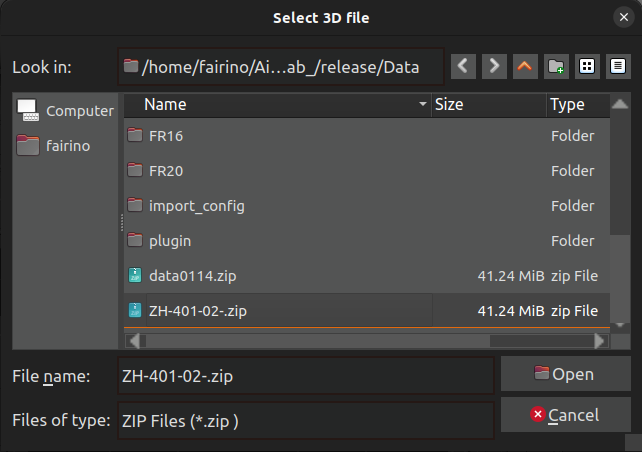

.. centered:: Figure 3-131  3D File selection

Step 3: A parsing progress bar will appear. Please wait patiently until the parsing is completed. The process is shown below.

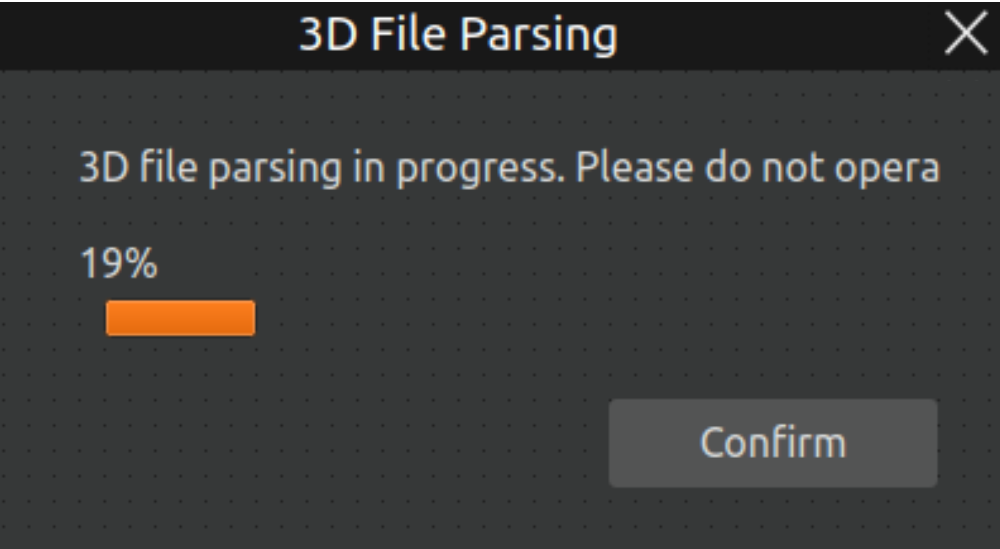

.. centered:: Figure 3-132  “3D File Parsing” progress dialog

Step 4: After the progress is completed, the corresponding 3D model of the workpiece will be constructed in the scene, along with its associated weld seams, as shown below.

.. figure:: analysis/4/3Dfile_prasing_res_display.png
    :align: center
    :width: 6in

.. centered:: Figure 3-133  “3D File Parsing” result display

Step 5: For subsequent operations, please refer to Section 3.5.3 Weld Seam Editing, Section 3.5.4 Workpiece Positioning, and Section 3.5.5 Automatic Photo Pose, to complete the following welding process.

Multi-Station Automatic Operation
~~~~~~~~~~~~~~~~~~~~~~~~~~~~~~~~~~~~~~~
AIRLab provides a Multi-Station Automatic Operation feature for multi-workpiece welding scenarios. If you have already recorded an AIRLab project file for a single workpiece, you can run multiple projects (i.e., multiple workpiece welding jobs) efficiently and automatically by specifying the required external-axis positions for each workpiece.

The following first describes the case where Enable Auto Recognition is set to No:

Step 1: Click AIRLab Menu → “Window” → “Multi-Station Automatic Operation.” The Multi-Station Automatic Operation dialog appears, as shown below.

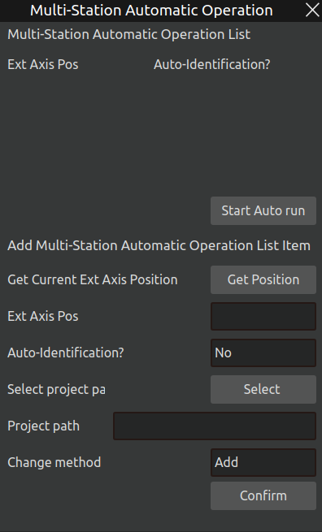

.. centered:: Figure 3-134  “Multi-Station Automatic Operation” dialog

Step 2: Move the external axis to the position required to complete welding for a given workpiece. Click “Get Position” to record the current external-axis position, as shown below.

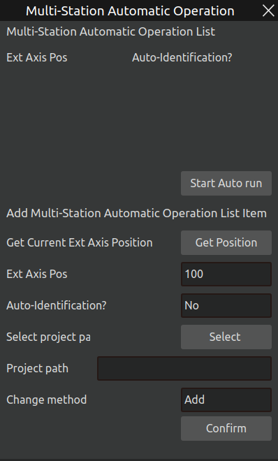

.. centered:: Figure 3-135  External-axis position setting

Step 3: Select the project file corresponding to the welding task you wish to run at this external-axis position. Click “Select” to open the file chooser, then click “Open” to confirm, as shown below.

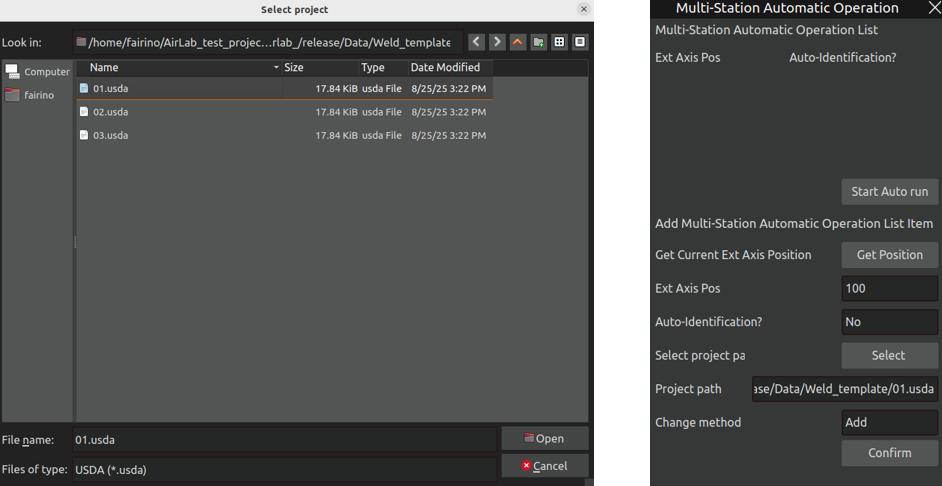

.. centered:: Figure 3-136  Project path selection and result

Step 4: Choose the desired modification mode: Add, Modify, or Delete. After confirming your choice, click “OK” to apply. To modify, select the target entry and click “OK.” Deletion is similar. See below.

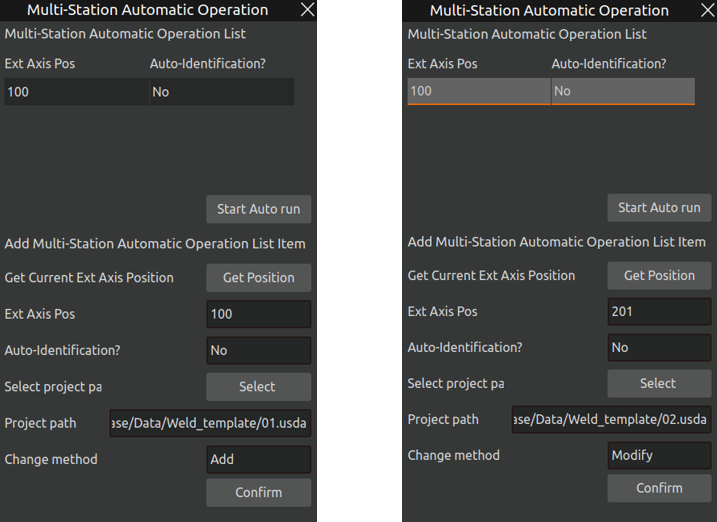

.. centered:: Figure 3-137  Add and Modify

Step 5: After completing all settings, click “Start Auto Run.” The welding job will begin.

Next is the case where Enable Auto Recognition is set to Yes:

Step 1: Similarly, after obtaining the external-axis position, enabling Auto Recognition will change the dialog as shown below. For details on Auto Recognition, refer to Section 3.6.11 Automatic Loop Operation.

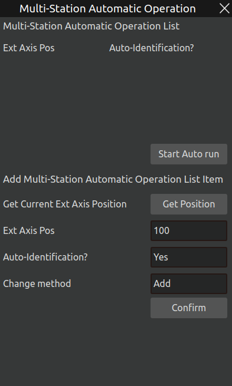

.. centered:: Figure 3-138  Auto Recognition options

Step 2: After choosing the modification mode, click “Confirm.” An Inquiry dialog will appear—please read carefully before proceeding. Click “Confirm” to complete the setup.

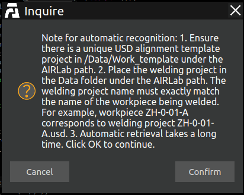

.. centered:: Figure 3-139  Inquiry dialog

Extended axis synchronous motion
~~~~~~~~~~~~~~~~~~~~~~~~~~~~~~~~~~~~~~~
If an external axis is required during robotic welding, AIRLab provides external axis synchronization functionality.

After selecting the external axis in the import module, click confirm to open the external axis setting pop-up window, as shown in the figure below. After selecting the external axis, click confirm to import it. Click "Get" to obtain the current external axis coordinate system, and click "Save" to set the external axis coordinate system.

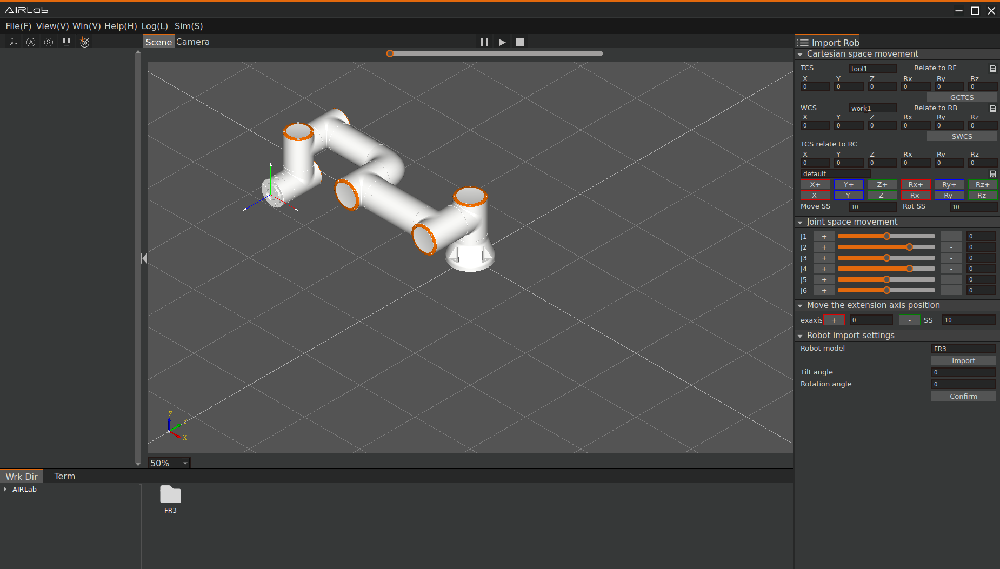

.. centered:: Figure 3-140  Extension axis setting pop-up window

When editing long straight welds that require axis linkage extension, set the external axis positions for the starting and ending points, as shown in the figure below. After weld seam recognition, AIRLab will automatically generate a program based on the weld seam recognition results and the position of the external axis, achieving synchronous motion between the external axis and the robot.

.. centered:: Figure 3-141  When editing long straight welds, it is necessary to set the position parameter of the extension axis

Other controls
~~~~~~~~~~~~~~~~~~~
Click the "Other Controls" button in the operation area to enter the IO setting interface, which mainly includes two modules of IO control and external axis setting.

(1) IO control module

As shown in Figure 3-116, the IO control module enables manual control of the digital outputs, analog outputs (0-10v) in the robot control box and the end tool digital outputs, analog outputs (0-10v) extended IO digital outputs, analog outputs (0-10v):

.. figure:: analysis/4/104.png
    :align: center
    :width: 3in

.. centered:: Figure 3-142  IO Control Module

- DO Setting: Select the port number, click the "On" button to set the corresponding DO high, and click the "Off" button to set the corresponding DO low.
- AO Setting: Select the port number and enter the value (0-100) in the input box on the right, the value is a percentage, setting 100 means setting this AO port to 10v.

(2) Exaxis control

As shown in Figure 3-117, the External Axis Setup module enables control of the robot's external axis.

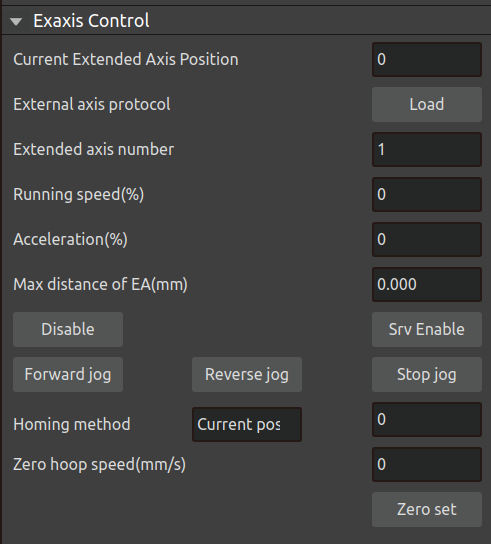

.. centered:: Figure 3-143 exaxis Control

- Select the extended axis numbe: click the "Load" button to load the external axis protocol according to the selected extended axis number. Set the running speed (%), acceleration (%) and the maximum distance of the extended axis (mm).
- Remove Enable: Click on the "Remove Enable" button to remove enable from the external axis.
- Servo Enable: Click the "Servo Enable" button to enable the external axis.
- Forward jog: Click the "Forward jog" button to perform a forward tap of the external axis according to the set running speed, acceleration, and maximum distance of the extended axis.
- Reverse jog: Click the "Reverse jog" button to reverse pivot the external axes according to the set running speed, acceleration, and maximum distance of the extended axes.
- Stop jog: Click the "Stop jog" button to stop the external axis from pivoting.
- Zero Set: Click the "Zero Set" button to zero the external axis according to the zero return method, zero seeking speed and hoop speed.

Simulation
~~~~~~~~~~~~~~
As shown in Figure 3-118, after generating the simulation trajectory of the program, open the operation area - simulation, set the simulation speed and simulation interval, click on the "Run" button to start the simulation of the template program, click on the "Stop" button to stop the template program simulation. Click "Stop" button to stop the template program simulation. At the same time, it will generate the simulation trajectory point table to record the simulation trajectory points. In the table, the type of simulation track endpoints is LINEND, and when you click a line in the table, the virtual simulation robot will move to the clicked simulation track point, and at the same time, it will synchronously display the TCP coordinates of the simulation track point.

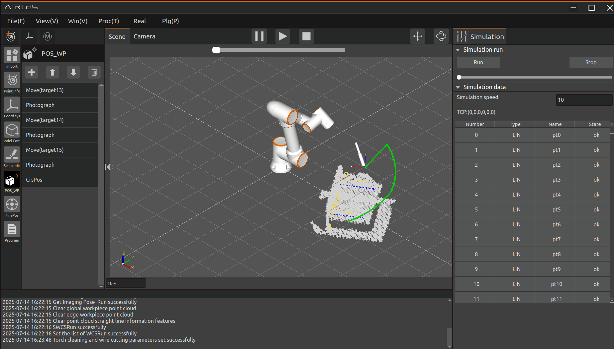

.. centered:: Figure 3-144  Simulation Page

Program configuration
~~~~~~~~~~~~~~~~~~~~~~~~~~~

The program configuration page is used to configure the program before running it, including the program configuration section and the welding interrupt recovery configuration section, as shown in the figure below.  

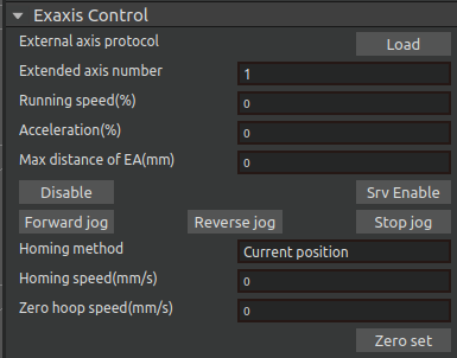

.. centered:: Figure 3-145  Program Configuration Page

The program configuration section includes program running configuration, program recognition configuration,program arc initiation configuration, no model construction settings, welding machine number selection and so on.

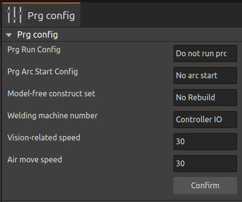

.. centered:: Figure 3-146  Program Configuration

For program operation configuration, you can select either "Do Not Run Program After Recognition" or "Run Program After Recognition": 

- Do Not Run Program After Recognition: The welding program will not run automatically after the fine positioning program is executed. 

- Run Program After Recognition: The welding program will run automatically after the fine positioning program is executed.

The program recognition configuration is divided into rough positioning first followed by fine positioning, with the option to run only fine positioning.  

- Rough Positioning Followed by Fine Positioning: After clicking the one-click run button, AIRLab will automatically execute the workpiece positioning program in the current project first, followed by the fine positioning program.  

- Run Only Fine Positioning: After starting with one-click run, AIRLab will skip the workpiece positioning step and directly execute the fine positioning program.

For arc ignition configuration, you can set it to "Arc Ignition" or "No Arc Ignition": 

- Arc Ignition: If there is an arc ignition command in the program, arc ignition and welding will be performed during program operation. 

- No Arc Ignition: No arc ignition will occur during program operation; the robot will only move along the welding trajectory for simulated welding. 

You can set the simulated welding operation speed multiplier to increase the speed of the simulated welding process.

No model building setup: Currently, there are two methods - rebuilding and not rebuilding.

- Rebuilding: Reconstruct the model of the model free workpiece; Suitable for non model artifacts that have not been built before or have poor construction results and need to be rebuilt.

- Not rebuild: If you choose not to rebuild, the model free artifact model will not be rebuilt and will be directly imported from the previously built model. Applicable to previously built model free artifacts, there is no need to re model the model free artifact.

.. important::
    In practical operation, it is recommended to separately carry out the process of building model free artifacts, and after the artifact is successfully built, operate according to the original average model method. In the absence of a model workpiece model, it is recommended to always select "not rebuild" as the parameter for model free construction settings, as the weld seam numbers obtained from model free construction may change during each construction!

After configuring everything, click the "Confirm" button to complete the program configuration.

Welding interruption recovery configuration refers to clearing the parameters that need to be configured to continue welding when the program is interrupted during the welding process; Including the configuration of parameters for detecting unexpected interruptions in welding arc tracking and weld interruption detection.

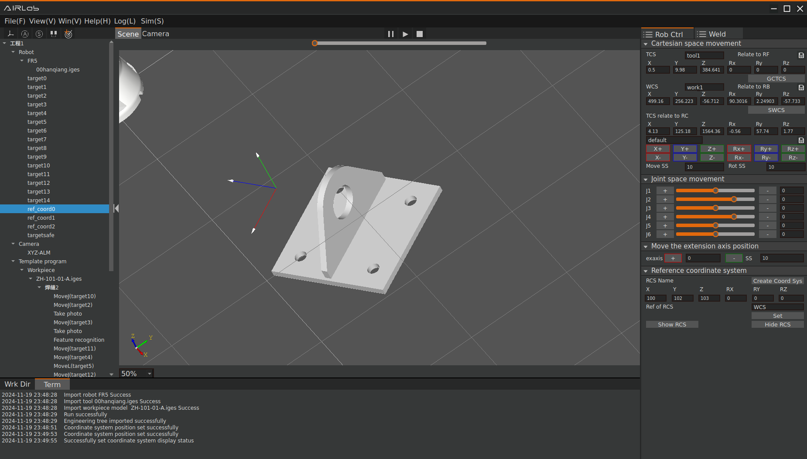

.. centered:: Figure 3-147  Welding interruption recovery configuration

The parameter configuration for detecting unexpected interruptions in welding arc tracking is aimed at configuring parameters for arc interruptions during the welding process, including selecting whether to detect and configuring the duration of arc interruption confirmation.

- Whether to detect: Indicates whether to detect accidental interruption of welding arc tracking.

- Confirmation duration of arc interruption: Define how many milliseconds arc interruption belongs to arc interruption and needs to be restored.

After configuration, click the "Confirm" button to complete the parameter configuration for detecting accidental interruption of welding arc tracking.

The configuration of welding interruption detection parameters is the parameters required to restore the interrupted robot motion after the program interruption during the welding process, including selecting whether to restore the welding interruption, configuring the overlap distance of the weld seam, configuring the speed of the robot returning to the arc starting point, and configuring the robot motion.

- Whether to restore welding interruption: Select restore. After the welding interruption, a pop-up window will pop up indicating the welding interruption. Clear the error before restoring the interruption, otherwise the interruption will not be restored.

- Overlap distance of weld seam: the overlap distance between the interrupted position and the previous interrupted position after resuming welding.

- Robot returning to arc starting point speed: The speed at which the robot returns to the set arc starting point after the interruption is restored.

- Robot movement to arc starting point mode: After restoring the interrupt, the robot returns to the set arc starting point mode, which can be selected as LIN or PTP mode.

After configuration, click the "Confirm" button to complete the configuration of welding interruption detection parameters.

After the welding interruption recovery configuration is fully configured, run the program. When a welding interruption signal is detected, the following pop-up window will pop up.

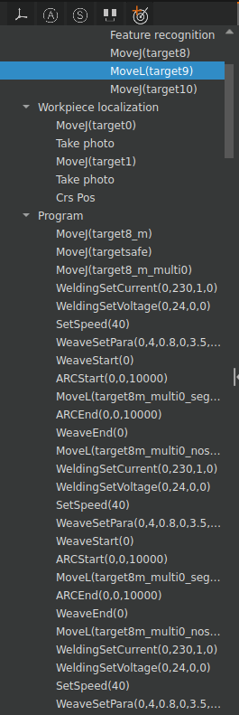

.. centered:: Figure 3-148  Welding interruption pop-up window

After checking the environment and troubleshooting, clicking the "Resume Welding" button will restore the interrupt according to the configured parameters.

Multilingual settings
~~~~~~~~~~~~~~~~~~~~~~~~~
AIRLab software currently provides seven language options: Chinese (Simplified), Chinese (Traditional), English, Japanese, Korean, Russian, and French. The detailed multilingual settings page is shown in the figure below. This page provides three operations: switching languages; Export existing languages in AIRLab software; Import a new language. In order to meet the needs of users to switch between multiple languages, set new languages for AIRLab software, and modify existing language content in AIRLab software.

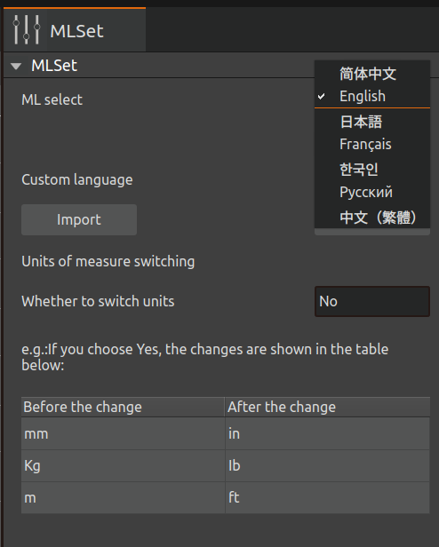

.. centered:: Figure 3-149  "Multilingual Settings" Sub interface

The detailed operation introduction of the above functions is as follows:

(1)Switch the language of AIRLab

Click on the dropdown menu of "Multilingual" in Figure 3-124, select the desired language type, and click the "Confirm" button to immediately switch the AIRLab software language.

(2)User sets new language for AIRLab

Firstly, click the "Export" button to export the language file currently used by AIRLab in CSV format. The exported file path is located in the local Downloads folder, as shown in the figure below. 

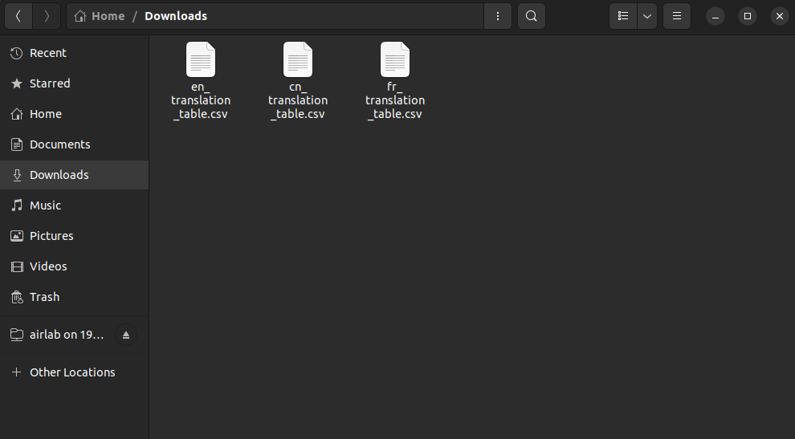

.. centered:: Figure 3-150  AIRLab Language File Export Path

The content format of the CSV file is shown in the figure below(if opened with a text editor), including four columns: language_id, location, source_text, translation_text. “language_id” represents the language type, “location” represents the position of the text in the source code, 'source_text' represents the text (Chinese) in the source code, and 'translation_text' represents the translation value corresponding to the source text.

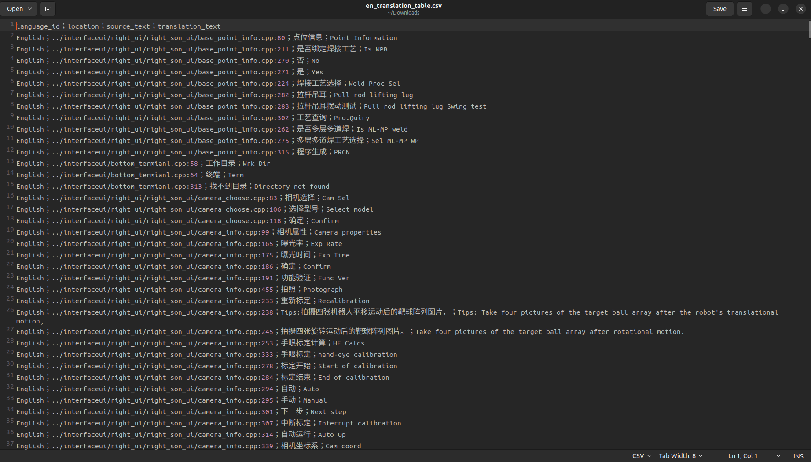

.. centered:: Figure 3-151   Content and format of AIRLab language CSV file

If you use LibreOfffice software to open it, as shown in Figure 3-126, please note that the opening format is shown in Figure 3-126.

.. figure:: analysis/4/114.png
    :align: center
    :width: 3in

.. centered:: Figure 3-152   LibreOffice software

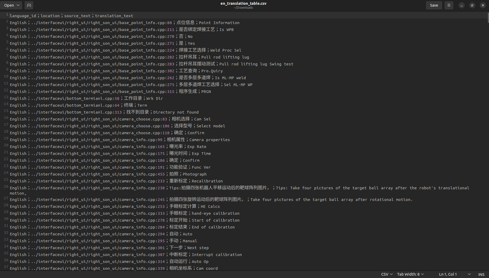

.. centered:: Figure 3-153   Opening format of AIRLab multilingual files

Next is to write a CSV file for the user. When setting a new language, the user only needs to modify the contents of the first column language_id and the fourth column translation_text. Assuming the user has added French, replace all "English" in the first column of Figure 3-128 with "Français"; The content of the fourth column translation_text needs to be translated by the user based on the Chinese text of "source_text" to obtain the corresponding target language (for the same string appearing in the source text, please translate it into the same word).

.. important::
    Please do not modify any characters under the "source_text" column!

After completing the translation work, the user needs to rename the CSV file to a file name that is the table name of the language data table in the AIRLab language database. For example, the file name "en_translations table" in Figure 3-129 is the table name of the language type "English" in the database.

.. important::
    It is recommended to preserve the language characteristics of the user CSV file naming to avoid duplication with the names of existing language data tables in the database, which may result in errors where the contents of other language data tables are replaced.

Finally, import the CSV file into the AIRLab software, copy the file to the execution directory of the AIRLab software, click the "Import" button, and select the file to import, as shown in Figure 3-129. The AIRLab terminal displays “CSV file import successful”, indicating that the user's language file has been successfully imported, as shown in Figure 3-128. After restarting AIRLab, select the user's newly added language switch from the drop-down menu in "Language Selection".

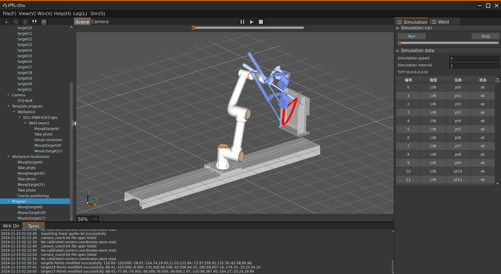

.. centered:: Figure 3-154  Pop up window of the "Import" button

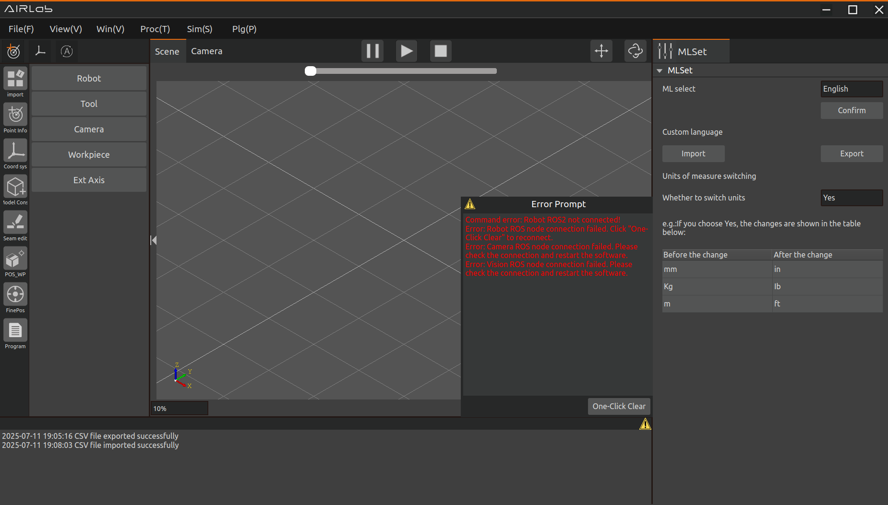

.. centered:: Figure 3-155  Terminal display information when language file import is successful

If the terminal displays "CSV file import failed", you can check the error message in the log record, and carefully check whether the imported CSV file is inconsistent with the originally exported CSV file in terms of the number of rows, columns, and the Chinese delimiter "；" between columns.

.. important::
    When modifying the content of "translation_text", it is necessary to refer to the field length of the Chinese text of "source_text". If the translation value is too long, please use abbreviations appropriately, otherwise the corresponding control text in the AIRLab interface may not be displayed completely.

(3) User modifies existing language in AIRLab

If the user needs to modify an existing language in AIRLab, they first need to click the "Export" button to export the CSV file of that language; After the modification is completed, copy the file to the execution directory of AIRLab software, click the "Import" button, select the modified file to import, and the terminal displays "CSV import successful". After restarting the software, the language modification is completed.

Considering the different usage habits of AIRLab English users, AIRLab-V1.0.2 version has designed the unit of measurement switching as a configuration item for users to choose whether to switch millimeters to inches, as shown in Figure 3-130.

.. figure:: analysis/4/118.png
    :align: center
    :width: 6in

.. centered:: Figure 3-156   UI interface for switching measurement units

After the user selects the measurement unit to switch, the input box labeled in millimeters on the AIRLab interface will be converted to inches, as shown in Figure 3-131 and Figure 3-131.

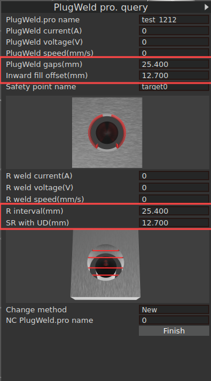

.. centered:: Figure 3-157   Before switching units of measurement

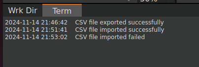

.. centered:: Figure 3-158  After switching units of measurement

Error prompt pop-up window
~~~~~~~~~~~~~~~~~~~~~~~~~~~~~~~~
During the operation of AIRLab software, some errors may occur, and an error prompt pop-up window will appear on the interface as shown in the figure.

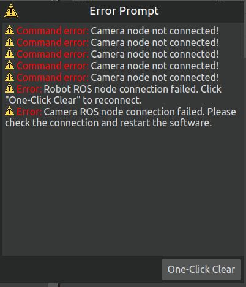

.. centered:: Figure 3-159  Error prompt

After fixing the error based on its type, click the "one-click clear" button, the pop-up window will disappear, and then continue running. 

.. figure:: analysis/4/122.png
    :align: center
    :width: 6in

.. centered:: Figure 3-160   Clean the error prompt

Extended Axis Coordinate System Calibration
~~~~~~~~~~~~~~~~~~~~~~~~~~~~~~~~~~~~~~~~~~~~~~~
AIRLab provides a calibration function for the Extended Axis Coordinate System. After normally importing the robot, tools, and external axes, click "Import Module" - "External Axes" on the main interface,open the extended axis settings interface (see Section 3.5.1). Then, select the extended axis coordinate system to calibrate and click “Modify” to enter the Extended Axis Coordinate System Calibration interface, as shown below.

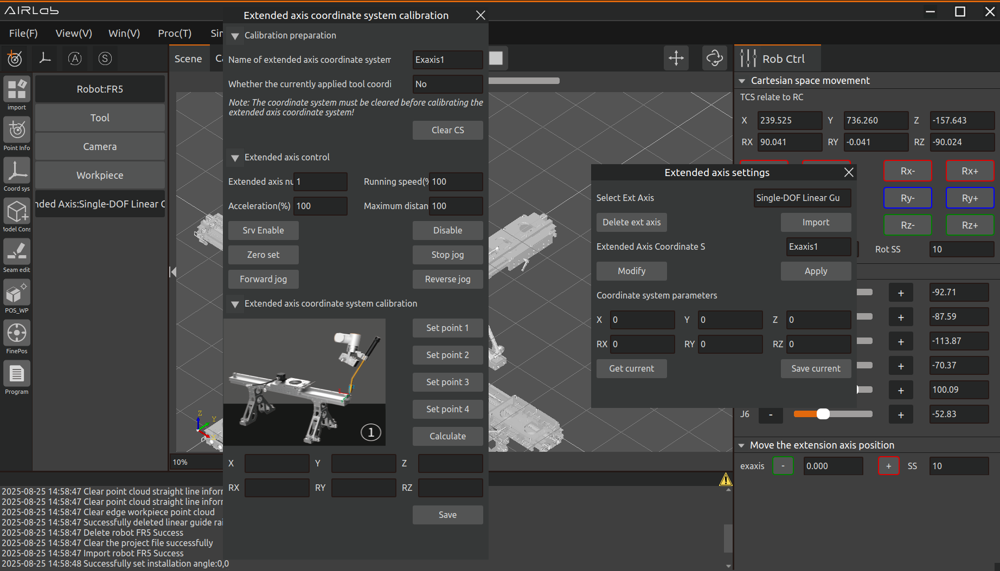

.. centered:: Figure 3-161   Extended Axis Coordinate System Calibration interface

.. important::
    Exaxis0 cannot be calibrated. If you select Exaxis0, an error dialog will appear as shown below.

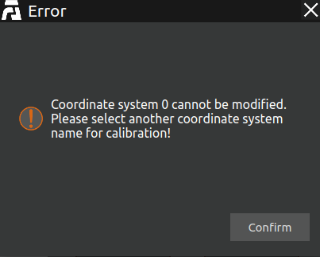

.. centered:: Figure 3-162   Exaxis0 calibration error dialog

A AIRLab provides a calibration method specifically for extended axes of the type “Single Degree-of-Freedom Linear Rail.” The detailed procedure is as follows:

Step 1: First, open the "Extended Axis Coordinate System Calibration" interface mentioned earlier. Click the "Clear Coordinate System" button, and confirm the "Whether the currently applied tool coordinate system has been calibrated" option. The prerequisite for calibrating the external axis is that the tool coordinate system used in the current application has been correctly calibrated. After confirmation, an "Inquiry" pop-up window will appear. Once confirmed, the calibration setup will officially begin.

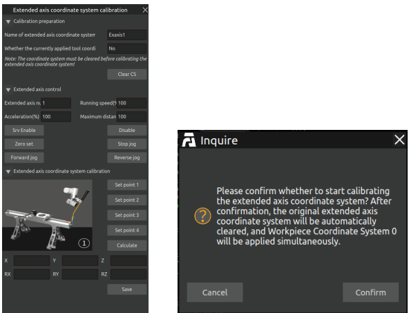

.. centered:: Figure 3-163   Calibration interface (left) and Inquiry dialog (right)

Step 2: Click the "Servo Enable" button to activate the extended axis. If successful, the button will turn green; otherwise, it will turn red and an error pop-up will be displayed. If the enable operation is successful, move to an appropriate position and click the "Zero Point Setting" button to complete the initial setup. The process is illustrated in the figure below.

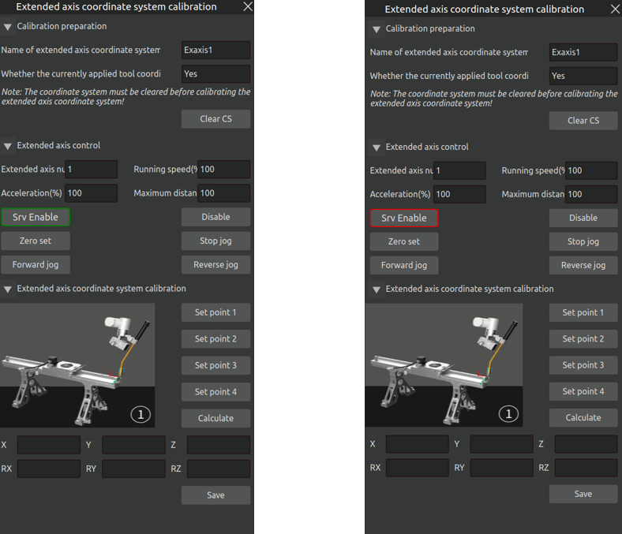

.. centered:: Figure 3-164   Servo enable and zero point setting

Step 3: Keep the extended axis stationary and adjust the posture of the robotic arm's end effector so that the end tool is aligned with a fixed point on the extended axis. Click "Set Point 1." Once the button changes to "Modify Point 1," the setting is complete. If you need to modify this point, repeat the above steps. Similarly, after adjusting the tool posture (with an angle of approximately 30°), complete the "Set Point 2" process. The entire procedure is illustrated in the figure below.

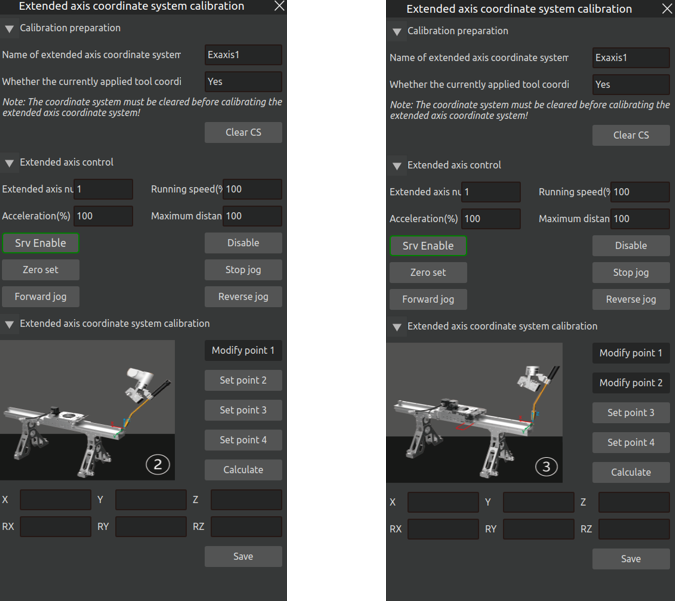

.. centered:: Figure 3-165   Setting Point 1 and Point 2

Step 4: Click "Forward Jog" to move the extended axis by a distance of 200 mm. Once again, align the end tool with the previous fixed reference point, then click "Set Point 3." After the button changes to "Modify Point 3," the setting is complete. If modification of this point is needed, repeat the above steps. The process is illustrated in the figure below.

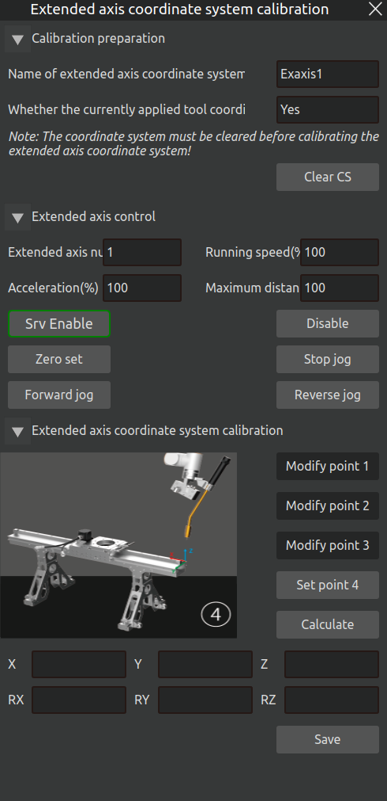

.. centered:: Figure 3-166   Setting Point 3

Step 5: Click "Reverse Jog" to move the extended axis backward by 205 mm, then move it forward by 5 mm. Once again, align the end tool with the previous fixed reference point. Next, jog along the base coordinate system to move the end upward by 100 mm, then click "Set Point 4." After the button changes to "Modify Point 4," the setting is complete. If modification of this point is needed, repeat the above steps. The process is illustrated in the figure below.

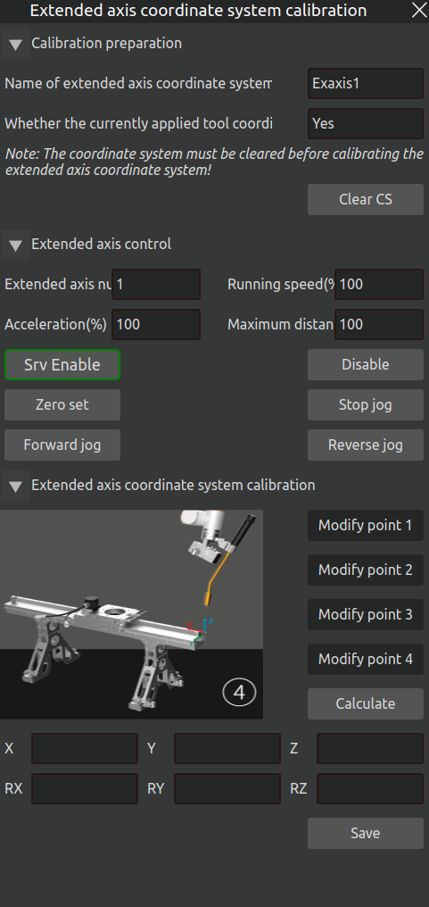

.. centered:: Figure 3-167   Setting Point 4

Step 6: After completing the above steps, click “Calculate” to compute the tool pose. The results will be displayed as shown below.

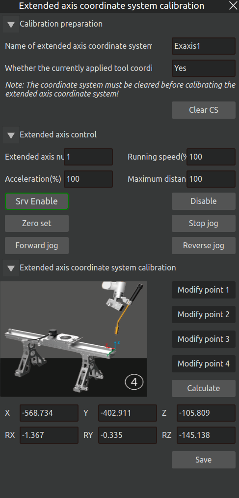

.. centered:: Figure 3-168   Extended Axis Coordinate System Calculation Result

Step 7: Once the calculation results are verified, click “Save.” The results will be stored in the local path:
~/AIRLabExe/Data/import_config/Cleargun_cutwire_settings.config
under [Exaxis_coord_value_list]. In this example, Exaxis1 was calibrated, so the result is saved as <1 = “calibration result”>. At the same time, the Extended Axis Settings will display Exaxis1 as successfully calibrated.

If the calibrated external axis coordinate system is correct (with RX, RY, and RZ values close to 0), click the "Apply" button to send the calibrated external axis coordinate system to the robot controller for application.

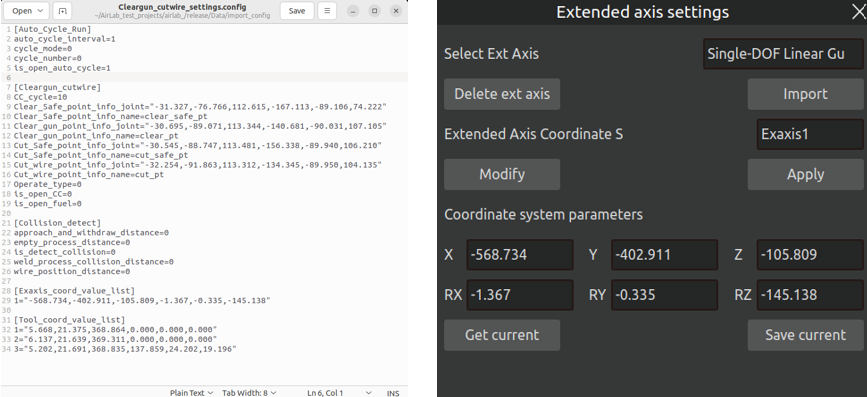

.. centered:: Figure 3-169   Saving Extended Axis Coordinate System Calibration Result

If the selected extended axis coordinate system already exists (i.e., calibration data is already stored in the above path), an Inquiry dialog will appear asking whether to overwrite the previous result. Clicking “Confirm” will overwrite the existing calibration.

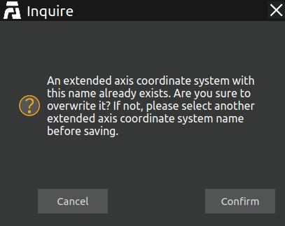

.. centered:: Figure 3-170   Extended Axis Coordinate System Inquiry Dialog
