AIRLab Software Analysis
============================
.. toctree:: 
    :maxdepth: 5

The initial interface of the AIRLab software is shown in Figure 4-1 and is divided into five main sections. In the middle of the interface is the main display box (divided into scene display and camera display), on the top is the menu bar, on the leftmost side is the project tree, on the rightmost side is the operation area, and at the bottom of the interface is the command feedback area. This section provides a detailed description of the functions and usage of the above areas, the pop-up windows and other pages that appear in the AIRLab software, and the sub-page functions.

.. figure:: analysis/4/1.png
	:align: center
	:width: 7.5in

.. centered:: Figure 4-1  AIRLab Software Initial Interface

Menu Bar
--------------------------
The menu bar contains all the contents shown in Figure 4-2, mainly buttons: "File", "View", "Window", "Help ", "Log", "Sim", and the icon buttons (in order from left to right): 3D Sphere, Mode Switching, Running Status, Ros2 Communication, Points Added, Pause Running, Start Running, Stop Running.

.. figure:: analysis/4/2.png
	:align: center
	:width: 6in

.. centered:: Figure 4-2  AIRLab Menu Bar

File
~~~~~~~~~~~~~~~~~~~
Click the "File" button, the "File Settings" pop-up window will appear, as shown in Figure 4-3. This pop-up window contains three functions: create, open or export a welding JSON file, the use of the following methods (for details, refer to the section on pop-up window analysis): 

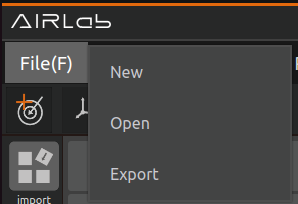

.. centered:: Figure 4-3  AIRLab Menu Bar-File Settings Popup Window

- New Project: If the user needs to create a new welding project, select the file type as "Welding", and then click "New" to create and open a new welding program, as shown in Figure 4-4;

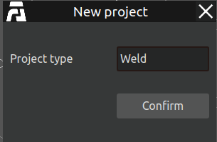

.. centered:: Figure 4-4  AIRLab Menu Bar-File Settings-New 

- Import project: If the user needs to open the existing welding file, click "Open", and then enter the work path to find the file to be imported, click "Open" to select a file to import, as shown in Figure 4-5;

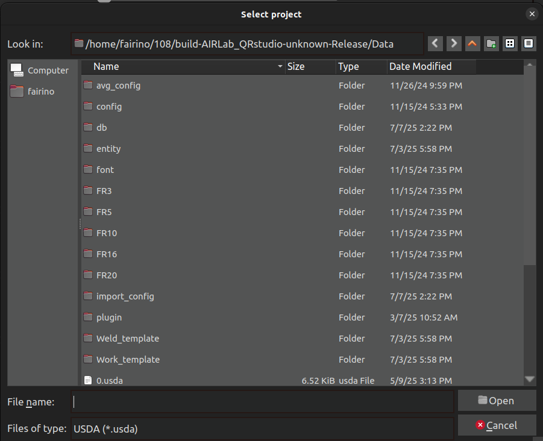

.. centered:: Figure 4-5  AIRLab Menu Bar - File Settings - Open

- Export project: If users need to save the welding file currently being used, click "Export", select the export path, set the export file name, click "Save", the current welding project will be saved, as shown in Figure 4-6.

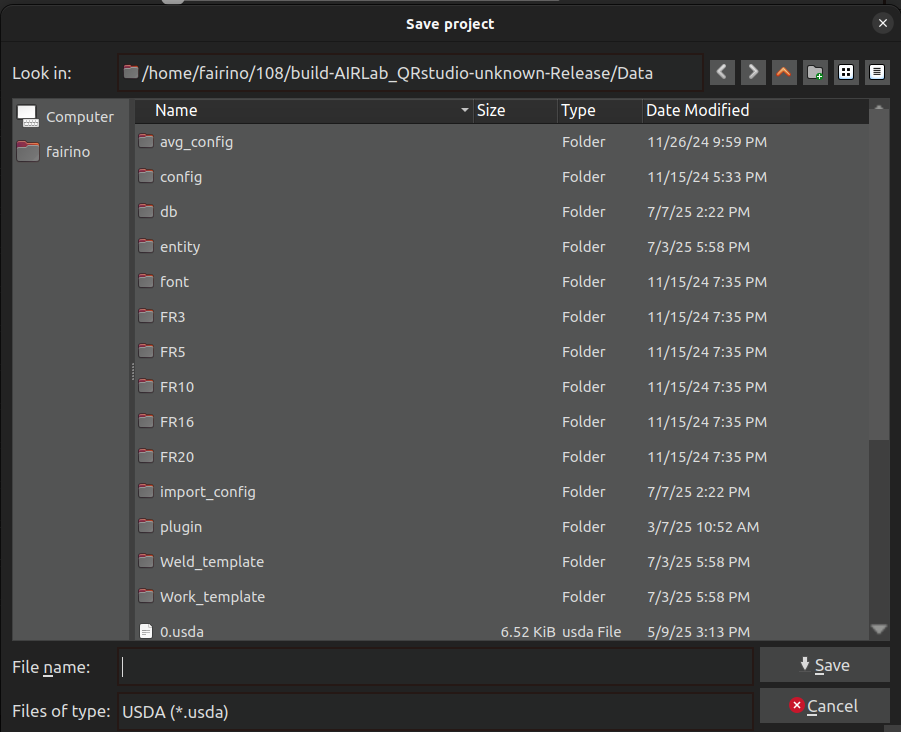

.. centered:: Figure 4-6  AIRLab Menu Bar-File Settings-Export

View
~~~~~~~~~~~~~~~~~~~
View contains 12 functions, as shown in Figure 4-7, the main function is to adjust the viewing angle of the robot in the main display frame. They are: Zoom, Pan, Rotate, Reset, Fit all, Front view, Back view, Top view, Bottom view, Left view, Right view, and Full view.

.. figure:: analysis/4/7.png
	:align: center
	:width: 2.5in

.. centered:: Figure 4-7  AIRLab Menu Bar - View

See Table 4-1 for a description of the specific functions of the view.

.. centered:: Table 4-1  View Function Description Table

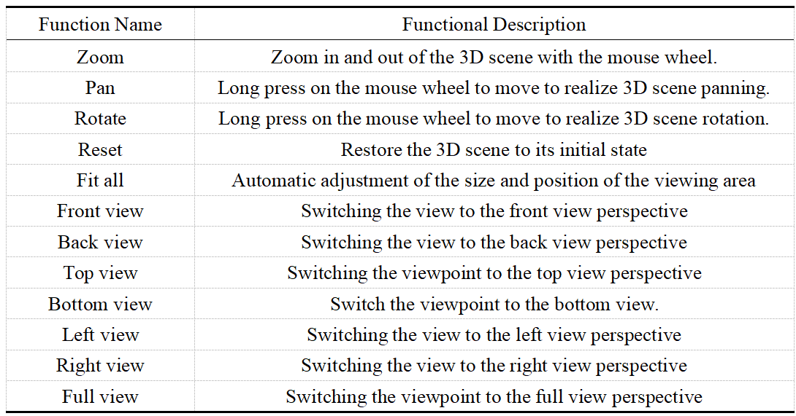

Window
~~~~~~~~~~~~~~~~~~~
"Window" contains 7 secondary options, namely "Robot Control", "Other Control", "Simulation", "Debug Page", "Program Configuration", "Multi-language Settings", and "Software Upgrade". When you click on different options, the corresponding function pages will be displayed in the operation area on the right side of the AIRLab software, as shown in Figure 4-8, of which the "Robot Control" page is shown in Figure 4-9, the "Other Control" page is shown in Figure 4-10, and the "Simulation" page is shown in Figure 4-10. The "Simulation" page is shown in Figure 3-11, the "Debugging" page is shown inFigure 4-12, and the "Program Configuration" page is shown in Figure 4-13.The “Multi-language Settings” page is shown as Figure 4-14.

.. figure:: analysis/4/8.png
	:align: center
	:width: 2.5in

.. centered:: Figure 4-8   AIRLab Menu Bar-Window

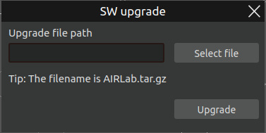

.. centered:: Figure 4-9  AIRLab Menu Bar-Window-Robot Controls    

.. figure:: analysis/4/10.png
	:align: center
	:width: 3in

.. centered:: Figure 4-10  AIRLab Menu Bar-Window-Other Controls

.. figure:: analysis/4/11.png
	:align: center
	:width: 3in

.. centered:: Figure 4-11  AIRLab Menu Bar-Window-Simulation

.. figure:: analysis/4/12.png
	:align: center
	:width: 3in

.. centered:: Figure 4-12  AIRLab Menu Bar-Window-Debug Page

.. figure:: analysis/4/13.png
	:align: center
	:width: 3in

.. centered:: Figure 4-13  AIRLab Menu Bar-Window-Program Configuration

.. figure:: analysis/4/14.png
	:align: center
	:width: 3in

.. centered:: Figure 4-14  AIRLab Menu Bar-Multi-language Settings

Help
~~~~~~~~~~~~~~~~~~~
At present, only the "About" button is open under the Help menu.Click this button to query the version information and release date of the current AIRLab software, middle layer and vision. as shown in Figure 4-15.

.. figure:: analysis/4/15.png
	:align: center
	:width: 3in

.. centered:: Figure 4-15  AIRLab version information and release date display

Log
~~~~~~~~~~~~~~~~~~~
Logs are used to record information about the system's operation and exceptions, and can be used to quickly locate problems. Clicking this button will bring up a "Log Level" pop-up window. Logging is divided into four levels, namely INFO, WARNING, ERROR, DEBUG, select the log level and set the current log level (default INFO). As shown in Figure 4-16, see Table 4-2 for the specific meaning.

.. figure:: analysis/4/16.png
	:align: center
	:width: 2.5in

.. centered:: Figure 4-16  AIRLab Menu Bar-Logs

.. centered:: Table 4-2 View Function Description Table

.. image:: analysis/4/表4-2.png
	:align: center
	:width: 6in

Virtual
~~~~~~~~~~~~~~~~~~~
This button is used to switch between the virtual robot and the physical robot, before using it, you need to successfully import or create a JSON file (otherwise, the error message in Figure 4-17 will appear), and with the physical robot to successfully establish Ros2 communication connection. After completing the above prerequisites click on the button to achieve the virtual robot and the entity robot switch between the two, after switching between the real machine as shown in Figure 4-18.

virtual scene: used for simulation will not be synchronized in real time to update the robot position in the three-dimensional scene; entity scene: update the current tool coordinate system, the DH compensation parameters consistent with the actual robot, the robot position in the three-dimensional scene is the same as the entity robot.

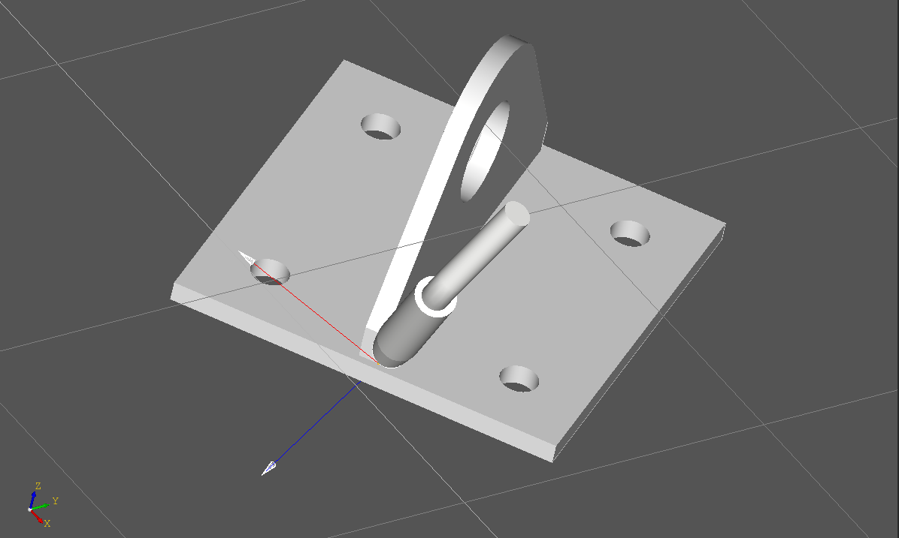

.. centered:: Figure 4-17  JSON file not imported during virtual switchover

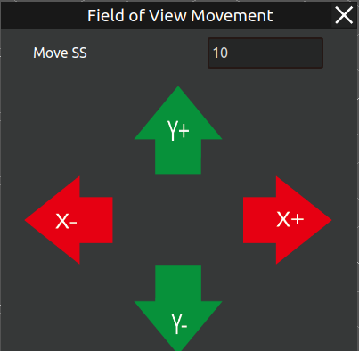

.. centered:: Figure 4-18  AIRLab display after live switching

Plug-in
~~~~~~~~~~~~~~~~~~~
In order to enhance the scalability and user experience of AIRLab software, AIRLab provides plug-in modules, allowing users to develop plug-ins that meet their needs. These plug-ins can be loaded into AIRLab software through dynamic libraries (.so), thereby expanding and enhancing the software functions. The existing plug-ins include three functional modules: binpick, spraying, and conversational intelligent assistant. For the introduction and specific operations of each plug-in, please refer to the plug-in section in Chapter 5.

3D Sphere
~~~~~~~~~~~~~~~~~~~
Not open at this time.

Mode switching
~~~~~~~~~~~~~~~~~~~
After the AIRLab software establishes Ros2 communication with the physical robot, the user can switch the mode status of the physical robot by clicking on this button. a means that the current robot is in automatic mode, and M means that the current robot is in manual mode. In addition, clicking this icon in automatic mode will switch the robot mode to manual, and clicking this icon in manual mode will switch the robot mode to automatic.

Running status
~~~~~~~~~~~~~~~~~~~
The icon button is used to display in real time the current operational status of the physical robot, where S indicates that the robot has stopped running, R indicates that the robot is in the middle of a running program, and P indicates that the robot is in a suspended operational state.

ROS2 communication
~~~~~~~~~~~~~~~~~~~
The icon button is used to monitor the connection status of the camera and Ros2 in real time, when the communication between the camera and Ros2 are connected successfully or Ros2 is connected successfully and the camera is not connected, the icon will show the connection success, as in the figure left; otherwise the icon shows the connection failure, as in figure right.

.. figure:: analysis/4/19.png
	:align: center
	:width: 2in

.. centered:: Figure 4-19  ROS2 Communication Connection Status

Points added
~~~~~~~~~~~~~~~~~~~
This function is used to quickly record the current point position of the robot. After clicking the button, a new point position targetX will be added under the "Robot" node in the project tree, and the function of X is to prevent the new point position from being renamed, as shown in Figure 4-20. The j1, j2, j3, j4, j5, j6, x, y, z, rx, ry, rz information of this point is the current joint coordinates and Cartesian coordinates of the robot.

.. figure:: analysis/4/20.png
	:align: center
	:width: 2.5in

.. centered:: Figure 4-20  AIRLab Menu Bar - Point Additions

Pause running
~~~~~~~~~~~~~~~~~~~
Pause/Resume button. Clicking this button will immediately pause the currently running robot program, and pressing it again will resume the robot, continuing the program from where it was paused.

Start running
~~~~~~~~~~~~~~~~~~~
Click the button, the solid robot will first run all the commands under the "Workpiece Positioning" node in the engineering tree, after the successful positioning of the workpiece, the robot starts to run all the weld programs under the "Template Program" node, as in Figure 4-21, after the successful identification of the weld, the robot executes all the weld commands under the "Program" node. After successful identification of the weld, the robot executes all the welding instructions under the "Program" node.

.. figure:: analysis/4/21.png
	:align: center
	:width: 2.5in

.. centered:: Figure 4-21  Start Run Button Function

Stop running
~~~~~~~~~~~~~~~~~~~
Clicking on the button immediately stops the robot that is running the program. The difference between this button and the pause/resume button is that the robot cannot be resumed by pressing this button again, but can only be restarted with the start running button.

Main Frame
--------------------------
The main display box is divided into scene display and camera display, where the scene mainly displays the robot, tool, workpiece, extended axis model, etc., as in Figure 4-22. the camera mainly displays the obtained point cloud map, as in Figure 4-23.

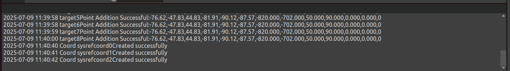

.. centered:: Figure 4-22  AIRLab Main Display Box - Scene Display

.. figure:: analysis/4/23.png
    :align: center
    :width: 7.5in

.. centered:: Figure 4-23  AIRLab Main Display Frame-Camera Display

Command Feedback Area
--------------------------
Instruction Feedback Area. It is divided into two options, the working directory and the terminal, where the working directory displays the current robot model, tools, and workpiece model, as in Figure 4-24, and the terminal displays the results of the execution of program commands and the returned robot error messages, as in Figure 4-25.

.. figure:: analysis/4/24.png
    :align: center
    :width: 4in

.. centered:: Figure 4-24  AIRLab Command Feedback Area-Working Directory

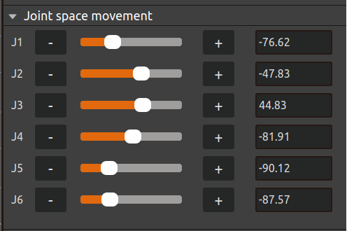

.. centered:: Figure 4-25  AIRLab Command Feedback Area-Terminal

Operating Area
--------------------------

Cartesian space movement
~~~~~~~~~~~~~~~~~~~~~~~~~~~
This area includes four parts: tool coordinate system, workpiece coordinate system, tool coordinate system relative to the reference coordinate system, and long press tap trigger, move step and rotate step settings, as shown in Figure 4-26.

.. figure:: analysis/4/26.png
    :align: center
    :width: 3in

.. centered:: Figure 4-26  AIRLab Operation Area-Cartesian Space Movements

- Tool Coordinate System section. There are 15 numbers tool0-tool14 in the drop-down list of tool coordinate system, after selecting the corresponding coordinate system (the name of the coordinate system can be customized), the corresponding coordinate values will be displayed in the text boxes of X, Y, Z, Rx, Ry, Rz below, and the tool coordinate system of the virtual robot will be changed accordingly in the scene display box by changing the values of the above six text boxes. Click the "Get current tool coordinate system" button to get the current tool coordinate system of the robot.

- In the Workpiece Coordinate System section, the drop-down list for the workpiece coordinate system also has 15 numbers work0-work14, and setting the values in the textboxes X, Y, Z, Rx, Ry, and Rz changes the position of the workpiece in the AIRLab software scene display box. By clicking on the "Set Work Coordinate System" button, the robot will send the tool coordinate system from the 3D scene to the actual robot and apply it.

.. important::
    When setting the tool/workpiece coordinate system number, it should be the same as the current tool coordinate system number and workpiece coordinate system number of the robot on the Web side.

- The Tool Coordinate System Relative to Reference Coordinate System section, which shows the value of the tool coordinate system relative to the reference coordinate system.

- Long press tap trigger, move step and rotate step setting section. As shown in Figure 4-27, if the currently imported robot model is a solid robot, long press the X+ button, the solid robot will execute the X+ tap command; if the currently imported robot model is not a solid robot, long press the X+ button, the simulation robot will execute the X+ tap command.

.. important::
    To control the robot's JOG pointing by long-pressing the buttons, if the buttons are released while the robot is running, the robot will stop moving immediately; if the buttons are held down all the way and not released, the robot will run the value of the set rotation step and then stop moving. the X-, Y+, Y-, Z+, Z- buttons operate in the same way. If the Rx+, Rx-, Ry+, Ry-, Rz+, Rz- buttons are pressed and held down, the robot will otherwise remain unchanged, except that it will move according to the set value of the rotation step.

.. figure:: analysis/4/27.png
    :align: center
    :width: 4in

.. centered:: Figure 4-27  AIRLab Operation Area-Long Press Tap

Joint space space movement
~~~~~~~~~~~~~~~~~~~~~~~~~~~~~
This area includes 12 joint coordinate long press trigger buttons for joints J4-J6, 6 joint coordinate change text boxes and 6 joint sliders in three parts, as shown in Figure 4-28.

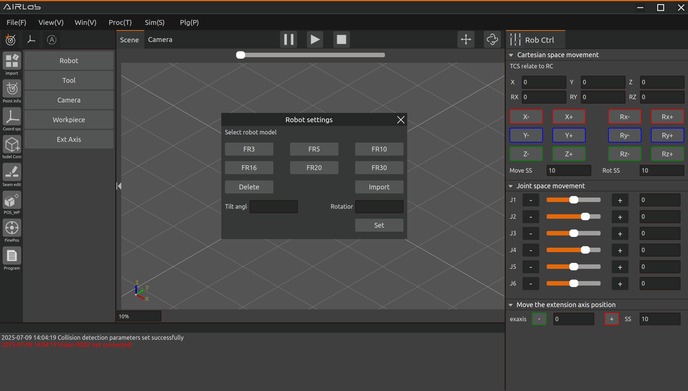

.. centered:: Figure 4-28  AIRLab Operation Area-Joint Space Spatial Movement

- You can control the movement of the solid robot J1 joints in manual mode and joint coordinate system by long-pressing the "+" or "-" button of J1. " button to control the movement of the J1 joints of the solid robot in manual mode and in the joint coordinate system. The "+" or "-" buttons of the other joints operate in the same way.

.. important::
    The robot operation is controlled by long-pressing the button. If the button is released while the robot is running, the robot will stop moving immediately; if the button is held down all the time, the robot will run the set value of Move Step/Rotate Step and then stop moving.

- The 6 text boxes are updated in real time to show the angle values of the 6 joints of the robot. In addition, editing the values in the 6 textboxes can also be used to control the movement of the robot's joints (care should be taken not to exceed the soft limits of the robot's joint angles when editing).

- The function of the joint slots is that the user can slide the joint slots to realize the movement of each joint of the robot, and the joint angles represented by the slots are displayed by the values in the text box.

Moving extended axis settings
~~~~~~~~~~~~~~~~~~~~~~~~~~~~~~~
This section includes "exaxis+", "exaxis-" and the step setting box, as shown in Figure 4-29. "exaxis+", "exaxis-" functions are similar to the pointing X+ and X- under the tool coordinate system, and the motion of the extended axis can be controlled by the above two buttons. Long press the button to control the extended axis running, if you release the button during the extended axis running, the extended axis will stop moving immediately; if you keep pressing the button and do not release it, the extended axis will run the value set in the Step Setting box and then stop moving.

.. figure:: analysis/4/29.png
    :align: center
    :width: 4in

.. centered:: Figure 4-29  AIRLab Operation Area-Moving the Extended Axis Position

Engineering Tree
--------------------------
The project tree generally consists of 6 objects, namely: robot, camera, No-model workpiece program, template program, workpiece positioning, and program. The following describes the functions and usage of the project tree from the perspective of creating a new weld file.

New JSON file
~~~~~~~~~~~~~~~~~~~
Click on "File" in the menu bar, select New in the "File Settings" pop-up window, and a template project will appear in the project tree. Including robot, camera, template program, workpiece positioning, program 5 node objects, which node "robot" under the robot FR5, node "camera" under the camera "XYZ-ALM ", as shown in Figure 4-30.

.. figure:: analysis/4/30.png
    :align: center
    :width: 7.5in

.. centered:: Figure 4-30  AIRLab Project Tree - New

Importing robot models
~~~~~~~~~~~~~~~~~~~~~~~~~
Double-click on the "Robot" node in the project tree, and the "Robot Import Settings" sub-page will be switched to the right side of the AIRLab software. Select the desired robot model (e.g. FR3) in the Robot Model ComboBox and click the "Import" button, as shown in Figure 4-31. The imported FR3 node will appear under the "Robot" node in the project tree, the command feedback area will return the result of "Imported robot FR3 successfully", and the FR3 robot model will appear in the scene display box.

.. figure:: analysis/4/31.png
    :align: center
    :width: 7.5in

.. centered:: Figure 4-31  AIRLab Project Tree - Importing Robots

.. important::
    If you need to replace the robot model, first of all, you need to delete the imported robot model FR5 in the project tree, the specific operation is as follows: select the FR5 node with the mouse and then right-click on it, the option "Remove Item" appears, click on the option, the FR5 will be deleted successfully, and the feedback area at the bottom of the command will return to The bottom command feedback area returns "Delete robot FR5 successfully", as in Figure 4-32.

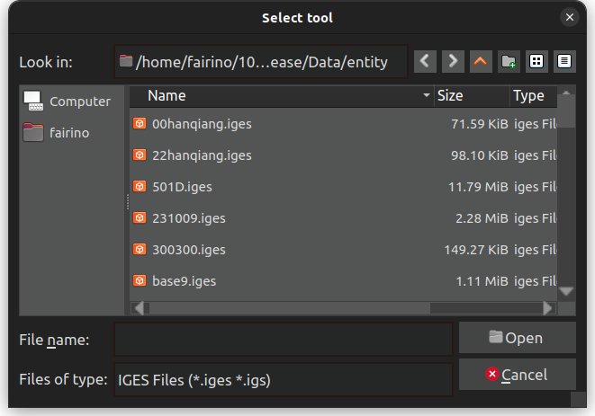

.. centered:: Figure 4-32  AIRLab Engineering Tree - Replacing Imported Robot Models

Import tool
~~~~~~~~~~~~~~~~~~~
Mouse select "FR3" node in the project tree, AIRLab software will switch to the right side of the "tool import settings" sub-page, click the "Open" button, in the emergence of the "Select tool" pop-up window, select the required tool can be, as shown in Figure 4-33. "Select tool" pop-up window, select the tool you need, as shown in Figure 4-33. After the tool is successfully imported, the command feedback area returns "import tool zhi-io-y.iges successfully" results, as shown in Figure 4-34.

.. figure:: analysis/4/33.png
    :align: center
    :width: 5in

.. centered:: Figure 4-33  AIRLab Project Tree-Import Tool

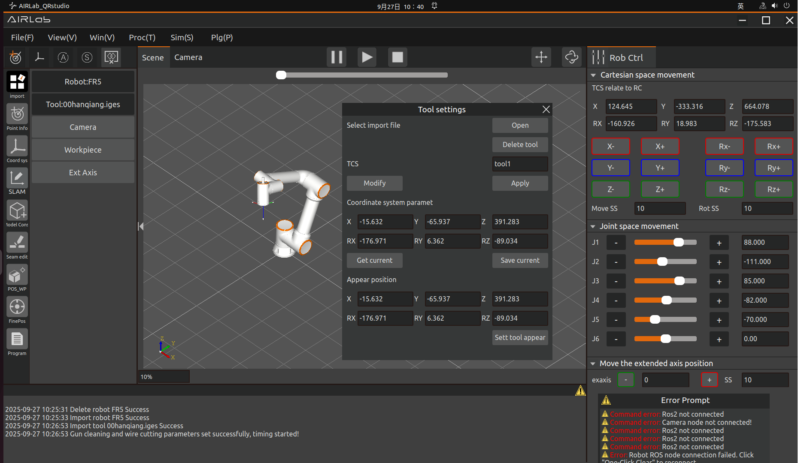

.. centered:: Figure 4-34  AIRLab Project Tree-Tools Imported Successfully

If you need to replace the imported tool, you must first delete the imported tool, and then re-import the new tool, otherwise it will prompt the error "The same scene only supports one tool model! As shown in Figure 4-35. Delete the tool is also the operation of the mouse to select the imported tool node in the project tree, and then right-click to select the option "Remove Item", click to complete the deletion of the tool, the command feedback area will also return to the results of the tool deletion, deletion of the tool can only be restarted after the success of the user can start importing tools.

.. figure:: analysis/4/35.png
    :align: center
    :width: 3.5in

.. centered:: Figure 4-35  AIRLab Project Tree-Repeat Import Tool Model

Import camera
~~~~~~~~~~~~~~~~~~~
The initial camera model in the project tree is "XYZ-ALM", if you need to replace the camera with another model, select the XYZ-ALM node in the project tree with the mouse, right-click and select the option "Remove Item", and then click on it to complete the deletion of the XYZ-ALM model. Remove the XYZ-ALM model. Re-import other models of cameras as follows: Click the mouse to select the "Camera" node in the project tree, the right side of the AIRLab software will switch to the "Camera Selection" sub-page, as shown in Figure 4-36, select the model of the ComboBox, click on the camera model, and then click "OK". model, and then click the "OK" button to complete the import of new models of cameras.

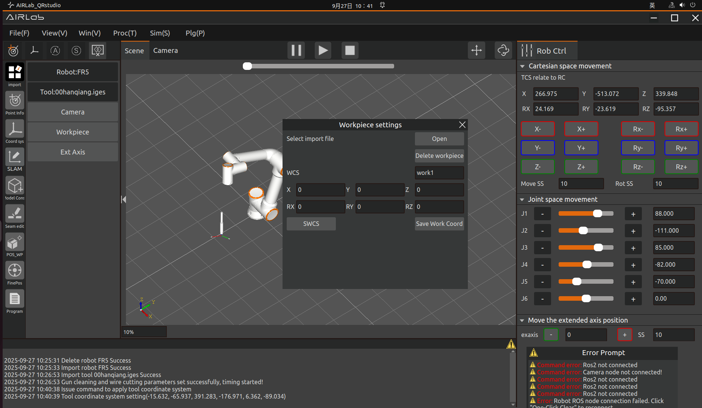

.. centered:: Figure 4-36  AIRLab Project Tree-Import Camera

No-model workpiece modeling
~~~~~~~~~~~~~~~~~~~~~~~~~~~~~~~~~
Model-free workpiece modeling is for the case where the model of the workpiece to be welded is unknown. If the workpiece to be welded is known in the database, please skip this section and go to the next section "Importing Workpieces". If the workpiece to be welded (shape and weld) is unknown, it is necessary to first build a model and weld database for the workpiece, use the built model database, cut into the average model weld recognition solution, and perform welding work. Therefore, this section takes a model-free workpiece as an example to introduce the specific steps of how to use the model-free workpiece modeling function to model a model-free workpiece.

- Step 1: First, the user places the model-free workpiece in the actual scene, as shown in Figure 4-37

.. figure:: analysis/4/37.png
    :align: center
    :width: 2.5in

.. centered:: Figure 4-37  Model-free artifacts

- Step 2: Create a template program for building a model-free workpiece in the project tree, and add sub-nodes such as "Photo" and "Model Building", as shown in Figure 4-38

.. figure:: analysis/4/38.png
    :align: center
    :width: 2.5in

.. centered:: Figure 4-38  Add photo taking and model building nodes

Add a photo point node. The photo point can be obtained by manual teaching or based on point cloud. The following two methods of obtaining photo points are introduced.

1. Manual teaching of photo points

Manual teaching of photo points is for the operator to manually adjust the relative position of the camera and the workpiece and record the points. The teaching principle of photo points is that the camera can clearly and completely capture all positions of the model-free workpiece, especially the weld position that needs to be welded. As shown in Figure 4-39.

.. figure:: analysis/4/39.png
    :align: center
    :width: 6.5in

.. centered:: Figure 4-39   Photographing points of the workpiece at different angles

If the workpiece to be welded is known in the database, please skip this section and proceed to the next section 'Importing Workpieces'.

.. important::
    When teaching the photo taking points, if it is a weld to be welded, we recommend setting two or more different points to take photos of the weld, as shown in Figure 4-40, to improve the accuracy of weld construction.

.. figure:: analysis/4/40.png
    :align: center
    :width: 6.5in

.. centered:: Figure 4-40   Photographing points at two different positions of the same weld

1. Get the photo point based on the point cloud

Getting the photo point based on the point cloud currently only supports the construction of model-free straight line workpieces. You need to collect the rough positioning point cloud of the workpiece first. Create a workpiece positioning program and add sub-nodes such as "Photo" and "Rough Positioning", as shown in Figure 4-41.

.. figure:: analysis/4/41.png
    :align: center
    :width: 3in

.. centered:: Figure 4-41   Creating a workpiece positioning program

Then configure the program. Click the "Photo" sub-node in the project tree, and the sub-page will jump to "Photo Settings", and configure the photo type to "No Model Straight Line";

.. figure:: analysis/4/42.png
    :align: center
    :width: 7.5in

.. centered:: Figure 4-42   Photo Settings

Click the "Coarse Positioning" instruction node in the project tree, and the sub-page will jump to the "Coarse Positioning Instruction Configuration" to configure the algorithm parameters; there is currently only one positioning algorithm, and the positioning rule is "Coarse Positioning-No Model".

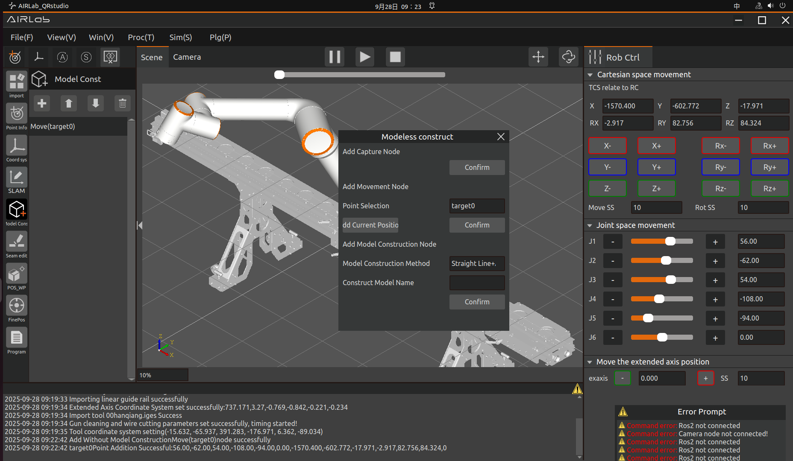

.. centered:: Figure 4-43   Coarse positioning settings

After the configuration is completed, click the "Workpiece Positioning" node, and click Run Program on the Workpiece Positioning Program sub-page to start running the workpiece positioning template program; the program runs to the "Photo" point, and the "Collected Point Cloud" pop-up window pops up on the page and displays the point cloud data. Perform multiple "Photos" to display the fitted point cloud data in the three-dimensional scene, as shown in Figure 4-44 to Figure 4-46.

.. figure:: analysis/4/44.png
    :align: center
    :width: 7.5in

.. centered:: Figure 4-44   Coarse positioning to obtain point cloud and take the first photo

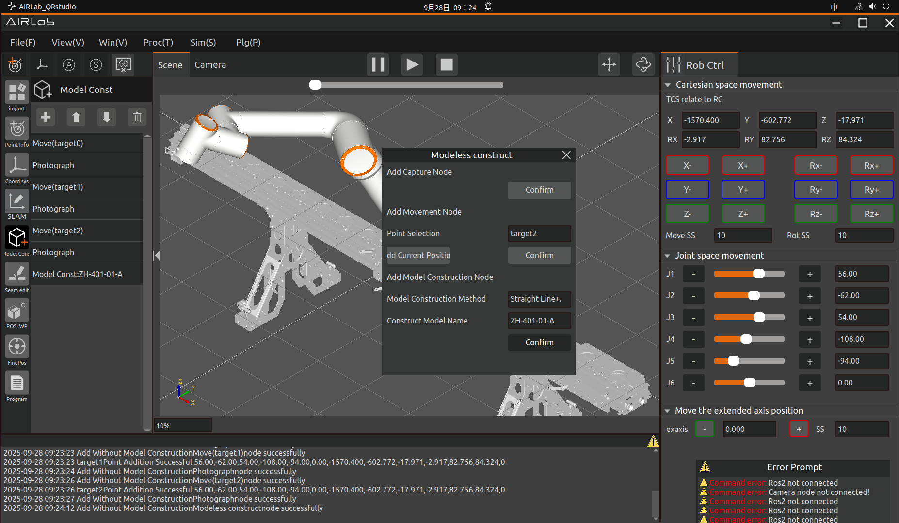

.. centered:: Figure 4-45   Coarse positioning to obtain point cloud and take the second photo

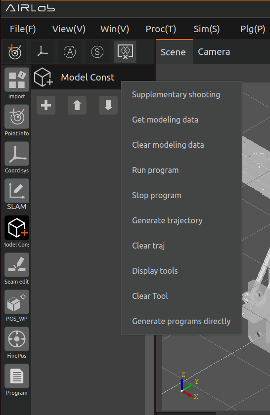

.. centered:: Figure 4-46   Rough positioning to obtain point cloud and take the third photo

After the program is finished running, the complete RGB depth point cloud is displayed in the 3D scene, and the identified corner points are shown inFigure 4-47, which is the constructed workpiece point cloud model.

.. figure:: analysis/4/47.png
    :align: center
    :width: 7.5in

.. centered:: Figure 4-47   Constructed workpiece point cloud model 

Then, according to the depth point cloud and feature corner information displayed in the 3D scene, click the "Photo" node, select the location to be photographed on the constructed model (usually the location of the corner point); check the automatically calculated optimal photo location and point information, enter the point name without adjustment or after fine-tuning as needed, and confirm to save the point. The corresponding point appears in the project tree, as shown in Figure 4-48. At the same time, the previous node of the current photo subnode generates moveJ(targetT), where targetT is the name of the photo point obtained.

.. figure:: analysis/4/48.png
    :align: center
    :width: 7.5in

.. centered:: Figure 4-48    Get the photo location

Repeat the above steps and add each photo point in turn until the model-free workpiece construction template program is completed;

After manually teaching or automatically acquiring all photo points, add the photo point node MoveJ (targetT); the "model-free workpiece construction" program is created, as shown in the Figure 4-49.

.. figure:: analysis/4/49.png
    :align: center
    :width: 3in

.. centered:: Figure 4-49    Model-less workpiece modeling program

- Step3: Configure the "Modelless Workpiece Construction" program

  Click the "Photograph" subnode of the "Modelless Workpiece Modeling" program, and the subpage will jump to "Photograph Settings". Configure the photo type to modelless straight line or modelless arc according to the current weld type;

  Click the "Model Construction" instruction node in the project tree, and the subpage will jump to "Model Construction". Configure the algorithm parameters and workpiece name;

  Configure the program configuration-modelless construction and set it to "Rebuild";

After the configuration is completed, the modelless workpiece construction template program is created and configured, and then the modelless workpiece modeling program can be run to obtain the modelless workpiece model data. For details, see Section 4.7.14 Modelless Workpiece Modeling Program Content.

.. important:: 
    For the same modelless workpiece, it is not recommended to rebuild it after the construction is successful, because the weld number obtained by the modelless construction may change in each construction! If you must rebuild, please check and modify the content of the template program after the construction.

Importing workpieces
~~~~~~~~~~~~~~~~~~~~~~~
Click on the node "Workpiece" under "Template Program" in the project tree, the right side of AIRLab software will switch to "Workpiece Import Settings" sub-page, click on the "Open" button, select the required workpiece in the "Select wobj" pop-up window that appears. "Open" button, in the "Select wobj" pop-up window that appears, select the desired workpiece, such as Figure 4-50. After the import is successful, the "Workpiece" node of the project tree will increase the number of imported workpieces under the node. node of the project tree will be added under the node "workpieces", and the bottom command feedback area will return the result of "Imported workpiece T24-150404-04.iges successfully", as shown in Figure 4-51.

.. figure:: analysis/4/50.png
    :align: center
    :width: 7.5in

.. centered:: Figure 4-50  AIRLab Project Tree - Importing Artifacts

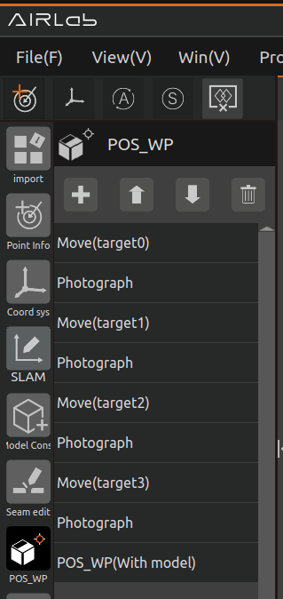

.. centered:: Figure 4-51  AIRLab Project Tree-Artifacts Imported Successfully    

These are all the import requirements involved in the project tree, and the following describes the function and usage of workpiece positioning.

Workpiece positioning
~~~~~~~~~~~~~~~~~~~~~~~
The robot needs to complete the import and workpiece positioning before running the welding program. This section will introduce the content of workpiece positioning based on the completion of the import, which is mainly divided into two parts: one is how to create your own workpiece positioning program; the other is how the user should run the successful creation of the workpiece positioning program.

Part I: How to create a workpiece positioning program

Select the "Workpiece Positioning" node in the project tree with the mouse, and the following options will appear when you right-click on it, as shown in Figure 4-52. The main commands used in workpiece localization are "MoveJ", "Take photo" and "Rough positioning", in workpiece localization, the robot needs to run to a suitable position to take a photo of the workpiece through the MoveJ command, and then use the photo to take a photo of the workpiece through the "Rough positioning" command. In workpiece positioning, the robot needs to run to a suitable position by the MoveJ instruction to take a photo of the workpiece, and then use the photo to obtain the actual relative position of the workpiece and the robot by the "coarse positioning" function. Therefore, the first step in creating a workpiece positioning program should be to determine where the robot will take pictures and record these points.

.. figure:: analysis/4/52.png
    :align: center
    :width: 7.5in

.. centered:: Figure 4-52  AIRLab Project Tree - Workpiece Positioning

- Step1: Record the camera's photo points

  Operation method: You can move the robot to a suitable photo position by manual mode, and then click on the Add Points icon button in the menu bar of the AIRLab software, you can add the point target0 under the node "Robot" in the project tree, and the command feedback area will return the result of adding points, as shown in Figure 4-53. The first 6 digits of the point information represent the joint coordinates of the robot at the position, and the last 6 digits represent the Cartesian coordinates of the robot. Other points are added in the same way as target0. Double-click the project tree node to customize the node name (please use target as the prefix for the customized name), and click the point node in the project tree to jump to the point modification sub-interface, where you can realize the modification of the current saved point position.

.. figure:: analysis/4/53.png
    :align: center
    :width: 7.5in

.. centered:: Figure 4-53  AIRLab Project Tree-Added Points

.. important::
    If you need to modify the information of the added points, such as target0, the operation is as follows: click the mouse to select the child node "target0" in the project tree, and then the right side of the AIRLab software will switch to the "Modify point information" sub-page, where you can modify the name, joint coordinates, Cartesian coordinates and other information of target0, and then click the button "Teach current position". The right side of AIRLab software will switch to the "Modify Point Information" sub-page, where you can modify the name, joint coordinates, Cartesian coordinates and other information of target0, and then click the button "Teach Current Position" after the modification is completed. At this time, the information of target0 node in the project tree will be updated and the result of modifying the position will be returned in the command feedback area. For more details, please refer to the subpage Explanation - Point Modification.

- Step2: After adding new points successfully, create a work positioning program

  Select the "Workpiece Positioning" node with the mouse, right-click and select "MoveJ", then the "MoveJ" sub-node will be added under the "Workpiece Positioning" node in the project tree. Select the node with the mouse, right-click and two options will appear: "Associated Target Point" and "Remove Item", select "Associated Target Point", the name of the existing point will appear in the project tree. Select "Associated Target Point", and the point names in the project tree will appear. Select the associated point according to the actual situation, of which MoveJ and MoveL commands only need a target point, MoveC and Circle commands need to be associated with two points. As shown in Figure 4-54, the meaning of this program is that the robot will move from the current position to the target0 point position by MoveJ motion.

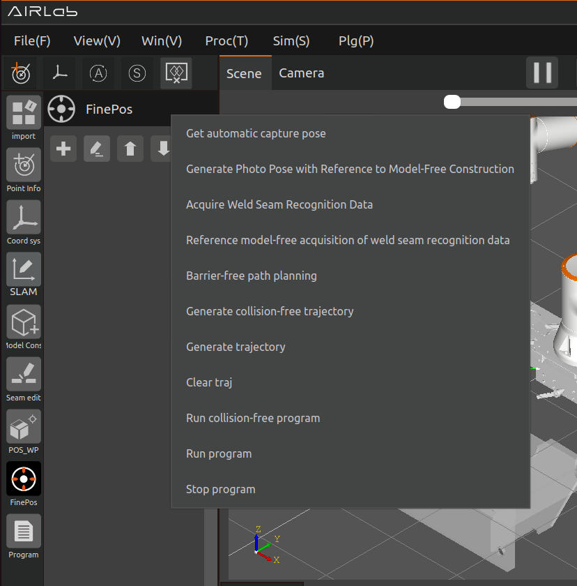

.. centered:: Figure 4-54  AIRLab Project Tree-New MoveJ Command

If you want to delete the program instruction, select the instruction and right-click on it to select "Remove Item".

- Step3: The robot reaches the point target0 and starts taking pictures of the workpiece

  Operation method: Select the "Workpiece Positioning" node in the project tree, right-click and select "Take Picture", click to add the instruction in the Workpiece Positioning node, as shown in Figure 4-55, see the sub-page analysis chapter for detailed parameter settings. The method of adding other photo points remains unchanged, and users can add any number of MoveJ and photo commands according to actual needs.

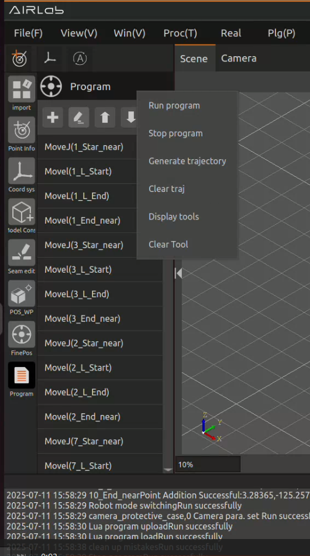

.. centered:: Figure 4-55  AIRLab Project Tree-Add Photo Instruction

- Step4: The last step is to add the "Coarse Positioning" command

  Operation method: The method of adding commands remains unchanged. After the coarse positioning command is added successfully, set the related parameters through the subpage "Coarse Positioning Setting", as shown in Figure 4-56, and the details are shown in the chapter of subpage analysis.

.. figure:: analysis/4/56.png
    :align: center
    :width: 7.5in

.. centered:: Figure 4-56  AIRLab Project Tree-New Coarse Positioning Instruction

Part II: How to Run the Workpiece Positioning Program to Create Successful Workpieces

Operation method: Select the "Workpiece Positioning" node in the project tree, and the "Workpiece Positioning Program" sub-page will be switched on the right side of the AIRLab software. First, click the "Simulation Trajectory Generation" button to view the simulation trajectory curve of the workpiece positioning program, and then confirm whether the workpiece positioning program is reasonable. After that, click the "Clear Trajectory" button to clear the trajectory. If the simulation trajectory is reasonable, click the "Run Program" button, and the robot will start to run all the commands under the "Workpiece Positioning" node in the project tree. You can click the "Stop Program" button at any time during the robot's operation, and the robot will stop running the workpiece positioning program immediately. Detailed instructions can be found in the subpage Explanation section.

Template program
~~~~~~~~~~~~~~~~~~~
After the workpiece positioning program is successfully run, the robot controller will obtain the actual workpiece coordinate system. Afterwards, you can start to run the weld template program in the project tree for precise weld positioning and welding parameter setting. This section describes how to create and run the program commands under the "Template Programs" node in the project tree, as well as how to use the robot's button box to interact with the template programs.

Part I: Creating template program content

- Step1: Create a "Weld Identification" node

  Operation method: Click on the imported workpiece sub node with the mouse. In this example, it is the "T23-150403-04. iges" node, as shown in the figure. Right click and select 'Weld seam recognition', which means that a new weld seam recognition node has been successfully added under the 'T23-150403-04. iges' node.

  Firstly, demonstrate the photography points for identifying weld seams to ensure that the camera can capture all weld seams clearly and completely; Next, click on the "Weld Seam Recognition" node in the engineering tree to create the "MoveJ" and "Photo" commands. Right click on the MoveJ node added in the engineering tree, set the associated target point, and then click on the photo node. In the "Photo Settings" sub page triggered on the right, set the photo model to "Average Model Photo". In the "Average Model Weld Seam Number" text box on the sub page, enter all the weld seam numbers that the camera can recognize, as shown in Figure 4-57.

.. figure:: analysis/4/57.png
    :align: center
    :width: 7.5in

.. centered:: Figure 4-57  Parameter settings on the "Photo Settings" page during weld seam recognition

.. important::
    When users input the average model weld seam number, they should combine it with the workpiece model weld seam number displayed in AIRLab, and add the robot's photo points based on the weld seam number and the actual position of the target point associated with MoveJ.

If it is an unmodeled workpiece, the weld seam number display is shown in Figure 4-58. If it is a modeled workpiece, the weld seam number query is shown in Figure 4-59.

.. figure:: analysis/4/58.png
    :align: center
    :width: 7.5in

.. centered:: Figure 4-58  Non model workpiece-weld seam number

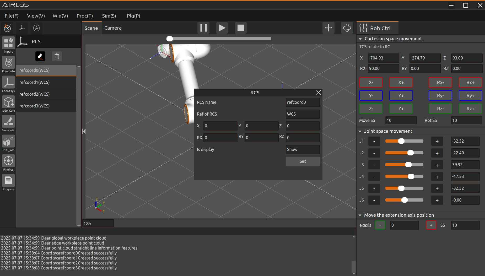

.. centered:: Figure 4-59  Model workpiece-weld seam number

Taking the model free workpiece shown in Figure 4-58 as an example, the robot recognizes weld seam 1, weld seam 2, and weld seam 3 in the figure. The actual camera shooting point is set as shown in Figure 4-60, and the average model weld seam number input value is shown inFigure 4-58. The identification methods for other welds are the same.

.. figure:: analysis/4/60.png
    :align: center
    :width: 2.5in

.. centered:: Figure 4-60  Robot Weld Seam Recognition Shooting Point Location

.. important::
    Take photos of all weld seam numbers in the weld seam recognition node, so that feature recognition can start directly in the specific weld seam program without having to take separate photos of individual welds, which helps improve recognition efficiency.

- Step2: Create "Weld 1" node.

  Operation method: mouse click on the imported workpiece child node, Right-click and select "Custom", that is, in the "T24-150404-04.iges" node under the new a child node "T24-150404-04.iges Child1 ", double-click the node can modify the node name, in this case it will be modified to "Weld 1", shown in Figure 4-61.

.. figure:: analysis/4/61.png
    :align: center
    :width: 7.5in

.. centered:: Figure 4-61  AIRLab Project Tree - Add "Weld 1" node

.. important::
    Robots performing welding tasks usually need to perform welding operations on different parts of the workpiece, which are different (e.g., straight line welds, arc welds, etc.), so different weld programs are defined, i.e., Weld 1, Weld 2, Weld 3, etc.

- Step3: According to the actual welding situation, create a specific program under the "Weld 1" node.
  
  Operation method: Here is a brief introduction using the program for weld seam 1 as an example. Assuming weld seam 1 is a straight weld seam, the complete information of the straight weld seam has been obtained in the previous step of weld seam recognition. Here, only the "feature recognition" command needs to be added to the engineering tree. For specific parameter settings, please refer to the feature recognition subpage analysis section.

  The purpose of feature recognition is to correct the welding start point, middle point (arc weld) and end point of the weld according to the actual photo of the weld obtained from the workpiece, so in this example, the "feature recognition" node needs to be added after the instruction is MoveJ (targetS), S is the start point of the weld and MoveL ( targetE), E is the end point of the straight line weld. targetE), where E is the end point of the linear weld. If weld 1 is a fillet weld, add MoveJ(targetS) and MoveC(targetM ,targetE) after the feature recognition node, M is the middle point of the fillet weld and E is the end point of the fillet weld.

  Two results are obtained after the feature recognition is completed: one is that new correction points, targetS_m and targetE_m, will be added under the robot node in the project tree; the other is that new welding instructions will be added under the program node in the project tree, including MoveJ(targetS_m) and MoveL(targetE_m) and some instructions required when setting up the MoveL(targetE) welding process with some of the instructions needed to set up the MoveL(targetE) welding process. 

.. important::
    These two results will be automatically cleared when executing the next workpiece job.
    
The use of some of the new nodes is explained below. As shown in Table 4-3.

.. centered:: Table 4-3 Description of Node Usage

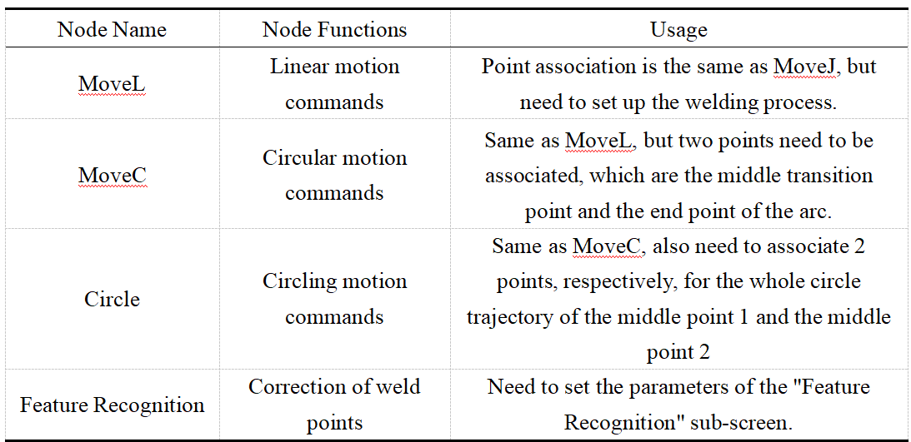

Part II: Running the template program

There are three ways to run a template program.

- After completing the program configuration as shown in Figure 4-62, click the Start Run button in the menu bar, the robot will automatically run the workpiece positioning program first, and after successful operation, it will start running the weld program according to the set configuration mode;

- In the case of manual commissioning, on the premise of successful operation of the workpiece positioning program, select the specific weld program node under the "Template Program" node in the project tree, and click on the "Weld Template Program" sub-page switched on the right side of AIRLab. Run Program" button on the "Weld Template Program" subpage switched on the right side of AIRLab;

- The start of robot operation is controlled by the start-stop operation button of the pushbutton box.

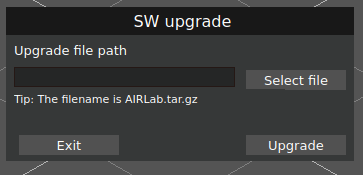

.. centered:: Figure 4-62  AIRLab Project Tree-Pre-Run Program Configuration Settings

Part III: Interaction between the template program and the pushbutton box start-stop-run buttons

After completing the necessary tasks such as the import work described in the previous section, the creation of the workpiece positioning program, and the vision and Ros2 communication connection, the robot can be directly controlled to realize the running and stopping of the template program in the project tree by using the start-stop running button on the pushbutton box.

- Start running: After pressing the start button for the first time, the robot will start to run the workpiece positioning program. After the positioning program is successfully run, the robot will automatically start to run the weld program under the "Template Program" node according to the program configuration mode set up. After the seam identification, the robot will start to run the commands under the "Program" node to carry out the welding work.

- Stop running: Press the Start Run button again and the robot will stop running immediately.    

Programs
~~~~~~~~~~~~~~~~~~~
After the execution of the template program in the weld 1, the program node will be generated under the node to be executed Lua program node, the user through the mouse to select the "program" node in the project tree, the right side of the AIRLab software to switch to the sub-page, the work program, "click on the button "Run the program" can be achieved by the robot on the workpiece specified weld welding, as shown in Figure 4-63.

.. figure:: analysis/4/63.png
    :align: center
    :width: 7.5in

.. centered:: Figure 4-63  AIRLab Project Tree-Running the Program

Pop-Ups and Other Pages
--------------------------
This section describes the pop-ups and other pages that appear in the AIRLab software. The pop-ups include file setup pop-ups, log level pop-ups, software upgrade pop-ups, weld process query pop-ups, and multi-layer multi-pass weld process query pop-ups; the other pages include the robot control, other controls, simulation, debugging page, program configuration, and multilingual setup.

File Settings pop-up window
~~~~~~~~~~~~~~~~~~~~~~~~~~~~~
As in Figure 4-64, click on "File", the "File Settings" pop-up window will appear. Select the file type as "Welding" and click "New" button to import the robot.

.. figure:: analysis/4/64.png
    :align: center
    :width: 7.5in

.. centered:: Figure 4-64  "File Settings" pop-up window

Click the "Open" button, the file selection pop-up window shown in Figure 4-65 appears, users can choose to import their desired robot, tool or workpiece configuration file, click "open" to import, click "cancel" to cancel the import. 

.. figure:: analysis/4/65.png
    :align: center
    :width: 4in

.. centered:: Figure 4-65  File Selection pop-up window

Log level pop-up window
~~~~~~~~~~~~~~~~~~~~~~~~~
Figure 4-66 shows the Log Level Management module. Log levels are categorized as ERROR, WARNING, INFO, and DEBUG.

- ERROR: Record logs at the ERROR level.
- WARING: Record ERROR and WARING level logs.
- INFO: Record logs at the ERROR, WARNING, and INFO levels.
- DEBUG: Log all logs.

.. figure:: analysis/4/66.png
    :align: center
    :width: 2in

.. centered:: Figure 4-66  "Log Level" pop-up window

You can modify the current logging situation by modifying the log level.

Software upgrade pop-ups
~~~~~~~~~~~~~~~~~~~~~~~~~
Click Window-Software Upgrade, and a software upgrade pop-up window will pop up.

Click Window - Software Upgrade to bring up the Software Upgrade pop-up window.

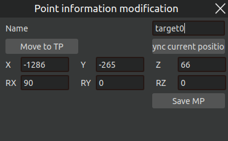

.. centered:: Figure 4-67   Software upgrade pop-ups

Click “Select File” to bring up the file selection window, select the AIRLab.tar.gz upgrade file, please make sure the file name and format are correct.

.. figure:: analysis/4/68.png
    :align: center
    :width: 3.5in

.. centered:: Figure 4-68   Selecting an upgrade package
    
.. figure:: analysis/4/69.png
    :align: center
    :width: 3.5in

.. centered:: Figure 4-69   Selecting an upgrade package

Click Upgrade and wait for the upgrade package to finish unpacking, the upgrade progress will be shown in the progress bar. Click Exit to exit the software upgrade.

.. figure:: analysis/4/70.png
    :align: center
    :width: 3.5in

.. centered:: Figure 4-70   AIRLab software upgrade in progress

After the upgrade progress reaches 100%, click Confirm and restart the software, the upgrade is complete.

.. figure:: analysis/4/71.png
    :align: center
    :width: 3.5in

.. centered:: Figure 4-71   AIRLab software upgrade completed

When the upgrade package is corrupted or incomplete, the interface will show the upgrade failure feedback. You can choose to quit the upgrade or re-select the upgrade package to continue the upgrade.

.. figure:: analysis/4/72.png
    :align: center
    :width: 3.5in

.. centered:: Figure 4-72   AIRLab Software Upgrade Failure Interface Feedback

Welding process query pop-up window
~~~~~~~~~~~~~~~~~~~~~~~~~~~~~~~~~~~~~~~~~
As shown in Figure 4-73, the Welding Process Inquiry pop-up window allows you to add, modify, or delete welding processes. Welding process includes welding speed, welding current, welding voltage, and the selection of whether or not to swing, whether or not to wrap the angle, and whether or not to segment welding. At the same time, you can query the specific oscillation process, the wrap-around process and the segment welding process.

.. figure:: analysis/4/73.png
    :align: center
    :width: 3in

.. centered:: Figure 4-73  Welding process inquiry pop-up window

Oscillating Process: Select “Process Selection” button for oscillating process or click “Oscillating Process Query” button to jump to the oscillating process query pop-up window. Select the name of the oscillation process to query the specific parameters of the oscillation process, and at the same time, you can choose to change the way of adding, modifying or deleting to add the oscillation process, modify the current oscillation process or delete the current oscillation process.

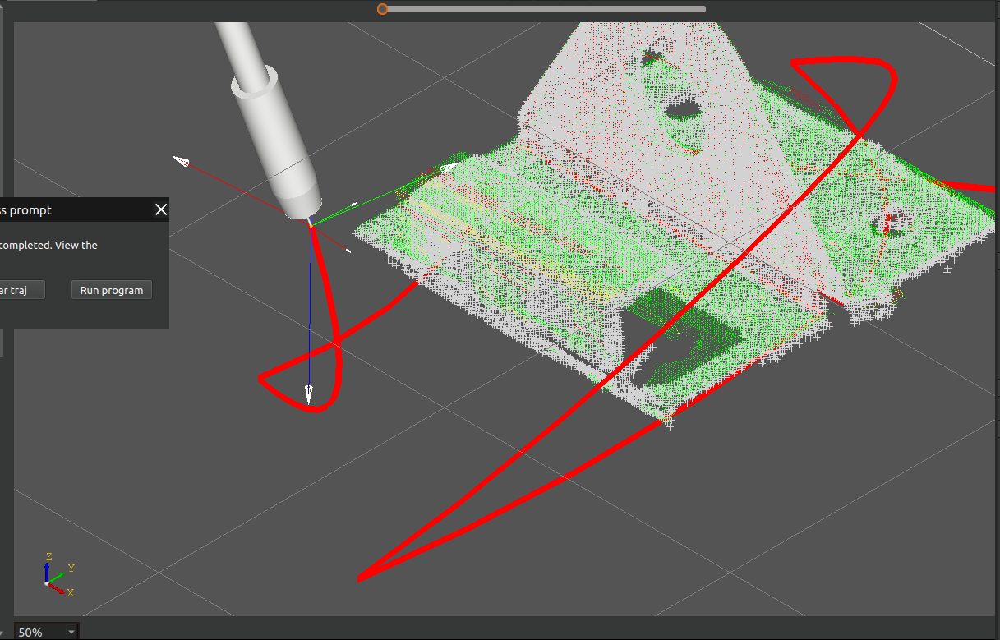

.. centered:: Figure 4-74  Oscillating Craft Query Popup

Corner Wrapping Process: Select “Process Selection” button for corner wrapping process or click “Corner Wrapping Process Query” button to jump to the corner wrapping process query pop-up window. Select the name of the corner wrapping process to query the specific parameters of the corner wrapping process, while optional changes to add, modify, delete to add the corner wrapping process, modify the current corner wrapping process or delete the current corner wrapping process.

.. figure:: analysis/4/75.png
    :align: center
    :width: 3in

.. centered:: Figure 4-75  Corner wrapping process inquiry pop-up window

Segment Welding Process: Select “Process Selection” button for segment welding process or click “Segment Welding Process Query” button to jump to the segment welding process query pop-up window. Selecting the name of the segment welding process can query the specific parameters of the segment welding process, and at the same time, you can choose to change the way of adding, modifying or deleting to add a new segment welding process, modifying the current segment welding process or deleting the current segment welding process.

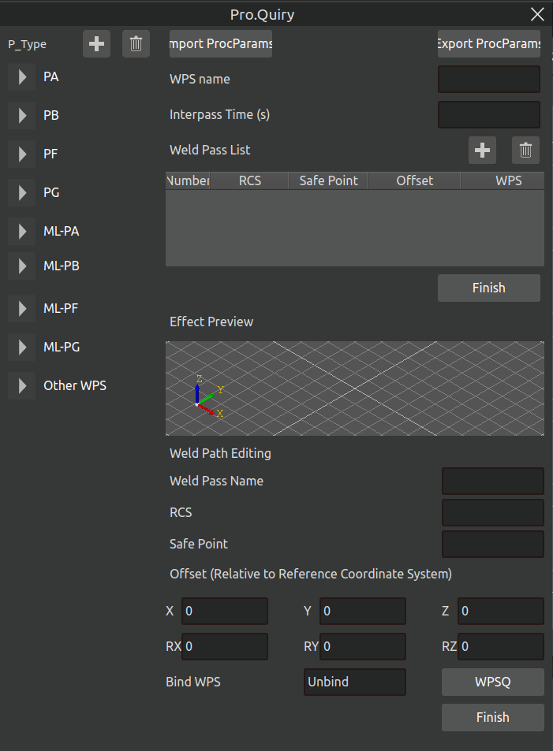

.. centered:: Figure 4-76   Segment welding process inquiry pop-up window

Arc tracking process: Select the "Process Selection" button as the arc tracking process or click the "Arc Tracking Process Query" button to jump to the arc tracking process query pop-up window. By selecting the name of the arc tracking process, the specific parameters of the arc tracking process can be queried. At the same time, the change methods can be added, modified, or deleted to add, modify, or delete the current arc tracking process.

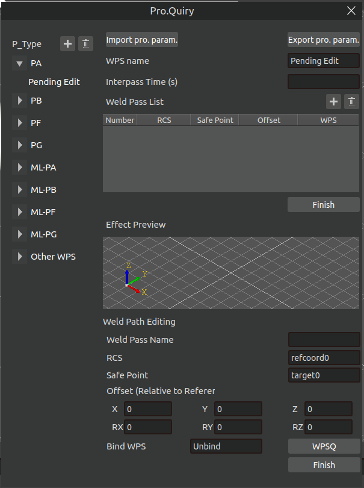

.. centered:: Figure 4-77   Arc Tracing welding process inquiry pop-up window

Multi-layer multi-pass welding process query pop-up window
~~~~~~~~~~~~~~~~~~~~~~~~~~~~~~~~~~~~~~~~~~~~~~~~~~~~~~~~~~~~~~~~~~~~~
Figure 4-78 shows the multi-layer multi-pass welding process query pop-up window, including the weld pass number, reference coordinate system, offset and welding process information. You can choose to add, modify or delete the process.

.. figure:: analysis/4/78.png
    :align: center
    :width: 3in

.. centered:: Figure 4-78   Multi-layer multi-pass welding process inquiry pop-up window

As shown in Figure 4-79, to add a new multi-layer multi-pass welding process you need to first select the name of the multi-layer multi-pass welding process “to be added”, select the change method for “new”, enter the new change welding process name ZH-101-02-B.

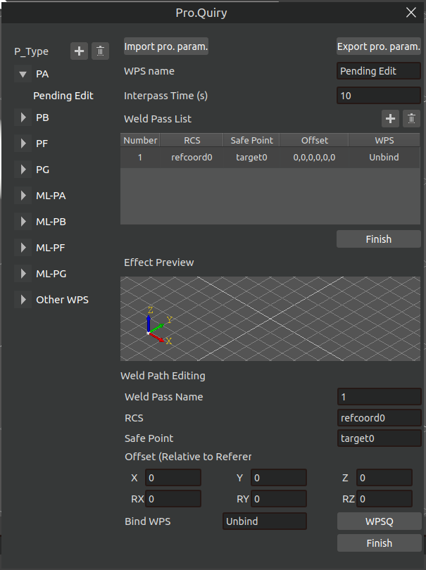

.. centered:: Figure 4-79   New multi-layer multi-pass welding process

By clicking the Finish button, the Multilayer Multi-Pass Welding Process with the name ZH-101-01-B is added to the database.

.. figure:: analysis/4/80.png
    :align: center
    :width: 3in

.. centered:: Figure 4-80   Successful addition of multi-layer multi-pass welding process

As shown in Figure 4-81, select the process name of the multi-layer multi-pass welding to be modified, and select the change method as “Modify”.

.. figure:: analysis/4/81.png
    :align: center
    :width: 3in

.. centered:: Figure 4-81   Modification of multi-layer multi-pass welding process

Click “Edit Weld Pass” to modify the multi-layer multi-pass welding process. Including the addition, modification, deletion of the welding process, as shown in Figure 4-82. To add a new weld process as an example, enter the name of the new change in the welding process, select the change method for “Add”, set other process parameters and select the welding process.

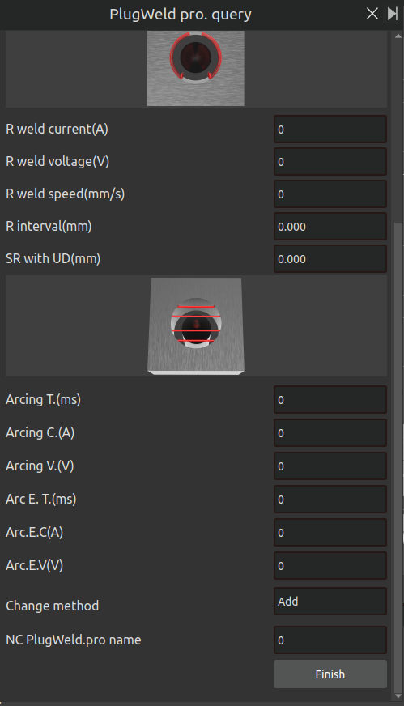

.. centered:: Figure 4-82   Additional Welding Path

Click the “Finish” button after the setting is completed. Return to Multi-Pass Welding, as shown in Figure 4-83, one new pass is added to the Multi-Pass Welding process. Click “Finish” to save the changes to the multi-layer welding process.

.. figure:: analysis/4/83.png
    :align: center
    :width: 3in

.. centered:: Figure 4-83   Successful modification of multi-layer multi-pass welding process

As shown in Figure 4-84, select the change mode as “Delete”, click the “Finish” button, it will delete the currently selected multi-layer multi-pass welding process in the database, as shown in Figure 4-85.

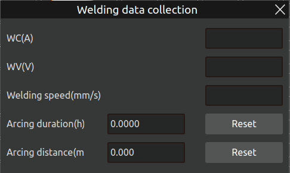

.. centered:: Figure 4-84   Deletion of multi-layer multi-pass welding process

.. figure:: analysis/4/85.png
    :align: center
    :width: 3in

.. centered:: Figure 4-85   Deletion of multi-layer multi-pass welding process success

Cylinder Filling Process Query Pop up Window
~~~~~~~~~~~~~~~~~~~~~~~~~~~~~~~~~~~~~~~~~~~~~~~~~~
The pop-up window for querying the cylindrical filling process is shown in Figure 4-86. The cylindrical filling process includes two parts: filling the bottom surface of the cylinder and secondary reinforcement.

.. figure:: analysis/4/86.png
    :align: center
    :width: 3in

.. centered:: Figure 4-86   Cylinder Filling Process Query Pop up Window

(1) Fill the bottom surface of the cylinder

Before performing cylindrical filling welding, users need to set parameters such as welding current, welding voltage, welding speed, spacing, offset, safety point selection, and swing process selection.

(2) Secondary reinforcement

After the cylindrical filling welding is completed, secondary reinforcement welding is carried out, and the same user needs to set parameters first.

- The filling interval refers to the vertical distance between two adjacent filling layers;

- Inward filling offset refers to the horizontal distance between the starting point of filling and the edge of the cylinder;

- The safety point name is the transition point of the robot during the filling and reinforcement process. After completing one filling or reinforcement, the robot needs to return to that point for the next welding.

- Reinforcement interval refers to the vertical distance between adjacent reinforcement layers;

- The upward offset of secondary reinforcement refers to the vertical interval between the starting point of the second reinforcement and the starting point of the first reinforcement;

- The name of swing process and whether to swing refers to which swing process the user chooses and whether to swing according to their actual welding needs, as shown in Figure 4-87.

.. figure:: analysis/4/87.png
    :align: center
    :width: 4in

.. centered:: Figure 4-87   Swing process query pop-up window

Users can add, modify, or delete cylindrical filling processes：

- New: Select "New" as the change method, then set the process parameters and the name of the new filling process, and click the "Finish" button to add a new filling process;

- Modification: Select "Modify", choose a cylindrical filling process name, then reset the process parameters, and click the "Finish" button to modify the parameters of the process;

- Delete: Select "Delete", choose a cylindrical filling process name, and then click the "Finish" button to delete the process.

Other controls
~~~~~~~~~~~~~~~~~~~
Click the "Other Controls" button in the operation area to enter the IO setting interface, which mainly includes two modules of IO control and external axis setting.

(1) IO control module

As shown in Figure 4-88, the IO control module enables manual control of the digital outputs, analog outputs (0-10v) in the robot control box and the end tool digital outputs, analog outputs (0-10v) extended IO digital outputs, analog outputs (0-10v):

.. figure:: analysis/4/88.png
    :align: center
    :width: 3in

.. centered:: Figure 4-88  IO Control Module

- DO Setting: Select the port number, click the "On" button to set the corresponding DO high, and click the "Off" button to set the corresponding DO low.
- AO Setting: Select the port number and enter the value (0-100) in the input box on the right, the value is a percentage, setting 100 means setting this AO port to 10v.

(2) Exaxis control

As shown in Figure 4-89, the External Axis Setup module enables control of the robot's external axis.

Select the extended axis number and click the "Load" button to load the external axis protocol according to the selected extended axis number. Set the running speed (%), acceleration (%) and the maximum distance of the extended axis (mm).

- Remove Enable: Click on the "Remove Enable" button to remove enable from the external axis.
- Servo Enable: Click the "Servo Enable" button to enable the external axis.
- Forward Tap: Click the "Forward Tap" button to perform a forward tap of the external axis according to the set running speed, acceleration, and maximum distance of the extended axis.
- Reverse Pivot: Click the "Reverse Pivot" button to reverse pivot the external axes according to the set running speed, acceleration, and maximum distance of the extended axes.
- Stop Pivoting: Click the "Stop Pivoting" button to stop the external axis from pivoting.
- Zero Setting: Click the "Zero Setting" button to zero the external axis according to the zero return method, zero seeking speed and hoop speed.

.. figure:: analysis/4/89.png
    :align: center
    :width: 3in

.. centered:: Figure 4-89  Exaxis Control

Simulation
~~~~~~~~~~~~~~
As shown in Figure 4-90, after generating the simulation trajectory of the program, open the operation area - simulation, set the simulation speed and simulation interval, click on the "Run" button to start the simulation of the template program, click on the "Stop" button to stop the template program simulation. Click "Stop" button to stop the template program simulation. At the same time, it will generate the simulation trajectory point table to record the simulation trajectory points. In the table, the type of simulation track endpoints is LINEND, and when you click a line in the table, the virtual simulation robot will move to the clicked simulation track point, and at the same time, it will synchronously display the TCP coordinates of the simulation track point.

.. figure:: analysis/4/90.png
    :align: center
    :width: 6in

.. centered:: Figure 4-90  Simulation Page

Program configuration
~~~~~~~~~~~~~~~~~~~~~~~~~~~

Perform the program run configuration and program arc start configuration as shown in Figure 4-91.   

.. figure:: analysis/4/91.png
    :align: center
    :width: 3in

.. centered:: Figure 4-91  Program Configuration Page

The program running configuration can be selected from manual debugging mode, weld after all recognition and weld after single strip recognition, as detailed below.

- Manual debugging mode: for single-step debugging.

- Weld after all are recognized: Click Auto Run to recognize all the welds before welding.

- Weld after single strip recognition: Clicking Auto Run, the robot will first recognize the first weld seam under the template program node. Upon successful recognition, it will proceed to weld the first seam. After completing the welding, it will continue to recognize the second seam, and this process will repeat until all the seams have been welded. The operation will end once all welds are completed.

The program's arc start configuration can be set to arc start or no arc start. It is recommended to test whether there is a problem by setting no arc start before starting arc welding.

- No model building setup: Currently, there are two methods - rebuilding and not rebuilding.
- If user wants to automatically run:No- model workpiece modeling - workpiece positioning - template program - program execution, the parameter should be selected as "rebuild". After clicking on automatic run, the model free workpiece construction program will first be parsed and run, and the workpiece model database will be re identified and built. After successful construction, the process of workpiece positioning, template program, program, etc. will begin.

.. important::
    In practical operation, we do not recommend using this method because the weld seam numbers obtained without model construction may change during each construction! So it is recommended to carry out the process of building model free workpieces separately first, and after the successful construction of the workpieces, operate according to the original average model method. In this way, the parameter for no model construction settings is always set to 'do not rebuild'.

If there is no need to perform model free construction on the workpiece (i.e. the workpiece model already exists in the database or has been successfully built), and the model free construction setting is selected as "do not rebuild", the automatic program will skip the model free workpiece construction program and directly start the process of workpiece positioning.

After all the configuration, click the "Confirm" button to complete the program configuration.

Multilingual settings
~~~~~~~~~~~~~~~~~~~~~~~~~
AIRLab software currently provides seven language options: Chinese (Simplified), Chinese (Traditional), English, Japanese, Korean, Russian, and French. The detailed multilingual settings page is shown in Figure 4-92. This page provides three operations: switching languages; Export existing languages in AIRLab software; Import a new language. Meet the needs of users to switch between multiple languages, set new languages for AIRLab software, and modify existing language content in AIRLab software.

.. figure:: analysis/4/92.png
    :align: center
    :width: 3in

.. centered:: Figure 4-92  "Multilingual Settings" Sub interface

The detailed operation introduction of the above functions is as follows:

(1) Switch the language of AIRLab

Click on the dropdown menu of "Multilingual" in Figure 4-92, select the desired language type, and click the "Confirm" button to immediately switch the AIRLab software language.

(2) User sets new language for AIRLab

Firstly, click the "Export" button to export the language file currently used by AIRLab in CSV format. The exported file path is located in the local Downloads folder, as shown in Figure 4-93. The content format of the CSV file is shown in Figure 4-94, including four columns: language_id, location, source_text, translation_text. “language_id” represents the language type, “location” represents the position of the text in the source code, 'source_text' represents the text (Chinese) in the source code, and 'translation_text' represents the translation value corresponding to the source text.

.. figure:: analysis/4/93.png
    :align: center
    :width: 4in

.. centered:: Figure 4-93   AIRLab Language File Export Path

.. figure:: analysis/4/94.png
    :align: center
    :width: 5in

.. centered:: Figure 4-94   Content and format of AIRLab language CSV file

Next is to write a CSV file for the user. When setting a new language, the user only needs to modify the contents of the first column language_id and the fourth column translation_text. Assuming the user has added French, replace all "English" in the first column of Figure 4-95 with "Français"; The content of the fourth column translation_text needs to be translated by the user based on the Chinese text of "source_text" to obtain the corresponding target language (for the same string appearing in the source text, please translate it into the same word).

.. important::
    Please do not modify any characters under the "source_text" column!

After completing the translation work, the user needs to rename the CSV file to a file name that is the table name of the language data table in the AIRLab language database. For example, the file name "en_translations table" in Figure 4-96 is the table name of the language type "English" in the database.

.. important::
    It is recommended to preserve the language characteristics of the user CSV file naming to avoid duplication with the names of existing language data tables in the database, which may result in errors where the contents of other language data tables are replaced.

Finally, import the CSV file into the AIRLab software, copy the file to the execution directory of the AIRLab software, click the "Import" button, and select the file to import, as shown in Figure 4-95. The AIRLab terminal displays “CSV file import successful”, indicating that the user's language file has been successfully imported, as shown in Figure 4-96. After restarting AIRLab, select the user's newly added language switch from the drop-down menu in "Language Selection".

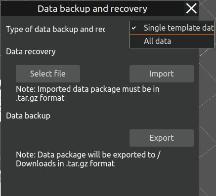

.. centered:: Figure 4-95   Pop up window of the "Import" button

.. figure:: analysis/4/96.png
    :align: center
    :width: 3in

.. centered:: Figure 4-96   Terminal display information when language file import is successful

If the terminal displays "CSV file import failed", as shown in Figure 4-97, you can check the error message in the log record, and carefully check whether the imported CSV file is inconsistent with the originally exported CSV file in terms of the number of rows, columns, and the Chinese delimiter "；" between columns.

.. figure:: analysis/4/97.png
    :align: center
    :width: 3in

.. centered:: Figure 4-97   Terminal display information when language file import fails

.. important::
    When modifying the content of "translation_text", it is necessary to refer to the field length of the Chinese text of "source_text". If the translation value is too long, please use abbreviations appropriately, otherwise the corresponding control text in the AIRLab interface may not be displayed completely.

(3) User modifies existing language in AIRLab

If the user needs to modify an existing language in AIRLab, they first need to click the "Export" button to export the CSV file of that language; After the modification is completed, copy the file to the execution directory of AIRLab software, click the "Import" button, select the modified file to import, and the terminal displays "CSV import successful". After restarting the software, the language modification is completed.

Considering the different usage habits of AIRLab English users, AIRLab-V1.0.2 version has designed the unit of measurement switching as a configuration item for users to choose whether to switch millimeters to inches, as shown in Figure 4-98.

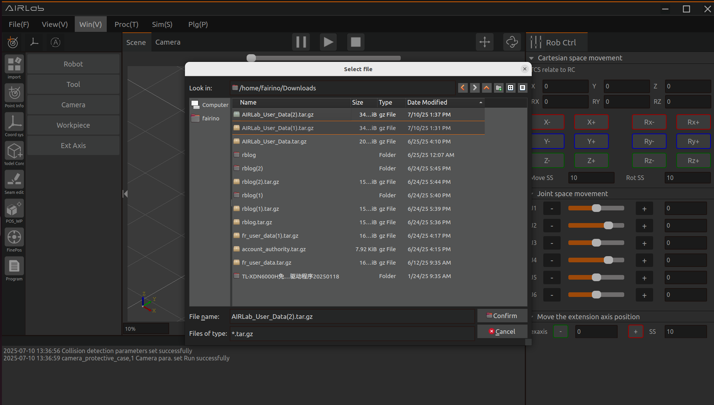

.. centered:: Figure 4-98   UI interface for switching measurement units

After the user selects the measurement unit to switch, the input box labeled in millimeters on the AIRLab interface will be converted to inches, as shown in Figure 4-99 and Figure 4-100.

.. figure:: analysis/4/99.png
    :align: center
    :width: 7.5in

.. centered:: Figure 4-99   Before switching units of measurement

.. figure:: analysis/4/100.png
    :align: center
    :width: 7.5in

.. centered:: Figure 4-100   After switching units of measurement

Subpage Parsing
--------------------------
This section describes all the sub-page functions in the AIRLab software.

Robot import settings
~~~~~~~~~~~~~~~~~~~~~~~~~
As shown in Figure 4-101, select the robot model, the existing FR3, FR5, FR10, FR16 and FR20, click the "Import" button, the corresponding model of the robot will be displayed in the scene, as shown in Figure 4-102, and at the same time, the corresponding node will be added to the project tree.

After importing the robot model, set the tilt angle and rotation angle of the robot, and click "OK" button, the robot will be transformed according to the set tilt angle and rotation angle.

.. figure:: analysis/4/101.png
    :align: center
    :width: 3in

.. centered:: Figure 4-101  Importing Robot Settings

.. figure:: analysis/4/102.png
    :align: center
    :width: 7.5in

.. centered:: Figure 4-102  Importing Robot Success

Workpiece import settings
~~~~~~~~~~~~~~~~~~~~~~~~~~~~
As shown in Figure 4-103, click "Open" button in the "Workpiece Import Settings" sub-screen. The "Select wobj" pop-up window appears, select the workpiece model to be imported, click "open" to import the workpiece model, and click "cancel" to cancel the import.

.. figure:: analysis/4/103.png
    :align: center
    :width: 7.5in

.. centered:: Figure 4-103  Importing a Workpiece

After importing the workpiece model, you can set the coordinate system of the workpiece, click "Save Workpiece Coordinate System" button, the workpiece will be transformed according to the set coordinates.

Tool import settings
~~~~~~~~~~~~~~~~~~~~~~~~~
As shown in Figure 4-104, click the "Open" button in the "Tool Import Settings" sub-screen. The "Select tool" pop-up window appears, select the tool model to be imported, click "open" to import the tool model, and click "cancel" to cancel the import.

.. figure:: analysis/4/104.png
    :align: center
    :width: 4.5in

.. centered:: Figure 4-104(a)  Import_tool pop window

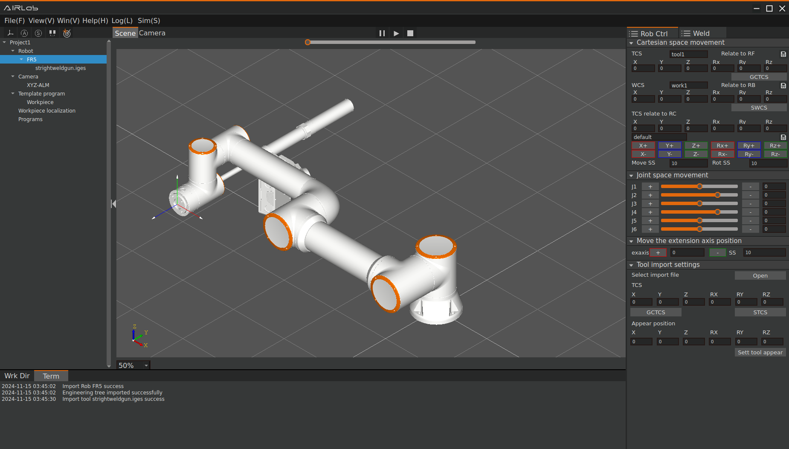

.. centered:: Figure 4-104(b)  Tool import success
.. centered:: Figure 4-104    Import Tool  

After importing the tool model, set the tool coordinate system, click "Save Tool Coordinate System" to save the current tool coordinate system; set the tool appearance position, click "Set Tool Appearance", the appearance of the tool model in the scene will be transformed in accordance with the set tool appearance Click "Set Tool Appearance", the appearance of the tool model in the scene will be transformed according to the set tool appearance.

Point information
~~~~~~~~~~~~~~~~~~~~~~~
As shown in Figure 4-105, click “MoveL()” or “MoveC()” on the left side of the project tree to bring up the sub-interface of “Points Information”, and then select the program statement. Bind the welding process.

.. figure:: analysis/4/105.png
    :align: center
    :width: 2.5in

.. centered:: Figure 4-105  “Point Information” sub-screen

Select whether to bind the welding process and select the welding process, click  the same time you can add, modify and delete the welding process. For details, please refer to Figure 4-106 Welding process inquiry pop-up window.

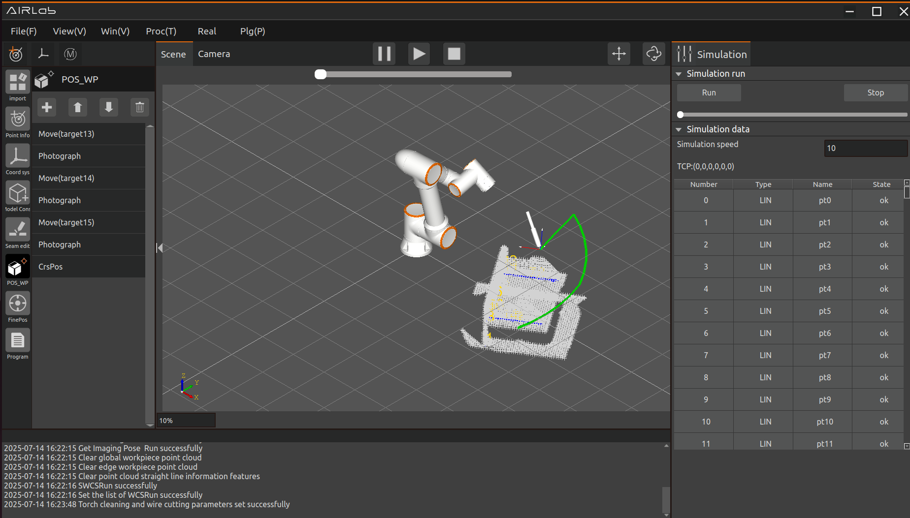

.. centered:: Figure 4-106  Welding Process Inquiry

Click the “Finish” button to bind the welding process to the program statement after the setting is completed. After successful binding, the terminal outputs the binding success message.

.. figure:: analysis/4/107.png
    :align: center
    :width: 3.5in

.. centered:: Figure 4-107  Welding process binding success

Select whether the multi-layer multi-pass welding and multi-pass welding process selection, click on the “process query” to view the multi-pass welding process of multi-layer welding process specific information, at the same time you can multi-pass welding process for multi-pass welding to add, modify or delete operations. For details, please refer to Figure 4-108 Multi-layer welding process inquiry pop-up window.

.. figure:: analysis/4/108.png
    :align: center
    :width: 3in

.. centered:: Figure 4-108  Multi-layer Multi-pass Welding Welding Process Inquiry

When the setting is completed, click the “Finish” button to bind the program statement to the multi-layer multi-pass welding process. After successful binding, the terminal outputs the message of successful binding.

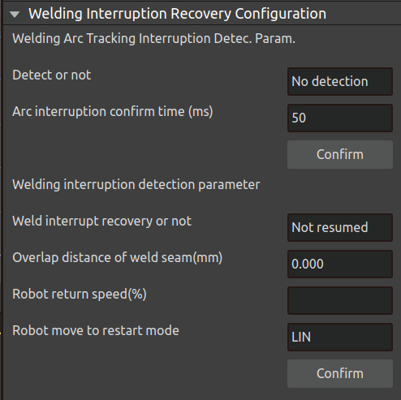

.. centered:: Figure 4-109  Successful binding of multi-layer multi-pass welding process

After the welding process and multi-layer multi-pass welding process are bound, click on the “Program Generation” button, and the welding program will be automatically generated from the engineering tree on the left side.

.. figure:: analysis/4/110.png
    :align: center
    :width: 2.5in

.. centered:: Figure 4-110    Generating Welding Programs

Point modification
~~~~~~~~~~~~~~~~~~~~~~~
Click on the left side of the project tree points, such as Figure 4-111, jump to the "point information modification" sub-interface, such as Figure 4-112, you can modify the currently selected point information in the sub-page.

.. figure:: analysis/4/111.png
    :align: center
    :width: 2.5in

.. centered:: Figure 4-111  Modifying Points in the Project Tree

.. figure:: analysis/4/112.png
    :align: center
    :width: 3in

.. centered:: Figure 4-112  "Point Modification" sub-screen

- Move to Target Point: Click this button to give a command to move the physical robot to the location where the record point is stored.

- Teach Current Position: Click this button to get the current position information of the robot in the AIRLab scene and store it.

- Save Modified Points: Click this button to get the positions of X, Y, Z, RX, RY, RZ in the point information modification sub-interface and store them (this operation is used for storing the points after they are selected, and clicking on the positions on the artifacts in the 3D scene will cause a small circle to appear, and at the same time, it will update the Cartesian information of the selected positions to the X, Y, Z, RX, RY, RZ areas in the point information modification sub-interface).

As shown in Figure 4-113, in the scene display box on the workpiece model, click the left mouse button to mark the new point or modify the "point information modification" sub-interface on the point coordinates, click on the "Save Modified Points" button, you can modify the coordinates of the original point. Target12 is modified from the point shown in the figure left to the point shown in figure right.

.. figure:: analysis/4/113.png
    :align: center
    :width: 6in

.. centered:: Figure 4-113  Point target12 modification process        

Working procedure
~~~~~~~~~~~~~~~~~~~
Click on the left side of the project tree "program" node, as shown in the figure, the sub-interface jumped to the "work program", as shown in Figure 4-114.

.. figure:: analysis/4/114.png
    :align: center
    :width: 7.5in

.. centered:: Figure 4-114  Work Program sub-screen

As shown in Figure 4-115, the specific functions of the Work Program sub-interface are Simulation Trajectory Generation, Clear Trajectory, Display Tool, Clear Display, Run Program and Stop Program.

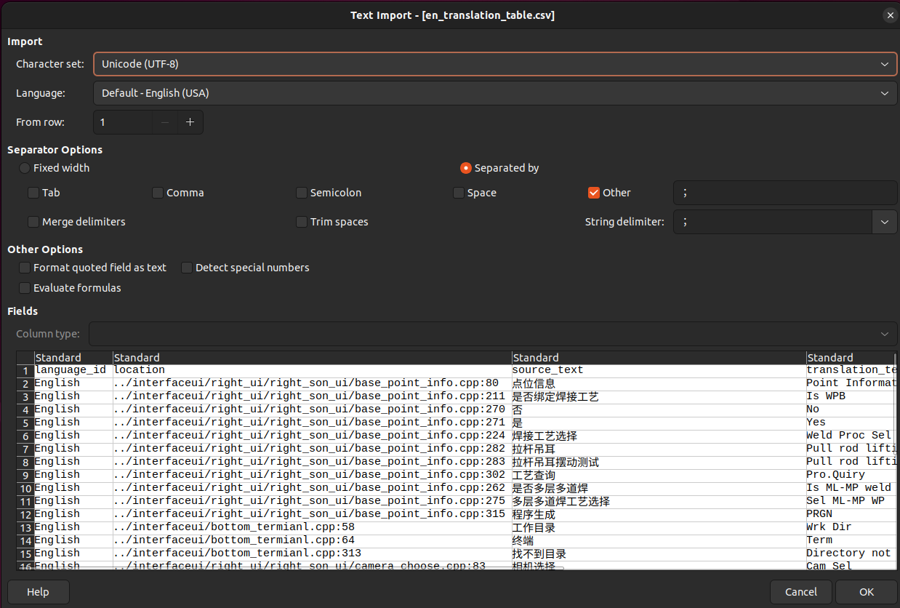

.. centered:: Figure 4-115  Functions of "Work Program" sub-screen

- Simulation Trajectory Generation: Click the "Simulation Trajectory Generation" button, the scene generates the engineering tree in the "program" run in the process of simulation trajectory, as shown in Figure 4-116.

.. figure:: analysis/4/116.png
    :align: center
    :width: 7.5in

.. centered:: Figure 4-116  Program Simulation Trajectory Generation

- Clear Trajectory: Click the "Clear Trajectory" button to clear the simulation trajectory generated in the scene.

- Show Tools: Click on the "Show Tools" button, the scene displays the attitude of the tool at the key points when the program is running, such as Figure 4-117 shows the attitude of the tool at the key points when the work program is running.

.. figure:: analysis/4/117.png
    :align: center
    :width: 5in

.. centered:: Figure 4-117  Work Program Display Tool

- Clear Display: Click the "Clear Display" button to clear the virtual tools generated in the scene.

- Run program: Click "Run program", the solid robot moves according to the trajectory generated by the program.

- Stop Program: Click "Stop Program" to stop the robot movement.

Workpiece positioning program
~~~~~~~~~~~~~~~~~~~~~~~~~~~~~~~
Click the "Workpiece Positioning" node on the left side of the project tree, as shown in Figure 4-118, the sub-interface jumps to the "Workpiece Positioning Program".

.. figure:: analysis/4/118.png
    :align: center
    :width: 7.5in

.. centered:: Figure 4-118  "Workpiece Positioning Program" Sub-Interface

As shown in Figure 4-119, the specific functions of the "Workpiece Positioning Program" sub-interface are to take a picture of the ground, to save the ground, to get a point cloud, to clear the point cloud, to generate a simulated trajectory, to clear the trajectory, to display the tool, to clear the display, to run the program, and to stop the program.

.. figure:: analysis/4/119.png
    :align: center
    :width: 3in

.. centered:: Figure 4-119  Functions of "Workpiece Positioning Program" sub-screen

- Photographing the ground: Move the robot arm to a position parallel to the worktable where the workpiece can be completely photographed, and click the "Take Photo" button to take a photo of the ground. The terminal displays "Successful shooting".

- Save Ground: Saves the ground photos taken.

- Get Point Cloud: Click the "Get Point Cloud" button to generate the point cloud data model of the workpiece in the actual scene and align it with the workpiece model in the virtual scene.

- Clear Point Cloud: Click the "Clear Point Cloud" button to clear the point cloud data of the workpiece in the scene.

- Simulation Trajectory Generation: Click the "Simulation Trajectory Generation" button, the scene generates the engineering tree in the "program" run in the process of simulation trajectory, as shown in Figure 4-120.

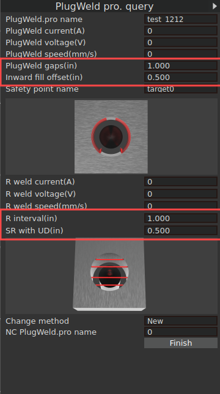

.. centered:: Figure 4-120  Simulation Trajectory Generation for Workpiece Positioning

- Clear Trajectory: Click the "Clear Trajectory" button to clear the simulation trajectory generated in the scene.

- Show Tools: Click on the "Show Tools" button, the scene shows the attitude of the tool at the key points when the program is running, as shown in Figure 4-121 shows the attitude of the tool when the workpiece is positioned, the user can intuitively see the attitude of the tool at the key points.

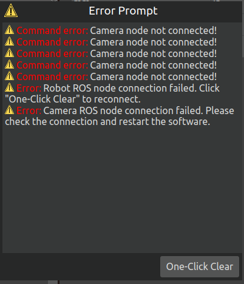

.. centered:: Figure 4-121  Workpiece Positioning Program Display Tool

- Clear Display: Click the "Clear Display" button to clear the virtual tools generated in the scene.

- Run program: Click "Run program", the solid robot moves according to the trajectory generated by the program.

- Stop Program: Click "Stop Program" to stop the robot movement.

Weld template program
~~~~~~~~~~~~~~~~~~~~~~~~~
As shown in Figure 4-122, click the weld template program under "Template Program" in the left engineering tree, and the sub-interface will jump to "Weld Template Program".

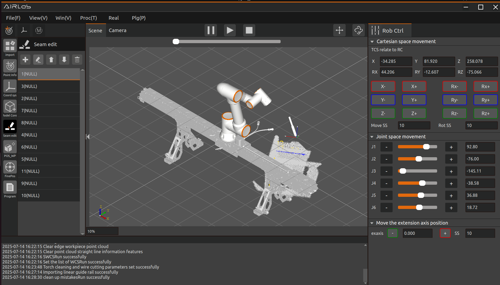

.. centered:: Figure 4-122  "Weld template program" sub-screen

As shown in Figure 4-123, the specific functions of the "Weld Template Program" sub-interface include acquiring a point cloud, clearing a point cloud, generating a simulation trajectory, clearing a trajectory, displaying a tool, clearing the display, running the program, and stopping the program.

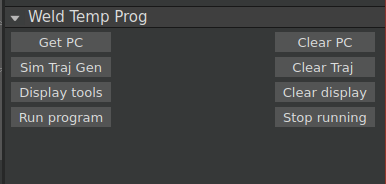

.. centered:: Figure 4-123  "Weld Template Program" sub-screen functions

- Get Point Cloud: Click the "Get Point Cloud" button to generate the point cloud data model of the workpiece in the actual scene and align it with the workpiece model in the virtual scene.

- Clear Point Cloud: Click the "Clear Point Cloud" button to clear the point cloud data of the workpiece in the scene.

- Simulation trajectory generation: Click the "Simulation Trajectory Generation" button, the scene generates the engineering tree in the "program" running the process of simulation trajectory, as shown in Figure 4-124.

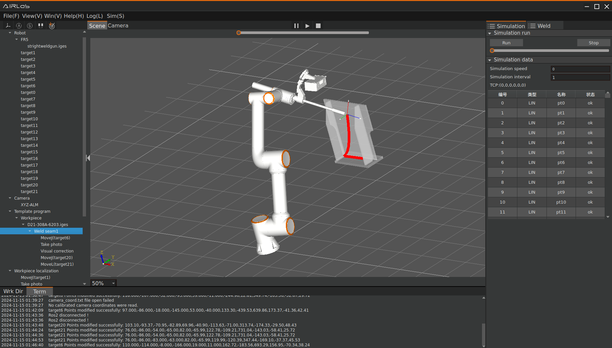

.. centered:: Figure 4-124  Weld template program simulation trajectory

- Clear Trajectory: Click the "Clear Trajectory" button to clear the simulation trajectory generated in the scene.

- Show Tool: Click the "Show Tool" button, the scene shows the posture of the tool at the key points when running the weld template program, as shown in Figure 4-125, users can visualize the posture of the tool at the key points during the running of the weld template program.

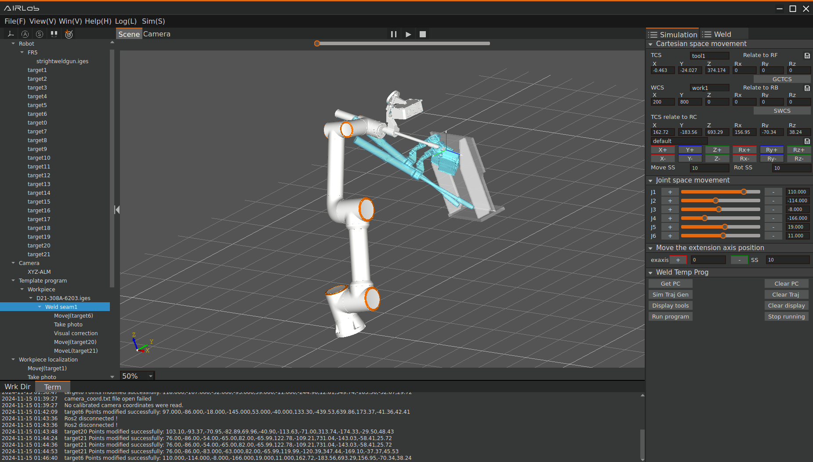

.. centered:: Figure 4-125  Weld Template Program Display Tool

- Clear Display: Click the "Clear Display" button to clear the virtual tools generated in the scene.

- Run program: Click "Run program", the solid robot moves according to the trajectory generated by the program.

- Stop Program: Click "Stop Program" to stop the robot movement.

Photo settings
~~~~~~~~~~~~~~~~~~~
As shown in Figure 4-126, click the "Photo" sub-node of the left engineering tree, and the sub-interface jumps to "Photo Settings".

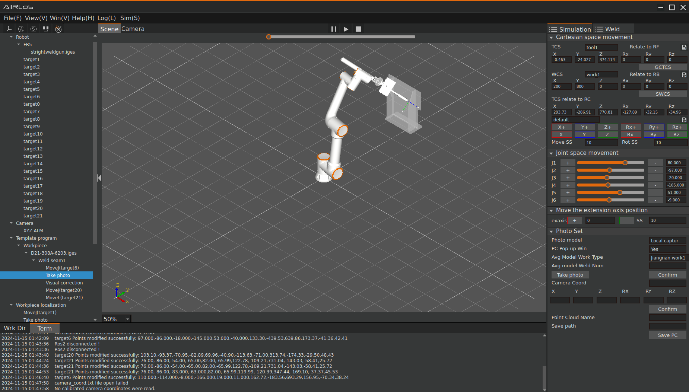

.. centered:: Figure 4-126  "Photo Settings" sub-screen

The main function of the photo setting subpage is to set different photo models according to different welding procedures, and to set the photo points of the model-free workpiece point cloud model. The photo setting subpage is divided into two parts: photo parameter setting and photo point confirmation. The photo parameter setting part is to set the photo parameters to adapt to different welding procedures; the photo point confirmation is to obtain the parameters that need to be set for the photo point for the model-free workpiece modeling program.

Photo shooting parameter settings:

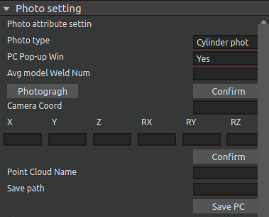

.. centered:: Figure 4-127  Photo shooting parameter setting interface

(1) Photographing model: The photographing model can be selected as global photographing, local photographing, average model photographing, cylindrical photographing, model-free straight line photographing and model-free arc photographing to meet different photographing needs.

- The photographing model in the workpiece positioning program should be set to "global photographing";
- The photographing model in the template program should be set to "average model photographing";
- The photographing model in the cylindrical filling process should be set to "cylindrical photographing";
- The photographing model for model-free straight line weld recognition in the model-free workpiece modeling program should be set to "model-free straight line", and the model-free pure arc photographing type should be set to "model-free arc".

(2) View point cloud popups: 0-view, 1-don't view.

(3) Average model workpiece type: not open yet.

(4) Average model weld number: one or more (Example: 1-1, 1-2, 2-1, 3-2, indicating that it is possible to shoot to the beginning of weld 1, the end of weld 1, the beginning of weld 2, and the end of weld 3).

(5) Confirm (camera coordinates): Not yet open

(6) Save point cloud: Enter the point cloud name and save path to save the point cloud data.

Confirm the photo point:

  The photo point confirmation is for the model-free workpiece modeling program to obtain the parameters required to set the photo point. First, click the "Photo" sub-node under the model-free workpiece modeling program in the project tree, and the sub-interface jumps to the photo setting, and then set the following photo points.

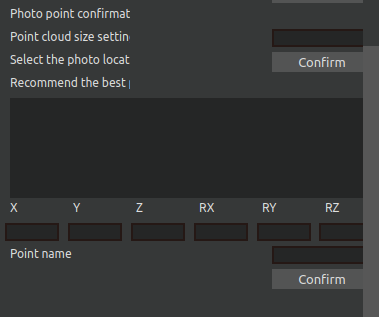

.. centered:: Figure 4-128  Photo point confirmation interface

Point cloud size setting: Set the size of the model-free workpiece point cloud as needed.

Select the location where you want to take a photo: Click the location where you want to take a photo (usually a corner point), click the "OK" button, and the location information will be displayed.

Recommended best location for taking photos: Not yet available

Point name: Enter the point name to save the currently acquired photo point, click "OK", the photo point is saved, and the corresponding point appears in the project tree. At the same time, the previous node of the current photo sub-node generates moveJ(target), where target is the name of the acquired photo point.

Welding camera properties
~~~~~~~~~~~~~~~~~~~~~~~~~~~
As shown in Figure 4-129, click the camera model under the "Camera" node of the project tree, and the sub-interface will jump to "Welding Camera Properties". In the "Welding Camera Properties" sub-interface for camera calibration, manual calibration and automatic calibration. First, adjust the camera to a suitable position as the initial position of the camera calibration, and then carry out manual or automatic calibration.

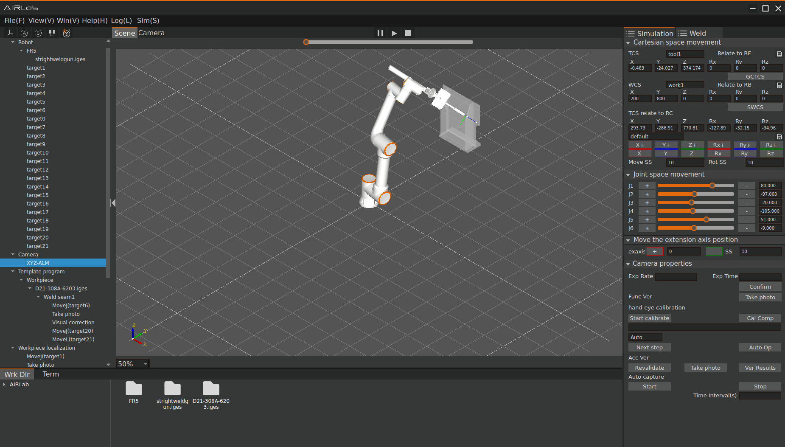

.. centered:: Figure 4-129  Weld Camera Properties sub-screen

- Manual calibration: Select "Manual", the input box displays "Entering manual mode, please click Next"; click the "Next" button, the camera changes the corresponding position and takes pictures. Click the "Next" button, the camera will change its position and take photos accordingly.

- Auto Calibration: Select "Auto", enter "Display entering auto mode, the robot is about to move automatically, please do not operate" in the input box; click the "Auto Run" button, the camera will take eight photos in a row to automatically calibrate the camera. Click the "Auto Run" button, the camera will take eight photos in a row to calibrate the camera automatically.

Welding camera attribute accuracy verification (need to have been calibrated 3-5 times)

- "Re-verify" button: Clear the photo information for accuracy verification.

- "Take a picture" button: Take a picture for accuracy verification.

- "Verify Results" button: After the mobile robot has photographed the calibration plate three times, clicking on Verify Results displays the results of the hand-eye calibration accuracy verification and applies the best one calibration result.

- "Start" button: not yet available.

- "Stop" button: not yet available.

Importing extension axis
~~~~~~~~~~~~~~~~~~~~~~~~~~~~~
The function of this page is to import the extension axis and set the position of the extension axis.

- Select Extended Axis ComboBox: determines the type of extended axis to be imported.

- "Import" button: After clicking on it, the extended axes just selected will appear in the scene of the AIRLab software, as shown in the figure.

- Exaxispos text edit box: Set the value in the text box to change the position of the robot on the extended axis, as shown in Figure 4-130.

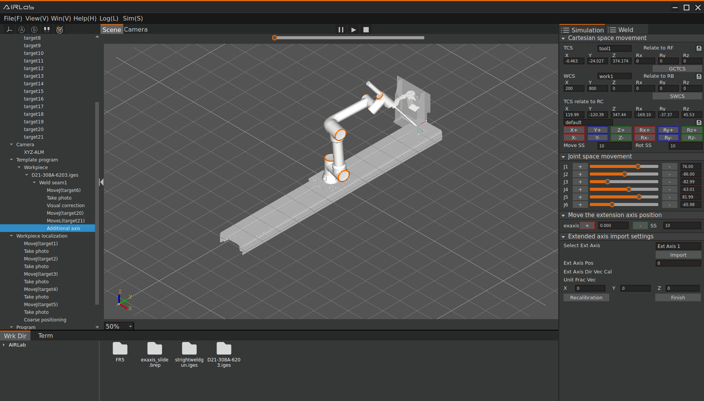

.. centered:: Figure 4-130  Extended Axis Import Settings

Camera selection
~~~~~~~~~~~~~~~~~~~
Click the "Camera" node in the project tree on the left, and the sub-interface will jump to "Camera Selection", as shown in n Figure 4-131. In this interface, you can view the camera connection status and select the camera manufacturer, and set the camera parameters according to different shooting scenes.

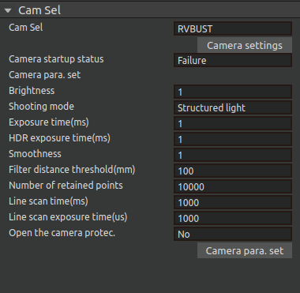

.. centered:: Figure 4-131  "Camera Selection" sub-screen

First, select the camera manufacturer. There are four manufacturers' cameras available: Ruben, XYZ, Weishi, and Yabohan. Then click the "Camera Settings" button to confirm the selected camera.

If the camera is successfully connected, the camera startup status is "successful", otherwise it is "failed" and the camera needs to be reconnected.

After the camera is selected and connected successfully, the camera parameters can be set, including brightness, shooting mode, exposure time, etc. The following is a detailed introduction to the camera parameters.

- Brightness: Controls the brightness of the camera image.
  
- Shooting mode: You can choose from three shooting modes: structured light, line scan, or 2D to meet different shooting needs.
  
- Exposure time (ms): Controls the length of time the camera is exposed. Increasing the exposure time can make the image brighter, and reducing the exposure time can make the image darker.

- HDR exposure time (ms): Sets the exposure time of the high dynamic range (HDR) image.

- Smoothness: Controls the smoothness of the image. Increasing the smoothness can reduce the noise and noise of the image, and reducing the smoothness can retain more image details.

- Filter distance threshold (mm): Sets the distance threshold for image filtering. The filter distance threshold determines which areas in the image need to be filtered.

- Number of retained points: Sets the number of points retained in the image. Increasing the number of retained points can retain more image details, and reducing the number of retained points can reduce the noise and noise of the image.

- Line scan time (ms): Sets the length of time the camera performs line scans.

- Line scan exposure time (us): Sets the length of time the line scan exposures.

- Whether to open the camera protective case: Set whether to open the camera protective case.

Set the above camera parameters according to the specific conditions of the shooting scene and shooting requirements. After the settings are completed, click "Camera Parameter Settings" to save the settings.

Reference coordinate system
~~~~~~~~~~~~~~~~~~~~~~~~~~~~~~~~~
Click the “ref_coord” node in the project tree to jump to the “Reference Coordinate System” sub-page, as shown in Figure 4-132.

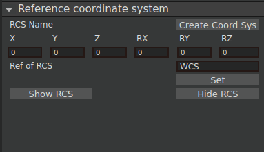

.. centered:: Figure 4-132  "Reference coordinate system" sub-screen

Enter the value of the reference coordinate system to be set, and select the reference coordinates of the reference coordinate system as “Workpiece coordinate system” or “Base coordinate system”. Click “Set” to set the reference coordinate system.

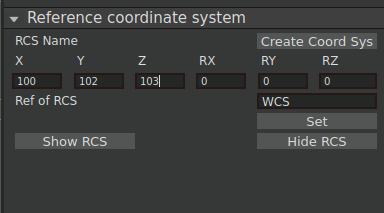

.. centered:: Figure 4-133  Setting the Reference Coordinate System

After successful setting, the terminal outputs “Coordinate system position set successfully”.

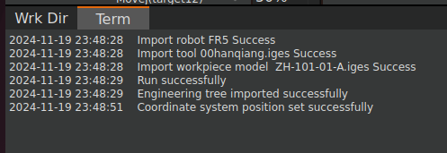

.. centered:: Figure 4-134   Reference coordinate system set successfully

The reference coordinate system can be selected to be displayed or hidden; click the “Show Reference Coordinate System” button, and the set reference coordinate system appears in the scene. The terminal outputs the message “Set coordinate system display status successfully”.

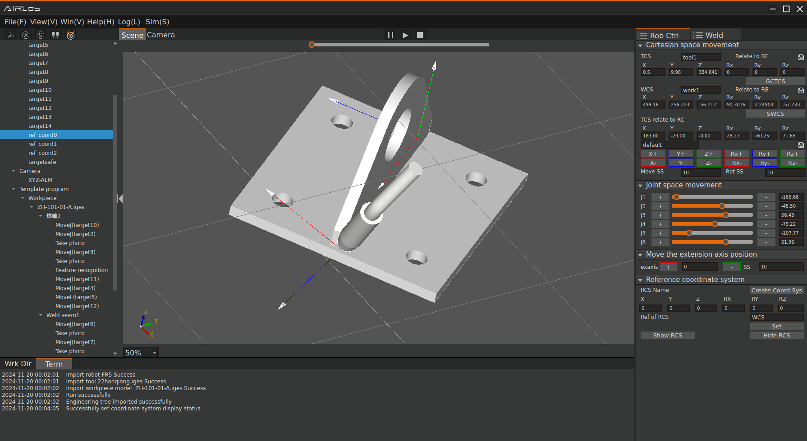

.. centered:: Figure 4-135   Display reference coordinate system

Click the “Hide Reference Coordinate System” button to hide the reference coordinate system in the scene. After setting the state of the reference coordinate system, the terminal outputs the message “Setting the state of the coordinate system display is successful”.

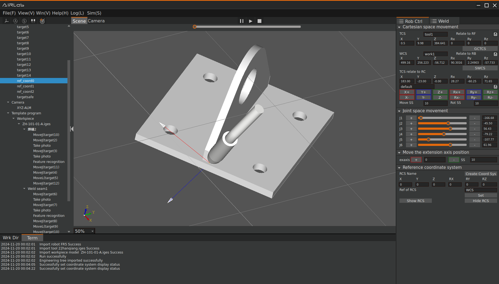

.. centered:: Figure 4-136   Hide the reference coordinate system

No-model workpiece modeling program
~~~~~~~~~~~~~~~~~~~~~~~~~~~~~~~~~~~~~~~
The function of the model-free workpiece modeling program is to create a model for the model-free workpiece. To run the model-free workpiece modeling program, you need to create the model-free workpiece modeling program first. For details, see Section 4.5.5. Click the "Model-free Workpiece Modeling" node in the project tree, and the sub-interface jumps to the "Model-free Workpiece Modeling Program". The specific functions of the "Model-free Workpiece Modeling Program" sub-interface include obtaining model data, clearing modeling data, generating simulation trajectories, clearing trajectories, generating virtual tools, clearing tools, running programs, and stopping programs.

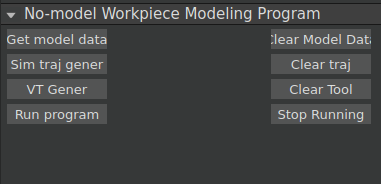

.. centered:: Figure 4-137   No-model workpiece modeling program

- Generate simulation trajectory: Click this button to generate the simulation trajectory of the "Model-less Workpiece Modeling Program" in the project tree in the scene.

- Clear trajectory: Click this button to clear the simulation trajectory generated in the 3D scene.

- Run program: Click the Run program button, and the physical robot moves, takes pictures, and builds models according to the instructions of the created model-less workpiece modeling program (you can generate simulation trajectories before running the program, and then run the program after confirming the trajectory). When the program runs to the "Photograph" subnode, a pop-up window of the collected point cloud will appear in the 3D scene, displaying the point cloud collection results in real time and splicing them until the complete workpiece point cloud is displayed. As shown in Figure 4-138.

.. centered:: Figure 4-138   Model-free point cloud acquisition process diagram

After the "Model Build" command is executed, the successfully built workpiece model and weld number will be displayed in the 3D scene, as shown in Figure 4-139 and Figure 4-140.

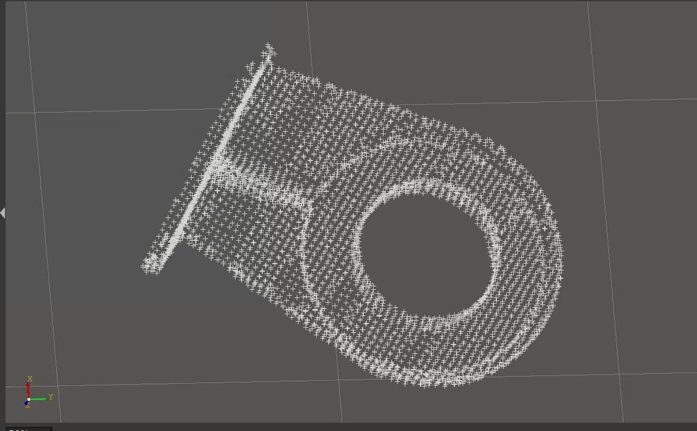

.. centered:: Figure 4-139   Build result diagram of model-less artifacts

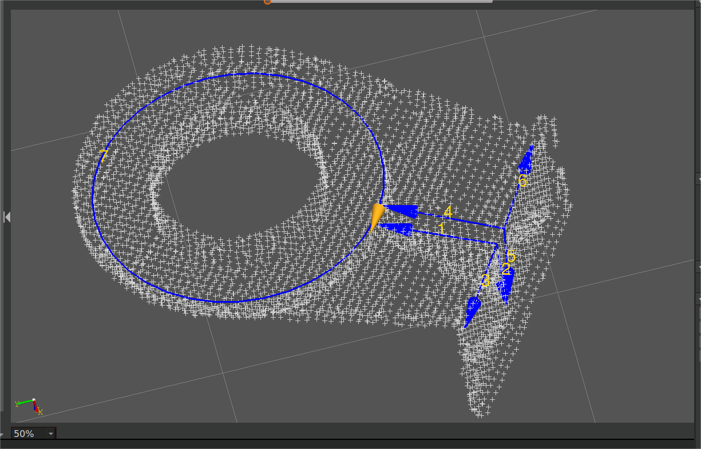

.. centered:: Figure 4-140   Constructed weld number

- Stop program: Click this button, and the actual robot will immediately stop running the model-free workpiece modeling program.

- Get model data: Click this button, and the AIRLab interface will display the weld number obtained by the construction. If the user is building a model-free workpiece, after the construction is completed, the workpiece model and weld number will be automatically displayed on the interface, and there is no need to click this button to obtain them; only when the user opens a previously successfully built workpiece, the interface will only display the workpiece model. At this time, you need to click this button to obtain the weld number, and the result is shown in Figure 4-141.

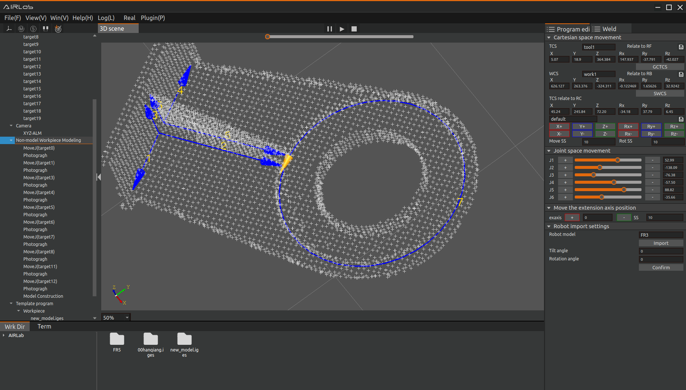

.. centered:: Figure 4-141   Obtaining the weld seam number of the workpiece

- Clear modeling data: Clicking this button will clear the weld seam numbers displayed on the interface, as shown in Figure 4-142.

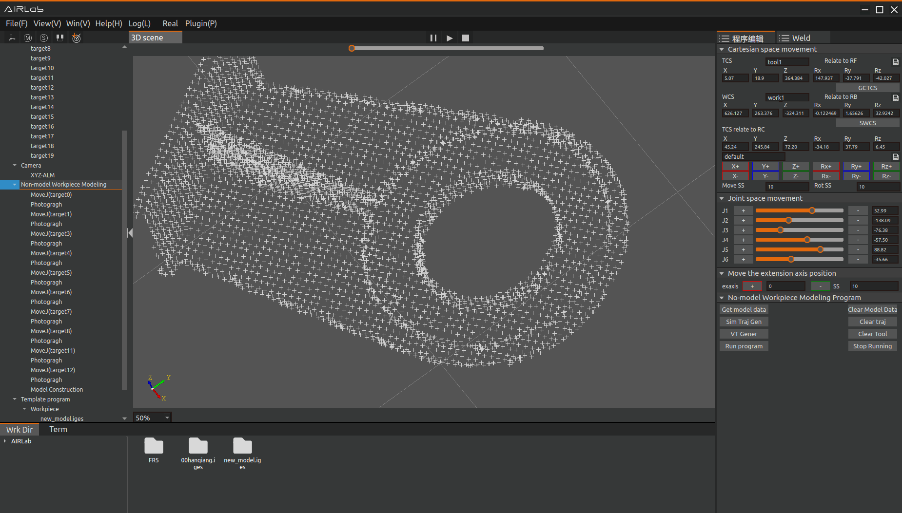

.. centered:: Figure 4-142   Clearing the weld seam number of the workpiece on the AIRLab interface

- Simulation trajectory generation: Click this button to generate the simulation trajectory during the running process of the "model free workpiece modeling program" in the engineering tree in the scene.
  
- Clear Tool: Click this button to clear the virtual tools generated in the scene.
  
Model construction
~~~~~~~~~~~~~~~~~~~~~~~~~
Click on the "Model Construction" sub node under the "Model free Workpiece Modeling" node in the left engineering tree, as shown in Figure 4-143, and the sub interface will jump to "Model Construction".

The user selects the construction algorithm (AIRLab currently provides a construction algorithm: Algorithm 1) on the model construction page and sets the workpiece name for the workpiece to be constructed. As shown in the figure, after setting up, click the "OK" button. This step needs to be set up before running the "Model free Workpiece Modeling" node program in the engineering tree.

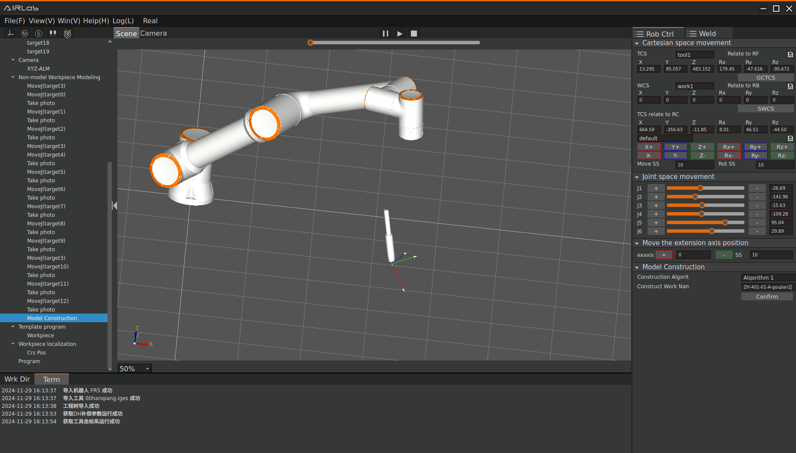

.. centered:: Figure 4-143   Model construction subpage

Cylinder Filling Instruction Configuration
~~~~~~~~~~~~~~~~~~~~~~~~~~~~~~~~~~~~~~~~~~~~~~~
Right click on the "Weld" node in the left engineering tree, select "PlugWeld" to add a new child node, click on the node as shown in Figure 4-144, and switch to "Cylinder Filling Instruction Configuration" on the right sub page. Users can edit the welding process according to their actual welding needs, which is mainly divided into two parts: cylindrical filling and cylindrical surface reinforcement. The left figure in Figure 4-145 is a schematic diagram of the cylindrical workpiece to be welded, and the right figure is a schematic diagram of the welding process.

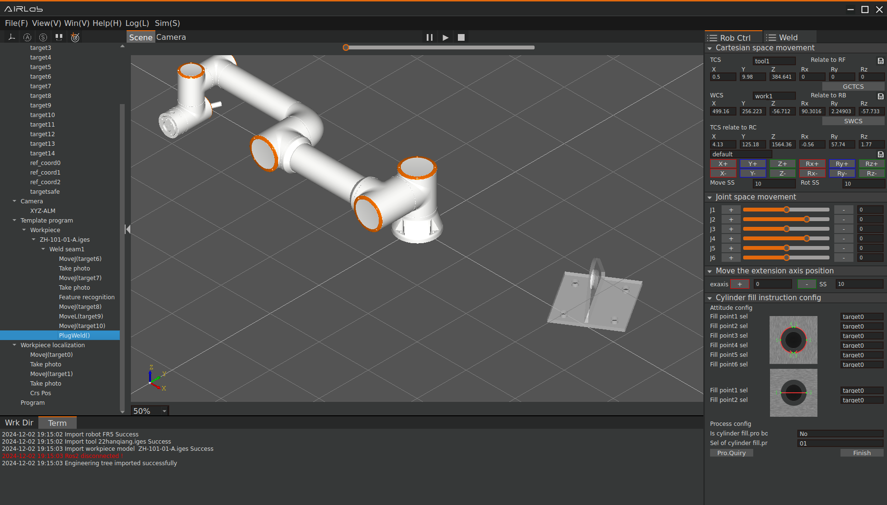

.. centered:: Figure 4-144   Cylinder filling instruction configuration subpage

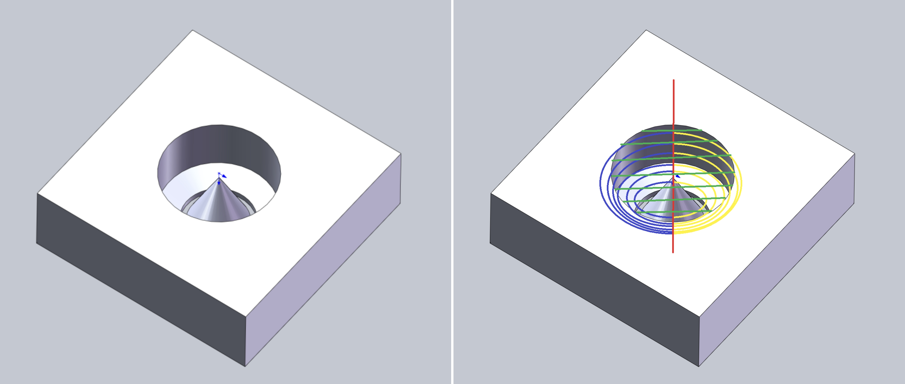

.. centered:: Figure 4-145   Schematic diagram of cylindrical workpiece (left)  Welding process schematic diagram (right)

The following is an introduction to the usage of this process:
Right click on PlugWeld in the weld engineering tree node, add the cylinder filling instruction configuration node, click PlugWeld to jump to the cylinder filling instruction configuration, as shown in the figure, set 6 filling postures and 2 reinforcement postures for the cylinder filling process, select whether to bind the cylinder filling process and the bound cylinder filling process, click the "Process Query" button, and a cylinder filling process query pop-up window will appear, as shown in Figure 4-146. The detailed function introduction of this pop-up window can be found in Chapter 4.6.6.

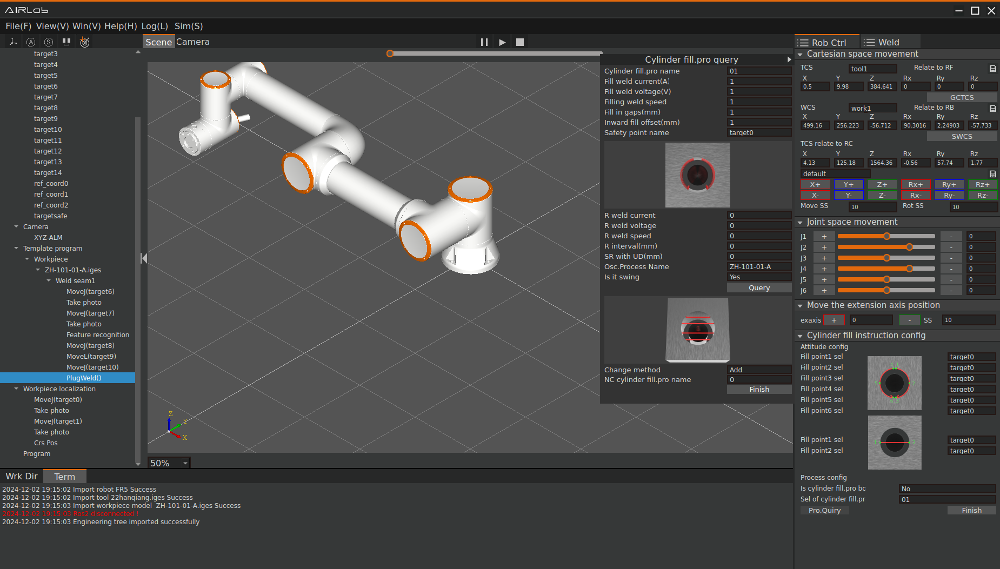

.. centered:: Figure 4-146   Cylinder filling process query

Click on 'Finish' to configure the cylinder filling instruction, and finally run the welding seam program to generate the instruction under the program node, Then run the instruction under the program node.   