AIRLab Software Analysis
============================
.. toctree:: 
    :maxdepth: 5

The initial interface of the AIRLab software is shown in Figure 4-1 and is divided into five main sections. In the middle of the interface is the main display box (divided into scene display and camera display), on the top is the menu bar, on the leftmost side is the engineering module area, on the rightmost side is the operation area, and at the bottom of the interface is the command feedback area. This section will provide a detailed description of the functions and usage of the above areas, the pop-up windows and other pages that appear in the AIRLab software, and the sub-page functions.

.. figure:: analysis/4/1.png
	:align: center
	:width: 7.5in

.. centered:: Figure 4-1  AIRLab Software Initial Interface

Menu Bar
--------------------------
The menu bar contains all the contents shown in Figure 4-2, mainly buttons: “File”,“View”,“Window”,"Process“,“Simulation”,”Plug-ins", and the icon buttons (in order from left to right): Mode Switching, Running Status, Ros2 Communication, Points Added, Coordinate System Added, Pause Running, Start Running, Stop Running.

.. figure:: analysis/4/2.png
	:align: center
	:width: 6in

.. centered:: Figure 4-2  AIRLab Menu Bar

File
~~~~~~~~~~~~~~~~~~~
Click the“File”button, the menu shown below will appear:“New”,“Open“, “Export”.The menu will appear as shown below:“New”,“Open”,“Export”. How to use it is described below:

.. figure:: analysis/4/3.png
	:align: center
	:width: 1.5in

.. centered:: Figure 4-3  AIRLab Menu Bar - File

Select “New” click, as shown in the figure, “New Project” pop-up window, select the type of welding project in the pop-up window, click “confirm” button to complete the project new.

.. figure:: analysis/4/4.png
	:align: center
	:width: 2.5in

.. centered:: Figure 4-4  AIRLab Menu Bar - File - New 

Select “Open” click, the “Select Project” pop-up window appears, find the path of the project, select the double-click or click on the pop-up window after clicking the “Open” button, that is, import the project successfully.

.. figure:: analysis/4/5.png
	:align: center
	:width: 4in

.. centered:: Figure 4-5  AIRLab Menu Bar - File - Open

Select “Export” and click “Save Project” pop-up window, this function will save AIRLab's current project under user-defined path. After naming the project in the “File name” column of the popup window, click “Save” to complete the export of the current project.

.. figure:: analysis/4/6.png
	:align: center
	:width: 4in

.. centered:: Figure 4-6  AIRLab Menu Bar - File - Export

View
~~~~~~~~~~~~~~~~~~~
View contains 12 functions, as shown in Figure 4-7, the main function is to adjust the viewing angle of the robot in the main display frame. They are: Zoom, Pan, Rotate, Reset, Fit all, Front view, Back view, Top view, Bottom view, Left view, Right view, and Full view.

.. centered:: Figure 4-7  AIRLab Menu Bar - View

See Table 4-1 for a description of the specific functions of the view.

.. centered:: Table 4-1  View Function Description Table

.. image:: analysis/4/表4-1.png
	:align: center
	:width: 6in

Window
~~~~~~~~~~~~~~~~~~~
The “Window” contains seven secondary options, namely “Software Upgrade”, “Welding Data Acquisition”, "About", "Log", “Virtual Camera”, “Global Settings”, “Clear Gun and Cut Wire”. By clicking on different options, AIRLab displays different function pop-ups. The “Software Upgrade” pop-up window is shown in Figure 4-9, the “Welding Data Acquisition” pop-up window is shown in Figure 4-10, the “About” pop-up window is shown in Figure 4-11, and the “Log” pop-up window is shown in Figure 4-11. “Log” as shown in Figure 4-12, “Virtual Camera” pop-up window as shown in Figure 4-13, “Global Settings” as shown in Figure 4-14, “Gun Clearing and Wire Cutting” is shown in Figure 4-15,”Automatic loop operation” as shown in the Figure 4-16. Detailed functions and usage description are shown in section 4.6 of the pop-up window.

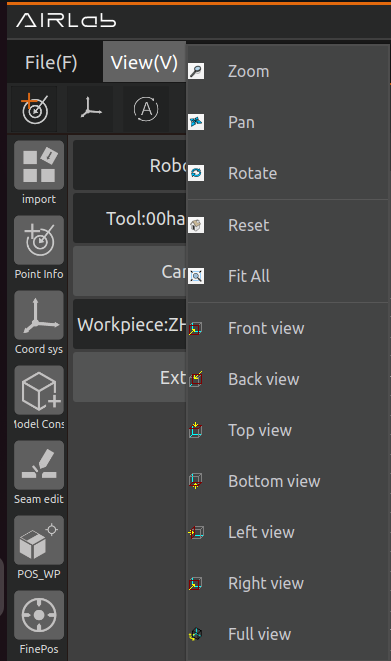

.. centered:: Figure 4-8   AIRLab Menu Bar-Window

.. figure:: analysis/4/9.png
	:align: center
	:width: 3in

.. centered:: Figure 4-9  AIRLab Menu Bar-Window-Software Upgrade    

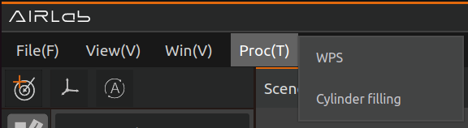

.. centered:: Figure 4-10  AIRLab Menu Bar-Window-Weld Data Acquisition

.. figure:: analysis/4/11.png
	:align: center
	:width: 2.5in

.. centered:: Figure 4-11  AIRLab Menu Bar - Window - About

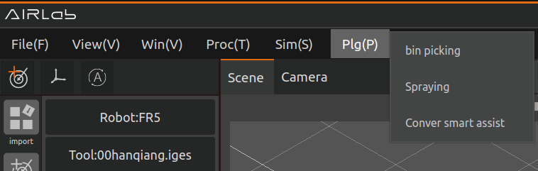

.. centered:: Figure 4-12  AIRLab Menu Bar - Window - Logs

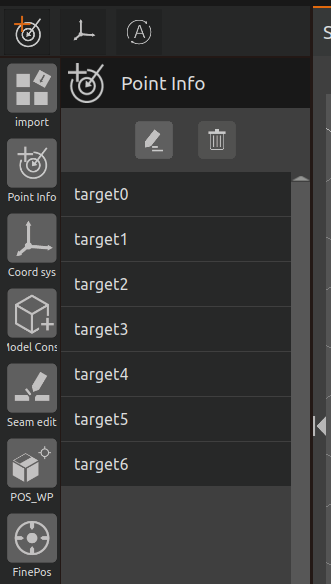

.. centered:: Figure 4-13  AIRLab Menu Bar - Window - Virtual Camera

.. centered:: Figure 4-14  AIRLab Menu Bar-Window-Collision Detection Global Settings

.. centered:: Figure 4-15  AIRLab Menu Bar - Window - Gun Clearing and Filament Cutting Settings

.. centered:: Figure 4-16  Automatic loop operation

Process
~~~~~~~~~~~~~~~~~~~
The “Process” includes “Welding Process” and “Cylindrical Filling”, according to the process need to select different processes, click the option to appear corresponding function pop-up window. The “Welding Process” and “Cylindrical Filling” pop-up windows are shown in the figure below.

.. figure:: analysis/4/17.png
	:align: center
	:width: 3in

.. centered:: Figure 4-17  AIRLab Menu Bar - Process

.. figure:: analysis/4/18.png
	:align: center
	:width: 3.5in

.. centered:: Figure 4-18  AIRLab Menu Bar-Process-Welding Processes

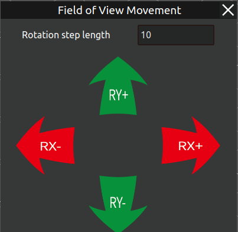

.. centered:: Figure 4-19  AIRLab Menu Bar - Process - Cylindrical Filling

Simulation
~~~~~~~~~~~~~~~~~~~
This button is used to switch between the simulation robot and the real robot. Before using this button, you need to successfully import or create a project and successfully establish Ros2 communication connection with the real robot. Clicking this button after completing the above prerequisites will enable switching between the virtual robot and the physical robot both. After switching the real robot, the robot pose displayed in the AIRLab scene will be synchronized with the actual robot, as shown in Figure 4-20.

.. figure:: analysis/4/20.png
	:align: center
	:width: 3in

.. centered:: Figure 4-20  AIRLab display after live switching

Simulation Scene: used for simulation will not synchronize and update the robot position in the 3D scene in real time; 

Real Scene: update the current tool coordinate system, DH compensation parameters are consistent with the actual robot, and the robot position in the 3D scene is consistent with the physical robot.

Plugin
~~~~~~~~~~~~~~~~~~~

In order to enhance the scalability and user experience of AIRLab software, AIRLab provides plug-in modules, allowing users to develop plug-ins that meet their needs. These plug-ins can be loaded into AIRLab software through dynamic libraries (.so), thereby expanding and enhancing the software functions. The existing plug-ins include three functional modules: bin pickinging, spray, and conversational intelligent assistant. For the introduction and specific operations of each plug-in, please refer to the plug-in section in Chapter 5.

Mode switching
~~~~~~~~~~~~~~~~~~~

After the AIRLab software establishes Ros2 communication with the physical robot, the user can switch the mode status of the physical robot by clicking on this button. “A” means that the current robot is in automatic mode, and “M” means that the current robot is in manual mode. In addition, clicking this icon in automatic mode will switch the robot mode to manual, and clicking this icon in manual mode will switch the robot mode to automatic.

Running status
~~~~~~~~~~~~~~~~~~~

The icon button is used to display in real time the current operational status of the physical robot, where “S” indicates that the robot has stopped running, “R” indicates that the robot is in the middle of a running program, and “P” indicates that the robot is in a suspended operational state.

Ros2  communication
~~~~~~~~~~~~~~~~~~~~~~~~~

The icon button is used to monitor the connection status of the camera and Ros2 in real time, when the communication between the camera and Ros2 are connected successfully or Ros2 is connected successfully and the camera is not connected, the icon will show the connection success, as in the left figure; otherwise the icon shows the connection failure, as in the right figure.

.. centered:: Figure 4-21 ROS2 communication connection status (the left figure shows the connection succeeded, the right figure shows the connection failed)

Points added
~~~~~~~~~~~~~~~~~~~~~~~~~

This function is used to quickly record the current point position of the robot. After clicking the button, a new point position targetX will be added under the "Robot" node in the Engineering tree, and the function of X is to prevent the new point position from being renamed, as shown in Figure 4-22. The j1, j2, j3, j4, j5, j6, x, y, z, rx, ry, rz information of this point is the current joint coordinates and Cartesian coordinates of the robot.

.. figure:: analysis/4/22.png
	:align: center
	:width: 2in

.. centered:: Figure 4-22  AIRLab Menu Bar - Point Additions

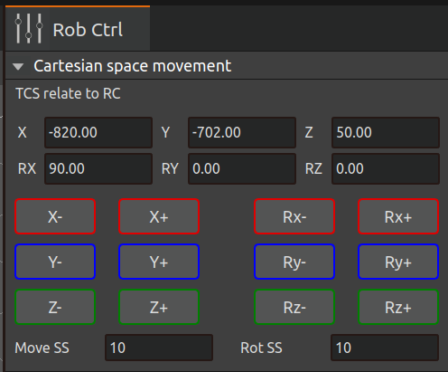

.. centered:: Figure 4-23  AIRLab Terminal - Printing of Point Addition Successful Information

Coordinate system creation
~~~~~~~~~~~~~~~~~~~~~~~~~~~~~~~~~~

By clicking on this button, AIRLab creates a new reference coordinate system for weld offset and welding process aspects, assisting the user to quickly and accurately complete the weld/path offset setup.

.. figure:: analysis/4/24.png
	:align: center
	:width: 2in

.. centered:: Figure 4-24  AIRLab Menu Bar-Reference Coordinate System

By clicking on the reference coordinate system, you can choose to delete the coordinate system or edit it.

.. figure:: analysis/4/25.png
	:align: center
	:width: 3in

.. centered:: Figure 4-25  AIRLab Menu Bar-Reference Coordinate System-Menu

Click “Edit Coordinate System” and a pop-up window “Reference Coordinate System” appears.

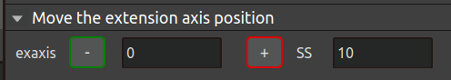

.. centered:: Figure 4-26  AIRLab Menu Bar-RCS-Edit CS

You can select the reference coordinate system of the reference coordinate system is the workpiece coordinate system, the base coordinate system or the world coordinate system, set the position of the coordinate system, and select whether to display this reference coordinate system. Figure 4-27 shows the coordinate system displayed, and Figure 4-28 shows the coordinate system not displayed.

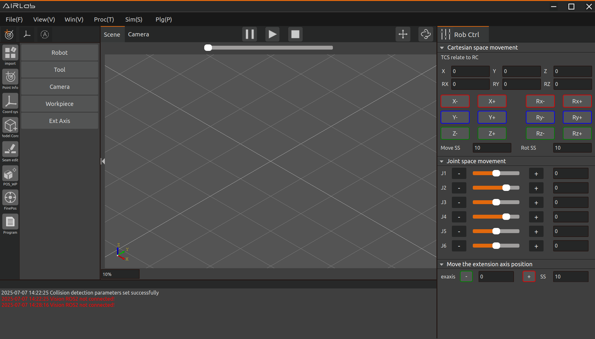

.. centered:: Figure 4-27  AIRLab Menu Bar-RCS-Display CS

.. figure:: analysis/4/28.png
	:align: center
	:width: 3in

.. centered:: Figure 4-28  AIRLab menu bar-RCS-Do not Show CS

Pause running
~~~~~~~~~~~~~~~~~~~

Pause/Resume button. Clicking this button will immediately pause the robot that is running a program, and pressing the button again will resume the robot to continue running the program it was running before the pause.

Start running
~~~~~~~~~~~~~~~~~~~

By clicking this button, the robot will first run all the commands under the “Workpiece Positioning” module on the left side of AIRLab, and after successful positioning of the workpiece, the robot will start to run the weld recognition; after successful recognition of the weld seam, the robot will run or not run the program automatically according to the parameters set by the user in the program configuration.

Stop running
~~~~~~~~~~~~~~~~~~~

Clicking the button immediately stops the robot that is running the program. The difference between this button and the pause/resume button is that by pressing the button again, the robot cannot resume running and can only be restarted with the start running button.

Main Frame
--------------------------
The main display box is divided into scene display and camera display, where the scene mainly displays the robot, tool, workpiece, extended axis model, etc., as in Figure 4-29. the camera mainly displays the obtained point cloud map, as in Figure 4-30.

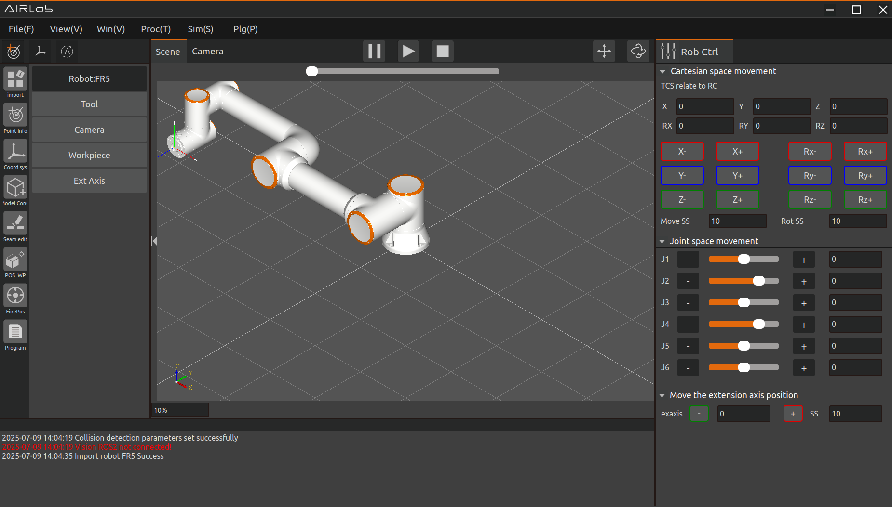

.. centered:: Figure 4-29  AIRLab Main Display Box - Scene Display

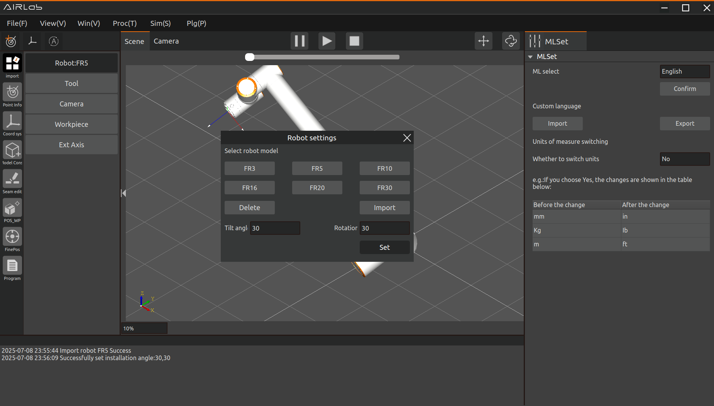

.. centered:: Figure 4-30  AIRLab Main Display Frame - Camera Display

Command Feedback Area
--------------------------
Instruction Feedback Area. It is divided into two options, the working directory and the terminal, where the working directory displays the current robot model, tools, and workpiece model, as in Figure 4-31, and the terminal displays the results of the execution of program commands and the returned robot error messages, as in Figure 4-32.

.. centered:: Figure 4-31  AIRLab Command Feedback Area-Working Directory

.. figure:: analysis/4/32.png
    :align: center
    :width: 6.5in

.. centered:: Figure 4-32  AIRLab Command Feedback Area-Terminal

Operating Area
--------------------------

Cartesian space movement
~~~~~~~~~~~~~~~~~~~~~~~~~~~
This area includes four parts: tool coordinate system, workpiece coordinate system, tool coordinate system relative to the reference coordinate system, and long press tap trigger, move step and rotate step settings, as shown in Figure 4-33.

.. centered:: Figure 4-33  AIRLab Operation Area-Cartesian Space Movements

- Tool Coordinate System section. There are 15 numbers tool0-tool14 in the drop-down list of tool coordinate system, after selecting the corresponding coordinate system (the name of the coordinate system can be customized), the corresponding coordinate values will be displayed in the text boxes of X, Y, Z, Rx, Ry, Rz below, and the tool coordinate system of the virtual robot will be changed accordingly in the scene display box by changing the values of the above six text boxes. Click the "Get current tool coordinate system" button to get the current tool coordinate system of the robot.

- In the Workpiece Coordinate System section, the drop-down list for the workpiece coordinate system also has 15 numbers work0-work14, and setting the values in the textboxes X, Y, Z, Rx, Ry, and Rz changes the position of the workpiece in the AIRLab software scene display box. By clicking on the "Set Work Coordinate System" button, the robot will send the tool coordinate system from the 3D scene to the actual robot and apply it.

.. important::
    When setting the tool/workpiece coordinate system number, it should be the same as the current tool coordinate system number and workpiece coordinate system number of the robot on the Webside.

- The Tool Coordinate System Relative to Reference Coordinate System section, which shows the value of the tool coordinate system relative to the reference coordinate system.

- Long press tap trigger, move step and rotate step setting section. As shown in Figure 4-34, if the currently imported robot model is a solid robot, long press the X+ button, the solid robot will execute the X+ tap command; if the currently imported robot model is not a solid robot, long press the X+ button, the simulation robot will execute the X+ tap command.

.. important::
    To control the robot's JOG pointing by long-pressing the buttons, if the buttons are released while the robot is running, the robot will stop moving immediately; if the buttons are held down all the way and not released, the robot will run the value of the set rotation step and then stop moving. the X-, Y+, Y-, Z+, Z- buttons operate in the same way. If the Rx+, Rx-, Ry+, Ry-, Rz+, Rz- buttons are pressed and held down, the robot will otherwise remain unchanged, except that it will move according to the set value of the rotation step.

.. figure:: analysis/4/34.png
    :align: center
    :width: 3in

.. centered:: Figure 4-34  AIRLab Operation Area-Long Press Tap

Joint space space movement
~~~~~~~~~~~~~~~~~~~~~~~~~~~~~
This area includes 12 joint coordinate long press trigger buttons for joints J1-J6, 6 joint coordinate change text boxes and 6 joint sliders in three parts, as shown in Figure 4-35.

.. centered:: Figure 4-35  AIRLab Operating Area - Joint Space Space Mobility

- You can control the movement of the solid robot J1 joints in manual mode and joint coordinate system by long-pressing the "+" or "-" button of J1. " button to control the movement of the J1 joints of the solid robot in manual mode and in the joint coordinate system. The "+" or "-" buttons of the other joints operate in the same way.

.. important::
    The robot operation is controlled by long-pressing the button. If the button is released while the robot is running, the robot will stop moving immediately; if the button is held down all the time, the robot will run the set value of Move Step/Rotate Step and then stop moving.

- The 6 text boxes are updated in real time to show the angle values of the 6 joints of the robot. In addition, editing the values in the 6 textboxes can also be used to control the movement of the robot's joints (care should be taken not to exceed the soft limits of the robot's joint angles when editing).

- The function of the joint slots is that the user can slide the joint slots to realize the movement of each joint of the robot, and the joint angles represented by the slots are displayed by the values in the text box.

Moving extended axis settings
~~~~~~~~~~~~~~~~~~~~~~~~~~~~~~~
This section includes "exaxis+", "exaxis-" and the step setting box, as shown in Figure 4-36. "exaxis+", "exaxis-" functions are similar to the pointing X+ and X- under the tool coordinate system, and the motion of the extended axis can be controlled by the above two buttons. Long press the button to control the extended axis running, if you release the button during the extended axis running, the extended axis will stop moving immediately; if you keep pressing the button and do not release it, the extended axis will run the value set in the Step Setting box and then stop moving.

.. figure:: analysis/4/36.png
    :align: center
    :width: 3in

.. centered:: Figure 4-36  AIRLab Operation Area - Moving the Extended Axis Position

Engineering Module Analysis
-----------------------------------
To weld a workpiece, you need to import a model of the robot, tool, workpiece, etc.; if there is no current model of the workpiece, you need to build it without a model first. Afterwards, the workpiece is positioned and the weld seam is edited, both of which are completed by editing the automatic photo position and running the program to identify the weld seam and generate the weld program. In this chapter, each module of the engineering module will be described in detail.

Import module
~~~~~~~~~~~~~~~~~~~
By clicking on the plus sign to the right of Import Module, the AIRLab software interface displays the Module Setup page, where the user can choose to import a robot, tool, workpiece, extended axis, and camera.

.. figure:: analysis/4/37.png
    :align: center
    :width: 7.5in

.. centered:: Figure 4-37  Module Setup Page

- Import Robot: Select the robot icon in the module setting page, click “confirm” button, the interface will display the robot setting page, select the robot model to be imported.

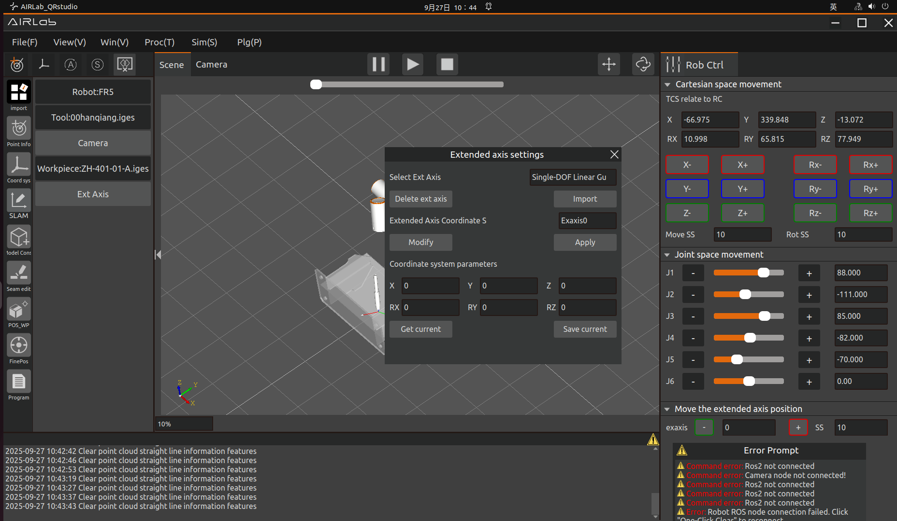

.. centered:: Figure 4-38  Robot Settings Page

Take FR5 as an example, select FR5 robot and click Import, then import FR5 robot model in the 3D scene, and the terminal shows Import Robot Success which means importing robot model is successful.

.. figure:: analysis/4/39.png
    :align: center
    :width: 7.5in

.. centered:: Figure 4-39  Successful introduction of the robot

Considering more flexible and rich robot deployment scenarios, we provide a free installation function. The user setting module sets the tilt angle and rotation angle in the page, and the robot model in the 3D scene or shows the corresponding installation effect. After modification, click Set to complete the robot installation method settings.

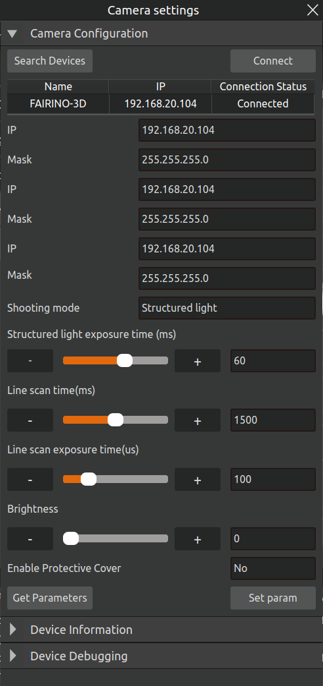

.. centered:: Figure 4-40  Setting the robot tilt and rotation angles

.. important::
    After the robot is installed, the robot must be set up correctly, otherwise it will affect the use of the robot's drag function as well as the collision detection function.

You can delete the currently imported robot model by clicking the “Delete” button on the Robot Settings page.

- import tool: select the tool icon in the module setting pop-up window, click “confirm”, AIRLab interface will display the tool setting page.

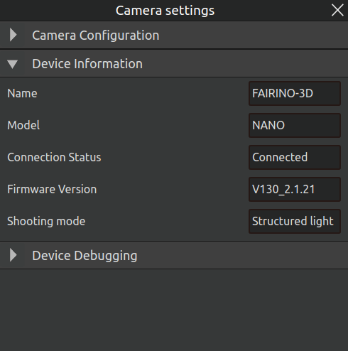

.. centered:: Figure 4-41  Tool Setup Page

Click Open, select the tool model you want to import under the corresponding path, and click “Open”.

.. figure:: analysis/4/42.png
    :align: center
    :width: 3.5in

.. centered:: Figure 4-42  Selection Tool Model

The imported tool model is displayed in the 3D scene, and the terminal displays “Successful tool import”, which means that the tool model has been successfully imported.

.. figure:: analysis/4/43.png
    :align: center
    :width: 7.5in

.. centered:: Figure 4-43  Import Tool Success

After importing a tool, you can set the current coordinate system of the tool and the appearance position of the tool;

Click the “Get Current” button under the tool coordinate system on the tool setting page to get the current coordinate system of the tool, and then click Save to modify the tool coordinate system.

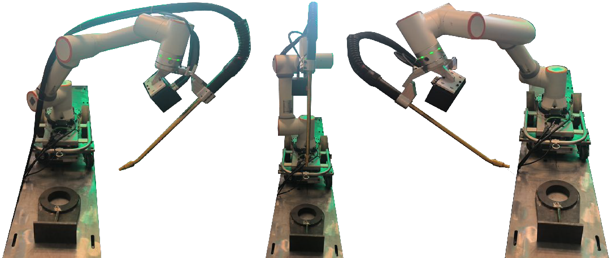

.. centered:: Figure 4-44  Get the current tool coordinate system

If you need to modify the appearance position of the tool, modify the coordinates under Appearance Position on the Tool Settings page, and then click the “Set Tool Appearance” button to finish setting the appearance position of the tool.

.. figure:: analysis/4/45.png
    :align: center
    :width: 7.5in

.. centered:: Figure 4-45  Setting the Tool Appearance Position

You can delete the currently imported tool model by clicking the “Delete” button on the tool settings page.

- Import artifacts: Select the artifact icon in the module setup popup window, click “confirm”, and the AIRLab interface will display the artifact setup page.

.. figure:: analysis/4/46.png
    :align: center
    :width: 2.5in

.. centered:: Figure 4-46  Workpiece Setting Page

Click “Open” button, select the workpiece model to be imported under the corresponding path, click “Open”, the imported workpiece model will be displayed in the 3D scene, and the workpiece will be imported successfully.

.. figure:: analysis/4/47.png
    :align: center
    :width: 7.5in

.. centered:: Figure 4-47  Imported artifacts successfully

Set workpiece coordinate system: After setting workpiece coordinate system in the workpiece setting page, click “Save Workpiece Coordinate System” to set workpiece coordinate system.

Delete workpiece: Click “Delete Workpiece” button in the workpiece setting page to delete the imported workpiece in the current 3D scene.

- Import Extended Axis: Select the Extended Axis icon in the Module Settings pop-up window and click confirm. The AIRLab interface displays the Extended Axis Settings page, select the Extended Axis you want to import and click Import.

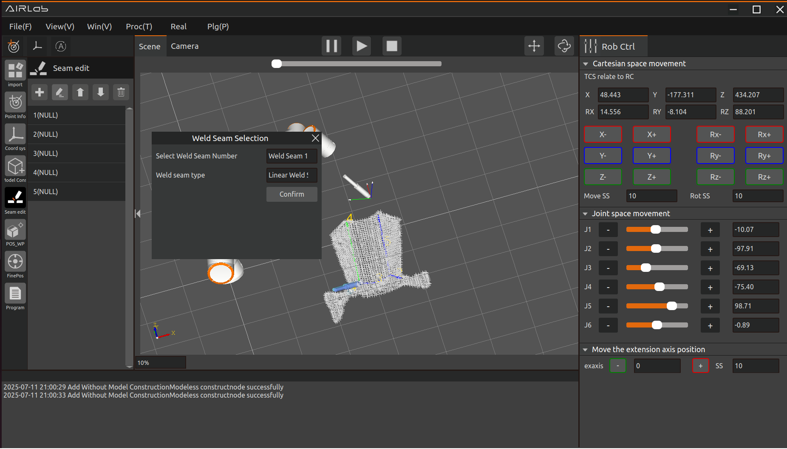

.. centered:: Figure 4-48  Extended Axis Setup Page

The imported extended axis model is displayed in the 3D scene of AIRLab software, and the extended axis is imported successfully.

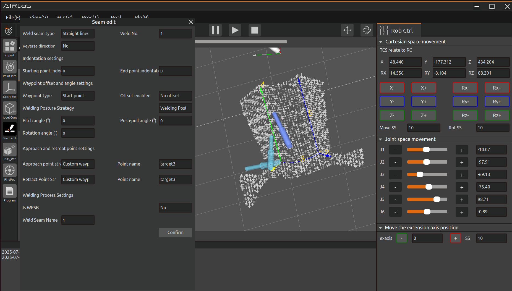

.. centered:: Figure 4-49  Extended axis imported successfully

Delete Extended Axis: Click “Delete Extended Axis” in the Extended Axis Settings page to delete the extended axis imported in the current 3D scene.

- Import Camera: Select the camera icon in the Module Settings pop-up window and click confirm. The AIRLab interface displays the Camera Settings page, select the camera model to be imported and click Camera Settings.

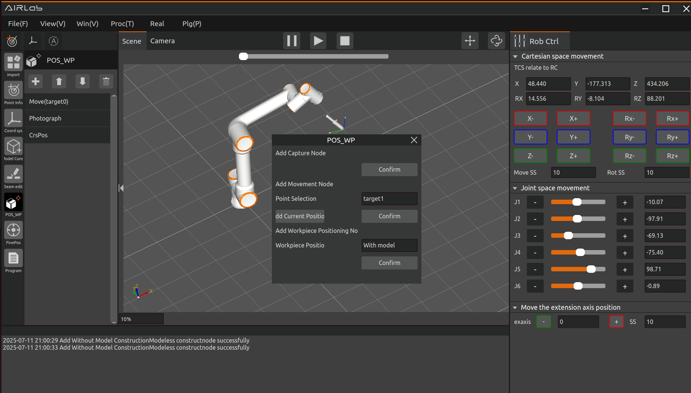

.. centered:: Figure 4-50  Camera settings page

Camera parameter setting: On the camera setting page, click Get Camera Parameters to display the currently set camera parameters, and then click the Camera Parameter Setting button to set the camera parameters after modifying the camera parameters.

Shooting Ground: In the camera setting page, click “Shooting Ground” button, you can shoot the current working environment table.

Camera hand-eye calibration: In the camera setting page, click “Camera hand-eye calibration” button, the page displays the hand-eye calibration pop-up window, and you can calibrate the camera by hand-eye calibration, the specific operation is described in 3.5 Point cloud camera hand-eye calibration section.

Model-free building blocks
~~~~~~~~~~~~~~~~~~~~~~~~~~~~~~
If the workpiece to be welded does not have a model file, you need to perform a model-less build of the workpiece first, otherwise, you can directly import the workpiece model to perform the 4.5.3 weld editing operation. Click the plus sign on the right side of the model-less construction module, the model-less construction page will be displayed in the AIRLab page, select the node type to add, you can choose three kinds of nodes: mobile, photo and model-less construction.

Add moving node: Select the node type as “Move”, select the photo target point to be moved, click the “Add Node” button, and “Move(target)” will appear under the no-model building module, that is, it is added successfully. “Move(target)” will appear under the model building module, that is, the node is added successfully;

.. figure:: analysis/4/51.png
    :align: center
    :width: 3in

.. centered:: Figure 4-51  Adding Move nodes

The principle of the model-less photo point of demonstration is that the camera is able to clearly and completely capture all positions of the model-less workpiece, especially the position of the weld seam that needs to be welded.

.. figure:: analysis/4/52.png
    :align: center
    :width: 6in

.. centered:: Figure 4-52  Photographic points of the workpiece at different angles    

Add photo node: Select the node type as “Photo”, click “Add Node” button, and the node “Photo” appears under the artifact positioning module, that is, the photo node is added successfully.

.. figure:: analysis/4/53.png
    :align: center
    :width: 3in

.. centered:: Figure 4-53  Add photograph node 

Add Modeless cons node: Add Modeless cons node after adding several groups of “Move+Photo” nodes, select the node type as “Modeless cons”, edit the name of the no-model artifact, click “Add node” button. Click “Add Node” button, “Model Building” node appears under the no-model module, that is to say, adding no-model building node is successful.

.. figure:: analysis/4/54.png
    :align: center
    :width: 3in

.. centered:: Figure 4-54  Adding Modeless cons nodes

This completes the creation of the model-free builder.

.. figure:: analysis/4/55.png
    :align: center
    :width: 2.5in

.. centered:: Figure 4-55  Model-free builder

After the model-less construction program is completed, click the “Model-less Construction” module, click “Generate Trajectory” to view the simulation trajectory of the model-less construction program, and after confirming that the trajectory of the model-less construction program is correct, click Run to start running the model-less construction program. program.

.. centered:: Figure 4-56  Click on the model-free building blocks

After the model-less construction program has finished running, the built model-less workpiece model will be displayed in the AIRLab 3D scene. Check whether the model is correct or not, the model is correct, the modelless construction is successfully constructed, and the model that has been successfully constructed can be directly imported in the next time, and there is no need to model the workpiece again for the modelless workpiece modeling.

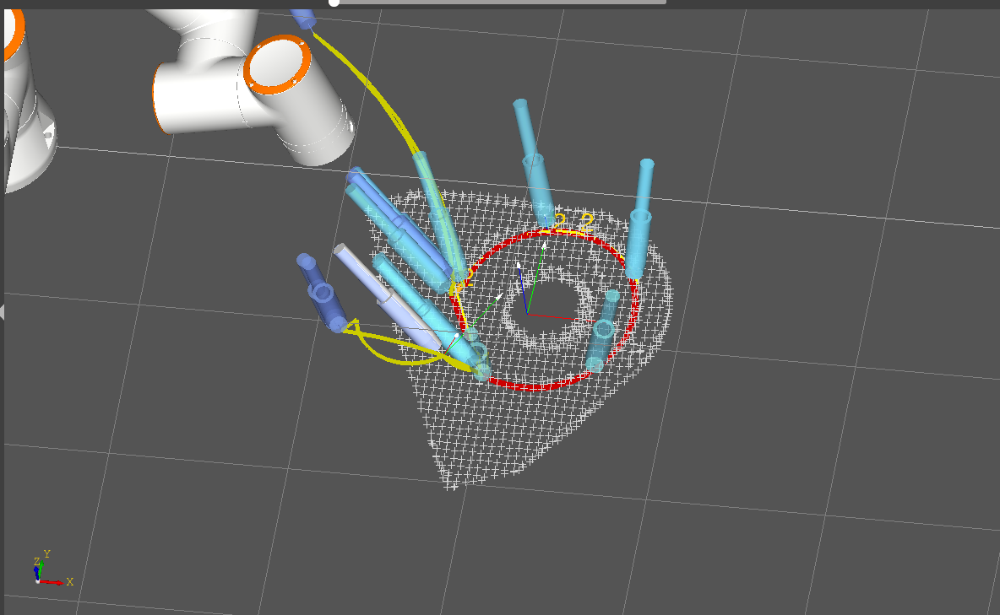

.. centered:: Figure 4-57  Model-free construction completed

If the model is built incorrectly, you need to click the “No Model Build” module, click “Clear Model Data”, and then build the model again until the modelless artifact model is created correctly.

By clicking on the No Model Build module, the user can select options such as Get Modeling Data, and the functions of each option are described below.

- Get Modeling Data: Click “Get Modeling Data”, after clearing the modeling data, click Get Modeling Data to get the modeled artifact model again.
 
- Clear Modeling Data: Click “Clear Modeling Data” to clear the modelless workpiece model in the 3D scene.

- Run Program: Click “Run Program” to run the current program of the modelless building block.

- Stop Program: Click “Stop Program”, the robot will stop running immediately.

- Generate Trajectory: Click “Generate Trajectory” button to generate the simulation trajectory of the program in AIRLab 3D scene.

- Show Tool: Click “Show Tool”, the virtual tool model will be shown in AIRLab 3D scene.

- Clear Tool: Click “Clear Tool”, the virtual tool model displayed in AIRLab 3D scene is cleared.

Weld editing
~~~~~~~~~~~~~~~~~~~~~~~
Weld Edit: After importing the workpiece, the workpiece model and weld data will be displayed in the 3D scene. Click on the weld you want to add, and the weld editing page will be displayed in the AIRLab interface.

.. figure:: analysis/4/58.png
    :align: center
    :width: 7.5in

.. centered:: Figure 4-58  Weld Edit Page

Select the weld type to edit the weld information.

After editing, click the “Finish” button to add a new weld in the weld list of the weld editing module, and the weld will be added successfully.

.. figure:: analysis/4/59.png
    :align: center
    :width: 7.5in

.. centered:: Figure 4-59  Adding Welds

Once all the welds to be welded have been added, clicking on the weld list allows you to modify that weld list and re-edit the welds until the weld list adjustments are complete.

.. figure:: analysis/4/60.png
    :align: center
    :width: 2.5in

.. centered:: Figure 4-60  Add all welds

Workpiece positioning
~~~~~~~~~~~~~~~~~~~~~~~~
Work Positioning: After editing all the weld seams to be welded, it is necessary to position the work pieces. First of all, you need to create a workpiece positioning program; click the plus sign on the right side of the workpiece positioning module to add a workpiece positioning program node, and the AIRLab interface will display the workpiece positioning page.

The workpiece positioning module program contains 3 kinds of nodes: Photo, Move and Coarse Positioning; the functions of Photo and Move nodes are the same as the functions of Photo and Move of Model-less Building Module, for details, please refer to 4.5.2 Model-less Building section.

Add coarse positioning node: add several groups of “move+take photo” nodes and then add coarse positioning node, select node type as “coarse positioning”, and select coarse positioning algorithm as “with model”;

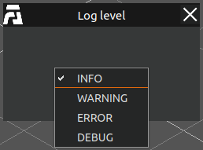

.. centered:: Figure 4-61  Adding a coarse positioning node

After adding these nodes, the workpiece positioning program will be created. The function of the whole program is that the robot moves to different photo points several times to take photos until the workpiece is completely photographed, and then the program will make a rough positioning of the workpiece; the workpiece positioning program created is shown in the figure below.

.. figure:: analysis/4/62.png
    :align: center
    :width: 2.5in

.. centered:: Figure 4-62  Workpiece positioning program

When you click on the “Workpiece Positioning” module after you have created the positioning of the finished part, the “Run Program” and other options that appear have the same function as the “Run Program” and other options of the model-less construction module. For details, see the section on model-less construction.

Click “Generate Trajectory” to view the simulation trajectory of the model-less construction program. After confirming that the trajectory of the workpiece positioning program is correct, click “Run Program” to start running the workpiece positioning program for rough positioning of the workpiece.
   

Automatic photo position
~~~~~~~~~~~~~~~~~~~~~~~~~~~~~~~
After the workpiece positioning is completed, it is necessary to fine position the weld seam of the workpiece to obtain the weld seam data. After no model construction is completed, or after importing the constructed workpiece model, click on the “Auto Photo Position” module, and then click on the “Get Auto Photo Position” button, and the recommended photo position of the weld seam will be generated in the position list.

.. figure:: analysis/4/63.png
    :align: center
    :width: 2.5in

.. centered:: Figure 4-63  Auto Photo Position List

Because of the recommended photo position is more, in order to improve efficiency, the user can reduce their own part of the photo position of their own re-teaching photo position, the principle of teaching is to be all the weld starting point and end point of the shooting complete!

After creating a list of automatic photo positions, mouse click on the “automatic photo position” module, there will be “get automatic photo position”, “generate barrier-free trajectory”, “Generate Trajectory” and so on.

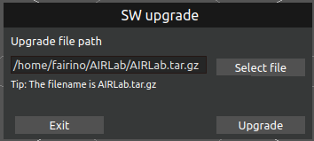

.. centered:: Figure 4-64  Click on the Auto Photo Position Module

Options such as “Run Program” and “Stop Program” function in the same way as the model-less build function, which can be described in the model-less build section. Other functions are described here:

- Get automatic photo position: After the positioning of the workpiece, the program will get the recommended photo position corresponding to each weld seam, click “Get automatic photo position” to get the recommended photo position.

- Generate barrier-free trajectory: Click “Generate barrier-free trajectory”, the robot trajectory after collision detection will be generated in the 3D scene.

- Run Accessibility Program: Click “Run Accessibility Program”, the robot will move according to the robot motion trajectory after collision detection.

The user chooses to run the program or run the accessibility program for weld identification after selecting the confirmation trajectory. After the automatic photo position program is run, the final weld node is generated under the program module.

Procedures
~~~~~~~~~~~~~~~~~~~~~~~~~~~~~~~
After running the automatic photo position, the final weld node is generated under the program module, and by clicking on the “Program” module, the user can choose to “run the program”, “stop the program”, “generate the trajectory” and other options, The user can select options such as “Run Program”, “Stop Program”, “Generate Trajectory”, etc. by clicking on the “Program” module. These options function in the same way as the “Run Program” option for model-less builds described above.

Clicking on “Generate Trajectory” generates a weld trajectory in the AIRLab 3D scene, and the user can choose to run a simulation on the trajectory.

.. figure:: analysis/4/65.png
    :align: center
    :width: 5.5in

.. centered:: Figure 4-65  simulation trajectory

Click “Generate Tool”, the tool position of the key node will be displayed in the 3D scene, as shown in the following figure.

.. figure:: analysis/4/66.png
    :align: center
    :width: 5.5in

.. centered:: Figure 4-66  Generation Tools

After the simulation and tool position are correct, click “Run Program” to start the actual welding.

The generated program can be adjusted, click on the generated node, you can delete it, add nodes above, add nodes below, edit nodes, move up or down operations. Click on the plus sign to the right of the program module, AIRLab software interface will appear in the program page, you can customize the content of the node, click “confirm”, the program node under the generation of the content of the node.

Point information
~~~~~~~~~~~~~~~~~~~~~~~~~~~~~
Point Information Module: Click the point in the point list, you can delete or edit the point. Click “Edit Points”, the interface of AIRLab software will show the page of point information modification, users can choose to move the direct target point, synchronize the current position or save the modified points.Part I: How to create a workpiece positioning program.

.. figure:: analysis/4/67.png
    :align: center
    :width: 3in

.. centered:: Figure 4-67  Modification of point information

1) Move to target point: user clicks “Move to target point” button, the robot end will move to the current edited point.
   
2) Synchronize the current point position: When the user clicks the "Synchronize Current Position" button, the pose of the currently selected point target0 will be modified to the pose of the robot that is actually taught.

3) Modify and save point position: The user modifies the point information, and then clicks the "Save Modify Point" button to modify the current point coordinates.

Reference coordinate system
~~~~~~~~~~~~~~~~~~~~~~~~~~~~~
Reference coordinate system: click the menu bar to add a new reference coordinate system icon, a new reference coordinate system, the user can select the reference frame of reference coordinate system for the workpiece coordinate system or base coordinate system; mouse click on the reference coordinate system, the user can now delete the coordinate system or edit the coordinate system. Click to delete the coordinate system to delete the current reference coordinate system, click to edit the coordinate system AIRLab software to display the reference coordinate system page.

.. figure:: analysis/4/68.png
    :align: center
    :width: 3in

.. centered:: Figure 4-68  Reference coordinate system page

Select which coordinate system is the reference coordinate system, then set the coordinates of the reference coordinate system, select “Show” and click the “Set” button, the reference coordinate system will be displayed in the AIRLab 3D scene. Select “Do not show” and click “Set”, the displayed coordinate system will be hidden.

Pop-Ups and Other Pages
--------------------------
This section describes the AIRLab software pop-ups and other pages, pop-ups including about pop-ups, log pop-ups, software upgrade pop-ups, virtual camera pop-ups, global settings pop-ups, weld process query pop-ups, clearing the gun shear pop-ups, weld data calculation and collection of pop-ups and multi-layer multi-channel weld process query pop-ups, and so on; other pages, including other control, simulation, debugging page, program configuration and multi-language settings.

About
~~~~~~~~~~~~~~~~~~~~~~~~~~~~~
When "About" is selected, clicking the button will display the current version and release date of the AIRLab software, middleware, and vision module, as shown in Figure 4-69.

.. figure:: analysis/4/69.png
    :align: center
    :width: 3in

.. centered:: Figure 4-69  AIRLab version information and release date display

Log
~~~~~~~~~~~~~~~~~~~~~~~~~
Log is used to record the system's operation process and exception information, enabling quick issue identification. Clicking this button will bring up a "Log Level" popup window. There are four log levels: INFO, WARNING, ERROR, and DEBUG. After selecting a log level, the current log level will be set (default is INFO). As shown in Figure 4-16, the specific meanings are described in Table 4-2.

.. figure:: analysis/4/70.png
    :align: center
    :width: 2in

.. centered:: Figure 4-70  AIRLab Menu Bar-Logs

.. centered:: Table 4-2  Log level information

.. image:: analysis/4/表4-2.png
	:align: center
	:width: 6in

Software upgrade pop-ups
~~~~~~~~~~~~~~~~~~~~~~~~~
Click Window-Software Upgrade, and a software upgrade pop-up window will pop up.

.. centered:: Figure 4-71   Software upgrade pop-ups

Click “Select File” to bring up the file selection window, select the AIRLab.tar.gz upgrade file, please make sure the file name and format are correct.

.. centered:: Figure 4-72   Selecting an upgrade package
    

.. centered:: Figure 4-73  Click on the "Upgrade" button

Click “Upgrade” and wait for the upgrade package to finish unpacking, the upgrade progress will be shown in the progress bar. Click Exit to exit the software upgrade.

.. figure:: analysis/4/74.png
    :align: center
    :width: 3in

.. centered:: Figure 4-74  AIRLab software upgrade in progress

After the upgrade progress reaches 100%, click Confirm and restart the software, the upgrade is complete.

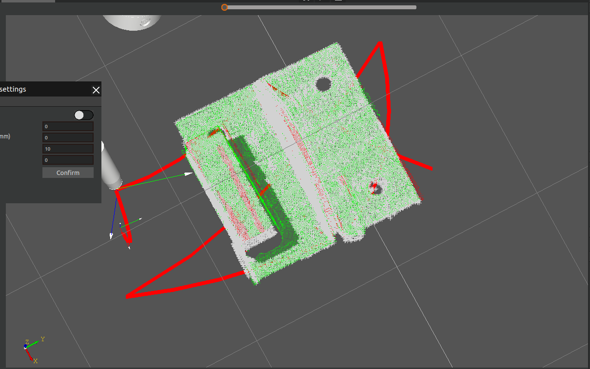

.. centered:: Figure 4-75   AIRLab software upgrade completed

When the upgrade package is corrupted or incomplete, the interface will show the upgrade failure feedback. You can choose to quit the upgrade or re-select the upgrade package to continue the upgrade.

.. figure:: analysis/4/76.png
    :align: center
    :width: 3in

.. centered:: Figure 4-76   AIRLab Software Upgrade Failure Interface Feedback

Virtual Camera
~~~~~~~~~~~~~~~~~~~~~~~~~~~~~~~~~~~~~~~~~
Through the display of the virtual camera field of view, it is possible to observe whether the current camera shooting position is appropriate. At the same time, users can adjust the shooting position based on the display of the virtual camera field of view, and then adjust the camera to the optimal shooting position.

Click on the menu bar - Virtual Camera, and a virtual camera pop-up window will appear in the 3D scene, displaying the camera's field of view at the current position, as shown in the Figure 4-77.

.. figure:: analysis/4/77.png
    :align: center
    :width: 4in

.. centered:: Figure 4-77   Virtual Camera Display Field of View

Adjust the camera position in the 3D scene, and the corresponding virtual camera field of view will also be synchronously transformed.

.. figure:: analysis/4/78.png
    :align: center
    :width: 4in

.. centered:: Figure 4-78   Camera field of view transformation

Global Settings
~~~~~~~~~~~~~~~~~~~~
In order to reduce the possibility of robot collision during welding movement, AIRLab has added a new “Global Settings” item in the menu bar “Window” to provide robot collision detection, as shown in the figure. The interface includes four types of collision thresholds, but currently only open the null process collision detection distance threshold, which refers to the robot from the withdrawal point of the previous weld to the next weld convergence point between the null path of the collision distance.

.. figure:: analysis/4/79.png
    :align: center
    :width: 3.5in

.. centered:: Figure 4-79  Setting popup content globally

Currently, the only collision detection available to the user is for the null shift process. When self-collision detection is enabled, even if the user does not set the “null shift process collision detection distance threshold (mm)” (i.e., using the default value of 0mm), AIRLab will detect the collision of the robot's null shift path, and plan a collision-free and safe path. When this parameter is set by the user, AIRLab will plan the robot's null path farther away from the obstacle based on the input threshold parameter on a collision-free basis.

.. figure:: analysis/4/80.png
    :align: center
    :width: 3.5in

.. centered:: Figure 4-80  Global Settings Popup - Parameter Settings

After setting the parameters of collision detection, click “confirm” button to complete the parameter setting and close the “Global Settings” pop-up window. Note: After the collision detection is enabled, users need to teach the withdrawal and convergence points for each weld when creating the weld template program.

After completing the settings of the project tree and other related parameters, the user clicks on the “One Click Start” button in the toolbar of AIRLab, and when the program runs into the obstacle avoidance planning section, AIRLab will show a “Progress Alert” pop-up window to display the current progress of the planning. AIRLab will show the progress of the current planning as shown in the figure.    

.. figure:: analysis/4/81.png
    :align: center
    :width: 3.3in

.. centered:: Figure 4-81  Obstacle avoidance planning in progress

If the obstacle avoidance planning fails, the pop-up window switches to the following figure, and the user needs to re-teach the exit point and convergence point, and click the “One Click Start” button again.

.. figure:: analysis/4/82.png
    :align: center
    :width: 3.5in

.. centered:: Figure 4-82  Failure of obstacle avoidance planning

If the planning is successful, the pop-up window will be switched to the following figure, users can click “View Trajectory” button to generate the simulation trajectory of the motion instruction under the ‘Program’ node; click “Clear Trajectory” button to clear the trajectory in the interface; click “Run Program” button to start running the lua program directly. Click “Clear Trajectory” button to clear the trajectory in the interface; click “Run Program” button to start running the lua program directly.

.. figure:: analysis/4/83.png
    :align: center
    :width: 3.5in

.. centered:: Figure 4-83  Progress bar alert popup

After successful obstacle avoidance planning, the relevant “MoveJ()” instruction in the ‘Program’ node of the project tree will be amended to “SplinePTP()”.

The following simulation trajectory diagram as an example to show the actual effect of AIRLab collision detection, Figure 4-84 for the opening of the collision detection function, AIRLab automatic obstacle avoidance planning trajectory; Figure 4-85 for the opening of the collision detection is not open, the trajectory obtained by AIRLab through the motion planning, it can be seen clearly that the robot will be empty moving process and the collision of the workpiece.

.. figure:: analysis/4/84.png
    :align: center
    :width: 7.5in

.. centered:: Figure 4-84  Turn on collision detection planning

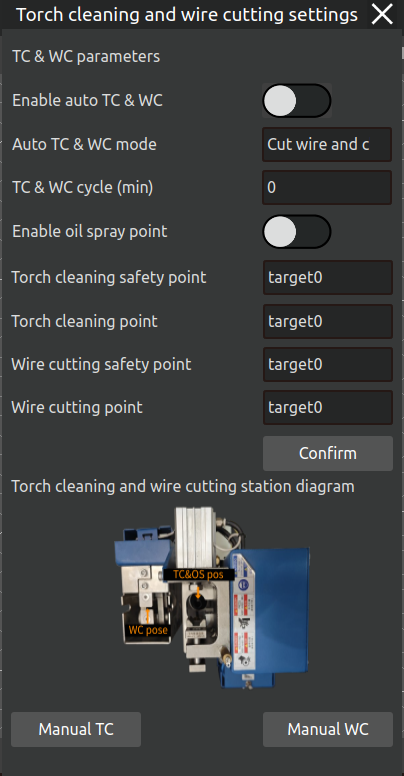

.. centered:: Figure 4-85  No collision detection planning

In the case that the obstacle environment does not change, the user can not repeat the obstacle avoidance planning after successfully completing one obstacle avoidance planning, if you need to repeat the instructions under “Program” in the project tree, click “Run Program” in “Work Program” on the sub-page. If you need to run the commands under “Program” in the project tree repeatedly, click “Run Program” in “Work Program” on the subpage. If the obstacle environment changes, you have to click the “Run” button again to plan a new obstacle avoidance path.

Welding process query pop-up window
~~~~~~~~~~~~~~~~~~~~~~~~~~~~~~~~~~~~~~~~~
Click on Process - Welding Process in the menu bar, and the AIRLab software interface displays the Process Inquiry pop-up window.

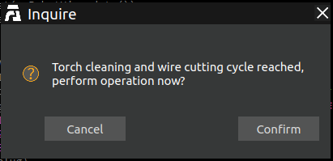

.. centered:: Figure 4-86  Process Inquiry Popup

The left side of the pop-up window is for welding process classification, including flat welding, flat angle welding, vertical upward welding and other 9 categories, click on the welding process under the welding process classification, the right side will display the specific information of the process.

Add welding process: Select the category of welding process to be added, click on the plus sign next to “process classification”, a welding process will be added under the category to be edited;

.. centered:: Figure 4-87  Newly added welding process

Click on the newly added weld process and edit the weld process name, weld time interval (only used for multi-layer multi-pass welding) on the right side to add weld pass information. Click on the plus sign next to the list of weld passes to add new pass information. If the process is multi-layer multi-pass welding, add as many weld passes as necessary, otherwise add only one weld pass.

.. figure:: analysis/4/88.png
    :align: center
    :width: 3.5in

.. centered:: Figure 4-88  Modify weld channel information

Click the weld channel in the weld channel list, and the information of the currently clicked weld channel will be displayed in the weld channel editing section. Modify the weld channel information by selecting the reference coordinate system, safety point, offset, and binding the welding process and click Finish, and the information of the weld channel in the weld channel list will be modified.

.. figure:: analysis/4/89.png
    :align: center
    :width: 3.5in

.. centered:: Figure 4-89  Successful modification of weld channel information

After modifying all the welding channel information, click the “Finish” button under the welding channel list, and the terminal will show that the new multi-layer multi-channel welding process has been successful, and then a new welding process will be successfully added.

.. figure:: analysis/4/90.png
    :align: center
    :width: 7.5in

.. centered:: Figure 4-90  New Welding Processes Successful

Modify welding process: Click on the welding process to be modified, modify the welding process data as needed, and you can add, modify or delete the list of weld passes.

1)Add a new weld path: Click the plus sign next to the weld path list to add a weld path in the weld path list.

2)Modify weld pass: Click the weld pass that needs to be modified in the list of weld passes, the information of the weld pass will be displayed in the editing of the weld pass, after modifying the information of the weld pass, click the “Finish” button, and the information of the weld pass in the list of weld passes will be modified.

3)Delete Path: Select the weld path that needs to be deleted, click the delete icon next to the list of weld paths, and the weld path will be deleted.

After all the modifications are completed, click the “Finish” button under the list of welding channels, the software page will prompt “Does the process already exist? Click “confirm” button, the terminal displays “Modify Multi-layer Multi-pass Welding Process Successfully”, that is, successfully modify the welding process.

.. figure:: analysis/4/91.png
    :align: center
    :width: 3in

.. centered:: Figure 4-91  Modifying Welding Process Tips

Delete Welding Process: Select the welding process to be deleted and click on the delete icon next to the process type and the process will be deleted.

Cylinder Filling Process Query Pop up Window
~~~~~~~~~~~~~~~~~~~~~~~~~~~~~~~~~~~~~~~~~~~~~~~~~~
The pop-up window for querying the cylindrical filling process is shown in Figure 4-92. The cylindrical filling process includes two parts: filling the bottom surface of the cylinder and secondary reinforcement.

.. centered:: Figure 4-92  Cylinder Filling Process Query Pop up Window

1. Fill the bottom surface of the cylinder

Before performing cylindrical filling welding, users need to set parameters such as welding current, welding voltage, welding speed, spacing, offset, safety point selection, and swing process selection.

2. Secondary reinforcement
   
After the cylindrical filling welding is completed, secondary reinforcement welding is carried out, and the same user needs to set parameters first.

The filling interval refers to the vertical distance between two adjacent filling layers;

Inward filling offset refers to the horizontal distance between the starting point of filling and the edge of the cylinder;

The safety point name is the transition point of the robot during the filling and reinforcement process. After completing one filling or reinforcement, the robot needs to return to that point for the next welding.

Reinforcement interval refers to the vertical distance between adjacent reinforcement layers;

The upward offset of secondary reinforcement refers to the vertical interval between the starting point of the second reinforcement and the starting point of the first reinforcement;

The name of swing process and whether to swing refers to which swing process the user chooses and whether to swing according to their actual welding needs, as shown in Figure 4-93.

.. figure:: analysis/4/93.png
    :align: center
    :width: 5in

.. centered:: Figure 4-93  Swing process query pop-up window

Users can add, modify, or delete cylindrical filling processes,

New: Select "Add" as the change method, then set the process parameters and the name of the new filling process, and click the "Finish" button to add a new filling process;

Modification: Select "Modify", choose a cylindrical filling process name, then reset the process parameters, and click the "Finish" button to modify the parameters of the process;

Delete: Select "Delete", choose a cylindrical filling process name, and then click the "Finish" button to delete the process.

Welding data calculation and collection pop-up window
~~~~~~~~~~~~~~~~~~~~~~~~~~~~~~~~~~~~~~~~~~~~~~~~~~~~~~~~~
Click on the window Welding Data Collection, and a pop-up window will appear displaying the current welding information; The pop-up window displays the welding current, welding voltage, and speed as the current welding status information; The arc duration and arc length are statistical information, which includes the total duration and length of welding performed using AIRLab software before the last reset. Click reset to reset the welding duration and arc length to zero.

.. figure:: analysis/4/94.png
    :align: center
    :width: 3in

.. centered:: Figure 4-94   Welding data collection pop-up window

Torch Cleaning and Wire Cutting
~~~~~~~~~~~~~~~~~~~~~~~~~~~~~~~~~~~~~~
Click “Window”–“Torch Cleaning and Wire Cutting” to open the “Torch Cleaning and Wire Cutting Settings” popup, as shown below. The parameters to be configured on this page include: Enable Automatic Torch Cleaning and Wire Cutting, Cleaning Method, Cleaning Cycle, Enable Oil Spray Point, Torch Cleaning Safety Point, Torch Cleaning Point, Wire Cutting Safety Point, and Wire Cutting Point.

.. figure:: analysis/4/95.png
    :align: center
    :width: 3in

.. centered:: Figure 4-95  Parameter setting for gun clearing and wire cutting

This function supports both manual and automatic operation modes.The manual mode is intended for scenarios where the robot needs to perform torch cleaning or wire cutting immediately.The automatic mode is suitable for scenarios where the robot triggers torch cleaning and wire cutting operations automatically at fixed time intervals during its operation.

The manual mode is divided into Manual Torch Cleaning and Manual Wire Cutting.For manual torch cleaning, the parameters that need to be configured are: Enable Oil Spray Point, Torch Cleaning Safety Point, and Torch Cleaning Point. Once configured, click the Manual Torch Cleaning button to start the cleaning process.For manual wire cutting, only the Wire Cutting Safety Point and Wire Cutting Point need to be set. After configuration, click the Manual Wire Cutting button to initiate the wire cutting operation.

For automatic torch cleaning and wire cutting, all the parameters on the page need to be configured, then click the confirm button. When the cumulative welding time of the robot’s current welding session reaches the set cleaning and cutting cycle, a prompt dialog, as shown below, will appear after the robot stops welding, asking the user whether to proceed with torch cleaning and wire cutting.If Yes is selected, the robot will automatically perform torch cleaning and wire cutting.If No is selected, the robot will skip the cleaning and cutting operations, including the Torch Cleaning Safety Point, Torch Cleaning Point, Wire Cutting Safety Point, and Wire Cutting Point.

.. centered:: Figure 4-96  Reach the clear gun shear cycle

.. important::
    If automatic torch cleaning and wire cutting is enabled, the cleaning and cutting cycle cannot be set to 0!

.. figure:: analysis/4/97.png
    :align: center
    :width: 3in

.. centered:: Figure 4-97  Popup for unset cycles in auto mode

When using the torch cleaning and wire cutting function for the first time, the user needs to manually teach the Torch Cleaning Safety Point, Torch Cleaning Point, Wire Cutting Safety Point, and Wire Cutting Point.Teaching method: First, open the “Torch Cleaning and Wire Cutting” dialog. According to the point addition method and the torch cleaning and wire cutting station diagram in the dialog, add the four points mentioned above. After successfully adding the points, select the corresponding point names from the dialog, configure the other parameters, and click the confirm button. The parameters on the page, along with the joint values of the four points, will be saved into the configuration file for torch cleaning and wire cutting.

After importing other projects, AIRLab will automatically read the parameters from the configuration file and add the Torch Cleaning Safety Point, Torch Cleaning Point, Wire Cutting Safety Point, and Wire Cutting Point to the point list.

.. important::
    If the position of the torch cleaning and wire cutting station has not changed, the user does not need to teach these four points again.

Automatic loop operation
~~~~~~~~~~~~~~~~~~~~~~~~~~~
AIRLab offers the function of automatically cycling through welding projects, allowing users to repeatedly execute welding processes on workpieces. The detailed steps are as follows:

Step 1: Launch AIRLab, import the workpiece registration template project, and open the menu bar—select the automatic cycle operation pop-up window, as shown in the Figure 4-98.

.. important::
    AIRLab has specific requirements for the path of the workpiece registration template project. It must be placed in /Data/Work_template under the AIRLab directory. No other USD files are allowed in this folder besides the workpiece registration template project. The project name can be arbitrary.

.. figure:: analysis/4/98.png
    :align: center
    :width: 3in

.. centered:: Figure 4-98   AIRLab menu bar - Window - Auto Loop Run

Set loop parameters according to actual needs, and the introduction of each parameter is as follows:   

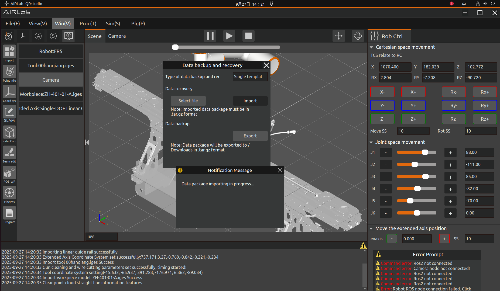

.. centered:: Figure 4-99   Automatic loop operation parameter settings

Enable Automatic Cycle Operation: If automatic cycle operation is required, click this button to activate the function.

Cycle Interval: The waiting time between cycles. For example, after the robot completes the welding process for the current workpiece, it will wait for this interval before importing the template program again to proceed with the next cycle.

Cycle Mode: There are two types,Continuous Cycle: Runs indefinitely. Fixed Cycle: The robot automatically stops after completing the set number of cycles.

Cycle Count: This parameter only needs to be set when the cycle mode is Fixed Cycle. (Note: The cycle count cannot be set to 0.)

.. important::
    Once the automatic cycle operation parameters are configured, they are automatically saved and loaded. If no changes are needed, simply import the workpiece registration template—the system will use the last saved settings without requiring repeated configuration.

Step 2: Click the "One-Click Run" icon button in the AIRLab menu bar to start executing the Workpiece Registration Template Project, initiating workpiece recognition. The recognition process is shown in the figure below.

The progress of workpiece recognition is displayed as shown in Figure 4-100.Upon successful recognition, the matching score of the workpiece is shown Figure 4-101.

AIRLab then automatically searches for the corresponding welding project of the recognized workpiece. If the project exists in the specified path, it will be imported automatically,and terminal will show the path,as shown in Figure 4-102.If recognition fails, AIRLab will display an error message and suggest corrective actions.

.. important::
    Welding projects must be placed in the Data folder under the AIRLab directory.The welding project name must exactly match the workpiece name. For example, if the workpiece is named ZH-0-01-A, its corresponding welding project must be ZH-0-01-A.usd. If the welding project is not found in the specified path, AIRLab will fail to retrieve it and display a pop-up warning.

.. figure:: analysis/4/100.png
    :align: center
    :width: 7.5in

.. centered:: Figure 4-100   The workpiece is being identified

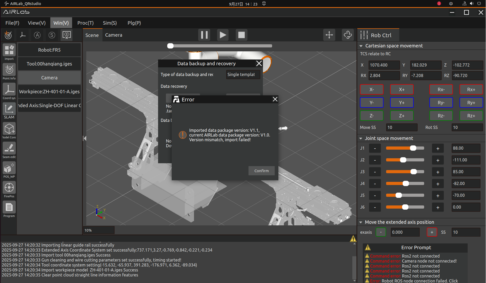

.. centered:: Figure 4-101   The workpiece recognition is successful
    
.. figure:: analysis/4/102.png
    :align: center
    :width: 6.5in

.. centered:: Figure 4-102  Automatically retrieve welding projects and import new projects

Step 3: After the welding project is automatically imported, AIRLab controls the robot to execute the project. Once the program completes, AIRLab and the robot enter the cycle interval wait state.

.. important::
    If different workpieces need to be replaced, users should estimate the replacement time in advance and set the "Cycle Interval" parameter accordingly. If no workpiece replacement is needed, the cycle interval can be set to 0 or 1 (minimal delay).

Step 4: After the waiting period ends, the next cycle begins. AIRLab automatically clears the current project and re-imports the Workpiece Registration Template Project.Upon successful import, AIRLab controls the robot to restart workpiece recognition.f recognition succeeds, AIRLab searches for the corresponding welding project. If the project exists, Step 3 is repeated.

Step 5:AIRLab automatically controls the robot to repeat Step 4 based on the configured Cycle Mode and Cycle Count until all automatic welding cycles are completed，as shown in Figure 4-103.

.. important::
    If a robot controller error or AIRLab error occurs during the cycle, the automatic operation stops immediately, requiring manual troubleshooting before resuming.

.. centered:: Figure 4-103  Reaching the set number of cycles, ending the automatic loop operation

The above outlines the usage method and steps for AIRLab's Automatic Cycle Operation function.

Extended axis synchronous motion
~~~~~~~~~~~~~~~~~~~~~~~~~~~~~~~~~~~~~~~
If an external axis is required during robotic welding, AIRLab provides external axis synchronization functionality.

After selecting the external axis in the import module, click confirm to open the external axis setting pop-up window, as shown in Figure 4-104. After selecting the external axis, click confirm to import it. Click "Get" to obtain the current external axis coordinate system, and click "Save" to set the external axis coordinate system.

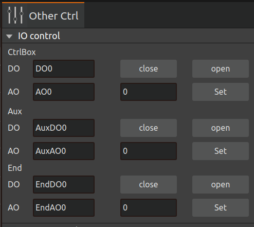

.. centered:: Figure 4-104  Extension axis setting pop-up window

When editing long straight welds that require axis linkage extension, set the external axis positions for the starting and ending points, as shown in Figure 4-105. After weld seam recognition, AIRLab will automatically generate a program based on the weld seam recognition results and the position of the external axis, achieving synchronous motion between the external axis and the robot.

.. figure:: analysis/4/105.png
    :align: center
    :width: 3in

.. centered:: Figure 4-105  When editing long straight welds, it is necessary to set the position parameter of the extension axis

Other controls
~~~~~~~~~~~~~~~~~~~
Click the "Other Controls" button in the operation area to enter the IO setting interface, which mainly includes two modules of IO control and external axis setting.

(1) IO control module

As shown in Figure 4-106, the IO control module enables manual control of the digital outputs, analog outputs (0-10v) in the robot control box and the end tool digital outputs, analog outputs (0-10v) extended IO digital outputs, analog outputs (0-10v):

.. figure:: analysis/4/106.png
    :align: center
    :width: 3in

.. centered:: Figure 4-106  IO Control Module

- DO Setting: Select the port number, click the "On" button to set the corresponding DO high, and click the "Off" button to set the corresponding DO low.
- AO Setting: Select the port number and enter the value (0-100) in the input box on the right, the value is a percentage, setting 100 means setting this AO port to 10v.

(2) Exaxis control

As shown in Figure 4-107, the External Axis Setup module enables control of the robot's external axis.

.. figure:: analysis/4/107.png
    :align: center
    :width: 3in

.. centered:: Figure 4-107  Exaxis Control

- Select the extended axis numbe: click the "Load" button to load the external axis protocol according to the selected extended axis number. Set the running speed (%), acceleration (%) and the maximum distance of the extended axis (mm).
- Remove Enable: Click on the "Remove Enable" button to remove enable from the external axis.
- Servo Enable: Click the "Servo Enable" button to enable the external axis.
- Forward jog: Click the "Forward jog" button to perform a forward tap of the external axis according to the set running speed, acceleration, and maximum distance of the extended axis.
- Reverse jog: Click the "Reverse jog" button to reverse pivot the external axes according to the set running speed, acceleration, and maximum distance of the extended axes.
- Stop jog: Click the "Stop jog" button to stop the external axis from pivoting.
- Zero Set: Click the "Zero Set" button to zero the external axis according to the zero return method, zero seeking speed and hoop speed.

Simulation
~~~~~~~~~~~~~~
As shown in Figure 4-108, after generating the simulation trajectory of the program, open the operation area - simulation, set the simulation speed and simulation interval, click on the "Run" button to start the simulation of the template program, click on the "Stop" button to stop the template program simulation. Click "Stop" button to stop the template program simulation. At the same time, it will generate the simulation trajectory point table to record the simulation trajectory points. In the table, the type of simulation track endpoints is LINEND, and when you click a line in the table, the virtual simulation robot will move to the clicked simulation track point, and at the same time, it will synchronously display the TCP coordinates of the simulation track point.

.. figure:: analysis/4/108.png
    :align: center
    :width: 6in

.. centered:: Figure 4-108  Simulation Page

Program configuration
~~~~~~~~~~~~~~~~~~~~~~~~~~~

The program configuration page is used to configure the program before running it, including the program configuration section and the welding interrupt recovery configuration section, as shown in Figure 4-109.  

.. figure:: analysis/4/109.png
    :align: center
    :width: 3in

.. centered:: Figure 4-109  Program Configuration Page

The program configuration section includes program running configuration, program arc initiation configuration, no model construction settings, and welding machine number selection.

.. figure:: analysis/4/110.png
    :align: center
    :width: 3in

.. centered:: Figure 4-110  Program Configuration

The program running configuration can be selected from manual debugging mode, weld after all recognition and weld after single strip recognition, as detailed below.

- Manual debugging mode: for single-step debugging.

- Weld after all are recognized: Click Auto Run to recognize all the welds before welding.

- Weld after single strip recognition: Clicking Auto Run, the robot will first recognize the first weld seam under the template program node. Upon successful recognition, it will proceed to weld the first seam. After completing the welding, it will continue to recognize the second seam, and this process will repeat until all the seams have been welded. The operation will end once all welds are completed.

The program's arc start configuration can be set to arc start or no arc start. It is recommended to test whether there is a problem by setting no arc start before starting arc welding.

No model building setup: Currently, there are two methods - rebuilding and not rebuilding.

- Rebuilding: Reconstruct the model of the model free workpiece; Suitable for non model artifacts that have not been built before or have poor construction results and need to be rebuilt.

- Not rebuild: If you choose not to rebuild, the model free artifact model will not be rebuilt and will be directly imported from the previously built model. Applicable to previously built model free artifacts, there is no need to re model the model free artifact.

.. important::
    In practical operation, it is recommended to separately carry out the process of building model free artifacts, and after the artifact is successfully built, operate according to the original average model method. In the absence of a model workpiece model, it is recommended to always select "not rebuild" as the parameter for model free construction settings, as the weld seam numbers obtained from model free construction may change during each construction!

After configuring everything, click the "Confirm" button to complete the program configuration.

Welding interruption recovery configuration refers to clearing the parameters that need to be configured to continue welding when the program is interrupted during the welding process; Including the configuration of parameters for detecting unexpected interruptions in welding arc tracking and weld interruption detection.

.. figure:: analysis/4/111.png
    :align: center
    :width: 3in

.. centered:: Figure 4-111  Welding interruption recovery configuration

The parameter configuration for detecting unexpected interruptions in welding arc tracking is aimed at configuring parameters for arc interruptions during the welding process, including selecting whether to detect and configuring the duration of arc interruption confirmation.

- Whether to detect: Indicates whether to detect accidental interruption of welding arc tracking.

- Confirmation duration of arc interruption: Define how many milliseconds arc interruption belongs to arc interruption and needs to be restored.

After configuration, click the "Confirm" button to complete the parameter configuration for detecting accidental interruption of welding arc tracking.

The configuration of welding interruption detection parameters is the parameters required to restore the interrupted robot motion after the program interruption during the welding process, including selecting whether to restore the welding interruption, configuring the overlap distance of the weld seam, configuring the speed of the robot returning to the arc starting point, and configuring the robot motion.

- Whether to restore welding interruption: Select restore. After the welding interruption, a pop-up window will pop up indicating the welding interruption. Clear the error before restoring the interruption, otherwise the interruption will not be restored.

- Overlap distance of weld seam: the overlap distance between the interrupted position and the previous interrupted position after resuming welding.

- Robot returning to arc starting point speed: The speed at which the robot returns to the set arc starting point after the interruption is restored.

- Robot movement to arc starting point mode: After restoring the interrupt, the robot returns to the set arc starting point mode, which can be selected as LIN or PTP mode.

After configuration, click the "Confirm" button to complete the configuration of welding interruption detection parameters.

After the welding interruption recovery configuration is fully configured, run the program. When a welding interruption signal is detected, the following pop-up window will pop up.

.. figure:: analysis/4/112.png
    :align: center
    :width: 3in

.. centered:: Figure 4-112  Welding interruption pop-up window

After checking the environment and troubleshooting, clicking the "Resume Welding" button will restore the interrupt according to the configured parameters.

Multilingual settings
~~~~~~~~~~~~~~~~~~~~~~~~~
AIRLab software currently provides seven language options: Chinese (Simplified), Chinese (Traditional), English, Japanese, Korean, Russian, and French. The detailed multilingual settings page is shown in Figure 4-113. This page provides three operations: switching languages; Export existing languages in AIRLab software; Import a new language. In order to meet the needs of users to switch between multiple languages, set new languages for AIRLab software, and modify existing language content in AIRLab software.

.. figure:: analysis/4/113.png
    :align: center
    :width: 3in

.. centered:: Figure 4-113  "Multilingual Settings" Sub interface

The detailed operation introduction of the above functions is as follows:

(1)Switch the language of AIRLab

Click on the dropdown menu of "Multilingual" in Figure 4-113, select the desired language type, and click the "Confirm" button to immediately switch the AIRLab software language.

(2)User sets new language for AIRLab

Firstly, click the "Export" button to export the language file currently used by AIRLab in CSV format. The exported file path is located in the local Downloads folder, as shown in Figure 4-114. 

.. centered:: Figure 4-114  AIRLab Language File Export Path

The content format of the CSV file is shown in Figure 4-106(if opened with a text editor), including four columns: language_id, location, source_text, translation_text. “language_id” represents the language type, “location” represents the position of the text in the source code, 'source_text' represents the text (Chinese) in the source code, and 'translation_text' represents the translation value corresponding to the source text.

.. figure:: analysis/4/115.png
    :align: center
    :width: 5in

.. centered:: Figure 4-115   Content and format of AIRLab language CSV file

If you use LibreOfffice software to open it, as shown in Figure 4-116, please note that the opening format is shown in Figure 4-117.

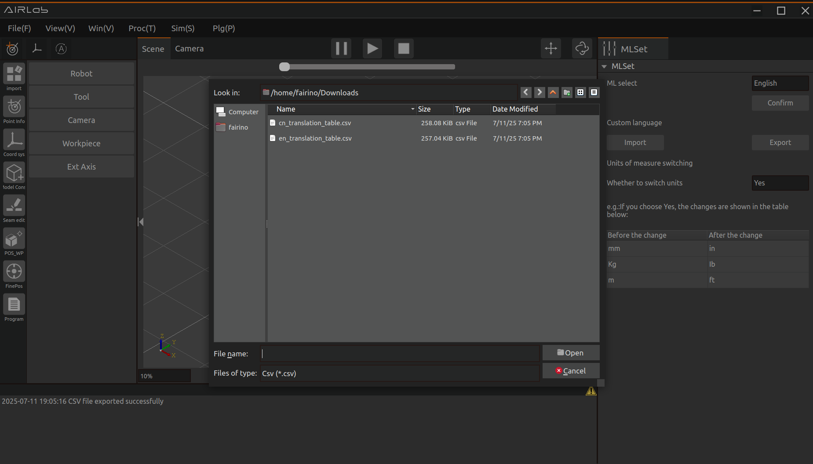

.. centered:: Figure 4-116   LibreOffice software

.. figure:: analysis/4/117.png
    :align: center
    :width: 5in

.. centered:: Figure 4-117   Opening format of AIRLab multilingual files

Next is to write a CSV file for the user. When setting a new language, the user only needs to modify the contents of the first column language_id and the fourth column translation_text. Assuming the user has added French, replace all "English" in the first column of Figure 4-115 with "Français"; The content of the fourth column translation_text needs to be translated by the user based on the Chinese text of "source_text" to obtain the corresponding target language (for the same string appearing in the source text, please translate it into the same word).

.. important::
    Please do not modify any characters under the "source_text" column!

After completing the translation work, the user needs to rename the CSV file to a file name that is the table name of the language data table in the AIRLab language database. For example, the file name "en_translations table" in Figure 4-115 is the table name of the language type "English" in the database.

.. important::
    It is recommended to preserve the language characteristics of the user CSV file naming to avoid duplication with the names of existing language data tables in the database, which may result in errors where the contents of other language data tables are replaced.

Finally, import the CSV file into the AIRLab software, copy the file to the execution directory of the AIRLab software, click the "Import" button, and select the file to import, as shown in Figure 4-118. The AIRLab terminal displays “CSV file import successful”, indicating that the user's language file has been successfully imported, as shown in Figure 4-119. After restarting AIRLab, select the user's newly added language switch from the drop-down menu in "Language Selection".

.. figure:: analysis/4/118.png
    :align: center
    :width: 3.5in

.. centered:: Figure 4-118  Pop up window of the "Import" button

.. centered:: Figure 4-119  Terminal display information when language file import is successful

If the terminal displays "CSV file import failed", as shown in Figure 4-120, you can check the error message in the log record, and carefully check whether the imported CSV file is inconsistent with the originally exported CSV file in terms of the number of rows, columns, and the Chinese delimiter "；" between columns.

.. figure:: analysis/4/120.png
    :align: center
    :width: 3in

.. centered:: Figure 4-120  Terminal display information when language file import fails

.. important::
    When modifying the content of "translation_text", it is necessary to refer to the field length of the Chinese text of "source_text". If the translation value is too long, please use abbreviations appropriately, otherwise the corresponding control text in the AIRLab interface may not be displayed completely.

(3) User modifies existing language in AIRLab

If the user needs to modify an existing language in AIRLab, they first need to click the "Export" button to export the CSV file of that language; After the modification is completed, copy the file to the execution directory of AIRLab software, click the "Import" button, select the modified file to import, and the terminal displays "CSV import successful". After restarting the software, the language modification is completed.

Considering the different usage habits of AIRLab English users, AIRLab-V1.0.2 version has designed the unit of measurement switching as a configuration item for users to choose whether to switch millimeters to inches, as shown in Figure 4-121.

.. figure:: analysis/4/121.png
    :align: center
    :width: 7.5in

.. centered:: Figure 4-121   UI interface for switching measurement units

After the user selects the measurement unit to switch, the input box labeled in millimeters on the AIRLab interface will be converted to inches, as shown in Figure 4-122 and Figure 4-123.

.. figure:: analysis/4/122.png
    :align: center
    :width: 3in

.. centered:: Figure 4-122   Before switching units of measurement

.. figure:: analysis/4/123.png
    :align: center
    :width: 3in

.. centered:: Figure 4-123   After switching units of measurement