Environmental Installation
===========================

.. toctree:: 
    :maxdepth: 5

Tool Preparation
-------------------
#. Edge computing PC.

#. Two 64G USB flash drives, one for booting and one for storing system images.

System image preparation
---------------------------
Contact fairino technical personnel to obtain the initial version mirror version of AIRLab. Download to the system image and store on a USB drive.

Boot disk creation
-------------------
Use U boot software to create a Rescuezilla bootable USB disk.

1. Download and install U boot. It is recommended to download the UEFIversion (you can use other software that supports USB flash drive burning). The download address is：http://uqidong.oumoyc.cn/?bd_vid=7439611603348517307。

2. Open the U boot software and select ISO mode.

.. centered:: Figure 2-1   Select ISO mode

3. Click Browse, select the Rescuezilla image file and click Save.

.. figure:: environment/2.png
	:align: center
	:width: 3.5in

.. centered:: Figure 2-2   Select the Rescuezilla image file

4. Click Start Production, and select No in the pop-up dialog box that prompts you to select ISO.

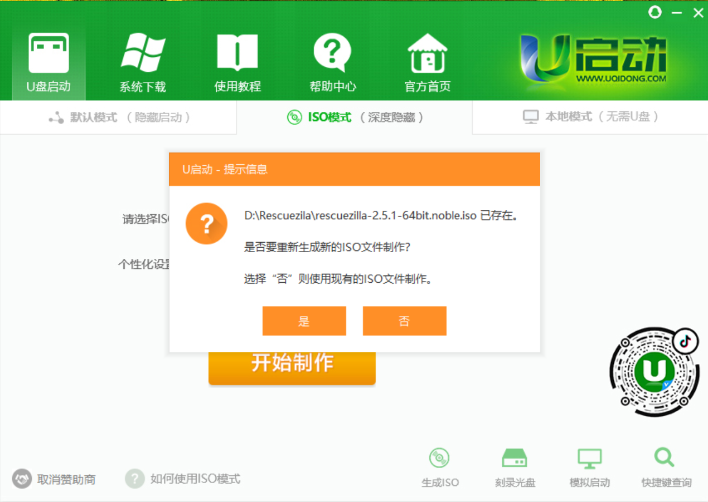

.. centered:: Figure 2-3   Select "No"

5. In the pop-up ISO creation window, select the target USB device in the Hard Drive column and click Write to start creating a bootable USB drive. Wait for the writing operation to complete and then eject the USB drive. 

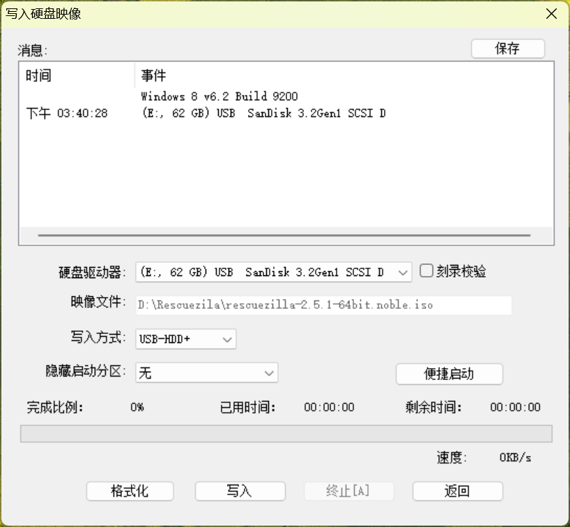

.. centered:: Figure 2-4   Write to USB drive

.. important:: 
  This operation will clear all data on the USB drive. Please make sure that the USB drive is suitable for making a bootable USB drive!

System image installation and startup
---------------------------------------
Modify BIOS startup items
~~~~~~~~~~~~~~~~~~~~~~~~~~~~~~~
After making the Rescuezilla bootable USB disk, insert the bootable USB disk and the system image storage USB disk into the USB port of the edge PC at the same time.

1. After confirming that the keyboard and mouse are connected to the industrial computer, click the power button to turn on the computer, and press F2 to enter the BIOS interface;

.. figure:: environment/5.jpg
	:align: center
	:width: 5in

.. centered:: Figure 2-5   Enter the BIOS page

2. Click the Boot->Boot Priority option in the menu bar to enter the startup item setting sub-interface;

.. figure:: environment/6.jpg
	:align: center
	:width: 5in

.. centered:: Figure 2-6   Enter the startup item settings subpage

3. In the sub-interface, click the option box of Priority #1 and select the startup item corresponding to the USB drive. Press F10 on the keyboard to save the modified startup item and exit. Select YES in the pop-up option box, and the machine will automatically save the settings and restart.

.. figure:: environment/7.jpg
	:align: center
	:width: 5in

.. centered:: Figure 2-7   Modify the startup item and save the changes

Restore the system image
~~~~~~~~~~~~~~~~~~~~~~~~~~~~
1. After the Rescuezilla system starts, select the restore item.

.. figure:: environment/8.jpg
	:align: center
	:width: 5in

.. centered:: Figure 2-8   Select the restore item

2. Enter the first step of the restoration process, select the USB disk path where the system image is stored, and then click Next;

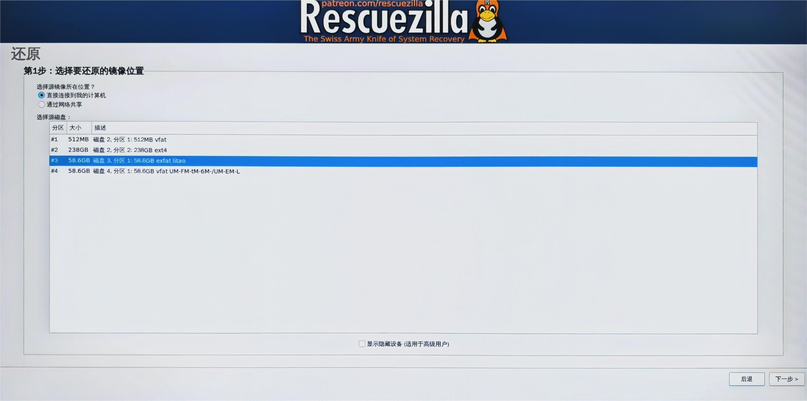

.. centered:: Figure 2-9    Select the USB path where the system image is stored

3. Enter the second step of the restoration process, select the downloaded image file in the system image storage USB disk, and then click Next;

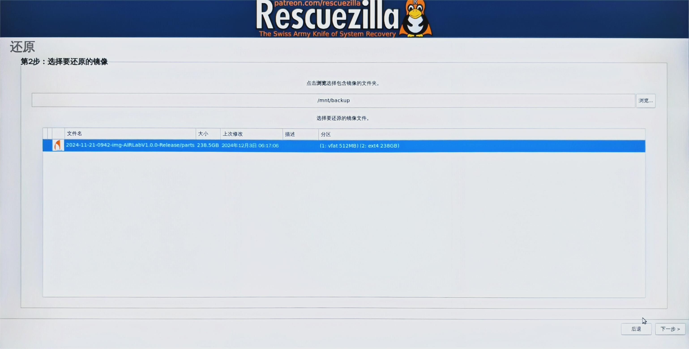

.. centered:: Figure 2-10    Select the initial image file

4. Enter the third step of the restore process, select the target disk where the data in the image file needs to be restored, usually a hard disk on the target machine, and then click Next;

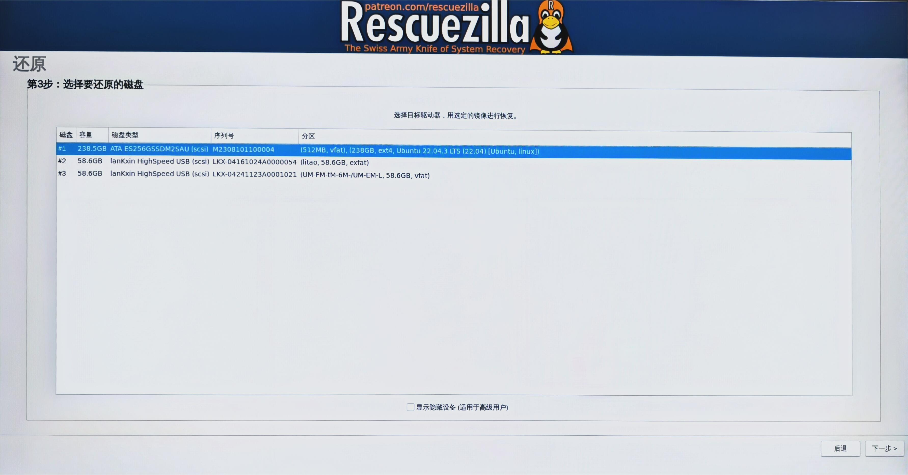

.. centered:: Figure 2-11    Select the target hard disk to restore

5. Enter the fourth step of the restore process, select the partition in the image file that needs to be restored to the target disk and click Next. Note that if you choose to overwrite the partition table here, it will cause the boot information to change, which is generally the default option;

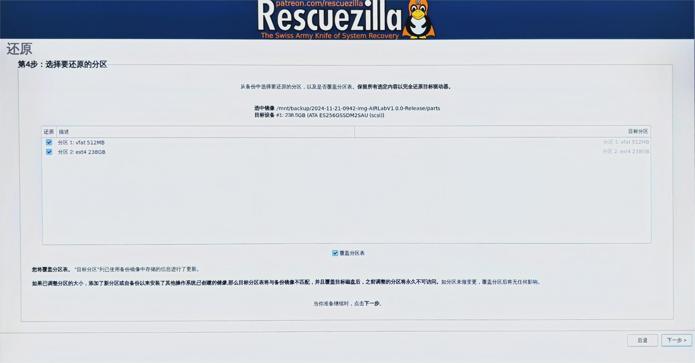

.. centered:: Figure 2-12    Select the partition to restore

6. Enter the fifth step of the restore process, confirm the previous settings and click Next. A confirmation dialog box will pop up, if confirmed, just click Yes;

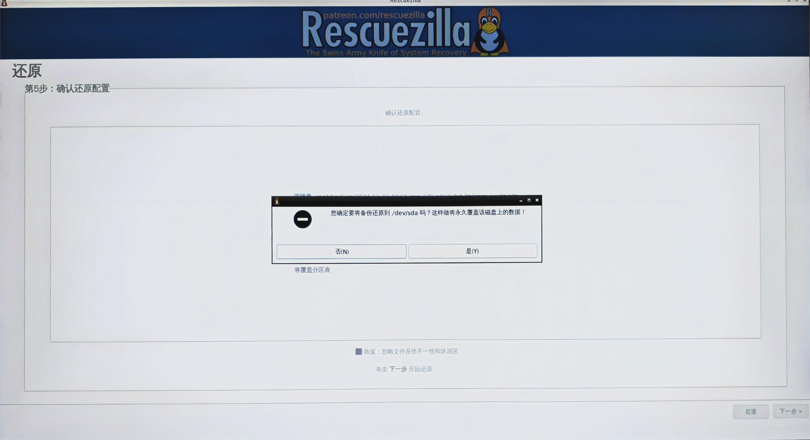

.. centered:: Figure 2-13    Confirm the restore configuration

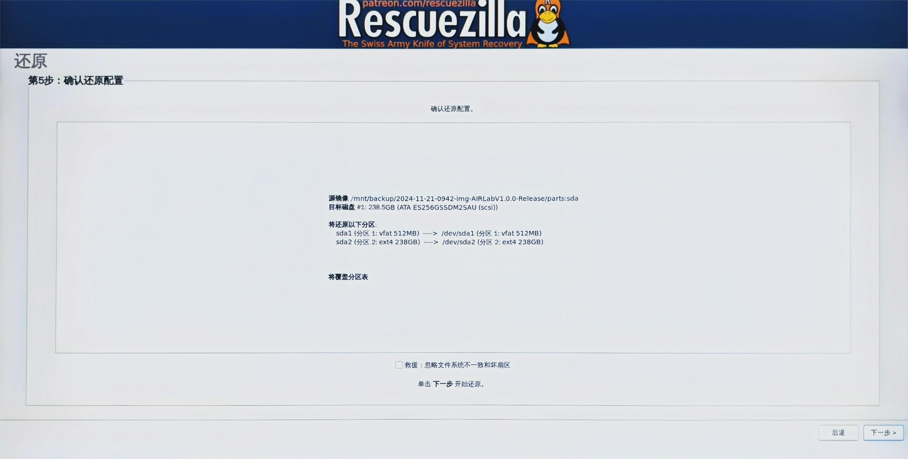

.. centered:: Figure 2-14    Select "Yes" in the pop-up window

7. Enter the restore program and wait for the progress bar to end. Depending on the capacity of the data to be restored, this process may take dozens of minutes.

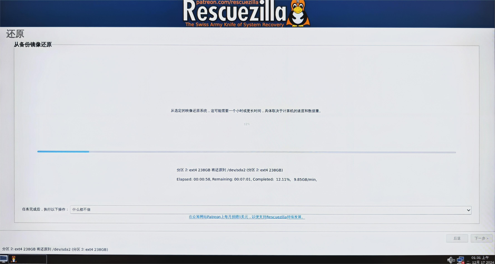

.. centered:: Figure 2-15    Enter the restore program

Start AIRLab software
~~~~~~~~~~~~~~~~~~~~~~~

1. After the restoration process is completed, click the "Shutdown" button in the lower left corner of the page. A dialog box will pop up to select an operation. At this time, select Restart to enter the system initial page;

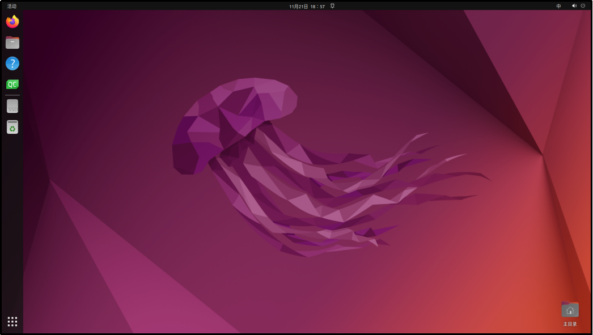

.. centered:: Figure 2-16    Enter the system

2. Click the AIRLab software start icon to start the AIRLab software system. Then you can operate the software according to our user manual.

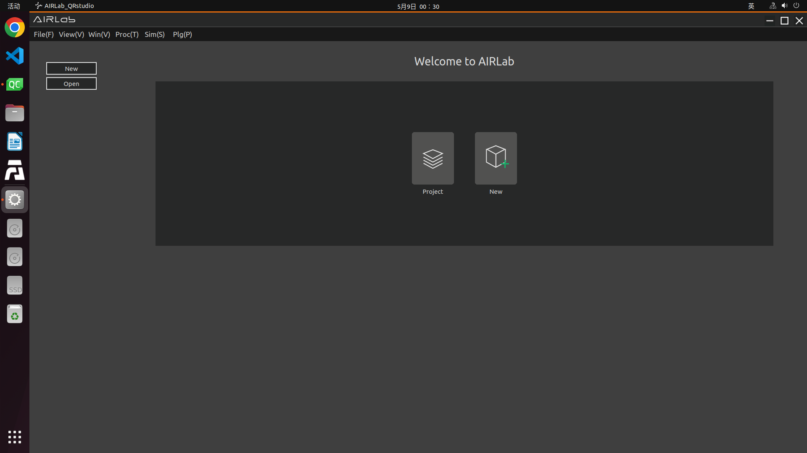

.. centered:: Figure 2-17  Go to the main interface of the AIRLab software