Plug-in
=========

.. toctree:: 
	:maxdepth: 5

This chapter mainly introduces plugin authorization and the functionalities as well as specific operational procedures of each plugin.

binpicking  Plugin Authorization
--------------------------------------
Click on Plugins → Plugin Authorization to view the unique identifier of AIRLab and the authorization status of each plugin.

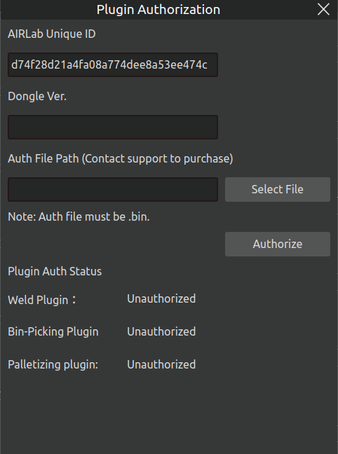

	Plugin Authorization Page

If the status shows "Authorized," the plugin can be opened and used normally. If it shows "Unauthorized," a prompt indicating that the plugin failed to load will appear when attempting to open the plugin, as shown in the figure.

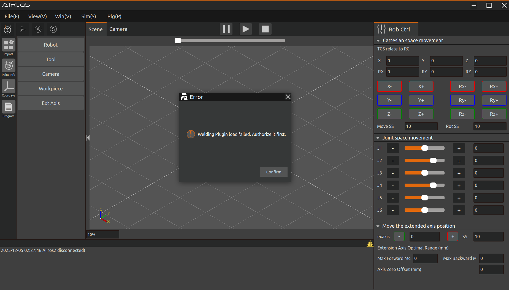

	Welding Plugin Failed to Load

To authorize a plugin, please contact the after-sales service to obtain the authorization file (in .bin format). Then, select this file in the authorization interface and click "Authorize" to proceed with the upgrade.

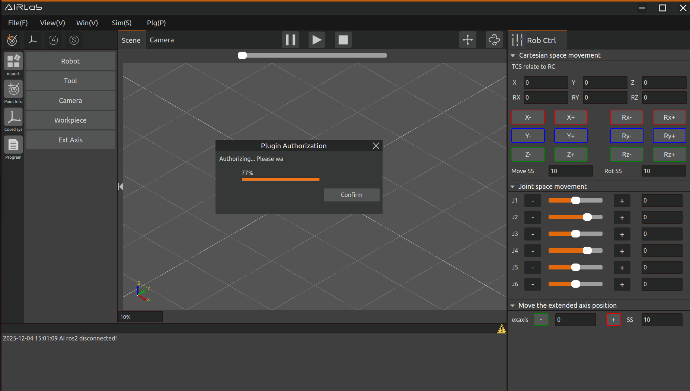

	Authorization in Progress

Once the progress bar has finished loading, the page will display a "Authorization Successful" prompt.

	Authorization Successful

Reinsert the encryption dongle and wait approximately 30 seconds. Once the plugin authorization status updates, it indicates that the authorization process is complete.

If an error occurs during the authorization process, the procedure will automatically terminate, and an error prompt will pop up as shown in the figure. In such cases, please contact the after-sales personnel for assistance.

.. figure::analysis/4/plugin_authr_fail_en.png
	:align: center
	:width: 6in

	Authorization Failed

binpicking
-------------------

The bin Picking plug-in module realizes the function of automatic object grasping. Click Plugin - Bin Picking in the menu bar; the main scene will be divided into a 3D scene and a 2D display scene, and a Bin Picking pop-up window will appear. The 3D scene displays the robot movement process, while the 2D display scene shows the RGB image of the workpiece and the bounding box of the identified workpiece.

Create a binpicking project
~~~~~~~~~~~~~~~~~~~~~~~~~~~~~~~~~
Click on the menu bar - File, select the file type as binpicking, then click "New" or open a binpicking project file; afterward, import the required tool workpiece.

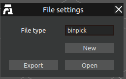

	Create a new binpick project file
	
UI interface introduction
~~~~~~~~~~~~~~~~~~~~~~~~~~~

. figure:: plug/2.png
	:align: center
	:width: 3in

	binpicking pop-up window

After importing the Bin Picking project, click Plugin - Bin Picking in the menu bar to open the Bin Picking pop-up window, as shown in Figure 4-7. The pop-up window is divided into four parts: Initial Settings, Position Binding, Grasping Position Error Compensation, and Program Operation. The overall interface usage process is as follows:

1. Perform Initial Settings First

The Target Object in the initial settings is the object to be grasped. The current plug-in provides three object types for selection: Screw, Lock, and Wooden Block, with a reserved Custom type for future updates. When the target object type is selected, the subsequent parameters will change accordingly.

Meanwhile, the explanations of all other parameters on this interface are as follows:

End Effector: Two options are available: Electric Gripper and Pneumatic Gripper. Select according to the actual control mode of the gripper used—use the former if configured via a protocol, and the latter if controlled via IO.

Opening and Closing Percentage: Used to control the opening and closing size of the Electric Gripper for close and open commands.

Gripper Speed: Used to control the percentage of the opening and closing speed of the Electric Gripper.

Gripping Force: Used to control the percentage of the gripping force of the Electric Gripper.

Hand-Eye Configuration: Configure according to the actual hand-eye setup, divided into Eye-in-Hand and Eye-to-Hand.

Binding Port: Set according to the port bound between the End Effector and the controller, ensuring consistency with the actual configuration.

Idle Movement Speed: Used to set the speed of the robot when moving between transition points during the grasping task.

Grasping Speed: Used to set the speed of the robot when it is about to grasp the object (the next target point is the target grasping point) during the grasping task.

At the same time, all the above options have default values. If the target object type is switched, the plug-in will adjust according to the presets of the current object. The specific preset settings are as follows:

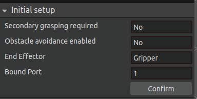

	Initial setup

Screws and wooden blocks use the Electric Gripper by default, while locks use the Pneumatic Gripper. After completing all settings, click OK—the corresponding AI Node for the target will start, which requires a short waiting time. If the node starts successfully, the following pop-up window will be displayed; otherwise, a failure pop-up window will appear.

	AI Node Started Successfully

	AI Node Startup Failed

The instruction feedback area displays "Initial Settings Successful", indicating that the initial settings are completed.

2. Perform Position Binding Afterwards

This subpage is mainly used for point binding for subsequent placement tasks. The specific settings and parameter explanations are as follows:

Camera Capture Position: Set the target point as the robot's image capture point.

Waiting for Grasping Position: Set the target point as the taught point to move to before grasping.

Waiting for Placement Position: Set the target point as the transition taught point before the placement point.

Placement Mode: Three options are available: Fixed Placement, Regular Placement, and Custom Placement Mode.

Fixed Placement Mode: By setting the number of fixed placement points, the grasping process can be controlled to place objects sequentially at the set fixed placement points.

Regular Placement Mode: Placement rules such as the number of rows, columns, layers, and layer height can be set as needed.

Custom Placement Mode: The identified target types and their corresponding placement points can be set; the software will then place the identified objects at the configured placement points according to the actual recognized target model.

The sub-interfaces of various specific modes are displayed as follows:

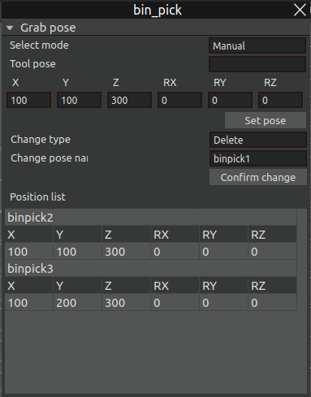

	Position Binding

If the previously selected target object is Lock, due to its special placement rule (Re-grasping), the original Camera Capture Position, Waiting for Grasping Position, and Waiting for Placement Position will be changed to First Capture Point, Second Capture Point, and Re-grasping Placement Point accordingly. Their specific meanings are as follows:

First Capture Point: Set the target point as the image capture point in the initial grasping stage.

Second Capture Point: Set the target point as the image capture point in the re-grasping stage.

Re-grasping Placement Point: Set the target point as the placement point for adjusting the object's pose during re-grasping.

Its interface is displayed as follows:

	Position Binding - Re-grasping

3. Grasping position error compensation

Grasping Position Error Compensation is configured to eliminate systematic errors during the grasping process. If the error is large during grasping, set the error compensation coefficient (based on the tool coordinate system) and click OK after configuration. The instruction feedback area displays "Error Compensation Coefficient Set Successfully", indicating that the error compensation coefficient has been set successfully.

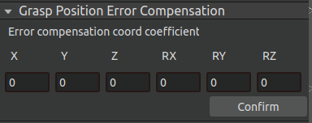

	Grasping position error compensation

4. Program running

After the grasping posture is generated successfully and the position is bound successfully, the program can be run. There are two running modes: manual and automatic.

Manual run: Select manual run, and the robot will perform an automatic grasp;

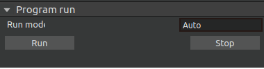

	Manual operation mode

First, click Capture Photo to take an image of the object to be grasped. After successful capture, the terminal will display a "Photo Captured Successfully" prompt, and the 2D scene will show the RGB image of the actual workpiece.

Then click AI Calculation—the AI will recognize the position of the object to be grasped, and the 2D scene will display the bounding box of the workpiece.

Wait for the calculation to complete, then click Run LUA—the robot will perform one recognition and grasping movement.

If the target type is Lock, three additional buttons will appear on the manual interface: Initial Grasping, Pose Adjustment, and Re-grasping, corresponding to the AI Calculation process of the three stages in re-grasping. This allows manual operation of each stage. The interface is as follows:

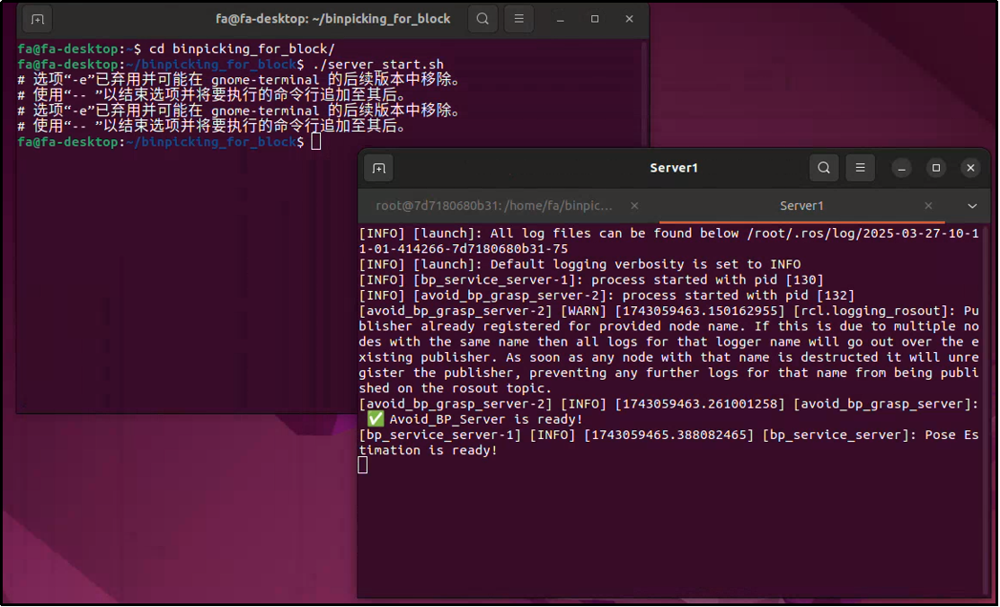

	Manual Operation Mode - Lock

Automatic operation: Automatic operation includes running, stopping, and resetting;

Run: Click the Run button, and the robot will automatically perform image recognition and grasping operations.

Stop: Click the Stop button, and the automatic grasping will stop.

Reset: Click the Reset button—the grasping counter will be set to 0. The next run will start grasping from the beginning and place the object at the first placement position. If the target type is Screw, the tray dumping action will be executed first.

	Automatic operation mode

Overall operation process
~~~~~~~~~~~~~~~~~~~~~~~~~~~~~~~~~~~~~~~
1. Camera calibration

Prior to performing grasping operations, camera calibration must be completed. Select the appropriate calibration mode based on your system configuration:

Eye-in-Hand Calibration (for mounted camera systems)

Eye-to-Hand Calibration (for fixed external cameras)

2. Point teaching

1) Secondary grasping teaching points:

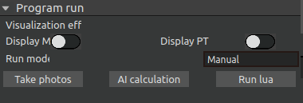

	Secondary capture position binding

First Capture Position:Teach the position directly above the target object Ensure the camera can fully capture the object within the frame.

Second Capture Position:Teach the position directly above the intermediate placement location.

Secondary Grasping Placement Position:Teach the adjustment position where objects will be placed for reorientation.

2) Non secondary grasping teaching points:
 
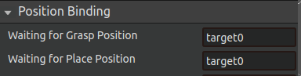

	Non-secondary capture position binding

Waiting for Grasp Position:Located near the actual grasping point,ensures ready access to target objects;

Waiting for Place Position: Positioned adjacent to the drop location (Recommended drectly above the intended placement point for optimal operation).

3) Fixed placement of teaching points:

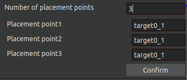

	Fixed placement location binding

Choose a fixed number of placement points, and if there are several placement points, teach them how many placement points to use;

4) Regular placement of teaching points:
   
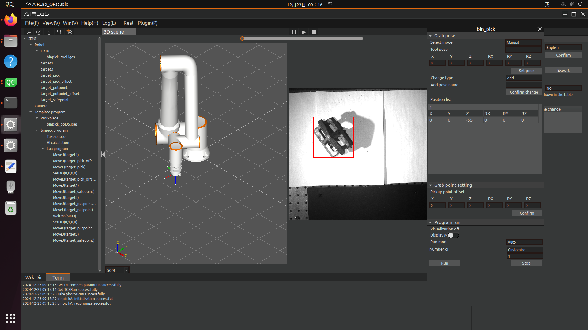

	Rule placement location binding

The first, second, and third path points determine the placement matrix for regulatory placement; The first and second path points determine the rows of the placement matrix, while the second and third path points determine the columns of the placement matrix.

5) Custom Placement Teaching Points

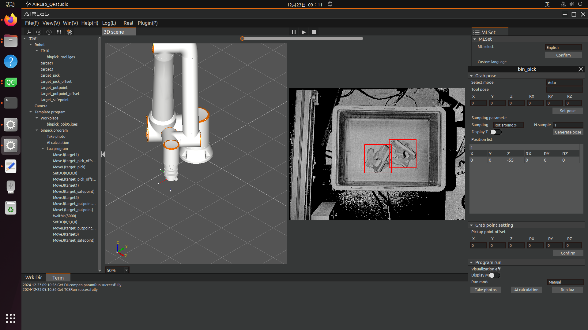

	Regular Placement Position Binding

Similar to fixed placement, first determine the target types for the current task and add corresponding placement points in sequence. If multiple placement points are required for the same target, change the placement point and continue adding while keeping the target model unchanged.

	Custom Placement Position Binding

3. Run AIRLab software
   
Start AIRLab software with one click (make sure the robot arm is connected and the visual node is successfully started), open the binpicking plug-in, Perform initial setup first, and after successful initial setup, perform location binding,and then run the program.