Plug-in
=========

.. toctree:: 
	:maxdepth: 5

This chapter mainly introduces plugin authorization and the functionalities as well as specific operational procedures of each plugin.

Plugin Authorization
--------------------------------------
Click on Plugins → Plugin Authorization to view the unique identifier of AIRLab and the authorization status of each plugin.

.. figure:: analysis/4/plugin_authr_en.png
	:align: center
	:width: 3.5in

	Plugin Authorization Page

If the status shows "Authorized," the plugin can be opened and used normally. If it shows "Unauthorized," a prompt indicating that the plugin failed to load will appear when attempting to open the plugin, as shown in the figure.

.. figure:: analysis/4/plugin_authr_load_fail_en.png
	:align: center
	:width: 6in

	Welding Plugin Failed to Load

To authorize a plugin, please contact the after-sales service to obtain the authorization file (in .bin format). Then, select this file in the authorization interface and click "Authorize" to proceed with the upgrade.

.. figure:: analysis/4/plugin_authr_process_en.png
	:align: center
	:width: 6in

	Authorization in Progress

Once the progress bar has finished loading, the page will display a "Authorization Successful" prompt.

.. figure:: analysis/4/plugin_authr_sucess_en.png
	:align: center
	:width: 6in

	Authorization Successful

Reinsert the encryption dongle and wait approximately 30 seconds. Once the plugin authorization status updates, it indicates that the authorization process is complete.

If an error occurs during the authorization process, the procedure will automatically terminate, and an error prompt will pop up as shown in the figure. In such cases, please contact the after-sales personnel for assistance.

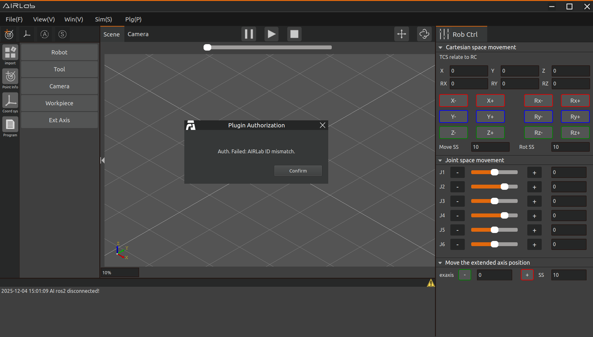

	Authorization Failed

bin-picking
-------------------

The bin-picking plug-in module realizes the function of automatic object grasping. Click Plugin - bin-picking in the menu bar; the main scene will be divided into a 3D scene and a 2D display scene, and a bin-picking pop-up window will appear. The 3D scene displays the robot movement process, while the 2D display scene shows the RGB image of the workpiece and the bounding box of the identified workpiece.

Create a bin-picking project
~~~~~~~~~~~~~~~~~~~~~~~~~~~~~~~~~
Click File in the menu bar, select the file type as bin-picking, and click New. Then import the required robot, tool, and workpiece, or directly open an existing bin-picking project file.

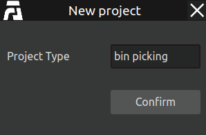

	Create a new bin-picking project file
	
After opening the plug-in, three new options appear in the menu bar: Model, Settings, and Debug, as shown in the figure below.

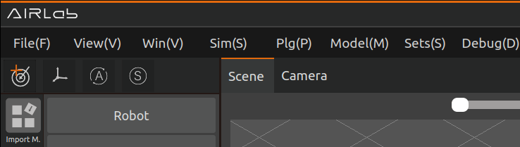

	bin-picking menu bar
	
bin-picking Model Pop-up Window
~~~~~~~~~~~~~~~~~~~~~~~~~~~~~~~~~~~~~
Click Model in the menu bar to open the model training pop-up window, as shown below.

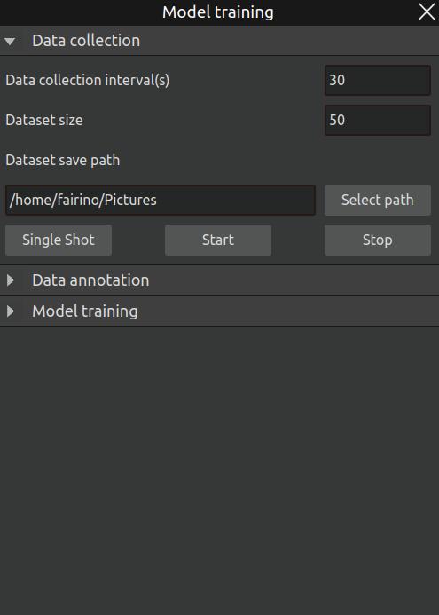

	bin-picking model training – data collection pop-up window

This pop-up window allows you to build datasets, annotate, and train models autonomously. The specific steps are as follows:

Step 1: First click the Data Collection title to open the sub-interface. This interface provides three configurable parameters:

- Data collection interval: The interval between automatic captures, in seconds.
- Dataset size: The total number of images to be collected automatically.
- Dataset save path: The directory where the captured dataset images will be stored. Click the Select Path button on the right to open the path selection dialog.

.. figure:: plug/binpicking_model_path_choose.png
	:align: center
	:width: 4in

	bin-picking path selection pop-up window

After completing the parameter settings, click Start to begin capturing images. After each capture, reposition the target object; the next automatic capture will occur after the set interval, eliminating the need for frequent manual clicks. Click Stop at any time to end the data collection process. The Single Capture button triggers a single shot, useful for testing.

Step 2: After obtaining the raw dataset, click the Data Annotation title to open its sub-interface, as shown below.

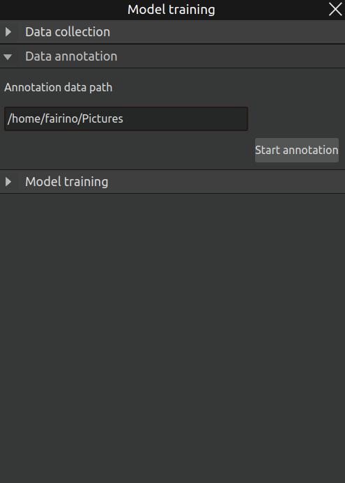

	bin-picking model training – data annotation pop-up window

The annotation data path automatically adopts the previous raw dataset path. Simply click Start Annotation to launch the Labelme annotation software, as shown below.

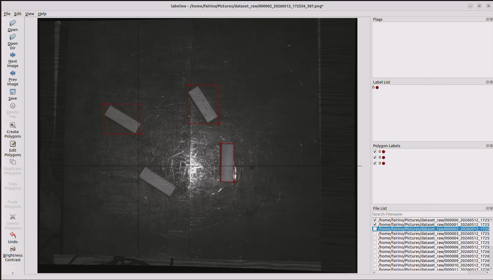

	bin-picking model training – Labelme software

After opening, use the rectangle tool to outline the target object, assign the desired ID, and save. Repeat this for all images in the raw dataset, then proceed to the next step.  

Step 3: After annotating the entire raw dataset, click the Model Training title to open its sub-interface and prepare for the final model training step. The interface is shown below.  

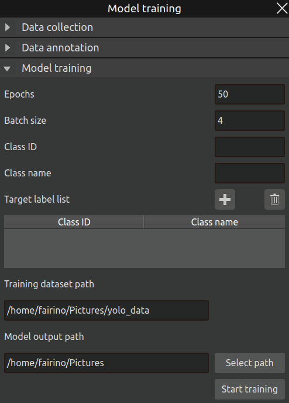

	bin-picking model training – model training pop-up window

The parameters in this interface are explained as follows:  

- Training epochs: Total number of training epochs.  
- Training batch size: Amount of input data per training step.  
- Class ID: Fill in the same class IDs used during annotation.  
- Class name: The name used for the target object during training; simply using the same value as the ID is practical. After configuration, click the Add icon to insert the entry into the table, as shown below.  

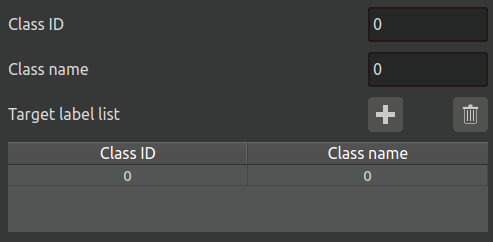

	bin-picking model training – target label list

- Training dataset path: Also related to the raw dataset path; it will be automatically filled as the `yolo_data` folder under the raw dataset path.  
- Model output path: The output path for the final model file after training is complete.  

After setting all parameters, click the Start Training button to begin the model training process automatically. When training is finished, a pop-up notification will appear, as shown below.  

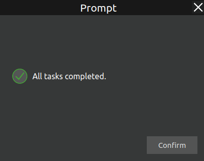

	bin-picking model training – training completion pop-up

The generated model file ends with the `.pt` extension and can be found under `train/weights` within the specified model output path. Generally, `best.pt` is selected, as shown below.  

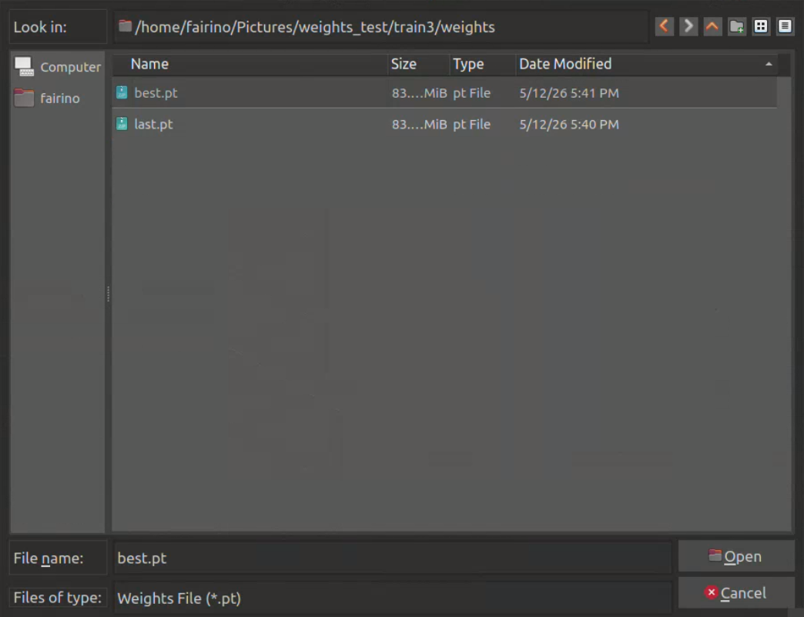

	bin-picking model training – .pt file path

After completing the entire workflow, the required model (.pt) file for subsequent use is generated successfully.  

bin-picking Settings Pop-up Window 
~~~~~~~~~~~~~~~~~~~~~~~~~~~~~~~~~~~~~
Click Settings in the menu bar to open the bin-picking settings pop-up window, as shown below. The bin-picking pop-up consists of five sections: Project Configuration, Initial Settings, Position Binding, Grasp Position Error Compensation, and Program Execution. The workflow of the whole interface is as follows:  

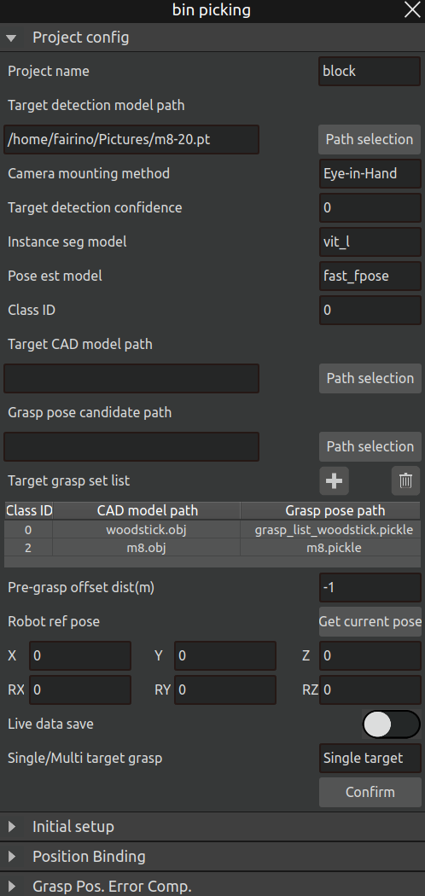

	bin-picking pop-up window

Step 1: Project Configuration  

This involves many parameter settings, explained as follows:  

- Project name: Three pre-configured scenarios are reserved in the plug-in: wooden block, screw, and lock, plus an Add New option for custom projects. If Add New is selected, the interface changes as shown below. Enter the new project name and click OK; the new project name will be added to the dropdown list for selection and editing.  

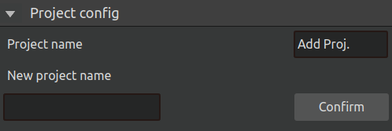

	bin-picking settings pop-up – adding a new project

- Object detection model path: Select the `.pt` file generated during model training.  
- Camera mounting method: Choose Eye-in-hand or Eye-to-hand according to the actual setup.  
- Object detection confidence: Confidence threshold for object detection; results below this threshold are discarded.  
- Instance segmentation model: Two model options are provided: `fastsam` and `vit_l`.  
- Pose estimation model: Two options are provided: `fpose` and `fast_fpose`.  
- Class ID: Must match the class ID designed during model training.  
- Target CAD model path: The CAD model path for that class ID.  
- Grasp pose candidate path: The grasp pose candidate path for that class ID.  

After setting the above three parameters (class ID, CAD path, candidate path), click the Add icon to populate the target grasp setting list. Repeat until all entries match the actual requirements.  

- Pre-grasp offset distance: The transition point before reaching the grasp point, expressed as the distance from the grasp point, in meters.  
- Robot reference pose: The reference pose for the robot’s grasping posture during motion, usually the pose at the photo-taking point. This can be set by moving to the photo-taking point and clicking Get Current Pose.  
- Save field data: When enabled, images captured during the grasping process are saved and can be exported for later review.  
- Single / Multiple target grasping: Select the number of grasp poses to be recognized in the scene per recognition. Single means only one pose in the scene is recognized each time, while Multiple means as many grasp poses as possible are recognized at once.  

After completing all parameter settings, click the Confirm button to finalize the project configuration. At the same time, the corresponding AI nodes will start. Wait a moment; if the nodes start successfully, a pop-up as shown below will appear. Otherwise, a failure pop-up will be shown.  

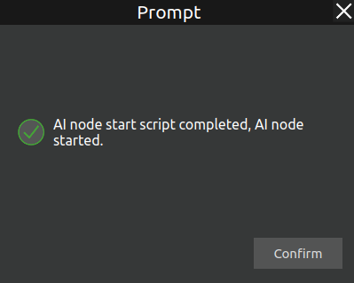

	AI Node Started Successfully

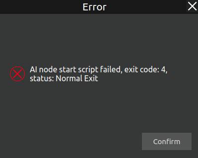

	AI Node Startup Failed

Step 2: Initial Settings

The initial settings interface is shown below:  

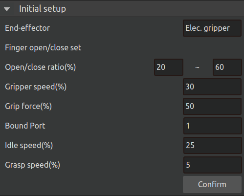

	bin-picking settings pop-up – initial settings

Parameter descriptions:  

- End effector: Two options: Electric gripper and Pneumatic gripper. Choose according to the actual control method of the gripper. If control is via a configured protocol, use the former; if controlled by IO, use the latter.  
- Opening/closing percentage: Controls the opening and closing size of the electric gripper for close and open commands.  
- Gripper speed: Controls the speed percentage of the electric gripper when opening/closing.  
- Gripping force: Controls the gripping force percentage of the electric gripper.  
- Binding port: Set according to the port to which the end effector is bound on the controller; keep it consistent with the actual connection.  
- Travel speed: Sets the robot’s speed when moving between transition points during a grasping task.
- Grasping speed: Sets the robot’s speed when it is about to grasp an object (the next target point is the grasp point).

Step 3: Position Binding

This subpage is mainly used for point binding for subsequent placement tasks. The specific settings and parameter explanations are as follows:

- Camera Capture Position: Set the target point as the robot's image capture point.
- Waiting for Grasping Position: Set the target point as the taught point to move to before grasping.
- Waiting for Placement Position: Set the target point as the transition taught point before the placement point.
- Placement Mode: Three options are available: Fixed Placement, Regular Placement, and Custom Placement Mode.
- Fixed Placement Mode: By setting the number of fixed placement points, the grasping process can be controlled to place objects sequentially at the set fixed placement points.
- Regular Placement Mode: Placement rules such as the number of rows, columns, layers, and layer height can be set as needed.
- Custom Placement Mode: The identified target types and their corresponding placement points can be set; the software will then place the identified objects at the configured placement points according to the actual recognized target model.

The sub-interfaces of various specific modes are displayed as follows:

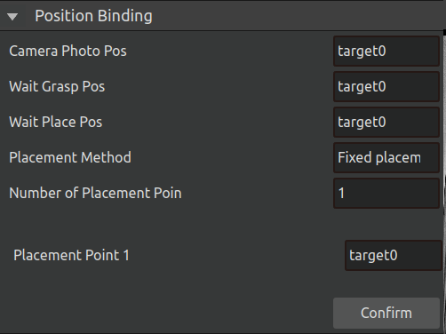

	Position Binding-Fix

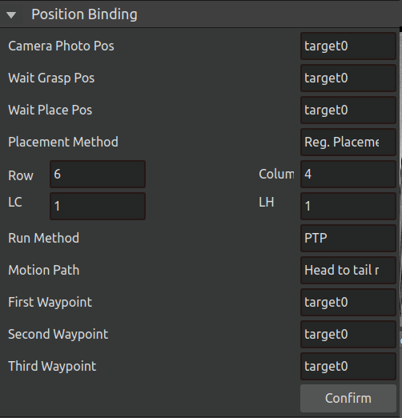

	Position Binding-Regular

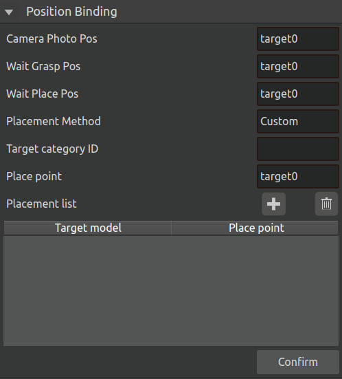

	Position Binding-Custom

If the previously selected target object is Lock, due to its special placement rule (Re-grasping), the original Camera Capture Position, Waiting for Grasping Position, and Waiting for Placement Position will be changed to First Capture Point, Second Capture Point, and Re-grasping Placement Point accordingly. Their specific meanings are as follows:

- First Capture Point: Set the target point as the image capture point in the initial grasping stage.
- Second Capture Point: Set the target point as the image capture point in the re-grasping stage.
- Re-grasping Placement Point: Set the target point as the placement point for adjusting the object's pose during re-grasping.

Its interface is displayed as follows:

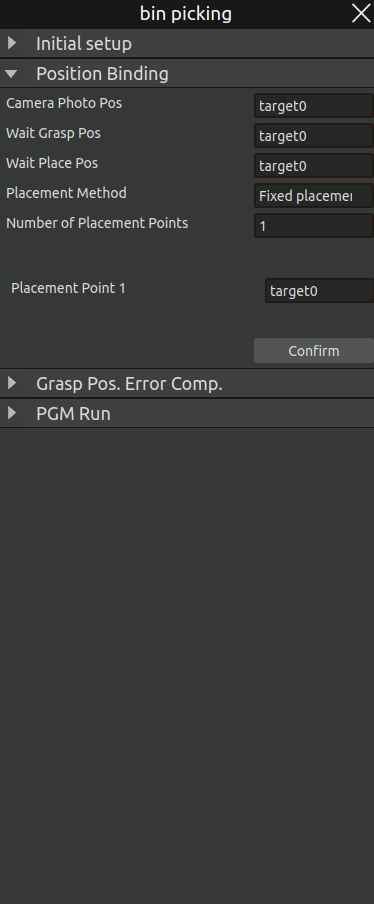

	Position Binding - Re-grasping

Step 4: Grasp Position Error Compensation

Grasping Position Error Compensation is configured to eliminate systematic errors during the grasping process. If the error is large during grasping, set the error compensation coefficient (based on the tool coordinate system) and click OK after configuration. The instruction feedback area displays "Error Compensation Coefficient Set Successfully", indicating that the error compensation coefficient has been set successfully.

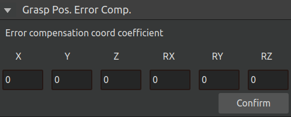

	Grasping position error compensation

1. Program running

After the grasping posture is generated successfully and the position is bound successfully, the program can be run. There are two running modes: manual and automatic.

Manual run: Select manual run, and the robot will perform an automatic grasp;

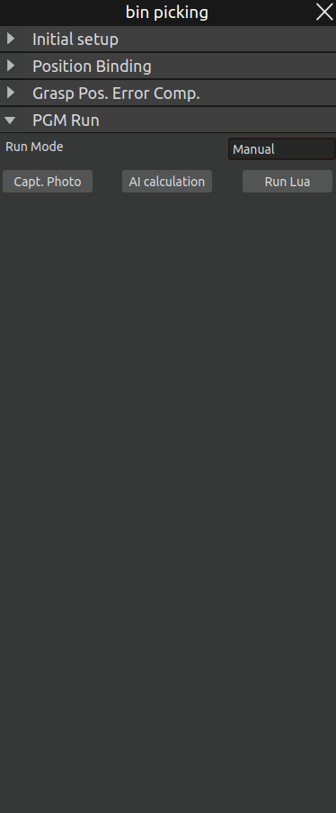

	Manual operation mode

First, click Capture Photo to take an image of the object to be grasped. After successful capture, the terminal will display a "Photo Captured Successfully" prompt, and the 2D scene will show the RGB image of the actual workpiece.

Then click AI Calculation—the AI will recognize the position of the object to be grasped, and the 2D scene will display the bounding box of the workpiece.

Wait for the calculation to complete, then click Run LUA—the robot will perform one recognition and grasping movement.

If the target type is Lock, three additional buttons will appear on the manual interface: Initial Grasping, Pose Adjustment, and Re-grasping, corresponding to the AI Calculation process of the three stages in re-grasping. This allows manual operation of each stage. The interface is as follows:

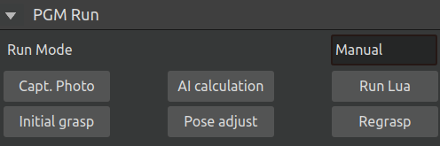

	Manual Operation Mode - Lock

- Automatic operation: Automatic operation includes running, stopping, and resetting;
- Run: Click the Run button, and the robot will automatically perform image recognition and grasping operations.
- Stop: Click the Stop button, and the automatic grasping will stop.
- Reset: Click the Reset button—the grasping counter will be set to 0. The next run will start grasping from the beginning and place the object at the first placement position. If the target type is Screw, the tray dumping action will be executed first.
- Pause: Pause the current program execution.
- Resume: Resume the action from the paused action cycle.

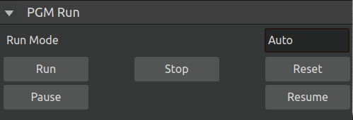

	Automatic operation mode

bin-picking Debug File Export Pop-up Window
~~~~~~~~~~~~~~~~~~~~~~~~~~~~~~~~~~~~~~~~~~~~~~~~~~~~~~~
Click Debug in the menu bar to open the debug file export pop-up window, as shown below.

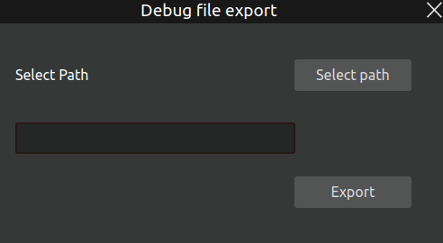

	bin-picking file export pop-up window

Select the export path for the debug files and click the Export button. The export process begins, the progress bar moves, and upon completion, the following pop-up appears.

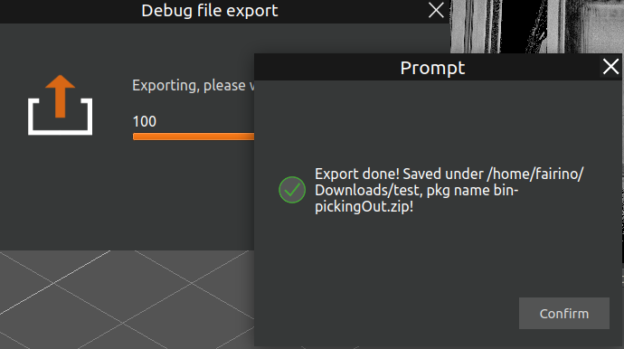

	bin-picking file export – completion pop-up

Overall operation process
~~~~~~~~~~~~~~~~~~~~~~~~~~~~~~~~~
1. Camera calibration

Prior to performing grasping operations, camera calibration must be completed. Select the appropriate calibration mode based on your system configuration:

Eye-in-Hand Calibration (for mounted camera systems)

Eye-to-Hand Calibration (for fixed external cameras)

2. Point teaching

1) Secondary grasping teaching points:

.. figure:: plug/9.png
	:align: center
	:width: 3in

	Secondary capture position binding

- First Capture Position:Teach the position directly above the target object Ensure the camera can fully capture the object within the frame.
- Second Capture Position:Teach the position directly above the intermediate placement location.
- Secondary Grasping Placement Position:Teach the adjustment position where objects will be placed for reorientation.

2) Non secondary grasping teaching points:
 
.. figure:: plug/10.png
	:align: center
	:width: 3in

	Non-secondary capture position binding

- Waiting for Grasp Position:Located near the actual grasping point,ensures ready access to target objects;
- Waiting for Place Position: Positioned adjacent to the drop location (Recommended drectly above the intended placement point for optimal operation).

3) Fixed placement of teaching points:

.. figure:: plug/11.png
	:align: center
	:width: 3in

	Fixed placement location binding

Choose a fixed number of placement points, and if there are several placement points, teach them how many placement points to use;

4) Regular placement of teaching points:
   
.. figure:: plug/12.png
	:align: center
	:width: 3in

	Rule placement location binding

The first, second, and third path points determine the placement matrix for regulatory placement; The first and second path points determine the rows of the placement matrix, while the second and third path points determine the columns of the placement matrix.

5) Custom Placement Teaching Points

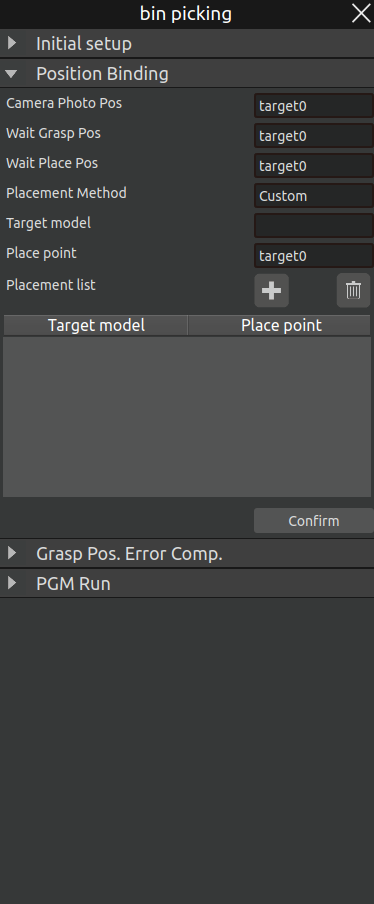

	Custom Placement Position Binding

Similar to fixed placement, first determine the target types for the current task and add corresponding placement points in sequence. If multiple placement points are required for the same target, change the placement point and continue adding while keeping the target model unchanged.

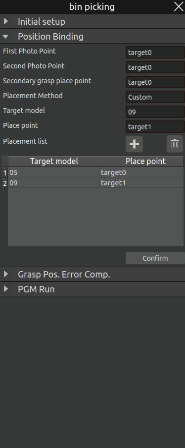

	Custom Placement Position Binding-Result

3. Run AIRLab software
   
Start AIRLab software with one click (make sure the robot arm is connected and the visual node is successfully started), open the bin-picking plug-in, Perform initial setup first, and after successful initial setup, perform location binding,and then run the program.

Palletizing Plugin
---------------------
The palletizing plugin enables automatic recognition and grasping of objects and automatically places them according to a pre-set stacking pattern. Click "Plugins -> Open Palletizing Plugin" in the menu bar. The main scene will be divided into two display areas: a 3D scene and a 2D scene. The 3D scene is used to display the robot's motion process, running trajectory, and simulation model; the 2D scene is used to display the RGB image of the workpiece and its recognized bounding boxes.

At the same time, the following three options will be added to the menu bar: "Model", "Settings", and "Debug", as shown in the figure below.

	Palletizing Menu Bar

Click the "Settings" button to open the pop-up window of the palletizing plugin, as shown in the figure below.

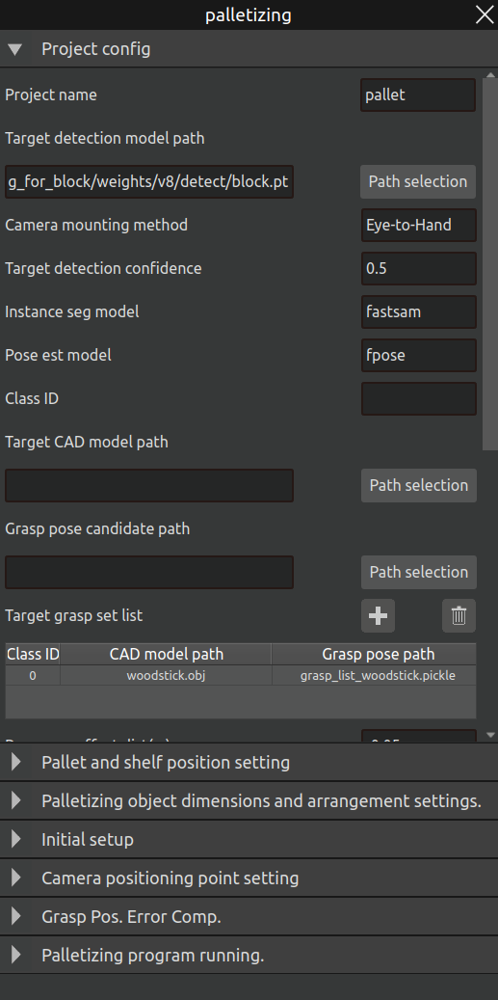

	Palletizing Plugin Opened

Palletizing Project Configuration
~~~~~~~~~~~~~~~~~~~~~~~~~~~~~~~~~~~~~~~~~
The palletizing plugin also supports the training and customization process for the entire palletizing project, which is similar to the bin-picking plugin. For specific operations in the model preparation stage, refer to Section 4.2.2 "Bin-picking Model Pop-up", which includes model dataset construction, data annotation, and model training. For the project configuration stage, refer to the project settings section in Section 4.2.3 "Bin-picking Settings Pop-up". Most parameters are similar to those in the bin-picking plugin. The parameters unique to palletizing are described below. The entire pop-up window interface is shown in the figure below.

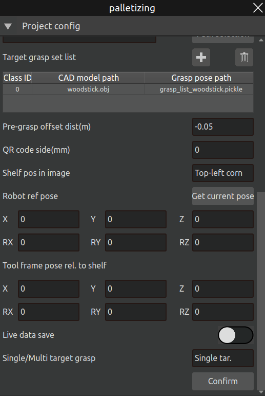

	Palletizing Project Parameter Configuration

- QR Code Side Length: The side length of the QR code attached to the pallet to be recognized, in millimeters.
- Position of the Shelf in the Image: Select the position of the shelf in the image according to the actual situation. Four options are available: Top Left, Bottom Left, Top Right, Bottom Right.
- Relative Pose Between Tool Coordinate System and Shelf: The pose of the tool coordinate system relative to the shelf when the robot grips the shelf (in the gripping posture).

After completing the palletizing "Project Configuration", click the "OK" button. At the same time, the AI node will be opened accordingly (consistent with the process described in Section 4.2.3), and subsequent operations can be performed.

Pallet Identification and Positioning
~~~~~~~~~~~~~~~~~~~~~~~~~~~~~~~~~~~~~~~~
In the AIRLab software, first import the robot and tool models. Then, paste a QR code at the position of the first item to be palletized on the pallet to determine the pallet coordinate system and its initial position. Next, teach the robot the photographing point for the pallet (this point must be located directly above the QR code to ensure a clear image for AI recognition).

After that, click "Palletizing - Pallet Position Settings," select the taught photographing point, and click the "Photograph" button. The robot will automatically move to that point to take a photo and perform AI recognition. Once recognition is complete, the 3D scene will display the identified pallet coordinates, and the pallet workpiece will be automatically imported into the 3D scene.

.. important::
	The recognized pallet coordinates may have pose errors. Please check the RX and RY angles in the "Pallet Coordinates" column in the figure below. The acceptable ranges are -180° to -175°, 175° to 180°, and -5° to 5°. If the deviation is too large, it is recommended to re-take the photo for recognition.

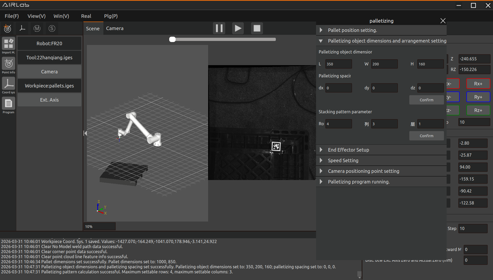

	Pallet Identification and Positioning

After successful pallet recognition and positioning, set the pallet dimensions and click the OK button to confirm.

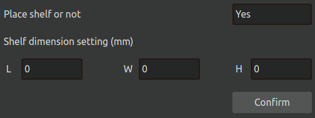

	Shelf Placement Settings

If it is necessary to intersperse shelf placement during the palletizing process, confirm the "Place Shelf" setting, fill in the shelf dimensions, and click the OK button.

Pallet Stacking Pattern Configuration
~~~~~~~~~~~~~~~~~~~~~~~~~~~~~~~~~~~~~~~~
Open "Palletizing - Palletized Item Dimensions and Arrangement Settings," set the dimensions of the palletized items and the stacking spacing, and click the "Confirm" button. The software will then automatically calculate the stacking pattern parameters (maximum number of rows and columns on the pallet) based on the pallet dimensions and the dimensions of the palletized items.

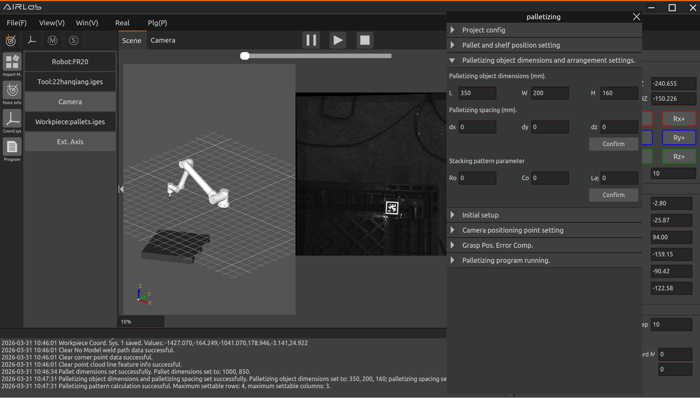

	Palletized Item Dimension Settings

The stacking pattern parameters can be modified. If a value greater than the maximum number of rows or columns is set, the software will display an error message. Click the "Confirm" button to finalize the stacking pattern parameters.

Palletizing Parameter Settings
~~~~~~~~~~~~~~~~~~~~~~~~~~~~~~~~~~
1. Initial Settings

Initial settings for automatic palletizing operation, including end effector settings, speed settings, etc. The interface is shown below.

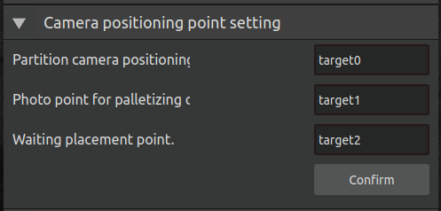

	Palletizing Initial Settings

The specific definitions of each parameter are as follows:

- End Effector: The robot's end tool. Currently only pneumatic grippers are supported.
- Binding Port: The binding port number corresponding to the end effector. The two buttons below can be used to manually open/close the gripper.
- Incoming Material Signal Port: The port bound for the robot to read the incoming material signal during palletizing tasks.
- Vacuum Signal Port: The port bound for the robot to read the gripper vacuum signal during palletizing tasks.
- Free Movement Speed: The speed of the robot between transition points and during movement to the pre-grasp position during palletizing tasks.
- Grasping Speed: The speed from the pre-grasp position to the grasp position.

After completing the settings, click the "Confirm" button.

2. Camera Pose Settings

It is necessary to bind the shelf camera pose, the palletizing object camera pose, and the waiting placement pose. The interface is shown below.

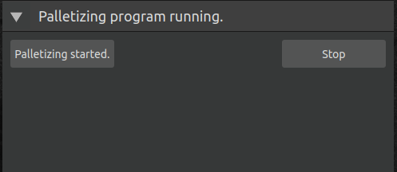

	Camera Pose Settings

The specific meanings are as follows:

- Shelf Camera Pose: The camera pose used to photograph and recognize the shelf. It is recommended to set this pose above the lower left corner of the shelf to ensure a clear capture of the lower left corner for recognition. You can click the "Photo Recognition" button on the right to perform manual recognition debugging and observe the photo effect.
- Palletizing Object Camera Pose: The camera pose used to photograph and recognize the palletizing object. It is recommended to set this pose above the grasp position of the palletizing object to ensure a complete capture of the object to be grasped. You can click the "Photo Recognition" button on the right to perform manual recognition debugging and observe the photo effect.
- Number of Transition Points: The number of transition points that the robot passes through during palletizing operation between the grasp pose and the placement pose.
- Transition Points: The transition points between the grasp pose and the placement pose. According to the set order of transition points, after grasping the object, the robot sequentially passes through the camera pose, Transition Point 1, Transition Point 2, etc., and finally returns to the placement pose. It is recommended to set these points in the middle position between the grasp pose and the placement pose, and the change in posture from the placement pose and the grasp pose should not be too large.

After completing the settings, click the "OK" button.

Palletizing Program Execution
~~~~~~~~~~~~~~~~~~~~~~~~~~~~~~~~~~
1. After completing pallet identification, stacking pattern configuration, and operation settings, proceed to execute the palletizing program.

Open "Palletizing - Palletizing Program Execution" and click the "Start Palletizing" button.

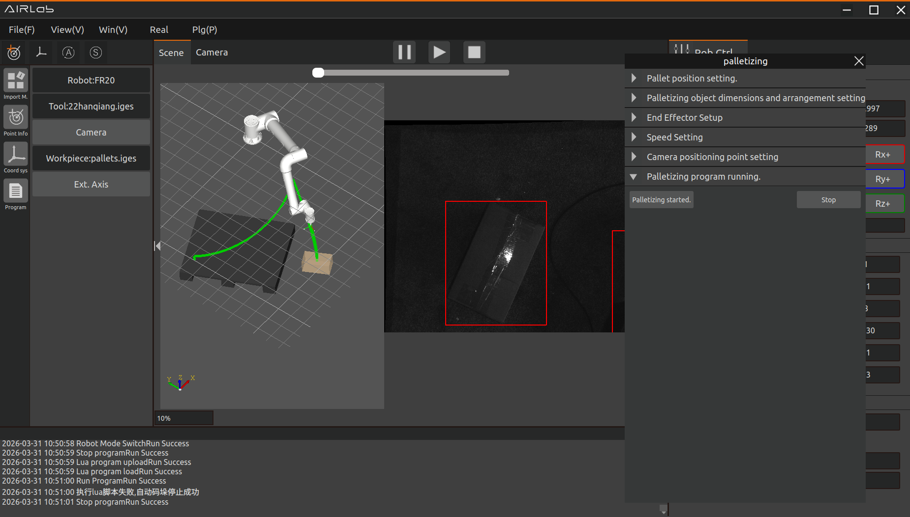

	Palletizing Program Execution Settings

The program will automatically run according to the preset stacking pattern. The robot will first move to a transition point, then from the transition point to the palletized object photographing point for recognition. After successful recognition, the robot's grasping trajectory will be generated in the 3D scene, and the robot will follow the trajectory to complete the grasping and placement.

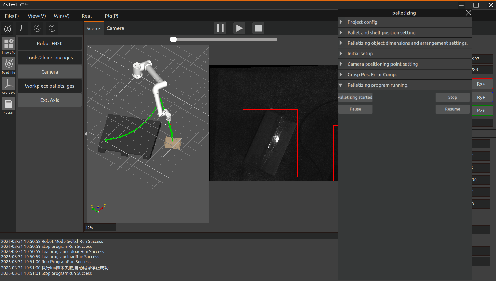

	Generating the Palletizing Trajectory

After completing one layer of stacking, the robot will move to the divider photographing point to photograph and recognize the divider, then place the divider on top of the palletized items of that layer. It will then proceed to the next cycle of recognition and stacking until all layers are completed according to the preset stacking pattern.

.. figure:: plug/palletizing11.png
	:align: center
	:width: 4in

	Palletizing Completed

2. Click the "Stop" button to terminate the currently executing palletizing task.
3. Click the "Pause" button to pause the currently executing palletizing task.
4. Click the "Resume" button to resume the palletizing sequence from where it was paused and continue the palletizing task.

AI Smart Assistant
---------------------
The AI Smart Assistant plug-in module implements some welding and bin-picking functions through text-based conversations with an AI large model.

Smart Assistant Pop-up Window
~~~~~~~~~~~~~~~~~~~~~~~~~~~~~~~~~~
Click Plug-in → AI Smart Ass3`istant in the menu bar to open the Smart Assistant plug-in. Its interface is shown below.

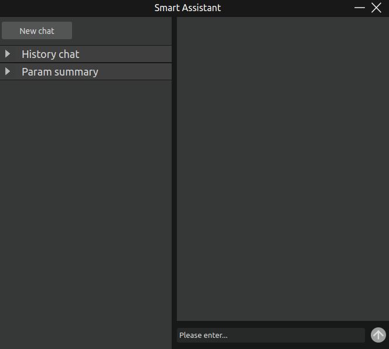

	AI Smart Assistant interface

This UI is mainly divided into two parts: the right half is the interactive content area, which provides a dialogue input box and a send button; the left half is the actionable area, which mainly provides the Start New Conversation button and the History and Parameter Summary sub-areas. Each part is described as follows:

- Start New Conversation button: Starts a new conversation while saving the current conversation content into the History information.

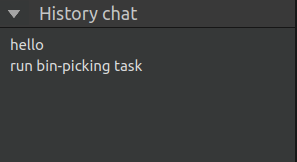

	AI Smart Assistant – History interface

- History interface: Records the content of previous conversations. Click the corresponding conversation title to switch between conversations, ensuring that historical messages are not lost. Switching back to the original conversation allows you to continue the previous dialogue.
- Parameter Summary page: During the conversation with the AI large model, if any internal program parameters are changed or set, this page will summarize the parameters involved in the current change, making it convenient to view parameter modifications, as shown in the figure below.

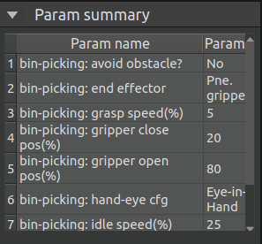

	AI Smart Assistant – Parameter Summary interface
