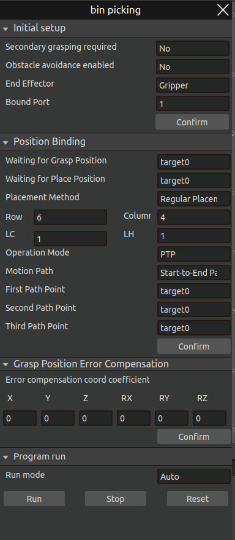
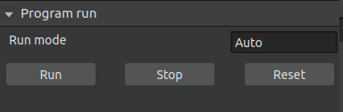

Plug-in
=========

.. toctree:: 
    :maxdepth: 5

This chapter mainly introduces the functions and specific operation processes of each plug-in.

bin picking
-------------------
The bin picking plugin module implements the function of automatically grabbing objects. Click on the menu bar plugin - bin picking. The main scene is divided into a 3D scene and a 2D display scene, and a bin picking pop-up window will pop up. In the 3D scene, the robot's motion process is displayed, while in the 2D scene, the RGB image of the workpiece and the bounding box for identifying the workpiece are displayed.

Create a bin picking project
~~~~~~~~~~~~~~~~~~~~~~~~~~~~~~~~~

Click on the menu bar - File, select the file type as bin picking, then click "New" or open a bin picking project file; afterward, import the required tool workpiece.

.. figure:: plug/1.png
	:align: center
	:width: 2.5in

.. centered:: Figure 5-1 Create a new binpick project file
	

UI interface introduction
~~~~~~~~~~~~~~~~~~~~~~~~~~~
Import the bin picking project, click on the menu bar plugin - bin picking, and a bin picking pop-up window will pop up, as shown in Figure 5-2. The bin picking pop-up window is divided into four parts: grasping posture sampling, position binding, grasping position error compensation, and program execution.

.. centered:: Figure 5-2  bin_pick pop-up window

1. First, perform grasping posture sampling:

Select the workpiece name, number of sampling points, offset and other parameters, click Generate Grasping Posture to sample the grasping posture of the selected workpiece and the current tool. After the sampling is successful, the terminal will display "Generate Grasping Posture Successfully", which means that the grasping posture sampling is successful; otherwise, the terminal will display "Generate Grasping Posture Failed" and display an error message.

.. figure:: plug/3.png
	:align: center
	:width: 3in

.. centered:: Figure 5-3  Grasp pose sampling

2. Then perform position binding

First, you need to calibrate and bind the waiting position for grabbing and the waiting position for placement; select the placement method, which can be fixed placement or regular placement;

fixed placement: means that the object is placed in the same position;

.. figure:: plug/4.png
	:align: center
	:width: 3in

.. centered:: Figure 5-4  Fixed placement

Rule placement: Users can set placement rules such as the number of rows, columns, layers, and layer heights as needed; after setting, click Confirm Binding Position; if the terminal displays that the position is successfully bound, the binding is successful.

.. figure:: plug/5.png
	:align: center
	:width: 3in

.. centered:: Figure 5-5  Rule placement

3. Grasping position error compensation

Not yet open.

4. Program running

After the grasping posture is generated successfully and the position is bound successfully, the program can be run. There are two running modes: manual and automatic.

Manual run: Select manual run, and the robot will perform an automatic grasp;

.. figure:: plug/6.png
	:align: center
	:width: 3in

.. centered:: Figure 5-6  Manual operation mode

First, click on Take a Photo to take a photo of the object to be grasped; after the photo is taken successfully, the terminal will display a prompt "Photo taken successfully", and the 2D scene will display the RGB image of the real workpiece.

Then click on AI calculation, AI will identify the position of the object to be grasped, and the 2D scene will display the bounding box of the workpiece;

After waiting for the calculation to be completed, click Run lua, and the robot will perform an identification and grasping movement;

Automatic operation: Select automatic operation, and the robot will automatically take pictures, identify, and grasp until all the objects to be grasped are grasped; click Stop to stop the automatic grasping movement.

.. figure:: plug/7.png
	:align: center
	:width: 3in

.. centered:: Figure 5-7  Automatic operation mode

Overall operation process
~~~~~~~~~~~~~~~~~~~~~~~~~~~~~~~~~~~~~~~
1. Camera calibration

Bin picking cycle palletizing adopts the eye-outside-hand photography method, and camera calibration is required before the grabbing operation.

2. Point teaching

If the placement method is selected as fixed placement, five points need to be taught, namely waiting for Grasp position, waiting for Place position, placement position, transition point 1, and transition point 2.

- Waiting for grabbing position: position near the grabbing point;

- Waiting for placement position: point near the placement position (recommended point directly above the placement position);
 
- Placement position: the position where the object to be grabbed needs to be placed.
 
- Transition point: To prevent collision during grabbing, set the transition point from the grabbing point PTP to transition point 1 and then PTP to transition point 2.

If the placement method is selected as regular placement, it is necessary to teach the waiting for grabbing position, waiting for placement position, first path point, second path point, and third path point.

- Waiting for the grabbing position: the position near the grabbing point;

- Waiting for the placement position: the point near the placement position (the point directly above the placement position is recommended);

- Waiting for the first path point, the second path point and the third path point to determine the placement matrix for the regulation placement; the first path point and the second path point determine the rows of the placement matrix, and the second path point and the third path point determine the columns of the placement matrix.

1. Start the AI node

Open the terminal under the binpicking_for_block path, run server_start.sh, and the display of Avoid_BP_Server is ready in the newly opened terminal indicates that the AI node has been successfully started.

.. centered:: Figure 5-8  Start AI Node

4. Run AIRLab software
   
Start AIRLab software with one click (make sure the robot arm is connected and the visual node is successfully started), open the bin picking plug-in, first perform grabbing posture sampling, and after successful sampling, perform position binding, and then run the program.

Spraying
-------------------
This plug-in module is a functional module developed for spraying tasks.

UI interface introduction
~~~~~~~~~~~~~~~~~~~~~~~~~~~~~
Click the menu bar plug-in-spray, and the spray pop-up window will pop up (picture). The spray pop-up window is mainly divided into three parts: spray parameter setting, simulation setting and program running.

.. figure:: plug/9.png
	:align: center
	:width: 7.5in

.. centered:: Figure 5-9  Spray plug-in pop-up

The spray parameter setting mainly sets the spray parameters, including spray direction, normal calculation radius, ellipse major semi-axis, ellipse minor semi-axis, etc. After the settings are completed, click Initialize AI, click AI Calculation, and the spray trajectory will be automatically calculated.

.. figure:: plug/10.png
	:align: center
	:width: 3in

.. centered:: Figure 5-10  Spraying parameter settings

The simulation setting is mainly to simulate the spraying trajectory. First, click on the trajectory generation to generate the simulation trajectory in the 3D scene. The generated simulation trajectory is correct, set the simulation speed, and click the run button to see the simulation effect. Click the stop button to stop the simulation.

.. figure:: plug/11.png
	:align: center
	:width: 3in

.. centered:: Figure 5-11  Simulation Settings

The program running part is mainly used to save, transmit and load the trajectory of the spraying program.

.. figure:: plug/12.png
	:align: center
	:width: 3in

.. centered:: Figure 5-12  Program running

- Save trajectory file: Click the "Save trajectory file" button to save the spray trajectory locally.
  
- Trajectory transfer: Transfer the locally saved trajectory to the controller.
  
- Trajectory load: Load the spray trajectory from the controller.
  
- Trajectory run: Click "Trajectory run" to run the current trajectory.
  
- Stop run: Click "Stop run" to stop the currently running trajectory.

Simulation process
~~~~~~~~~~~~~~~~~~~

The complete simulation process of spraying is as follows:

Step1：Import the spraying model; select Import spraying model in the spraying parameter setting section of the spraying interface.

Step2：Set the spraying parameters.

Step3：After setting the spraying parameters according to the actual spraying operation, click Initialize AI to initialize the AI node, and then click AI to calculate the spraying trajectory.

Step4：Click "Track Generation" in the spraying interface simulation setting UI interface, and run the simulation after observing that the spraying trajectory is generated correctly.

.. figure:: plug/13.png
	:align: center
	:width: 6in

.. centered:: Figure 5-13   Spraying simulation trajectory

For workpieces whose spraying trajectory has been calculated and transmitted to the controller, there is no need to perform AI calculation again during the next spraying operation. The trajectory can be directly loaded and then simulated.

Conversational AI Assistant
---------------------------------
To provide a better user experience and improve user efficiency, AIRLab software has developed a conversational intelligent assistant plug-in. Through the conversational AI assistant, users can interact with the software in natural language, issue the required operations, and the robot will perform corresponding operations based on the user's input. Click the menu bar plug-in-conversational intelligent assistant to pop up the intelligent assistant pop-up window.

.. figure:: plug/14.png
	:align: center
	:width: 6in

.. centered:: Figure 5-14  Conversational smart assistant pop-up window

Enter the question or operation in the input box, click Send, and wait for the AI assistant to reply or make the corresponding operation. The main functions of the AI assistant include helping users import/export project files, bind welding processes, add new project tree nodes, etc.

.. figure:: plug/15.png
	:align: center
	:width: 3in

.. centered:: Figure 5-15  AI assistant role

Take importing a project as an example:

The user sends "Please help me import the project ZH-401-EN.json", the AI assistant replies with a confirmation message, the user judges that the information is correct and replies "Yes", the AI assistant performs the corresponding operation and imports the ZH-401-EN.json project file.

.. figure:: plug/16.png
	:align: center
	:width: 7.5in

.. centered:: Figure 5-16  Import Project