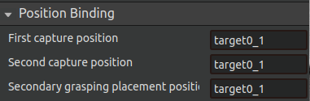
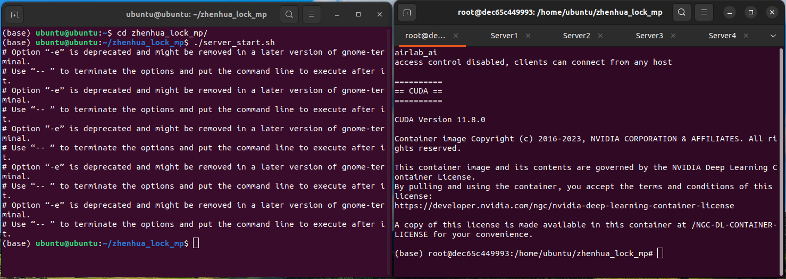
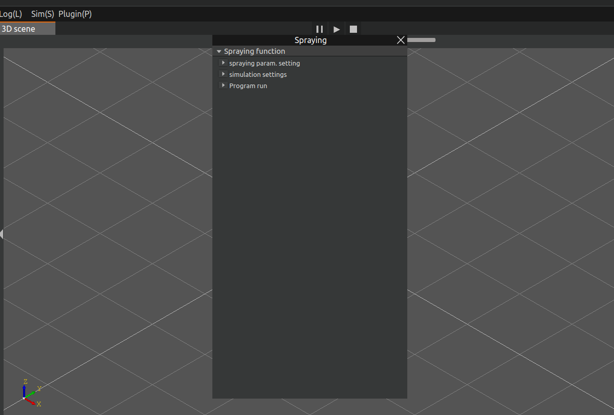
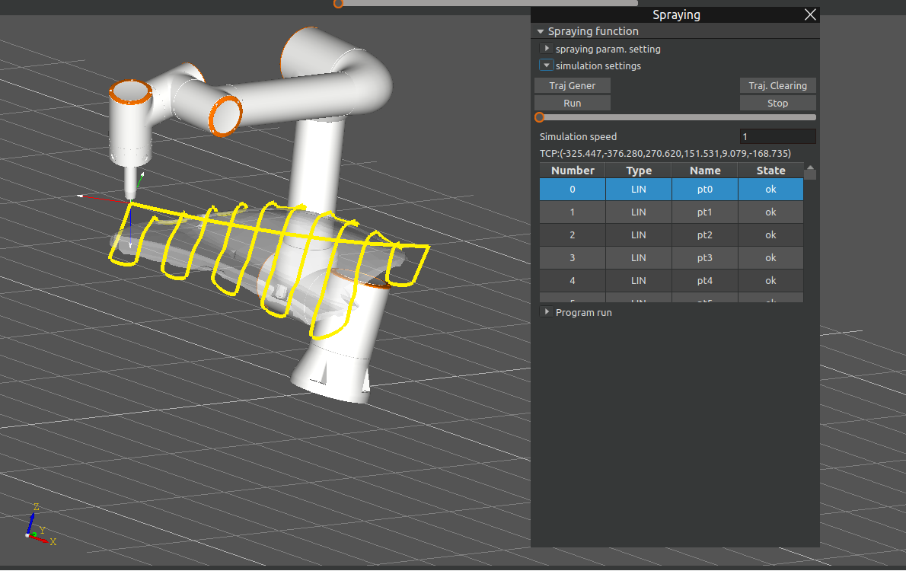

Plug-in
=========

.. toctree:: 
    :maxdepth: 5

This chapter mainly introduces the functions and specific operation processes of each plug-in.

binpick
-------------------
The binpick plug-in module realizes the function of automatically grabbing objects. Click the menu bar plug-in-binpick, the main scene is divided into a three-dimensional scene and a two-dimensional display scene, and the bin_pick pop-up window pops up to display information during grabbing and the UI interaction required during grabbing. The robot movement process is displayed in the three-dimensional scene, and the RGB image of the workpiece and the bounding box of the workpiece are displayed in the two-dimensional display scene.

Create a binpick project
~~~~~~~~~~~~~~~~~~~~~~~~~~~~

Click the menu bar-file, select the file type as binpick, and click "New"; then import the required tool workpiece.

.. figure:: plug/1.png
	:align: center
	:width: 2.5in

.. centered:: Figure 5-1 Create a new binpick project file
	
Create a binpick program; as shown in the figure is a template program of binpick, which mainly requires 4 points, pickpoint, pickpoint_offset, transition point and placement point.

.. figure:: plug/2.png
	:align: center
	:width: 2.7in

.. centered:: Figure 5-2  binpick template program

Among them, pickpoint and pickpoint_offset are the pick point and the pick offset point, which are calculated by AI, and the point name cannot be modified. The transition point and placement point are the transition point set during the robot movement and the point where the workpiece needs to be placed, respectively, which can be set by the user. SetDO is an IO control node that controls the gripping and release of the gripper. The user creates a binpick program that meets the actual gripping task based on these nodes.

After the binpick program is successfully created, click the menu bar-workpiece, and click the "Export" button to save the binpick project. The next time you run, you can directly import the binpick project without recreating the project operation.

UI interface introduction
~~~~~~~~~~~~~~~~~~~~~~~~~~~
Import the binpick project, click the menu bar plug-in-binpick, and the bin_pick pop-up window will pop up, as shown in the Figure 5-3. The bin_pick pop-up window is divided into three parts: grabbing posture, grabbing point setting and program running.

.. figure:: plug/3.png
	:align: center
	:width: 3in

.. centered:: Figure 5-3  bin_pick pop-up window

1. Grasping posture

The main function of the grabbing posture module is to set the tool grabbing posture. The postures saved in the database will be loaded first in the posture list, and these postures can be deleted, modified or added.

.. centered:: Figure 5-4  Grab posture module

- Delete: Select "Manual" for the selection mode, click the pose to be deleted in the pose list or enter the name of the pose to be changed, select "Delete" for the change type, and click "Confirm Change". The corresponding pose will be deleted from the database.

.. figure:: plug/5.png
	:align: center
	:width: 3in

.. centered:: Figure 5-5  Delete posture

- Modify: Click the pose to be modified in the pose list or enter the name of the pose to be changed, and select "Change" as the change type; select "Manual" as the selection mode, and manually adjust the tool grabbing pose by adjusting the values of X, Y, Z, RX, RY, and RZ. After the setting is completed, click "Set pose" to view the set pose. After confirming that the set pose is correct, click "Confirm change" and the corresponding pose will be modified.

.. figure:: plug/6.png
	:align: center
	:width: 3in

.. centered:: Figure 5-6  Modify posture

- Add: You can add new poses in automatic or manual modes; the automatic mode is not yet available, so we will first introduce the method of adding new poses in manual mode. First, select the change type as "Add", enter the name of the change pose, select the selection mode as "Manual", and manually adjust the tool grabbing pose by adjusting the values of X, Y, Z, RX, RY, and RZ. After the setting is completed, click "Set pose" to view the set pose. After confirming that the set pose is correct, click "Confirm change" to add the corresponding pose.

.. figure:: plug/7.png
	:align: center
	:width: 3in

.. centered:: Figure 5-7  Add posture

2. Grab point setting

The main function of the grab point setting module is to set the offset of the pick point, which is equivalent to the transition point; when the robot moves to the offset position of the pick point, the robot speed can be set to decrease, making the grabbing process safer.

.. figure:: plug/8.png
	:align: center
	:width: 4in

.. centered:: Figure 5-8  Grab point setting

3. Program operation

The program operation module has two main operation modes, manual mode and automatic mode.

.. centered:: Figure 5-9  Run the program

Manual mode: Select the operating mode as "Manual", click the "Take Photo" button, and the 2D scene will display the RGB image of the real workpiece.

.. figure:: plug/10a.png
	:align: center
	:width: 7.5in

.. centered:: Figure 5-10a  AIRLab interface-Click "Take a photo"

.. figure:: plug/10b.png
	:align: center
	:width: 3in

.. centered:: Figure 5-10b  The real workpiece
.. centered:: Figure 5-10  Click "Take a photo"

After the RGB image is correctly displayed, click the "AI Calculate" button, and the 2D scene will display the bounding box of the workpiece;

.. figure:: plug/11.png
	:align: center
	:width: 7.5in

.. centered:: Figure 5-11  Click AI calculation

After the RGB image and the bounding box of the workpiece are displayed correctly, click Run lua to start running the binpick template program.

Automatic mode: Select the running mode as "Automatic", select the number of runs, click "Run", and the program starts running; the program will automatically take photos and perform AI calculations, and the 2D scene will correctly display the RGB image and bounding box of the workpiece. Then the lua program will automatically run.

.. figure:: plug/12.png
	:align: center
	:width: 6in

.. centered:: Figure 5-12 Automatically run programs
	
Operation process
~~~~~~~~~~~~~~~~~~~
The complete operation process of binpick is as follows:

- Step 1: Import the binpick project; if there is no binpick project, you need to create a new binpick project first.

- Step 2: Click the menu bar plug-in-binpick, and the binpick pop-up window will pop up in the main scene. The three-dimensional scene is divided into two scenes on the left and right; the robot movement process is displayed in the three-dimensional scene, and the RGB image of the workpiece and the identified bounding box of the workpiece are displayed in the two-dimensional display scene.

.. centered:: Figure 5-13  binpick 3D scene

- Step 3: Select the binpick scene. The binpick scene displays the posture of the tool and workpiece in the real scene. Set the tool's grasping posture to an appropriate posture and set the pick point offset. For details on the setting of the tool posture and the setting of the pick point offset, see Section 5.1.2.

.. centered:: Figure 5-14  Set the grabbing posture in the binpick scene

- Step 4: After setting the tool posture and the pick-up point offset, switch back to the 3D scene and run the lua program. There are two modes: manual and automatic. For details on manual and automatic operation, see 5.1.2. The operation process is as follows:

1. The robot moves to the photo point, takes a photo of the workpiece, and the 2D scene displays the RGB image.
   
2. Click AI calculation, and the 2D scene displays the bounding box of the workpiece;
   
3. Run lua: According to the AI calculation results, the robot moves to the pick-up point to grab the workpiece, and the IO controls the gripper to grab. After grabbing the workpiece, it moves to the transition point, and then moves from the transition point to the placement offset point and placement point, and the IO controls the gripper to release

Spraying
-------------------
This plug-in module is a functional module developed for spraying tasks.

UI interface introduction
~~~~~~~~~~~~~~~~~~~~~~~~~~~~~
Click the menu bar plug-in-spray, and the spray pop-up window will pop up (picture). The spray pop-up window is mainly divided into three parts: spray parameter setting, simulation setting and program running.

.. centered:: Figure 5-15  Spray plug-in pop-up

The spray parameter setting mainly sets the spray parameters, including spray direction, normal calculation radius, ellipse major semi-axis, ellipse minor semi-axis, etc. After the settings are completed, click Initialize AI, click AI Calculation, and the spray trajectory will be automatically calculated.

.. figure:: plug/16.png
	:align: center
	:width: 3in

.. centered:: Figure 5-16  Spraying parameter settings

The simulation setting is mainly to simulate the spraying trajectory. First, click on the trajectory generation to generate the simulation trajectory in the 3D scene. The generated simulation trajectory is correct, set the simulation speed, and click the run button to see the simulation effect. Click the stop button to stop the simulation.

.. figure:: plug/17.png
	:align: center
	:width: 3in

.. centered:: Figure 5-17  Simulation Settings

The program running part is mainly used to save, transmit and load the trajectory of the spraying program.

.. centered:: Figure 5-18  Program running

- Save trajectory file: Click the "Save trajectory file" button to save the spray trajectory locally.
  
- Trajectory transfer: Transfer the locally saved trajectory to the controller.
  
- Trajectory load: Load the spray trajectory from the controller.
  
- Trajectory run: Click "Trajectory run" to run the current trajectory.
  
- Stop run: Click "Stop run" to stop the currently running trajectory.

Simulation process
~~~~~~~~~~~~~~~~~~~

The complete simulation process of spraying is as follows:

- Step1：Import the spraying model; select Import spraying model in the spraying parameter setting section of the spraying interface.

- Step2：Set the spraying parameters.

- Step3：After setting the spraying parameters according to the actual spraying operation, click Initialize AI to initialize the AI node, and then click AI to calculate the spraying trajectory.

- Step4：Click "Track Generation" in the spraying interface simulation setting UI interface, and run the simulation after observing that the spraying trajectory is generated correctly.

.. figure:: plug/19.png
	:align: center
	:width: 6in

.. centered:: Figure 5-19   Spraying simulation trajectory

For workpieces whose spraying trajectory has been calculated and transmitted to the controller, there is no need to perform AI calculation again during the next spraying operation. The trajectory can be directly loaded and then simulated.

Conversational AI Assistant
---------------------------------
To provide a better user experience and improve user efficiency, AIRLab software has developed a conversational intelligent assistant plug-in. Through the conversational AI assistant, users can interact with the software in natural language, issue the required operations, and the robot will perform corresponding operations based on the user's input. Click the menu bar plug-in-conversational intelligent assistant to pop up the intelligent assistant pop-up window.

.. centered:: Figure 5-20  Conversational smart assistant pop-up window

Enter the question or operation in the input box, click Send, and wait for the AI assistant to reply or make the corresponding operation. The main functions of the AI assistant include helping users import/export project files, bind welding processes, add new project tree nodes, etc.

.. figure:: plug/21.png
	:align: center
	:width: 3in

.. centered:: Figure 5-21  AI assistant role

Take importing a project as an example:

The user sends "Please help me import the project ZH-401-EN.json", the AI assistant replies with a confirmation message, the user judges that the information is correct and replies "Yes", the AI assistant performs the corresponding operation and imports the ZH-401-EN.json project file.

.. figure:: plug/22.png
	:align: center
	:width: 7.5in

.. centered:: Figure 5-22  Import Project