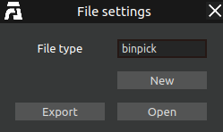
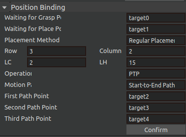
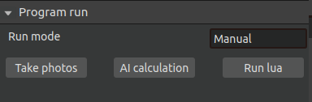
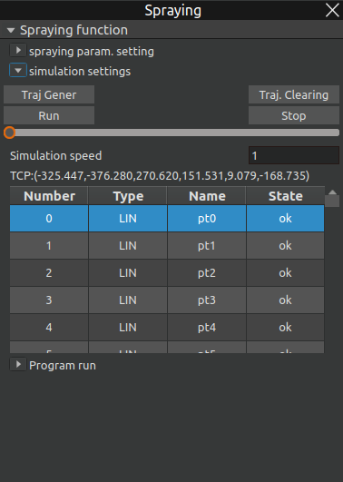

Plug-in
=========

.. toctree:: 
	:maxdepth: 5

This chapter mainly introduces plugin authorization and the functionalities as well as specific operational procedures of each plugin.

binpicking  Plugin Authorization
--------------------------------------
Click on Plugins → Plugin Authorization to view the unique identifier of AIRLab and the authorization status of each plugin.

.. figure:: analysis/4/plugin_authr_en.png
	:align: center
	:width: 6in

	Plugin Authorization Page

If the status shows "Authorized," the plugin can be opened and used normally. If it shows "Unauthorized," a prompt indicating that the plugin failed to load will appear when attempting to open the plugin, as shown in the figure.

.. figure:: analysis/4/plugin_authr_load_fail_en.png
	:align: center
	:width: 6in

	Welding Plugin Failed to Load

To authorize a plugin, please contact the after-sales service to obtain the authorization file (in .bin format). Then, select this file in the authorization interface and click "Authorize" to proceed with the upgrade.

.. figure:: analysis/4/plugin_authr_process_en.png
	:align: center
	:width: 6in

	Authorization in Progress

Once the progress bar has finished loading, the page will display a "Authorization Successful" prompt.

.. figure:: analysis/4/plugin_authr_sucess_en.png
	:align: center
	:width: 6in

	Authorization Successful

Reinsert the encryption dongle and wait approximately 30 seconds. Once the plugin authorization status updates, it indicates that the authorization process is complete.

If an error occurs during the authorization process, the procedure will automatically terminate, and an error prompt will pop up as shown in the figure. In such cases, please contact the after-sales personnel for assistance.

.. figure:: analysis/4/plugin_authr_fail_en.png
	:align: center
	:width: 6in

	Authorization Failed

binpicking
-------------------
The binpicking plugin module implements the function of automatically grabbing objects. Click on the menu bar plugin - binpicking. The main scene is divided into a 3D scene and a 2D display scene, and a binpicking pop-up window will pop up. In the 3D scene, the robot's motion process is displayed, while in the 2D scene, the RGB image of the workpiece and the bounding box for identifying the workpiece are displayed.

Create a binpicking project
~~~~~~~~~~~~~~~~~~~~~~~~~~~~~~~~~

Click on the menu bar - File, select the file type as binpicking, then click "New" or open a binpicking project file; afterward, import the required tool workpiece.

	Create a new binpick project file
	

UI interface introduction
~~~~~~~~~~~~~~~~~~~~~~~~~~~
Import the binpicking project, click on the menu bar plugin - binpicking, and a binpicking pop-up window will pop up, as shown in Figure 4-2. The binpicking pop-up window is divided into four parts: Initial setup, position binding, grasping position error compensation, and program execution.

.. figure:: plug/2.png
	:align: center
	:width: 3in

	binpicking pop-up window

1. Initial Setup Procedure:

configure the following parameters:

- Enable/disable secondary grasping;

- Enable/disable obstacle avoidance;

- Select end effector type (Magnetic Gripper or Mechanical Gripper);

- Specify the assigned port number and gripper model (if applicable).

After completing all configurations, click "Confirm". A "Initial setup successful" notification in the command feedback area indicates completion.

.. figure:: plug/3.png
	:align: center
	:width: 3in

	Initial setup

2. Perform position binding

Configure based on whether secondary grasping is required, and Bind waiting grasp position and waiting placement position, or specify first/second capture positions and secondary placement position.

Placement Mode Selection:
	Fixed Placement: Set multiple drop points - the system will automatically sort recognized objects to corresponding locations
	
	Regular placement: Users can set placement rules such as the number of rows, columns, layers, and layer heights as needed; after setting, click Confirm Binding Position; if the terminal displays that the position is successfully bound, the binding is successful.

.. figure:: plug/4.png
	:align: center
	:width: 3in

	Fixed placement

	Rule placement

3. Grasping position error compensation

This function is designed to eliminate systematic errors during the grasping process. If significant deviations occur during grasping, you can set an error compensation coefficient (based on the tool coordinate system).

	Grasping position error compensation

4. Program running

After the grasping posture is generated successfully and the position is bound successfully, the program can be run. There are two running modes: manual and automatic.

Manual run: Select manual run, and the robot will perform an automatic grasp;

	Manual operation mode

First, click on Take Photos to take a photo of the object to be grasped; after the photo is taken successfully, the terminal will display a prompt "Photo taken successfully", and the 2D scene will display the RGB image of the real workpiece.

Then click on AI calculation, AI will identify the position of the object to be grasped, and the 2D scene will display the bounding box of the workpiece;

After waiting for the calculation to be completed, click Run lua, and the robot will perform an identification and grasping movement;

Automatic operation: Automatic operation includes running, stopping, and resetting;

Run: Click the "Run" button to initiate automatic image recognition and grasping operations.

Stop: Click the "Stop" button to immediately halt all automated movements.

Reset: Click the "Reset" button to clear the grasp counter (set to 0),Ensure the next run cycle restarts from the beginning of the operation sequence,and Places objects at the first designated drop position.

.. figure:: plug/8.png
	:align: center
	:width: 3in

	Automatic operation mode

Overall operation process
~~~~~~~~~~~~~~~~~~~~~~~~~~~~~~~~~~~~~~~
1. Camera calibration

Prior to performing grasping operations, camera calibration must be completed. Select the appropriate calibration mode based on your system configuration:

Eye-in-Hand Calibration (for mounted camera systems)

Eye-to-Hand Calibration (for fixed external cameras)

2. Point teaching

Secondary grasping teaching points:

.. figure:: plug/9.png
	:align: center
	:width: 3in

	Secondary capture position binding

First Capture Position:Teach the position directly above the target object Ensure the camera can fully capture the object within the frame.

Second Capture Position:Teach the position directly above the intermediate placement location.

Secondary Grasping Placement Position:Teach the adjustment position where objects will be placed for reorientation.

Non secondary grasping teaching points:
 

	Non-secondary capture position binding

Waiting for Grasp Position:Located near the actual grasping point,ensures ready access to target objects;

Waiting for Place Position: Positioned adjacent to the drop location (Recommended drectly above the intended placement point for optimal operation).

Fixed placement of teaching points:

	Fixed placement location binding

Choose a fixed number of placement points, and if there are several placement points, teach them how many placement points to use;

Regular placement of teaching points:
   
.. figure:: plug/12.png
	:align: center
	:width: 3in

	Rule placement location binding

The first, second, and third path points determine the placement matrix for regulatory placement; The first and second path points determine the rows of the placement matrix, while the second and third path points determine the columns of the placement matrix.

3. Start the AI node

Open the terminal under the /zhenhua_lock_mp/ path, run server_start.sh, If the four terminals from Server1 to Server4 are displayed in the newly opened terminal, the AI node is successfully started.

.. figure:: plug/13.png
	:align: center
	:width: 6.5in

	Start AI Node

4. Run AIRLab software
   
Start AIRLab software with one click (make sure the robot arm is connected and the visual node is successfully started), open the binpicking plug-in, Perform initial setup first, and after successful initial setup, perform location binding,and then run the program.

Spraying
-------------------
This plug-in module is a functional module developed for spraying tasks.

UI interface introduction
~~~~~~~~~~~~~~~~~~~~~~~~~~~~~
Click the menu bar plug-in-spray, and the spray pop-up window will pop up (picture). The spray pop-up window is mainly divided into three parts: spray parameter setting, simulation setting and program running.

.. figure:: plug/14.png
	:align: center
	:width: 7.5in

	Spray plug-in pop-up

The spray parameter setting mainly sets the spray parameters, including spray direction, normal calculation radius, ellipse major semi-axis, ellipse minor semi-axis, etc. After the settings are completed, click Initialize AI, click AI Calculation, and the spray trajectory will be automatically calculated.

.. figure:: plug/15.png
	:align: center
	:width: 3in

	Spraying parameter settings

The simulation setting is mainly to simulate the spraying trajectory. First, click on the trajectory generation to generate the simulation trajectory in the 3D scene. The generated simulation trajectory is correct, set the simulation speed, and click the run button to see the simulation effect. Click the stop button to stop the simulation.

	Simulation Settings

The program running part is mainly used to save, transmit and load the trajectory of the spraying program.

	Program running

- Save trajectory file: Click the "Save trajectory file" button to save the spray trajectory locally.
  
- Trajectory transfer: Transfer the locally saved trajectory to the controller.
  
- Trajectory load: Load the spray trajectory from the controller.
  
- Trajectory run: Click "Trajectory run" to run the current trajectory.
  
- Stop run: Click "Stop run" to stop the currently running trajectory.

Simulation process
~~~~~~~~~~~~~~~~~~~

The complete simulation process of spraying is as follows:

Step1：Import the spraying model; select Import spraying model in the spraying parameter setting section of the spraying interface.

Step2：Set the spraying parameters.

Step3：After setting the spraying parameters according to the actual spraying operation, click Initialize AI to initialize the AI node, and then click AI to calculate the spraying trajectory.

Step4：Click "Track Generation" in the spraying interface simulation setting UI interface, and run the simulation after observing that the spraying trajectory is generated correctly.

.. figure:: plug/18.png
	:align: center
	:width: 6in

	Spraying simulation trajectory

For workpieces whose spraying trajectory has been calculated and transmitted to the controller, there is no need to perform AI calculation again during the next spraying operation. The trajectory can be directly loaded and then simulated.

Conversational AI Assistant
---------------------------------
To provide a better user experience and improve user efficiency, AIRLab software has developed a conversational intelligent assistant plug-in. Through the conversational AI assistant, users can interact with the software in natural language, issue the required operations, and the robot will perform corresponding operations based on the user's input. Click the menu bar plug-in-conversational intelligent assistant to pop up the intelligent assistant pop-up window.

	Conversational smart assistant pop-up window

Enter the question or operation in the input box, click Send, and wait for the AI assistant to reply or make the corresponding operation. The main functions of the AI assistant include helping users import/export project files, bind welding processes, add new project tree nodes, etc.

.. figure:: plug/20.png
	:align: center
	:width: 2.5in

	AI assistant role

Take importing a project as an example:

The user sends "Please help me import the project ZH-401-EN.json", the AI assistant replies with a confirmation message, the user judges that the information is correct and replies "Yes", the AI assistant performs the corresponding operation and imports the ZH-401-EN.json project file.

	Import Project