Quick Start
=============

.. toctree:: 
    :maxdepth: 5

This chapter will take an actual welding project as an example to introduce how to control the robot to start the welding work quickly.
Figure 2-1 shows the welding preparation, where Figure 2-1a shows the workpiece to be welded and Figure 2-1b shows the robot and the workpiece.

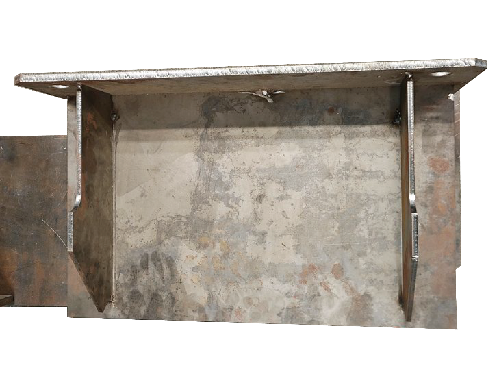

.. centered:: Figure 2-1a  Workpiece to be Welded
 
.. figure:: quick_start/3-1b.png
	:align: center
	:width: 4in

.. centered:: Figure 2-1b  Robot + Workpiece   
.. centered:: Figure 2-1  Welding Preparation  

Equipment Installation
------------------------
The camera and torch are mounted on the end of the robot via connectors as shown in Figure 2-2.

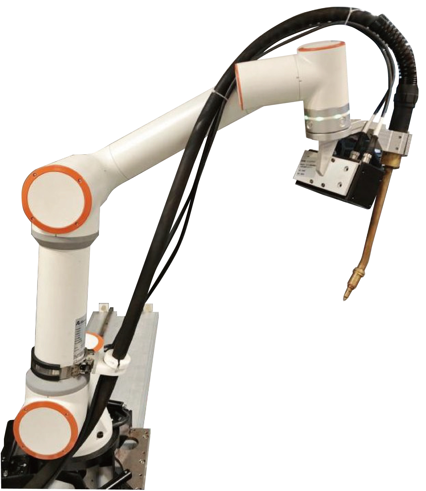

.. centered:: Figure 2-2  Mounting the Camera and Torch 

.. important:: 
    Please make sure to install it firmly, otherwise the accuracy will be affected.

Tool Coordinate System Calibration
---------------------------------------
Open the browser and visit the target URL 192.168.58.2, enter your username and password and click Login to log in to the FR Teacher Software. Click "Initial Settings"-"Robot Settings"-"Tool Coordinates" on the left side of the interface to enter the tool coordinates interface. interface.

The "Tool Coordinate" interface is used for modifying, clearing and applying the coordinate system of the tool. There are 15 numbers in the drop-down list of the tool coordinate system name, toolcoord0-toolcoord14 (the name of the coordinate system can be customized), and after selecting the corresponding coordinate system, the corresponding coordinate value (representing the offset of the end of the currently used tool relative to the center of the robot base), tool type and mounting position (only displayed under the sensor type tool) will be displayed in the coordinate text box below. After selecting the corresponding coordinate system, the corresponding coordinate value will be displayed in the coordinate text box below (representing the offset of the end of the currently used tool relative to the center of the robot base), the type of tool, and the installation location (only displayed under the sensor type tool), and after selecting a certain coordinate system and clicking on the "Apply" button, the coordinate system of the currently used tool will be changed to the selected coordinates, as shown in Figure 2-3.

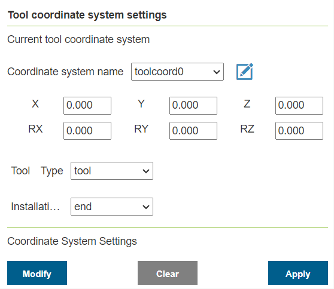

.. centered:: Figure 2-3  Setting Tool Coordinates

If you need to reset a tool coordinate system, click the "Modify" button in Figure 2-3 to enter the tool calibration, as shown in Figure 2-4. Tool calibration methods are divided into four-point method and six-point method, four-point method only calibrates the tool TCP, that is, the location of the center point of the tool, the attitude default and the end flange attitude; six-point method in the four-point method on the basis of the addition of two points, used to calibrate the attitude of the tool. The six-point method is introduced here as an example.

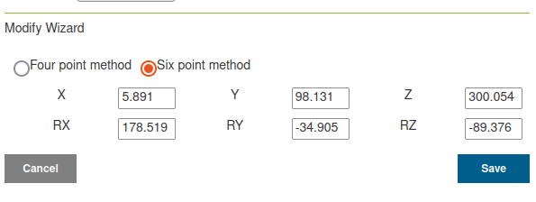

.. centered:: Figure 2-4  Tool Calibration-Four-Point and Six-Point Methods

- Step1: Choose a fixed point in the robot space, move the tool to the fixed point in three different attitudes, and set the points in Figures 2-5 in turn ①②③;

- Step2: Move the tool vertically to the position shown at the top right in Figure 2-5, set as a fixed point ④ ;

- Step3: Keep the stance unchanged and use the base marker to move a distance horizontally to set a fixed point ⑤ The direction is the positive direction of the X-axis of the tool coordinate system set;

- Step4: Return to the fixed point ④ Move vertically up a distance and set it as the fixed point ⑥, the direction is the positive direction of the Z-axis of the tool coordinate system. The direction is the positive direction of the Z-axis of the tool coordinate system (the positive direction of the Y-axis of the tool coordinate system is determined by the right-hand rule);

- Step5: Click the "Calculate" button in Figure 2-5 to calculate the tool coordinate system;

- Step6: If you need to reset, click the "Cancel" button in Figure 2-4 to calibrate the new tool coordinate system; if you don't need to reset, click "Save" in Figure 2-4 to store the tool coordinate system.

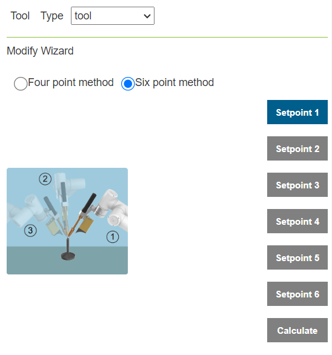

.. centered:: Figure 2-5  Six-Point Method Tool Calibration Steps

Import Engineering
---------------------
Open the AIRLab software, click on the menu bar at the top of the interface, click the "File" button, click the "Open" button, select the project, click "Open" to import the project, as shown in Figure 2-6.

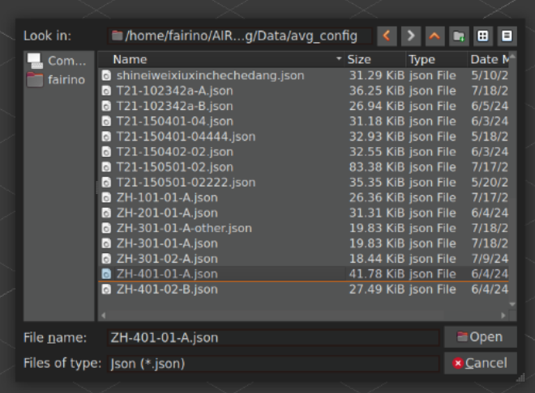

.. centered:: Figure 2-6  Select Project Import

Point Cloud Camera Hand-Eye Calibration
-----------------------------------------------
The purpose of this step is to calibrate the relative positions of the camera and the robot as follows:

- Step1: Place the calibration plate directly below the camera, as shown in Figure 2-7. Switch the AIRLab main display box to the camera display, as shown in Figure 2-8;

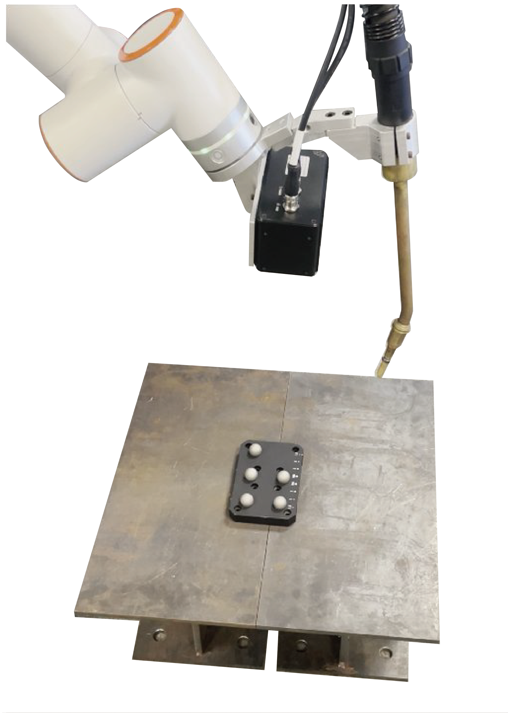

.. centered:: Figure 2-7  Placement of the calibration board

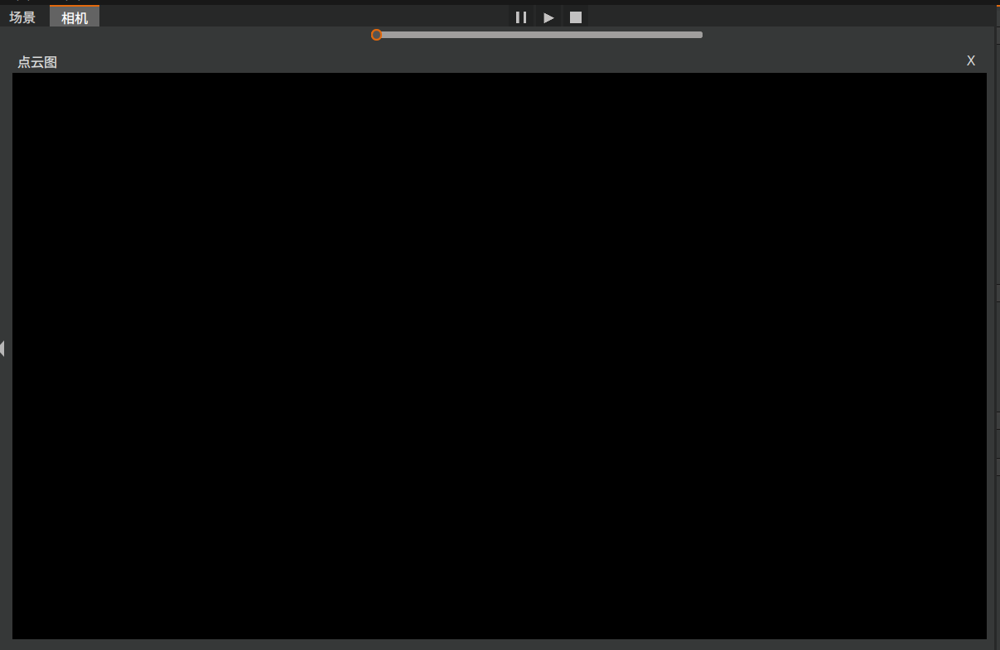

.. centered:: Figure 2-8  AIRLab Software-Camera Display

- Step2: Click the sub-node of "Camera" in the engineering tree on the left side of AIRLab, the "Camera Properties" sub-page will be switched out on the right side, click the "Calibration Start" button, as shown in Figure 2-9. Click the "Auto Run" button in Figure 2-9, the camera will start to calibrate automatically, as shown in Figure 2-10, and the point cloud of AIRLab software is shown in Figure 2-11;

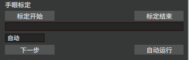

.. centered:: Figure 2-9  Camera Properties-Calibration Begins

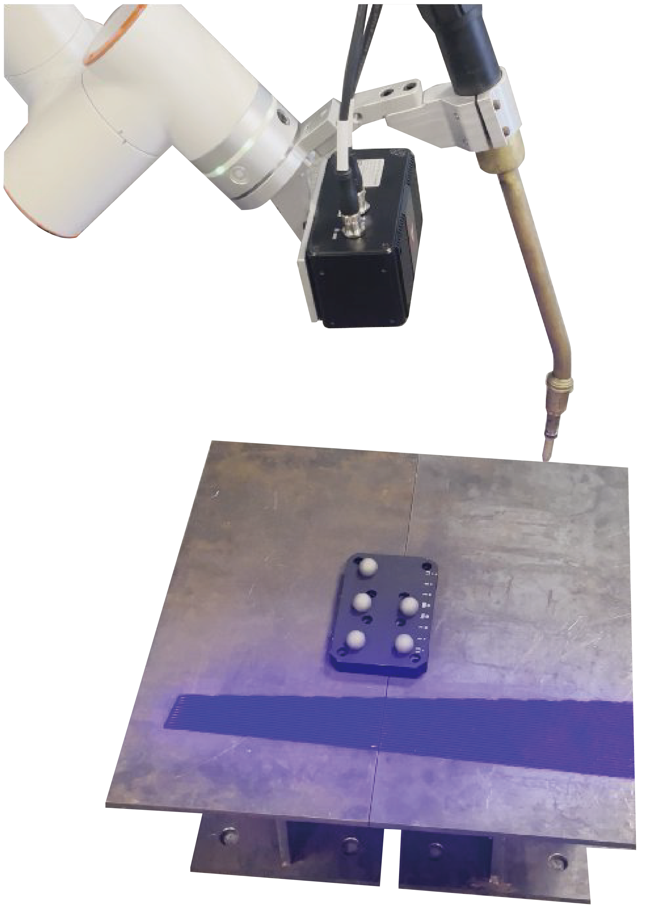

.. centered:: Figure 2-10  Point cloud camera hand-eye calibration

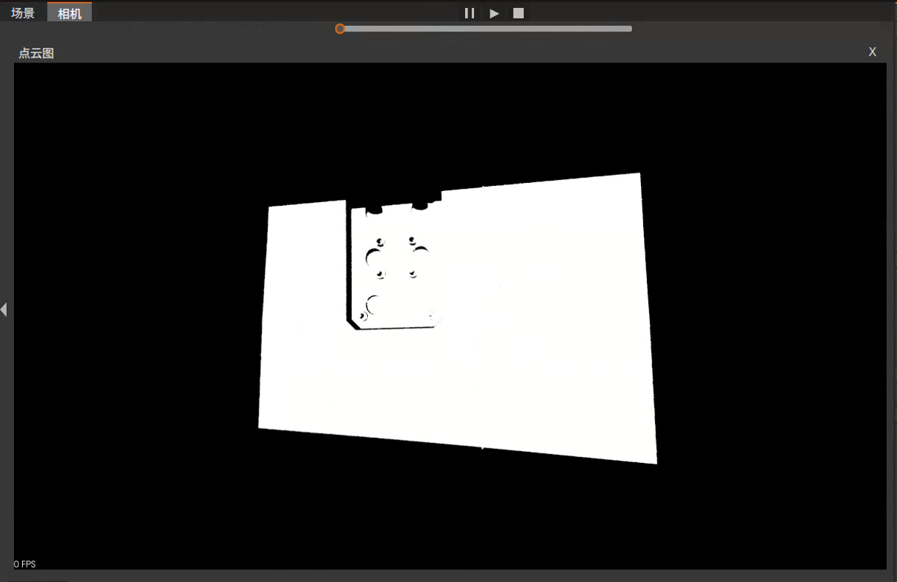

.. centered:: Figure 2-11  Point cloud calibration results

- Step3: Wait for the camera calibration to complete;

- Step4: After the end of this round of camera calibration, you can change the position of the calibration board, click the "Auto Run" button for the next round of calibration, the purpose of this step is to improve the accuracy of the system, you can choose to calibrate the 3 to 5 rounds, the system will select the highest accuracy of the coordinate system to use;

- Step5: Click the "Calibration End" button to end the hand-eye calibration of this point cloud camera;

- Step6: Verify the accuracy. Randomly select a location to place the calibration plate, click on the "Photo" button in Figure 2-12, repeat the process three times, click on the "Verify Result" button, the pop-up window shown in Figure 2-13 will appear. The four points in the pop-up window are the coordinates of the four fixed points on the calibration board. By clicking the button "Move to point 1", the robot is moved to the specified position on the calibration board, and then the integrated error is obtained.

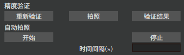

.. centered:: Figure 2-12  Point cloud camera hand-eye calibration

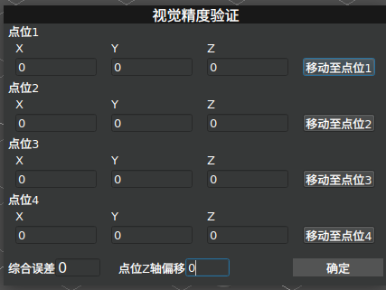

.. centered:: Figure 2-13  Authentication Results-Pop-up Window

Start Running
-------------------
After completing the above steps, the robot can be controlled to start the welding task, which is divided into five main steps.

- Step1:Obtain the ground equations

  Click the "Workpiece Positioning" node in the project tree, the right sub-page of the software will be switched to "Workpiece Positioning Program", as shown in Figure 2-14. Click the "Shoot Ground" button, and then click "Save Ground" to save the calculated ground equations.

.. figure:: quick_start/3-14.png
	:align: center
	:width: 3in

.. centered:: Figure 2-14  Subpage - Workpiece Positioning Procedure

- Step2:Run the workpiece positioning program

  Clicking the Start Run icon button in the menu bar, the robot first starts to run all the commands under the "Workpiece Positioning" node in the project tree, and after the completion of the run, it obtains the global transformation matrix and the global point cloud, and the controller obtains the actual relative position of the robot and the workpiece.

- Step3:Get the program configuration mode

  Read the program configuration mode set by the user, as shown in Figure 2-15, in which the manual debugging mode is used for single-step debugging; all identification after welding means that the robot will identify all the weld seams under the "template program" in the project tree and then carry out all the welding; single identification after welding means that the robot identifies only one weld seam at a time, and starts to weld that seam after the completion of the identification. Single identification and welding means that the robot only identifies one weld at a time, and when the identification is completed, it starts welding the weld, and when the welding is completed, it identifies the next weld, and then welds it again, until it completes the welding of all the welds under the "template program". Program arc start settings in the "not arc" is used for testing, users can choose "not arc" first simulation welding, simulation welding results are correct and then set "arc" for the actual welding. actual welding.

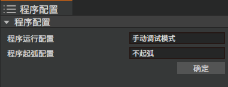

.. centered:: Figure 2-15  Getting Program Configuration

- Step4:Weld seam identification
 
  After determining the program configuration mode and arc starting mode, the robot will start weld identification according to the specific instructions of the weld program, and after successful identification, it will generate correction points under the "Robot" node of the engineering tree, and generate welding instructions required by the robot under the "Program" node, as shown in Figure 2-16 and 2-17. The welding instructions required by the robot will be generated under the "Program" node, as shown in Figures 2-16 and 2-17.

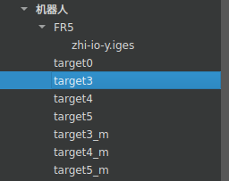

.. centered:: Figure 2-16  Welded Seam Recognition Results-Added Correction Points

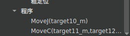

.. centered:: Figure 2-17  Weld Recognition Result-New Program Instruction

- Step5:Run the "program"

  Once the weld has been identified, the robot will run all the commands generated under the "Program" node to perform the welding task.