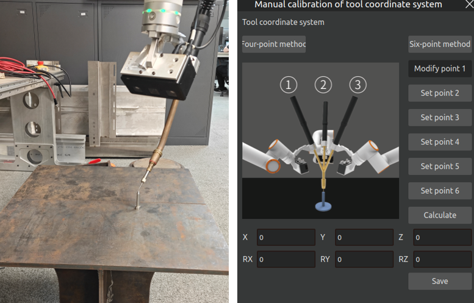
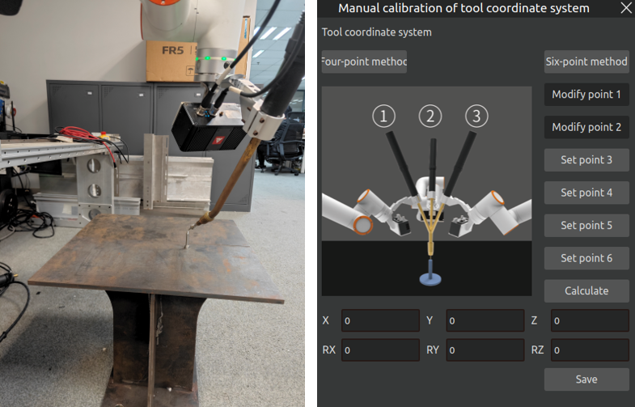
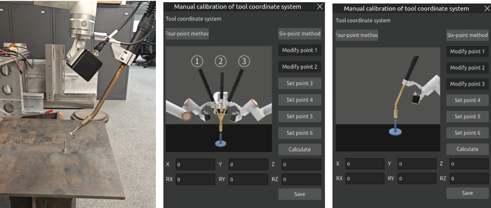
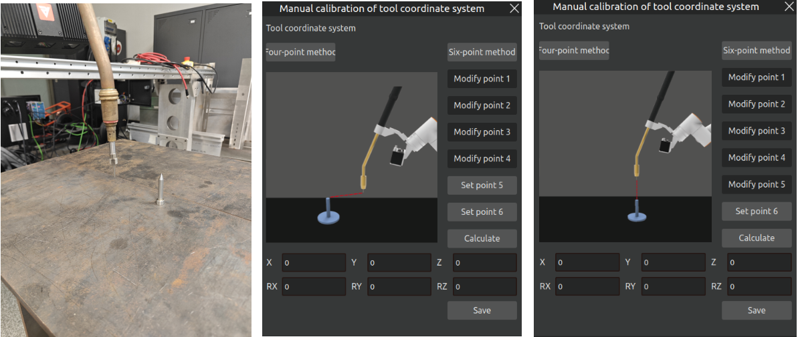
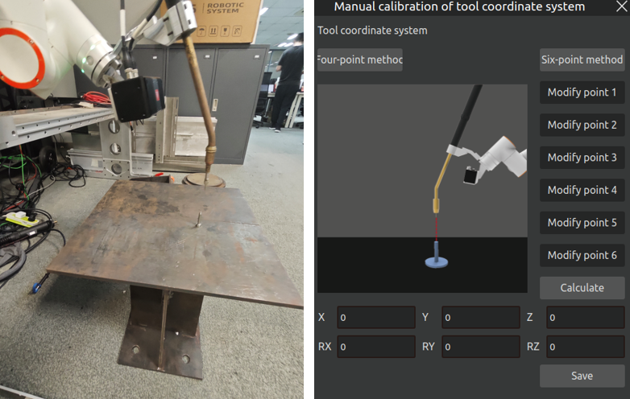
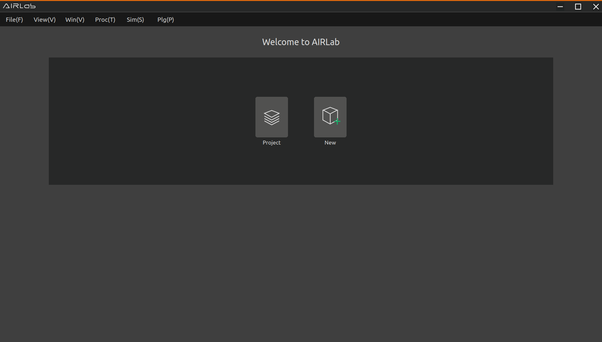
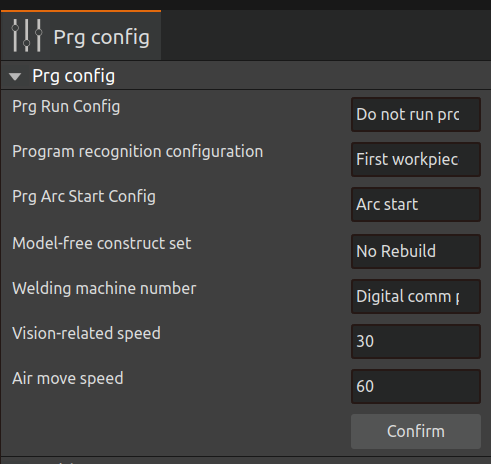

Quick Start
=============

.. toctree:: 
    :maxdepth: 5

This chapter will take an actual welding project as an example to introduce how to control the robot to start the welding work quickly. Figure 2-1 and Figure 2-2 shows the welding preparation, where Figure 2-1 shows the workpiece to be welded and Figure 2-2 shows the robot and the workpiece.

.. figure:: quick_start/1.png
	:align: center
	:width: 3in

.. centered:: Figure 2-1  Workpiece to be Welded
 
.. figure:: quick_start/2.png
	:align: center
	:width: 3in
   
.. centered:: Figure 2-2  Robot + Workpiece  

3D MVC Product Description
---------------------------------
This High-Precision 3D Camera utilizes grating-structured light projection and binocular stereo vision algorithms to reconstruct high-fidelity 3D point cloud data of objects, meeting industrial-grade requirements for high resolution and submillimeter measurement accuracy. Compact in size yet featuring a large depth of field and exceptional measurement precision, the system is designed for applications in industrial automation, robotics, and 3D object reconstruction.

.. figure:: quick_start/3.png
	:align: center
	:width: 2in

.. centered:: Figure 2-3  Standard version

.. centered:: Figure 2-4  Version with protective cover

Key Features：

- Welding Robot Integration: Compatible with mainstream welding robots for complex weld seam feature extraction, trajectory guidance, and workpiece alignment.

- Advanced Imaging Algorithm: Achieves 0.2mm repeatability in Z-axis; employs binocular structured light technology for submillimeter-accurate image acquisition.

- Multi-Frame Fusion: Mitigates reflections on metallic surfaces for reliable data.

- Optimized Projection Module: Combines high-efficiency projection with precise exposure control for stable performance.

- Robust Anti-Noise Capability: Delivers clear point clouds even for low-reflectivity or dark surfaces.

- Non-Contact Measurement: Ensures zero damage to target objects.

- Pre-Calibrated & Plug-and-Play: Factory-optimized settings eliminate user-side calibration.

- Industrial-Grade Design:Fully enclosed aluminum alloy housing for durability；multi-mounting holes for flexible deployment.

Technical Specifications：

- Working Distance: 350mm~1100mm.

- Compact & Lightweight: High-strength body for easy integration.

- High-Speed Imaging: Optimized for high-temperature environments (spark-resistant front cover included).

- No-Teach Welding Path Generation: Enables autonomous operation without pre-programming.

System Requirements
~~~~~~~~~~~~~~~~~~~~~~~
- OS: Windows 10.0 or later / Ubuntu 18.04 or later

- CPU: 1.8GHz base clock or higher

- RAM: 8GB or more (recommended)

Product parameters
~~~~~~~~~~~~~~~~~~~~~~~

.. centered:: Table 2-1  Product Parameters
.. image:: quick_start/表2-1.png
	:align: center
	:width: 5in

Field of view measurement range
~~~~~~~~~~~~~~~~~~~~~~~~~~~~~~~~~~~~~~~

.. figure:: quick_start/5.png
	:align: center
	:width: 2.5in

.. centered:: Figure 2-5  Field of view measurement range

Structural drawings
~~~~~~~~~~~~~~~~~~~~~~~~~~~
Standard version:

.. figure:: quick_start/6.png
	:align: center
	:width: 6in

.. centered:: Figure 2-6  Standard version structural dimensions

Version with protective cover (optional):

.. centered:: Figure 2-7  Version with protective cover (optional) structural dimensions

Communication interface
~~~~~~~~~~~~~~~~~~~~~~~~~~~
Camera power interface

1. Body power socket (8pin)

.. centered:: Table 2-2  Power socket on the body (8pin)
.. image:: quick_start/表2-2.png
	:align: center
	:width: 5in

2. 8-pin power cable

.. centered:: Table 2-3  Power cable (8pin)
.. image:: quick_start/表2-3.png
	:align: center
	:width: 5in

Camera communication control interface

1. POE Ethernet port socket on the body (12pin)

.. centered:: Table 2-4  POE network port on the body (12pin)
.. image:: quick_start/表2-4.png
	:align: center
	:width: 5in

2. POE Ethernet cable (12pin)
   
.. centered:: Table 2-5  POE network cable (12pin)
.. image:: quick_start/表2-5.png
	:align: center
	:width: 5in

Camera protective cover external control interface

1. Protective cover outer control seat (4pin)

.. centered:: Table 2-6  Protective cover external control seat (4pin)
.. image:: quick_start/表2-6.png
	:align: center
	:width: 5in

2. Protective cover external control cable (4pin)

.. centered:: Table 2-7  Protective cover external control cable (4pin)
.. image:: quick_start/表2-7.png
	:align: center
	:width: 5in

Camera installation
~~~~~~~~~~~~~~~~~~~~~~~~~~~
Protective cover installation:

1. Remove the M5 plug from the camera's upper housing to expose the cable entry port.

2. Secure the cover using four M3×12 hex socket head cap screws, aligning them with the corresponding mounting holes on the camera housing.

.. figure:: quick_start/8.png
	:align: center
	:width: 2.5in

.. centered:: Figure 2-8  Protective cover installation diagram 

Camera installation instructions:

.. centered:: Figure 2-9  Camera installation diagram

.. centered:: Figure 2-10  Recommended fixing plate size

Installation Requirements:

.. centered:: Table 2-8  Installation Requirements
.. image:: quick_start/表2-8.png
	:align: center
	:width: 5in

Usage Instructions and Precautions:

- It is recommended to use the default resolution to reduce power-on initialization time and minimize time consumption.

- If the camera disconnects unexpectedly, check whether the network cable and power cable are loose, ensure the software is running properly, or restart the camera.
 
- Follow the instructions for proper operation, as improper handling may damage internal components.
 
- Do not look directly into the projector after powering on to avoid eye discomfort.

- Do not use other heat sources to heat the device.
   
- Do not modify or disassemble the device in any way, as this may cause damage and reduce accuracy.
 
- Avoid dropping or hitting the device to prevent internal component damage and accuracy degradation.

- Do not touch the lens to avoid affecting image quality.

- It is normal for the device to become warm after running for a period of time.

Equipment Installation
------------------------
The camera and torch are mounted on the end of the robot via connectors as shown in Figure 2-11.

.. figure:: quick_start/11.png
	:align: center
	:width: 3in

.. centered:: Figure 2-11  Mounting the Camera and Torch

.. important:: 
    Please make sure to install it firmly, otherwise the accuracy will be affected.

Tool Coordinate System Calibration
---------------------------------------
AIRLab software provides a manual calibration function for the tool coordinate system. Import the robot and tool normally, click "Import Module" - "Tool" on the main interface, and open the tool settings interface(refer to Section 3.5.1). Then, select the tool coordinate system you want to calibrate and click the “Modify” button to enter the “Manual Tool Coordinate System Calibration” interface, as shown below.

.. centered:: Figure 2-12  Manual Tool Coordinate System Calibration Interface

AIRLab offers two calibration methods: the Four-Point Method and the Six-Point Method. This document will introduce the Six-Point Method as an example. The detailed steps are as follows:

.. important::
	Before calibration, confirm that the tool coordinate system, workpiece coordinate system, and extended axis coordinate system of the current application are all set to 0!

Step 1: Open the “Manual Tool Coordinate System Calibration” interface as mentioned earlier, then click the calibration method you want to use. In this demonstration, click the “Six-Point Method” button. The interface is shown below.

.. centered:: Figure 2-13  Calibration Method Setting

Step 2: Control the robot arm so that the tool at the end of the arm points to the tip of the calibration tool (fixed reference point) at a certain posture. After the robot arm moves into position, click the “Set Point 1” button. When the button changes to “Modify Point 1”, it means the point has been successfully set. To modify the point, click “Modify Point 1” and repeat the process. See the figure below.

.. centered:: Figure 2-14  Setting Point 1

Step 3: Change the posture of the robot arm, again pointing the tool to the fixed reference point. After the robot arm moves into position, click the “Set Point 2” button. When the button changes to “Modify Point 2”, the point is successfully set. To change the point, click “Modify Point 2” and repeat the process. See the figure below.

.. centered:: Figure 2-15  Setting Point 2

Step 4: Change the posture of the robot arm once again, pointing the tool to the fixed reference point. After the robot arm moves into position, click the “Set Point 3” button. When the button changes to “Modify Point 3”, the point is successfully set. To change the point, click “Modify Point 3” and repeat the process.After the setup of Point 3 is completed, the calibration point diagram on the page will switch to Point 4. Simply follow the diagram to start setting up Point 4. See the figure below.

.. centered:: Figure 2-16  Setting Point 3

Step 5: Adjust the posture of the robot arm so that the tool end is vertically aligned with the fixed reference point, as shown in the left-side figure below. After the robot arm moves into position, click the “Set Point 4” button. When the button changes to “Modify Point 4”, the point is successfully set. To modify, click “Modify Point 4” and repeat the process. After the setup of Point 4 is completed, the calibration point diagram on the page will switch to Point 5. Simply follow the diagram to start setting up Point 5. See the figure below.

.. figure:: quick_start/tool_calibration_P4.png
	:align: center
	:width: 6in

.. centered:: Figure 2-17  Setting Point 4

Step 6: Keep the posture of the robot arm unchanged, and move horizontally along the base coordinate system. This direction defines the positive X-axis of the tool coordinate system. After the robot arm moves into position, click the “Set Point 5” button. When the button changes to “Modify Point 5”, the point is successfully set. To change, click “Modify Point 5” and repeat the process.After the setup of Point 5 is completed, the calibration point diagram on the page will switch to Point 6. Simply follow the diagram to start setting up Point 6. See the figure below.

.. centered:: Figure 2-18  Setting Point 5

Step 7: Return to the fixed reference point and move vertically upward. This direction defines the positive Z-axis of the tool coordinate system. The positive Y-axis is determined according to the right-hand rule. After the robot arm moves into position, click the “Set Point 6” button. When the button changes to “Modify Point 6”, the point is successfully set. To modify, click “Modify Point 6” and repeat the process. See the figure below.

.. centered:: Figure 2-19  Setting Point 6

Step 8: After completing the above steps, click the “Calculate” button to compute the tool pose. The result is shown below.

.. centered:: Figure 2-20  Tool Coordinate System Calculation Result

Step 9: After verifying the calculation result, click the “Save” button. The calibration result will be saved to the local path:
~/AIRLabExe/Data/import_config/Cleargun_cutwire_settings.config
under the section [Tool_coord_value_list]. In this example, tool3 is calibrated, so the saved entry will be:<3 = "calibration result">At the same time, the calibrated tool3 option will also appear in the Tool Settings. See the figure below.

.. centered:: Figure 2-21  Saving Tool Coordinate System Result

If the selected tool coordinate system already exists (i.e., a value is already present under the above local path), a confirmation dialog will pop up asking whether to overwrite the previous result. If “Confirm” is selected, the previous result will be overwritten.

.. centered:: Figure 2-22  Tool Coordinate System Overwrite Confirmation Dialog

Import Engineering
---------------------
Open the AIRLab software, as shown in the figure, click "New" or "Project" to quickly create or open a new project file.

.. centered:: Figure 2-23  Select Project Import

Point Cloud Camera Hand-Eye Calibration
-----------------------------------------------
After the robot is powered on, start the AIRLab software to ensure all modules are correctly initialized.

- Step1: Camera connection

1. Open the camera module in the import module, and a "Camera Settings" pop-up window is displayed in the 3D scene.
2. Connect the camera: Click on "Import Module - Camera" to display the Camera Settings pop-up in the 3D scene. Then, click "Camera Configuration - Search for Devices" to initiate an automatic connection. Once the camera is successfully connected, proceed with the hand-eye calibration. If the connection fails, AIRLab will display "Not Connected." In this case, manually check whether the camera wiring is correct first.
3. Camera configuration: Select the shooting mode as "structured light" and set appropriate parameters such as exposure time.

.. figure:: quick_start/19.png
	:align: center
	:width: 2.5in

.. centered:: Figure 2-24  Camera Configuration - Search for Devices

- Step2: Hand-Eye Calibration

1. Click on "Device Debugging" in the "Camera Settings" pop-up window. Then, click the "Hand-Eye Calibration" button, and a "Hand-Eye Calibration Pop-up" window will be displayed in the 3D scene, as shown in the figure.

.. figure:: quick_start/Calibration_Window.png
	:align: center
	:width: 3in

.. centered:: Figure 2-25  Hand-Eye Calibration Pop-up

2. Select the hand-eye calibration type and calibration algorithm, then click the "Calibration Start" button in the hand-eye calibration window to begin the calibration.

.. figure:: quick_start/Start_Calibration.png
	:align: center
	:width: 3in

.. centered:: Figure 2-26  Calibration Start
	
3. Place the calibration board directly under the camera. The robot should control the end effector to position the camera directly facing the calibration board in a suitable posture, with the camera positioned at an effective shooting distance of 400–600 mm from the calibration board, as shown in Figure 2-24. Switch the main display area of AIRLab to the camera view, as shown in Figure 2-25.

.. figure:: quick_start/16.png
	:align: center
	:width: 3in

.. centered:: Figure 2-27  Placement of the calibration board

.. figure:: quick_start/17.png
	:align: center
	:width: 6in

.. centered:: Figure 2-28  AIRLab Software-Camera Display

4. After selecting the operation mode as "Automatic," click the "Auto Run" button. The software will then begin the hand-eye calibration automatically. During the image capture process, the camera will emit a blue light to indicate a successful shot. In automatic mode, the robot will autonomously capture images of the calibration board and change its pose accordingly. One complete cycle involves the robot altering its pose eight times and capturing eight images of the calibration board. If a calibration failure is prompted during the process, click the "Auto Run" button again to restart the current calibration cycle.

.. centered:: Figure 2-29  Point cloud camera hand-eye calibration

.. centered:: Figure 2-30  Point cloud calibration results

5. After the current round of camera calibration is completed, you can change the position of the calibration board and click the "Auto Run" button again to proceed with the next round of calibration. The purpose of this step is to improve system accuracy. You may choose to perform 3 to 5 rounds of calibration, and the system will automatically select the coordinate system with the highest accuracy for use.
6. After 3 to 5 rounds of calibration are completed, click the "Calibration End" button to finalize the hand-eye calibration of the camera.

- Step3: Precision Verification

After the hand-eye calibration is completed, perform precision verification on the calibration results.

1. Manually drag the robot to position the camera directly facing the calibration board, ensuring the distance between the camera and the calibration board is between 400mm and 600mm. Click the "Re-verify" button to re-validate the hand-eye calibration results; then, click the "Capture" button under Precision Verification to take a photo. Upon successful capture, the software terminal will display a "Camera capture successful" message.
2. Manually drag the robot to change its posture. It is recommended to use eight postures in total: four with the forward joint configuration and four with the end joint reversed, as shown in the figure below. Each set of four postures should, as much as possible, cover the robot's full range of joint motion. For each posture change, the interface difference must meet the following requirements: RX variation > 10°, RY variation > 10°, and RZ variation > 45°. Including the first photo taken for precision verification, a total of nine photos will be captured.

.. figure:: quick_start/Verify_Pose.png
	:align: center
	:width: 6in

.. centered:: Figure 2-31  Accuracy Validation Pose Transformation

3. Verify the accuracy; randomly select a location to place the calibration plate, click on the “Photography” button, keep the calibration plate position unchanged, move the robot three times to take three photos, click on the “Verify Result” button, a pop-up window will appear as shown in Figure 2-32. The four points in the pop-up window are the coordinates of the four fixed points on the calibration board. By clicking on the button “Move to point 1”, the robot is moved to the specified position on the calibration board, and then the integrated error is obtained.

.. figure:: quick_start/24.png
	:align: center
	:width: 3.5in

.. centered:: Figure 2-32  Authentication Results-Pop-up Window

4. If you need to re-verify, you need to click the “Revalidate” button to clear the error and then carry out the above verification process again. A combined error value in the range of 0.5 to 1.0 indicates a good hand-eye calibration result, while a value in the range of 1.0 to 1.5 indicates a lesser calibration result. Other results represent poor results for this calibration and require recalibration.

Start Running
-------------------
After completing the above steps, the robot can be controlled to start the welding task, which is divided into four main steps.

- Step1: Get the ground equations as follows

  Select "Camera Settings - Device Debugging", click "Capture Ground" button, and the photo will be taken successfully,then click “Get Ground Equation” ,then click “GrndEffVerif” button view the ground fitting effect; If the ground fitting effect is normal, proceed to the next step; Otherwise, it may need to be recalibrated.

- Step2: Edit the weld seams and determine the list of weld seams, please refer to 3.5.3 Weld Seam Editing for detailed operation.

- Step3:  Set the program configuration mode, as in Figure 2-33. 

.. important::
    users need to set this parameter according to the actual need before running the program, the specific meaning of the parameter is shown in 3.6.9 Program Configuration.

.. centered:: Figure 2-33  Setup Program Configuration

- Step4: After the configuration is completed, click one button to run, the program will start from the “workpiece positioning” until the welding is completed.