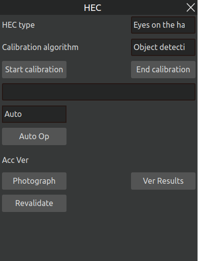

Quick Start
=============

.. toctree:: 
    :maxdepth: 5

This chapter will take an actual welding project as an example to introduce how to control the robot to start the welding work quickly. Figure 3-1 and Figure 3-2 shows the welding preparation, where Figure 3-1 shows the workpiece to be welded and Figure 3-2 shows the robot and the workpiece.

.. figure:: quick_start/1.png
	:align: center
	:width: 3in

.. centered:: Figure 3-1  Workpiece to be Welded
 
.. figure:: quick_start/2.png
	:align: center
	:width: 3in
   
.. centered:: Figure 3-2  Robot + Workpiece  

3D MVC Product Description
---------------------------------
This High-Precision 3D Camera utilizes grating-structured light projection and binocular stereo vision algorithms to reconstruct high-fidelity 3D point cloud data of objects, meeting industrial-grade requirements for high resolution and submillimeter measurement accuracy. Compact in size yet featuring a large depth of field and exceptional measurement precision, the system is designed for applications in industrial automation, robotics, and 3D object reconstruction.

.. figure:: quick_start/3.png
	:align: center
	:width: 2in

.. centered:: Figure 3-3  Standard version

.. figure:: quick_start/4.png
	:align: center
	:width: 3in

.. centered:: Figure 3-4  Version with protective cover

Key Features：

- Welding Robot Integration: Compatible with mainstream welding robots for complex weld seam feature extraction, trajectory guidance, and workpiece alignment.

- Advanced Imaging Algorithm: Achieves 0.2mm repeatability in Z-axis; employs binocular structured light technology for submillimeter-accurate image acquisition.

- Multi-Frame Fusion: Mitigates reflections on metallic surfaces for reliable data.

- Optimized Projection Module: Combines high-efficiency projection with precise exposure control for stable performance.

- Robust Anti-Noise Capability: Delivers clear point clouds even for low-reflectivity or dark surfaces.

- Non-Contact Measurement: Ensures zero damage to target objects.

- Pre-Calibrated & Plug-and-Play: Factory-optimized settings eliminate user-side calibration.

- Industrial-Grade Design:Fully enclosed aluminum alloy housing for durability；multi-mounting holes for flexible deployment.

Technical Specifications：

- Working Distance: 350mm~1100mm.

- Compact & Lightweight: High-strength body for easy integration.

- High-Speed Imaging: Optimized for high-temperature environments (spark-resistant front cover included).

- No-Teach Welding Path Generation: Enables autonomous operation without pre-programming.

System Requirements
~~~~~~~~~~~~~~~~~~~~~~~
- OS: Windows 10.0 or later / Ubuntu 18.04 or later

- CPU: 1.8GHz base clock or higher

- RAM: 8GB or more (recommended)

Product parameters
~~~~~~~~~~~~~~~~~~~~~~~

.. centered:: Table 3-1  Product Parameters
.. image:: quick_start/表3-1.png
	:align: center
	:width: 5in

Field of view measurement range
~~~~~~~~~~~~~~~~~~~~~~~~~~~~~~~~~~~~~~~

.. figure:: quick_start/5.png
	:align: center
	:width: 2.5in

.. centered:: Figure 3-5  Field of view measurement range

Structural drawings
~~~~~~~~~~~~~~~~~~~~~~~~~~~
Standard version:

.. centered:: Figure 3-6  Standard version structural dimensions

Version with protective cover (optional):

.. figure:: quick_start/7.png
	:align: center
	:width: 6in

.. centered:: Figure 3-7  Version with protective cover (optional) structural dimensions

Communication interface
~~~~~~~~~~~~~~~~~~~~~~~~~~~
Camera power interface

1. Body power socket (8pin)

.. centered:: Table 3-2  Power socket on the body (8pin)
.. image:: quick_start/表3-2.png
	:align: center
	:width: 5in

2. 8-pin power cable

.. centered:: Table 3-3  Power cable (8pin)
.. image:: quick_start/表3-3.png
	:align: center
	:width: 5in

Camera communication control interface

1. POE Ethernet port socket on the body (12pin)

.. centered:: Table 3-4  POE network port on the body (12pin)
.. image:: quick_start/表3-4.png
	:align: center
	:width: 5in

2. POE Ethernet cable (12pin)
   
.. centered:: Table 3-5  POE network cable (12pin)
.. image:: quick_start/表3-5.png
	:align: center
	:width: 5in

Camera protective cover external control interface

1. Protective cover outer control seat (4pin)

.. centered:: Table 3-6  Protective cover external control seat (4pin)
.. image:: quick_start/表3-6.png
	:align: center
	:width: 5in

2. Protective cover external control cable (4pin)

.. centered:: Table 3-7  Protective cover external control cable (4pin)
.. image:: quick_start/表3-7.png
	:align: center
	:width: 5in

Camera installation
~~~~~~~~~~~~~~~~~~~~~~~~~~~
Protective cover installation:

1. Remove the M5 plug from the camera's upper housing to expose the cable entry port.

2. Secure the cover using four M3×12 hex socket head cap screws, aligning them with the corresponding mounting holes on the camera housing.

.. figure:: quick_start/8.png
	:align: center
	:width: 2.5in

.. centered:: Figure 3-8  Protective cover installation diagram 

Camera installation instructions:

.. figure:: quick_start/9.png
	:align: center
	:width: 5in

.. centered:: Figure 3-9  Camera installation diagram

.. figure:: quick_start/10.png
	:align: center
	:width: 5in

.. centered:: Figure 3-10  Recommended fixing plate size

Installation Requirements:

.. centered:: Table 3-8  Installation Requirements
.. image:: quick_start/表3-8.png
	:align: center
	:width: 5in

Usage Instructions and Precautions:

- It is recommended to use the default resolution to reduce power-on initialization time and minimize time consumption.

- If the camera disconnects unexpectedly, check whether the network cable and power cable are loose, ensure the software is running properly, or restart the camera.
 
- Follow the instructions for proper operation, as improper handling may damage internal components.
 
- Do not look directly into the projector after powering on to avoid eye discomfort.

- Do not use other heat sources to heat the device.
   
- Do not modify or disassemble the device in any way, as this may cause damage and reduce accuracy.
 
- Avoid dropping or hitting the device to prevent internal component damage and accuracy degradation.

- Do not touch the lens to avoid affecting image quality.

- It is normal for the device to become warm after running for a period of time.

Equipment Installation
------------------------
The camera and torch are mounted on the end of the robot via connectors as shown in Figure 3-11.

.. figure:: quick_start/11.png
	:align: center
	:width: 3in

.. centered:: Figure 3-11  Mounting the Camera and Torch

.. important:: 
    Please make sure to install it firmly, otherwise the accuracy will be affected.

Tool Coordinate System Calibration
---------------------------------------
Open the browser and visit the target URL 192.168.58.2, enter your username and password and click Login to log in to the FR Teacher Software. Click "Initial Settings"-"Robot Settings"-"Tool Coordinates" on the left side of the interface to enter the tool coordinates interface. interface.

The "Tool Coordinate" interface is used for modifying, clearing and applying the coordinate system of the tool. There are 15 numbers in the drop-down list of the tool coordinate system name, toolcoord0-toolcoord14 (the name of the coordinate system can be customized), and after selecting the corresponding coordinate system, the corresponding coordinate value (representing the offset of the end of the currently used tool relative to the center of the robot base), tool type and mounting position (only displayed under the sensor type tool) will be displayed in the coordinate text box below.

After selecting a certain coordinate system and clicking on the "Apply" button, the coordinate system of the currently used tool will be changed to the selected coordinates, as shown in Figure 3-12.

.. figure:: quick_start/12.png
	:align: center
	:width: 3.5in

.. centered:: Figure 3-12  Setting Tool Coordinates

If you need to reset a tool coordinate system, click the "Modify" button in Figure 3-12 to enter the tool calibration, as shown in Figure 3-13. Tool calibration methods are divided into four-point method and six-point method, four-point method only calibrates the tool TCP, that is, the location of the center point of the tool, the attitude default and the end flange attitude; six-point method in the four-point method on the basis of the addition of two points, used to calibrate the attitude of the tool. The six-point method is introduced here as an example.

.. figure:: quick_start/13.png
	:align: center
	:width: 4in

.. centered:: Figure 3-13  Tool Calibration-Four-Point and Six-Point Methods

Step1: Choose a fixed point in the robot space, move the tool to the fixed point in three different attitudes, and set the points in Figures 3-14 in turn ①②③;

Step2: Move the tool vertically to the position shown at the top right in Figure 3-14, set as a fixed point ④ ;

Step3: Keep the stance unchanged and use the base marker to move a distance horizontally to set a fixed point ⑤ The direction is the positive direction of the X-axis of the tool coordinate system set;

Step4: Return to the fixed point ④ Move vertically up a distance and set it as the fixed point ⑥, the direction is the positive direction of the Z-axis of the tool coordinate system. The direction is the positive direction of the Z-axis of the tool coordinate system (the positive direction of the Y-axis of the tool coordinate system is determined by the right-hand rule);

Step5: Click the "Calculate" button in Figure 3-14 to calculate the tool coordinate system;

Step6: If you need to reset, click the "Cancel" button in Figure 3-13 to calibrate the new tool coordinate system; if you don't need to reset, click "Save" in Figure 3-13 to store the tool coordinate system.

.. figure:: quick_start/14.png
	:align: center
	:width: 3in

.. centered:: Figure 3-14  Six-Point Method Tool Calibration Steps

Import Engineering
---------------------
Open the AIRLab software, as shown in the figure, click "New" or "Project" to quickly create or open a new project file.

.. figure:: quick_start/15.png
	:align: center
	:width: 6in

.. centered:: Figure 3-15  Select Project Import

Point Cloud Camera Hand-Eye Calibration
-----------------------------------------------
The purpose of this step is to calibrate the relative positions of the camera and the robot as follows:

- Step1: Place the calibration plate; place the calibration plate right below the camera 50-80 cm away from the camera, as shown in Figure 3-16. Switch the AIRLab main display box to the camera display, as shown in Figure 3-17.

.. figure:: quick_start/16.png
	:align: center
	:width: 3in

.. centered:: Figure 3-16  Placement of the calibration board

.. figure:: quick_start/17.png
	:align: center
	:width: 6in

.. centered:: Figure 3-17  AIRLab Software-Camera Display

- Step2: Connect camera.Click the "Import Module" on the right side, then select the camera. Upon entering the "Camera Settings" pop-up window, simply click the "Search Devices" button. AIRLab will automatically scan and connect to successfully linked camera devices, if the camera is successfully connected to AIRLab. If the connection fails, AIRLab will display "Not Connected." In such cases, please manually verify whether the camera is properly connected.

.. centered:: Figure 3-18  Camera settings page

.. figure:: quick_start/19.png
	:align: center
	:width: 2.5in

.. centered:: Figure 3-19  Camera connection successful

Click "Device Debugging" in the pop-up window, then select the "Hand-Eye Calibration" button.

.. centered:: Figure 3-20  Device Debugging - HEC

The AIRLab interface will display the hand-eye calibration page as shown in the figure.

.. centered:: Figure 3-21  Hand-eye calibration page 

After selecting the type of hand-eye calibration and the calibration algorithm, click the “Calibration Start” button to indicate that the hand-eye calibration is now started. Select the operation mode, including “automatic” and “manual” operation mode. The automatic operation mode is described below.

1. After selecting the operation mode as “Auto” and clicking the “Auto Op” button, the software will start to calibrate the hand and eye automatically, and the camera will emit blue light during the process of taking pictures, which is normal shooting.

.. figure:: quick_start/22.png
	:align: center
	:width: 3.5in

.. centered:: Figure 3-22  Point cloud camera hand-eye calibration

.. figure:: quick_start/23.png
	:align: center
	:width: 5in

.. centered:: Figure 3-23  Point cloud calibration results

2. The camera will automatically calibrate the process will take 8 photos, calibration will be prompted after the end of the calibration of the calibration success or failure, prompted by the calibration of the success of the next step, prompted by the calibration of the failure of the calibration need to click on the “Auto Op” to re-run the calibration.

3. After this round of camera calibration, you can change the position of the calibration board and click the “Auto Op” button again for the next round of calibration. The purpose of this step is to improve the accuracy of the system, you can choose to calibrate for 3~5 rounds, and the system will choose the coordinate system with the highest accuracy to use;

4. Click the “Calibration End” button to end the point cloud camera hand-eye calibration;

- Step3: Verify the accuracy; randomly select a location to place the calibration plate, click on the “Photography” button, keep the calibration plate position unchanged, move the robot three times to take three photos, click on the “Verify Result” button, a pop-up window will appear as shown in Figure 3-24. The four points in the pop-up window are the coordinates of the four fixed points on the calibration board. By clicking on the button “Move to point 1”, the robot is moved to the specified position on the calibration board, and then the integrated error is obtained.

.. figure:: quick_start/24.png
	:align: center
	:width: 3.5in

.. centered:: Figure 3-24  Authentication Results-Pop-up Window

If you need to re-verify, you need to click the “Revalidate” button to clear the error and then carry out the above verification process again. A combined error value in the range of 0.5 to 1.0 indicates a good hand-eye calibration result, while a value in the range of 1.0 to 1.5 indicates a lesser calibration result. Other results represent poor results for this calibration and require recalibration.

Start Running
-------------------
After completing the above steps, the robot can be controlled to start the welding task, which is divided into four main steps.

- Step1: Get the ground equations as follows

  Select "Camera Settings - Device Debugging", click "Capture Ground" button, and the photo will be taken successfully,then click “Get Ground Equation” ,then click “GrndEffVerif” button view the ground fitting effect; If the ground fitting effect is normal, proceed to the next step; Otherwise, it may need to be recalibrated.

- Step2: Edit the weld seams and determine the list of weld seams, please refer to 4.5.3 Weld Seam Editing for detailed operation.

- Step3:  Set the program configuration mode, as in Figure 3-25. 

.. important::
    users need to set this parameter according to the actual need before running the program, the specific meaning of the parameter is shown in 4.6.9 Program Configuration.

.. figure:: quick_start/25.png
	:align: center
	:width: 3in

.. centered:: Figure 3-25  Setup Program Configuration

- Step4: After the configuration is completed, click one button to run, the program will start from the “workpiece positioning” until the welding is completed.